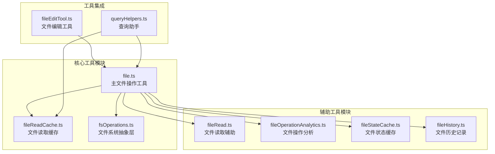
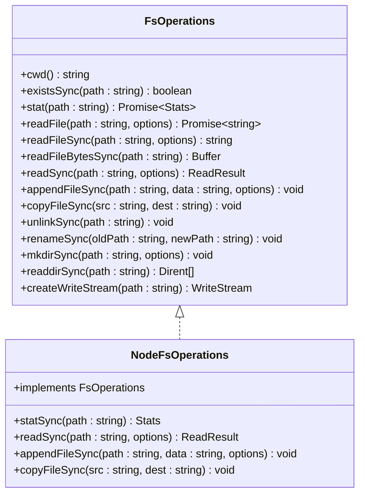
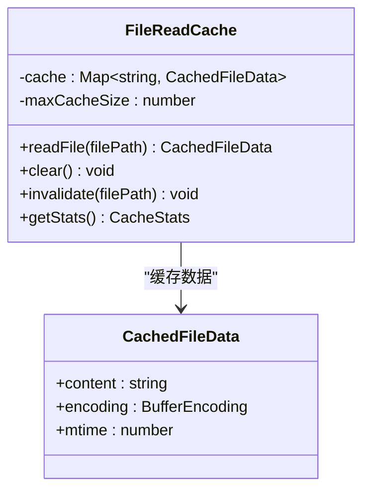
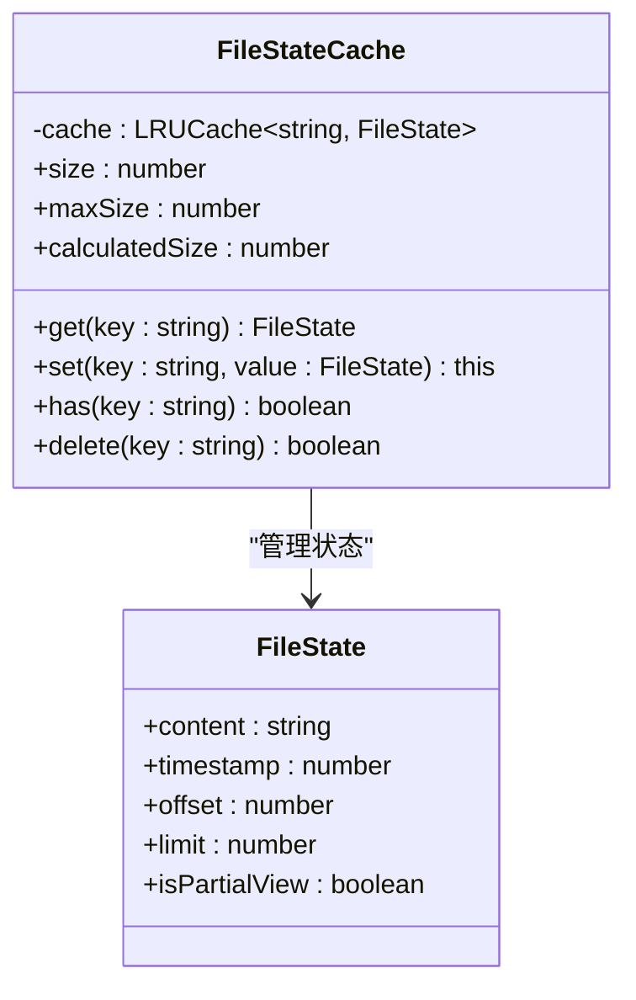
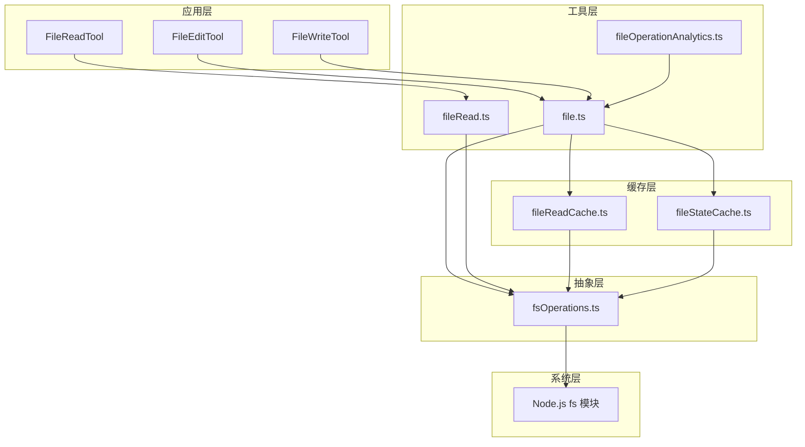
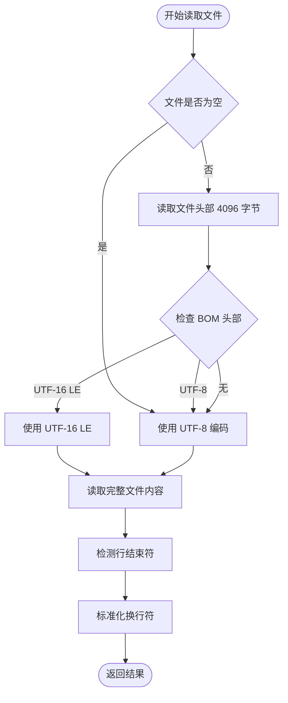
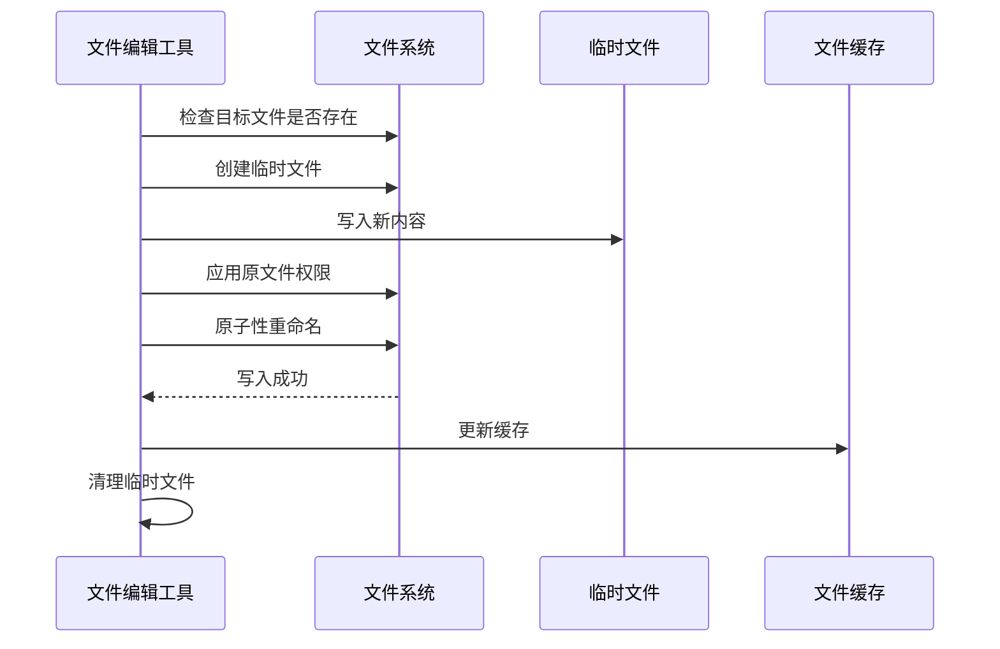
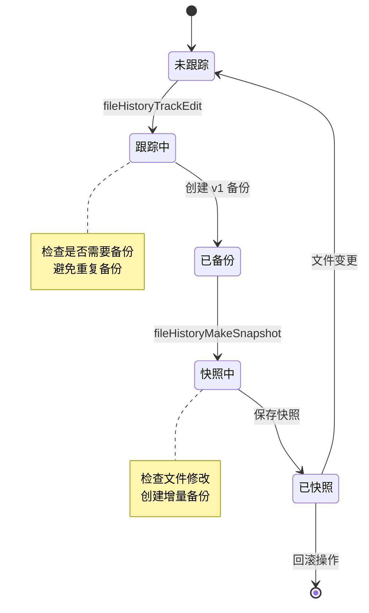
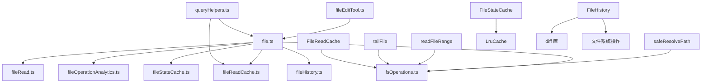

# 文件操作工具

<cite>
**本文档引用的文件**
- [file.ts](file://src/utils/file.ts)
- [fileReadCache.ts](file://src/utils/fileReadCache.ts)
- [fsOperations.ts](file://src/utils/fsOperations.ts)
- [fileRead.ts](file://src/utils/fileRead.ts)
- [fileOperationAnalytics.ts](file://src/utils/fileOperationAnalytics.ts)
- [fileStateCache.ts](file://src/utils/fileStateCache.ts)
- [fileHistory.ts](file://src/utils/fileHistory.ts)
- [fileEditTool.ts](file://src/tools/FileEditTool/fileEditTool.ts)
- [queryHelpers.ts](file://src/utils/queryHelpers.ts)
</cite>

## 目录
1. [简介](#简介)
2. [项目结构](#项目结构)
3. [核心组件](#核心组件)
4. [架构概览](#架构概览)
5. [详细组件分析](#详细组件分析)
6. [依赖关系分析](#依赖关系分析)
7. [性能考虑](#性能考虑)
8. [故障排除指南](#故障排除指南)
9. [结论](#结论)
10. [附录](#附录)

## 简介

文件操作工具是 Claude Code 代码编辑器中用于处理文件系统操作的核心模块。该工具集提供了完整的文件读取、写入、缓存和分析功能，支持多种编码格式检测、行结束符处理、文件历史记录和性能监控。

本工具集主要包含以下核心功能：
- 文件读取：支持多种编码格式检测和行结束符识别
- 文件写入：提供原子性写入和权限管理
- 缓存机制：内存缓存和文件状态缓存双重保护
- 分析工具：文件操作统计和性能监控
- 历史记录：文件变更跟踪和回滚功能

## 项目结构

文件操作工具分布在多个关键目录中：



**图表来源**
- [file.ts:1-585](file://src/utils/file.ts#L1-L585)
- [fileReadCache.ts:1-97](file://src/utils/fileReadCache.ts#L1-L97)
- [fsOperations.ts:1-771](file://src/utils/fsOperations.ts#L1-L771)

**章节来源**
- [file.ts:1-50](file://src/utils/file.ts#L1-L50)
- [fsOperations.ts:18-123](file://src/utils/fsOperations.ts#L18-L123)

## 核心组件

### 文件系统抽象层 (FsOperations)

FsOperations 接口提供了统一的文件系统操作抽象，支持同步和异步操作：



**图表来源**
- [fsOperations.ts:23-123](file://src/utils/fsOperations.ts#L23-L123)
- [fsOperations.ts:384-603](file://src/utils/fsOperations.ts#L384-L603)

### 文件读取缓存机制

FileReadCache 提供了基于修改时间的智能缓存机制：



**图表来源**
- [fileReadCache.ts:14-96](file://src/utils/fileReadCache.ts#L14-L96)

### 文件状态缓存

FileStateCache 使用 LRU 算法管理文件状态，支持大小限制：



**图表来源**
- [fileStateCache.ts:30-93](file://src/utils/fileStateCache.ts#L30-L93)

**章节来源**
- [fileReadCache.ts:10-96](file://src/utils/fileReadCache.ts#L10-L96)
- [fileStateCache.ts:24-93](file://src/utils/fileStateCache.ts#L24-L93)

## 架构概览

文件操作工具的整体架构采用分层设计，从底层文件系统抽象到上层业务逻辑：



**图表来源**
- [fileEditTool.ts:86-595](file://src/tools/FileEditTool/fileEditTool.ts#L86-L595)
- [file.ts:1-50](file://src/utils/file.ts#L1-L50)

## 详细组件分析

### 文件读取功能

文件读取功能提供了多种读取方式和智能编码检测：

#### 同步读取函数
- `readFileSyncCached`: 使用缓存的文件读取
- `readFileSync`: 基础文件读取
- `readFileSyncWithMetadata`: 返回内容、编码和行结束符信息

#### 编码检测机制


**图表来源**
- [fileRead.ts:20-98](file://src/utils/fileRead.ts#L20-L98)

#### 行结束符检测
- 支持 CRLF 和 LF 两种格式
- 通过统计换行符数量确定主要格式
- 保持原始行结束符信息用于写回操作

**章节来源**
- [fileRead.ts:18-103](file://src/utils/fileRead.ts#L18-L103)
- [file.ts:100-135](file://src/utils/file.ts#L100-L135)

### 文件写入功能

文件写入功能提供了安全的原子性写入和权限管理：

#### 写入流程


**图表来源**
- [file.ts:362-478](file://src/utils/file.ts#L362-L478)

#### 权限管理
- 自动检测和保留原文件权限
- 支持新文件的权限设置
- 处理符号链接的特殊处理

**章节来源**
- [file.ts:362-478](file://src/utils/file.ts#L362-L478)

### 文件缓存机制

#### 读取缓存 (FileReadCache)
- 基于文件路径和修改时间的复合键
- 自动失效机制（文件修改时）
- 最大缓存大小限制（1000项）

#### 状态缓存 (FileStateCache)
- LRU 算法管理
- 基于内容大小的内存计算
- 默认 25MB 大小限制

**章节来源**
- [fileReadCache.ts:14-96](file://src/utils/fileReadCache.ts#L14-L96)
- [fileStateCache.ts:30-93](file://src/utils/fileStateCache.ts#L30-L93)

### 文件历史记录

文件历史记录功能提供了完整的文件变更跟踪：



**图表来源**
- [fileHistory.ts:86-193](file://src/utils/fileHistory.ts#L86-L193)

**章节来源**
- [fileHistory.ts:80-200](file://src/utils/fileHistory.ts#L80-L200)

### 文件操作分析

#### 性能监控
- 文件操作事件日志
- 内容哈希生成（最大 100KB）
- 路径哈希（16字符截断）用于隐私保护

#### 统计分析
- 文件扩展名提取和清理
- 操作类型分类（读、写、编辑）
- 工具使用统计

**章节来源**
- [fileOperationAnalytics.ts:37-72](file://src/utils/fileOperationAnalytics.ts#L37-L72)

## 依赖关系分析

文件操作工具之间的依赖关系如下：



**图表来源**
- [file.ts:20-29](file://src/utils/file.ts#L20-L29)
- [fsOperations.ts:138-178](file://src/utils/fsOperations.ts#L138-L178)

**章节来源**
- [file.ts:20-29](file://src/utils/file.ts#L20-L29)
- [fsOperations.ts:138-178](file://src/utils/fsOperations.ts#L138-L178)

## 性能考虑

### 缓存策略
1. **读取缓存优化**
   - 基于修改时间的自动失效
   - 最大缓存大小限制防止内存泄漏
   - 避免重复文件读取操作

2. **状态缓存优化**
   - LRU 算法确保最近使用的文件优先
   - 基于内容大小的内存计算
   - 默认 25MB 限制防止内存膨胀

### I/O 操作优化
1. **原子性写入**
   - 使用临时文件避免部分写入
   - 原子性重命名减少文件损坏风险
   - 自动权限继承保持文件属性

2. **批量操作**
   - 合并相似文件操作
   - 减少文件系统调用次数
   - 异步操作避免阻塞主线程

### 错误处理
1. **网络文件系统兼容**
   - UNC 路径检测和处理
   - 符号链接安全解析
   - 特殊文件类型防护

2. **资源管理**
   - 自动清理临时文件
   - 文件描述符正确关闭
   - 内存使用监控和限制

## 故障排除指南

### 常见问题及解决方案

#### 文件读取失败
1. **症状**: 文件读取抛出异常
2. **原因**: 权限不足、文件不存在、符号链接问题
3. **解决**: 
   - 检查文件权限和存在性
   - 使用 `safeResolvePath` 处理符号链接
   - 验证文件编码检测结果

#### 文件写入失败
1. **症状**: 写入操作中断或文件损坏
2. **原因**: 磁盘空间不足、权限问题、并发写入
3. **解决**:
   - 检查磁盘空间和权限
   - 使用原子性写入机制
   - 避免并发文件写入

#### 缓存相关问题
1. **症状**: 缓存数据过期但未更新
2. **原因**: 修改时间戳不准确、缓存失效机制问题
3. **解决**:
   - 检查文件系统时间精度
   - 手动清除相关缓存条目
   - 监控缓存命中率

**章节来源**
- [file.ts:50-58](file://src/utils/file.ts#L50-L58)
- [fileReadCache.ts:25-33](file://src/utils/fileReadCache.ts#L25-L33)

### 调试技巧

#### 性能分析
1. **慢操作监控**
   - 使用 `slowLogging` 包装文件系统调用
   - 监控长时间运行的操作
   - 识别性能瓶颈

2. **内存使用分析**
   - 监控缓存大小和使用情况
   - 检查内存泄漏迹象
   - 优化缓存策略

#### 日志记录
1. **调试日志**
   - 启用详细的文件操作日志
   - 记录文件路径和操作类型
   - 追踪符号链接解析过程

2. **错误报告**
   - 收集完整的错误上下文
   - 记录文件系统状态
   - 提供修复建议

## 结论

文件操作工具提供了完整的文件系统抽象和优化机制，具有以下特点：

1. **安全性**: 原子性写入、权限管理和符号链接安全处理
2. **性能**: 智能缓存机制、批量操作和异步处理
3. **可靠性**: 完整的错误处理、资源管理和监控机制
4. **可维护性**: 清晰的分层架构、模块化设计和详细文档

该工具集为 Claude Code 提供了稳定可靠的文件操作基础，支持复杂的编辑器功能需求。

## 附录

### 使用示例

#### 基本文件读取
```typescript
// 使用缓存读取文件
const content = readFileSyncCached('/path/to/file');

// 获取文件元数据
const { content, encoding, lineEndings } = readFileSyncWithMetadata('/path/to/file');
```

#### 文件写入操作
```typescript
// 写入文本内容
writeTextContent('/path/to/file', content, 'utf8', 'LF');

// 使用工具进行文件编辑
const result = await FileEditTool.call({
  file_path: '/path/to/file',
  old_string: 'old content',
  new_string: 'new content'
});
```

#### 缓存管理
```typescript
// 清除特定文件缓存
fileReadCache.invalidate('/path/to/file');

// 获取缓存统计信息
const stats = fileReadCache.getStats();

// 创建带大小限制的状态缓存
const stateCache = createFileStateCacheWithSizeLimit(100, 25 * 1024 * 1024);
```

### 最佳实践

1. **性能优化**
   - 优先使用缓存读取
   - 避免频繁的文件系统调用
   - 合理设置缓存大小限制

2. **错误处理**
   - 始终捕获和处理文件操作异常
   - 提供用户友好的错误信息
   - 实现适当的重试机制

3. **资源管理**
   - 及时清理临时文件
   - 监控内存使用情况
   - 避免文件描述符泄漏