# 路径处理工具

<cite>
**本文档引用的文件**
- [src/utils/path.ts](file://src/utils/path.ts)
- [src/utils/windowsPaths.ts](file://src/utils/windowsPaths.ts)
- [src/utils/platform.ts](file://src/utils/platform.ts)
- [src/utils/fsOperations.ts](file://src/utils/fsOperations.ts)
- [src/utils/cwd.ts](file://src/utils/cwd.ts)
- [src/memdir/paths.ts](file://src/memdir/paths.ts)
- [src/utils/permissions/pathValidation.ts](file://src/utils/permissions/pathValidation.ts)
- [src/utils/sessionStoragePortable.ts](file://src/utils/sessionStoragePortable.ts)
- [src/utils/memoize.ts](file://src/utils/memoize.ts)
</cite>

## 目录
1. [简介](#简介)
2. [项目结构](#项目结构)
3. [核心组件](#核心组件)
4. [架构概览](#架构概览)
5. [详细组件分析](#详细组件分析)
6. [依赖关系分析](#依赖关系分析)
7. [性能考虑](#性能考虑)
8. [故障排除指南](#故障排除指南)
9. [结论](#结论)

## 简介

本文档详细介绍了 Claude Code 项目中的路径处理工具系统。该系统提供了跨平台的路径操作功能，包括路径解析、拼接、规范化等核心功能，同时专门处理了 Windows 平台的路径特殊需求。

该工具系统主要包含以下关键特性：
- 跨平台路径处理和转换
- 工作目录管理和工作树路径获取
- Windows 路径特殊处理机制
- 安全的路径验证和权限检查
- 性能优化的缓存机制

## 项目结构

路径处理工具分布在多个核心模块中，形成了完整的跨平台路径处理体系：

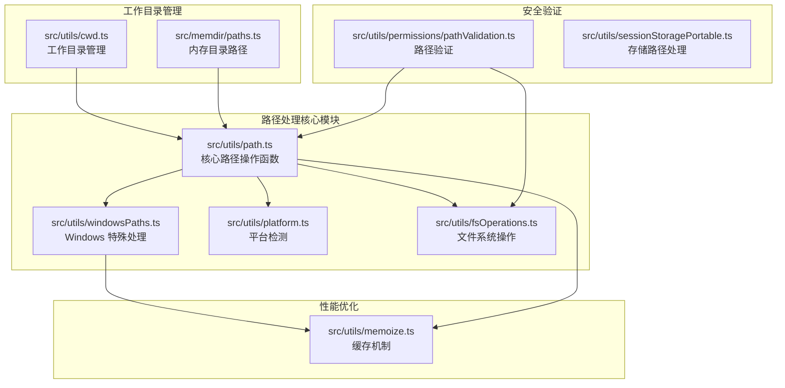

**图表来源**
- [src/utils/path.ts:1-156](file://src/utils/path.ts#L1-L156)
- [src/utils/windowsPaths.ts:1-174](file://src/utils/windowsPaths.ts#L1-L174)
- [src/utils/platform.ts:1-151](file://src/utils/platform.ts#L1-L151)

## 核心组件

### 路径扩展器 (expandPath)

核心的路径扩展函数提供了强大的路径解析能力：

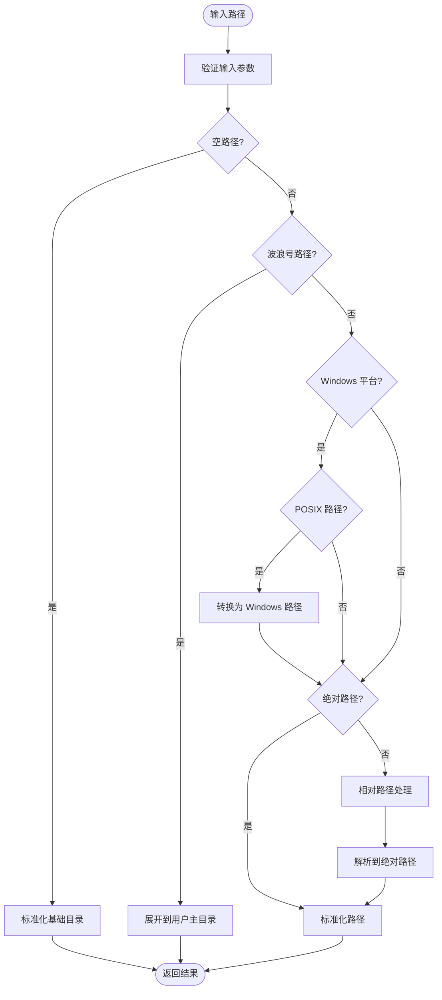

**图表来源**
- [src/utils/path.ts:32-85](file://src/utils/path.ts#L32-L85)

### 目录获取器 (getDirectoryForPath)

智能目录识别功能，能够区分文件和目录：

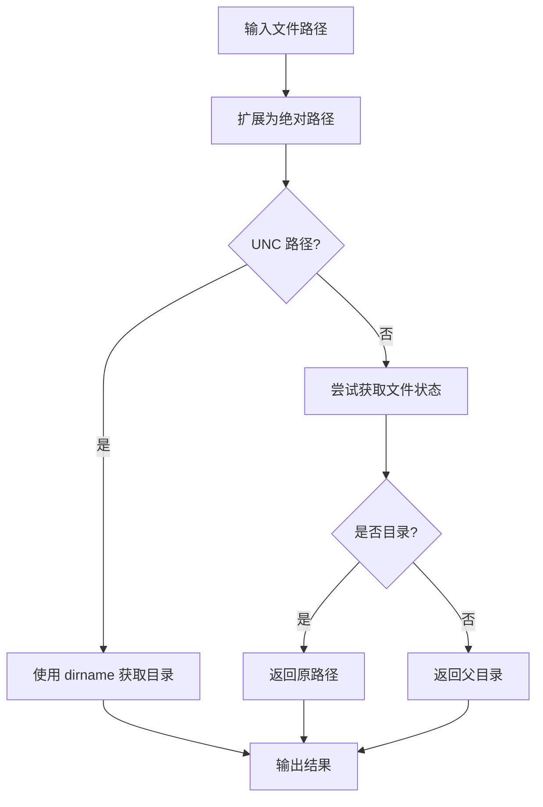

**图表来源**
- [src/utils/path.ts:109-125](file://src/utils/path.ts#L109-L125)

### Windows 路径转换器

专门处理 Windows 平台的路径格式转换：

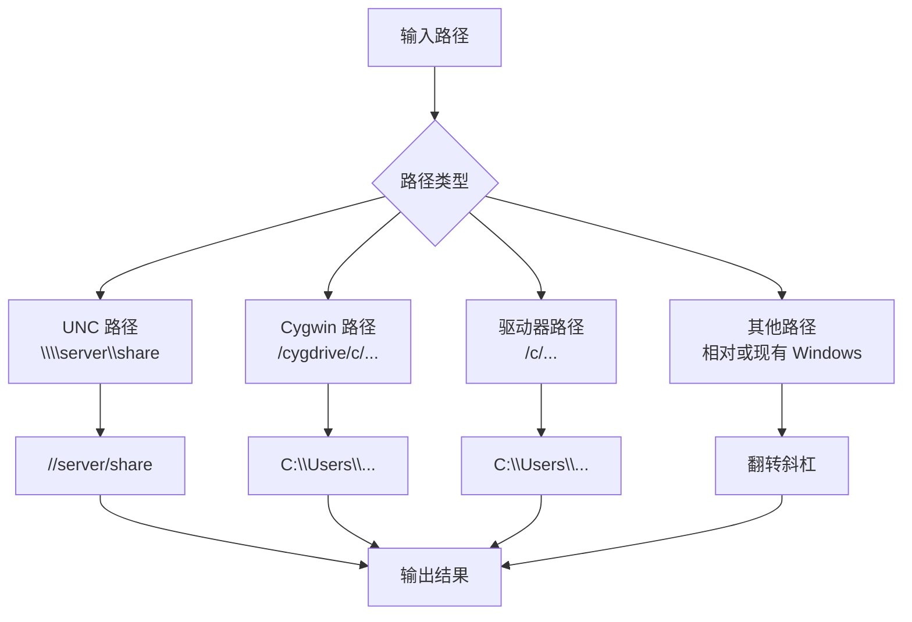

**图表来源**
- [src/utils/windowsPaths.ts:147-173](file://src/utils/windowsPaths.ts#L147-L173)

**章节来源**
- [src/utils/path.ts:1-156](file://src/utils/path.ts#L1-L156)
- [src/utils/windowsPaths.ts:1-174](file://src/utils/windowsPaths.ts#L1-L174)

## 架构概览

路径处理系统的整体架构体现了清晰的关注点分离：

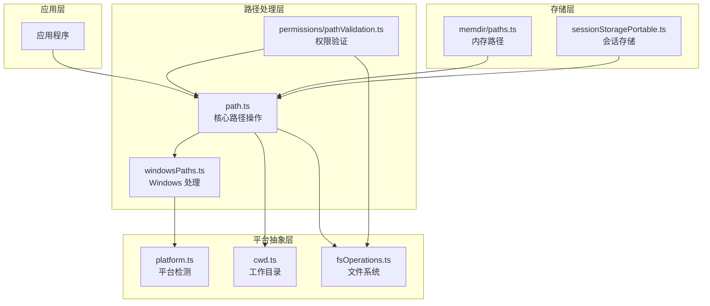

**图表来源**
- [src/utils/path.ts:1-156](file://src/utils/path.ts#L1-L156)
- [src/utils/permissions/pathValidation.ts:1-486](file://src/utils/permissions/pathValidation.ts#L1-L486)

## 详细组件分析

### 核心路径操作函数

#### expandPath 函数详解

expandPath 是整个路径处理系统的核心，提供了以下功能：

1. **输入验证**：确保路径和基础目录都是字符串类型
2. **安全检查**：防止空字节注入攻击
3. **波浪号扩展**：支持 `~` 和 `~/` 的用户主目录扩展
4. **平台适配**：自动处理 Windows POSIX 路径格式
5. **路径标准化**：统一返回本机平台的路径格式

#### toRelativePath 函数

用于将绝对路径转换为相对于当前工作目录的路径，以节省令牌消耗：

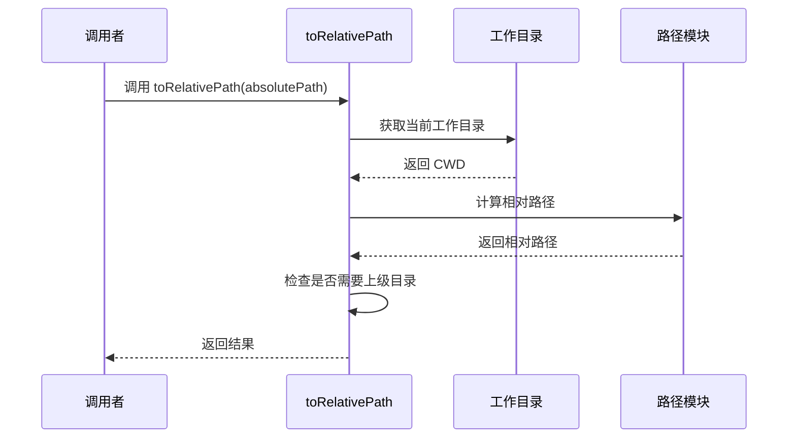

**图表来源**
- [src/utils/path.ts:95-99](file://src/utils/path.ts#L95-L99)

#### getDirectoryForPath 函数

智能目录识别功能，结合文件系统操作：

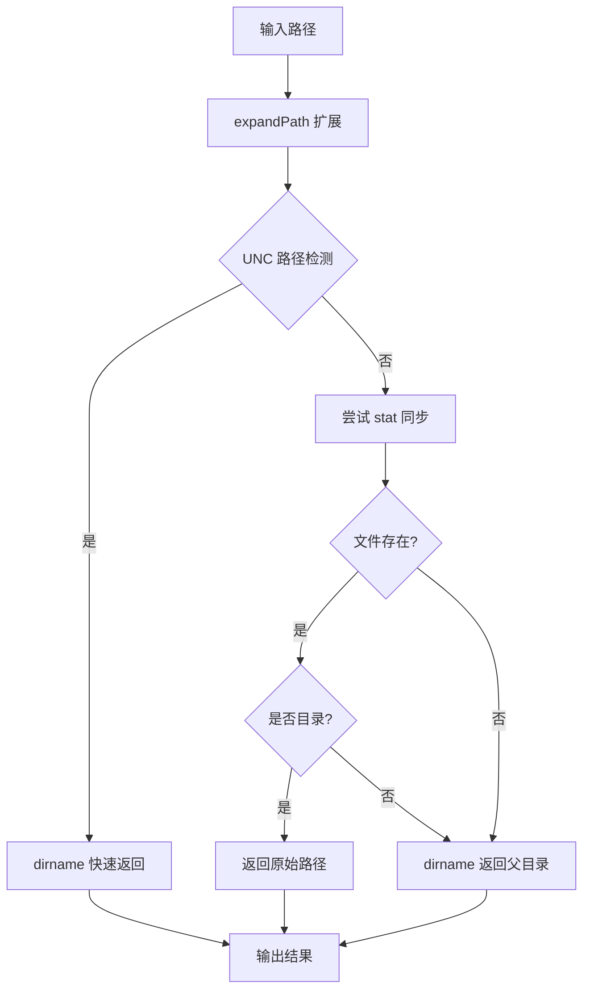

**图表来源**
- [src/utils/path.ts:109-125](file://src/utils/path.ts#L109-L125)

**章节来源**
- [src/utils/path.ts:87-156](file://src/utils/path.ts#L87-L156)

### Windows 特殊处理机制

#### 路径格式转换

WindowsPaths 模块提供了三种主要的路径格式转换：

1. **UNC 路径处理**：`\\server\share` → `//server/share`
2. **驱动器路径转换**：`/c/Users/...` → `C:\Users\...`
3. **Cygwin 兼容性**：`/cygdrive/c/...` → `C:\Users\...`

#### 安全执行环境

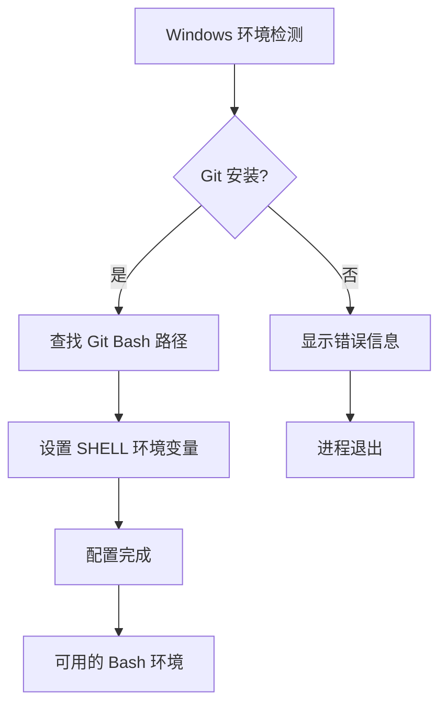

**图表来源**
- [src/utils/windowsPaths.ts:87-125](file://src/utils/windowsPaths.ts#L87-L125)

**章节来源**
- [src/utils/windowsPaths.ts:1-174](file://src/utils/windowsPaths.ts#L1-L174)

### 工作目录管理

#### 异步本地存储

cwd 模块使用 AsyncLocalStorage 实现了线程安全的工作目录管理：

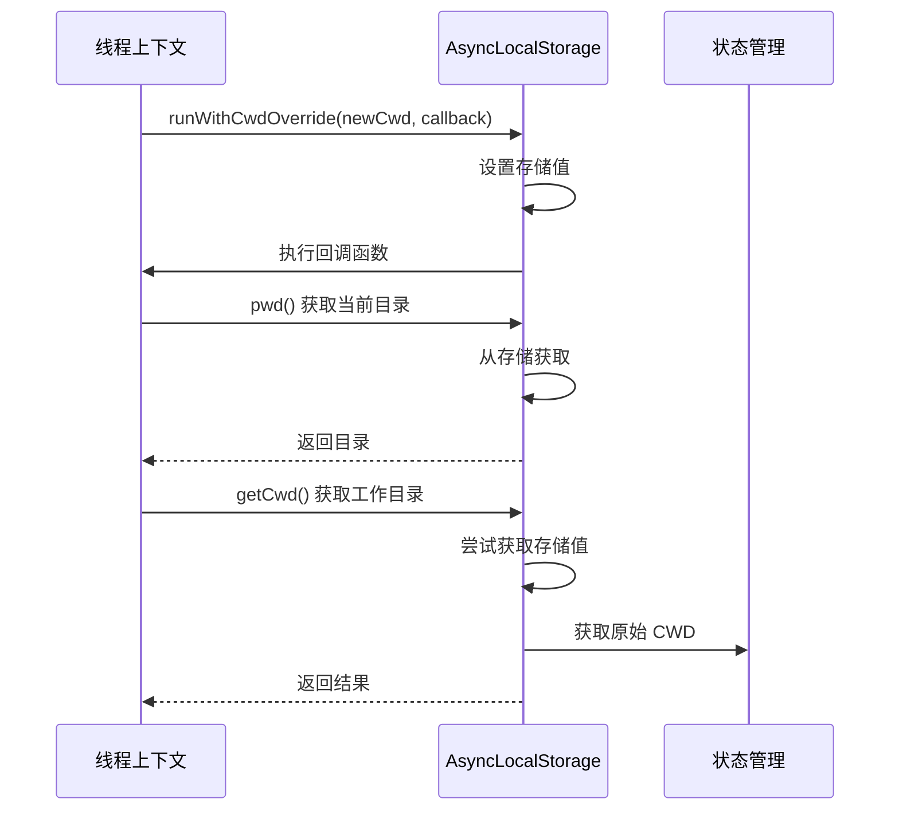

**图表来源**
- [src/utils/cwd.ts:12-32](file://src/utils/cwd.ts#L12-L32)

#### 内存目录路径管理

memdir/paths 模块提供了智能的内存目录管理：

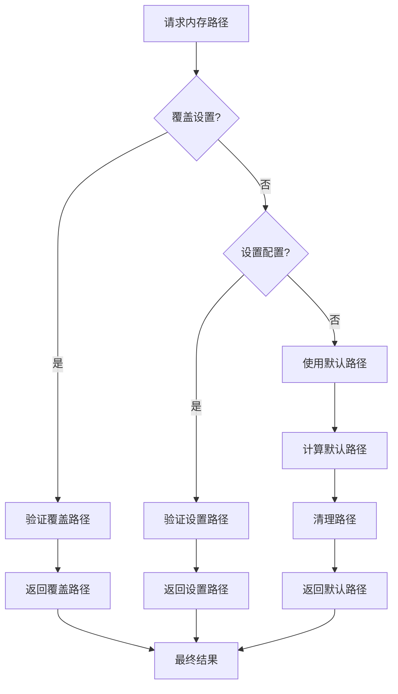

**图表来源**
- [src/memdir/paths.ts:223-235](file://src/memdir/paths.ts#L223-L235)

**章节来源**
- [src/utils/cwd.ts:1-33](file://src/utils/cwd.ts#L1-L33)
- [src/memdir/paths.ts:1-279](file://src/memdir/paths.ts#L1-L279)

### 权限验证系统

#### 路径安全性检查

pathValidation 模块提供了多层次的安全验证：

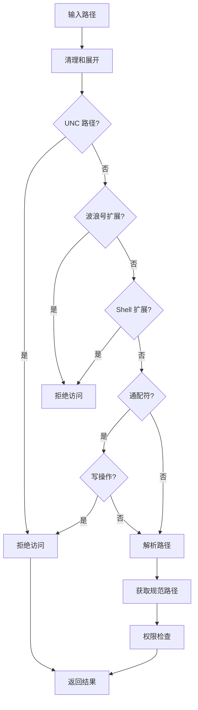

**图表来源**
- [src/utils/permissions/pathValidation.ts:373-485](file://src/utils/permissions/pathValidation.ts#L373-L485)

**章节来源**
- [src/utils/permissions/pathValidation.ts:1-486](file://src/utils/permissions/pathValidation.ts#L1-L486)

### 性能优化策略

#### 缓存机制

memoize 模块提供了多种缓存策略：

1. **TTL 缓存**：基于时间的缓存失效
2. **LRU 缓存**：最近最少使用算法
3. **异步缓存**：支持并发请求去重

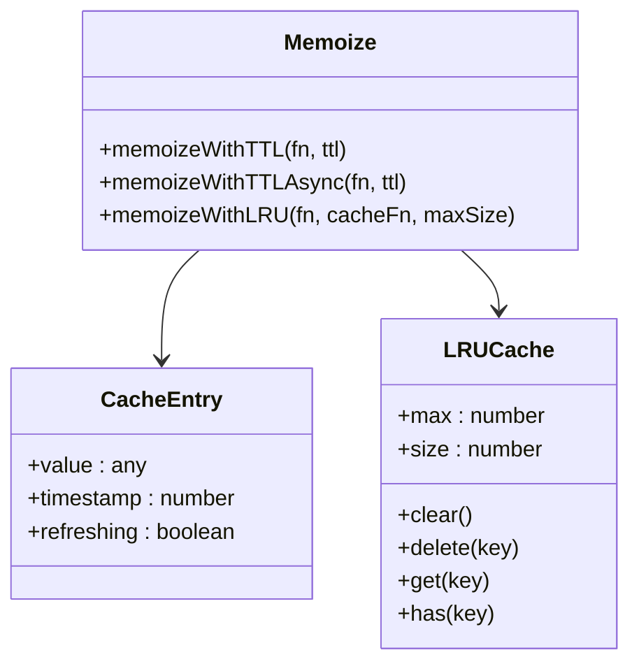

**图表来源**
- [src/utils/memoize.ts:40-270](file://src/utils/memoize.ts#L40-L270)

**章节来源**
- [src/utils/memoize.ts:1-270](file://src/utils/memoize.ts#L1-L270)

## 依赖关系分析

路径处理系统的依赖关系体现了良好的模块化设计：

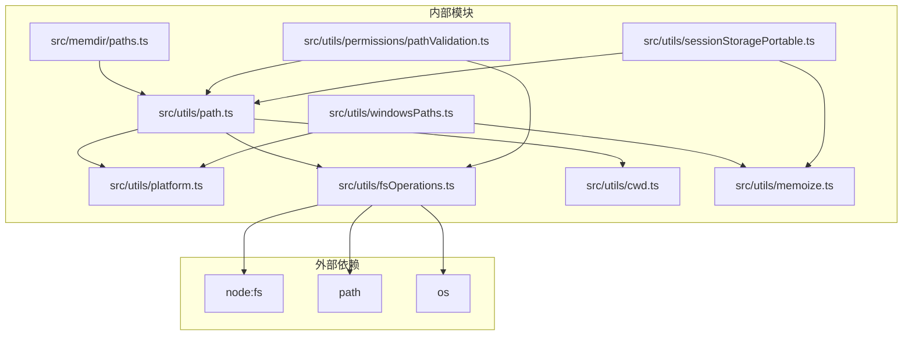

**图表来源**
- [src/utils/path.ts:1-6](file://src/utils/path.ts#L1-L6)
- [src/utils/windowsPaths.ts:1-8](file://src/utils/windowsPaths.ts#L1-L8)

**章节来源**
- [src/utils/path.ts:1-156](file://src/utils/path.ts#L1-L156)
- [src/utils/windowsPaths.ts:1-174](file://src/utils/windowsPaths.ts#L1-L174)

## 性能考虑

### 缓存策略优化

1. **LRU 缓存**：限制最大缓存大小，避免内存泄漏
2. **TTL 缓存**：平衡数据新鲜度和性能
3. **异步缓存**：防止重复的昂贵操作

### 路径操作优化

1. **延迟计算**：只在需要时进行路径解析
2. **批量操作**：合并多个路径操作减少系统调用
3. **错误恢复**：优雅处理路径解析失败的情况

## 故障排除指南

### 常见问题及解决方案

#### 路径解析错误

**问题**：路径解析返回意外结果
**解决方案**：
1. 检查输入路径是否包含空字节
2. 验证工作目录的有效性
3. 确认平台检测正确性

#### Windows 路径问题

**问题**：Windows 路径格式不正确
**解决方案**：
1. 使用 `posixPathToWindowsPath` 进行格式转换
2. 检查驱动器字母的有效性
3. 验证 UNC 路径的格式

#### 权限验证失败

**问题**：路径权限检查总是失败
**解决方案**：
1. 检查路径是否包含危险字符
2. 验证路径是否在允许的工作目录内
3. 确认沙箱配置正确

**章节来源**
- [src/utils/path.ts:47-50](file://src/utils/path.ts#L47-L50)
- [src/utils/permissions/pathValidation.ts:382-392](file://src/utils/permissions/pathValidation.ts#L382-L392)

## 结论

Claude Code 的路径处理工具系统展现了优秀的工程实践：

1. **跨平台兼容性**：通过模块化设计实现了良好的多平台支持
2. **安全性优先**：内置了多重安全检查和权限验证机制
3. **性能优化**：采用多种缓存策略提升系统性能
4. **可维护性**：清晰的模块划分和接口设计便于维护和扩展

该系统为 IDE 集成和跨平台开发提供了可靠的路径处理基础，能够有效解决各种复杂的路径操作场景。