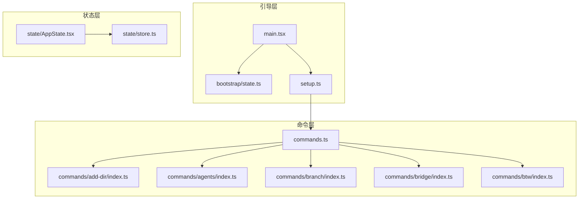
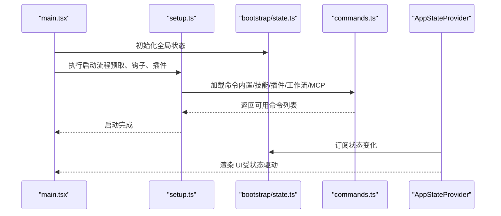
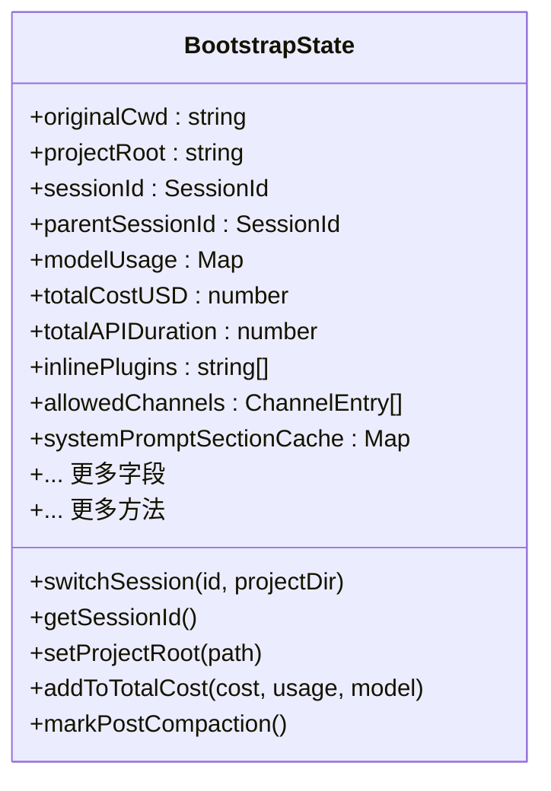
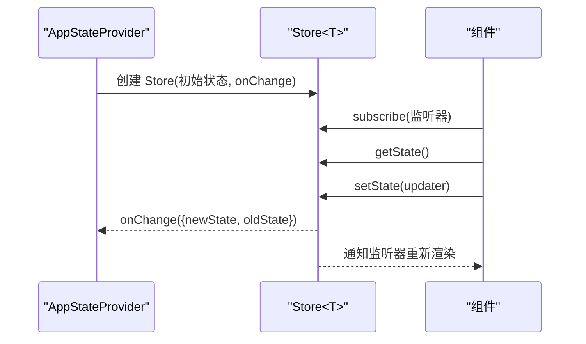
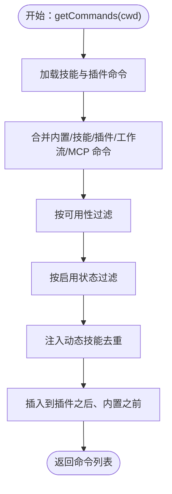
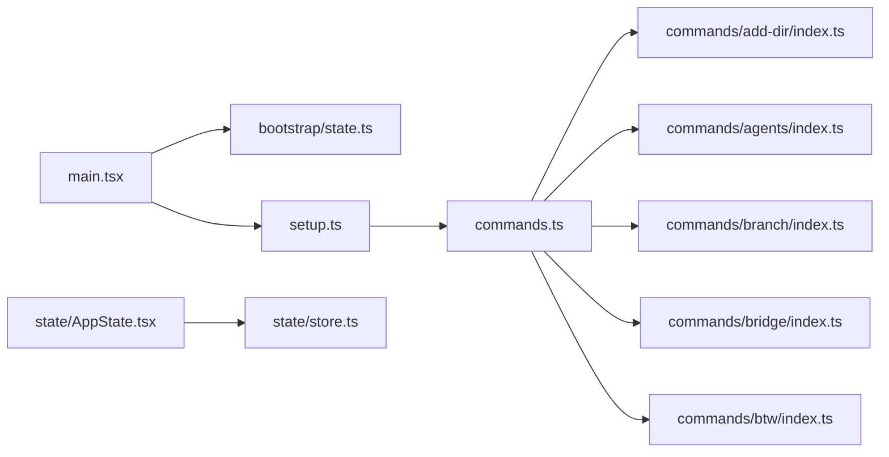

# 目录结构详解

<cite>
**本文档引用的文件**
- [main.tsx](file://src/main.tsx)
- [setup.ts](file://src/setup.ts)
- [bootstrap/state.ts](file://src/bootstrap/state.ts)
- [state/AppState.tsx](file://src/state/AppState.tsx)
- [state/store.ts](file://src/state/store.ts)
- [commands.ts](file://src/commands.ts)
- [commands/add-dir/index.ts](file://src/commands/add-dir/index.ts)
- [commands/agents/index.ts](file://src/commands/agents/index.ts)
- [commands/branch/index.ts](file://src/commands/branch/index.ts)
- [commands/bridge/index.ts](file://src/commands/bridge/index.ts)
- [commands/btw/index.ts](file://src/commands/btw/index.ts)
</cite>

## 目录
1. [简介](#简介)
2. [项目结构](#项目结构)
3. [核心组件](#核心组件)
4. [架构总览](#架构总览)
5. [详细组件分析](#详细组件分析)
6. [依赖关系分析](#依赖关系分析)
7. [性能考量](#性能考量)
8. [故障排除指南](#故障排除指南)
9. [结论](#结论)

## 简介
本文件面向 Claude Code 的源码读者，系统性梳理 src/ 目录下各子目录的设计原则与职责边界，重点覆盖以下模块：
- bootstrap：应用引导与全局状态初始化
- state：React 全局状态管理（AppState）
- services：核心服务层（API、分析、策略等）
- components：React UI 组件与 UI 子模块
- tools：工具系统（Tool 抽象与具体工具）
- commands：命令系统（内置命令与动态命令聚合）
- utils：通用工具函数库
- hooks：React 自定义 Hook
- constants：全局常量
- types：类型定义

同时给出文件组织规则、命名约定、模块划分原则，以及最佳实践建议（新增功能模块时的文件布局、命名规范、依赖管理），并通过图示展示各模块间的交互模式与数据流向。

## 项目结构
src/ 下的目录遵循“按职责分层 + 按功能域拆分”的组织方式：
- bootstrap：应用启动阶段的全局状态与环境准备
- state：React 应用状态容器与订阅机制
- services：业务服务（API、分析、策略、插件、MCP 等）
- components：React 组件与 UI 子系统
- tools：工具抽象与具体实现
- commands：命令注册、聚合与可用性过滤
- utils：通用工具函数
- hooks：React 自定义 Hook
- constants：全局常量
- types：类型定义

**图表来源**
- [main.tsx](file://src/main.tsx)
- [setup.ts](file://src/setup.ts)
- [bootstrap/state.ts](file://src/bootstrap/state.ts)
- [state/AppState.tsx](file://src/state/AppState.tsx)
- [state/store.ts](file://src/state/store.ts)
- [commands.ts](file://src/commands.ts)
- [commands/add-dir/index.ts](file://src/commands/add-dir/index.ts)
- [commands/agents/index.ts](file://src/commands/agents/index.ts)
- [commands/branch/index.ts](file://src/commands/branch/index.ts)
- [commands/bridge/index.ts](file://src/commands/bridge/index.ts)
- [commands/btw/index.ts](file://src/commands/btw/index.ts)

**章节来源**
- [main.tsx](file://src/main.tsx)
- [setup.ts](file://src/setup.ts)
- [bootstrap/state.ts](file://src/bootstrap/state.ts)
- [state/AppState.tsx](file://src/state/AppState.tsx)
- [state/store.ts](file://src/state/store.ts)
- [commands.ts](file://src/commands.ts)

## 核心组件
本节聚焦关键目录与其职责、设计原则与典型文件组织方式。

- bootstrap
  - 职责：应用启动阶段的全局状态初始化、会话切换、路径与工作目录设置、遥测与指标提供者注入、权限与信任上下文建立等。
  - 设计原则：最小化全局状态、集中式状态入口、原子性切换（如会话切换）。
  - 关键文件：bootstrap/state.ts（全局状态定义与读写接口）

- state
  - 职责：React 应用状态容器，提供订阅机制与状态更新回调；与 AppStateProvider 配合，为 UI 提供响应式状态。
  - 设计原则：不可变更新、选择器优化渲染、避免不必要的重渲染。
  - 关键文件：state/AppState.tsx（Provider 与 Hook）、state/store.ts（Store 实现）

- services
  - 职责：封装业务服务（API、分析、策略限制、远程设置同步、MCP 客户端等），对外暴露稳定接口。
  - 设计原则：关注点分离、可测试性、异步与错误处理清晰。
  - 典型模块：analytics、api、policyLimits、remoteManagedSettings、mcp 等

- components
  - 职责：React UI 组件与 UI 子系统（消息、输入、设置、对话框等），按功能域进一步细分（如 messages、settings、permissions 等）。
  - 设计原则：单一职责、可复用、与状态解耦（通过 props 与 Hook 访问状态）

- tools
  - 职责：工具抽象（Tool 基类）与具体工具实现（如 BashTool、FileReadTool、MCP 工具等），统一工具调用协议与结果格式。
  - 设计原则：可组合、可扩展、与命令系统协作

- commands
  - 职责：命令注册、聚合（内置命令、技能、插件、工作流、MCP 技能）、可用性过滤与远程安全过滤。
  - 设计原则：延迟加载、条件编译、可发现性与去重、动态技能插入

- utils
  - 职责：通用工具函数（字符串、路径、设置、权限、日志、调试等）
  - 设计原则：纯函数优先、无副作用、可测试

- hooks
  - 职责：React 自定义 Hook（通知、权限、输入、会话、任务等）
  - 设计原则：关注点分离、可复用、与 UI 解耦

- constants
  - 职责：全局常量（API 限流、提示词、输出样式、系统提示段落等）
  - 设计原则：集中管理、类型安全

- types
  - 职责：类型定义（命令、Hook、ID、日志、插件等）
  - 设计原则：与业务模型对齐、避免循环依赖

**章节来源**
- [bootstrap/state.ts](file://src/bootstrap/state.ts)
- [state/AppState.tsx](file://src/state/AppState.tsx)
- [state/store.ts](file://src/state/store.ts)
- [commands.ts](file://src/commands.ts)

## 架构总览
下图展示了从应用启动到命令加载与状态管理的关键流程：

**图表来源**
- [main.tsx](file://src/main.tsx)
- [setup.ts](file://src/setup.ts)
- [bootstrap/state.ts](file://src/bootstrap/state.ts)
- [commands.ts](file://src/commands.ts)
- [state/AppState.tsx](file://src/state/AppState.tsx)

## 详细组件分析

### 引导与状态：bootstrap/state.ts
- 全局状态模型：包含会话 ID、项目根目录、工作目录、成本与用量统计、遥测提供者、代理颜色映射、计划 slug 缓存、慢操作记录、SDK Beta 头部标记、通道允许列表等。
- 会话管理：提供会话切换、父会话追踪、会话项目目录解析、计划 slug 缓存清理等能力。
- 时间与预算：提供回合级工具/钩子/分类器耗时统计、令牌预算快照与续传计数。
- 事件与信号：提供会话切换信号（用于跨模块同步）。

**图表来源**
- [bootstrap/state.ts](file://src/bootstrap/state.ts)

**章节来源**
- [bootstrap/state.ts](file://src/bootstrap/state.ts)

### React 全局状态：state/AppState.tsx 与 state/store.ts
- AppStateProvider：提供 React 上下文，注入应用状态 Store，并在挂载时根据远程设置禁用某些模式（如 bypass 权限模式）。
- useAppState/useSetAppState：基于 useSyncExternalStore 的订阅式状态访问与更新，避免不必要渲染。
- Store 实现：不可变更新、监听器集合、变更回调触发。

**图表来源**
- [state/AppState.tsx](file://src/state/AppState.tsx)
- [state/store.ts](file://src/state/store.ts)

**章节来源**
- [state/AppState.tsx](file://src/state/AppState.tsx)
- [state/store.ts](file://src/state/store.ts)

### 命令系统：commands.ts 与具体命令索引
- 命令注册：commands.ts 中以“延迟加载”方式导入各命令，支持条件编译（feature gate）与按需加载。
- 动态聚合：内置命令、技能目录命令、插件命令、工作流命令、MCP 技能命令合并，去重后插入到合适位置。
- 可用性过滤：按认证/提供商要求过滤命令（如 Claude AI 订阅者、控制台用户等）。
- 远程安全：REMOTE_SAFE_COMMANDS 与 BRIDGE_SAFE_COMMANDS 明确远程模式与桥接通道的安全命令集。

**图表来源**
- [commands.ts](file://src/commands.ts)

**章节来源**
- [commands.ts](file://src/commands.ts)
- [commands/add-dir/index.ts](file://src/commands/add-dir/index.ts)
- [commands/agents/index.ts](file://src/commands/agents/index.ts)
- [commands/branch/index.ts](file://src/commands/branch/index.ts)
- [commands/bridge/index.ts](file://src/commands/bridge/index.ts)
- [commands/btw/index.ts](file://src/commands/btw/index.ts)

### 服务层：services（概览）
- API 与分析：封装 Claude API 请求、分析门控与指标上报。
- 策略限制：策略限制加载、刷新与等待策略限制加载完成。
- 远程设置：远程托管设置加载与刷新。
- MCP：MCP 服务器配置、资源与命令聚合、客户端缓存清理。
- 插件与技能：插件命令与技能的加载、缓存与热重载。
- 语音与诊断：语音流、诊断跟踪、内部日志等。

（本节为概念性说明，未直接分析具体文件）

### 工具系统：tools（概览）
- Tool 抽象：统一工具调用协议、输入/输出格式、错误处理。
- 具体工具：Bash、PowerShell、文件读写、搜索、LSP、MCP、Web 搜索、任务管理等。
- 共享与测试：共享工具与测试工具模块。

（本节为概念性说明，未直接分析具体文件）

### 组件与 UI：components（概览）
- 消息与输入：消息列表、输入框、Markdown 渲染、差异展示。
- 设置与对话框：主题、颜色、权限、设置对话框等。
- UI 子系统：按功能域拆分（agents、permissions、tasks、shell 等）。

（本节为概念性说明，未直接分析具体文件）

### 工具函数与自定义 Hook：utils 与 hooks
- utils：字符串、路径、设置、权限、日志、调试、错误处理、平台检测等。
- hooks：通知、权限、输入、会话、任务、语音、IDE 集成等。

（本节为概念性说明，未直接分析具体文件）

### 常量与类型：constants 与 types
- constants：API 限流、提示词、输出样式、系统提示段落、工具限制等。
- types：命令、Hook、ID、日志、插件等类型定义。

（本节为概念性说明，未直接分析具体文件）

## 依赖关系分析
- 启动依赖：main.tsx 依赖 bootstrap/state.ts 初始化全局状态，随后执行 setup.ts 完成预取与钩子注册，最终加载命令系统。
- 状态依赖：AppStateProvider 依赖 store.ts 提供的状态容器，UI 通过 useAppState 订阅状态变化。
- 命令依赖：commands.ts 依赖各命令索引文件（如 add-dir、agents、branch、bridge、btw），这些索引文件以延迟加载方式导入实际实现。

**图表来源**
- [main.tsx](file://src/main.tsx)
- [setup.ts](file://src/setup.ts)
- [bootstrap/state.ts](file://src/bootstrap/state.ts)
- [commands.ts](file://src/commands.ts)
- [commands/add-dir/index.ts](file://src/commands/add-dir/index.ts)
- [commands/agents/index.ts](file://src/commands/agents/index.ts)
- [commands/branch/index.ts](file://src/commands/branch/index.ts)
- [commands/bridge/index.ts](file://src/commands/bridge/index.ts)
- [commands/btw/index.ts](file://src/commands/btw/index.ts)
- [state/AppState.tsx](file://src/state/AppState.tsx)
- [state/store.ts](file://src/state/store.ts)

**章节来源**
- [main.tsx](file://src/main.tsx)
- [setup.ts](file://src/setup.ts)
- [bootstrap/state.ts](file://src/bootstrap/state.ts)
- [commands.ts](file://src/commands.ts)
- [state/AppState.tsx](file://src/state/AppState.tsx)
- [state/store.ts](file://src/state/store.ts)

## 性能考量
- 启动性能：main.tsx 中对关键启动步骤进行性能打点与延迟预取，避免阻塞首帧渲染。
- 命令加载：commands.ts 使用 memoize 缓存命令加载结果，减少磁盘 I/O 与动态导入开销。
- 状态更新：state/store.ts 采用不可变更新与对象引用比较，避免不必要的渲染。
- 条件编译：大量 feature gate 控制模块加载，减少运行时开销与包体积。

（本节为一般性指导，未直接分析具体文件）

## 故障排除指南
- 启动失败：检查 main.tsx 中的调试模式检测与退出逻辑，确认环境变量与 Node 版本满足要求。
- 命令缺失：使用 commands.ts 的查找与格式化函数定位命令来源与可用性，核对 feature gate 与可用性过滤。
- 状态异常：通过 AppStateProvider 的设置钩子与 onChange 回调定位状态变更来源，结合 store.ts 的不可变更新策略排查。

**章节来源**
- [main.tsx](file://src/main.tsx)
- [commands.ts](file://src/commands.ts)
- [state/AppState.tsx](file://src/state/AppState.tsx)
- [state/store.ts](file://src/state/store.ts)

## 结论
本文件系统性梳理了 Claude Code 源码中 src/ 目录的核心结构与设计原则，明确了 bootstrap、state、services、components、tools、commands、utils、hooks、constants、types 各自的职责与交互方式。通过命令系统的延迟加载与去重机制、状态容器的订阅式更新、引导阶段的预取与安全过滤，整体架构实现了高可维护性与良好性能。建议在新增功能时遵循本文档的文件组织规则、命名约定与依赖管理原则，确保模块边界清晰、可测试性强且易于演进。