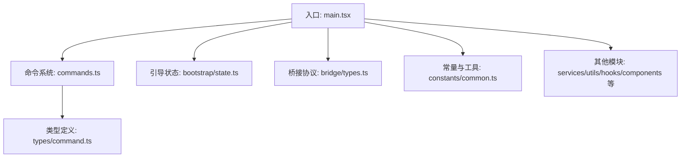
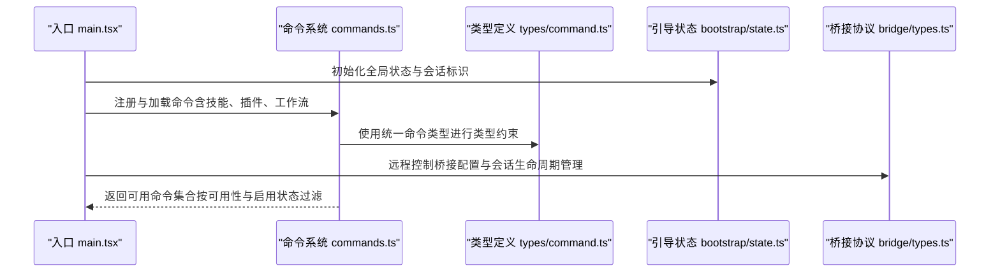
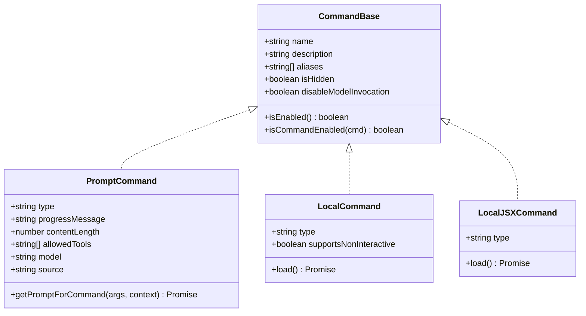
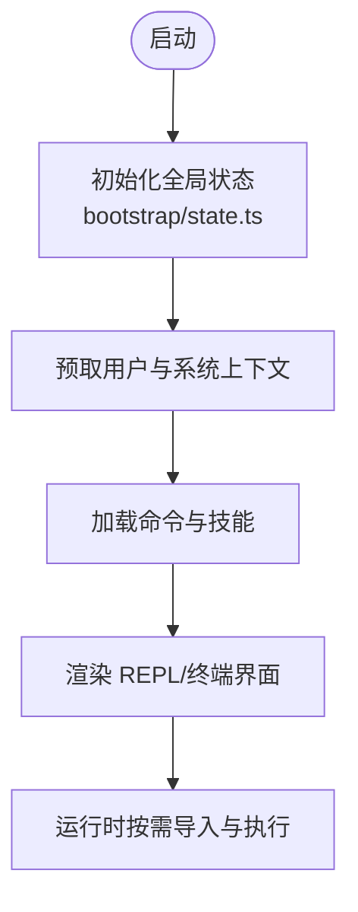
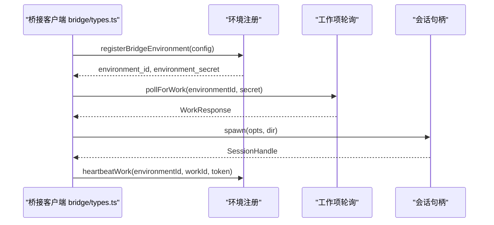
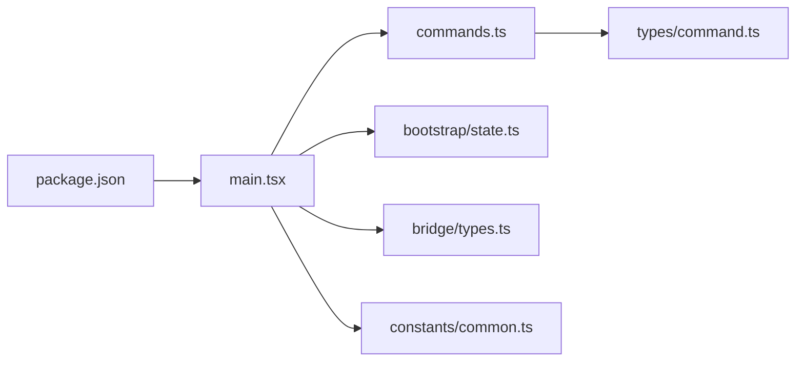

# 代码规范与质量

<cite>
**本文引用的文件**   
- [package.json](file://package.json)
- [README.md](file://README.md)
- [src/main.tsx](file://src/main.tsx)
- [src/commands.ts](file://src/commands.ts)
- [src/types/command.ts](file://src/types/command.ts)
- [src/bootstrap/state.ts](file://src/bootstrap/state.ts)
- [src/bridge/types.ts](file://src/bridge/types.ts)
- [src/constants/common.ts](file://src/constants/common.ts)
</cite>

## 目录
1. [简介](#简介)
2. [项目结构](#项目结构)
3. [核心组件](#核心组件)
4. [架构总览](#架构总览)
5. [详细组件分析](#详细组件分析)
6. [依赖分析](#依赖分析)
7. [性能考虑](#性能考虑)
8. [故障排查指南](#故障排查指南)
9. [结论](#结论)
10. [附录](#附录)

## 简介
本指南面向 Claude Code 的 TypeScript 代码库，旨在建立统一的编码规范与质量保证体系。内容覆盖命名约定、类型定义与接口设计原则；代码组织结构（模块划分、文件命名规则、目录结构最佳实践）；代码审查流程与标准（Pull Request 模板、审查清单、合并要求）；代码质量工具配置（ESLint 规则、TypeScript 编译选项、代码格式化工具）；以及单元测试编写规范（测试文件组织、断言模式、覆盖率要求）。  
本仓库为官方 CLI 工具的源码提取版本，遵循模块化、可维护性与可扩展性的工程化目标。

## 项目结构
项目采用按功能域分层的模块化组织方式，主要目录职责如下：
- src/commands：命令实现与注册中心，集中管理内置命令、技能、插件命令与工作流命令
- src/types：跨模块共享的类型定义，确保强类型约束与接口一致性
- src/bootstrap：应用启动与全局状态初始化，包含会话 ID、路径、遥测等核心状态
- src/bridge：远程控制桥接协议与会话生命周期管理
- src/constants：常量与通用工具函数，如日期、提示词片段等
- 其他目录：services、utils、hooks、components 等，分别承担服务层、工具函数、React/Hook 扩展与 UI 组件职责

图表来源
- [src/main.tsx:1-120](file://src/main.tsx#L1-L120)
- [src/commands.ts:1-120](file://src/commands.ts#L1-L120)
- [src/types/command.ts:1-60](file://src/types/command.ts#L1-L60)
- [src/bootstrap/state.ts:1-120](file://src/bootstrap/state.ts#L1-L120)
- [src/bridge/types.ts:1-120](file://src/bridge/types.ts#L1-L120)
- [src/constants/common.ts:1-34](file://src/constants/common.ts#L1-L34)

章节来源
- [README.md:95-114](file://README.md#L95-L114)

## 核心组件
- 命令系统与类型模型
  - 命令类型与加载机制：支持 prompt、local、local-jsx 三类命令，具备延迟加载、可用性过滤与启用检查
  - 类型约束：通过统一的 CommandBase、PromptCommand、LocalCommand、LocalJSXCommand 确保命令行为一致
- 启动与状态管理
  - 全局状态集中于 bootstrap/state.ts，包含会话 ID、工作目录、成本统计、遥测计数器、通道与权限等
- 远程控制桥接
  - 定义桥接环境、会话生命周期、心跳、权限响应事件与日志接口，保障远程交互一致性
- 常量与工具
  - 提供本地日期与月份字符串生成，用于提示词缓存稳定性与时间上下文注入

章节来源
- [src/commands.ts:258-346](file://src/commands.ts#L258-L346)
- [src/types/command.ts:175-217](file://src/types/command.ts#L175-L217)
- [src/bootstrap/state.ts:45-257](file://src/bootstrap/state.ts#L45-L257)
- [src/bridge/types.ts:16-116](file://src/bridge/types.ts#L16-L116)
- [src/constants/common.ts:17-34](file://src/constants/common.ts#L17-L34)

## 架构总览
下图展示启动流程中关键模块的调用关系与职责边界：

图表来源
- [src/main.tsx:585-800](file://src/main.tsx#L585-L800)
- [src/commands.ts:476-517](file://src/commands.ts#L476-L517)
- [src/types/command.ts:205-217](file://src/types/command.ts#L205-L217)
- [src/bootstrap/state.ts:431-450](file://src/bootstrap/state.ts#L431-L450)
- [src/bridge/types.ts:178-211](file://src/bridge/types.ts#L178-L211)

## 详细组件分析

### 命令系统与类型模型
- 设计原则
  - 统一命令接口：通过 CommandBase 抽象出名称、描述、别名、可用性与启用策略
  - 多态命令类型：prompt 命令用于模型调用；local 命令执行纯文本输出；local-jsx 命令渲染 UI
  - 延迟加载：使用 load() 模式延迟重模块导入，降低启动时延
  - 可发现性：动态技能与插件命令在运行期注入，并按优先级插入到命令列表
- 关键流程
  - 命令可用性过滤：先按 provider/订阅类型过滤，再按 isEnabled 判定
  - 命令启用判定：默认启用，可通过 isEnabled 自定义条件
  - 动态命令去重：避免与内置命令重复
- 接口设计
  - LocalJSXCommandContext：提供工具能力、主题、消息更新回调等上下文
  - CommandResultDisplay：控制结果展示策略（跳过、系统、用户）

图表来源
- [src/types/command.ts:175-217](file://src/types/command.ts#L175-L217)
- [src/commands.ts:258-346](file://src/commands.ts#L258-L346)

章节来源
- [src/types/command.ts:16-136](file://src/types/command.ts#L16-L136)
- [src/commands.ts:417-443](file://src/commands.ts#L417-L443)
- [src/commands.ts:476-517](file://src/commands.ts#L476-L517)

### 启动与状态管理
- 全局状态
  - 包含会话 ID、原始工作目录、项目根、成本与用量统计、遥测计数器、通道与权限、代理/桥接参数等
  - 提供会话切换、路径设置、统计归集与预算快照等操作
- 启动优化
  - 早期预取：在渲染前异步预取用户上下文、提示词、模型能力等，减少首帧阻塞
  - 条件导入：通过 feature 标记按需加载特性模块，避免无用代码进入产物

图表来源
- [src/bootstrap/state.ts:260-426](file://src/bootstrap/state.ts#L260-L426)
- [src/main.tsx:388-431](file://src/main.tsx#L388-L431)

章节来源
- [src/bootstrap/state.ts:431-450](file://src/bootstrap/state.ts#L431-L450)
- [src/main.tsx:388-431](file://src/main.tsx#L388-L431)

### 远程控制桥接
- 协议与生命周期
  - 定义工作项、会话活动、心跳、权限响应事件与会话句柄
  - 支持单会话、工作树与同目录三种会话生成模式
- 安全与鉴权
  - 会话令牌与环境密钥用于鉴权与续租
  - 登录状态校验与错误提示，确保仅订阅用户可用

图表来源
- [src/bridge/types.ts:133-176](file://src/bridge/types.ts#L133-L176)
- [src/bridge/types.ts:178-211](file://src/bridge/types.ts#L178-L211)

章节来源
- [src/bridge/types.ts:16-116](file://src/bridge/types.ts#L16-L116)
- [src/bridge/types.ts:213-263](file://src/bridge/types.ts#L213-L263)

### 常量与工具
- 日期与月份
  - 提供本地日期与月份字符串生成，memoized 以稳定提示词缓存
  - 支持环境变量覆盖日期，便于测试与一致性验证

章节来源
- [src/constants/common.ts:17-34](file://src/constants/common.ts#L17-L34)

## 依赖分析
- 模块耦合
  - 命令系统对类型定义存在强依赖，确保命令行为与类型一致
  - 启动入口对状态模块与桥接模块存在直接依赖，体现其作为系统中枢的角色
- 外部依赖
  - Node 版本要求与包元信息由 package.json 约束
  - 项目采用模块化打包，未显式包含 ESLint/TS 配置文件，建议在团队内统一配置并纳入 CI

图表来源
- [src/main.tsx:1-120](file://src/main.tsx#L1-L120)
- [src/commands.ts:1-120](file://src/commands.ts#L1-L120)
- [src/types/command.ts:1-60](file://src/types/command.ts#L1-L60)
- [src/bootstrap/state.ts:1-120](file://src/bootstrap/state.ts#L1-L120)
- [src/bridge/types.ts:1-120](file://src/bridge/types.ts#L1-L120)
- [src/constants/common.ts:1-34](file://src/constants/common.ts#L1-L34)
- [package.json:1-34](file://package.json#L1-L34)

章节来源
- [package.json:7-10](file://package.json#L7-L10)

## 性能考虑
- 启动阶段优化
  - 异步预取与懒加载：在首次渲染后进行非关键任务的异步预取，避免阻塞首帧
  - 条件导入：按特性开关裁剪模块，减少体积与解析开销
- 运行时优化
  - 状态归档与预算快照：通过快照记录每轮对话的预算与输出，便于统计与回放
  - 事件循环节流：滚动与后台任务在渲染周期间歇执行，降低主线程竞争

章节来源
- [src/main.tsx:388-431](file://src/main.tsx#L388-L431)
- [src/bootstrap/state.ts:724-743](file://src/bootstrap/state.ts#L724-L743)

## 故障排查指南
- 常见问题定位
  - 命令不可用：检查命令可用性过滤与 isEnabled 策略，确认订阅类型与 provider 要求
  - 远程控制不可用：确认登录状态与权限响应事件是否正确下发
  - 启动卡顿：检查预取任务与条件导入是否合理分布
- 日志与诊断
  - 使用 BridgeLogger 与状态模块中的统计字段辅助定位问题
  - 在关键路径添加诊断日志，区分缓存命中与失效场景

章节来源
- [src/commands.ts:417-443](file://src/commands.ts#L417-L443)
- [src/bridge/types.ts:213-263](file://src/bridge/types.ts#L213-L263)
- [src/bootstrap/state.ts:665-689](file://src/bootstrap/state.ts#L665-L689)

## 结论
本指南基于现有代码库提炼了 TypeScript 编码规范与质量保证要点，涵盖类型建模、模块组织、启动优化、远程桥接与诊断流程。建议在团队内补充统一的 ESLint/TS 配置与 CI 流水线，持续提升代码一致性与可维护性。

## 附录
- 命名约定（建议）
  - 类型与接口：采用名词短语或抽象概念，如 Command、ChannelEntry、BridgeConfig
  - 函数与方法：采用动宾短语，如 getCommands、setOriginalCwd、spawn
  - 常量：全大写加下划线，如 DEFAULT_SESSION_TIMEOUT_MS
  - 文件命名：采用小驼峰或名词短语，避免缩写；组件文件以 .tsx 结尾
- 目录结构最佳实践（建议）
  - 按功能域分层：commands、services、utils、hooks、components、types、bootstrap
  - 命令与技能分离：内置命令与动态技能分别管理，保持可发现性
  - 类型集中：公共类型放入 types 目录，避免循环依赖
- 代码审查流程与标准（建议）
  - Pull Request 模板：包含变更动机、影响范围、测试与回归验证
  - 审查清单：类型安全、命名一致性、性能影响、错误处理与日志
  - 合并要求：至少一次审查通过、CI 通过、无新增循环依赖
- 代码质量工具配置（建议）
  - ESLint：启用 TypeScript 规则、禁用魔法数字、强制一致的命名
  - TypeScript：严格模式、noImplicitAny、禁止未使用变量、明确模块解析
  - 代码格式化：统一使用 Prettier 或 Biome，结合编辑器钩子
- 单元测试编写规范（建议）
  - 测试文件组织：与被测模块同目录，文件名以 .test.ts 结尾
  - 断言模式：优先使用语义化断言，覆盖正常路径、边界与异常分支
  - 覆盖率要求：关键路径覆盖率不低于 80%，核心模块不低于 90%