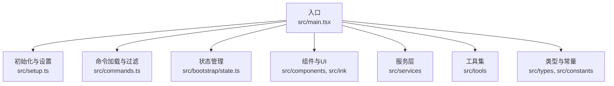
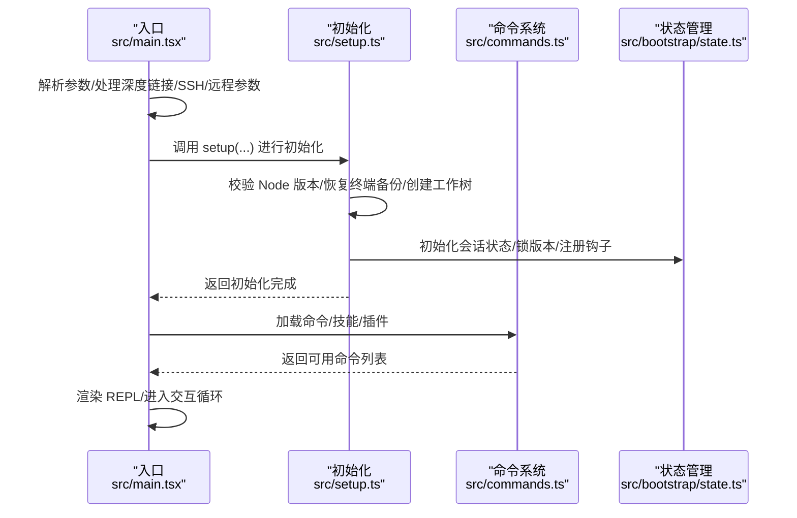
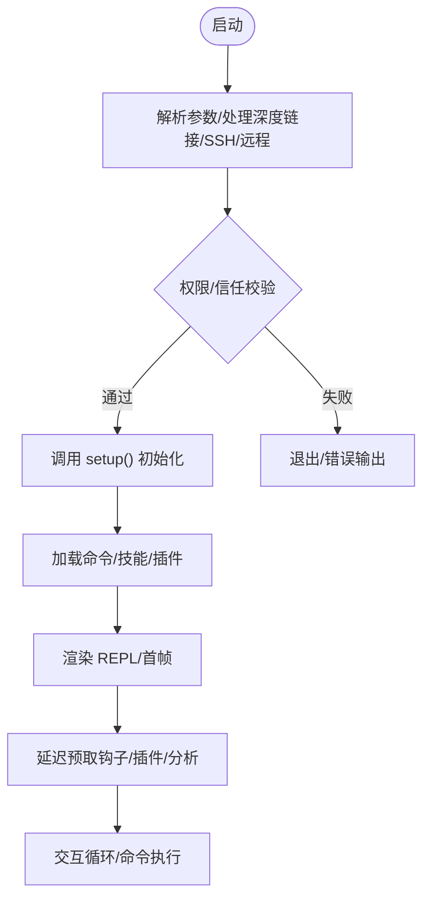
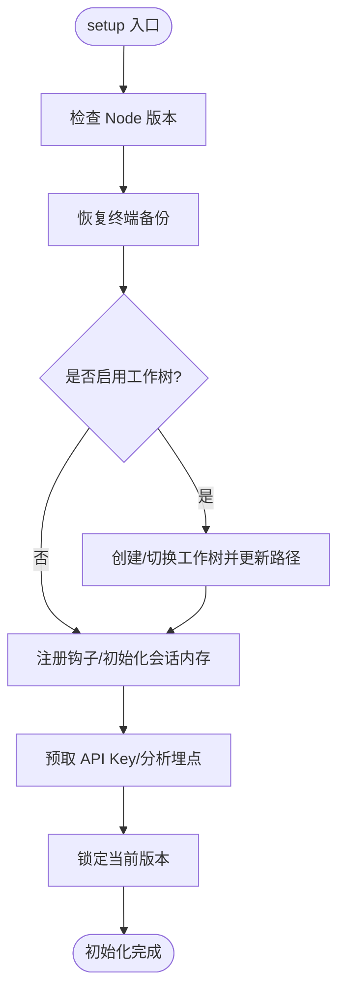
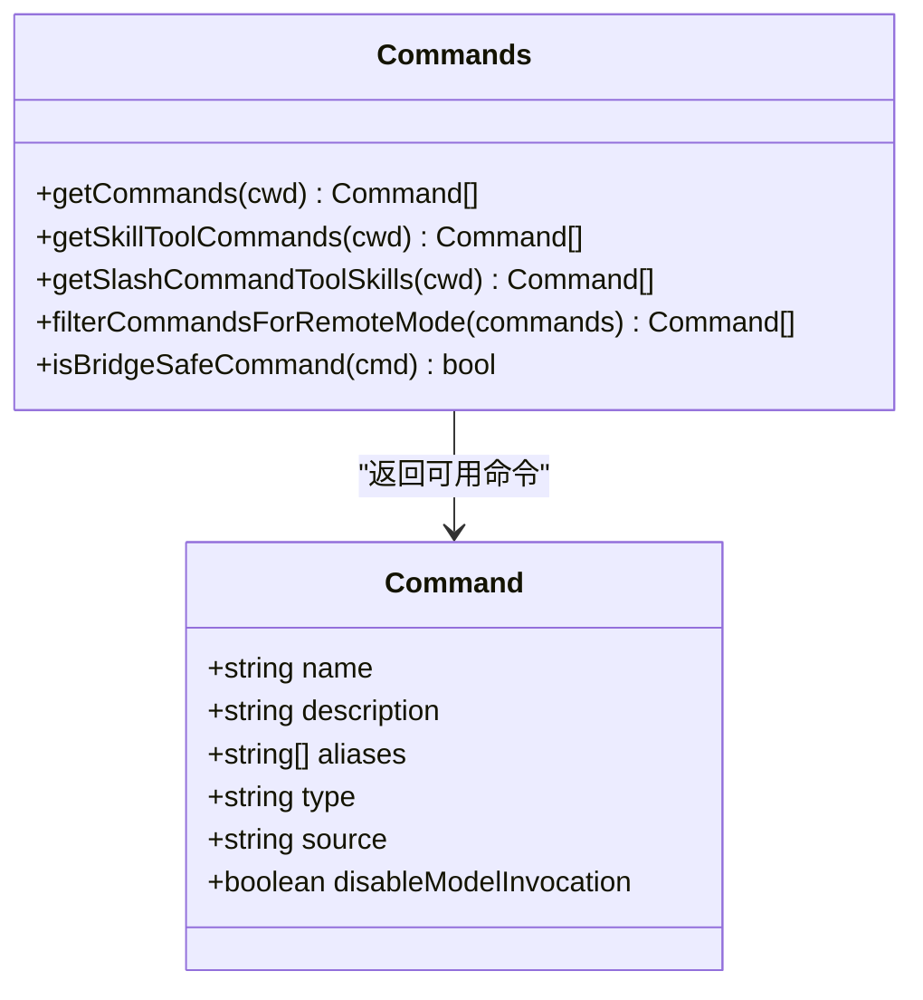
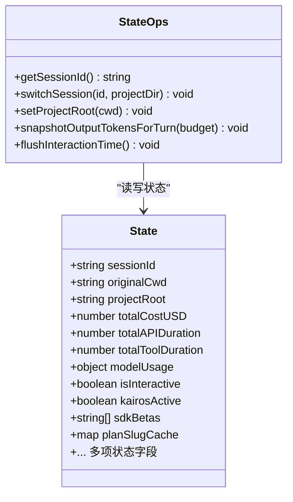
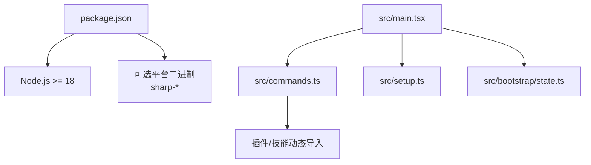

# 开发工作流程

<cite>
**本文引用的文件**
- [package.json](file://package.json)
- [README.md](file://README.md)
- [src/main.tsx](file://src/main.tsx)
- [src/setup.ts](file://src/setup.ts)
- [src/bootstrap/state.ts](file://src/bootstrap/state.ts)
- [src/commands.ts](file://src/commands.ts)
</cite>

## 目录
1. [简介](#简介)
2. [项目结构](#项目结构)
3. [核心组件](#核心组件)
4. [架构总览](#架构总览)
5. [详细组件分析](#详细组件分析)
6. [依赖分析](#依赖分析)
7. [性能考虑](#性能考虑)
8. [故障排查指南](#故障排查指南)
9. [结论](#结论)
10. [附录](#附录)

## 简介
本指南面向 Claude Code 的开发者与维护者，系统化梳理从代码编写到发布的完整工作流程，覆盖开发环境配置、代码规范、本地测试与调试、构建与打包、版本发布、代码质量保障（代码审查、单元测试、集成测试、性能测试）、Git 工作流（分支管理、提交信息规范、Pull Request 流程）以及持续集成与持续部署（CI/CD）实践。  
由于本仓库为官方已发布包的源码提取版本，实际构建与发布流程由官方在受控环境中完成；本指南基于仓库内现有信息与通用工程实践给出可操作建议。

## 项目结构
该项目采用按功能域分层的组织方式：入口与主流程、命令体系、组件与 UI、服务层、工具与工具集、类型定义与常量、状态与引导、查询与任务引擎等。  
- 入口与主流程：src/main.tsx 负责启动、参数解析、权限与信任校验、会话初始化与渲染。
- 命令体系：src/commands.ts 统一加载内置命令、插件命令、技能命令与动态技能，提供可用命令集合与过滤逻辑。
- 组件与 UI：src/components、src/ink 提供终端 UI 与交互组件。
- 服务层：src/services 提供 API、分析、提示建议、会话记忆、MCP、OAuth 等能力。
- 工具与工具集：src/tools 提供文件读写、搜索、Bash/PowerShell 执行、REPL、Web 搜索等工具。
- 类型与常量：src/types、src/constants 定义类型与常量。
- 状态与引导：src/bootstrap/state.ts 维护全局会话状态；src/setup.ts 负责初始化与预取。
- 查询与任务：src/query.ts、src/tasks.ts、src/Task.ts 等支撑查询执行与任务调度。

图表来源
- [src/main.tsx:1-120](file://src/main.tsx#L1-L120)
- [src/setup.ts:1-60](file://src/setup.ts#L1-L60)
- [src/commands.ts:1-60](file://src/commands.ts#L1-L60)
- [src/bootstrap/state.ts:1-60](file://src/bootstrap/state.ts#L1-L60)

章节来源
- [README.md:95-114](file://README.md#L95-L114)

## 核心组件
- 启动与入口
  - 主入口负责解析参数、建立信任与权限、初始化分析与遥测、加载命令与技能、启动 REPL 并进行首帧渲染。
  - 关键点：调试模式检测、非交互模式处理、深度链接与协议处理、SSH/远程连接参数预处理。
- 初始化与设置
  - 设置阶段负责检查 Node 版本、恢复终端备份、创建/切换工作树、注册钩子、预取 API 密钥、启动消息通道、锁定当前版本、初始化会话内存与分析埋点。
- 命令系统
  - 统一加载内置命令、插件命令、技能命令与动态技能，按可用性与启用状态过滤，支持桥接安全命令与远程模式安全命令。
- 状态管理
  - 全局会话状态集中管理，包含成本、时延、令牌用量、模型选择、代理颜色、钩子注册、计划/自动模式标记、慢操作记录、遥测提供者等。

章节来源
- [src/main.tsx:585-800](file://src/main.tsx#L585-L800)
- [src/setup.ts:56-120](file://src/setup.ts#L56-L120)
- [src/commands.ts:258-346](file://src/commands.ts#L258-L346)
- [src/bootstrap/state.ts:45-120](file://src/bootstrap/state.ts#L45-L120)

## 架构总览
下图展示从启动到命令执行的关键交互路径，体现入口、初始化、命令加载与状态管理之间的关系。

图表来源
- [src/main.tsx:585-800](file://src/main.tsx#L585-L800)
- [src/setup.ts:56-120](file://src/setup.ts#L56-L120)
- [src/commands.ts:476-517](file://src/commands.ts#L476-L517)
- [src/bootstrap/state.ts:260-330](file://src/bootstrap/state.ts#L260-L330)

## 详细组件分析

### 启动与入口（src/main.tsx）
- 职责
  - 参数解析与早期处理（深度链接、SSH、远程连接、助手模式等）。
  - 权限与信任校验（含调试模式检测），防止不安全执行。
  - 初始化分析与遥测、迁移与设置缓存、预取系统上下文、延迟预取优化。
  - 启动 REPL、渲染与交互。
- 关键流程
  - 参数重写与早期处理：将 cc:// 或 deep link URI 重写为内部 open 子命令或直接打开终端。
  - 权限模式与沙箱校验：在危险跳过权限模式下进行容器/网络访问/UID 校验。
  - 首帧渲染后延迟预取：用户输入窗口期间隐藏后台进程竞争，提升首帧性能。
- 可观测性
  - 启动阶段打点与性能剖析，便于定位瓶颈。
  - 启动/退出事件上报，用于健康监控。

图表来源
- [src/main.tsx:585-800](file://src/main.tsx#L585-L800)
- [src/setup.ts:56-120](file://src/setup.ts#L56-L120)
- [src/commands.ts:476-517](file://src/commands.ts#L476-L517)

章节来源
- [src/main.tsx:231-271](file://src/main.tsx#L231-L271)
- [src/main.tsx:388-431](file://src/main.tsx#L388-L431)
- [src/main.tsx:585-800](file://src/main.tsx#L585-L800)

### 初始化与设置（src/setup.ts）
- 职责
  - 校验 Node 版本（≥18）。
  - 恢复终端备份（iTerm2/Terminal.app）。
  - 创建/切换工作树（可选 tmux），更新项目根目录与工作目录。
  - 注册钩子、初始化会话内存、分析埋点、预取 API Key。
  - 锁定当前版本，避免并发删除。
- 安全与合规
  - 在危险跳过权限模式下进行容器/网络访问/UID 校验，确保仅在受限沙箱中使用。
- 性能优化
  - 条件跳过插件预取与钩子安装（如 --bare 模式），减少非必要 I/O。

图表来源
- [src/setup.ts:56-120](file://src/setup.ts#L56-L120)
- [src/setup.ts:174-285](file://src/setup.ts#L174-L285)
- [src/setup.ts:315-380](file://src/setup.ts#L315-L380)

章节来源
- [src/setup.ts:69-79](file://src/setup.ts#L69-L79)
- [src/setup.ts:115-158](file://src/setup.ts#L115-L158)
- [src/setup.ts:395-442](file://src/setup.ts#L395-L442)

### 命令系统（src/commands.ts）
- 职责
  - 统一加载内置命令、插件命令、技能命令与动态技能。
  - 按可用性（认证/提供商）与启用状态过滤命令。
  - 支持桥接安全命令与远程模式安全命令，保障跨端安全。
- 结构
  - 内置命令清单与条件导入（特性开关）。
  - 动态技能去重与插入位置控制。
  - 命令查找与格式化描述（含来源标注）。

图表来源
- [src/commands.ts:258-346](file://src/commands.ts#L258-L346)
- [src/commands.ts:476-517](file://src/commands.ts#L476-L517)
- [src/commands.ts:563-608](file://src/commands.ts#L563-L608)
- [src/commands.ts:684-686](file://src/commands.ts#L684-L686)

章节来源
- [src/commands.ts:1-60](file://src/commands.ts#L1-L60)
- [src/commands.ts:476-517](file://src/commands.ts#L476-L517)
- [src/commands.ts:619-637](file://src/commands.ts#L619-L637)
- [src/commands.ts:672-676](file://src/commands.ts#L672-L676)

### 状态管理（src/bootstrap/state.ts）
- 职责
  - 维护会话级全局状态：成本、时延、令牌用量、模型选择、代理颜色、钩子注册、计划/自动模式标记、慢操作记录、遥测提供者等。
  - 提供会话切换、路径与项目根、统计指标快照与预算跟踪等辅助函数。
- 设计要点
  - 状态集中管理，避免分散耦合。
  - 提供信号订阅机制，支持跨模块解耦通知。

图表来源
- [src/bootstrap/state.ts:45-120](file://src/bootstrap/state.ts#L45-L120)
- [src/bootstrap/state.ts:431-450](file://src/bootstrap/state.ts#L431-L450)
- [src/bootstrap/state.ts:511-525](file://src/bootstrap/state.ts#L511-L525)
- [src/bootstrap/state.ts:724-743](file://src/bootstrap/state.ts#L724-L743)
- [src/bootstrap/state.ts:665-689](file://src/bootstrap/state.ts#L665-L689)

章节来源
- [src/bootstrap/state.ts:260-426](file://src/bootstrap/state.ts#L260-L426)
- [src/bootstrap/state.ts:431-450](file://src/bootstrap/state.ts#L431-L450)
- [src/bootstrap/state.ts:511-525](file://src/bootstrap/state.ts#L511-L525)

## 依赖分析
- 运行时依赖
  - Node.js ≥18（由入口与设置阶段校验）。
  - 包管理器与引擎声明见 package.json。
- 可选依赖（平台相关二进制）
  - sharp 图像库的多平台二进制包，用于图片处理场景。
- 关键外部接口
  - 命令系统依赖插件与技能目录，通过动态导入加载。
  - 分析与遥测通过埋点与提供者初始化接入。

图表来源
- [package.json:7-9](file://package.json#L7-L9)
- [package.json:22-32](file://package.json#L22-L32)
- [src/main.tsx:585-800](file://src/main.tsx#L585-L800)
- [src/commands.ts:449-469](file://src/commands.ts#L449-L469)

章节来源
- [package.json:1-34](file://package.json#L1-L34)
- [src/main.tsx:585-800](file://src/main.tsx#L585-L800)
- [src/commands.ts:449-469](file://src/commands.ts#L449-L469)

## 性能考虑
- 启动性能
  - 启动阶段打点与剖析，识别瓶颈模块。
  - 首帧渲染后延迟预取，避免后台进程与渲染抢占事件循环。
- I/O 与缓存
  - 插件与钩子预取可按模式（如 --bare）跳过，减少非必要 I/O。
  - 设置与技能缓存清理与重建，避免陈旧数据影响性能。
- 资源限制
  - 慢操作记录与事件循环阻塞检测（在特定构建中启用），帮助定位卡顿。

章节来源
- [src/main.tsx:388-431](file://src/main.tsx#L388-L431)
- [src/setup.ts:315-321](file://src/setup.ts#L315-L321)
- [src/setup.ts:336-370](file://src/setup.ts#L336-L370)

## 故障排查指南
- 调试模式与安全
  - 入口处对调试/检查模式进行检测，若处于调试状态则直接退出，避免不安全执行。
- 权限与信任
  - 危险跳过权限模式需满足容器/网络访问/UID 约束；否则拒绝执行。
- 终端备份
  - iTerm2/Terminal.app 备份恢复失败会输出错误提示，按提示手动恢复。
- 命令不可用
  - 使用命令过滤函数确认命令是否因可用性或启用状态被隐藏。
- 日志与诊断
  - 错误日志与诊断日志输出，结合最近错误记录定位问题。

章节来源
- [src/main.tsx:231-271](file://src/main.tsx#L231-L271)
- [src/setup.ts:395-442](file://src/setup.ts#L395-L442)
- [src/setup.ts:115-158](file://src/setup.ts#L115-L158)
- [src/commands.ts:417-443](file://src/commands.ts#L417-L443)

## 结论
本指南基于仓库内的启动流程、初始化设置、命令系统与状态管理，给出了从开发到发布的全流程建议。由于本仓库为已发布包的源码提取版本，实际构建与发布由官方在受控环境中完成；开发者可据此在本地进行高效迭代与验证，并遵循统一的代码质量与 Git 工作流规范。

## 附录

### 开发环境配置
- 运行时要求
  - Node.js 版本：≥18（入口与设置阶段均进行校验）。
- 可选依赖
  - 平台二进制（sharp）用于图片处理，按需安装。
- 包管理
  - 使用包管理器安装依赖后即可运行 CLI。

章节来源
- [package.json:7-9](file://package.json#L7-L9)
- [package.json:22-32](file://package.json#L22-L32)
- [src/setup.ts:69-79](file://src/setup.ts#L69-L79)

### 代码编写规范
- 命名与职责
  - 文件/模块按功能域划分，职责清晰；入口、初始化、命令、状态、服务、工具分别位于不同目录。
- 特性开关
  - 通过特性开关（feature）控制命令与功能的死代码消除，避免不必要的运行时开销。
- 动态导入
  - 对重型模块采用动态导入，降低启动时的模块评估成本。

章节来源
- [src/main.tsx:74-82](file://src/main.tsx#L74-L82)
- [src/commands.ts:59-90](file://src/commands.ts#L59-L90)

### 本地测试与调试
- 调试模式
  - 入口检测调试/检查模式，若处于调试状态则直接退出，避免不安全执行。
- 终端备份
  - 初始化阶段尝试恢复 iTerm2/Terminal.app 备份，失败时输出错误提示。
- 延迟预取
  - 首帧渲染后进行后台预取，减少交互前的等待时间。

章节来源
- [src/main.tsx:231-271](file://src/main.tsx#L231-L271)
- [src/setup.ts:115-158](file://src/setup.ts#L115-L158)
- [src/main.tsx:388-431](file://src/main.tsx#L388-L431)

### 构建与打包
- 发布形态
  - 官方以已打包的 CLI 形式发布，本仓库为源码提取版本。
- 本地产物
  - 仓库未提供构建脚本与打包命令；如需本地产物，请参考官方发布流程或自行封装构建脚本。

章节来源
- [README.md:1-25](file://README.md#L1-L25)

### 版本发布
- 发布脚本
  - 仓库未提供发布脚本；官方通过受控流程进行版本发布与签名。
- 版本号
  - 当前版本号见 package.json。

章节来源
- [package.json:3](file://package.json#L3)

### 代码质量保障
- 代码审查
  - 建议在合并前进行同行评审，关注安全性（权限/信任）、性能（启动/渲染）、稳定性（错误处理/诊断）。
- 单元测试与集成测试
  - 建议为命令加载、状态变更、钩子注册等关键路径补充测试用例。
- 性能测试
  - 使用启动打点与剖析工具定位瓶颈；在 --bare 模式下对比性能差异。

章节来源
- [src/main.tsx:307-321](file://src/main.tsx#L307-L321)
- [src/setup.ts:315-321](file://src/setup.ts#L315-L321)

### Git 工作流
- 分支管理
  - 建议采用功能分支开发，主分支保持稳定；热修复分支直连主分支。
- 提交信息规范
  - 建议采用“类型: 内容”格式，配合变更范围与简要描述，便于生成变更日志。
- Pull Request 流程
  - PR 应包含改动说明、测试结果与性能影响评估；至少一次审查通过后方可合并。

[本节为通用工程实践建议，不直接分析具体文件，故无章节来源]

### 持续集成与持续部署
- 自动化测试
  - 建议在 CI 中运行单元/集成测试，覆盖命令加载、状态管理与关键流程。
- 发布流程
  - 建议在 CI 中执行安全扫描与性能回归测试，通过后再触发发布。

[本节为通用工程实践建议，不直接分析具体文件，故无章节来源]