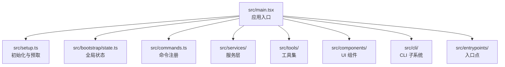
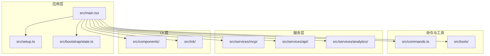
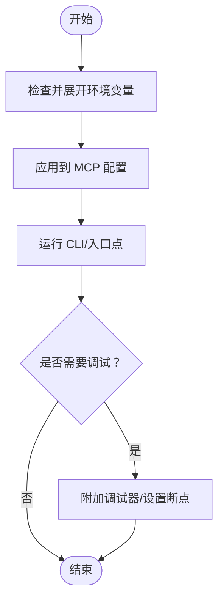
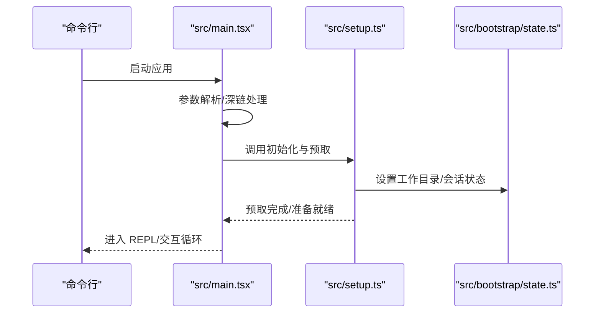
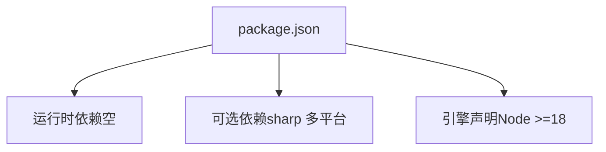

# 开发环境配置

<cite>
**本文档引用的文件**
- [package.json](file://package.json)
- [README.md](file://README.md)
- [src/main.tsx](file://src/main.tsx)
- [src/setup.ts](file://src/setup.ts)
- [src/bootstrap/state.ts](file://src/bootstrap/state.ts)
- [.gitignore](file://.gitignore)
- [src/services/mcp/envExpansion.ts](file://src/services/mcp/envExpansion.ts)
- [src/services/mcp/config.ts](file://src/services/mcp/config.ts)
</cite>

## 目录
1. [简介](#简介)
2. [项目结构](#项目结构)
3. [核心组件](#核心组件)
4. [架构总览](#架构总览)
5. [详细组件分析](#详细组件分析)
6. [依赖分析](#依赖分析)
7. [性能考虑](#性能考虑)
8. [故障排除指南](#故障排除指南)
9. [结论](#结论)
10. [附录](#附录)

## 简介
本指南面向希望在本地开发与调试 Claude Code 的工程师，聚焦于开发环境的系统要求、依赖安装、工具链配置、IDE 推荐、环境变量与本地开发服务器启动方法。项目基于 Node.js 运行时，采用模块化架构，包含 CLI 入口、命令体系、服务层、工具集与终端 UI 框架等模块。

## 项目结构
仓库采用按功能域划分的目录组织方式，主要模块如下：
- src/main.tsx：应用入口与主流程控制
- src/setup.ts：初始化与预取逻辑
- src/bootstrap/state.ts：全局状态管理
- src/commands/：命令实现集合
- src/services/：核心服务（如 MCP、分析、插件等）
- src/tools/：工具实现（文件编辑、搜索、终端等）
- src/components/：UI 组件（Ink/React）
- src/cli/：CLI 子系统与传输层
- src/entrypoints/：不同入口点（SDK、CLI、MCP 等）

图表来源
- [src/main.tsx](file://src/main.tsx)
- [src/setup.ts](file://src/setup.ts)
- [src/bootstrap/state.ts](file://src/bootstrap/state.ts)

章节来源
- [README.md](file://README.md)

## 核心组件
- 应用入口与主流程控制：负责解析参数、建立会话、初始化遥测与插件、启动 REPL、处理深链与直连等。
- 初始化与预取：在渲染前进行必要的数据预取与环境准备，确保首次交互的响应速度。
- 全局状态：集中管理会话、路径、计数器、遥测与代理等状态，支持跨模块共享。
- 命令体系：通过命令注册机制加载内置与插件命令，支持多入口与多模式。
- 服务层：包含 MCP、分析、策略限制、远程设置、OAuth 等服务。
- 工具集：封装文件读写、搜索、终端执行、网络请求等能力。
- UI 组件：基于 Ink/React 的终端 UI，提供对话、提示、状态展示等。
- CLI 子系统：命令行参数解析、子命令分发、传输层抽象。
- 入口点：支持 CLI、SDK、MCP 等多种运行形态。

章节来源
- [src/main.tsx](file://src/main.tsx)
- [src/setup.ts](file://src/setup.ts)
- [src/bootstrap/state.ts](file://src/bootstrap/state.ts)

## 架构总览
下图展示了从应用入口到各子系统的调用关系与职责边界：

图表来源
- [src/main.tsx](file://src/main.tsx)
- [src/setup.ts](file://src/setup.ts)
- [src/bootstrap/state.ts](file://src/bootstrap/state.ts)

## 详细组件分析

### 系统要求与运行时
- Node.js 版本要求：>= 18.0.0
- 引擎声明位于包配置中，确保本地开发与 CI 使用一致版本
- 包类型为模块（ESM），需以模块方式运行与打包

章节来源
- [package.json](file://package.json)

### 依赖安装与包管理
- 支持的包管理器：Bun 与 npm
- 依赖安装步骤（示例）：
  - 使用 Bun：bun install
  - 使用 npm：npm install
- 可选依赖：包含多平台的图像处理库（sharp），用于图片处理场景
- 本地开发无需生产依赖安装，仅需运行时依赖即可

章节来源
- [package.json](file://package.json)

### TypeScript 编译与构建
- 项目为 TypeScript 源码，采用模块化打包
- 构建产物为可执行 CLI（发布包内含源映射），开发阶段建议直接运行源码或使用包管理器提供的脚本
- 若需本地编译，请结合包管理器脚本与模块导入语法进行验证

章节来源
- [package.json](file://package.json)

### ESLint 与 Prettier 配置
- 未在仓库中发现 ESLint 与 Prettier 的配置文件
- 建议在本地启用 ESLint 与 Prettier，并保持与团队约定一致
- 本仓库已忽略 ESLint 缓存目录，避免污染提交

章节来源
- [.gitignore](file://.gitignore)

### IDE 配置建议
- 推荐使用 VS Code 并安装以下扩展（按需选择）：
  - TypeScript/JavaScript 支持
  - ESLint（若后续引入规则）
  - Prettier（若后续引入格式化）
  - GitLens（增强 Git 体验）
  - YAML/JSON 支持（如涉及配置文件）
- 调试配置：
  - 在 VS Code 中创建 launch.json，使用 Node 调试器附加到当前进程或以指定参数启动
  - 可利用调试标志（如 --inspect）进行断点调试
- 自动完成与智能感知：
  - 启用 TS/JS 扩展后，VS Code 将基于项目类型定义提供自动补全

[本节为通用 IDE 配置建议，不直接分析具体文件，故无“章节来源”]

### 环境变量与本地开发服务器
- 环境变量注入与展开：
  - 项目支持在 MCP 服务器配置中对环境变量进行展开（${VAR} 与 ${VAR:-default} 语法）
  - 该能力用于在配置文件中引用进程环境变量，便于本地与 CI 场景灵活切换
- 本地开发服务器：
  - 仓库未提供专用本地开发服务器脚本
  - 建议通过包管理器脚本或直接运行入口文件进行本地调试
  - 如需调试，可设置调试标志并使用 IDE 断点

图表来源
- [src/services/mcp/envExpansion.ts](file://src/services/mcp/envExpansion.ts)
- [src/services/mcp/config.ts](file://src/services/mcp/config.ts)

章节来源
- [src/services/mcp/envExpansion.ts](file://src/services/mcp/envExpansion.ts)
- [src/services/mcp/config.ts](file://src/services/mcp/config.ts)

### 初始化与启动流程
- 入口函数 main：负责安全检查、URL 深链处理、权限模式校验、会话初始化、遥测与插件加载等
- setup：在渲染前进行预取与环境准备，包括工作树、消息通道、钩子快照、插件钩子热重载等
- 全局状态：提供会话 ID、路径、计数器、遥测与代理等状态的统一访问

图表来源
- [src/main.tsx](file://src/main.tsx)
- [src/setup.ts](file://src/setup.ts)
- [src/bootstrap/state.ts](file://src/bootstrap/state.ts)

章节来源
- [src/main.tsx](file://src/main.tsx)
- [src/setup.ts](file://src/setup.ts)
- [src/bootstrap/state.ts](file://src/bootstrap/state.ts)

## 依赖分析
- 运行时依赖：项目以模块方式运行，未在包配置中声明显式的运行时依赖
- 可选依赖：包含多平台的图像处理库（sharp），用于图片处理场景
- 构建与打包：发布包包含源映射，开发阶段可直接运行源码或使用包管理器脚本

图表来源
- [package.json](file://package.json)

章节来源
- [package.json](file://package.json)

## 性能考虑
- 启动性能：入口处包含性能标记与检查点，初始化阶段尽量延迟非关键任务
- 预取策略：在渲染后进行部分后台预取，减少首帧阻塞
- 事件循环：避免在关键路径上执行阻塞操作，必要时使用异步与延迟执行

[本节为通用性能讨论，不直接分析具体文件，故无“章节来源”]

## 故障排除指南
- Node.js 版本过低：
  - 现象：启动时报错并退出
  - 处理：升级至 Node.js 18 或更高版本
- 权限模式与沙箱：
  - 现象：在特定环境下禁用高风险权限
  - 处理：遵循安全约束，避免在不受信任环境中跳过权限校验
- 环境变量缺失：
  - 现象：MCP 配置中的变量未被正确替换
  - 处理：确认环境变量存在或提供默认值；检查配置文件语法

章节来源
- [src/setup.ts](file://src/setup.ts)
- [src/services/mcp/envExpansion.ts](file://src/services/mcp/envExpansion.ts)
- [src/services/mcp/config.ts](file://src/services/mcp/config.ts)

## 结论
本指南总结了 Claude Code 的开发环境配置要点：系统要求（Node.js >= 18）、依赖安装（Bun/npm）、工具链（TypeScript/ESLint/Prettier）、IDE 配置（VS Code 插件与调试）、环境变量与 MCP 配置展开、以及初始化与启动流程。建议在本地按需启用 ESLint 与 Prettier，并结合调试标志进行问题定位。

[本节为总结性内容，不直接分析具体文件，故无“章节来源”]

## 附录
- 项目结构概览与模块职责已在“项目结构”与“架构总览”中给出
- 如需进一步了解命令体系、服务层或工具集的具体实现，可参考对应目录下的源文件

[本节为补充说明，不直接分析具体文件，故无“章节来源”]