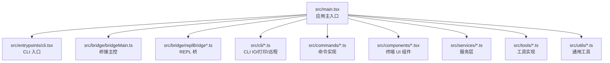
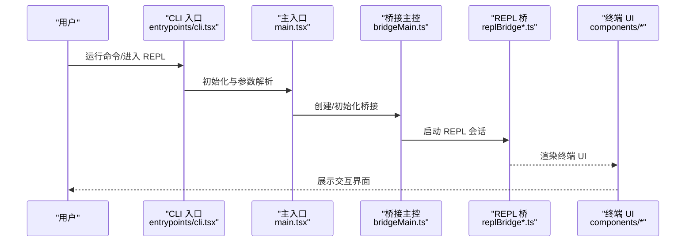
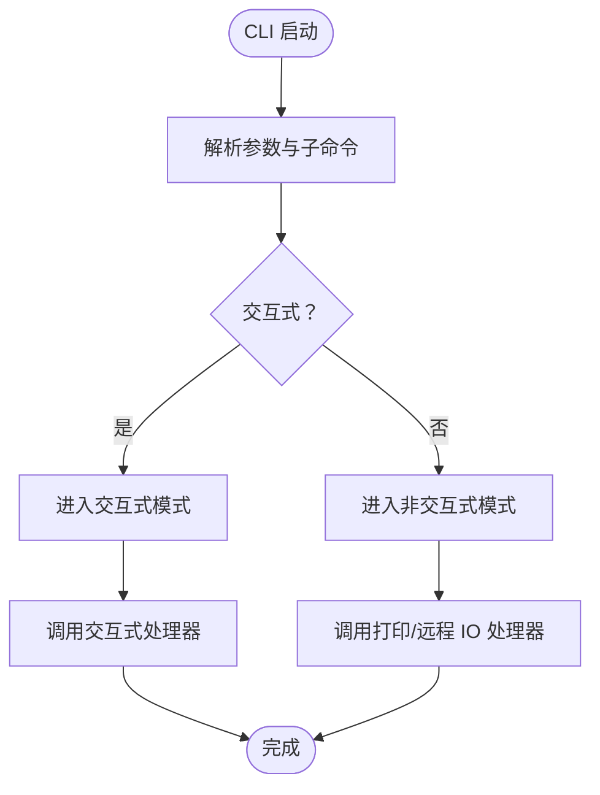
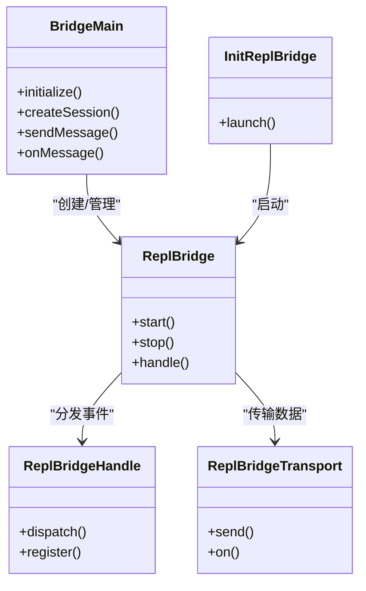
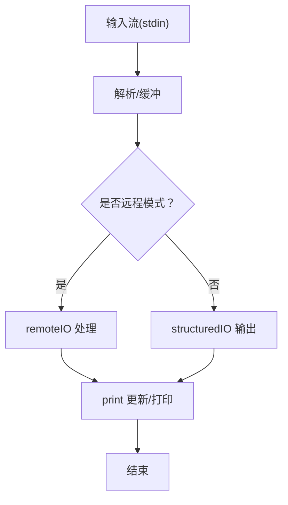
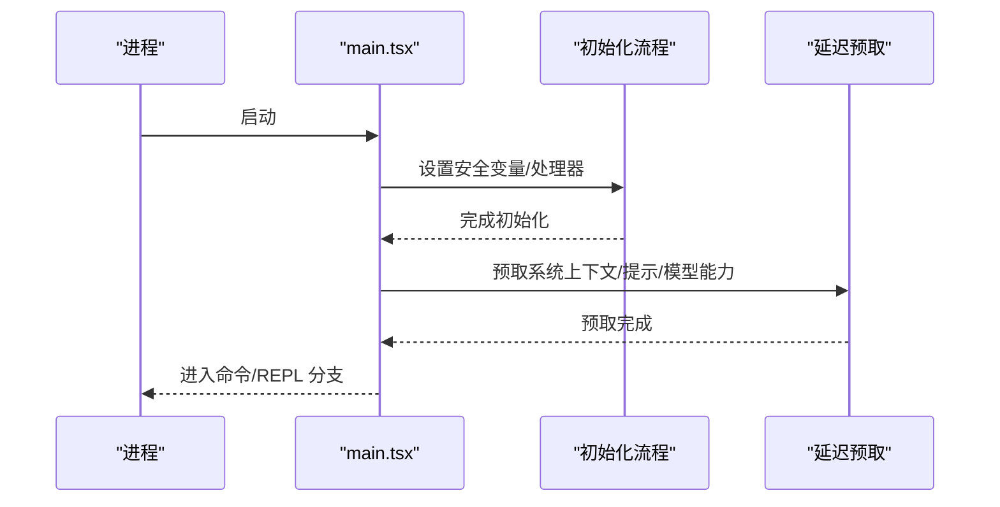
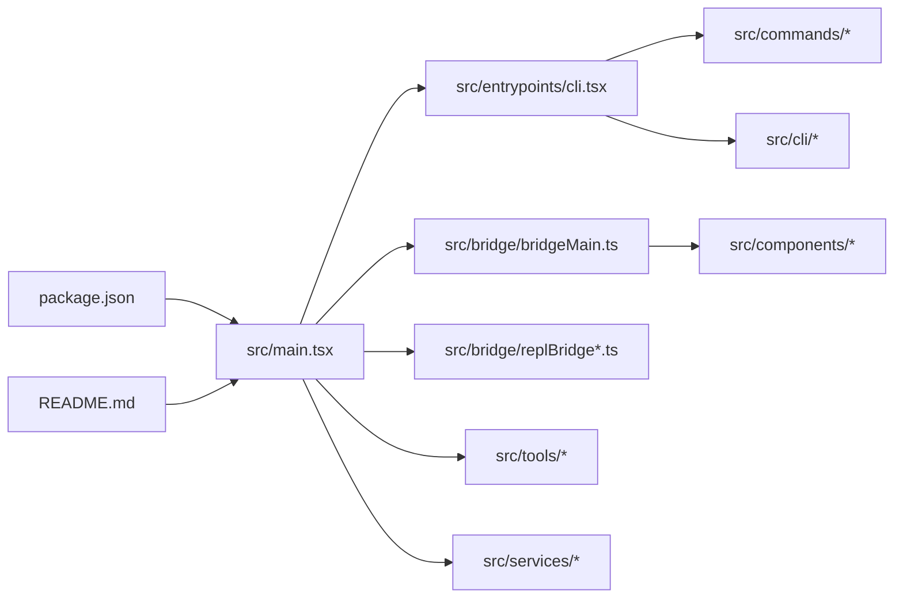

# 本地开发与调试

<cite>
**本文引用的文件**
- [package.json](file://package.json)
- [README.md](file://README.md)
- [src/main.tsx](file://src/main.tsx)
- [src/entrypoints/cli.tsx](file://src/entrypoints/cli.tsx)
- [src/cli/print.ts](file://src/cli/print.ts)
- [src/cli/remoteIO.ts](file://src/cli/remoteIO.ts)
- [src/cli/structuredIO.ts](file://src/cli/structuredIO.ts)
- [src/cli/handlers/util.tsx](file://src/cli/handlers/util.tsx)
- [src/interactiveHelpers.tsx](file://src/interactiveHelpers.tsx)
- [src/bridge/bridgeMain.ts](file://src/bridge/bridgeMain.ts)
- [src/bridge/replBridge.ts](file://src/bridge/replBridge.ts)
- [src/bridge/replBridgeHandle.ts](file://src/bridge/replBridgeHandle.ts)
- [src/bridge/replBridgeTransport.ts](file://src/bridge/replBridgeTransport.ts)
- [src/bridge/initReplBridge.ts](file://src/bridge/initReplBridge.ts)
- [src/bridge/debugUtils.ts](file://src/bridge/debugUtils.ts)
- [src/bridge/bridgeDebug.ts](file://src/bridge/bridgeDebug.ts)
- [src/bridge/bridgeConfig.ts](file://src/bridge/bridgeConfig.ts)
- [src/bridge/bridgeEnabled.ts](file://src/bridge/bridgeEnabled.ts)
- [src/bridge/bridgeUI.ts](file://src/bridge/bridgeUI.ts)
- [src/bridge/bridgeStatusUtil.ts](file://src/bridge/bridgeStatusUtil.ts)
- [src/bridge/bridgePermissionCallbacks.ts](file://src/bridge/bridgePermissionCallbacks.ts)
- [src/bridge/bridgePointer.ts](file://src/bridge/bridgePointer.ts)
- [src/bridge/bridgeApi.ts](file://src/bridge/bridgeApi.ts)
- [src/bridge/bridgeMessaging.ts](file://src/bridge/bridgeMessaging.ts)
- [src/bridge/bridgeEnabled.ts](file://src/bridge/bridgeEnabled.ts)
- [src/bridge/bridgeStatusUtil.ts](file://src/bridge/bridgeStatusUtil.ts)
- [src/bridge/bridgeUI.ts](file://src/bridge/bridgeUI.ts)
- [src/bridge/bridgePermissionCallbacks.ts](file://src/bridge/bridgePermissionCallbacks.ts)
- [src/bridge/bridgePointer.ts](file://src/bridge/bridgePointer.ts)
- [src/bridge/bridgeApi.ts](file://src/bridge/bridgeApi.ts)
- [src/bridge/bridgeMessaging.ts](file://src/bridge/bridgeMessaging.ts)
- [src/bridge/bridgeConfig.ts](file://src/bridge/bridgeConfig.ts)
- [src/bridge/bridgeEnabled.ts](file://src/bridge/bridgeEnabled.ts)
- [src/bridge/bridgeStatusUtil.ts](file://src/bridge/bridgeStatusUtil.ts)
- [src/bridge/bridgeUI.ts](file://src/bridge/bridgeUI.ts)
- [src/bridge/bridgePermissionCallbacks.ts](file://src/bridge/bridgePermissionCallbacks.ts)
- [src/bridge/bridgePointer.ts](file://src/bridge/bridgePointer.ts)
- [src/bridge/bridgeApi.ts](file://src/bridge/bridgeApi.ts)
- [src/bridge/bridgeMessaging.ts](file://src/bridge/bridgeMessaging.ts)
- [src/bridge/bridgeConfig.ts](file://src/bridge/bridgeConfig.ts)
- [src/bridge/bridgeEnabled.ts](file://src/bridge/bridgeEnabled.ts)
- [src/bridge/bridgeStatusUtil.ts](file://src/bridge/bridgeStatusUtil.ts)
- [src/bridge/bridgeUI.ts](file://src/bridge/bridgeUI.ts)
- [src/bridge/bridgePermissionCallbacks.ts](file://src/bridge/bridgePermissionCallbacks.ts)
- [src/bridge/bridgePointer.ts](file://src/bridge/bridgePointer.ts)
- [src/bridge/bridgeApi.ts](file://src/bridge/bridgeApi.ts)
- [src/bridge/bridgeMessaging.ts](file://src/bridge/bridgeMessaging.ts)
- [src/bridge/bridgeConfig.ts](file://src/bridge/bridgeConfig.ts)
- [src/bridge/bridgeEnabled.ts](file://src/bridge/bridgeEnabled.ts)
- [src/bridge/bridgeStatusUtil.ts](file://src/bridge/bridgeStatusUtil.ts)
- [src/bridge/bridgeUI.ts](file://src/bridge/bridgeUI.ts)
- [src/bridge/bridgePermissionCallbacks.ts](file://src/bridge/bridgePermissionCallbacks.ts)
- [src/bridge/bridgePointer.ts](file://src/bridge/bridgePointer.ts)
- [src/bridge/bridgeApi.ts](file://src/bridge/bridgeApi.ts)
- [src/bridge/bridgeMessaging.ts](file://src/bridge/bridgeMessaging.ts)
- [src/bridge/bridgeConfig.ts](file://src/bridge/bridgeConfig.ts)
- [src/bridge/bridgeEnabled.ts](file://src/bridge/bridgeEnabled.ts)
- [src/bridge/bridgeStatusUtil.ts](file://src/bridge/bridgeStatusUtil.ts)
- [src/bridge/bridgeUI.ts](file://src/bridge/bridgeUI.ts)
- [src/bridge/bridgePermissionCallbacks.ts](file://src/bridge/bridgePermissionCallbacks.ts)
- [src/bridge/bridgePointer.ts](file://src/bridge/bridgePointer.ts)
- [src/bridge/bridgeApi.ts](file://src/bridge/bridgeApi.ts)
- [src/bridge/bridgeMessaging.ts](file://src/bridge/bridgeMessaging.ts)
- [src/bridge/bridgeConfig.ts](file://src/bridge/bridgeConfig.ts)
- [src/bridge/bridgeEnabled.ts](file://src/bridge/bridgeEnabled.ts)
- [src/bridge/bridgeStatusUtil.ts](file://src/bridge/bridgeStatusUtil.ts)
- [src/bridge/bridgeUI.ts](file://src/bridge/bridgeUI.ts)
- [src/bridge/bridgePermissionCallbacks.ts](file://src/bridge/bridgePermissionCallbacks.ts)
- [src/bridge/bridgePointer.ts](file://src/bridge/bridgePointer.ts)
- [src/bridge/bridgeApi.ts](file://src/bridge/bridgeApi.ts)
- [src/bridge/bridgeMessaging.ts](file://src/bridge/bridgeMessaging.ts)
- [src/bridge/bridgeConfig.ts](file://src/bridge/bridgeConfig.ts)
- [src/bridge/bridgeEnabled.ts](file://src/bridge/bridgeEnabled.ts)
- [src/bridge/bridgeStatusUtil.ts](file://src/bridge/bridgeStatusUtil.ts)
- [src/bridge/bridgeUI.ts](file://src/bridge/bridgeUI.ts)
- [src/bridge/bridgePermissionCallbacks.ts](......)
</cite>

## 目录
1. [简介](#简介)
2. [项目结构](#项目结构)
3. [核心组件](#核心组件)
4. [架构总览](#架构总览)
5. [详细组件分析](#详细组件分析)
6. [依赖分析](#依赖分析)
7. [性能考虑](#性能考虑)
8. [故障排查指南](#故障排查指南)
9. [结论](#结论)
10. [附录](#附录)

## 简介
本指南面向希望在本地开发与调试 Claude Code 的工程师，聚焦以下目标：
- 启动开发服务器与热重载配置、调试模式设置
- 在本地运行与测试 CLI 命令，包括模拟用户输入与行为验证
- 使用浏览器开发者工具与断点调试、查看日志输出
- 常见开发场景调试：命令执行、工具调用、会话管理
- 测试新功能：单元测试、集成测试、端到端测试

本仓库为官方 CLI 工具的源码提取版本，采用模块化组织，包含 CLI 入口、命令实现、桥接层（Bridge）、REPL 桥、终端 UI（Ink）等模块。

## 项目结构
项目采用按职责分层的目录组织方式：
- src/main.tsx：应用主入口，负责初始化、参数解析、入口点判定、早期重写与深链处理、安全与信号处理、延迟预取等
- src/entrypoints/cli.tsx：CLI 入口，承载命令注册与交互式/非交互式分支
- src/cli/*：CLI 输入输出、远程 IO、结构化输出、打印与更新逻辑
- src/bridge/*：桥接层，负责与外部环境通信、REPL 桥、权限回调、状态工具、UI 桥接等
- src/commands/*：命令实现集合（如安装、登录、会话、插件、MCP 等）
- src/components/*：终端 UI 组件（基于 Ink/React）
- src/services/*：服务层（API、分析、策略限制、MCP 客户端、提示建议等）
- src/tools/*：工具实现（文件读写、搜索、Bash、Web 搜索、技能工具等）
- src/utils/*：通用工具函数（平台、配置、日志、错误、会话存储、沙箱等）

图表来源
- [src/main.tsx](file://src/main.tsx)
- [src/entrypoints/cli.tsx](file://src/entrypoints/cli.tsx)
- [src/bridge/bridgeMain.ts](file://src/bridge/bridgeMain.ts)
- [src/bridge/replBridge.ts](file://src/bridge/replBridge.ts)
- [src/cli/print.ts](file://src/cli/print.ts)
- [src/cli/remoteIO.ts](file://src/cli/remoteIO.ts)
- [src/cli/structuredIO.ts](file://src/cli/structuredIO.ts)
- [src/commands/init.ts](file://src/commands/init.ts)
- [src/components/App.tsx](file://src/components/App.tsx)
- [src/services/api/bootstrap.ts](file://src/services/api/bootstrap.ts)
- [src/tools/BashTool/index.ts](file://src/tools/BashTool/index.ts)
- [src/utils/config.ts](file://src/utils/config.ts)

章节来源
- [README.md:95-114](file://README.md#L95-L114)

## 核心组件
- 应用主入口与初始化
  - 主入口负责安全环境变量设置、警告处理器初始化、信号处理、URL 深链与连接参数重写、入口点判定、延迟预取等
  - 关键路径参考：[src/main.tsx](file://src/main.tsx)
- CLI 入口与命令系统
  - CLI 入口负责注册命令、解析参数、区分交互式与非交互式模式，并将控制权交给相应处理流程
  - 参考：[src/entrypoints/cli.tsx](file://src/entrypoints/cli.tsx)
- 桥接层与 REPL 桥
  - 桥接层负责与外部进程通信、权限回调、状态同步、UI 桥接；REPL 桥负责 REPL 会话与传输
  - 参考：[src/bridge/bridgeMain.ts](file://src/bridge/bridgeMain.ts)、[src/bridge/replBridge.ts](file://src/bridge/replBridge.ts)、[src/bridge/replBridgeHandle.ts](file://src/bridge/replBridgeHandle.ts)、[src/bridge/replBridgeTransport.ts](file://src/bridge/replBridgeTransport.ts)、[src/bridge/initReplBridge.ts](file://src/bridge/initReplBridge.ts)
- CLI IO 与打印
  - 负责标准输入输出、远程 IO、结构化输出、打印与更新逻辑
  - 参考：[src/cli/print.ts](file://src/cli/print.ts)、[src/cli/remoteIO.ts](file://src/cli/remoteIO.ts)、[src/cli/structuredIO.ts](file://src/cli/structuredIO.ts)
- 交互式辅助
  - 提供渲染、退出、消息展示等交互式辅助能力
  - 参考：[src/interactiveHelpers.tsx](file://src/interactiveHelpers.tsx)

章节来源
- [src/main.tsx:585-800](file://src/main.tsx#L585-L800)
- [src/entrypoints/cli.tsx](file://src/entrypoints/cli.tsx)
- [src/bridge/bridgeMain.ts](file://src/bridge/bridgeMain.ts)
- [src/bridge/replBridge.ts](file://src/bridge/replBridge.ts)
- [src/bridge/replBridgeHandle.ts](file://src/bridge/replBridgeHandle.ts)
- [src/bridge/replBridgeTransport.ts](file://src/bridge/replBridgeTransport.ts)
- [src/bridge/initReplBridge.ts](file://src/bridge/initReplBridge.ts)
- [src/cli/print.ts](file://src/cli/print.ts)
- [src/cli/remoteIO.ts](file://src/cli/remoteIO.ts)
- [src/cli/structuredIO.ts](file://src/cli/structuredIO.ts)
- [src/interactiveHelpers.tsx](file://src/interactiveHelpers.tsx)

## 架构总览
下图展示了从 CLI 到桥接层再到 REPL 的关键调用链路，以及与交互式 UI 的关系。

图表来源
- [src/entrypoints/cli.tsx](file://src/entrypoints/cli.tsx)
- [src/main.tsx](file://src/main.tsx)
- [src/bridge/bridgeMain.ts](file://src/bridge/bridgeMain.ts)
- [src/bridge/replBridge.ts](file://src/bridge/replBridge.ts)
- [src/bridge/replBridgeHandle.ts](file://src/bridge/replBridgeHandle.ts)
- [src/bridge/replBridgeTransport.ts](file://src/bridge/replBridgeTransport.ts)
- [src/bridge/initReplBridge.ts](file://src/bridge/initReplBridge.ts)
- [src/components/App.tsx](file://src/components/App.tsx)

## 详细组件分析

### 组件一：CLI 入口与命令系统
- 功能要点
  - 注册命令与子命令，解析参数，判断交互式/非交互式模式
  - 将控制权交由命令处理器或 REPL
- 关键实现位置
  - CLI 入口：[src/entrypoints/cli.tsx](file://src/entrypoints/cli.tsx)
  - 命令处理器与帮助信息：[src/commands/init.ts](file://src/commands/init.ts)
  - 交互式辅助：[src/interactiveHelpers.tsx](file://src/interactiveHelpers.tsx)

图表来源
- [src/entrypoints/cli.tsx](file://src/entrypoints/cli.tsx)
- [src/interactiveHelpers.tsx](file://src/interactiveHelpers.tsx)
- [src/cli/print.ts](file://src/cli/print.ts)
- [src/cli/remoteIO.ts](file://src/cli/remoteIO.ts)
- [src/cli/structuredIO.ts](file://src/cli/structuredIO.ts)

章节来源
- [src/entrypoints/cli.tsx](file://src/entrypoints/cli.tsx)
- [src/commands/init.ts](file://src/commands/init.ts)
- [src/interactiveHelpers.tsx](file://src/interactiveHelpers.tsx)

### 组件二：桥接层与 REPL 桥
- 功能要点
  - 桥接主控负责与外部进程通信、权限回调、状态同步
  - REPL 桥负责 REPL 会话生命周期、传输与事件处理
- 关键实现位置
  - 桥接主控：[src/bridge/bridgeMain.ts](file://src/bridge/bridgeMain.ts)
  - REPL 桥：[src/bridge/replBridge.ts](file://src/bridge/replBridge.ts)、[src/bridge/replBridgeHandle.ts](file://src/bridge/replBridgeHandle.ts)、[src/bridge/replBridgeTransport.ts](file://src/bridge/replBridgeTransport.ts)
  - 初始化 REPL 桥：[src/bridge/initReplBridge.ts](file://src/bridge/initReplBridge.ts)
  - 调试与配置：[src/bridge/debugUtils.ts](file://src/bridge/debugUtils.ts)、[src/bridge/bridgeDebug.ts](file://src/bridge/bridgeDebug.ts)、[src/bridge/bridgeConfig.ts](file://src/bridge/bridgeConfig.ts)

图表来源
- [src/bridge/bridgeMain.ts](file://src/bridge/bridgeMain.ts)
- [src/bridge/replBridge.ts](file://src/bridge/replBridge.ts)
- [src/bridge/replBridgeHandle.ts](file://src/bridge/replBridgeHandle.ts)
- [src/bridge/replBridgeTransport.ts](file://src/bridge/replBridgeTransport.ts)
- [src/bridge/initReplBridge.ts](file://src/bridge/initReplBridge.ts)

章节来源
- [src/bridge/bridgeMain.ts](file://src/bridge/bridgeMain.ts)
- [src/bridge/replBridge.ts](file://src/bridge/replBridge.ts)
- [src/bridge/replBridgeHandle.ts](file://src/bridge/replBridgeHandle.ts)
- [src/bridge/replBridgeTransport.ts](file://src/bridge/replBridgeTransport.ts)
- [src/bridge/initReplBridge.ts](file://src/bridge/initReplBridge.ts)
- [src/bridge/debugUtils.ts](file://src/bridge/debugUtils.ts)
- [src/bridge/bridgeDebug.ts](file://src/bridge/bridgeDebug.ts)
- [src/bridge/bridgeConfig.ts](file://src/bridge/bridgeConfig.ts)

### 组件三：CLI IO 与打印
- 功能要点
  - 标准输入输出处理、远程 IO、结构化输出、打印与更新逻辑
- 关键实现位置
  - 打印与更新：[src/cli/print.ts](file://src/cli/print.ts)
  - 远程 IO：[src/cli/remoteIO.ts](file://src/cli/remoteIO.ts)
  - 结构化 IO：[src/cli/structuredIO.ts](file://src/cli/structuredIO.ts)

图表来源
- [src/cli/print.ts](file://src/cli/print.ts)
- [src/cli/remoteIO.ts](file://src/cli/remoteIO.ts)
- [src/cli/structuredIO.ts](file://src/cli/structuredIO.ts)

章节来源
- [src/cli/print.ts](file://src/cli/print.ts)
- [src/cli/remoteIO.ts](file://src/cli/remoteIO.ts)
- [src/cli/structuredIO.ts](file://src/cli/structuredIO.ts)

### 组件四：主入口与初始化
- 功能要点
  - 安全环境变量设置、警告处理器、信号处理、URL 深链与连接参数重写、入口点判定、延迟预取
- 关键实现位置
  - 主入口与初始化：[src/main.tsx](file://src/main.tsx)

图表来源
- [src/main.tsx](file://src/main.tsx)

章节来源
- [src/main.tsx](file://src/main.tsx)

## 依赖分析
- 开发与运行时依赖
  - 包管理与脚本：[package.json](file://package.json)
  - 项目结构与用途说明：[README.md](file://README.md)
- 内部模块耦合
  - CLI 入口依赖主入口与交互式辅助
  - 主入口依赖桥接层、REPL 桥、服务层与工具层
  - 桥接层与 REPL 桥相互协作，向上对接 UI 组件

图表来源
- [package.json](file://package.json)
- [README.md](file://README.md)
- [src/main.tsx](file://src/main.tsx)
- [src/entrypoints/cli.tsx](file://src/entrypoints/cli.tsx)
- [src/bridge/bridgeMain.ts](file://src/bridge/bridgeMain.ts)
- [src/bridge/replBridge.ts](file://src/bridge/replBridge.ts)
- [src/commands/init.ts](file://src/commands/init.ts)
- [src/cli/print.ts](file://src/cli/print.ts)
- [src/cli/remoteIO.ts](file://src/cli/remoteIO.ts)
- [src/cli/structuredIO.ts](file://src/cli/structuredIO.ts)
- [src/components/App.tsx](file://src/components/App.tsx)

章节来源
- [package.json](file://package.json)
- [README.md](file://README.md)
- [src/main.tsx](file://src/main.tsx)

## 性能考虑
- 延迟预取与首帧优化
  - 主入口在首次渲染后启动延迟预取，避免阻塞首帧；可通过特定环境变量跳过预取以测量启动性能
  - 参考：[src/main.tsx](file://src/main.tsx)
- 事件循环阻塞检测
  - 在特定构建中启用事件循环阻塞检测，用于定位主线程卡顿
  - 参考：[src/main.tsx](file://src/main.tsx)
- 沙箱与系统证书相关遥测
  - 启动遥测包含沙箱与证书相关标志，便于诊断网络与执行环境问题
  - 参考：[src/main.tsx](file://src/main.tsx)

章节来源
- [src/main.tsx](file://src/main.tsx)

## 故障排查指南
- 调试模式与断点
  - 通过检查调试标志（如 --inspect）与环境变量（NODE_OPTIONS）判断当前是否处于调试模式
  - 参考：[src/main.tsx](file://src/main.tsx)
- 日志输出
  - 使用内部日志工具记录诊断信息，避免 PII 泄露
  - 参考：[src/main.tsx](file://src/main.tsx)
- 桥接与 REPL 调试
  - 使用桥接调试工具与配置开关，检查桥接状态与消息传递
  - 参考：[src/bridge/debugUtils.ts](file://src/bridge/debugUtils.ts)、[src/bridge/bridgeDebug.ts](file://src/bridge/bridgeDebug.ts)、[src/bridge/bridgeConfig.ts](file://src/bridge/bridgeConfig.ts)
- 权限与状态
  - 检查权限回调与状态工具，确认权限流程与状态同步
  - 参考：[src/bridge/bridgePermissionCallbacks.ts](file://src/bridge/bridgePermissionCallbacks.ts)、[src/bridge/bridgeStatusUtil.ts](file://src/bridge/bridgeStatusUtil.ts)
- UI 与桥接
  - 若 UI 异常，检查桥接 UI 组件与桥接指针状态
  - 参考：[src/bridge/bridgeUI.ts](file://src/bridge/bridgeUI.ts)、[src/bridge/bridgePointer.ts](file://src/bridge/bridgePointer.ts)

章节来源
- [src/main.tsx](file://src/main.tsx)
- [src/bridge/debugUtils.ts](file://src/bridge/debugUtils.ts)
- [src/bridge/bridgeDebug.ts](file://src/bridge/bridgeDebug.ts)
- [src/bridge/bridgeConfig.ts](file://src/bridge/bridgeConfig.ts)
- [src/bridge/bridgePermissionCallbacks.ts](file://src/bridge/bridgePermissionCallbacks.ts)
- [src/bridge/bridgeStatusUtil.ts](file://src/bridge/bridgeStatusUtil.ts)
- [src/bridge/bridgeUI.ts](file://src/bridge/bridgeUI.ts)
- [src/bridge/bridgePointer.ts](file://src/bridge/bridgePointer.ts)

## 结论
本指南围绕 Claude Code 的本地开发与调试提供了从入口到桥接、从 CLI 到 UI 的全景视图。通过理解主入口初始化流程、CLI 命令系统、桥接与 REPL 桥机制，结合调试工具与日志输出，可以高效地进行命令执行、工具调用与会话管理的调试与测试。

## 附录

### 附录 A：启动开发服务器与调试模式
- 启动步骤
  - 克隆仓库并安装依赖后，使用 Node/Bun 运行 CLI 入口
  - 参考：[README.md:26-94](file://README.md#L26-L94)
- 调试模式
  - 通过 --inspect 或 --debug 系列标志启用调试；若检测到调试模式，主入口会提前退出以避免不一致行为
  - 参考：[src/main.tsx](file://src/main.tsx)
- 环境变量
  - 可通过 NODE_OPTIONS 传入调试标志
  - 参考：[src/main.tsx](file://src/main.tsx)

章节来源
- [README.md:26-94](file://README.md#L26-L94)
- [src/main.tsx](file://src/main.tsx)

### 附录 B：本地运行与测试 CLI 命令
- 交互式与非交互式模式
  - 交互式：进入 REPL/UI 界面
  - 非交互式：-p/--print 模式直接输出结果
  - 参考：[src/entrypoints/cli.tsx](file://src/entrypoints/cli.tsx)、[src/cli/print.ts](file://src/cli/print.ts)
- 模拟用户输入
  - 使用 stdin 缓冲与远程 IO 机制，结合结构化输入输出进行测试
  - 参考：[src/cli/remoteIO.ts](file://src/cli/remoteIO.ts)、[src/cli/structuredIO.ts](file://src/cli/structuredIO.ts)
- 行为验证
  - 通过命令处理器与交互式辅助进行行为验证
  - 参考：[src/commands/init.ts](file://src/commands/init.ts)、[src/interactiveHelpers.tsx](file://src/interactiveHelpers.tsx)

章节来源
- [src/entrypoints/cli.tsx](file://src/entrypoints/cli.tsx)
- [src/cli/print.ts](file://src/cli/print.ts)
- [src/cli/remoteIO.ts](file://src/cli/remoteIO.ts)
- [src/cli/structuredIO.ts](file://src/cli/structuredIO.ts)
- [src/commands/init.ts](file://src/commands/init.ts)
- [src/interactiveHelpers.tsx](file://src/interactiveHelpers.tsx)

### 附录 C：调试技巧与最佳实践
- 浏览器开发者工具与断点
  - 在调试模式下设置断点，结合日志输出定位问题
  - 参考：[src/main.tsx](file://src/main.tsx)
- 查看日志输出
  - 使用内部日志工具记录诊断信息，避免 PII 泄露
  - 参考：[src/main.tsx](file://src/main.tsx)
- 常见场景调试
  - 命令执行：检查 CLI 参数解析与命令处理器
  - 工具调用：检查工具实现与沙箱/权限
  - 会话管理：检查桥接状态与 REPL 生命周期
  - 参考：[src/bridge/bridgeMain.ts](file://src/bridge/bridgeMain.ts)、[src/bridge/replBridge*.ts](file://src/bridge/replBridge.ts)

章节来源
- [src/main.tsx](file://src/main.tsx)
- [src/bridge/bridgeMain.ts](file://src/bridge/bridgeMain.ts)
- [src/bridge/replBridge.ts](file://src/bridge/replBridge.ts)

### 附录 D：测试新功能
- 单元测试
  - 针对工具与服务层编写单元测试，覆盖边界条件与错误路径
  - 参考：[src/tools/](file://src/tools/)
- 集成测试
  - 使用 CLI 入口与桥接层进行集成测试，验证端到端流程
  - 参考：[src/entrypoints/cli.tsx](file://src/entrypoints/cli.tsx)、[src/bridge/bridgeMain.ts](file://src/bridge/bridgeMain.ts)
- 端到端测试
  - 通过结构化输出与远程 IO 验证完整工作流
  - 参考：[src/cli/structuredIO.ts](file://src/cli/structuredIO.ts)、[src/cli/remoteIO.ts](file://src/cli/remoteIO.ts)

章节来源
- [src/tools/](file://src/tools/)
- [src/entrypoints/cli.tsx](file://src/entrypoints/cli.tsx)
- [src/bridge/bridgeMain.ts](file://src/bridge/bridgeMain.ts)
- [src/cli/structuredIO.ts](file://src/cli/structuredIO.ts)
- [src/cli/remoteIO.ts](file://src/cli/remoteIO.ts)