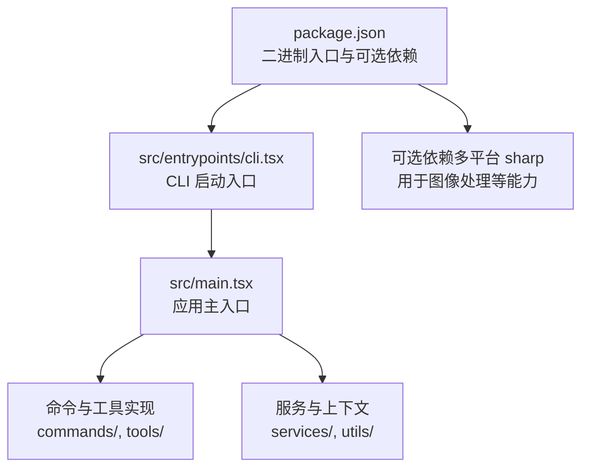
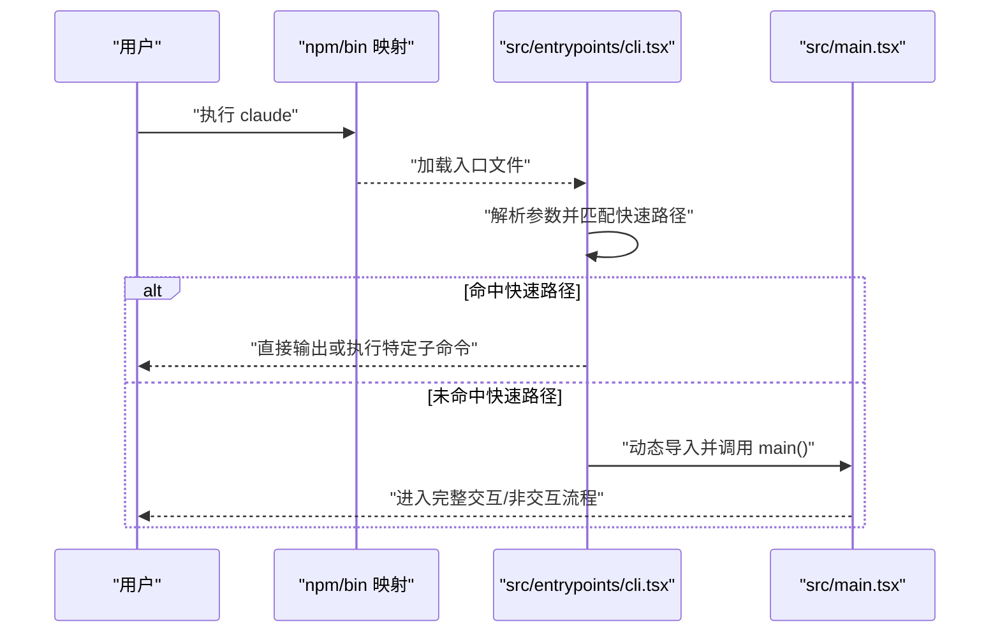
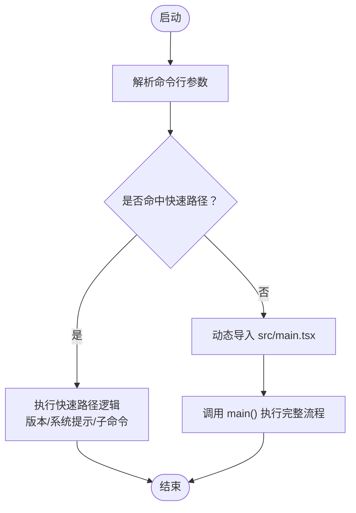
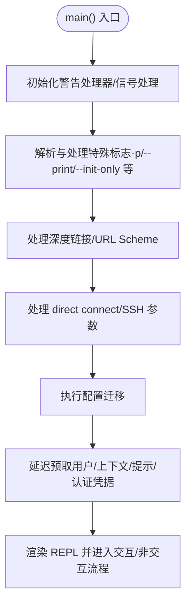
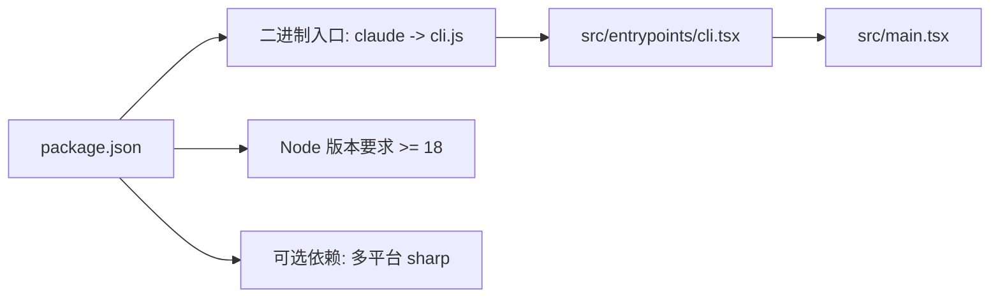

# 构建与打包

<cite>
**本文引用的文件**
- [package.json](file://package.json)
- [README.md](file://README.md)
- [src/entrypoints/cli.tsx](file://src/entrypoints/cli.tsx)
- [src/main.tsx](file://src/main.tsx)
- [src/commands/version.ts](file://src/commands/version.ts)
</cite>

## 目录
1. [简介](#简介)
2. [项目结构](#项目结构)
3. [核心组件](#核心组件)
4. [架构总览](#架构总览)
5. [详细组件分析](#详细组件分析)
6. [依赖关系分析](#依赖关系分析)
7. [性能考量](#性能考量)
8. [故障排查指南](#故障排查指南)
9. [结论](#结论)
10. [附录](#附录)

## 简介
本指南面向希望理解并复现 Claude Code（CLI）构建与打包流程的读者。根据仓库信息可知，官方以“打包为单文件 CLI”的方式发布，且本仓库通过源码映射提取了 TypeScript 源代码以便阅读与参考。本文将围绕以下目标展开：  
- 解释 TypeScript 编译与模块打包策略（基于现有入口与特性门控的线索）  
- 说明 CLI 可执行文件的入口点与运行路径  
- 描述二进制产物的生成方式与跨平台依赖处理思路  
- 给出发布前检查清单与本地测试打包建议  

## 项目结构
该仓库采用按功能域划分的目录组织方式，关键与构建打包相关的目录与文件如下：  
- src/entrypoints/cli.tsx：CLI 启动入口，包含快速路径与特性门控分支  
- src/main.tsx：应用主入口，负责初始化、命令解析与运行时逻辑  
- package.json：定义二进制入口名、Node 版本要求、可选依赖（含多平台 sharp 图像库）  
- README.md：说明来源、结构与使用方式  

图表来源
- [package.json:1-34](file://package.json#L1-L34)
- [src/entrypoints/cli.tsx:1-303](file://src/entrypoints/cli.tsx#L1-L303)
- [src/main.tsx:1-800](file://src/main.tsx#L1-L800)

章节来源
- [README.md:95-114](file://README.md#L95-L114)
- [package.json:1-34](file://package.json#L1-L34)

## 核心组件
- CLI 启动入口（src/entrypoints/cli.tsx）  
  - 提供多个快速路径（如版本查询、系统提示导出、桥接模式、守护进程、模板作业、环境运行器、自托管运行器、工作树与 tmux 集成等），并在命中快速路径时避免加载完整 CLI，从而缩短启动时间。  
  - 对部分子命令路径进行内联特性门控，确保在外部构建中剔除不适用的功能分支。  
  - 在未命中快速路径时，调用 src/main.tsx 执行完整流程。  
- 应用主入口（src/main.tsx）  
  - 负责初始化警告处理器、信号处理、深度链接与协议处理、远程连接与 SSH 会话预处理、迁移与设置加载、延迟预取等。  
  - 包含对调试模式的检测与退出逻辑，以及对性能剖析的打点。  
- 包装与分发（package.json）  
  - 定义二进制入口名为“claude”，指向已打包的 cli.js；声明 Node 版本要求；声明 optionalDependencies 中的多平台 sharp 依赖，用于图像处理能力的跨平台支持。

章节来源
- [src/entrypoints/cli.tsx:33-299](file://src/entrypoints/cli.tsx#L33-L299)
- [src/main.tsx:231-271](file://src/main.tsx#L231-L271)
- [package.json:4-6](file://package.json#L4-L6)
- [package.json:7-9](file://package.json#L7-L9)
- [package.json:22-32](file://package.json#L22-L32)

## 架构总览
下图展示了从用户执行“claude”到应用主入口的典型调用链，以及 CLI 快速路径的分流逻辑。

图表来源
- [src/entrypoints/cli.tsx:33-299](file://src/entrypoints/cli.tsx#L33-L299)
- [src/main.tsx:585-800](file://src/main.tsx#L585-L800)
- [package.json:4-6](file://package.json#L4-L6)

## 详细组件分析

### CLI 启动入口（src/entrypoints/cli.tsx）
- 快速路径设计  
  - 版本查询：仅输出版本号，零模块加载。  
  - 系统提示导出：在受控条件下渲染并输出系统提示文本。  
  - 多种子命令快速通道：桥接模式、守护进程、后台会话管理、模板作业、环境运行器、自托管运行器、工作树与 tmux 集成等。  
- 特性门控与死代码消除  
  - 使用特性门控（feature）在构建期剔除外部构建不需要的功能分支，减少产物体积与加载开销。  
- 运行时环境准备  
  - 设置 NODE_OPTIONS（容器场景下的内存限制）、禁用某些自动功能（如 Corepack 自动固定）。  
- 与主入口衔接  
  - 未命中快速路径时，启动早期输入捕获，再动态导入 src/main.tsx 并执行其 main 函数。

图表来源
- [src/entrypoints/cli.tsx:33-299](file://src/entrypoints/cli.tsx#L33-L299)

章节来源
- [src/entrypoints/cli.tsx:33-299](file://src/entrypoints/cli.tsx#L33-L299)

### 应用主入口（src/main.tsx）
- 初始化与安全  
  - 初始化警告处理器与信号处理；在调试模式下提前退出；设置 Windows 安全变量防止路径劫持；启用诊断输出。  
- 深度链接与协议处理  
  - 支持 cc:// 与 cc+unix:// 协议重写；macOS URL Scheme 处理；内部 open 子命令在 headless 模式下的行为。  
- 远程与 SSH 会话  
  - 支持 direct connect 与 SSH 会话参数预处理，将主机、工作目录、权限模式等信息注入后续 REPL 分支。  
- 迁移与设置  
  - 执行多版本迁移；加载设置与策略限制；延迟预取系统上下文与相关资源。  
- 性能与可观测性  
  - 启动阶段性能打点；证书与 CA 相关环境变量统计；事件循环阻塞检测（外部构建条件）。  

图表来源
- [src/main.tsx:585-800](file://src/main.tsx#L585-L800)
- [src/main.tsx:326-352](file://src/main.tsx#L326-L352)
- [src/main.tsx:360-380](file://src/main.tsx#L360-L380)
- [src/main.tsx:403-431](file://src/main.tsx#L403-L431)

章节来源
- [src/main.tsx:585-800](file://src/main.tsx#L585-L800)
- [src/main.tsx:231-271](file://src/main.tsx#L231-L271)

### 版本号与快速路径（src/commands/version.ts）
- 版本查询快速路径由 CLI 入口直接处理，无需加载其他模块，直接输出版本字符串。  
- 该实现体现了“最小化模块加载”的启动优化策略。

章节来源
- [src/entrypoints/cli.tsx:36-42](file://src/entrypoints/cli.tsx#L36-L42)
- [src/commands/version.ts](file://src/commands/version.ts)

## 依赖关系分析
- 二进制入口与 Node 版本  
  - package.json 将二进制入口命名为“claude”，指向 cli.js；要求 Node >= 18。  
- 可选依赖与跨平台支持  
  - optionalDependencies 中包含多平台 sharp 依赖（Darwin x64/arm64、Linux x64/arm/arm64、Linux musl arm64/x64、Windows x64/arm64），用于图像处理等能力的跨平台可用性。  
- 构建与打包线索  
  - 仓库 README 指出官方以“打包为单文件 CLI”的形式发布，并包含源码映射文件，便于提取原始 TypeScript 源码。  
  - CLI 入口与主入口均采用动态导入与特性门控，体现“按需加载 + 死代码消除”的打包策略。

图表来源
- [package.json:4-6](file://package.json#L4-L6)
- [package.json:7-9](file://package.json#L7-L9)
- [package.json:22-32](file://package.json#L22-L32)
- [README.md:26-93](file://README.md#L26-L93)

章节来源
- [package.json:1-34](file://package.json#L1-L34)
- [README.md:26-93](file://README.md#L26-L93)

## 性能考量
- 启动路径优化  
  - CLI 入口对常见子命令与标志提供快速路径，避免加载完整 CLI，显著降低冷启动时间。  
- 动态导入与延迟预取  
  - 主入口在首次渲染后才执行非关键的预取任务，减少主线程阻塞，提升首帧渲染体验。  
- 特性门控与死代码消除  
  - 通过特性门控在构建期剔除外部构建不需要的功能分支，减小产物体积与加载成本。  
- 环境与安全  
  - 在容器场景设置内存上限；在调试模式下提前退出；设置 Windows 安全变量防止路径劫持。

章节来源
- [src/entrypoints/cli.tsx:33-299](file://src/entrypoints/cli.tsx#L33-L299)
- [src/main.tsx:388-431](file://src/main.tsx#L388-L431)
- [src/main.tsx:231-271](file://src/main.tsx#L231-L271)

## 故障排查指南
- 调试模式与启动退出  
  - 若检测到调试标志或 Inspector 激活，主入口会直接退出，避免在调试状态下执行完整流程。  
- 深度链接与协议处理异常  
  - 若协议处理失败或 URL Scheme 异常，应检查系统注册表与应用标识符，确保 URL 能被正确路由至 CLI。  
- 远程连接与 SSH 会话  
  - 若 SSH 会话在 headless 模式下报错，需确认不支持该模式；检查主机、权限模式与额外参数传递是否正确。  
- 容器与内存限制  
  - 在容器环境中，CLI 会自动设置内存上限；若出现 OOM 或性能问题，可调整 NODE_OPTIONS 或宿主机资源配额。  
- 可选依赖缺失  
  - 若缺少对应平台的 sharp 依赖，图像处理相关功能可能不可用；可通过安装对应 optionalDependencies 来修复。

章节来源
- [src/main.tsx:231-271](file://src/main.tsx#L231-L271)
- [src/main.tsx:644-677](file://src/main.tsx#L644-L677)
- [src/main.tsx:706-795](file://src/main.tsx#L706-L795)
- [package.json:22-32](file://package.json#L22-L32)

## 结论
- 本仓库通过源码映射还原了官方“打包为单文件 CLI”的发布形态，CLI 入口与主入口采用“快速路径 + 动态导入 + 特性门控”的组合策略，兼顾启动速度与功能覆盖。  
- 发布产物通过二进制入口名“claude”暴露，Node 版本要求为 >= 18，并通过 optionalDependencies 提供多平台图像处理能力。  
- 对于构建与打包实践，建议遵循“最小化加载、按需导入、死代码消除”的原则，并结合平台差异与可选依赖进行跨平台验证。

## 附录

### 发布前检查清单
- 版本号更新  
  - 确认 package.json 中的版本号与发布计划一致。  
- 变更日志生成  
  - 基于迁移与变更记录，生成对应版本的变更摘要。  
- 依赖版本验证  
  - 校验 optionalDependencies 的平台覆盖完整性；核对 Node 版本要求与 CI 环境一致性。  
- 构建产物校验  
  - 确认二进制入口名“claude”指向正确的打包产物；验证源码映射文件（如存在）与产物一致性。  
- 跨平台兼容性  
  - 在 Darwin/Linux/Windows 上分别验证 CLI 行为；对缺少可选依赖的平台进行降级提示或补充安装。  

### 本地测试打包建议
- 本地打包与验证  
  - 使用官方打包方式生成单文件 CLI，并在不同终端与 Shell 环境下验证启动与命令执行。  
- 跨平台测试  
  - 在各目标平台（Darwin x64/arm64、Linux x64/arm/arm64、Windows x64/arm64）上分别运行 CLI，验证功能与性能。  
- 功能回归  
  - 针对 CLI 快速路径（版本查询、系统提示导出、子命令等）进行回归测试；对主入口的初始化、迁移与预取流程进行端到端验证。  
- 安全与环境  
  - 在容器与非容器环境下分别测试；验证调试模式、Inspector 激活与安全变量的行为。  

章节来源
- [package.json:18-20](file://package.json#L18-L20)
- [package.json:22-32](file://package.json#L22-L32)
- [README.md:26-93](file://README.md#L26-L93)