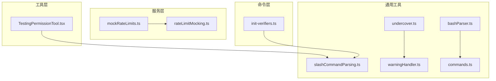
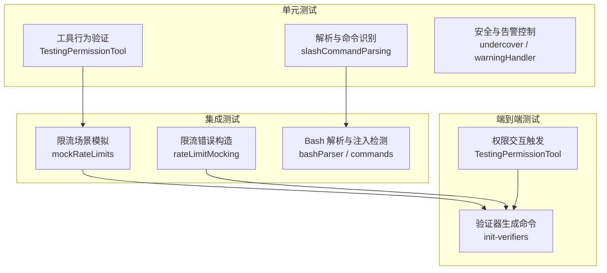
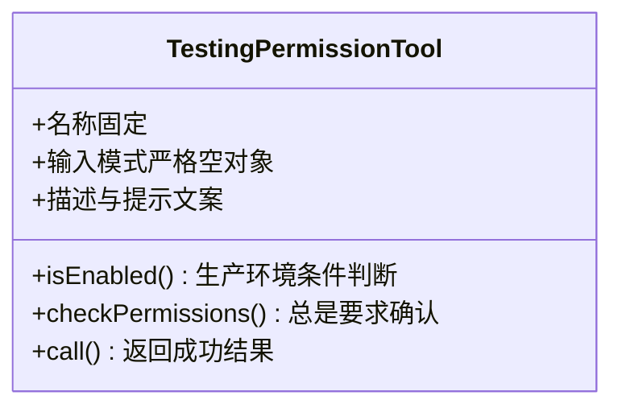
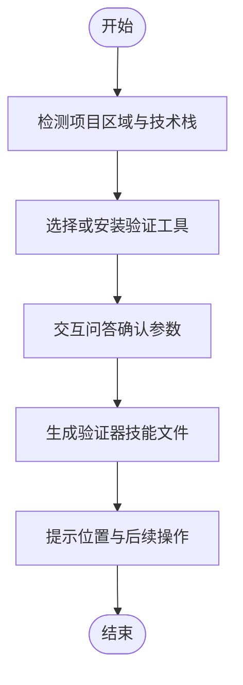
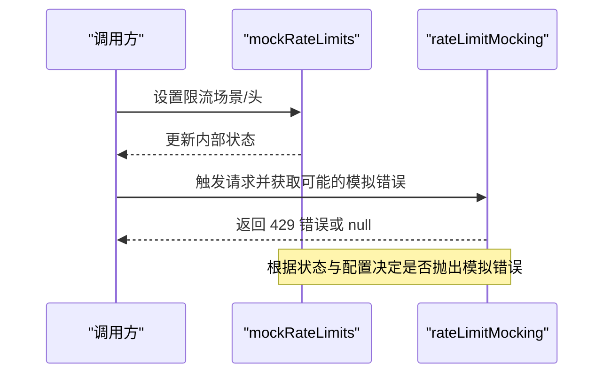
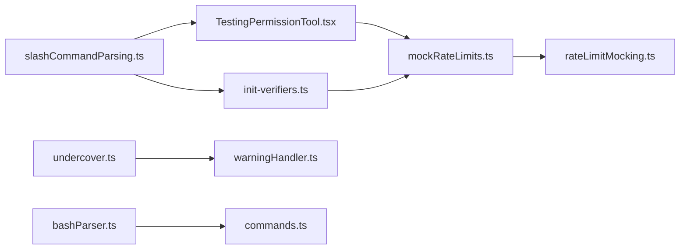

# 测试策略

<cite>
**本文引用的文件**
- [package.json](file://package.json)
- [src/tools/testing/TestingPermissionTool.tsx](file://src/tools/testing/TestingPermissionTool.tsx)
- [src/utils/slashCommandParsing.ts](file://src/utils/slashCommandParsing.ts)
- [src/services/mockRateLimits.ts](file://src/services/mockRateLimits.ts)
- [src/services/rateLimitMocking.ts](file://src/services/rateLimitMocking.ts)
- [src/commands/init-verifiers.ts](file://src/commands/init-verifiers.ts)
- [src/utils/bash/bashParser.ts](file://src/utils/bash/bashParser.ts)
- [src/utils/bash/commands.ts](file://src/utils/bash/commands.ts)
- [src/utils/undercover.ts](file://src/utils/undercover.ts)
- [src/utils/warningHandler.ts](file://src/utils/warningHandler.ts)
</cite>

## 目录
1. [引言](#引言)
2. [项目结构](#项目结构)
3. [核心组件](#核心组件)
4. [架构总览](#架构总览)
5. [详细组件分析](#详细组件分析)
6. [依赖分析](#依赖分析)
7. [性能考量](#性能考量)
8. [故障排查指南](#故障排查指南)
9. [结论](#结论)
10. [附录](#附录)

## 引言
本指南面向 Claude Code 的测试体系，围绕测试金字塔（单元测试、集成测试、端到端测试）给出可落地的策略与实践建议。文档重点覆盖以下方面：
- 测试金字塔层级关系与职责划分
- 各类测试的编写方法：工具测试、命令测试、服务测试
- 测试环境配置：测试数据库、模拟对象、测试数据准备
- 覆盖率与质量指标：代码覆盖率阈值、关键路径测试、边界条件测试
- 持续集成中的测试流程：自动化执行、测试报告生成、失败处理

## 项目结构
从仓库结构可见，测试相关能力主要体现在三类模块：
- 工具层：工具定义与权限校验，便于在端到端场景中触发交互式确认
- 命令层：初始化验证器等命令，用于生成可自动执行的端到端验证技能
- 服务层：限流模拟与错误构造，支持对速率限制、配额状态等进行可控测试

图表来源
- [src/tools/testing/TestingPermissionTool.tsx:1-74](file://src/tools/testing/TestingPermissionTool.tsx#L1-L74)
- [src/commands/init-verifiers.ts:1-263](file://src/commands/init-verifiers.ts#L1-L263)
- [src/services/mockRateLimits.ts:1-200](file://src/services/mockRateLimits.ts#L1-L200)
- [src/services/rateLimitMocking.ts:89-144](file://src/services/rateLimitMocking.ts#L89-L144)
- [src/utils/slashCommandParsing.ts:1-60](file://src/utils/slashCommandParsing.ts#L1-L60)
- [src/utils/undercover.ts:1-54](file://src/utils/undercover.ts#L1-L54)
- [src/utils/warningHandler.ts:1-41](file://src/utils/warningHandler.ts#L1-L41)
- [src/utils/bash/bashParser.ts:3821-3861](file://src/utils/bash/bashParser.ts#L3821-L3861)
- [src/utils/bash/commands.ts:447-485](file://src/utils/bash/commands.ts#L447-L485)

章节来源
- [package.json:18-34](file://package.json#L18-L34)

## 核心组件
- 工具测试：通过 TestingPermissionTool 构造“总是弹出权限对话框”的测试工具，便于在端到端流程中验证权限交互链路与用户确认路径。
- 命令测试：init-verifiers 命令用于自动生成不同类型的验证器（Web UI、CLI、API），为端到端测试提供可复用的验证技能模板。
- 服务测试：mockRateLimits 与 rateLimitMocking 提供多种限流场景的模拟头与错误构造，支撑对配额、超限、快速模式限流等行为的可控测试。

章节来源
- [src/tools/testing/TestingPermissionTool.tsx:1-74](file://src/tools/testing/TestingPermissionTool.tsx#L1-L74)
- [src/commands/init-verifiers.ts:1-263](file://src/commands/init-verifiers.ts#L1-L263)
- [src/services/mockRateLimits.ts:1-200](file://src/services/mockRateLimits.ts#L1-L200)
- [src/services/rateLimitMocking.ts:89-144](file://src/services/rateLimitMocking.ts#L89-L144)

## 架构总览
下图展示测试金字塔在代码库中的映射关系：工具层负责最小粒度的行为验证；命令层负责跨组件的端到端流程；服务层提供基础设施级别的模拟与断言。

图表来源
- [src/tools/testing/TestingPermissionTool.tsx:1-74](file://src/tools/testing/TestingPermissionTool.tsx#L1-L74)
- [src/utils/slashCommandParsing.ts:1-60](file://src/utils/slashCommandParsing.ts#L1-L60)
- [src/utils/undercover.ts:1-54](file://src/utils/undercover.ts#L1-L54)
- [src/utils/warningHandler.ts:1-41](file://src/utils/warningHandler.ts#L1-L41)
- [src/services/mockRateLimits.ts:1-200](file://src/services/mockRateLimits.ts#L1-L200)
- [src/services/rateLimitMocking.ts:89-144](file://src/services/rateLimitMocking.ts#L89-L144)
- [src/utils/bash/bashParser.ts:3821-3861](file://src/utils/bash/bashParser.ts#L3821-L3861)
- [src/utils/bash/commands.ts:447-485](file://src/utils/bash/commands.ts#L447-L485)
- [src/commands/init-verifiers.ts:1-263](file://src/commands/init-verifiers.ts#L1-L263)

## 详细组件分析

### 工具测试：TestingPermissionTool
- 设计目标：在模型调用时总是弹出权限对话框，用于验证端到端流程中的权限交互与用户确认路径。
- 关键点：
  - 权限检查始终返回“需要确认”
  - 在生产构建中通过条件判断禁用该工具，避免影响真实用户
  - 可作为端到端测试的稳定触发点，确保权限链路被覆盖

图表来源
- [src/tools/testing/TestingPermissionTool.tsx:1-74](file://src/tools/testing/TestingPermissionTool.tsx#L1-L74)

章节来源
- [src/tools/testing/TestingPermissionTool.tsx:1-74](file://src/tools/testing/TestingPermissionTool.tsx#L1-L74)

### 命令测试：init-verifiers
- 设计目标：根据项目类型与技术栈，自动生成 Web UI、CLI、API 三类验证器技能，形成可复用的端到端测试骨架。
- 关键点：
  - 自动检测子项目区域与技术栈
  - 针对不同验证方式（Playwright、Tmux、HTTP）提供安装与配置指引
  - 生成的验证器遵循约定命名，便于 Verify Agent 自动发现与加载

图表来源
- [src/commands/init-verifiers.ts:1-263](file://src/commands/init-verifiers.ts#L1-L263)

章节来源
- [src/commands/init-verifiers.ts:1-263](file://src/commands/init-verifiers.ts#L1-L263)

### 服务测试：mockRateLimits 与 rateLimitMocking
- 设计目标：在不触达真实 API 的前提下，模拟多种限流与配额场景，支撑对错误处理、重试逻辑、快速模式限流等行为的可控测试。
- 关键点：
  - 支持逐项设置/清除限流头，包含统一状态、重置时间、替代方案、5 小时/7 天用量等
  - 提供“无头 429”场景，用于测试未携带标准头的错误路径
  - 将模拟错误转换为标准 APIError，便于上层统一处理

图表来源
- [src/services/mockRateLimits.ts:1-200](file://src/services/mockRateLimits.ts#L1-L200)
- [src/services/rateLimitMocking.ts:89-144](file://src/services/rateLimitMocking.ts#L89-L144)

章节来源
- [src/services/mockRateLimits.ts:1-200](file://src/services/mockRateLimits.ts#L1-L200)
- [src/services/mockRateLimits.ts:590-857](file://src/services/mockRateLimits.ts#L590-L857)
- [src/services/rateLimitMocking.ts:89-144](file://src/services/rateLimitMocking.ts#L89-L144)

### 通用工具：slashCommandParsing、undercover、warningHandler、bashParser、commands
- slashCommandParsing：解析斜杠命令，为命令测试提供输入解析基础
- undercover：在公开/开源场景下启用安全指令与信息剥离，保障测试环境隔离
- warningHandler：抑制已知内部警告，避免干扰测试输出
- bashParser/commands：解析 Bash 命令与注入检测示例，为命令测试提供边界条件与安全基线

章节来源
- [src/utils/slashCommandParsing.ts:1-60](file://src/utils/slashCommandParsing.ts#L1-L60)
- [src/utils/undercover.ts:1-54](file://src/utils/undercover.ts#L1-L54)
- [src/utils/warningHandler.ts:1-41](file://src/utils/warningHandler.ts#L1-L41)
- [src/utils/bash/bashParser.ts:3821-3861](file://src/utils/bash/bashParser.ts#L3821-L3861)
- [src/utils/bash/commands.ts:447-485](file://src/utils/bash/commands.ts#L447-L485)

## 依赖分析
- 工具层与命令层之间通过命令解析与权限交互建立联系，TestingPermissionTool 可作为 init-verifiers 生成的验证器在端到端流程中的稳定触发点
- 服务层的 mockRateLimits 与 rateLimitMocking 为上层请求提供可插拔的错误与头信息，降低对外部服务的耦合
- 通用工具为测试提供输入解析、安全与告警控制的基础能力

图表来源
- [src/utils/slashCommandParsing.ts:1-60](file://src/utils/slashCommandParsing.ts#L1-L60)
- [src/tools/testing/TestingPermissionTool.tsx:1-74](file://src/tools/testing/TestingPermissionTool.tsx#L1-L74)
- [src/commands/init-verifiers.ts:1-263](file://src/commands/init-verifiers.ts#L1-L263)
- [src/services/mockRateLimits.ts:1-200](file://src/services/mockRateLimits.ts#L1-L200)
- [src/services/rateLimitMocking.ts:89-144](file://src/services/rateLimitMocking.ts#L89-L144)
- [src/utils/undercover.ts:1-54](file://src/utils/undercover.ts#L1-L54)
- [src/utils/warningHandler.ts:1-41](file://src/utils/warningHandler.ts#L1-L41)
- [src/utils/bash/bashParser.ts:3821-3861](file://src/utils/bash/bashParser.ts#L3821-L3861)
- [src/utils/bash/commands.ts:447-485](file://src/utils/bash/commands.ts#L447-L485)

## 性能考量
- 单元测试优先：针对工具与解析函数的纯函数逻辑，应保持高执行速度与低资源占用
- 集成测试聚焦关键路径：对限流模拟与错误构造进行分层测试，避免重复调用外部服务
- 端到端测试尽量短路：利用 TestingPermissionTool 与 init-verifiers 生成的验证器，缩短等待与准备时间
- 并行化与隔离：测试间避免共享状态，必要时使用进程隔离与临时目录

## 故障排查指南
- 权限交互异常
  - 确认 TestingPermissionTool 的 isEnabled 条件与运行环境一致
  - 检查命令解析是否正确，避免输入格式导致的权限链路绕过
- 限流场景不稳定
  - 使用 mockRateLimits 的逐项设置/清除能力，逐步定位问题头
  - 对比 rateLimitMocking 的错误构造逻辑，确认是否命中预期分支
- 命令注入与安全
  - 借助 bashParser 与 commands 的注入检测示例，完善边界条件测试
- 输出噪声与告警
  - 检查 undercover 与 warningHandler 的开关，确保测试输出清晰

章节来源
- [src/tools/testing/TestingPermissionTool.tsx:1-74](file://src/tools/testing/TestingPermissionTool.tsx#L1-L74)
- [src/utils/slashCommandParsing.ts:1-60](file://src/utils/slashCommandParsing.ts#L1-L60)
- [src/services/mockRateLimits.ts:1-200](file://src/services/mockRateLimits.ts#L1-L200)
- [src/services/rateLimitMocking.ts:89-144](file://src/services/rateLimitMocking.ts#L89-L144)
- [src/utils/bash/bashParser.ts:3821-3861](file://src/utils/bash/bashParser.ts#L3821-L3861)
- [src/utils/bash/commands.ts:447-485](file://src/utils/bash/commands.ts#L447-L485)
- [src/utils/undercover.ts:1-54](file://src/utils/undercover.ts#L1-L54)
- [src/utils/warningHandler.ts:1-41](file://src/utils/warningHandler.ts#L1-L41)

## 结论
本测试策略以测试金字塔为主线，结合工具、命令与服务三个层面的能力，形成从单元到端到端的完整测试闭环。通过 TestingPermissionTool、init-verifiers 与 mockRateLimits/rateLimitMocking 的协同，可在不依赖真实外部服务的前提下，高效覆盖关键路径与边界条件，并为持续集成提供稳定的自动化执行基础。

## 附录
- 持续集成建议
  - 单元测试：优先执行，失败即停
  - 集成测试：按场景分组并行，使用 mockRateLimits 的可控头
  - 端到端测试：使用 init-verifiers 生成的验证器，结合 TestingPermissionTool 触发权限链路
  - 报告与失败处理：统一输出 JSON/JUnit 报告，失败时保留日志与快照，自动归档