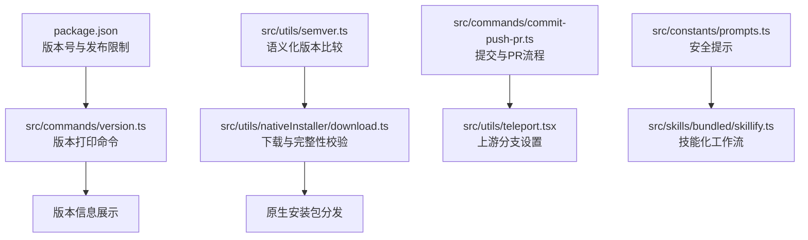
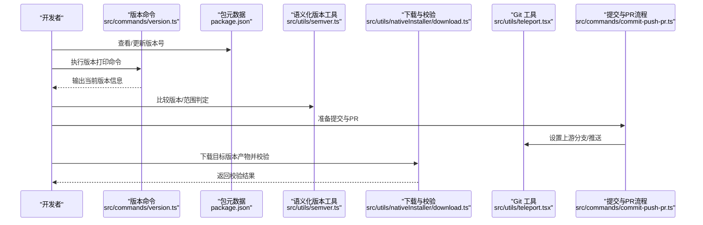
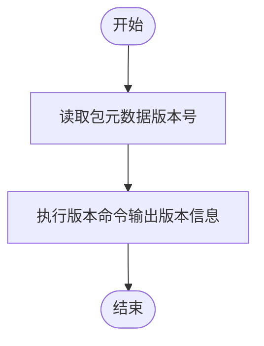
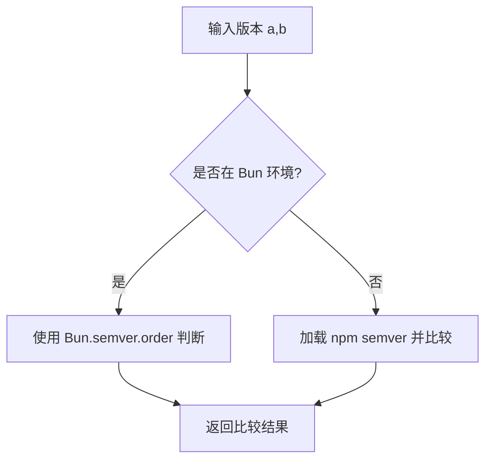
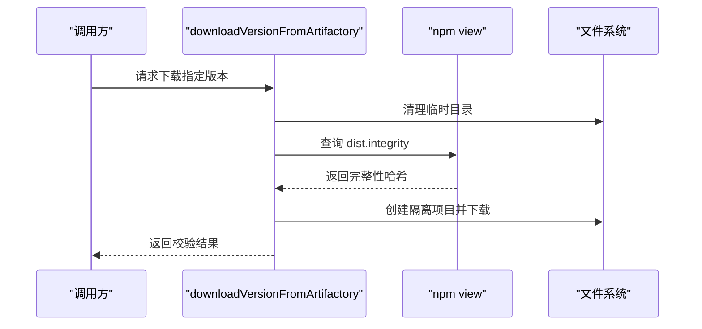
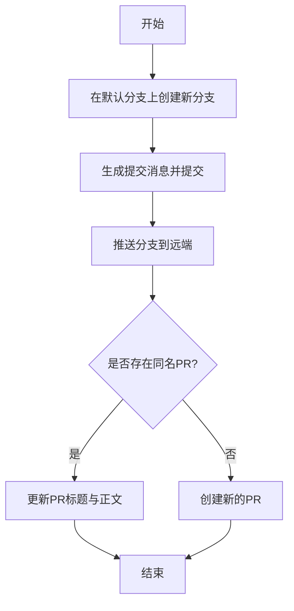
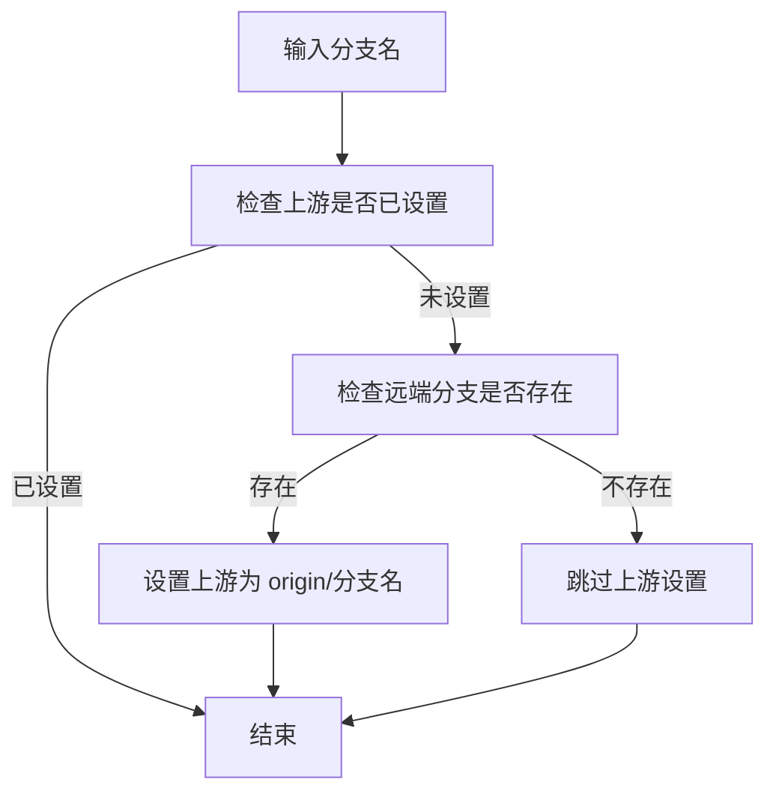
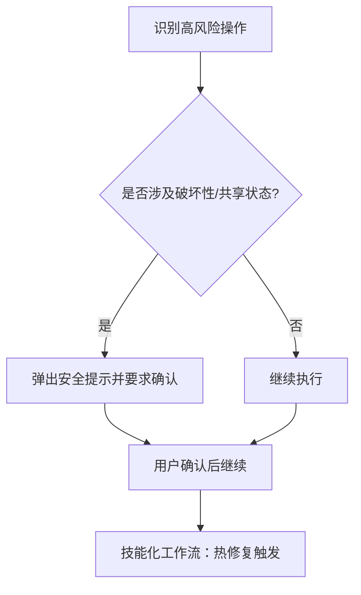
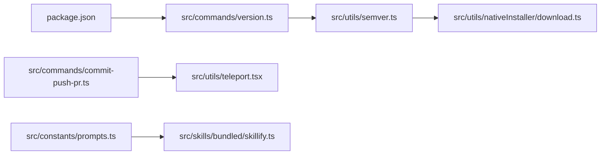

# 版本发布流程

<cite>
**本文引用的文件**
- [package.json](file://package.json)
- [README.md](file://README.md)
- [src/commands/version.ts](file://src/commands/version.ts)
- [src/utils/semver.ts](file://src/utils/semver.ts)
- [src/utils/nativeInstaller/download.ts](file://src/utils/nativeInstaller/download.ts)
- [src/commands/commit-push-pr.ts](file://src/commands/commit-push-pr.ts)
- [src/utils/teleport.tsx](file://src/utils/teleport.tsx)
- [src/constants/prompts.ts](file://src/constants/prompts.ts)
- [src/skills/bundled/skillify.ts](file://src/skills/bundled/skillify.ts)
</cite>

## 目录
1. [简介](#简介)
2. [项目结构](#项目结构)
3. [核心组件](#核心组件)
4. [架构总览](#架构总览)
5. [详细组件分析](#详细组件分析)
6. [依赖关系分析](#依赖关系分析)
7. [性能考量](#性能考量)
8. [故障排查指南](#故障排查指南)
9. [结论](#结论)
10. [附录](#附录)

## 简介
本指南面向 Claude Code 的版本发布流程，结合仓库中现有的版本信息、工具与脚本，给出可操作的版本管理策略与发布步骤。重点覆盖：
- 语义化版本控制与版本号规则
- 发布分支管理建议
- 发布前准备：版本更新、变更日志整理、兼容性检查
- 发布流程步骤：代码冻结、自动化测试、构建打包、发布验证
- 发布后处理：版本标记、文档更新、通知机制
- 回滚策略与紧急修复流程
- 发布权限管理与安全检查

## 项目结构
该仓库为 Claude Code 的源码提取版本，包含 CLI、命令实现、服务、工具、类型定义等模块。与版本发布直接相关的文件包括：
- 包元数据与发布限制：package.json
- 版本打印命令：src/commands/version.ts
- 语义化版本比较工具：src/utils/semver.ts
- 原生安装包下载与完整性校验：src/utils/nativeInstaller/download.ts
- 提交与拉取请求工作流提示：src/commands/commit-push-pr.ts
- Git 上游分支设置辅助：src/utils/teleport.tsx
- 安全与破坏性操作提示：src/constants/prompts.ts
- 技能化工作流设计（含热修复触发）：src/skills/bundled/skillify.ts

图表来源
- [package.json:1-34](file://package.json#L1-L34)
- [src/commands/version.ts:1-23](file://src/commands/version.ts#L1-L23)
- [src/utils/semver.ts:1-59](file://src/utils/semver.ts#L1-L59)
- [src/utils/nativeInstaller/download.ts:147-201](file://src/utils/nativeInstaller/download.ts#L147-L201)
- [src/commands/commit-push-pr.ts:80-106](file://src/commands/commit-push-pr.ts#L80-L106)
- [src/utils/teleport.tsx:211-246](file://src/utils/teleport.tsx#L211-L246)
- [src/constants/prompts.ts:260-272](file://src/constants/prompts.ts#L260-L272)
- [src/skills/bundled/skillify.ts:71-86](file://src/skills/bundled/skillify.ts#L71-L86)

章节来源
- [package.json:1-34](file://package.json#L1-L34)
- [README.md:1-120](file://README.md#L1-L120)

## 核心组件
- 版本号来源与发布限制
  - 当前版本号由包元数据提供；发布脚本包含“禁止直接发布”的保护逻辑，需通过受控流程发布。
- 版本打印命令
  - 提供当前运行版本信息输出，便于发布后验证。
- 语义化版本比较
  - 提供跨环境的版本比较与满足性判断，支撑发布前后的版本判定。
- 原生安装包下载与完整性校验
  - 通过 npm 视图获取 dist.integrity 并进行下载与校验，保障发布产物安全。
- 提交与 PR 流程
  - 提供分支命名、提交消息、PR 创建/更新的模板化建议，规范发布前变更流程。
- 上游分支设置
  - 自动检测并设置上游分支，避免发布后推送失败。
- 安全提示
  - 对破坏性与共享状态相关操作进行风险提示，防止误操作影响发布质量。
- 技能化工作流
  - 设计了“热修复”等触发场景，指导紧急修复流程。

章节来源
- [package.json:18-20](file://package.json#L18-L20)
- [src/commands/version.ts:3-10](file://src/commands/version.ts#L3-L10)
- [src/utils/semver.ts:19-59](file://src/utils/semver.ts#L19-L59)
- [src/utils/nativeInstaller/download.ts:151-201](file://src/utils/nativeInstaller/download.ts#L151-L201)
- [src/commands/commit-push-pr.ts:80-106](file://src/commands/commit-push-pr.ts#L80-L106)
- [src/utils/teleport.tsx:215-246](file://src/utils/teleport.tsx#L215-L246)
- [src/constants/prompts.ts:260-272](file://src/constants/prompts.ts#L260-L272)
- [src/skills/bundled/skillify.ts:84-86](file://src/skills/bundled/skillify.ts#L84-L86)

## 架构总览
下图展示了从版本号到发布产物校验的关键路径，以及与发布流程相关的交互点。

图表来源
- [src/commands/version.ts:3-10](file://src/commands/version.ts#L3-L10)
- [package.json:3](file://package.json#L3)
- [src/utils/semver.ts:19-59](file://src/utils/semver.ts#L19-L59)
- [src/utils/nativeInstaller/download.ts:151-201](file://src/utils/nativeInstaller/download.ts#L151-L201)
- [src/utils/teleport.tsx:215-246](file://src/utils/teleport.tsx#L215-L246)
- [src/commands/commit-push-pr.ts:80-106](file://src/commands/commit-push-pr.ts#L80-L106)

## 详细组件分析

### 组件A：版本号与发布限制
- 版本号来源
  - 包元数据中的版本字段用于标识当前版本。
- 发布限制
  - 发布脚本包含“禁止直接发布”的保护逻辑，需通过受控流程发布。
- 版本打印命令
  - 提供当前运行版本信息输出，便于发布后验证。

图表来源
- [package.json:3](file://package.json#L3)
- [src/commands/version.ts:3-10](file://src/commands/version.ts#L3-L10)

章节来源
- [package.json:18-20](file://package.json#L18-L20)
- [src/commands/version.ts:3-10](file://src/commands/version.ts#L3-L10)

### 组件B：语义化版本比较
- 能力概述
  - 在 Bun 环境使用内置 semver，否则回退到 npm semver，提供比较、满足性判断与排序。
- 性能特性
  - Bun.semver.order 相比 npm semver 快约 20 倍，适合在发布前进行大量版本比较。

图表来源
- [src/utils/semver.ts:19-59](file://src/utils/semver.ts#L19-L59)

章节来源
- [src/utils/semver.ts:19-59](file://src/utils/semver.ts#L19-L59)

### 组件C：原生安装包下载与完整性校验
- 能力概述
  - 通过 npm 视图获取 dist.integrity，再在隔离环境中下载并校验产物完整性。
- 关键步骤
  - 删除部分下载残留
  - 获取平台特定包名
  - 获取并校验完整性哈希
  - 在临时目录创建隔离 npm 项目并下载

图表来源
- [src/utils/nativeInstaller/download.ts:151-201](file://src/utils/nativeInstaller/download.ts#L151-L201)

章节来源
- [src/utils/nativeInstaller/download.ts:151-201](file://src/utils/nativeInstaller/download.ts#L151-L201)

### 组件D：提交与拉取请求流程
- 能力概述
  - 提供分支创建、提交、推送、PR 创建/更新的模板化建议，确保发布前变更规范化。
- 关键要点
  - 分支命名前缀建议
  - 提交消息格式与可选归属信息
  - PR 标题长度与正文结构建议

图表来源
- [src/commands/commit-push-pr.ts:80-106](file://src/commands/commit-push-pr.ts#L80-L106)

章节来源
- [src/commands/commit-push-pr.ts:80-106](file://src/commands/commit-push-pr.ts#L80-L106)

### 组件E：上游分支设置
- 能力概述
  - 自动检测并设置上游分支，避免发布后推送失败。
- 关键步骤
  - 检查上游是否已设置
  - 若远端存在对应分支则设置上游
  - 失败时记录日志但不中断流程

图表来源
- [src/utils/teleport.tsx:215-246](file://src/utils/teleport.tsx#L215-L246)

章节来源
- [src/utils/teleport.tsx:215-246](file://src/utils/teleport.tsx#L215-L246)

### 组件F：安全提示与紧急修复
- 安全提示
  - 对破坏性与共享状态相关操作进行风险提示，防止误操作影响发布质量。
- 紧急修复
  - 技能化工作流中包含“热修复”触发场景，指导快速修复流程。

图表来源
- [src/constants/prompts.ts:260-272](file://src/constants/prompts.ts#L260-L272)
- [src/skills/bundled/skillify.ts:84-86](file://src/skills/bundled/skillify.ts#L84-L86)

章节来源
- [src/constants/prompts.ts:260-272](file://src/constants/prompts.ts#L260-L272)
- [src/skills/bundled/skillify.ts:84-86](file://src/skills/bundled/skillify.ts#L84-L86)

## 依赖关系分析
- 版本号与发布限制
  - 包元数据决定版本号；发布脚本限制直接发布，需遵循受控流程。
- 版本命令与语义化版本工具
  - 版本命令输出当前版本；语义化版本工具提供比较能力，支撑发布前后版本判定。
- 下载与校验
  - 下载流程依赖 npm 视图获取完整性哈希，并在隔离环境中下载与校验。
- 提交与PR流程
  - 与 Git 工具协同，确保分支与上游设置正确，避免发布后推送失败。
- 安全提示与紧急修复
  - 通过安全提示降低误操作风险；技能化工作流指导热修复。

图表来源
- [package.json:3](file://package.json#L3)
- [src/commands/version.ts:3-10](file://src/commands/version.ts#L3-L10)
- [src/utils/semver.ts:19-59](file://src/utils/semver.ts#L19-L59)
- [src/utils/nativeInstaller/download.ts:151-201](file://src/utils/nativeInstaller/download.ts#L151-L201)
- [src/commands/commit-push-pr.ts:80-106](file://src/commands/commit-push-pr.ts#L80-L106)
- [src/utils/teleport.tsx:215-246](file://src/utils/teleport.tsx#L215-L246)
- [src/constants/prompts.ts:260-272](file://src/constants/prompts.ts#L260-L272)
- [src/skills/bundled/skillify.ts:84-86](file://src/skills/bundled/skillify.ts#L84-L86)

章节来源
- [package.json:18-20](file://package.json#L18-L20)
- [src/utils/semver.ts:19-59](file://src/utils/semver.ts#L19-L59)
- [src/utils/nativeInstaller/download.ts:151-201](file://src/utils/nativeInstaller/download.ts#L151-L201)
- [src/commands/commit-push-pr.ts:80-106](file://src/commands/commit-push-pr.ts#L80-L106)
- [src/utils/teleport.tsx:215-246](file://src/utils/teleport.tsx#L215-L246)
- [src/constants/prompts.ts:260-272](file://src/constants/prompts.ts#L260-L272)
- [src/skills/bundled/skillify.ts:84-86](file://src/skills/bundled/skillify.ts#L84-L86)

## 性能考量
- 版本比较性能
  - 使用 Bun.semver.order 可显著提升版本比较速度，建议在发布前的版本判定阶段优先使用 Bun 环境。
- 下载与校验
  - 通过 npm 视图一次性获取完整性哈希，减少多次网络往返；隔离环境下载避免污染本地环境。

章节来源
- [src/utils/semver.ts:19-59](file://src/utils/semver.ts#L19-L59)
- [src/utils/nativeInstaller/download.ts:151-201](file://src/utils/nativeInstaller/download.ts#L151-L201)

## 故障排查指南
- 发布被阻止
  - 若发布脚本报错，需遵循受控流程，检查 AUTHORIZED 环境变量与发布策略。
- 版本命令输出异常
  - 检查包元数据版本号与宏替换是否正确。
- 下载失败或校验失败
  - 确认 npm 视图返回的 dist.integrity 是否有效；检查网络与镜像配置；清理临时目录后重试。
- 推送失败
  - 使用上游分支设置工具自动设置上游；确认远端分支存在且名称匹配。
- 高风险操作误触
  - 遵循安全提示，对破坏性与共享状态操作进行二次确认。

章节来源
- [package.json:18-20](file://package.json#L18-L20)
- [src/commands/version.ts:3-10](file://src/commands/version.ts#L3-L10)
- [src/utils/nativeInstaller/download.ts:151-201](file://src/utils/nativeInstaller/download.ts#L151-L201)
- [src/utils/teleport.tsx:215-246](file://src/utils/teleport.tsx#L215-L246)
- [src/constants/prompts.ts:260-272](file://src/constants/prompts.ts#L260-L272)

## 结论
本指南基于仓库现有文件，给出了 Claude Code 版本发布的可操作流程：以包元数据为版本依据，借助版本命令与语义化版本工具进行版本判定，通过提交与 PR 流程规范变更，利用上游分支设置与下载校验保障发布质量，并以安全提示与技能化工作流应对紧急修复。建议在实际落地时补充自动化脚本与 CI/CD 集成，确保流程稳定可靠。

## 附录
- 术语
  - 语义化版本：遵循主版本.次版本.修订号的版本号规则，变更类型对应版本号递增。
  - 代码冻结：在发布窗口内停止非必要变更，确保发布质量。
  - 完整性校验：通过 dist.integrity 校验下载产物的正确性。
- 参考文件
  - 包元数据与发布限制：[package.json:1-34](file://package.json#L1-L34)
  - 版本打印命令：[src/commands/version.ts:1-23](file://src/commands/version.ts#L1-L23)
  - 语义化版本比较：[src/utils/semver.ts:1-59](file://src/utils/semver.ts#L1-L59)
  - 下载与完整性校验：[src/utils/nativeInstaller/download.ts:147-201](file://src/utils/nativeInstaller/download.ts#L147-L201)
  - 提交与 PR 流程：[src/commands/commit-push-pr.ts:80-106](file://src/commands/commit-push-pr.ts#L80-L106)
  - 上游分支设置：[src/utils/teleport.tsx:211-246](file://src/utils/teleport.tsx#L211-L246)
  - 安全提示：[src/constants/prompts.ts:260-272](file://src/constants/prompts.ts#L260-L272)
  - 技能化工作流（热修复）：[src/skills/bundled/skillify.ts:71-86](file://src/skills/bundled/skillify.ts#L71-L86)