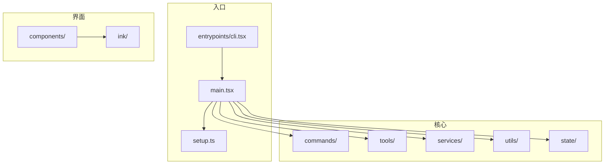
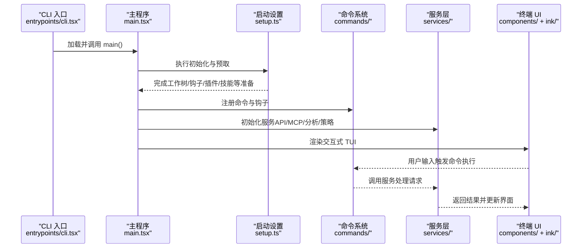
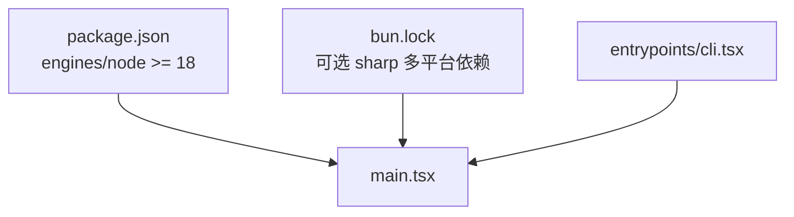

# 开发指南

<cite>
**本文档引用的文件**
- [package.json](file://package.json)
- [README.md](file://README.md)
- [bun.lock](file://bun.lock)
- [src/main.tsx](file://src/main.tsx)
- [src/setup.ts](file://src/setup.ts)
- [src/entrypoints/cli.tsx](file://src/entrypoints/cli.tsx)
</cite>

## 目录
1. [简介](#简介)
2. [项目结构](#项目结构)
3. [核心组件](#核心组件)
4. [架构总览](#架构总览)
5. [详细组件分析](#详细组件分析)
6. [依赖关系分析](#依赖关系分析)
7. [性能考虑](#性能考虑)
8. [故障排查指南](#故障排查指南)
9. [结论](#结论)
10. [附录](#附录)

## 简介
本指南面向希望参与 Claude Code（非官方源码提取）开发与维护的工程师，覆盖开发环境搭建、代码结构与模块划分、开发工作流、调试技巧、构建与发布、性能优化与最佳实践等内容。项目基于 TypeScript，采用模块化设计，CLI 为入口，终端 UI 使用 Ink 框架，支持插件、技能、工具链与 MCP（Model Context Protocol）生态。

## 项目结构
项目采用按功能域划分的目录结构，主要模块如下：
- src/entrypoints：应用入口（CLI、SDK、MCP 等）
- src/cli：命令行子系统与传输层
- src/commands：命令实现集合
- src/components：React/Ink 组件与 UI
- src/services：核心服务（API、分析、MCP、OAuth 等）
- src/tools：工具实现（文件读写、搜索、终端执行等）
- src/hooks：React Hooks
- src/ink：Ink 框架相关实现
- src/utils：通用工具函数
- src/state：全局状态管理
- src/constants：常量定义
- 其他：上下文、任务、远程会话、查询引擎、类型定义等

图表来源
- [src/entrypoints/cli.tsx:1-303](file://src/entrypoints/cli.tsx#L1-L303)
- [src/main.tsx:1-800](file://src/main.tsx#L1-L800)
- [src/setup.ts:1-478](file://src/setup.ts#L1-L478)

章节来源
- [README.md:95-114](file://README.md#L95-L114)

## 核心组件
- CLI 入口与启动路径：通过入口文件进行快速路径分流（版本查询、系统提示导出、桥接模式、守护进程、模板作业、环境运行器、自托管运行器、tmux 工作树等），随后加载主程序。
- 主程序（main.tsx）：负责初始化、权限与信任校验、延迟预取、会话与内存、分析与遥测、迁移与设置、命令注册与渲染等。
- 启动设置（setup.ts）：在交互或非交互模式下完成工作树、消息通道、终端备份恢复、钩子快照、插件与技能预热、策略限制检查等。

章节来源
- [src/entrypoints/cli.tsx:33-299](file://src/entrypoints/cli.tsx#L33-L299)
- [src/main.tsx:585-800](file://src/main.tsx#L585-L800)
- [src/setup.ts:56-478](file://src/setup.ts#L56-L478)

## 架构总览
整体架构围绕“入口 -> 初始化 -> 命令解析 -> 服务执行 -> UI 渲染”的主干展开，同时具备插件/技能扩展、MCP 集成、远程会话、分析与遥测、权限与策略控制等横切能力。

图表来源
- [src/entrypoints/cli.tsx:287-299](file://src/entrypoints/cli.tsx#L287-L299)
- [src/main.tsx:585-800](file://src/main.tsx#L585-L800)
- [src/setup.ts:56-478](file://src/setup.ts#L56-L478)

## 详细组件分析

### CLI 入口与快速路径
- 版本查询、系统提示导出、Chrome/MCP 子命令、守护进程、后台会话管理、模板作业、环境运行器、自托管运行器、tmux 工作树等均在入口层以动态导入实现快速路径，避免不必要的模块加载。
- 支持 --bare 标志提前设置简化门控，确保后续模块评估与命令构建走轻量化路径。

章节来源
- [src/entrypoints/cli.tsx:33-299](file://src/entrypoints/cli.tsx#L33-L299)

### 主程序初始化与生命周期
- 初始化阶段：设置安全环境变量、注册警告处理器、信号处理、URL 协议处理、权限模式与信任校验、模型与策略初始化、分析与遥测、迁移与设置、插件与技能预热等。
- 延迟预取：在首次渲染后进行资源预取，减少首轮响应延迟；在裸模式（--bare）下跳过部分预取以提升性能。
- 会话与内存：会话切换、项目根目录设置、工作树状态保存与清理、内存文件缓存刷新等。

章节来源
- [src/main.tsx:585-800](file://src/main.tsx#L585-L800)
- [src/main.tsx:388-431](file://src/main.tsx#L388-L431)
- [src/main.tsx:168-206](file://src/main.tsx#L168-L206)

### 启动设置（setup.ts）
- 环境与版本检查：确保 Node.js 版本满足要求。
- 工作树与 tmux：根据配置创建工作树、tmux 会话，并在需要时切换到工作树目录。
- 终端备份恢复：在交互模式下尝试恢复 iTerm2 与 Terminal.app 设置。
- 钩子与插件：捕获钩子配置快照、初始化文件变更监听、加载插件钩子并设置热重载。
- 权限与策略：在特定模式下进行权限绕过安全检查；记录分析事件用于健康监控。

章节来源
- [src/setup.ts:69-79](file://src/setup.ts#L69-L79)
- [src/setup.ts:174-285](file://src/setup.ts#L174-L285)
- [src/setup.ts:395-442](file://src/setup.ts#L395-L442)
- [src/setup.ts:448-477](file://src/setup.ts#L448-L477)

### 命令系统与工具链
- 命令注册：在主程序中注册命令与钩子，支持插件与内置命令的合并与过滤。
- 工具实现：文件读写、搜索、终端执行、Web 搜索/抓取、笔记编辑、任务管理、代理工具等，统一通过工具接口抽象，便于扩展与权限控制。

章节来源
- [src/main.tsx:88-98](file://src/main.tsx#L88-L98)
- [src/main.tsx:42-46](file://src/main.tsx#L42-L46)

### 服务层与 MCP 生态
- 服务层：API 访问、OAuth、分析、策略限制、远程托管设置、MCP 客户端与服务器集成、提示建议、会话记忆等。
- MCP：支持从官方注册表预取 URL、解析配置、过滤策略、资源与命令注册、XAA 登录集成等。

章节来源
- [src/main.tsx:37-42](file://src/main.tsx#L37-L42)
- [src/main.tsx:95-99](file://src/main.tsx#L95-L99)
- [src/main.tsx:141-149](file://src/main.tsx#L141-L149)

### 终端 UI 与组件体系
- 组件：对话消息、输入框、设置面板、向导、通知、差异展示、Markdown 渲染、主题选择等。
- Ink：终端 UI 框架封装，提供布局、焦点、渲染优化、文本测量、颜色处理等能力。

章节来源
- [src/main.tsx:34-35](file://src/main.tsx#L34-L35)
- [src/main.tsx:90-94](file://src/main.tsx#L90-L94)

## 依赖关系分析
- 运行时要求：Node.js >= 18；包管理器可使用 Bun（仓库包含 bun.lock）。
- 可选依赖：多平台 sharp 图像库，用于图片处理场景。
- 动态导入：大量模块采用动态导入以缩短启动路径，减少模块评估时间。
- 特性门控：通过 feature 标记进行死代码消除（DCE），在不同构建变体中裁剪功能。

图表来源
- [package.json:7-9](file://package.json#L7-L9)
- [bun.lock:7-17](file://bun.lock#L7-L17)
- [src/entrypoints/cli.tsx:1-303](file://src/entrypoints/cli.tsx#L1-L303)
- [src/main.tsx:1-800](file://src/main.tsx#L1-L800)

章节来源
- [package.json:7-9](file://package.json#L7-L9)
- [bun.lock:1-22](file://bun.lock#L1-L22)

## 性能考虑
- 启动路径优化：入口层快速路径分流，避免无关模块加载；延迟预取在首次渲染后进行，降低冷启动时间。
- 模块评估控制：通过特性门控与条件导入减少不必要的模块评估。
- 裸模式（--bare）：在脚本化调用场景下跳过部分预取与 UI 相关开销，提升吞吐。
- 资源预取策略：对插件钩子、系统上下文、提示、模型能力等进行异步预取，但受裸模式与非交互模式影响而调整。
- 事件循环与阻塞检测：在特定构建中启用主线程阻塞检测，帮助定位性能瓶颈。

章节来源
- [src/entrypoints/cli.tsx:33-299](file://src/entrypoints/cli.tsx#L33-L299)
- [src/main.tsx:388-431](file://src/main.tsx#L388-L431)
- [src/setup.ts:315-321](file://src/setup.ts#L315-L321)

## 故障排查指南
- Node.js 版本不满足要求：启动时会检查版本并直接退出，确保使用 Node.js 18 或更高版本。
- 权限绕过安全限制：在特定模式下禁止使用 root/sudo，且在沙箱无网络环境下才允许危险绕过标志。
- 信任与策略：在交互模式下优先建立信任再进行系统上下文预取；策略限制会在桥接模式等场景下进行检查。
- 终端备份恢复失败：在交互模式下尝试恢复 iTerm2/Terminal.app 设置，失败时输出错误信息并建议手动恢复。
- 分析与遥测：若分析关闭则不会上报；可通过日志与诊断开关辅助定位问题。

章节来源
- [src/setup.ts:69-79](file://src/setup.ts#L69-L79)
- [src/setup.ts:395-442](file://src/setup.ts#L395-L442)
- [src/main.tsx:307-321](file://src/main.tsx#L307-L321)

## 结论
本指南提供了 Claude Code（非官方源码提取）的开发与维护要点，涵盖环境搭建、代码结构、初始化流程、命令与工具体系、服务与 MCP 集成、UI 与性能优化、故障排查等方面。遵循本文档可高效开展本地开发、调试与发布工作。

## 附录

### 开发环境搭建步骤
- Node.js 版本要求：确保 Node.js 版本满足 package.json 中 engines/node 的要求。
- 包管理器：可使用 Bun（仓库包含 bun.lock），亦可使用 npm/yarn 等。
- 依赖安装：根据包管理器安装依赖（可选 sharp 多平台图像库已内置于可选依赖中）。
- 运行与调试：通过 CLI 入口运行，结合调试标志与诊断日志定位问题。

章节来源
- [package.json:7-9](file://package.json#L7-L9)
- [bun.lock:1-22](file://bun.lock#L1-L22)

### 代码结构与模块划分
- 按功能域划分：commands、services、tools、components、hooks、utils、state 等。
- 命名约定：模块名采用小驼峰或目录聚合，组件以大驼峰开头，工具函数语义明确。
- 导入策略：动态导入用于快速路径与延迟初始化，特性门控用于构建期裁剪。

章节来源
- [README.md:95-114](file://README.md#L95-L114)
- [src/entrypoints/cli.tsx:33-299](file://src/entrypoints/cli.tsx#L33-L299)
- [src/main.tsx:1-800](file://src/main.tsx#L1-L800)

### 开发工作流
- 编码：遵循现有模块划分与命名约定，新增功能优先考虑插件/技能扩展。
- 测试：利用命令与工具的职责单一性，针对关键路径编写单元与集成测试。
- 调试：结合调试标志、诊断日志与性能剖析工具定位问题。
- 构建与发布：遵循包管理器与特性门控，确保不同构建变体正确裁剪功能。

章节来源
- [src/entrypoints/cli.tsx:33-299](file://src/entrypoints/cli.tsx#L33-L299)
- [src/main.tsx:585-800](file://src/main.tsx#L585-L800)

### 调试技巧与工具
- CLI 调试：通过入口层快速路径与动态导入定位模块加载问题；结合诊断日志与性能剖析。
- React/Ink 组件：关注渲染与事件处理，利用 Ink 提供的调试能力与日志输出。
- 服务模块：关注异步初始化与错误传播，结合分析与遥测事件定位异常。

章节来源
- [src/entrypoints/cli.tsx:33-299](file://src/entrypoints/cli.tsx#L33-L299)
- [src/main.tsx:1-800](file://src/main.tsx#L1-L800)

### 构建与打包、部署与分发
- 构建：通过特性门控进行死代码消除，按需裁剪功能模块。
- 打包：CLI 作为二进制入口，入口文件负责快速路径与模块加载。
- 部署与分发：遵循包管理器与版本号，确保可选依赖（sharp）在目标平台可用。

章节来源
- [package.json:1-34](file://package.json#L1-L34)
- [bun.lock:1-22](file://bun.lock#L1-L22)
- [src/entrypoints/cli.tsx:1-303](file://src/entrypoints/cli.tsx#L1-L303)

### 性能优化建议与最佳实践
- 启动路径：保持入口层最小化，仅在必要时加载模块。
- 延迟初始化：将非关键初始化移至首次渲染后，减少冷启动时间。
- 裸模式：在脚本化调用场景下启用 --bare，跳过不必要的 UI 与预取。
- 资源预取：合理安排异步预取顺序与超时，避免阻塞主线程。
- 事件循环：在特定构建中启用阻塞检测，及时发现并修复性能问题。

章节来源
- [src/entrypoints/cli.tsx:33-299](file://src/entrypoints/cli.tsx#L33-L299)
- [src/main.tsx:388-431](file://src/main.tsx#L388-L431)
- [src/setup.ts:315-321](file://src/setup.ts#L315-L321)

### 实际开发示例与常见场景
- 新增命令：在 commands 目录下创建命令实现，注册到命令系统并在入口层添加快速路径（如适用）。
- 新增工具：在 tools 目录下实现工具类，遵循工具接口抽象，配置权限与限制。
- 集成服务：在 services 目录下扩展服务，接入分析、策略、MCP 等横切能力。
- UI 改进：在 components/ 下新增或修改组件，结合 Ink 能力优化交互体验。

章节来源
- [src/main.tsx:88-98](file://src/main.tsx#L88-L98)
- [src/main.tsx:42-46](file://src/main.tsx#L42-L46)
- [src/main.tsx:37-42](file://src/main.tsx#L37-L42)