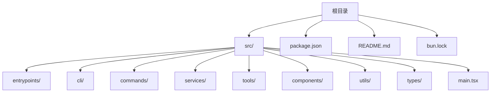
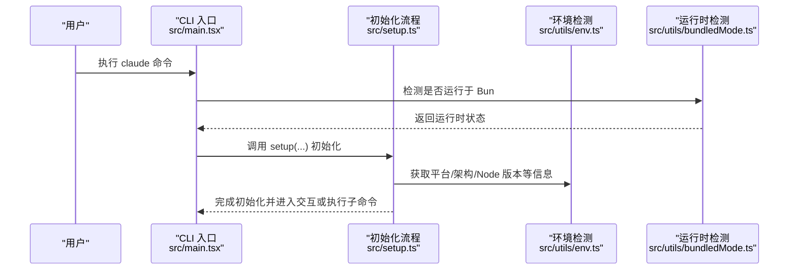
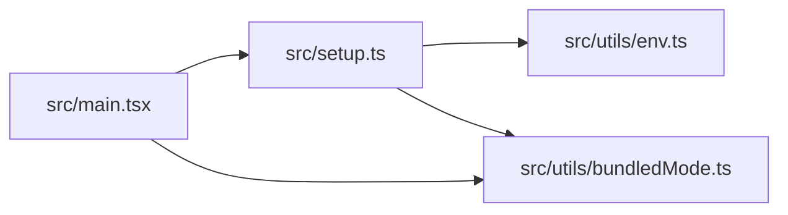

# 开发环境搭建

<cite>
**本文引用的文件**
- [package.json](file://package.json)
- [README.md](file://README.md)
- [bun.lock](file://bun.lock)
- [src/main.tsx](file://src/main.tsx)
- [src/setup.ts](file://src/setup.ts)
- [src/utils/bundledMode.ts](file://src/utils/bundledMode.ts)
- [src/utils/env.ts](file://src/utils/env.ts)
</cite>

## 目录
1. [简介](#简介)
2. [项目结构](#项目结构)
3. [核心组件](#核心组件)
4. [架构总览](#架构总览)
5. [详细组件分析](#详细组件分析)
6. [依赖关系分析](#依赖关系分析)
7. [性能考虑](#性能考虑)
8. [故障排查指南](#故障排查指南)
9. [结论](#结论)
10. [附录](#附录)

## 简介
本指南面向希望在本地搭建 Claude Code 开发环境的开发者，目标是帮助你在 macOS、Windows、Linux 上完成从系统要求、运行时与包管理器选择、项目克隆与安装、可选依赖处理、开发工具链配置到环境验证的全流程。

根据仓库信息，该项目为 Anthropic 官方发布的 CLI 工具的源码提取版本，采用 TypeScript 编写，使用模块化入口与命令行参数解析，并通过 Bun 提供的运行时能力进行检测与特性开关控制。项目对 Node.js 版本有明确要求（>=18），并包含可选依赖以支持不同平台的图像处理能力。

## 项目结构
该仓库采用按功能域划分的目录组织方式，主要包含以下关键目录：
- src：核心源代码，包含 CLI 入口、命令实现、服务层、工具集、类型定义等
- 顶层配置：package.json、README.md、bun.lock 等

图表来源
- [README.md:95-114](file://README.md#L95-L114)

章节来源
- [README.md:95-114](file://README.md#L95-L114)

## 核心组件
- 运行时与版本要求
  - Node.js：>=18.0.0（由 engines 字段与运行时校验共同保证）
  - Bun：作为可选运行时，用于特性检测与打包模式识别
- 包管理器
  - 项目使用 Bun 作为运行时与包管理器，锁文件为 bun.lock
- 可选依赖
  - 项目声明了多平台的 @img/sharp-* 可选依赖，用于图像处理能力
- CLI 入口与初始化
  - CLI 入口位于 src/main.tsx，负责启动流程、权限与会话初始化、插件与技能加载等

章节来源
- [package.json:7-9](file://package.json#L7-L9)
- [package.json:22-32](file://package.json#L22-L32)
- [bun.lock:1-22](file://bun.lock#L1-L22)
- [src/main.tsx:196](file://src/main.tsx#L196)

## 架构总览
下图展示了 CLI 启动的关键路径与运行时检测逻辑：

图表来源
- [src/main.tsx:232-271](file://src/main.tsx#L232-L271)
- [src/setup.ts:69-79](file://src/setup.ts#L69-L79)
- [src/utils/env.ts:316-333](file://src/utils/env.ts#L316-L333)
- [src/utils/bundledMode.ts:7-10](file://src/utils/bundledMode.ts#L7-L10)

## 详细组件分析

### 系统要求与运行时
- Node.js 版本要求
  - 在 package.json 中通过 engines.node 指定 >=18.0.0
  - 在运行时初始化阶段也会进行版本校验，低于 18 将直接退出
- Bun 运行时
  - 通过 feature('...') 判断特性开关
  - 通过 isRunningWithBun() 检测当前是否运行于 Bun 环境
  - 在调试模式下，若检测到 Node.js 调试标志，程序会提前退出（安全策略）

章节来源
- [package.json:7-9](file://package.json#L7-L9)
- [src/setup.ts:69-79](file://src/setup.ts#L69-L79)
- [src/main.tsx:232-271](file://src/main.tsx#L232-L271)
- [src/utils/bundledMode.ts:7-10](file://src/utils/bundledMode.ts#L7-L10)

### 包管理器与可选依赖
- 包管理器
  - 使用 Bun 作为包管理器与运行时，锁文件为 bun.lock
- 可选依赖
  - 项目声明了多平台的 @img/sharp-* 可选依赖，覆盖 macOS、Linux、Windows 的 x64/arm64 以及 Linux musl 变体
  - 可选依赖的存在意味着在某些平台上可能需要额外的系统依赖或编译工具链

章节来源
- [bun.lock:7-17](file://bun.lock#L7-L17)
- [package.json:22-32](file://package.json#L22-L32)

### 项目克隆、安装与初始化
- 克隆仓库
  - README 提供了两种方式：克隆本仓库或从 npm 包中解压源码
- 安装与初始化
  - 由于项目为源码提取版本，通常无需额外编译；直接使用 Bun 运行 CLI 即可
  - 若需安装可选依赖，请参考“可选依赖安装”小节
- 可选依赖安装
  - 可选依赖为 @img/sharp-* 多平台二进制包，建议在对应平台按需安装
  - 若未安装可选依赖，部分图像处理功能可能受限或无法使用

章节来源
- [README.md:26-93](file://README.md#L26-L93)
- [package.json:22-32](file://package.json#L22-L32)

### 开发工具链配置
- TypeScript 编译器
  - 项目为源码提取版本，通常无需本地编译；如需二次开发，建议使用 Bun 管理依赖并遵循现有模块化结构
- ESLint 与 Prettier
  - 仓库未包含 ESLint/Prettier 配置文件；如需统一风格，可在本地添加相应配置文件并集成到编辑器或 CI 流程中

章节来源
- [README.md:95-114](file://README.md#L95-L114)

### 环境验证
- Node.js 版本验证
  - 运行时会在初始化阶段检查 Node.js 版本，低于 18 将报错并退出
- Bun 运行时验证
  - 通过 isRunningWithBun() 检测当前运行时；在调试模式下，若检测到调试标志会提前退出
- 平台与架构
  - 通过 env.platform/arch 获取当前平台与架构信息，用于日志与诊断输出

章节来源
- [src/setup.ts:69-79](file://src/setup.ts#L69-L79)
- [src/main.tsx:232-271](file://src/main.tsx#L232-L271)
- [src/utils/env.ts:316-333](file://src/utils/env.ts#L316-L333)

## 依赖关系分析
下图展示 CLI 启动过程中的关键依赖关系与调用顺序：

图表来源
- [src/main.tsx:232-271](file://src/main.tsx#L232-L271)
- [src/setup.ts:69-79](file://src/setup.ts#L69-L79)
- [src/utils/env.ts:316-333](file://src/utils/env.ts#L316-L333)
- [src/utils/bundledMode.ts:7-10](file://src/utils/bundledMode.ts#L7-L10)

章节来源
- [src/main.tsx:232-271](file://src/main.tsx#L232-L271)
- [src/setup.ts:69-79](file://src/setup.ts#L69-L79)
- [src/utils/env.ts:316-333](file://src/utils/env.ts#L316-L333)
- [src/utils/bundledMode.ts:7-10](file://src/utils/bundledMode.ts#L7-L10)

## 性能考虑
- 启动性能优化
  - 项目在启动阶段对部分后台任务进行了延迟预取，以减少首次渲染阻塞
  - 在非交互模式或特定标志下会跳过部分预取，避免不必要的开销
- 插件与技能加载
  - 插件与技能的加载在初始化后进行，且支持热重载与缓存清理，便于开发调试

章节来源
- [src/main.tsx:388-431](file://src/main.tsx#L388-L431)
- [src/setup.ts:315-323](file://src/setup.ts#L315-L323)

## 故障排查指南
- Node.js 版本不满足要求
  - 症状：启动时报错并退出
  - 处理：升级 Node.js 至 >=18.0.0
- Bun 运行时问题
  - 症状：在调试模式下程序提前退出
  - 处理：移除调试标志或改用 Bun 运行时
- 可选依赖缺失
  - 症状：图像处理相关功能不可用或报错
  - 处理：在对应平台安装 @img/sharp-* 可选依赖
- 权限与沙箱限制
  - 症状：在特定容器或沙箱环境下无法使用 bypass 权限
  - 处理：遵循项目中的安全策略，仅在受控环境中启用高权限模式

章节来源
- [src/setup.ts:69-79](file://src/setup.ts#L69-L79)
- [src/main.tsx:232-271](file://src/main.tsx#L232-L271)
- [src/setup.ts:395-442](file://src/setup.ts#L395-L442)

## 结论
本指南基于仓库提供的信息，明确了 Claude Code 的系统要求、运行时与包管理器选择、可选依赖处理、开发工具链配置与环境验证方法。按照上述步骤，你可以在 macOS、Windows、Linux 上快速搭建并验证开发环境。如需进一步扩展开发体验，可在本地添加 ESLint/Prettier 等工具以统一代码风格。

## 附录
- 快速检查清单
  - 已安装 Node.js >=18.0.0
  - 已安装 Bun（可选，但建议安装以获得最佳体验）
  - 已安装对应平台的 @img/sharp-* 可选依赖（如需图像处理功能）
  - 已克隆仓库并完成依赖安装
  - 已通过环境验证（启动 CLI 并确认无版本错误）