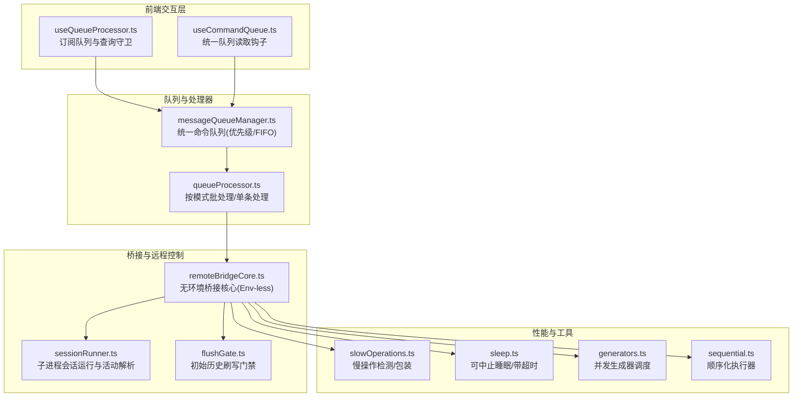
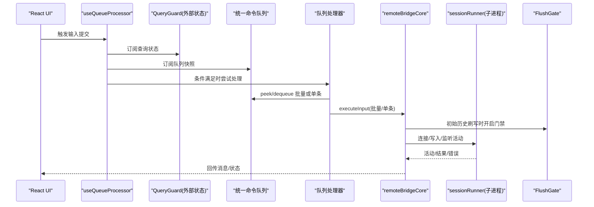
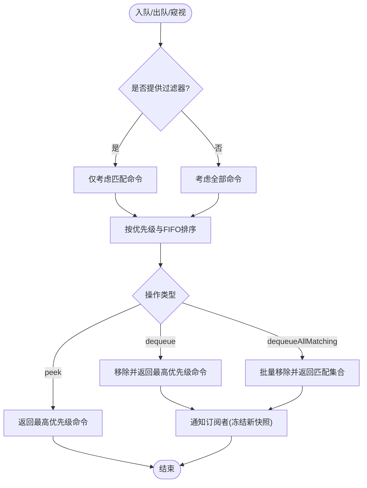
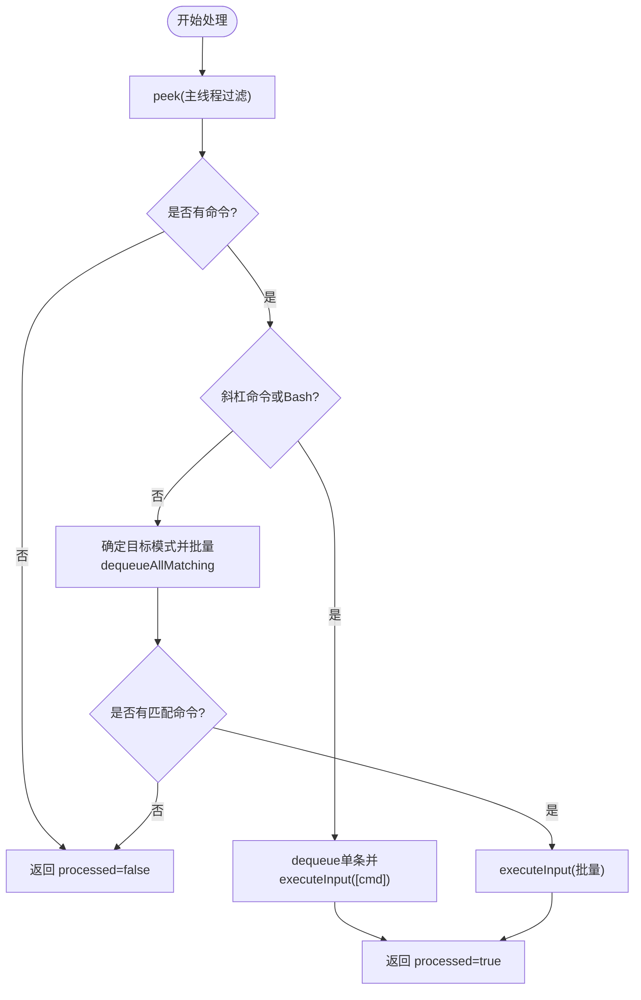
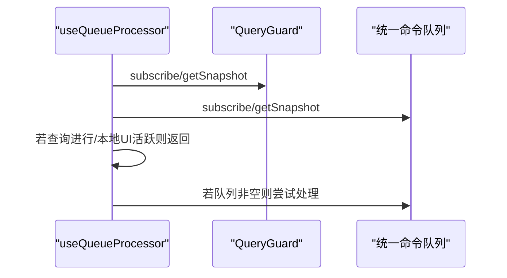
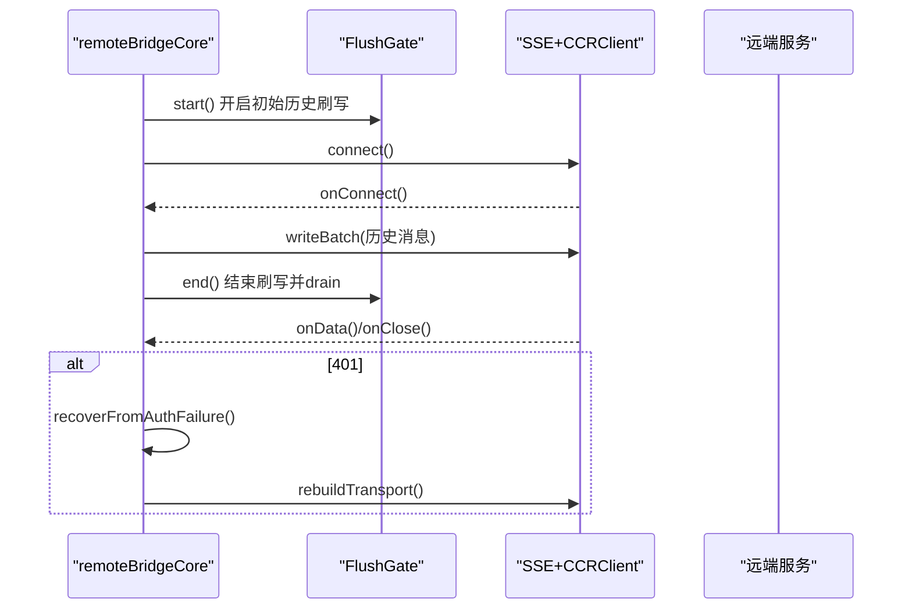
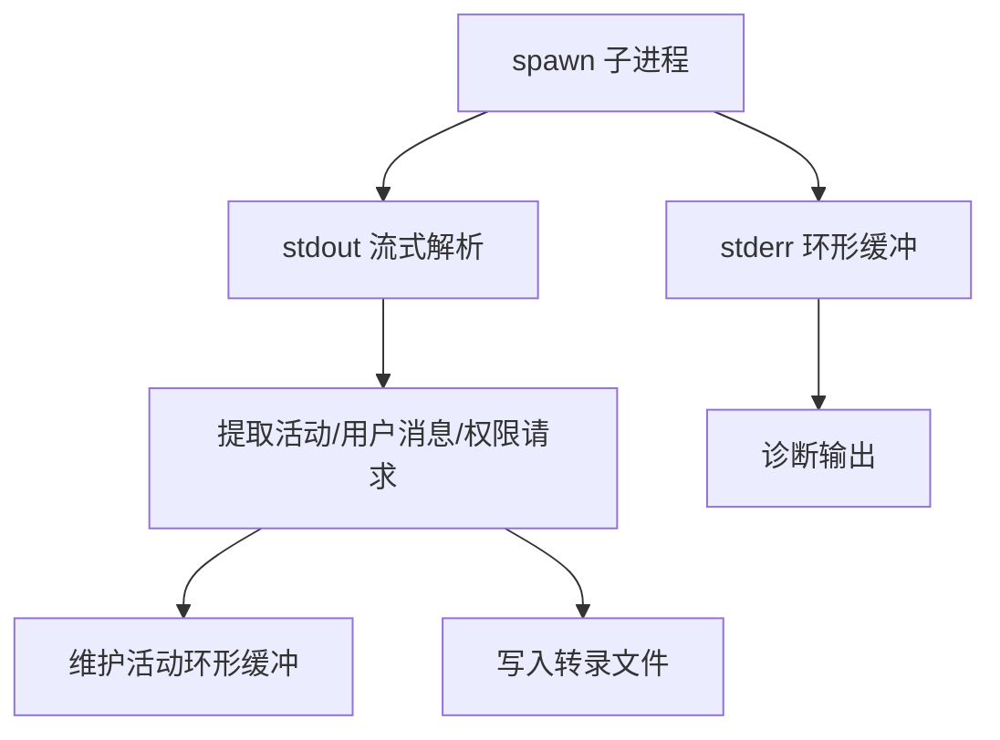
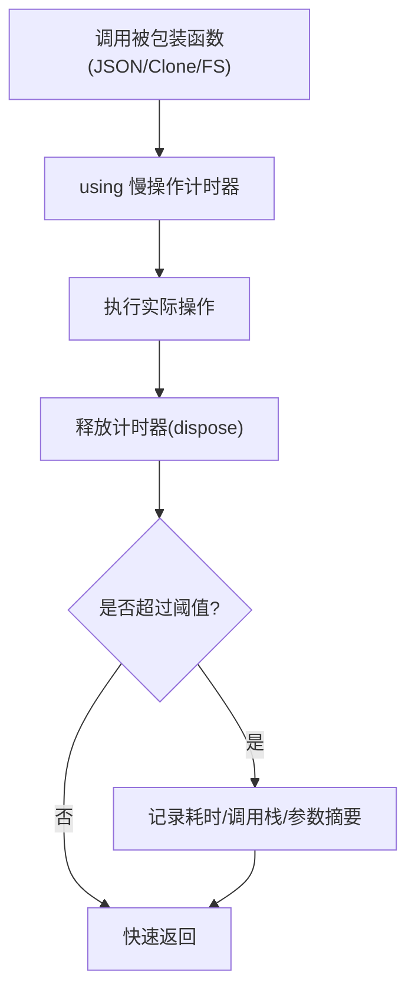
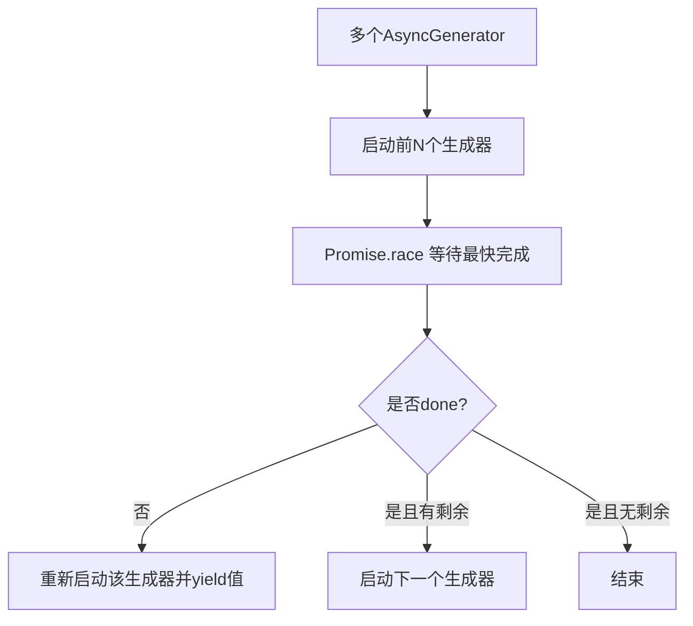
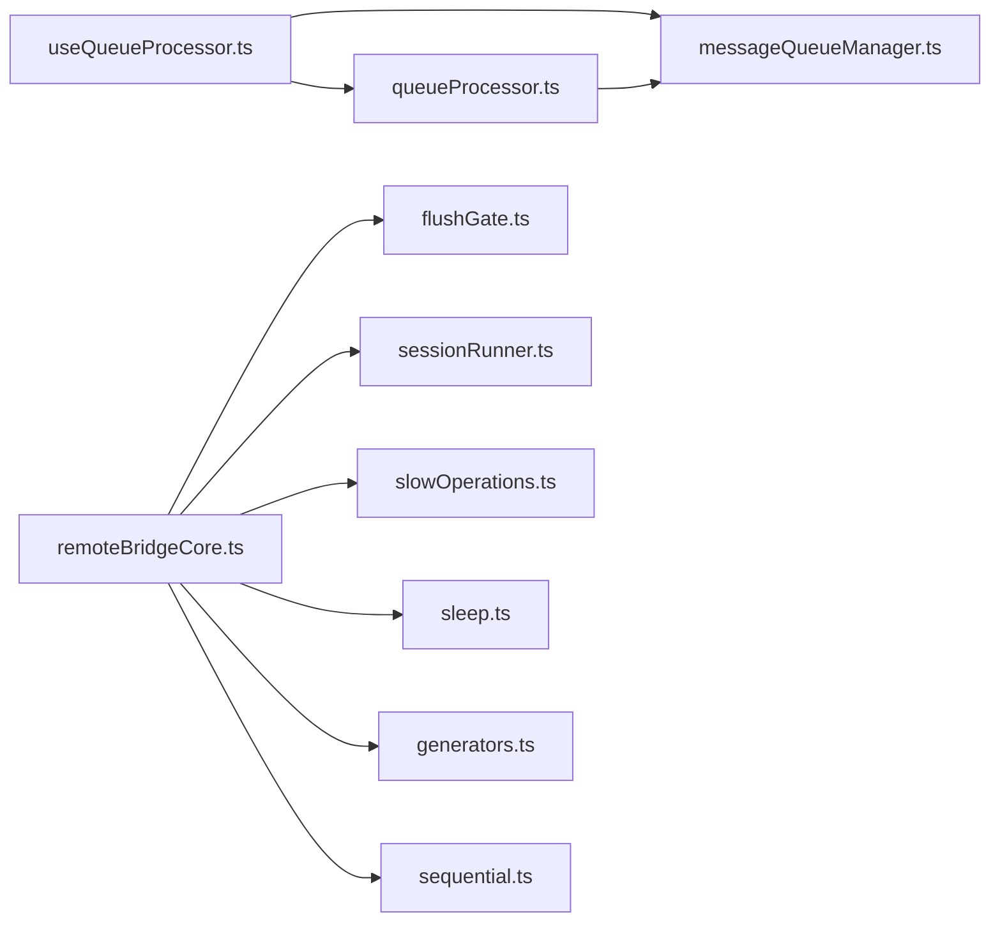

# 代码性能优化

<cite>
**本文引用的文件**
- [useQueueProcessor.ts](file://src/hooks/useQueueProcessor.ts)
- [useCommandQueue.ts](file://src/hooks/useCommandQueue.ts)
- [queueProcessor.ts](file://src/utils/queueProcessor.ts)
- [messageQueueManager.ts](file://src/utils/messageQueueManager.ts)
- [flushGate.ts](file://src/bridge/flushGate.ts)
- [sessionRunner.ts](file://src/bridge/sessionRunner.ts)
- [remoteBridgeCore.ts](file://src/bridge/remoteBridgeCore.ts)
- [slowOperations.ts](file://src/utils/slowOperations.ts)
- [sleep.ts](file://src/utils/sleep.ts)
- [generators.ts](file://src/utils/generators.ts)
- [sequential.ts](file://src/utils/sequential.ts)
</cite>

## 目录
1. [引言](#引言)
2. [项目结构](#项目结构)
3. [核心组件](#核心组件)
4. [架构总览](#架构总览)
5. [详细组件分析](#详细组件分析)
6. [依赖关系分析](#依赖关系分析)
7. [性能考量](#性能考量)
8. [故障排查指南](#故障排查指南)
9. [结论](#结论)
10. [附录：性能测试与优化示例路径](#附录性能测试与优化示例路径)

## 引言
本指南聚焦于 Claude Code 的异步处理与性能优化实践，系统阐述以下主题：
- 异步处理优化：顺序执行、并发处理、队列处理器的设计与实现
- 慢操作识别与优化：I/O 密集型与 CPU 密集型操作的策略
- 算法优化技巧：数据结构选择、复杂度优化、循环优化
- 并发编程最佳实践：线程池管理、异步任务调度、资源共享优化
- 具体优化示例与性能测试方法（以源码路径形式给出）

## 项目结构
本项目围绕“统一命令队列”“查询守卫”“桥接会话”三大主线展开，配合“慢操作检测”“超时与中断”“生成器并发控制”等工具模块，形成端到端的高性能异步处理链路。

图示来源
- [useQueueProcessor.ts:1-69](file://src/hooks/useQueueProcessor.ts#L1-L69)
- [useCommandQueue.ts:1-16](file://src/hooks/useCommandQueue.ts#L1-L16)
- [messageQueueManager.ts:1-548](file://src/utils/messageQueueManager.ts#L1-L548)
- [queueProcessor.ts:1-96](file://src/utils/queueProcessor.ts#L1-L96)
- [remoteBridgeCore.ts:1-800](file://src/bridge/remoteBridgeCore.ts#L1-L800)
- [sessionRunner.ts:1-551](file://src/bridge/sessionRunner.ts#L1-L551)
- [flushGate.ts:1-72](file://src/bridge/flushGate.ts#L1-L72)
- [slowOperations.ts:1-287](file://src/utils/slowOperations.ts#L1-L287)
- [sleep.ts:1-85](file://src/utils/sleep.ts#L1-L85)
- [generators.ts:1-88](file://src/utils/generators.ts#L1-L88)
- [sequential.ts:1-56](file://src/utils/sequential.ts#L1-L56)

章节来源
- [useQueueProcessor.ts:1-69](file://src/hooks/useQueueProcessor.ts#L1-L69)
- [messageQueueManager.ts:1-548](file://src/utils/messageQueueManager.ts#L1-L548)

## 核心组件
- 统一命令队列与优先级调度
  - 通过模块级数组维护队列，使用冻结快照与信号通知订阅者，支持 FIFO 与优先级排序，过滤器用于跨回合限制（如仅主进程命令）。
  - 关键接口：入队、出队、窥视、批量出队、移除、清空、可见性与可编辑性判定等。
- 队列处理器
  - 对斜杠命令与 Bash 命令采用逐条处理，保证错误隔离与进度 UI；其他命令按模式批处理，减少下游调用次数。
- 查询守卫与 UI 阻塞
  - 使用外部状态订阅（useSyncExternalStore）感知查询是否进行，避免在查询期间触发输入处理。
- 桥接会话与远程控制
  - 子进程会话运行、活动解析、权限请求、调试日志与转录；远程桥接核心负责无环境桥接（Env-less），直接连接会话入口，支持刷新门禁与传输重建。
- 慢操作检测与包装
  - 包装 JSON 序列化/反序列化、深拷贝、同步文件写入等潜在慢操作，按阈值记录耗时与调用栈，便于定位热点。
- 超时与可中止睡眠
  - 提供可响应中断的 sleep 与超时竞态，避免阻塞关闭流程与无限等待。
- 并发生成器与顺序化执行
  - 并发生成器调度器按并发上限消费多个异步生成器；顺序化执行器确保某些关键操作串行化，避免竞态。

章节来源
- [messageQueueManager.ts:1-548](file://src/utils/messageQueueManager.ts#L1-L548)
- [queueProcessor.ts:1-96](file://src/utils/queueProcessor.ts#L1-L96)
- [useQueueProcessor.ts:1-69](file://src/hooks/useQueueProcessor.ts#L1-L69)
- [remoteBridgeCore.ts:1-800](file://src/bridge/remoteBridgeCore.ts#L1-L800)
- [sessionRunner.ts:1-551](file://src/bridge/sessionRunner.ts#L1-L551)
- [slowOperations.ts:1-287](file://src/utils/slowOperations.ts#L1-L287)
- [sleep.ts:1-85](file://src/utils/sleep.ts#L1-L85)
- [generators.ts:1-88](file://src/utils/generators.ts#L1-L88)
- [sequential.ts:1-56](file://src/utils/sequential.ts#L1-L56)

## 架构总览
下图展示从用户输入到远程桥接与会话执行的关键路径，以及性能相关组件的协作方式。

图示来源
- [useQueueProcessor.ts:1-69](file://src/hooks/useQueueProcessor.ts#L1-L69)
- [queueProcessor.ts:1-96](file://src/utils/queueProcessor.ts#L1-L96)
- [remoteBridgeCore.ts:1-800](file://src/bridge/remoteBridgeCore.ts#L1-L800)
- [sessionRunner.ts:1-551](file://src/bridge/sessionRunner.ts#L1-L551)
- [flushGate.ts:1-72](file://src/bridge/flushGate.ts#L1-L72)

## 详细组件分析

### 组件A：统一命令队列与优先级调度
- 设计要点
  - 单一模块级队列，冻结快照用于 React 订阅，避免上下文传播延迟导致的通知丢失。
  - 优先级顺序：now > next > later；同优先级 FIFO。
  - 支持过滤器（如仅主进程命令）以避免子代理消息干扰跨回合处理。
- 性能影响
  - 出队/窥视遍历队列，时间复杂度 O(n)；建议在高频场景下减少队列长度或合并同类项。
  - 批量出队通过一次重组队列实现，避免多次通知开销。
- 优化建议
  - 对高频入队场景，考虑批量入队与延迟通知。
  - 对模式聚合（同模式批处理）保持现有策略，减少下游调用次数。

图示来源
- [messageQueueManager.ts:151-266](file://src/utils/messageQueueManager.ts#L151-L266)

章节来源
- [messageQueueManager.ts:1-548](file://src/utils/messageQueueManager.ts#L1-L548)

### 组件B：队列处理器（按模式批处理）
- 设计要点
  - 斜杠命令与 Bash 命令逐条处理，保证错误隔离与 UI 进度。
  - 其他命令按最高优先级项的模式进行批处理，减少下游调用次数。
  - 主线程过滤（agentId 未定义）避免子代理消息进入处理。
- 性能影响
  - 批处理显著降低调用开销；逐条处理确保稳定性但吞吐略低。
- 优化建议
  - 对非斜杠命令尽量合并，减少批次数。
  - 对长列表批处理，考虑分段发送以避免单次调用过大。

图示来源
- [queueProcessor.ts:52-87](file://src/utils/queueProcessor.ts#L52-L87)

章节来源
- [queueProcessor.ts:1-96](file://src/utils/queueProcessor.ts#L1-L96)

### 组件C：查询守卫与 UI 阻塞
- 设计要点
  - 使用 useSyncExternalStore 订阅外部查询守卫状态，避免 React 上下文延迟导致的漏通知。
  - 在查询进行或本地 UI 活跃时跳过队列处理。
- 性能影响
  - 通过外部状态订阅避免无效渲染与处理，提升整体吞吐。
- 优化建议
  - 将阻塞条件最小化，仅在必要时暂停处理。

图示来源
- [useQueueProcessor.ts:35-67](file://src/hooks/useQueueProcessor.ts#L35-L67)

章节来源
- [useQueueProcessor.ts:1-69](file://src/hooks/useQueueProcessor.ts#L1-L69)

### 组件D：远程桥接核心（Env-less）与传输重建
- 设计要点
  - 无环境层桥接，直接连接会话入口，支持主动 JWT 刷新与 401 自恢复。
  - 初始历史刷写期间启用 FlushGate，防止历史与实时消息交错。
  - 传输重建时维持序列号与 epoch，确保一致性。
- 性能影响
  - 刷新门禁与重建传输避免消息乱序与重复，提升可靠性。
  - 401 自恢复减少人工干预，提高可用性。
- 优化建议
  - 合理设置刷新缓冲与连接超时，平衡刷新频率与网络压力。
  - 在重建前后对队列进行门禁保护，避免消息丢失。

图示来源
- [remoteBridgeCore.ts:379-527](file://src/bridge/remoteBridgeCore.ts#L379-L527)
- [flushGate.ts:29-40](file://src/bridge/flushGate.ts#L29-L40)

章节来源
- [remoteBridgeCore.ts:1-800](file://src/bridge/remoteBridgeCore.ts#L1-L800)
- [flushGate.ts:1-72](file://src/bridge/flushGate.ts#L1-L72)

### 组件E：子进程会话运行与活动解析
- 设计要点
  - 子进程 stdout 解析 NDJSON，提取活动、用户消息与权限请求；stderr 缓冲用于诊断。
  - 支持调试文件与转录文件，便于问题复现。
- 性能影响
  - 流式解析与环形缓冲减少内存占用；调试输出按需开启。
- 优化建议
  - 控制活动数量与 stderr 行数上限，避免内存膨胀。
  - 在 verbose 模式下谨慎输出，避免阻塞事件循环。

图示来源
- [sessionRunner.ts:368-446](file://src/bridge/sessionRunner.ts#L368-L446)

章节来源
- [sessionRunner.ts:1-551](file://src/bridge/sessionRunner.ts#L1-L551)

### 组件F：慢操作检测与包装
- 设计要点
  - 通过 tagged template 包装 JSON 序列化/反序列化、深拷贝、同步文件写入等。
  - 按阈值记录耗时与调用栈，区分开发与内部构建阈值。
- 性能影响
  - 零成本路径（外部构建）不产生额外开销；ANT 构建下仅在慢时记录，避免影响热路径。
- 优化建议
  - 优先使用异步 I/O 替代同步写入；对大对象深拷贝使用结构化克隆或分块处理。

图示来源
- [slowOperations.ts:155-211](file://src/utils/slowOperations.ts#L155-L211)

章节来源
- [slowOperations.ts:1-287](file://src/utils/slowOperations.ts#L1-L287)

### 组件G：并发生成器调度与顺序化执行
- 设计要点
  - 并发生成器调度器按并发上限消费多个异步生成器，按完成顺序产出值。
  - 顺序化执行器确保某些关键操作串行化，避免竞态。
- 性能影响
  - 并发调度提升吞吐；顺序化执行保障正确性。
- 优化建议
  - 对 IO 密集型任务使用并发生成器；对共享资源访问使用顺序化执行器。

图示来源
- [generators.ts:32-72](file://src/utils/generators.ts#L32-L72)

章节来源
- [generators.ts:1-88](file://src/utils/generators.ts#L1-L88)
- [sequential.ts:1-56](file://src/utils/sequential.ts#L1-L56)

## 依赖关系分析
- 组件耦合
  - useQueueProcessor 依赖 QueryGuard 与统一命令队列，形成“状态订阅 + 队列驱动”的处理链。
  - queueProcessor 依赖 messageQueueManager 的 peek/dequeue 接口，实现批处理与单条处理。
  - remoteBridgeCore 依赖 flushGate、sessionRunner、slowOperations、sleep 等模块，形成“可靠传输 + 性能监控”的闭环。
- 外部依赖
  - Node child_process、readline、fs 等用于子进程与文件 I/O。
  - Axios 用于远程桥接的 HTTP 请求。
- 循环依赖
  - 模块间通过接口与导出解耦，未见明显循环依赖。

图示来源
- [useQueueProcessor.ts:1-69](file://src/hooks/useQueueProcessor.ts#L1-L69)
- [queueProcessor.ts:1-96](file://src/utils/queueProcessor.ts#L1-L96)
- [messageQueueManager.ts:1-548](file://src/utils/messageQueueManager.ts#L1-L548)
- [remoteBridgeCore.ts:1-800](file://src/bridge/remoteBridgeCore.ts#L1-L800)
- [flushGate.ts:1-72](file://src/bridge/flushGate.ts#L1-L72)
- [sessionRunner.ts:1-551](file://src/bridge/sessionRunner.ts#L1-L551)
- [slowOperations.ts:1-287](file://src/utils/slowOperations.ts#L1-L287)
- [sleep.ts:1-85](file://src/utils/sleep.ts#L1-L85)
- [generators.ts:1-88](file://src/utils/generators.ts#L1-L88)
- [sequential.ts:1-56](file://src/utils/sequential.ts#L1-L56)

章节来源
- [remoteBridgeCore.ts:1-800](file://src/bridge/remoteBridgeCore.ts#L1-L800)

## 性能考量
- I/O 密集型优化
  - 使用流式解析与环形缓冲（stderr/活动），避免一次性加载大量数据。
  - 将调试输出与转录文件按需开启，减少磁盘写入。
  - 优先使用异步 I/O，避免同步写入阻塞事件循环。
- CPU 密集型优化
  - 对大对象深拷贝使用结构化克隆；必要时拆分处理或延迟计算。
  - 使用并发生成器调度器并行处理独立任务，同时控制并发上限。
  - 通过顺序化执行器保护共享资源访问，避免锁竞争。
- 数据结构与算法
  - 队列采用数组 + 冻结快照，通知时一次性复制，避免频繁浅拷贝。
  - 出队/窥视使用单次遍历选择最高优先级，时间复杂度 O(n)。
- 调度与并发
  - 通过 QueryGuard 与 UI 阻塞避免无效处理，提升吞吐。
  - 传输重建与刷新门禁确保消息有序与一致，减少重试与回滚。

## 故障排查指南
- 慢操作定位
  - 使用慢操作检测包装函数（JSON/Clone/FS）定位热点；查看耗时与调用栈。
  - 调整阈值以适配不同环境（开发/内部构建）。
- 超时与中断
  - 使用可中止睡眠与超时竞态，避免长时间阻塞；在关闭流程中及时清理定时器。
- 传输与会话
  - 401 自恢复与传输重建确保连接稳定性；检查刷新门禁与序列号一致性。
  - 子进程 stderr 环形缓冲用于诊断，注意行数上限配置。

章节来源
- [slowOperations.ts:1-287](file://src/utils/slowOperations.ts#L1-L287)
- [sleep.ts:1-85](file://src/utils/sleep.ts#L1-L85)
- [remoteBridgeCore.ts:530-590](file://src/bridge/remoteBridgeCore.ts#L530-L590)
- [sessionRunner.ts:352-446](file://src/bridge/sessionRunner.ts#L352-L446)

## 结论
本项目通过“统一命令队列 + 优先级调度 + 查询守卫 + 队列处理器”的前端异步链路，结合“Env-less 桥接 + 刷新门禁 + 传输重建”的后端可靠性机制，并辅以“慢操作检测 + 并发生成器 + 顺序化执行”的性能工具，形成了高吞吐、低延迟、易维护的异步处理体系。建议在高频场景下进一步优化队列长度与批处理粒度，在 I/O 密集场景下严格控制同步操作与调试输出，在 CPU 密集场景下合理拆分与并发化。

## 附录：性能测试与优化示例路径
- 队列处理性能测试
  - 使用统一命令队列接口进行批量入队与批处理，统计处理耗时与吞吐。
  - 示例路径：[队列处理器:52-87](file://src/utils/queueProcessor.ts#L52-L87)，[统一命令队列:167-266](file://src/utils/messageQueueManager.ts#L167-L266)
- 慢操作检测与优化
  - 对 JSON/Clone/FS 使用慢操作包装，定位热点并替换为异步方案。
  - 示例路径：[慢操作包装:170-211](file://src/utils/slowOperations.ts#L170-L211)，[同步写入替代:248-286](file://src/utils/slowOperations.ts#L248-L286)
- 并发生成器测试
  - 使用并发生成器调度器对多个独立任务进行并行处理，观察完成时间与并发上限效果。
  - 示例路径：[并发生成器:32-72](file://src/utils/generators.ts#L32-L72)
- 顺序化执行测试
  - 对共享资源访问使用顺序化执行器，验证竞态消除与正确性。
  - 示例路径：[顺序化执行器:19-55](file://src/utils/sequential.ts#L19-L55)
- 传输与会话稳定性测试
  - 在远程桥接核心中模拟 401 与传输重建，验证刷新门禁与序列号一致性。
  - 示例路径：[传输重建:477-527](file://src/bridge/remoteBridgeCore.ts#L477-L527)，[刷新门禁:29-40](file://src/bridge/flushGate.ts#L29-L40)
- 可中止睡眠与超时测试
  - 使用可中止睡眠与超时竞态，验证关闭流程中的及时退出。
  - 示例路径：[可中止睡眠:14-54](file://src/utils/sleep.ts#L14-L54)，[超时竞态:70-84](file://src/utils/sleep.ts#L70-L84)