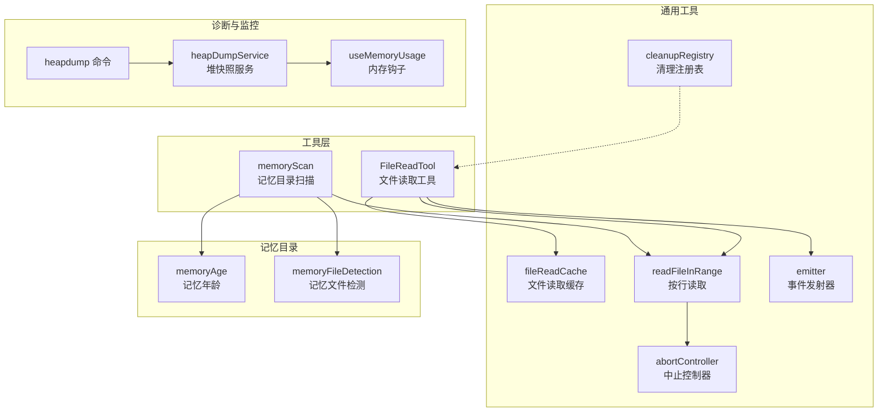
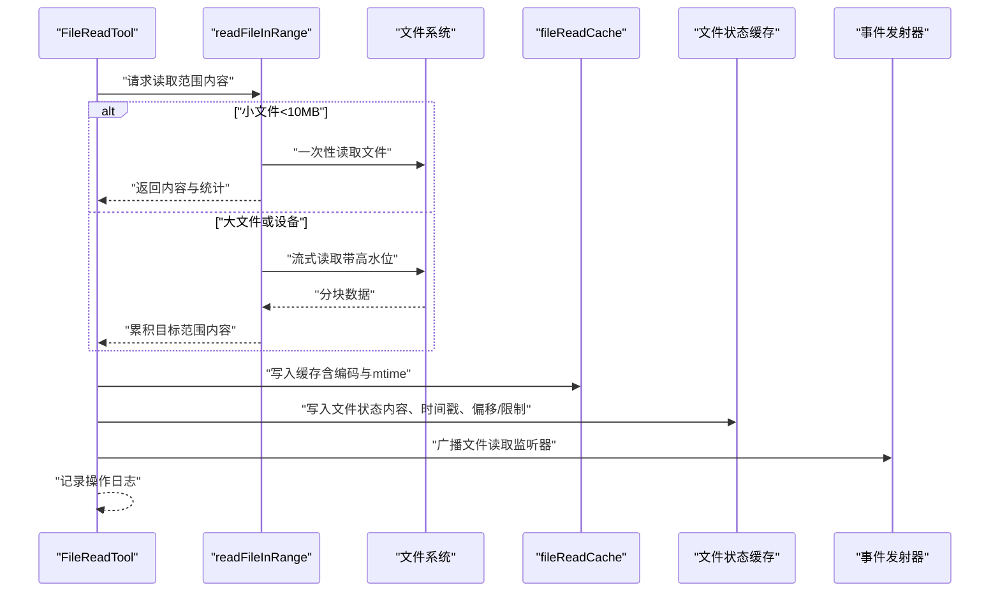
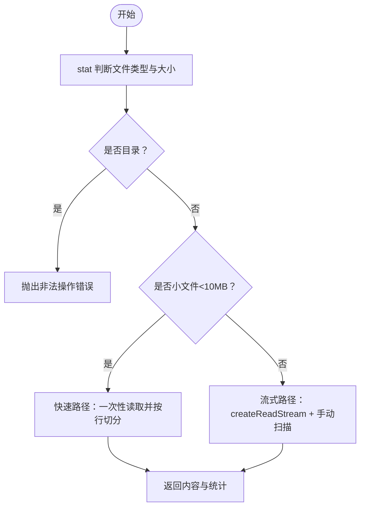
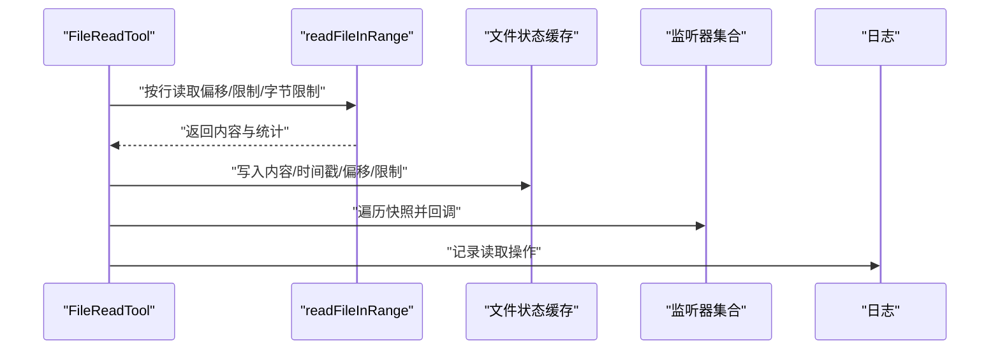
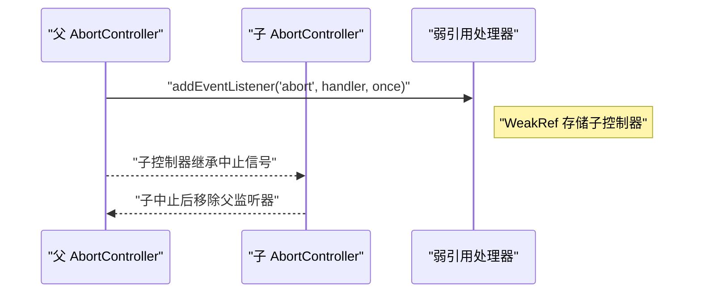
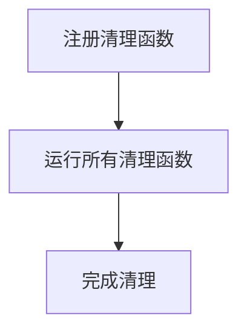
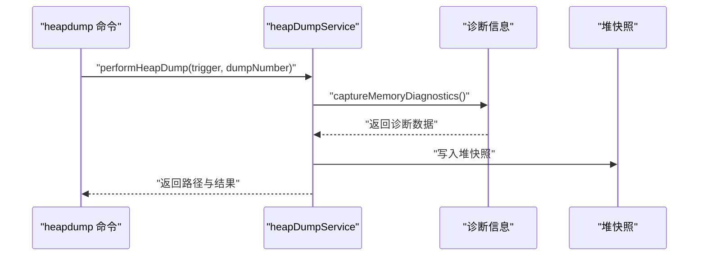
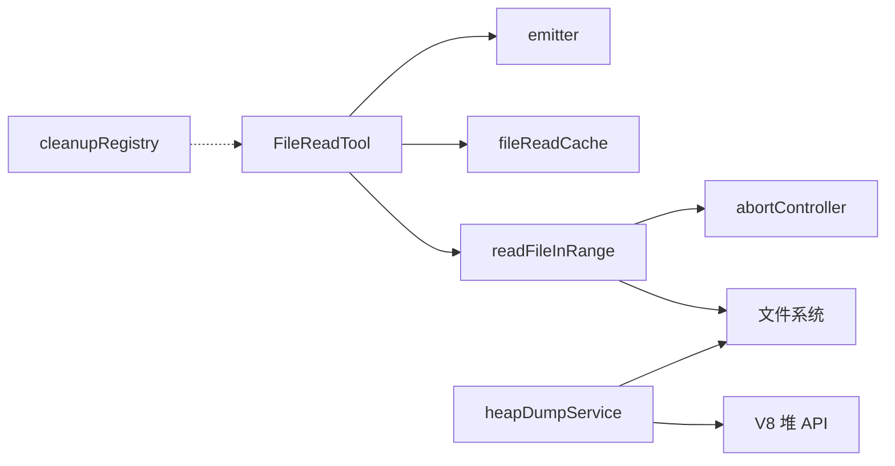

# 内存管理优化

<cite>
**本文引用的文件**
- [src/utils/fileReadCache.ts](file://src/utils/fileReadCache.ts)
- [src/utils/readFileInRange.ts](file://src/utils/readFileInRange.ts)
- [src/tools/FileReadTool/FileReadTool.ts](file://src/tools/FileReadTool/FileReadTool.ts)
- [src/utils/heapDumpService.ts](file://src/utils/heapDumpService.ts)
- [src/commands/heapdump/heapdump.ts](file://src/commands/heapdump/heapdump.ts)
- [src/hooks/useMemoryUsage.ts](file://src/hooks/useMemoryUsage.ts)
- [src/utils/abortController.ts](file://src/utils/abortController.ts)
- [src/utils/cleanupRegistry.ts](file://src/utils/cleanupRegistry.ts)
- [src/ink/events/emitter.ts](file://src/ink/events/emitter.ts)
- [src/memdir/memoryScan.ts](file://src/memdir/memoryScan.ts)
- [src/memdir/memoryAge.ts](file://src/memdir/memoryAge.ts)
- [src/utils/memoryFileDetection.ts](file://src/utils/memoryFileDetection.ts)
</cite>

## 目录
1. [简介](#简介)
2. [项目结构](#项目结构)
3. [核心组件](#核心组件)
4. [架构总览](#架构总览)
5. [详细组件分析](#详细组件分析)
6. [依赖关系分析](#依赖关系分析)
7. [性能考量](#性能考量)
8. [故障排查指南](#故障排查指南)
9. [结论](#结论)
10. [附录](#附录)

## 简介
本指南聚焦 Claude Code 的内存管理优化策略与实践，覆盖以下主题：
- 文件读取缓存机制：基于修改时间的自动失效与容量淘汰
- 文件状态缓存与补全缓存：在工具层对读取结果进行缓存与监听通知
- 大文件处理：快速路径与流式路径的双通道设计，避免内存膨胀
- 资源清理与事件监听器管理：弱引用传播、最大监听数限制、优雅关闭注册
- 内存使用监控与诊断：内存阈值告警、堆快照采集与诊断信息、自动触发与手动触发
- 实战案例与最佳实践：从代码路径到可视化流程图，帮助读者快速落地

## 项目结构
围绕内存优化的关键模块分布如下：
- 工具层：FileReadTool 使用文件范围读取与状态缓存，并通过监听器广播变更
- 通用工具：文件读取缓存、按行读取（快速/流式）、中止控制、清理注册、事件发射器
- 诊断与监控：内存钩子、堆快照服务、命令入口
- 记忆目录扫描：按需读取、前端言解析、排序与上限控制



**图表来源**
- [src/tools/FileReadTool/FileReadTool.ts](file://src/tools/FileReadTool/FileReadTool.ts)
- [src/utils/readFileInRange.ts](file://src/utils/readFileInRange.ts)
- [src/utils/fileReadCache.ts](file://src/utils/fileReadCache.ts)
- [src/ink/events/emitter.ts](file://src/ink/events/emitter.ts)
- [src/memdir/memoryScan.ts](file://src/memdir/memoryScan.ts)
- [src/memdir/memoryAge.ts](file://src/memdir/memoryAge.ts)
- [src/utils/memoryFileDetection.ts](file://src/utils/memoryFileDetection.ts)
- [src/hooks/useMemoryUsage.ts](file://src/hooks/useMemoryUsage.ts)
- [src/utils/heapDumpService.ts](file://src/utils/heapDumpService.ts)
- [src/commands/heapdump/heapdump.ts](file://src/commands/heapdump/heapdump.ts)

**章节来源**
- [src/tools/FileReadTool/FileReadTool.ts](file://src/tools/FileReadTool/FileReadTool.ts)
- [src/utils/readFileInRange.ts](file://src/utils/readFileInRange.ts)
- [src/utils/fileReadCache.ts](file://src/utils/fileReadCache.ts)
- [src/ink/events/emitter.ts](file://src/ink/events/emitter.ts)
- [src/memdir/memoryScan.ts](file://src/memdir/memoryScan.ts)
- [src/memdir/memoryAge.ts](file://src/memdir/memoryAge.ts)
- [src/utils/memoryFileDetection.ts](file://src/utils/memoryFileDetection.ts)
- [src/hooks/useMemoryUsage.ts](file://src/hooks/useMemoryUsage.ts)
- [src/utils/heapDumpService.ts](file://src/utils/heapDumpService.ts)
- [src/commands/heapdump/heapdump.ts](file://src/commands/heapdump/heapdump.ts)

## 核心组件
- 文件读取缓存（fileReadCache）：以路径为键，结合 mtime 自动失效；超过容量时逐出最旧条目；提供统计接口便于监控
- 按行读取（readFileInRange）：小文件走快速路径一次性读取并切分行；大文件走流式路径，仅累积目标范围内容，避免 RSS 暴涨
- 文件读取工具（FileReadTool）：调用按行读取，写入文件状态缓存，触发监听器，记录日志
- 中止控制（abortController）：弱引用传播父中止信号，自动移除监听器，避免泄漏
- 清理注册（cleanupRegistry）：全局注册清理函数，统一在优雅关闭时执行
- 事件发射器（emitter）：禁用默认监听数警告，尊重事件中断传播
- 内存监控钩子（useMemoryUsage）：周期性检查堆使用量，超过阈值才更新状态，降低渲染开销
- 堆快照服务（heapDumpService）：先写诊断信息再写堆快照，保证大堆时也能保留诊断数据；支持自动与手动触发

**章节来源**
- [src/utils/fileReadCache.ts](file://src/utils/fileReadCache.ts)
- [src/utils/readFileInRange.ts](file://src/utils/readFileInRange.ts)
- [src/tools/FileReadTool/FileReadTool.ts](file://src/tools/FileReadTool/FileReadTool.ts)
- [src/utils/abortController.ts](file://src/utils/abortController.ts)
- [src/utils/cleanupRegistry.ts](file://src/utils/cleanupRegistry.ts)
- [src/ink/events/emitter.ts](file://src/ink/events/emitter.ts)
- [src/hooks/useMemoryUsage.ts](file://src/hooks/useMemoryUsage.ts)
- [src/utils/heapDumpService.ts](file://src/utils/heapDumpService.ts)

## 架构总览
下图展示“文件读取—缓存—状态—监听”的完整链路，以及“快速/流式”两种读取路径如何协同工作。



**图表来源**
- [src/tools/FileReadTool/FileReadTool.ts](file://src/tools/FileReadTool/FileReadTool.ts)
- [src/utils/readFileInRange.ts](file://src/utils/readFileInRange.ts)
- [src/utils/fileReadCache.ts](file://src/utils/fileReadCache.ts)
- [src/ink/events/emitter.ts](file://src/ink/events/emitter.ts)

## 详细组件分析

### 文件读取缓存（fileReadCache）
- 设计要点
  - 键：文件路径；值：内容、编码、mtime
  - 自动失效：命中缓存时比较 mtime，不一致则回源读取
  - 容量控制：超过最大容量时删除最早插入的条目
  - 统计接口：返回当前大小与键列表，便于监控
- 适用场景
  - FileEditTool 等频繁读取同一文件的场景
  - 避免重复 I/O 与编码探测开销

```mermaid
classDiagram
class FileReadCache {
-cache : Map
-maxCacheSize : number
+readFile(filePath) : {content, encoding}
+clear() : void
+invalidate(filePath) : void
+getStats() : {size, entries}
}
```

**图表来源**
- [src/utils/fileReadCache.ts](file://src/utils/fileReadCache.ts)

**章节来源**
- [src/utils/fileReadCache.ts](file://src/utils/fileReadCache.ts)

### 按行读取（readFileInRange）
- 双路径设计
  - 快速路径：常规文件且小于阈值时一次性读取，再按行切分，适合典型源码文件
  - 流式路径：大文件、管道、设备等，使用可读流，仅累积目标范围内容，避免 RSS 暴涨
- 关键优化
  - BOM 去除与 CRLF 规范化
  - byte 限额与截断模式：可选择抛错或截断输出
  - 事件处理器为命名函数，零闭包状态，生命周期使用一次性绑定，结束即释放
  - mtime 来自已打开 fd 的 fstat，避免额外 open()



**图表来源**
- [src/utils/readFileInRange.ts](file://src/utils/readFileInRange.ts)

**章节来源**
- [src/utils/readFileInRange.ts](file://src/utils/readFileInRange.ts)

### 文件读取工具（FileReadTool）
- 行范围读取：调用 readFileInRange，支持偏移与限制
- 状态缓存：将内容、时间戳、偏移/限制写入文件状态缓存
- 监听器广播：复制监听器数组快照，避免中途变更导致跳过
- 日志记录：记录读取操作与内容摘要



**图表来源**
- [src/tools/FileReadTool/FileReadTool.ts](file://src/tools/FileReadTool/FileReadTool.ts)
- [src/utils/readFileInRange.ts](file://src/utils/readFileInRange.ts)

**章节来源**
- [src/tools/FileReadTool/FileReadTool.ts](file://src/tools/FileReadTool/FileReadTool.ts)

### 中止控制（abortController）
- 弱引用传播：父中止时通过 WeakRef 将信号传递给子控制器，避免强引用导致无法 GC
- 自动清理：子控制器中止后移除父监听器，防止监听器堆积
- 最大监听数：为 AbortSignal 设置合理的监听上限，避免警告



**图表来源**
- [src/utils/abortController.ts](file://src/utils/abortController.ts)

**章节来源**
- [src/utils/abortController.ts](file://src/utils/abortController.ts)

### 清理注册（cleanupRegistry）
- 全局注册：在应用生命周期内注册清理函数
- 优雅关闭：统一执行所有清理函数，确保资源释放



**图表来源**
- [src/utils/cleanupRegistry.ts](file://src/utils/cleanupRegistry.ts)

**章节来源**
- [src/utils/cleanupRegistry.ts](file://src/utils/cleanupRegistry.ts)

### 事件发射器（emitter）
- 禁用默认监听数警告，适配 React 多组件监听同一事件的场景
- emit 时尊重事件中断传播，避免后续监听器被误触发

**章节来源**
- [src/ink/events/emitter.ts](file://src/ink/events/emitter.ts)

### 内存监控钩子（useMemoryUsage）
- 周期性轮询堆使用量，超过阈值才更新状态，减少不必要的渲染
- 提供“正常/偏高/危急”三级状态，便于 UI 展示与告警

**章节来源**
- [src/hooks/useMemoryUsage.ts](file://src/hooks/useMemoryUsage.ts)

### 堆快照服务（heapDumpService）
- 诊断先行：先写诊断 JSON，再写堆快照，保证大堆时仍能保留诊断数据
- 诊断指标：堆使用、外部内存、RSS、活跃句柄/请求、上下文数量、增长速率等
- 自动/手动触发：支持 1.5GB 自动触发与手动命令触发



**图表来源**
- [src/utils/heapDumpService.ts](file://src/utils/heapDumpService.ts)
- [src/commands/heapdump/heapdump.ts](file://src/commands/heapdump/heapdump.ts)

**章节来源**
- [src/utils/heapDumpService.ts](file://src/utils/heapDumpService.ts)
- [src/commands/heapdump/heapdump.ts](file://src/commands/heapdump/heapdump.ts)

### 记忆目录扫描（memoryScan）
- 扫描记忆目录中的 .md 文件，读取前若干行提取 frontmatter，返回头信息并按 mtime 排序
- 单次遍历：先读取再排序，减少系统调用；上限控制在合理范围内

**章节来源**
- [src/memdir/memoryScan.ts](file://src/memdir/memoryScan.ts)

### 记忆年龄与文件检测
- 记忆年龄：计算距离 mtime 的天数与人性化文本提示
- 文件检测：识别会话记忆、团队记忆、自动记忆等路径，用于范围判定与 UI 行为

**章节来源**
- [src/memdir/memoryAge.ts](file://src/memdir/memoryAge.ts)
- [src/utils/memoryFileDetection.ts](file://src/utils/memoryFileDetection.ts)

## 依赖关系分析
- FileReadTool 依赖 readFileInRange 与 fileReadCache，同时通过事件发射器广播状态变更
- readFileInRange 依赖文件系统与 AbortSignal，内部使用命名函数与一次性事件绑定，降低闭包与泄漏风险
- heapDumpService 依赖 V8 堆 API 与文件系统，先写诊断后写快照
- cleanupRegistry 作为全局清理中心，被各模块注册清理逻辑



**图表来源**
- [src/tools/FileReadTool/FileReadTool.ts](file://src/tools/FileReadTool/FileReadTool.ts)
- [src/utils/readFileInRange.ts](file://src/utils/readFileInRange.ts)
- [src/utils/fileReadCache.ts](file://src/utils/fileReadCache.ts)
- [src/ink/events/emitter.ts](file://src/ink/events/emitter.ts)
- [src/utils/abortController.ts](file://src/utils/abortController.ts)
- [src/utils/heapDumpService.ts](file://src/utils/heapDumpService.ts)
- [src/utils/cleanupRegistry.ts](file://src/utils/cleanupRegistry.ts)

**章节来源**
- [src/tools/FileReadTool/FileReadTool.ts](file://src/tools/FileReadTool/FileReadTool.ts)
- [src/utils/readFileInRange.ts](file://src/utils/readFileInRange.ts)
- [src/utils/fileReadCache.ts](file://src/utils/fileReadCache.ts)
- [src/ink/events/emitter.ts](file://src/ink/events/emitter.ts)
- [src/utils/abortController.ts](file://src/utils/abortController.ts)
- [src/utils/heapDumpService.ts](file://src/utils/heapDumpService.ts)
- [src/utils/cleanupRegistry.ts](file://src/utils/cleanupRegistry.ts)

## 性能考量
- 快速路径优先：小文件一次性读取并切分，减少异步分块开销
- 流式路径节流：仅累积目标范围内容，避免单次内存峰值
- 缓存命中：文件读取缓存与状态缓存显著降低重复 I/O 与解析成本
- 事件与监听：禁用默认监听数警告，命名函数与一次性绑定降低闭包与泄漏风险
- 中止控制：弱引用传播与自动清理，避免监听器堆积
- 监控与诊断：低频轮询与诊断先行，减少对主流程的影响

## 故障排查指南
- 内存使用过高
  - 使用内存钩子观察堆使用趋势，确认是否达到“偏高/危急”阈值
  - 触发堆快照与诊断，检查活跃句柄/请求、detached 上下文数量、native 内存占比
- 文件读取异常
  - 检查是否命中快速路径或流式路径；确认字节限制与截断模式设置
  - 若文件被删除或权限不足，缓存会自动失效并抛出错误
- 事件未触发或监听过多
  - 确认事件发射器未启用默认监听数警告
  - 检查中止控制器是否正确传播与清理
- 优雅关闭资源未释放
  - 确认清理注册表中是否注册了相关清理函数，并在关闭流程中统一执行

**章节来源**
- [src/hooks/useMemoryUsage.ts](file://src/hooks/useMemoryUsage.ts)
- [src/utils/heapDumpService.ts](file://src/utils/heapDumpService.ts)
- [src/utils/readFileInRange.ts](file://src/utils/readFileInRange.ts)
- [src/utils/fileReadCache.ts](file://src/utils/fileReadCache.ts)
- [src/ink/events/emitter.ts](file://src/ink/events/emitter.ts)
- [src/utils/abortController.ts](file://src/utils/abortController.ts)
- [src/utils/cleanupRegistry.ts](file://src/utils/cleanupRegistry.ts)

## 结论
通过“快速/流式”双路径读取、多级缓存、弱引用传播与一次性事件绑定、诊断先行的堆快照策略，Claude Code 在保证功能完整性的同时，有效降低了内存占用与泄漏风险。建议在大文件处理、长时任务与高频读取场景中优先采用这些优化手段，并配合内存监控与诊断工具进行持续观测。

## 附录
- 实战案例
  - 大文件按行读取：使用 readFileInRange 的流式路径，仅累积目标范围内容，避免 RSS 暴涨
  - 频繁读取同一文件：启用 fileReadCache，结合 mtime 自动失效与容量淘汰
  - 长任务取消：使用 createChildAbortController，确保中止信号传播与监听清理
  - 优雅关闭：注册清理函数至 cleanupRegistry，在关闭流程中统一执行
- 最佳实践
  - 优先使用快速路径；当文件过大或非普通文件时切换到流式路径
  - 对热点文件启用读取缓存；对临时文件及时失效
  - 使用中止信号控制长任务；避免监听器堆积
  - 定期导出堆诊断与快照，定位潜在泄漏点