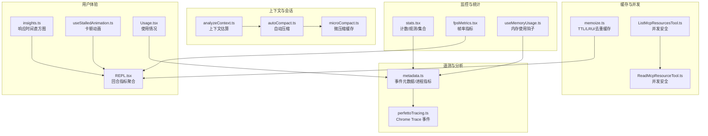
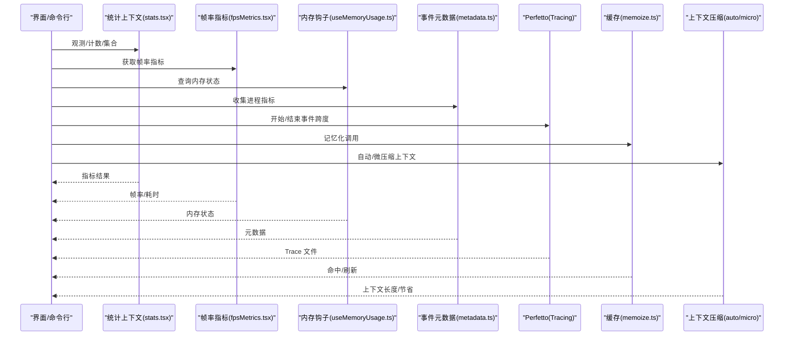
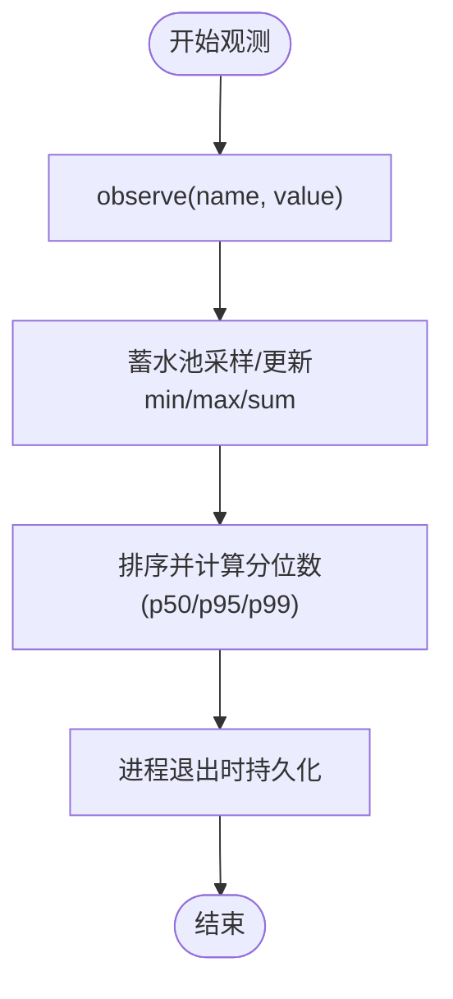
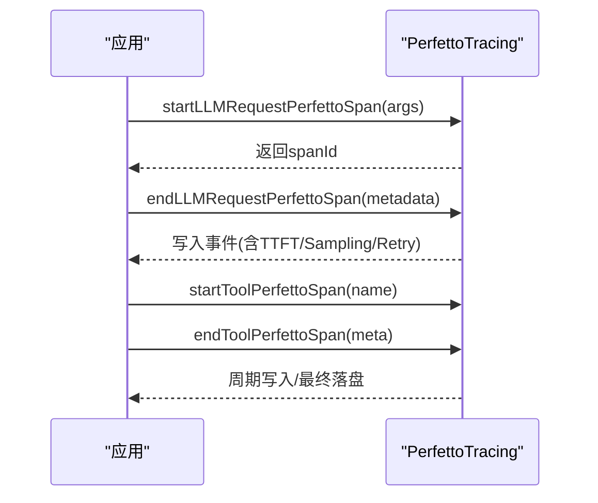
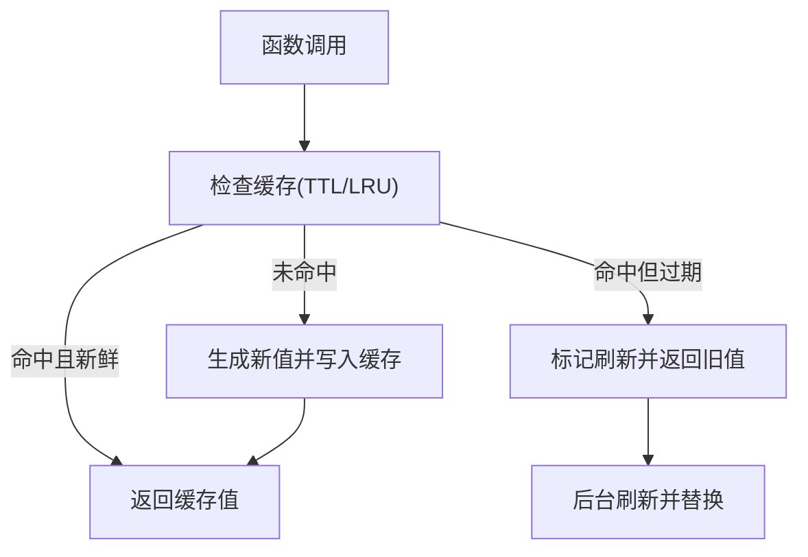
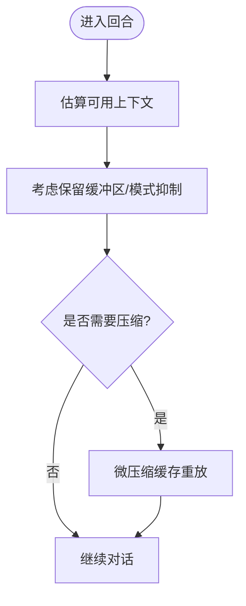
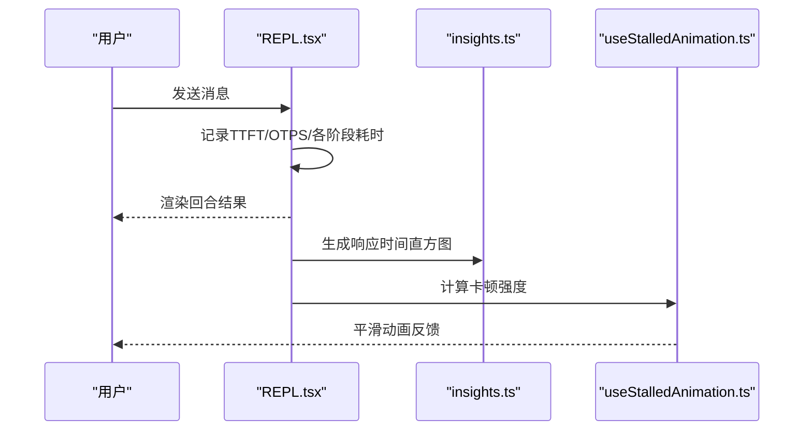
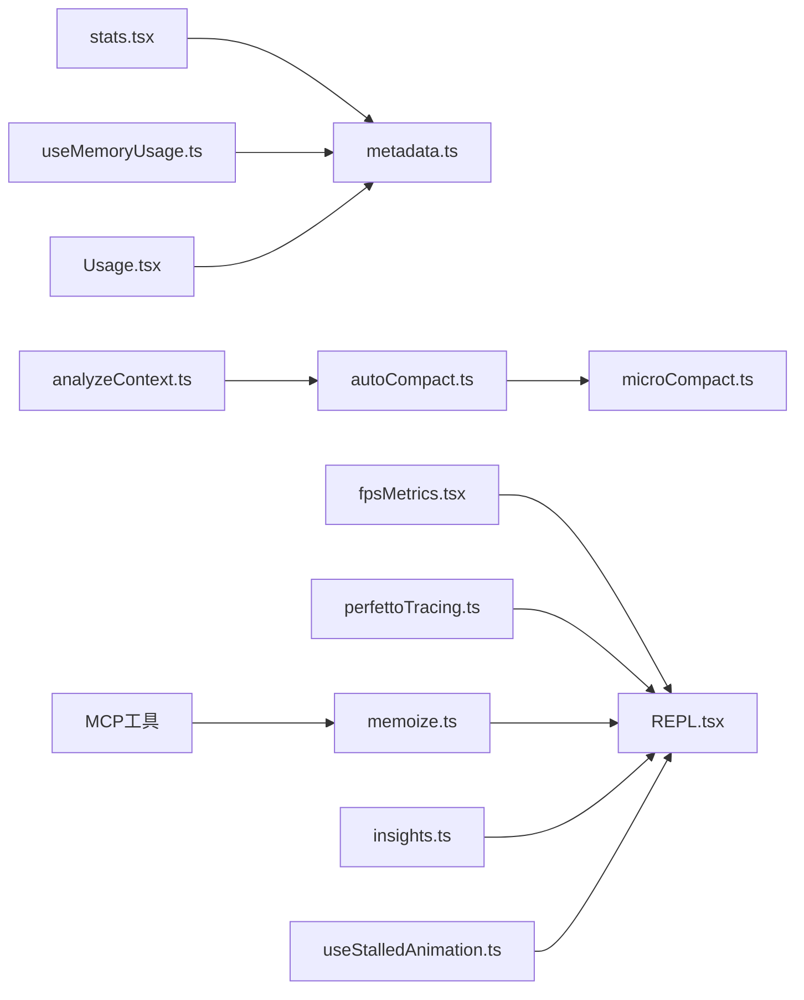

# 性能优化

<cite>
**本文引用的文件**
- [stats.tsx](file://src/context/stats.tsx)
- [perfettoTracing.ts](file://src/utils/telemetry/perfettoTracing.ts)
- [memoize.ts](file://src/utils/memoize.ts)
- [metadata.ts](file://src/services/analytics/metadata.ts)
- [useMemoryUsage.ts](file://src/hooks/useMemoryUsage.ts)
- [fpsMetrics.tsx](file://src/context/fpsMetrics.tsx)
- [insights.ts](file://src/commands/insights.ts)
- [REPL.tsx](file://src/screens/REPL.tsx)
- [microCompact.ts](file://src/services/compact/microCompact.ts)
- [autoCompact.ts](file://src/services/compact/autoCompact.ts)
- [analyzeContext.ts](file://src/utils/analyzeContext.ts)
- [interactiveHelpers.tsx](file://src/interactiveHelpers.tsx)
- [useStalledAnimation.ts](file://src/components/Spinner/useStalledAnimation.ts)
- [Usage.tsx](file://src/components/Settings/Usage.tsx)
- [ListMcpResourcesTool.ts](file://src/tools/ListMcpResourcesTool/ListMcpResourcesTool.ts)
- [ReadMcpResourceTool.ts](file://src/tools/ReadMcpResourceTool/ReadMcpResourceTool.ts)
</cite>

## 目录
1. [简介](#简介)
2. [项目结构](#项目结构)
3. [核心组件](#核心组件)
4. [架构总览](#架构总览)
5. [详细组件分析](#详细组件分析)
6. [依赖关系分析](#依赖关系分析)
7. [性能考量](#性能考量)
8. [故障排查指南](#故障排查指南)
9. [结论](#结论)
10. [附录](#附录)

## 简介
本指南面向 Claude Code 的开发者与高级用户，系统化阐述如何在该代码库中进行性能优化与分析。内容覆盖性能监控与分析（内置工具、指标采集、可视化）、内存管理与优化（泄漏预防、GC 优化、大对象处理）、代码性能优化技巧（算法、异步、缓存、并发）、用户体验优化（加载与响应时间、界面流畅度）、资源使用优化（CPU、网络、磁盘 I/O），并结合仓库中的真实实现给出可操作的最佳实践与案例。

## 项目结构
围绕性能优化的关键模块分布如下：
- 指标与统计：上下文级统计、帧率指标、内存使用钩子
- 分析与遥测：事件元数据、进程指标、Perfetto 跟踪
- 缓存与并发：记忆化与 LRU 缓存、并发安全工具
- 会话与上下文压缩：自动压缩、微压缩缓存、上下文估算
- 用户体验：卡顿动画、洞察命令、使用情况展示
- 工具与资源：MCP 资源读取与列举（并发安全）

**图表来源**
- [stats.tsx:1-220](file://src/context/stats.tsx#L1-L220)
- [fpsMetrics.tsx:1-30](file://src/context/fpsMetrics.tsx#L1-L30)
- [useMemoryUsage.ts:1-40](file://src/hooks/useMemoryUsage.ts#L1-L40)
- [metadata.ts:640-682](file://src/services/analytics/metadata.ts#L640-L682)
- [perfettoTracing.ts:253-335](file://src/utils/telemetry/perfettoTracing.ts#L253-L335)
- [memoize.ts:40-107](file://src/utils/memoize.ts#L40-L107)
- [ListMcpResourcesTool.ts:40-77](file://src/tools/ListMcpResourcesTool/ListMcpResourcesTool.ts#L40-L77)
- [ReadMcpResourceTool.ts:49-101](file://src/tools/ReadMcpResourceTool/ReadMcpResourceTool.ts#L49-L101)
- [autoCompact.ts:160-199](file://src/services/compact/autoCompact.ts#L160-L199)
- [microCompact.ts:88-118](file://src/services/compact/microCompact.ts#L88-L118)
- [analyzeContext.ts:1105-1132](file://src/utils/analyzeContext.ts#L1105-L1132)
- [insights.ts:1877-1900](file://src/commands/insights.ts#L1877-L1900)
- [REPL.tsx:2812-2847](file://src/screens/REPL.tsx#L2812-L2847)
- [useStalledAnimation.ts:40-75](file://src/components/Spinner/useStalledAnimation.ts#L40-L75)
- [Usage.tsx:174-229](file://src/components/Settings/Usage.tsx#L174-L229)

**章节来源**
- [stats.tsx:1-220](file://src/context/stats.tsx#L1-L220)
- [metadata.ts:640-682](file://src/services/analytics/metadata.ts#L640-L682)
- [perfettoTracing.ts:253-335](file://src/utils/telemetry/perfettoTracing.ts#L253-L335)

## 核心组件
- 统计与观测
  - 计数器/仪表盘/观测值/集合，支持分位数统计与持久化保存，便于端到端指标追踪。
  - 参考路径：[stats.tsx:28-96](file://src/context/stats.tsx#L28-L96)
- 进程与系统指标
  - CPU 百分比、内存使用、受限内存等，用于全局性能画像。
  - 参考路径：[metadata.ts:648-682](file://src/services/analytics/metadata.ts#L648-L682)
- Perfetto 跟踪
  - API 请求、工具执行、用户等待、交互全流程事件记录，支持采样与重试子事件。
  - 参考路径：[perfettoTracing.ts:425-685](file://src/utils/telemetry/perfettoTracing.ts#L425-L685)
- 缓存与并发
  - TTL 缓存、异步去重、LRU 缓存，降低重复计算与网络开销。
  - 参考路径：[memoize.ts:40-107](file://src/utils/memoize.ts#L40-L107), [memoize.ts:120-220](file://src/utils/memoize.ts#L120-L220), [memoize.ts:234-270](file://src/utils/memoize.ts#L234-L270)
- 上下文压缩与估算
  - 自动压缩、微压缩缓存、上下文估算与保留缓冲区策略，控制上下文长度与成本。
  - 参考路径：[autoCompact.ts:160-199](file://src/services/compact/autoCompact.ts#L160-L199), [microCompact.ts:88-118](file://src/services/compact/microCompact.ts#L88-L118), [analyzeContext.ts:1105-1132](file://src/utils/analyzeContext.ts#L1105-L1132)
- 用户体验指标
  - 帧时长观测、内存阈值告警、卡顿动画、使用情况展示、响应时间直方图。
  - 参考路径：[fpsMetrics.tsx:1-30](file://src/context/fpsMetrics.tsx#L1-L30), [useMemoryUsage.ts:18-39](file://src/hooks/useMemoryUsage.ts#L18-L39), [useStalledAnimation.ts:40-75](file://src/components/Spinner/useStalledAnimation.ts#L40-L75), [Usage.tsx:174-229](file://src/components/Settings/Usage.tsx#L174-L229), [insights.ts:1877-1900](file://src/commands/insights.ts#L1877-L1900)

**章节来源**
- [stats.tsx:28-96](file://src/context/stats.tsx#L28-L96)
- [metadata.ts:648-682](file://src/services/analytics/metadata.ts#L648-L682)
- [perfettoTracing.ts:425-685](file://src/utils/telemetry/perfettoTracing.ts#L425-L685)
- [memoize.ts:40-107](file://src/utils/memoize.ts#L40-L107)
- [autoCompact.ts:160-199](file://src/services/compact/autoCompact.ts#L160-L199)
- [microCompact.ts:88-118](file://src/services/compact/microCompact.ts#L88-L118)
- [analyzeContext.ts:1105-1132](file://src/utils/analyzeContext.ts#L1105-L1132)
- [fpsMetrics.tsx:1-30](file://src/context/fpsMetrics.tsx#L1-L30)
- [useMemoryUsage.ts:18-39](file://src/hooks/useMemoryUsage.ts#L18-L39)
- [useStalledAnimation.ts:40-75](file://src/components/Spinner/useStalledAnimation.ts#L40-L75)
- [Usage.tsx:174-229](file://src/components/Settings/Usage.tsx#L174-L229)
- [insights.ts:1877-1900](file://src/commands/insights.ts#L1877-L1900)

## 架构总览
性能优化体系由“采集—存储—分析—反馈”闭环构成：
- 采集层：统计上下文、帧率、内存、进程指标、Perfetto 事件
- 存储层：本地持久化指标、事件快照
- 分析层：分位数统计、直方图、回合级聚合
- 反馈层：UI 展示、告警、配置开关、自动压缩

**图表来源**
- [stats.tsx:28-96](file://src/context/stats.tsx#L28-L96)
- [fpsMetrics.tsx:1-30](file://src/context/fpsMetrics.tsx#L1-L30)
- [useMemoryUsage.ts:18-39](file://src/hooks/useMemoryUsage.ts#L18-L39)
- [metadata.ts:648-682](file://src/services/analytics/metadata.ts#L648-L682)
- [perfettoTracing.ts:425-685](file://src/utils/telemetry/perfettoTracing.ts#L425-L685)
- [memoize.ts:40-107](file://src/utils/memoize.ts#L40-L107)
- [autoCompact.ts:160-199](file://src/services/compact/autoCompact.ts#L160-L199)
- [microCompact.ts:88-118](file://src/services/compact/microCompact.ts#L88-L118)

## 详细组件分析

### 组件A：统计与观测（stats.tsx）
- 功能要点
  - 提供计数器、仪表盘、观测值（含分位数）、集合等能力
  - 观测值采用蓄水池抽样与分位数计算，支持 p50/p95/p99
  - 结合退出事件持久化最近会话指标
- 性能意义
  - 低开销地记录高频指标；分位数帮助识别尾部延迟
  - 退出持久化避免丢失关键会话数据
- 使用建议
  - 对热点路径使用观测计时，对稳定指标使用计数器
  - 将关键阈值（如 TTFT、OTPS）纳入观测

**图表来源**
- [stats.tsx:39-96](file://src/context/stats.tsx#L39-L96)

**章节来源**
- [stats.tsx:28-96](file://src/context/stats.tsx#L28-L96)

### 组件B：Perfetto 跟踪（perfettoTracing.ts）
- 功能要点
  - API 请求：TTFT/TTLT、提示词/输出令牌、缓存命中率、重试子事件
  - 工具执行：名称、时长、结果令牌
  - 用户输入等待：上下文与来源
  - 进程/线程元数据、周期写入、过期清理、最终落盘
- 性能意义
  - 端到端可视化 API 与工具执行耗时，定位瓶颈阶段
  - 重试与采样分离，精确还原吞吐与延迟
- 使用建议
  - 通过环境变量启用，配合周期写入避免长时间会话内存膨胀
  - 在多请求回合中聚合 TTFT/OTPS，避免单次抖动误导

**图表来源**
- [perfettoTracing.ts:425-685](file://src/utils/telemetry/perfettoTracing.ts#L425-L685)
- [perfettoTracing.ts:690-763](file://src/utils/telemetry/perfettoTracing.ts#L690-L763)
- [perfettoTracing.ts:253-335](file://src/utils/telemetry/perfettoTracing.ts#L253-L335)

**章节来源**
- [perfettoTracing.ts:425-685](file://src/utils/telemetry/perfettoTracing.ts#L425-L685)
- [perfettoTracing.ts:253-335](file://src/utils/telemetry/perfettoTracing.ts#L253-L335)

### 组件C：缓存与并发（memoize.ts）
- 功能要点
  - TTL 缓存：写穿透、后台刷新、防抖
  - 异步去重：inFlight 映射避免并发冷启动风暴
  - LRU 缓存：限制内存增长，适合消息处理函数
- 性能意义
  - 显著降低重复计算与外部调用次数
  - 避免并发风暴导致的资源争用
- 使用建议
  - 对昂贵的 IO/计算函数使用 TTL 缓存
  - 对幂等且高并发场景使用 LRU 缓存
  - 注意 clear 时同步清理 inFlight，防止脏写

**图表来源**
- [memoize.ts:40-107](file://src/utils/memoize.ts#L40-L107)
- [memoize.ts:120-220](file://src/utils/memoize.ts#L120-L220)
- [memoize.ts:234-270](file://src/utils/memoize.ts#L234-L270)

**章节来源**
- [memoize.ts:40-107](file://src/utils/memoize.ts#L40-L107)
- [memoize.ts:120-220](file://src/utils/memoize.ts#L120-L220)
- [memoize.ts:234-270](file://src/utils/memoize.ts#L234-L270)

### 组件D：上下文压缩与估算（autoCompact.ts, microCompact.ts, analyzeContext.ts）
- 功能要点
  - 自动压缩：基于阈值与模式抑制主动压缩，避免死锁与竞态
  - 微压缩缓存：保留编辑块并在后续请求中重放，减少重复传输
  - 上下文估算：根据模型预算与保留缓冲区动态评估可用空间
- 性能意义
  - 控制上下文长度，降低 API 成本与延迟
  - 透明重放缓存编辑，减少冗余传输
- 使用建议
  - 合理设置保留缓冲区，避免在“反应式模式”下误报
  - 与自动压缩协同，避免重复压缩造成抖动

**图表来源**
- [autoCompact.ts:160-199](file://src/services/compact/autoCompact.ts#L160-L199)
- [microCompact.ts:88-118](file://src/services/compact/microCompact.ts#L88-L118)
- [analyzeContext.ts:1105-1132](file://src/utils/analyzeContext.ts#L1105-L1132)

**章节来源**
- [autoCompact.ts:160-199](file://src/services/compact/autoCompact.ts#L160-L199)
- [microCompact.ts:88-118](file://src/services/compact/microCompact.ts#L88-L118)
- [analyzeContext.ts:1105-1132](file://src/utils/analyzeContext.ts#L1105-L1132)

### 组件E：用户体验与指标（insights.ts, REPL.tsx, useStalledAnimation.ts, Usage.tsx）
- 功能要点
  - 响应时间直方图：按区间统计用户响应时间分布
  - REPL 回合指标：回合内 TTFT/OTPS/钩子/工具/分类器耗时聚合
  - 卡顿动画：基于时间与工具状态平滑渲染红色强度
  - 使用情况：终端宽度自适应、错误重试、加载状态
- 性能意义
  - 以可视化方式发现交互延迟异常
  - 通过回合级聚合消除单点噪声
  - 降低视觉干扰，提升感知流畅度
- 使用建议
  - 在多请求回合中使用中位数聚合 TTFT/OTPS
  - 对卡顿动画启用降敏感模式，兼顾可访问性

**图表来源**
- [REPL.tsx:2812-2847](file://src/screens/REPL.tsx#L2812-L2847)
- [insights.ts:1877-1900](file://src/commands/insights.ts#L1877-L1900)
- [useStalledAnimation.ts:40-75](file://src/components/Spinner/useStalledAnimation.ts#L40-L75)

**章节来源**
- [insights.ts:1877-1900](file://src/commands/insights.ts#L1877-L1900)
- [REPL.tsx:2812-2847](file://src/screens/REPL.tsx#L2812-L2847)
- [useStalledAnimation.ts:40-75](file://src/components/Spinner/useStalledAnimation.ts#L40-L75)
- [Usage.tsx:174-229](file://src/components/Settings/Usage.tsx#L174-L229)

### 组件F：并发安全工具（ListMcpResourcesTool.ts, ReadMcpResourceTool.ts）
- 功能要点
  - 工具声明并发安全与只读特性
  - 列表/读取资源时按目标服务器过滤或连接校验
- 性能意义
  - 并发安全保证避免重复拉取与竞争
  - 只读工具减少副作用，利于缓存与复用
- 使用建议
  - 对高并发场景优先选择并发安全工具
  - 严格校验连接状态与能力，避免无效请求

**章节来源**
- [ListMcpResourcesTool.ts:40-77](file://src/tools/ListMcpResourcesTool/ListMcpResourcesTool.ts#L40-L77)
- [ReadMcpResourceTool.ts:49-101](file://src/tools/ReadMcpResourceTool/ReadMcpResourceTool.ts#L49-L101)

## 依赖关系分析
- 统计与遥测耦合度低，分别服务于不同层面的可观测性
- 缓存模块独立，可被任意业务函数复用
- 上下文压缩与分析相互依赖，共同控制成本
- 用户体验组件依赖统计与回合指标，形成闭环反馈

**图表来源**
- [stats.tsx:28-96](file://src/context/stats.tsx#L28-L96)
- [metadata.ts:648-682](file://src/services/analytics/metadata.ts#L648-L682)
- [perfettoTracing.ts:425-685](file://src/utils/telemetry/perfettoTracing.ts#L425-L685)
- [memoize.ts:40-107](file://src/utils/memoize.ts#L40-L107)
- [autoCompact.ts:160-199](file://src/services/compact/autoCompact.ts#L160-L199)
- [microCompact.ts:88-118](file://src/services/compact/microCompact.ts#L88-L118)
- [analyzeContext.ts:1105-1132](file://src/utils/analyzeContext.ts#L1105-L1132)
- [insights.ts:1877-1900](file://src/commands/insights.ts#L1877-L1900)
- [REPL.tsx:2812-2847](file://src/screens/REPL.tsx#L2812-L2847)
- [useStalledAnimation.ts:40-75](file://src/components/Spinner/useStalledAnimation.ts#L40-L75)
- [Usage.tsx:174-229](file://src/components/Settings/Usage.tsx#L174-L229)

**章节来源**
- [stats.tsx:28-96](file://src/context/stats.tsx#L28-L96)
- [metadata.ts:648-682](file://src/services/analytics/metadata.ts#L648-L682)
- [perfettoTracing.ts:425-685](file://src/utils/telemetry/perfettoTracing.ts#L425-L685)
- [memoize.ts:40-107](file://src/utils/memoize.ts#L40-L107)
- [autoCompact.ts:160-199](file://src/services/compact/autoCompact.ts#L160-L199)
- [microCompact.ts:88-118](file://src/services/compact/microCompact.ts#L88-L118)
- [analyzeContext.ts:1105-1132](file://src/utils/analyzeContext.ts#L1105-L1132)
- [insights.ts:1877-1900](file://src/commands/insights.ts#L1877-L1900)
- [REPL.tsx:2812-2847](file://src/screens/REPL.tsx#L2812-L2847)
- [useStalledAnimation.ts:40-75](file://src/components/Spinner/useStalledAnimation.ts#L40-L75)
- [Usage.tsx:174-229](file://src/components/Settings/Usage.tsx#L174-L229)

## 性能考量
- 指标采集
  - 使用统计上下文记录高频指标，结合分位数识别尾部延迟
  - Perfetto 事件区分“请求准备/首次令牌/采样”，便于定位瓶颈阶段
- 内存管理
  - 使用内存钩子定期检测堆使用，超过阈值触发告警
  - 缓存模块采用 TTL 与 LRU，避免无界增长
- 并发与网络
  - 工具声明并发安全，减少重复请求
  - 异步去重避免并发风暴
- 上下文与成本
  - 自动/微压缩减少传输与成本
  - 估算与保留缓冲区平衡吞吐与稳定性
- 用户体验
  - 帧率与卡顿动画提升感知流畅度
  - 响应时间直方图辅助定位交互延迟

[本节为通用指导，无需特定文件引用]

## 故障排查指南
- 启用 Perfetto 跟踪
  - 设置环境变量开启跟踪与周期写入，查看输出目录的 trace 文件
  - 参考路径：[perfettoTracing.ts:253-335](file://src/utils/telemetry/perfettoTracing.ts#L253-L335)
- 检查内存使用
  - 使用内存钩子观察堆使用变化，关注阈值告警
  - 参考路径：[useMemoryUsage.ts:18-39](file://src/hooks/useMemoryUsage.ts#L18-L39)
- 定位 API 延迟
  - 查看回合级 TTFT/OTPS 聚合，关注重试与采样阶段
  - 参考路径：[REPL.tsx:2812-2847](file://src/screens/REPL.tsx#L2812-L2847), [perfettoTracing.ts:508-545](file://src/utils/telemetry/perfettoTracing.ts#L508-L545)
- 缓存问题
  - 若出现缓存不一致，清理缓存并确认 inFlight 清理逻辑
  - 参考路径：[memoize.ts:210-219](file://src/utils/memoize.ts#L210-L219)
- 上下文过长
  - 检查自动压缩与微压缩缓存是否生效，调整保留缓冲区策略
  - 参考路径：[autoCompact.ts:160-199](file://src/services/compact/autoCompact.ts#L160-L199), [microCompact.ts:88-118](file://src/services/compact/microCompact.ts#L88-L118), [analyzeContext.ts:1105-1132](file://src/utils/analyzeContext.ts#L1105-L1132)

**章节来源**
- [perfettoTracing.ts:253-335](file://src/utils/telemetry/perfettoTracing.ts#L253-L335)
- [useMemoryUsage.ts:18-39](file://src/hooks/useMemoryUsage.ts#L18-L39)
- [REPL.tsx:2812-2847](file://src/screens/REPL.tsx#L2812-L2847)
- [memoize.ts:210-219](file://src/utils/memoize.ts#L210-L219)
- [autoCompact.ts:160-199](file://src/services/compact/autoCompact.ts#L160-L199)
- [microCompact.ts:88-118](file://src/services/compact/microCompact.ts#L88-L118)
- [analyzeContext.ts:1105-1132](file://src/utils/analyzeContext.ts#L1105-L1132)

## 结论
通过统计观测、Perfetto 跟踪、缓存与并发优化、上下文压缩以及用户体验指标，Claude Code 在功能复杂度与性能之间取得了良好平衡。建议在日常开发中：
- 为关键路径埋点并使用分位数分析
- 合理启用与轮询 Perfetto 跟踪
- 广泛使用 TTL/LRU 缓存与并发安全工具
- 结合自动/微压缩与上下文估算控制成本
- 关注帧率、卡顿与内存使用，持续优化交互体验

[本节为总结，无需特定文件引用]

## 附录
- 实战案例
  - 多请求回合 TTFT/OTPS 聚合：在 REPL 中对多轮请求取中位数，避免单次抖动误导
    - 参考路径：[REPL.tsx:2812-2847](file://src/screens/REPL.tsx#L2812-L2847)
  - 响应时间分布可视化：使用直方图卡片展示用户响应时间区间占比
    - 参考路径：[insights.ts:1877-1900](file://src/commands/insights.ts#L1877-L1900)
  - 卡顿动画平滑过渡：基于时间差与动画帧平滑红色强度，减少视觉闪烁
    - 参考路径：[useStalledAnimation.ts:40-75](file://src/components/Spinner/useStalledAnimation.ts#L40-L75)
  - MCP 资源读取并发安全：按服务器过滤与连接校验，避免无效请求
    - 参考路径：[ListMcpResourcesTool.ts:66-77](file://src/tools/ListMcpResourcesTool/ListMcpResourcesTool.ts#L66-L77), [ReadMcpResourceTool.ts:75-101](file://src/tools/ReadMcpResourceTool/ReadMcpResourceTool.ts#L75-L101)

**章节来源**
- [REPL.tsx:2812-2847](file://src/screens/REPL.tsx#L2812-L2847)
- [insights.ts:1877-1900](file://src/commands/insights.ts#L1877-L1900)
- [useStalledAnimation.ts:40-75](file://src/components/Spinner/useStalledAnimation.ts#L40-L75)
- [ListMcpResourcesTool.ts:66-77](file://src/tools/ListMcpResourcesTool/ListMcpResourcesTool.ts#L66-L77)
- [ReadMcpResourceTool.ts:75-101](file://src/tools/ReadMcpResourceTool/ReadMcpResourceTool.ts#L75-L101)