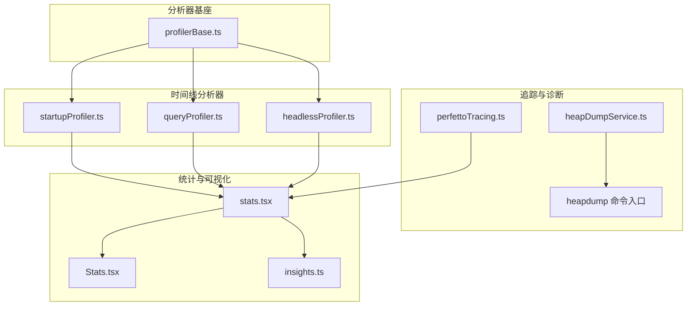
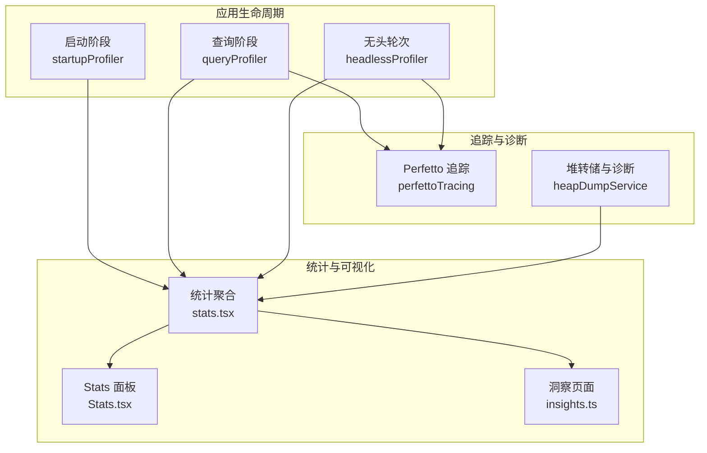
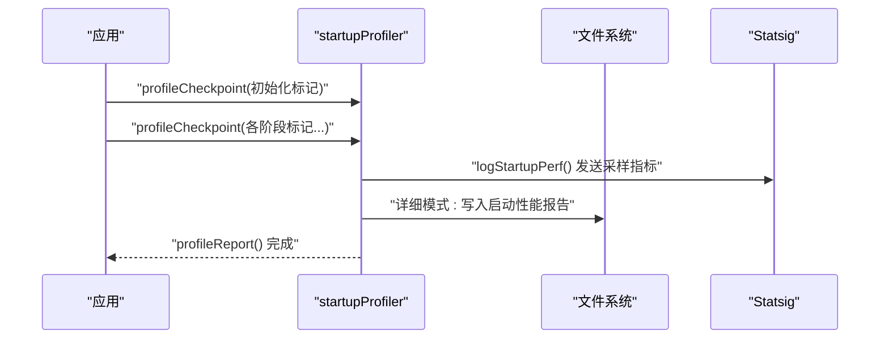
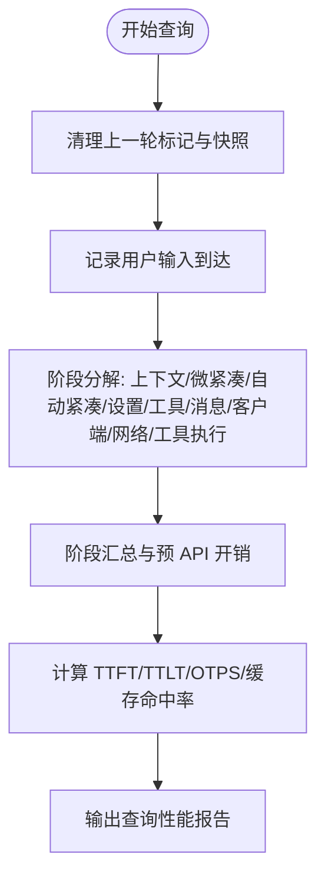
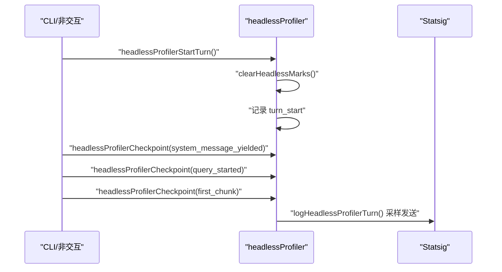
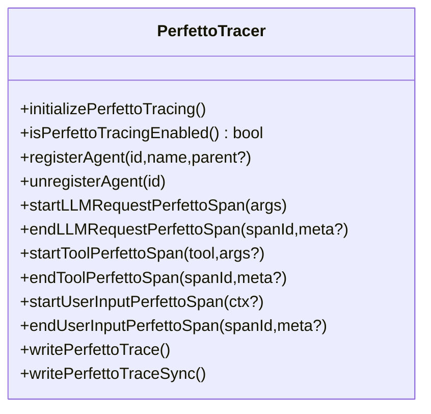
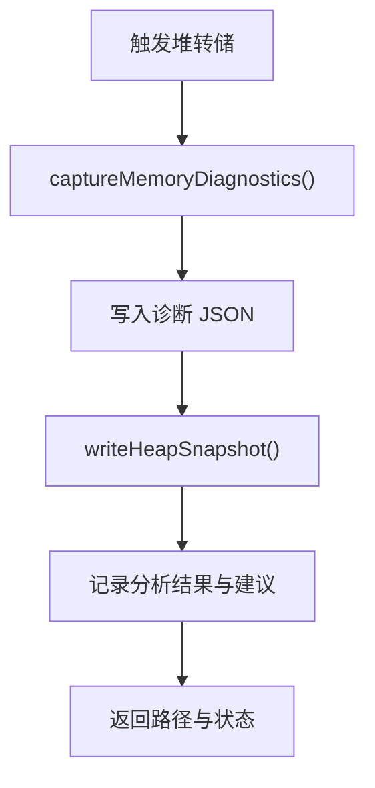
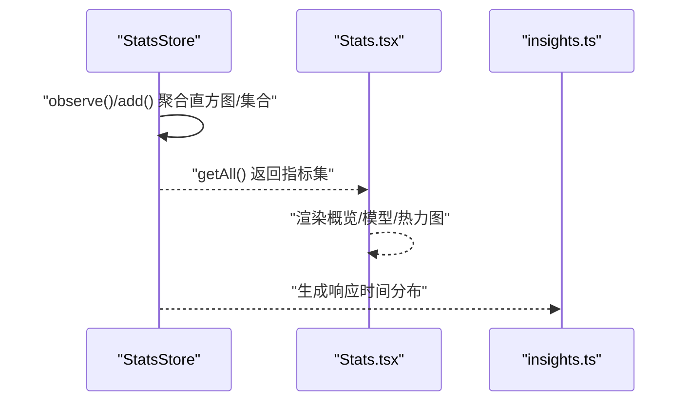
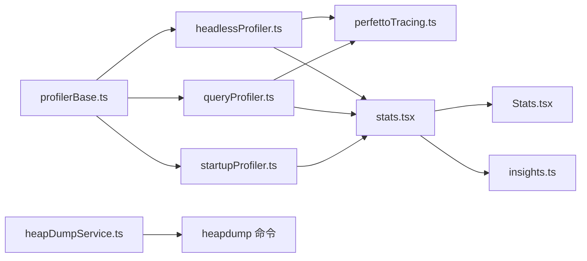

# 性能监控与分析

<cite>
**本文引用的文件**
- [src/utils/profilerBase.ts](file://src/utils/profilerBase.ts)
- [src/utils/startupProfiler.ts](file://src/utils/startupProfiler.ts)
- [src/utils/queryProfiler.ts](file://src/utils/queryProfiler.ts)
- [src/utils/headlessProfiler.ts](file://src/utils/headlessProfiler.ts)
- [src/utils/telemetry/perfettoTracing.ts](file://src/utils/telemetry/perfettoTracing.ts)
- [src/utils/heapDumpService.ts](file://src/utils/heapDumpService.ts)
- [src/commands/heapdump/heapdump.ts](file://src/commands/heapdump/heapdump.ts)
- [src/context/stats.tsx](file://src/context/stats.tsx)
- [src/components/Stats.tsx](file://src/components/Stats.tsx)
- [src/commands/insights.ts](file://src/commands/insights.ts)
</cite>

## 目录
1. [简介](#简介)
2. [项目结构](#项目结构)
3. [核心组件](#核心组件)
4. [架构总览](#架构总览)
5. [详细组件分析](#详细组件分析)
6. [依赖关系分析](#依赖关系分析)
7. [性能考量](#性能考量)
8. [故障排查指南](#故障排查指南)
9. [结论](#结论)
10. [附录](#附录)

## 简介
本文件系统性梳理 Claude Code 的内置性能监控与分析能力，覆盖三类分析器：启动性能分析器、查询性能分析器、无头模式性能分析器；并介绍基于 Chrome Trace 格式的 Perfetto 追踪、堆转储与诊断、统计聚合与可视化等能力。文档重点说明：
- 如何启用性能监控（环境变量与采样策略）
- 如何解读性能报告（时间线、阶段分解、派生指标）
- 如何识别性能瓶颈（长尾阶段、网络延迟、工具执行）
- 性能指标含义（响应时间、TTFT/TTLT、OTPS、缓存命中率、内存与资源占用）
- 实战案例：从报告到优化建议
- 数据收集最佳实践与基准测试方法

## 项目结构
围绕性能监控的关键模块分布如下：
- 分析器基座与通用格式化：profilerBase.ts
- 启动阶段分析：startupProfiler.ts
- 查询阶段分析：queryProfiler.ts
- 无头模式分析：headlessProfiler.ts
- Perfetto 追踪：telemetry/perfettoTracing.ts
- 堆转储与诊断：heapDumpService.ts 及命令入口 heapdump.ts
- 统计聚合与可视化：context/stats.tsx、components/Stats.tsx、commands/insights.ts

图表来源
- [src/utils/profilerBase.ts:1-46](file://src/utils/profilerBase.ts#L1-L46)
- [src/utils/startupProfiler.ts:1-195](file://src/utils/startupProfiler.ts#L1-L195)
- [src/utils/queryProfiler.ts:1-301](file://src/utils/queryProfiler.ts#L1-L301)
- [src/utils/headlessProfiler.ts:1-179](file://src/utils/headlessProfiler.ts#L1-L179)
- [src/utils/telemetry/perfettoTracing.ts:250-335](file://src/utils/telemetry/perfettoTracing.ts#L250-L335)
- [src/utils/heapDumpService.ts:1-278](file://src/utils/heapDumpService.ts#L1-L278)
- [src/commands/heapdump/heapdump.ts:1-18](file://src/commands/heapdump/heapdump.ts#L1-L18)
- [src/context/stats.tsx:38-144](file://src/context/stats.tsx#L38-L144)
- [src/components/Stats.tsx:1-1228](file://src/components/Stats.tsx#L1-L1228)
- [src/commands/insights.ts:1832-2719](file://src/commands/insights.ts#L1832-L2719)

章节来源
- [src/utils/profilerBase.ts:1-46](file://src/utils/profilerBase.ts#L1-L46)
- [src/utils/startupProfiler.ts:1-195](file://src/utils/startupProfiler.ts#L1-L195)
- [src/utils/queryProfiler.ts:1-301](file://src/utils/queryProfiler.ts#L1-L301)
- [src/utils/headlessProfiler.ts:1-179](file://src/utils/headlessProfiler.ts#L1-L179)
- [src/utils/telemetry/perfettoTracing.ts:250-335](file://src/utils/telemetry/perfettoTracing.ts#L250-L335)
- [src/utils/heapDumpService.ts:1-278](file://src/utils/heapDumpService.ts#L1-L278)
- [src/commands/heapdump/heapdump.ts:1-18](file://src/commands/heapdump/heapdump.ts#L1-L18)
- [src/context/stats.tsx:38-144](file://src/context/stats.tsx#L38-L144)
- [src/components/Stats.tsx:1-1228](file://src/components/Stats.tsx#L1-L1228)
- [src/commands/insights.ts:1832-2719](file://src/commands/insights.ts#L1832-L2719)

## 核心组件
- 分析器基座（profilerBase.ts）：统一时间线格式化、毫秒格式化、懒加载性能 API，确保按需初始化，避免对常规运行路径造成开销。
- 启动性能分析器（startupProfiler.ts）：记录启动关键阶段，支持采样日志到 Statsig 与详细报告落盘，提供阶段时长与总耗时。
- 查询性能分析器（queryProfiler.ts）：记录从用户输入到首 token 到达的完整链路，输出阶段分解与预 API 开销统计。
- 无头模式性能分析器（headlessProfiler.ts）：面向非交互场景，记录每轮对话的 TTFT/TTLT、查询准备阶段耗时等。
- Perfetto 追踪（perfettoTracing.ts）：以 Chrome Trace JSON 格式记录 API 调用、工具执行、等待用户输入等跨度事件，支持周期写盘与退出兜底写入。
- 堆转储与诊断（heapDumpService.ts）：捕获 V8 堆快照与进程内存诊断，辅助定位泄漏与资源占用。
- 统计与可视化（stats.tsx、Stats.tsx、insights.ts）：聚合直方图、百分位、集合基数等指标，提供终端内可视化面板与洞察页面。

章节来源
- [src/utils/profilerBase.ts:14-46](file://src/utils/profilerBase.ts#L14-L46)
- [src/utils/startupProfiler.ts:48-194](file://src/utils/startupProfiler.ts#L48-L194)
- [src/utils/queryProfiler.ts:30-301](file://src/utils/queryProfiler.ts#L30-L301)
- [src/utils/headlessProfiler.ts:25-179](file://src/utils/headlessProfiler.ts#L25-L179)
- [src/utils/telemetry/perfettoTracing.ts:93-1101](file://src/utils/telemetry/perfettoTracing.ts#L93-L1101)
- [src/utils/heapDumpService.ts:32-211](file://src/utils/heapDumpService.ts#L32-L211)
- [src/context/stats.tsx:38-144](file://src/context/stats.tsx#L38-L144)
- [src/components/Stats.tsx:1-1228](file://src/components/Stats.tsx#L1-L1228)
- [src/commands/insights.ts:1832-2719](file://src/commands/insights.ts#L1832-L2719)

## 架构总览
下图展示性能分析器与追踪、诊断、统计模块之间的交互关系与数据流向。

图表来源
- [src/utils/startupProfiler.ts:123-194](file://src/utils/startupProfiler.ts#L123-L194)
- [src/utils/queryProfiler.ts:298-301](file://src/utils/queryProfiler.ts#L298-L301)
- [src/utils/headlessProfiler.ts:103-179](file://src/utils/headlessProfiler.ts#L103-L179)
- [src/utils/telemetry/perfettoTracing.ts:424-463](file://src/utils/telemetry/perfettoTracing.ts#L424-L463)
- [src/utils/heapDumpService.ts:221-278](file://src/utils/heapDumpService.ts#L221-L278)
- [src/context/stats.tsx:77-96](file://src/context/stats.tsx#L77-L96)
- [src/components/Stats.tsx:121-311](file://src/components/Stats.tsx#L121-L311)
- [src/commands/insights.ts:2542-2551](file://src/commands/insights.ts#L2542-L2551)

## 详细组件分析

### 启动性能分析器（startupProfiler）
- 启用方式
  - 采样日志：默认按采样率向 Statsig 发送关键阶段时长（Ant 用户 100%，外部用户 0.5%）。
  - 详细报告：设置环境变量后，记录完整时间线与内存快照，并落盘至配置目录。
- 关键机制
  - 使用 Node perf_hooks performance API 记录 mark。
  - 采样期仅记录阶段时长；详细模式额外记录内存快照并生成时间线报告。
- 报告内容
  - 时间线行格式：累计时间、阶段增量、阶段名、可选内存信息。
  - 总启动时间与阶段分解。
- 典型用途
  - 定位冷启动慢点（导入、设置加载、初始化、总耗时）。

图表来源
- [src/utils/startupProfiler.ts:65-144](file://src/utils/startupProfiler.ts#L65-L144)
- [src/utils/startupProfiler.ts:159-194](file://src/utils/startupProfiler.ts#L159-L194)

章节来源
- [src/utils/startupProfiler.ts:24-75](file://src/utils/startupProfiler.ts#L24-L75)
- [src/utils/startupProfiler.ts:81-119](file://src/utils/startupProfiler.ts#L81-L119)
- [src/utils/startupProfiler.ts:123-144](file://src/utils/startupProfiler.ts#L123-L144)
- [src/utils/startupProfiler.ts:159-194](file://src/utils/startupProfiler.ts#L159-L194)

### 查询性能分析器（queryProfiler）
- 启用方式
  - 设置环境变量开启查询分析，记录从接收用户输入到首 token 到达的全链路。
- 关键机制
  - 清理上一轮标记与内存快照，记录查询开始。
  - 支持阶段分解（上下文加载、微紧凑、自动紧凑、设置、工具模式构建、消息归一化、客户端创建、网络 TTFB、工具执行）。
  - 派生指标：预 API 开销（api_request_sent 之前）、TTFT/TTLT、OTPS（采样速度）、缓存命中率。
- 报告内容
  - 阶段耗时条形图与总计。
  - 预 API 开销汇总。
- 典型用途
  - 识别网络延迟、工具执行耗时、消息处理瓶颈。

图表来源
- [src/utils/queryProfiler.ts:50-64](file://src/utils/queryProfiler.ts#L50-L64)
- [src/utils/queryProfiler.ts:216-293](file://src/utils/queryProfiler.ts#L216-L293)
- [src/utils/queryProfiler.ts:298-301](file://src/utils/queryProfiler.ts#L298-L301)

章节来源
- [src/utils/queryProfiler.ts:30-75](file://src/utils/queryProfiler.ts#L30-L75)
- [src/utils/queryProfiler.ts:205-293](file://src/utils/queryProfiler.ts#L205-L293)
- [src/utils/queryProfiler.ts:298-301](file://src/utils/queryProfiler.ts#L298-L301)

### 无头模式性能分析器（headlessProfiler）
- 启用方式
  - 在非交互会话中启用；采样日志（Ant 100%，外部 5%）发送到 Statsig。
  - 详细模式：设置与启动分析器相同的环境变量。
- 关键机制
  - 每轮对话开始前清理旧标记，记录 turn_start。
  - 记录系统消息产出、查询开始、首块响应等关键时间点。
  - 相对 turn_start 计算阶段耗时，如 time_to_query_start_ms、time_to_first_response_ms、query_overhead_ms。
- 典型用途
  - 评估批处理或自动化场景下的端到端延迟与首响应时间。

图表来源
- [src/utils/headlessProfiler.ts:62-97](file://src/utils/headlessProfiler.ts#L62-L97)
- [src/utils/headlessProfiler.ts:103-179](file://src/utils/headlessProfiler.ts#L103-L179)

章节来源
- [src/utils/headlessProfiler.ts:25-77](file://src/utils/headlessProfiler.ts#L25-L77)
- [src/utils/headlessProfiler.ts:103-179](file://src/utils/headlessProfiler.ts#L103-L179)

### Perfetto 追踪（perfettoTracing）
- 启用方式
  - 通过环境变量控制初始化与写盘间隔；支持注册/注销代理、开始/结束跨度事件。
- 关键机制
  - 全局事件缓冲与元数据事件分离，定期写盘与退出兜底写入。
  - 支持 API 调用、工具执行、等待用户输入等跨度事件，记录模型、令牌数、错误、持续时间等参数。
  - 提供派生指标：OTPS、缓存命中率、请求准备时间等。
- 典型用途
  - 精细化跨组件调用时序分析，定位长尾与并发热点。

图表来源
- [src/utils/telemetry/perfettoTracing.ts:253-335](file://src/utils/telemetry/perfettoTracing.ts#L253-L335)
- [src/utils/telemetry/perfettoTracing.ts:424-463](file://src/utils/telemetry/perfettoTracing.ts#L424-L463)
- [src/utils/telemetry/perfettoTracing.ts:690-763](file://src/utils/telemetry/perfettoTracing.ts#L690-L763)
- [src/utils/telemetry/perfettoTracing.ts:765-835](file://src/utils/telemetry/perfettoTracing.ts#L765-L835)

章节来源
- [src/utils/telemetry/perfettoTracing.ts:93-1101](file://src/utils/telemetry/perfettoTracing.ts#L93-L1101)
- [src/utils/telemetry/perfettoTracing.ts:508-545](file://src/utils/telemetry/perfettoTracing.ts#L508-L545)

### 堆转储与诊断（heapDumpService）
- 功能概述
  - 先写入诊断信息（内存、资源、V8 统计），再进行堆快照，避免大堆快照导致崩溃影响诊断。
  - 输出诊断 JSON 与 .heapsnapshot 文件路径，记录潜在泄漏指示与建议。
- 典型用途
  - 定位内存泄漏、V8 堆与原生内存差异、资源句柄与文件描述符异常。

图表来源
- [src/utils/heapDumpService.ts:221-278](file://src/utils/heapDumpService.ts#L221-L278)
- [src/utils/heapDumpService.ts:32-211](file://src/utils/heapDumpService.ts#L32-L211)
- [src/commands/heapdump/heapdump.ts:1-18](file://src/commands/heapdump/heapdump.ts#L1-L18)

章节来源
- [src/utils/heapDumpService.ts:32-211](file://src/utils/heapDumpService.ts#L32-L211)
- [src/utils/heapDumpService.ts:221-278](file://src/utils/heapDumpService.ts#L221-L278)
- [src/commands/heapdump/heapdump.ts:1-18](file://src/commands/heapdump/heapdump.ts#L1-L18)

### 统计与可视化（stats.tsx、Stats.tsx、insights.ts）
- 统计聚合
  - 直方图：count/min/max/avg/p50/p95/p99；集合基数；数值观测采用蓄水池抽样。
  - 指标持久化：进程退出时保存最近会话指标。
- 可视化
  - Stats 面板：概览与模型使用、活动热力图、日期范围切换、截图复制。
  - Insights 页面：响应时间分布直方图、中位数与平均值展示。
- 典型用途
  - 长期趋势观察、异常波动检测、用户行为洞察。

图表来源
- [src/context/stats.tsx:38-96](file://src/context/stats.tsx#L38-L96)
- [src/components/Stats.tsx:121-311](file://src/components/Stats.tsx#L121-L311)
- [src/commands/insights.ts:2542-2551](file://src/commands/insights.ts#L2542-L2551)

章节来源
- [src/context/stats.tsx:38-144](file://src/context/stats.tsx#L38-L144)
- [src/components/Stats.tsx:1-1228](file://src/components/Stats.tsx#L1-L1228)
- [src/commands/insights.ts:1832-2719](file://src/commands/insights.ts#L1832-L2719)

## 依赖关系分析
- 低耦合高内聚
  - 分析器基座（profilerBase）被三个分析器复用，避免重复实现。
  - Perfetto 追踪独立于分析器，通过统一的 span 生命周期管理事件。
- 外部集成
  - Statsig：采样日志上报（启动、查询、无头）。
  - 文件系统：启动详细报告与堆转储落盘。
  - Chrome Trace 规范：Perfetto 导出 JSON，便于 perfetto.dev 可视化。
- 潜在风险
  - 事件缓冲上限与过期跨度清理，避免长时间会话内存膨胀。
  - 堆转储顺序（先诊断后快照）降低崩溃风险但增加 I/O 成本。

图表来源
- [src/utils/profilerBase.ts:14-46](file://src/utils/profilerBase.ts#L14-L46)
- [src/utils/startupProfiler.ts:159-194](file://src/utils/startupProfiler.ts#L159-L194)
- [src/utils/queryProfiler.ts:298-301](file://src/utils/queryProfiler.ts#L298-L301)
- [src/utils/headlessProfiler.ts:165-179](file://src/utils/headlessProfiler.ts#L165-L179)
- [src/utils/telemetry/perfettoTracing.ts:424-463](file://src/utils/telemetry/perfettoTracing.ts#L424-L463)
- [src/context/stats.tsx:77-96](file://src/context/stats.tsx#L77-L96)
- [src/utils/heapDumpService.ts:221-278](file://src/utils/heapDumpService.ts#L221-L278)
- [src/commands/heapdump/heapdump.ts:1-18](file://src/commands/heapdump/heapdump.ts#L1-L18)

章节来源
- [src/utils/profilerBase.ts:14-46](file://src/utils/profilerBase.ts#L14-L46)
- [src/utils/telemetry/perfettoTracing.ts:93-1101](file://src/utils/telemetry/perfettoTracing.ts#L93-L1101)
- [src/context/stats.tsx:77-96](file://src/context/stats.tsx#L77-L96)

## 性能考量
- 启动分析
  - 采样率与详细模式权衡：采样日志几乎零开销，详细模式带来磁盘与 CPU 成本。
  - 建议：日常开发关闭详细模式，仅在定位问题时临时开启。
- 查询分析
  - 环境变量开关，避免在生产默认开启。
  - 阶段分解帮助快速定位瓶颈（网络、工具、消息处理）。
- 无头分析
  - 非交互场景专用，注意 turn 数量与采样率。
- Perfetto 追踪
  - 事件上限与定期写盘策略，避免长时间会话内存压力。
  - 建议：仅在需要跨组件时序分析时开启，配合短时采样。
- 堆转储
  - 先诊断后快照，降低崩溃风险；注意磁盘空间与 I/O 延迟。
- 统计与可视化
  - 直方图与百分位指标适合长期趋势观察，结合日期范围筛选。

[本节为通用指导，无需特定文件引用]

## 故障排查指南
- 启动报告为空
  - 检查是否启用详细模式或采样；确认已记录至少一个 mark。
  - 查看配置目录下的启动报告文件路径。
- 查询报告未输出
  - 确认环境变量已设置；检查是否调用了开始与结束接口。
  - 查看调试日志中的阶段分解与预 API 开销。
- 无头指标缺失
  - 确认当前会话为非交互；检查是否记录了关键时间点（系统消息、查询开始、首块）。
- Perfetto 无法可视化
  - 确认已正确初始化并写入 trace 文件；使用 perfetto.dev 加载 JSON。
  - 检查事件上限与写盘间隔配置。
- 堆转储失败
  - 查看诊断 JSON 中的建议与潜在泄漏提示；确认磁盘空间充足。
- 统计指标异常
  - 检查直方图聚合逻辑与百分位计算；确认进程退出时指标已持久化。

章节来源
- [src/utils/startupProfiler.ts:81-119](file://src/utils/startupProfiler.ts#L81-L119)
- [src/utils/queryProfiler.ts:130-150](file://src/utils/queryProfiler.ts#L130-L150)
- [src/utils/headlessProfiler.ts:103-179](file://src/utils/headlessProfiler.ts#L103-L179)
- [src/utils/telemetry/perfettoTracing.ts:990-1037](file://src/utils/telemetry/perfettoTracing.ts#L990-L1037)
- [src/utils/heapDumpService.ts:267-278](file://src/utils/heapDumpService.ts#L267-L278)
- [src/context/stats.tsx:77-96](file://src/context/stats.tsx#L77-L96)

## 结论
Claude Code 的性能监控体系以“轻采样 + 重分析”为核心：默认采样日志用于长期趋势观察，必要时启用详细模式或 Perfetto 追踪进行深入分析。结合直方图与百分位指标、响应时间分布与堆诊断，能够有效识别与缓解性能瓶颈。建议在问题定位阶段按需开启相应工具，避免对日常运行造成不必要负担。

[本节为总结性内容，无需特定文件引用]

## 附录

### 性能指标与含义
- 响应时间
  - TTFT（首次 token 到达时间）
  - TTLT（总延迟，从开始到首块到达）
  - 预 API 开销（api_request_sent 之前的准备时间）
- 速率与效率
  - OTPS（每秒输出 token 数，采样期间）
- 缓存与吞吐
  - 缓存命中率（prompt_token 来自缓存的比例）
- 内存与资源
  - RSS/Heap 使用、V8 堆统计、资源句柄与文件描述符数量
- 工具与网络
  - 工具执行耗时、网络 TTFB、客户端创建耗时

章节来源
- [src/utils/queryProfiler.ts:216-293](file://src/utils/queryProfiler.ts#L216-L293)
- [src/utils/queryProfiler.ts:508-545](file://src/utils/queryProfiler.ts#L508-L545)
- [src/utils/heapDumpService.ts:32-211](file://src/utils/heapDumpService.ts#L32-L211)

### 实际分析案例（步骤示例）
- 案例一：启动慢
  - 步骤：开启详细模式，查看启动报告；对比导入、设置加载、初始化阶段；定位最长阶段并优化。
  - 工具：startupProfiler、stats.tsx。
- 案例二：查询首响应慢
  - 步骤：开启查询分析，查看阶段分解；关注网络 TTFB 与工具执行；优化网络或工具实现。
  - 工具：queryProfiler、perfettoTracing。
- 案例三：批处理端到端延迟高
  - 步骤：启用无头分析，记录每轮 TTFT/TTLT；比较 turn 间 overhead。
  - 工具：headlessProfiler、stats.tsx。
- 案例四：内存增长
  - 步骤：触发堆转储，分析诊断 JSON 与快照；定位泄漏源（V8 或原生）。
  - 工具：heapDumpService、heapdump 命令。

章节来源
- [src/utils/startupProfiler.ts:81-119](file://src/utils/startupProfiler.ts#L81-L119)
- [src/utils/queryProfiler.ts:216-293](file://src/utils/queryProfiler.ts#L216-L293)
- [src/utils/headlessProfiler.ts:103-179](file://src/utils/headlessProfiler.ts#L103-L179)
- [src/utils/heapDumpService.ts:221-278](file://src/utils/heapDumpService.ts#L221-L278)

### 数据收集最佳实践
- 采样优先：默认使用采样日志，长期观察趋势。
- 短时聚焦：问题定位时开启详细模式或 Perfetto 追踪，问题解决后关闭。
- 分层验证：先用阶段分解定位，再用追踪细化，最后用堆诊断确认泄漏。
- 指标治理：统一直方图与百分位口径，避免口径漂移。

[本节为通用指导，无需特定文件引用]

### 基准测试方法
- 场景设计
  - 启动：多次冷启动，记录总耗时与关键阶段。
  - 查询：固定 prompt 与工具组合，测量 TTFT/TTLT/OTPS。
  - 批处理：多轮无头请求，统计端到端延迟与 turn 间 overhead。
- 数据采集
  - 使用对应分析器与采样日志，保留原始事件与报告。
- 回归与对比
  - 对比不同版本、不同配置下的指标变化，识别回归点。

[本节为通用指导，无需特定文件引用]