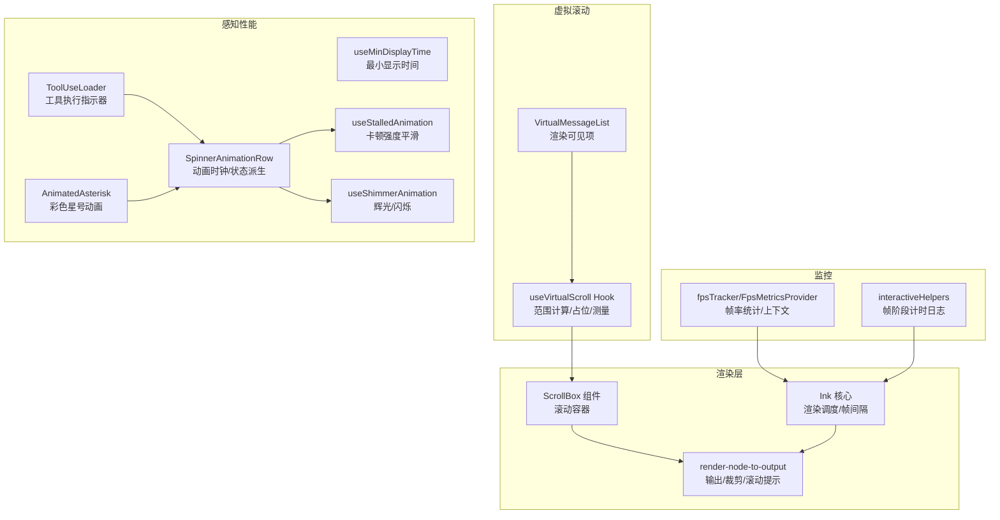
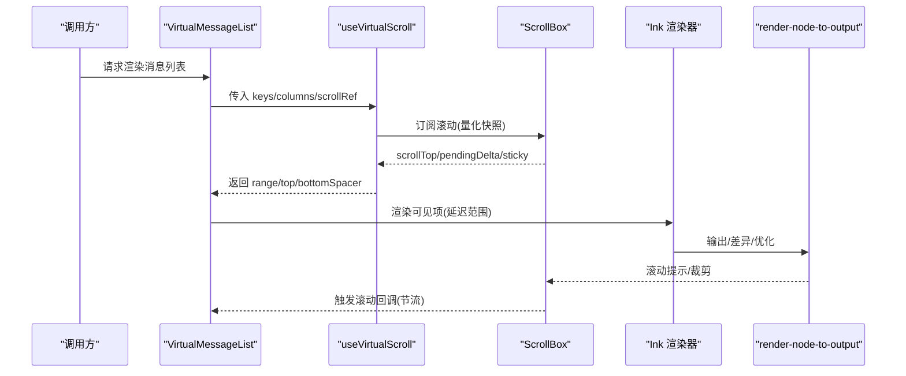
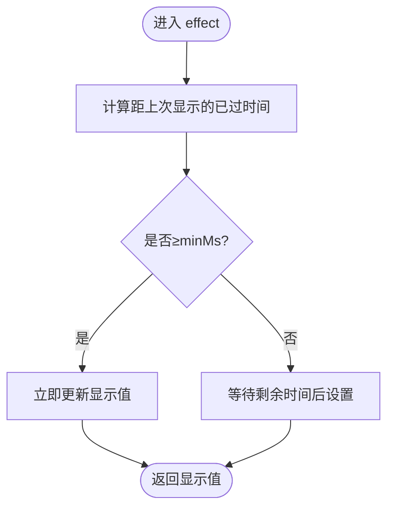
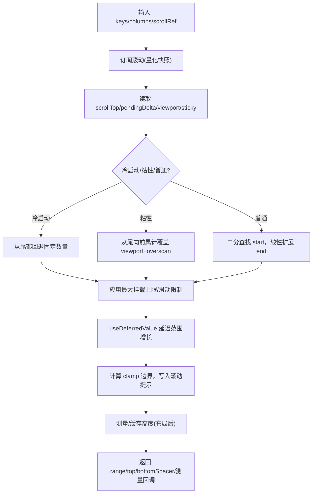
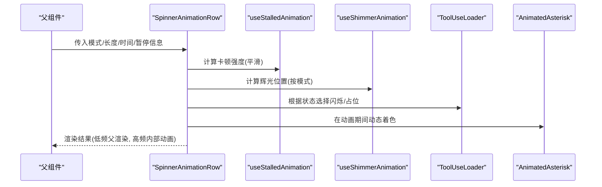
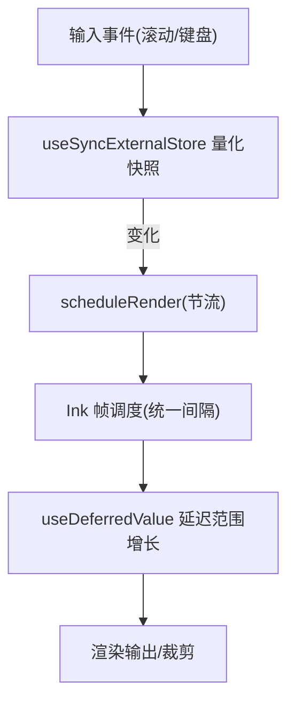
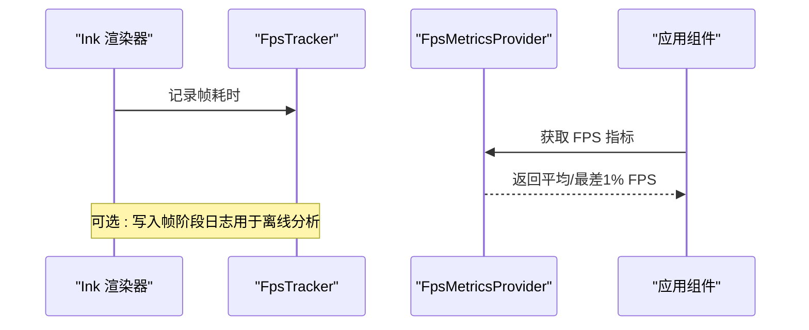
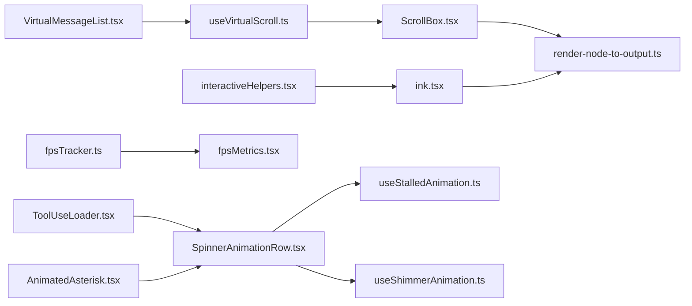

# 用户体验优化

<cite>
**本文引用的文件**
- [src/hooks/useMinDisplayTime.ts](file://src/hooks/useMinDisplayTime.ts)
- [src/hooks/useVirtualScroll.ts](file://src/hooks/useVirtualScroll.ts)
- [src/components/VirtualMessageList.tsx](file://src/components/VirtualMessageList.tsx)
- [src/ink/components/ScrollBox.tsx](file://src/ink/components/ScrollBox.tsx)
- [src/ink/render-node-to-output.ts](file://src/ink/render-node-to-output.ts)
- [src/ink/ink.tsx](file://src/ink/ink.tsx)
- [src/ink/constants.ts](file://src/ink/constants.ts)
- [src/components/Spinner/SpinnerAnimationRow.tsx](file://src/components/Spinner/SpinnerAnimationRow.tsx)
- [src/components/Spinner/useStalledAnimation.ts](file://src/components/Spinner/useStalledAnimation.ts)
- [src/components/Spinner/useShimmerAnimation.ts](file://src/components/Spinner/useShimmerAnimation.ts)
- [src/components/LogoV2/AnimatedAsterisk.tsx](file://src/components/LogoV2/AnimatedAsterisk.tsx)
- [src/components/ToolUseLoader.tsx](file://src/components/ToolUseLoader.tsx)
- [src/context/fpsMetrics.tsx](file://src/context/fpsMetrics.tsx)
- [src/utils/fpsTracker.ts](file://src/utils/fpsTracker.ts)
- [src/interactiveHelpers.tsx](file://src/interactiveHelpers.tsx)
</cite>

## 目录
1. [简介](#简介)
2. [项目结构](#项目结构)
3. [核心组件](#核心组件)
4. [架构总览](#架构总览)
5. [详细组件分析](#详细组件分析)
6. [依赖关系分析](#依赖关系分析)
7. [性能考量](#性能考量)
8. [故障排查指南](#故障排查指南)
9. [结论](#结论)
10. [附录](#附录)

## 简介
本指南聚焦 Claude Code 的用户体验优化实践，围绕“最小显示时间”“虚拟滚动”“加载动画与感知性能”“界面响应性（防抖/节流/异步渲染）”“流畅度优化（重绘/合成层/动画）”以及“用户体验监控与评估”等方面进行系统化梳理，并结合仓库中的真实实现给出可操作的建议与图示。

## 项目结构
本项目在终端交互界面中采用自研 TUI 渲染引擎（Ink），消息列表通过虚拟滚动实现高性能渲染；同时在加载态使用细粒度动画与感知性能策略，配合帧率统计与滚动优化保障整体流畅度。

**图表来源**
- [src/ink/ink.tsx:203-219](file://src/ink/ink.tsx#L203-L219)
- [src/ink/render-node-to-output.ts:1371-1399](file://src/ink/render-node-to-output.ts#L1371-L1399)
- [src/ink/components/ScrollBox.tsx:72-101](file://src/ink/components/ScrollBox.tsx#L72-L101)
- [src/hooks/useVirtualScroll.ts:142-722](file://src/hooks/useVirtualScroll.ts#L142-L722)
- [src/components/VirtualMessageList.tsx:289-400](file://src/components/VirtualMessageList.tsx#L289-L400)
- [src/hooks/useMinDisplayTime.ts:1-35](file://src/hooks/useMinDisplayTime.ts#L1-L35)
- [src/components/Spinner/SpinnerAnimationRow.tsx:66-107](file://src/components/Spinner/SpinnerAnimationRow.tsx#L66-L107)
- [src/components/Spinner/useStalledAnimation.ts:1-75](file://src/components/Spinner/useStalledAnimation.ts#L1-L75)
- [src/components/Spinner/useShimmerAnimation.ts:1-31](file://src/components/Spinner/useShimmerAnimation.ts#L1-L31)
- [src/components/ToolUseLoader.tsx:1-41](file://src/components/ToolUseLoader.tsx#L1-L41)
- [src/components/LogoV2/AnimatedAsterisk.tsx:1-49](file://src/components/LogoV2/AnimatedAsterisk.tsx#L1-L49)
- [src/context/fpsMetrics.tsx:1-30](file://src/context/fpsMetrics.tsx#L1-L30)
- [src/utils/fpsTracker.ts:1-48](file://src/utils/fpsTracker.ts#L1-L48)
- [src/interactiveHelpers.tsx:315-342](file://src/interactiveHelpers.tsx#L315-L342)

**章节来源**
- [src/ink/ink.tsx:203-219](file://src/ink/ink.tsx#L203-L219)
- [src/ink/render-node-to-output.ts:1371-1399](file://src/ink/render-node-to-output.ts#L1371-L1399)
- [src/ink/components/ScrollBox.tsx:72-101](file://src/ink/components/ScrollBox.tsx#L72-L101)
- [src/hooks/useVirtualScroll.ts:142-722](file://src/hooks/useVirtualScroll.ts#L142-L722)
- [src/components/VirtualMessageList.tsx:289-400](file://src/components/VirtualMessageList.tsx#L289-L400)

## 核心组件
- 最小显示时间：防止快速切换导致可读性差，确保每个值至少展示指定毫秒。
- 虚拟滚动：仅渲染视口内及预估外的条目，使用占位与高度缓存维持高吞吐。
- 感知性能：加载动画按需驱动、卡顿强度平滑过渡、辉光/闪烁等视觉反馈。
- 响应性：渲染节流、滚动订阅量化、滚动提示、延迟渲染与范围冻结。
- 流畅度：帧间隔统一、滚动输出裁剪、滚动提示与粘性定位、动画时钟共享。
- 监控：帧率统计、帧阶段计时日志、FPS 上下文。

**章节来源**
- [src/hooks/useMinDisplayTime.ts:1-35](file://src/hooks/useMinDisplayTime.ts#L1-L35)
- [src/hooks/useVirtualScroll.ts:142-722](file://src/hooks/useVirtualScroll.ts#L142-L722)
- [src/components/Spinner/SpinnerAnimationRow.tsx:66-107](file://src/components/Spinner/SpinnerAnimationRow.tsx#L66-L107)
- [src/components/Spinner/useStalledAnimation.ts:1-75](file://src/components/Spinner/useStalledAnimation.ts#L1-L75)
- [src/components/Spinner/useShimmerAnimation.ts:1-31](file://src/components/Spinner/useShimmerAnimation.ts#L1-L31)
- [src/context/fpsMetrics.tsx:1-30](file://src/context/fpsMetrics.tsx#L1-L30)
- [src/utils/fpsTracker.ts:1-48](file://src/utils/fpsTracker.ts#L1-L48)
- [src/interactiveHelpers.tsx:315-342](file://src/interactiveHelpers.tsx#L315-L342)

## 架构总览
渲染管线以 Ink 为核心，负责帧级调度与输出；ScrollBox 提供滚动容器与滚动 API；虚拟滚动 Hook 计算可见范围并挂载/卸载节点；Spinner 系列组件基于共享动画时钟提供感知性能反馈；FPS 组件与工具提供运行时性能观测。

**图表来源**
- [src/components/VirtualMessageList.tsx:289-400](file://src/components/VirtualMessageList.tsx#L289-L400)
- [src/hooks/useVirtualScroll.ts:220-244](file://src/hooks/useVirtualScroll.ts#L220-L244)
- [src/ink/components/ScrollBox.tsx:72-101](file://src/ink/components/ScrollBox.tsx#L72-L101)
- [src/ink/ink.tsx:203-219](file://src/ink/ink.tsx#L203-L219)
- [src/ink/render-node-to-output.ts:1371-1399](file://src/ink/render-node-to-output.ts#L1371-L1399)

## 详细组件分析

### 最小显示时间（useMinDisplayTime）
- 目标：保证每个新值至少显示 minMs，避免快速闪烁影响可读性。
- 实现要点：记录上次显示时间，若未达到阈值则延后设置；使用定时器兜底，清理及时。
- 使用场景：进度文案、状态提示等。

**图表来源**
- [src/hooks/useMinDisplayTime.ts:14-32](file://src/hooks/useMinDisplayTime.ts#L14-L32)

**章节来源**
- [src/hooks/useMinDisplayTime.ts:1-35](file://src/hooks/useMinDisplayTime.ts#L1-L35)

### 虚拟滚动（useVirtualScroll + VirtualMessageList）
- 范围计算：根据 scrollTop/pendingDelta/viewport 高度与偏移数组，二分/线性混合确定 start/end。
- 占位策略：top/bottomSpacer 保持滚动高度恒定，避免布局抖动。
- 高度缓存：首次布局后缓存 Yoga 高度，后续复用；列宽变化时按比例缩放缓存高度。
- 滚动优化：订阅滚动事件采用量化快照，减少频繁重渲染；粘性滚动时尾部优先渲染。
- 延迟渲染：对范围增长使用 useDeferredValue，先渲染旧范围，后台再过渡到新范围。
- 滚动提示与裁剪：Ink 输出层对视窗外子节点进行裁剪，避免无效绘制。

**图表来源**
- [src/hooks/useVirtualScroll.ts:142-722](file://src/hooks/useVirtualScroll.ts#L142-L722)
- [src/ink/render-node-to-output.ts:1371-1399](file://src/ink/render-node-to-output.ts#L1371-L1399)
- [src/ink/components/ScrollBox.tsx:72-101](file://src/ink/components/ScrollBox.tsx#L72-L101)

**章节来源**
- [src/hooks/useVirtualScroll.ts:142-722](file://src/hooks/useVirtualScroll.ts#L142-L722)
- [src/components/VirtualMessageList.tsx:289-400](file://src/components/VirtualMessageList.tsx#L289-L400)
- [src/ink/render-node-to-output.ts:1371-1399](file://src/ink/render-node-to-output.ts#L1371-L1399)

### 加载动画与感知性能（SpinnerAnimationRow / useStalledAnimation / useShimmerAnimation / ToolUseLoader / AnimatedAsterisk）
- 动画时钟：共享 useAnimationFrame(50ms) 驱动高频动画，降低父组件渲染频率。
- 卡顿检测：基于令牌到达时间与工具执行状态，平滑过渡到红色警示强度。
- 辉光/闪烁：根据模式与消息宽度计算辉光位置，避免不可见时仍占用时钟。
- 工具执行指示：根据错误/未解析/动画开关决定闪烁或占位。
- 彩色星号：在减少动态需求时自动降级为静态灰色。

**图表来源**
- [src/components/Spinner/SpinnerAnimationRow.tsx:66-107](file://src/components/Spinner/SpinnerAnimationRow.tsx#L66-L107)
- [src/components/Spinner/useStalledAnimation.ts:1-75](file://src/components/Spinner/useStalledAnimation.ts#L1-L75)
- [src/components/Spinner/useShimmerAnimation.ts:1-31](file://src/components/Spinner/useShimmerAnimation.ts#L1-L31)
- [src/components/ToolUseLoader.tsx:1-41](file://src/components/ToolUseLoader.tsx#L1-L41)
- [src/components/LogoV2/AnimatedAsterisk.tsx:1-49](file://src/components/LogoV2/AnimatedAsterisk.tsx#L1-L49)

**章节来源**
- [src/components/Spinner/SpinnerAnimationRow.tsx:66-107](file://src/components/Spinner/SpinnerAnimationRow.tsx#L66-L107)
- [src/components/Spinner/useStalledAnimation.ts:1-75](file://src/components/Spinner/useStalledAnimation.ts#L1-L75)
- [src/components/Spinner/useShimmerAnimation.ts:1-31](file://src/components/Spinner/useShimmerAnimation.ts#L1-L31)
- [src/components/ToolUseLoader.tsx:1-41](file://src/components/ToolUseLoader.tsx#L1-L41)
- [src/components/LogoV2/AnimatedAsterisk.tsx:1-49](file://src/components/LogoV2/AnimatedAsterisk.tsx#L1-L49)

### 响应性优化（防抖/节流/异步渲染）
- 渲染节流：Ink 使用统一帧间隔（约 60fps）进行渲染调度，避免过度提交。
- 滚动节流：useVirtualScroll 对滚动订阅采用量化快照，小幅度滚动不触发重渲染。
- 异步渲染：useDeferredValue 先渲染旧范围，后台再过渡到新范围，避免主线程阻塞。
- 滚动提示：输出层对滚动进行提示与裁剪，减少无效绘制。

**图表来源**
- [src/ink/ink.tsx:203-219](file://src/ink/ink.tsx#L203-L219)
- [src/ink/constants.ts:1-2](file://src/ink/constants.ts#L1-L2)
- [src/hooks/useVirtualScroll.ts:220-244](file://src/hooks/useVirtualScroll.ts#L220-L244)

**章节来源**
- [src/ink/ink.tsx:203-219](file://src/ink/ink.tsx#L203-L219)
- [src/ink/constants.ts:1-2](file://src/ink/constants.ts#L1-L2)
- [src/hooks/useVirtualScroll.ts:220-244](file://src/hooks/useVirtualScroll.ts#L220-L244)

### 界面流畅度优化（重绘/合成层/动画）
- 合成层与滚动：滚动由 DOM scrollTop 控制，绕过 React 状态，减少重绘路径。
- 动画时钟共享：useAnimationFrame 共享时钟，避免多处独立定时器造成卡顿。
- 布局稳定性：高度缓存与占位策略减少布局抖动；列宽变化时按比例缩放高度，避免黑屏与闪烁。
- 输出裁剪：输出层对视窗外节点进行裁剪，降低绘制成本。

**章节来源**
- [src/ink/components/ScrollBox.tsx:72-101](file://src/ink/components/ScrollBox.tsx#L72-L101)
- [src/ink/render-node-to-output.ts:1371-1399](file://src/ink/render-node-to-output.ts#L1371-L1399)
- [src/hooks/useVirtualScroll.ts:142-722](file://src/hooks/useVirtualScroll.ts#L142-L722)

### 用户体验监控与评估
- 帧率统计：FpsTracker 计算平均 FPS 与最差 1% 帧对应的 FPS，便于识别尖峰卡顿。
- FPS 上下文：FpsMetricsProvider 将指标注入组件树，便于消费。
- 帧阶段计时：interactiveHelpers 支持将每帧阶段耗时写入文件，离线分析渲染瓶颈。

**图表来源**
- [src/utils/fpsTracker.ts:1-48](file://src/utils/fpsTracker.ts#L1-L48)
- [src/context/fpsMetrics.tsx:1-30](file://src/context/fpsMetrics.tsx#L1-L30)
- [src/interactiveHelpers.tsx:315-342](file://src/interactiveHelpers.tsx#L315-L342)

**章节来源**
- [src/utils/fpsTracker.ts:1-48](file://src/utils/fpsTracker.ts#L1-L48)
- [src/context/fpsMetrics.tsx:1-30](file://src/context/fpsMetrics.tsx#L1-L30)
- [src/interactiveHelpers.tsx:315-342](file://src/interactiveHelpers.tsx#L315-L342)

## 依赖关系分析

**图表来源**
- [src/components/VirtualMessageList.tsx:289-400](file://src/components/VirtualMessageList.tsx#L289-L400)
- [src/hooks/useVirtualScroll.ts:142-722](file://src/hooks/useVirtualScroll.ts#L142-L722)
- [src/ink/components/ScrollBox.tsx:72-101](file://src/ink/components/ScrollBox.tsx#L72-L101)
- [src/ink/render-node-to-output.ts:1371-1399](file://src/ink/render-node-to-output.ts#L1371-L1399)
- [src/ink/ink.tsx:203-219](file://src/ink/ink.tsx#L203-L219)
- [src/components/Spinner/SpinnerAnimationRow.tsx:66-107](file://src/components/Spinner/SpinnerAnimationRow.tsx#L66-L107)
- [src/components/Spinner/useStalledAnimation.ts:1-75](file://src/components/Spinner/useStalledAnimation.ts#L1-L75)
- [src/components/Spinner/useShimmerAnimation.ts:1-31](file://src/components/Spinner/useShimmerAnimation.ts#L1-L31)
- [src/components/ToolUseLoader.tsx:1-41](file://src/components/ToolUseLoader.tsx#L1-L41)
- [src/components/LogoV2/AnimatedAsterisk.tsx:1-49](file://src/components/LogoV2/AnimatedAsterisk.tsx#L1-L49)
- [src/utils/fpsTracker.ts:1-48](file://src/utils/fpsTracker.ts#L1-L48)
- [src/context/fpsMetrics.tsx:1-30](file://src/context/fpsMetrics.tsx#L1-L30)
- [src/interactiveHelpers.tsx:315-342](file://src/interactiveHelpers.tsx#L315-L342)

**章节来源**
- [src/components/VirtualMessageList.tsx:289-400](file://src/components/VirtualMessageList.tsx#L289-L400)
- [src/hooks/useVirtualScroll.ts:142-722](file://src/hooks/useVirtualScroll.ts#L142-L722)
- [src/ink/ink.tsx:203-219](file://src/ink/ink.tsx#L203-L219)

## 性能考量
- 虚拟滚动参数权衡：估算高度偏低更安全，overscan 宽裕以吸收误差；最大挂载数与滑动步长限制避免单次渲染大开销。
- 渲染节流与帧间隔：统一 60fps 节拍，滚动订阅量化，滚动提示裁剪，减少无效工作。
- 动画与感知性能：高频动画共享时钟，卡顿强度平滑过渡，减少闪烁与突变。
- 列宽变化：按比例缩放高度缓存，避免重新测量引发的黑屏与抖动。
- 延迟渲染：useDeferredValue 使主线程优先保持滚动/输入响应，后台再完成昂贵的首次渲染。

[本节为通用指导，无需特定文件引用]

## 故障排查指南
- 滚动卡顿/空白：检查是否启用粘性滚动与 clamp 边界；确认滚动提示与裁剪逻辑生效。
- 首次渲染卡顿：关注列宽变化后的高度缓存缩放与冻结渲染周期；确认延迟渲染未被粘性滚动绕过。
- 卡顿强度异常：核对令牌到达时间与工具执行状态；确认平滑过渡参数与时钟同步。
- FPS 波动：通过帧阶段日志定位瓶颈阶段；结合 FPS 指标判断是否为渲染/输出/差异阶段问题。

**章节来源**
- [src/hooks/useVirtualScroll.ts:554-597](file://src/hooks/useVirtualScroll.ts#L554-L597)
- [src/ink/render-node-to-output.ts:1371-1399](file://src/ink/render-node-to-output.ts#L1371-L1399)
- [src/components/Spinner/useStalledAnimation.ts:1-75](file://src/components/Spinner/useStalledAnimation.ts#L1-L75)
- [src/interactiveHelpers.tsx:315-342](file://src/interactiveHelpers.tsx#L315-L342)

## 结论
通过“最小显示时间”“虚拟滚动”“感知性能动画”“渲染节流/延迟渲染/滚动提示”“帧率监控”等组合拳，Claude Code 在终端 TUI 场景下实现了高吞吐、低抖动、强感知的用户体验。建议在新功能开发中延续这些策略：优先虚拟化、共享动画时钟、量化滚动订阅、延迟非关键渲染，并持续以 FPS 与帧阶段日志进行评估与回归。

[本节为总结，无需特定文件引用]

## 附录
- 关键实现路径参考（不含代码内容，仅路径与行号）：
  - 最小显示时间：[src/hooks/useMinDisplayTime.ts:1-35](file://src/hooks/useMinDisplayTime.ts#L1-L35)
  - 虚拟滚动主流程：[src/hooks/useVirtualScroll.ts:142-722](file://src/hooks/useVirtualScroll.ts#L142-L722)
  - 消息列表集成：[src/components/VirtualMessageList.tsx:289-400](file://src/components/VirtualMessageList.tsx#L289-L400)
  - 滚动容器与订阅：[src/ink/components/ScrollBox.tsx:72-101](file://src/ink/components/ScrollBox.tsx#L72-L101)
  - 输出裁剪与滚动提示：[src/ink/render-node-to-output.ts:1371-1399](file://src/ink/render-node-to-output.ts#L1371-L1399)
  - 渲染节流与帧间隔：[src/ink/ink.tsx:203-219](file://src/ink/ink.tsx#L203-L219), [src/ink/constants.ts:1-2](file://src/ink/constants.ts#L1-L2)
  - 加载动画与卡顿强度：[src/components/Spinner/SpinnerAnimationRow.tsx:66-107](file://src/components/Spinner/SpinnerAnimationRow.tsx#L66-L107), [src/components/Spinner/useStalledAnimation.ts:1-75](file://src/components/Spinner/useStalledAnimation.ts#L1-L75), [src/components/Spinner/useShimmerAnimation.ts:1-31](file://src/components/Spinner/useShimmerAnimation.ts#L1-L31)
  - 工具执行指示器：[src/components/ToolUseLoader.tsx:1-41](file://src/components/ToolUseLoader.tsx#L1-L41)
  - 彩色星号动画：[src/components/LogoV2/AnimatedAsterisk.tsx:1-49](file://src/components/LogoV2/AnimatedAsterisk.tsx#L1-L49)
  - 帧率统计与上下文：[src/utils/fpsTracker.ts:1-48](file://src/utils/fpsTracker.ts#L1-L48), [src/context/fpsMetrics.tsx:1-30](file://src/context/fpsMetrics.tsx#L1-L30)
  - 帧阶段日志：[src/interactiveHelpers.tsx:315-342](file://src/interactiveHelpers.tsx#L315-L342)

[本节为补充索引，无需特定文件引用]