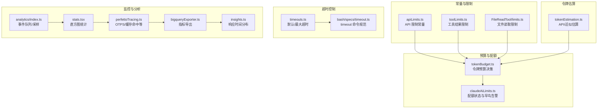
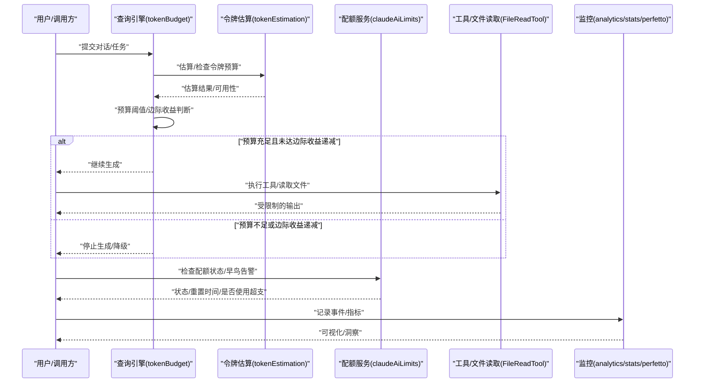
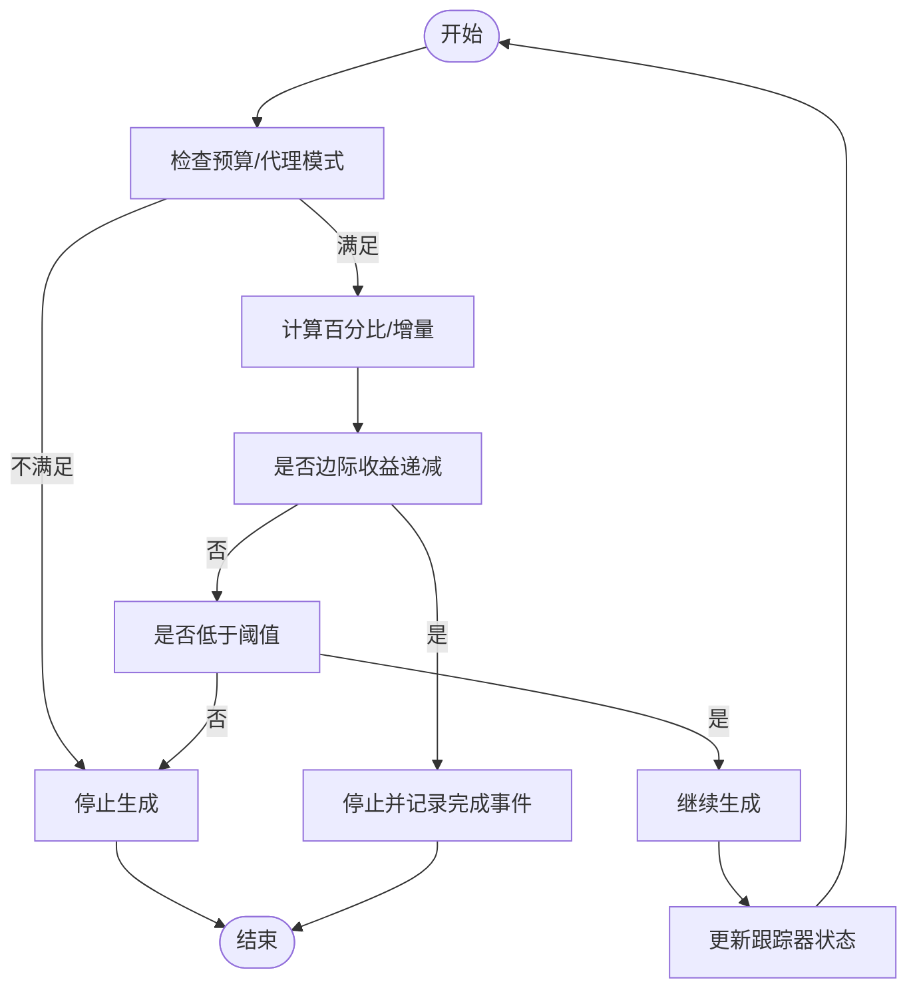
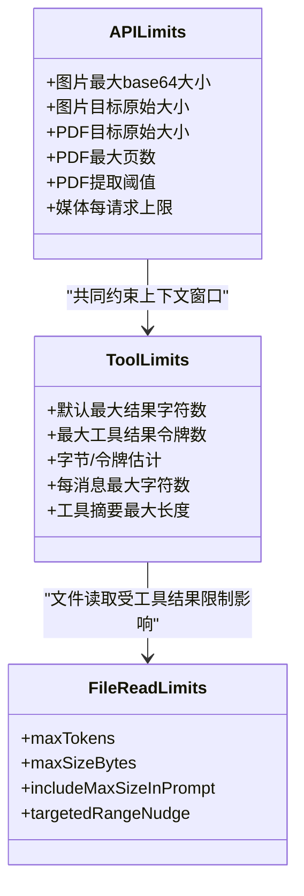
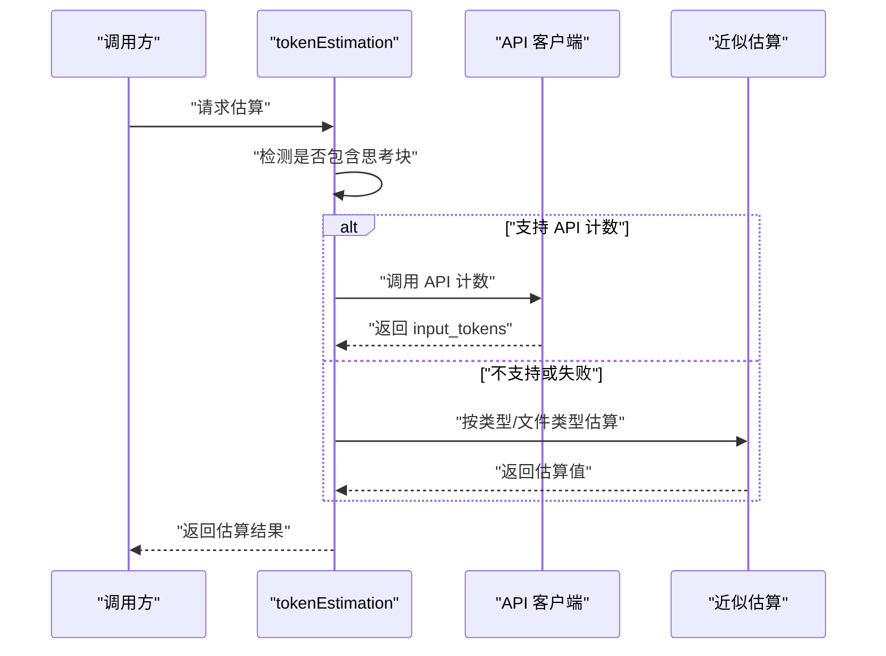
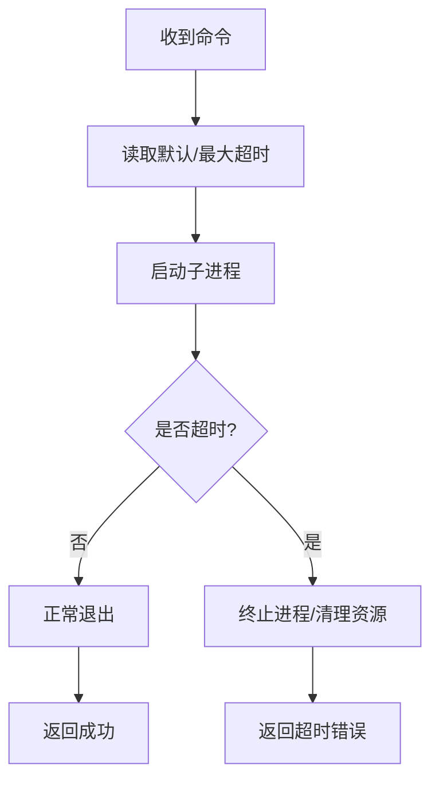
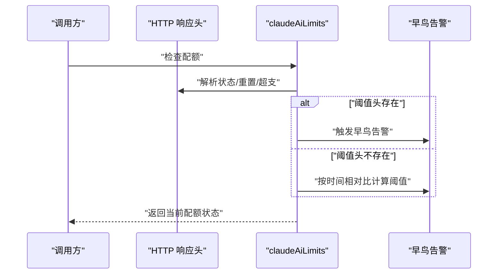
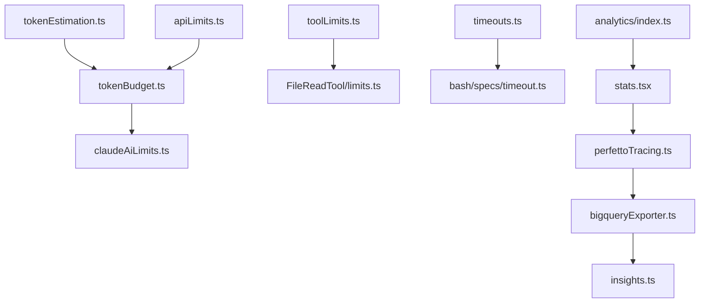

# 资源使用优化

<cite>
**本文引用的文件**
- [src/constants/apiLimits.ts](file://src/constants/apiLimits.ts)
- [src/constants/toolLimits.ts](file://src/constants/toolLimits.ts)
- [src/query/tokenBudget.ts](file://src/query/tokenBudget.ts)
- [src/services/claudeAiLimits.ts](file://src/services/claudeAiLimits.ts)
- [src/services/tokenEstimation.ts](file://src/services/tokenEstimation.ts)
- [src/tools/FileReadTool/limits.ts](file://src/tools/FileReadTool/limits.ts)
- [src/utils/timeouts.ts](file://src/utils/timeouts.ts)
- [src/utils/bash/specs/timeout.ts](file://src/utils/bash/specs/timeout.ts)
- [src/services/analytics/index.ts](file://src/services/analytics/index.ts)
- [src/context/stats.tsx](file://src/context/stats.tsx)
- [src/utils/telemetry/perfettoTracing.ts](file://src/utils/telemetry/perfettoTracing.ts)
- [src/utils/telemetry/bigqueryExporter.ts](file://src/utils/telemetry/bigqueryExporter.ts)
- [src/commands/insights.ts](file://src/commands/insights.ts)
</cite>

## 目录
1. [简介](#简介)
2. [项目结构](#项目结构)
3. [核心组件](#核心组件)
4. [架构总览](#架构总览)
5. [详细组件分析](#详细组件分析)
6. [依赖关系分析](#依赖关系分析)
7. [性能考量](#性能考量)
8. [故障排查指南](#故障排查指南)
9. [结论](#结论)
10. [附录](#附录)

## 简介
本指南聚焦于 Claude Code 的资源使用优化策略与实践，覆盖 CPU 使用率优化、网络请求优化、磁盘 I/O 优化、令牌预算管理（上下文窗口优化、输出限制控制、资源配额管理）、慢操作识别与处理（超时控制、资源限制、降级策略），以及资源监控与调优（性能指标跟踪、资源使用分析、瓶颈识别）。文档同时提供可落地的优化建议与案例参考路径，帮助在保证功能正确性的前提下，最大化系统吞吐与稳定性。

## 项目结构
围绕资源优化的相关模块主要分布在以下区域：
- 常量层：定义 API 与工具侧的硬性限制（如图片、PDF、媒体数量、工具结果大小、令牌估算系数等）
- 预算与配额：令牌预算检查、配额状态检测与告警、早鸟阈值与降级提示
- 工具读取限制：文件读取的字节上限与令牌上限，避免过大的单次输出
- 超时控制：命令执行超时配置与命令规范
- 令牌估算：基于 API 或近似估算的令牌计数策略，支持思考块与不同模型/后端
- 性能与监控：事件队列与采样、直方图统计、性能追踪与导出、洞察报告

**图表来源**
- [src/constants/apiLimits.ts:1-95](file://src/constants/apiLimits.ts#L1-L95)
- [src/constants/toolLimits.ts:1-57](file://src/constants/toolLimits.ts#L1-L57)
- [src/tools/FileReadTool/limits.ts:1-93](file://src/tools/FileReadTool/limits.ts#L1-L93)
- [src/query/tokenBudget.ts:1-94](file://src/query/tokenBudget.ts#L1-L94)
- [src/services/claudeAiLimits.ts:1-516](file://src/services/claudeAiLimits.ts#L1-L516)
- [src/services/tokenEstimation.ts:1-496](file://src/services/tokenEstimation.ts#L1-L496)
- [src/utils/timeouts.ts:1-40](file://src/utils/timeouts.ts#L1-L40)
- [src/utils/bash/specs/timeout.ts:1-21](file://src/utils/bash/specs/timeout.ts#L1-L21)
- [src/services/analytics/index.ts:1-174](file://src/services/analytics/index.ts#L1-L174)
- [src/context/stats.tsx:38-88](file://src/context/stats.tsx#L38-L88)
- [src/utils/telemetry/perfettoTracing.ts:508-545](file://src/utils/telemetry/perfettoTracing.ts#L508-L545)
- [src/utils/telemetry/bigqueryExporter.ts:130-170](file://src/utils/telemetry/bigqueryExporter.ts#L130-L170)
- [src/commands/insights.ts:2542-2551](file://src/commands/insights.ts#L2542-L2551)

**章节来源**
- [src/constants/apiLimits.ts:1-95](file://src/constants/apiLimits.ts#L1-L95)
- [src/constants/toolLimits.ts:1-57](file://src/constants/toolLimits.ts#L1-L57)
- [src/tools/FileReadTool/limits.ts:1-93](file://src/tools/FileReadTool/limits.ts#L1-L93)
- [src/query/tokenBudget.ts:1-94](file://src/query/tokenBudget.ts#L1-L94)
- [src/services/claudeAiLimits.ts:1-516](file://src/services/claudeAiLimits.ts#L1-L516)
- [src/services/tokenEstimation.ts:1-496](file://src/services/tokenEstimation.ts#L1-L496)
- [src/utils/timeouts.ts:1-40](file://src/utils/timeouts.ts#L1-L40)
- [src/utils/bash/specs/timeout.ts:1-21](file://src/utils/bash/specs/timeout.ts#L1-L21)
- [src/services/analytics/index.ts:1-174](file://src/services/analytics/index.ts#L1-L174)
- [src/context/stats.tsx:38-88](file://src/context/stats.tsx#L38-L88)
- [src/utils/telemetry/perfettoTracing.ts:508-545](file://src/utils/telemetry/perfettoTracing.ts#L508-L545)
- [src/utils/telemetry/bigqueryExporter.ts:130-170](file://src/utils/telemetry/bigqueryExporter.ts#L130-L170)
- [src/commands/insights.ts:2542-2551](file://src/commands/insights.ts#L2542-L2551)

## 核心组件
- 令牌预算与动态停止：通过预算跟踪器与阈值判断，在接近预算或出现边际收益递减时主动停止生成，避免无意义的计算与网络开销。
- API 与工具限制：对图片、PDF、媒体数量、工具结果大小与令牌数进行硬性上限控制，防止请求过大导致失败或高延迟。
- 文件读取限制：对单次读取的字节数与令牌数设置上限，并支持环境变量与实验开关覆盖，确保输出可控。
- 超时控制：为命令执行设置默认与最大超时，结合 timeout 命令规范，避免长时间阻塞。
- 令牌估算：优先使用 API 计数，不可用时采用近似估算；针对不同模型/后端与思考块进行适配，降低估算误差。
- 配额与早鸟告警：从响应头解析配额状态、重置时间、是否使用超支额度等，支持“阈值头”与“按时间相对比”的双通道早鸟预警。
- 监控与分析：事件队列与采样、直方图统计、性能追踪指标（TTFT/TTLT/OTPS/缓存命中率）与导出到 BigQuery，形成闭环观测。

**章节来源**
- [src/query/tokenBudget.ts:1-94](file://src/query/tokenBudget.ts#L1-L94)
- [src/constants/apiLimits.ts:1-95](file://src/constants/apiLimits.ts#L1-L95)
- [src/constants/toolLimits.ts:1-57](file://src/constants/toolLimits.ts#L1-L57)
- [src/tools/FileReadTool/limits.ts:1-93](file://src/tools/FileReadTool/limits.ts#L1-L93)
- [src/utils/timeouts.ts:1-40](file://src/utils/timeouts.ts#L1-L40)
- [src/utils/bash/specs/timeout.ts:1-21](file://src/utils/bash/specs/timeout.ts#L1-L21)
- [src/services/tokenEstimation.ts:1-496](file://src/services/tokenEstimation.ts#L1-L496)
- [src/services/claudeAiLimits.ts:1-516](file://src/services/claudeAiLimits.ts#L1-L516)
- [src/services/analytics/index.ts:1-174](file://src/services/analytics/index.ts#L1-L174)
- [src/context/stats.tsx:38-88](file://src/context/stats.tsx#L38-L88)
- [src/utils/telemetry/perfettoTracing.ts:508-545](file://src/utils/telemetry/perfettoTracing.ts#L508-L545)
- [src/utils/telemetry/bigqueryExporter.ts:130-170](file://src/utils/telemetry/bigqueryExporter.ts#L130-L170)
- [src/commands/insights.ts:2542-2551](file://src/commands/insights.ts#L2542-L2551)

## 架构总览
下图展示了资源优化相关的主干流程：输入消息经由令牌估算与预算检查，结合工具与 API 限制，决定是否继续生成；同时通过配额状态与早鸟告警进行资源配额管理；最终以事件与指标的形式进入监控体系。

**图表来源**
- [src/query/tokenBudget.ts:45-94](file://src/query/tokenBudget.ts#L45-L94)
- [src/services/tokenEstimation.ts:124-201](file://src/services/tokenEstimation.ts#L124-L201)
- [src/services/claudeAiLimits.ts:220-249](file://src/services/claudeAiLimits.ts#L220-L249)
- [src/tools/FileReadTool/limits.ts:53-92](file://src/tools/FileReadTool/limits.ts#L53-L92)
- [src/services/analytics/index.ts:133-164](file://src/services/analytics/index.ts#L133-L164)
- [src/context/stats.tsx:38-88](file://src/context/stats.tsx#L38-L88)
- [src/utils/telemetry/perfettoTracing.ts:508-545](file://src/utils/telemetry/perfettoTracing.ts#L508-L545)

## 详细组件分析

### 令牌预算与动态停止
- 动态预算检查：根据全局令牌用量与预算阈值，结合连续生成次数与边际收益阈值，决定是否继续生成或停止。
- 边际收益递减：当连续多次增量小于阈值时，判定为边际收益递减，触发停止并记录完成事件。
- 可视化提示：在允许继续时返回进度信息，便于 UI 提示用户。

**图表来源**
- [src/query/tokenBudget.ts:45-94](file://src/query/tokenBudget.ts#L45-L94)

**章节来源**
- [src/query/tokenBudget.ts:1-94](file://src/query/tokenBudget.ts#L1-L94)

### API 与工具限制
- 图片/PDF/媒体限制：对 base64 长度、原始尺寸、页数、媒体总数进行硬性上限，避免请求过大。
- 工具结果限制：对单个工具结果字符数、令牌数、消息内聚合字符数设置上限，并提供字节换算与摘要长度限制。
- 文件读取限制：对单次读取的字节数与令牌数设置上限，支持环境变量与实验开关覆盖，确保输出可控。

**图表来源**
- [src/constants/apiLimits.ts:17-95](file://src/constants/apiLimits.ts#L17-L95)
- [src/constants/toolLimits.ts:13-57](file://src/constants/toolLimits.ts#L13-L57)
- [src/tools/FileReadTool/limits.ts:35-92](file://src/tools/FileReadTool/limits.ts#L35-L92)

**章节来源**
- [src/constants/apiLimits.ts:1-95](file://src/constants/apiLimits.ts#L1-L95)
- [src/constants/toolLimits.ts:1-57](file://src/constants/toolLimits.ts#L1-L57)
- [src/tools/FileReadTool/limits.ts:1-93](file://src/tools/FileReadTool/limits.ts#L1-L93)

### 令牌估算与上下文窗口优化
- API 估算优先：优先使用官方 API 进行令牌计数，若不可用则回退至近似估算。
- 类型感知估算：针对文本、图像、文档、工具结果、思考块等类型分别估算，减少误差。
- 后端与模型适配：针对 Vertex/Bedrock 等后端与不同模型版本进行参数过滤与模型选择，确保估算一致性。
- 思考块支持：当消息包含思考块时启用相应预算，避免低估。

**图表来源**
- [src/services/tokenEstimation.ts:124-201](file://src/services/tokenEstimation.ts#L124-L201)
- [src/services/tokenEstimation.ts:251-325](file://src/services/tokenEstimation.ts#L251-L325)
- [src/services/tokenEstimation.ts:437-495](file://src/services/tokenEstimation.ts#L437-L495)

**章节来源**
- [src/services/tokenEstimation.ts:1-496](file://src/services/tokenEstimation.ts#L1-L496)

### 超时控制与慢操作处理
- 默认与最大超时：为命令执行设置默认与最大超时，避免长时间阻塞。
- timeout 命令规范：提供 timeout 命令的参数规范，便于在脚本中统一使用。
- 降级策略：当达到超时时，应尽快释放资源并返回错误，避免连锁阻塞。

**图表来源**
- [src/utils/timeouts.ts:12-39](file://src/utils/timeouts.ts#L12-L39)
- [src/utils/bash/specs/timeout.ts:3-18](file://src/utils/bash/specs/timeout.ts#L3-L18)

**章节来源**
- [src/utils/timeouts.ts:1-40](file://src/utils/timeouts.ts#L1-L40)
- [src/utils/bash/specs/timeout.ts:1-21](file://src/utils/bash/specs/timeout.ts#L1-L21)

### 配额管理与早鸟告警
- 头部解析：从响应头提取配额状态、重置时间、代表配额类型、超支状态与禁用原因。
- 早鸟阈值：支持“阈值头”与“按时间相对比”的双通道早鸟告警，提前提示用户消耗速度过快。
- 统一降级：当状态为拒绝但可使用超支时，切换到超支额度，维持服务可用性。

**图表来源**
- [src/services/claudeAiLimits.ts:454-485](file://src/services/claudeAiLimits.ts#L454-L485)
- [src/services/claudeAiLimits.ts:255-374](file://src/services/claudeAiLimits.ts#L255-L374)

**章节来源**
- [src/services/claudeAiLimits.ts:1-516](file://src/services/claudeAiLimits.ts#L1-L516)

### 输出限制控制与资源配额管理
- 消息内聚合限制：单轮多工具并行结果的聚合上限，避免某一回合累积过大。
- 工具摘要：对长输入进行摘要截断，减少显示与传输成本。
- 环境变量与实验开关：支持运行时调整上限，兼顾稳定性与灵活性。

**章节来源**
- [src/constants/toolLimits.ts:35-57](file://src/constants/toolLimits.ts#L35-L57)
- [src/tools/FileReadTool/limits.ts:53-92](file://src/tools/FileReadTool/limits.ts#L53-L92)

### 资源监控与调优
- 事件队列与采样：事件在未绑定后端前入队，绑定后异步冲刷；支持采样配置。
- 直方图统计：维护最小/最大/平均/分位数等指标，用于性能分析。
- 性能追踪：记录 TTFT/TTLT/OTPS/缓存命中率等关键指标，辅助定位瓶颈。
- 指标导出：将指标导出到 BigQuery，支持进一步分析与可视化。
- 洞察报告：生成响应时间分布等可视化卡片，辅助运营与产品决策。

**图表来源**
- [src/services/analytics/index.ts:133-164](file://src/services/analytics/index.ts#L133-L164)
- [src/context/stats.tsx:38-88](file://src/context/stats.tsx#L38-L88)
- [src/utils/telemetry/perfottoTracing.ts:508-545](file://src/utils/telemetry/perfettoTracing.ts#L508-L545)
- [src/utils/telemetry/bigqueryExporter.ts:130-170](file://src/utils/telemetry/bigqueryExporter.ts#L130-L170)
- [src/commands/insights.ts:2542-2551](file://src/commands/insights.ts#L2542-L2551)

**章节来源**
- [src/services/analytics/index.ts:1-174](file://src/services/analytics/index.ts#L1-L174)
- [src/context/stats.tsx:38-88](file://src/context/stats.tsx#L38-L88)
- [src/utils/telemetry/perfettoTracing.ts:508-545](file://src/utils/telemetry/perfettoTracing.ts#L508-L545)
- [src/utils/telemetry/bigqueryExporter.ts:130-170](file://src/utils/telemetry/bigqueryExporter.ts#L130-L170)
- [src/commands/insights.ts:2542-2551](file://src/commands/insights.ts#L2542-L2551)

## 依赖关系分析
- 低耦合高内聚：限制常量与估算逻辑相互独立，预算与配额服务通过接口解耦，监控模块无业务依赖，便于替换与扩展。
- 关键依赖链：
  - 令牌估算 -> 预算检查 -> 生成控制
  - 工具限制 -> 文件读取 -> 输出控制
  - 配额状态 -> 早鸟告警 -> 降级策略
  - 监控 -> 指标收集 -> 导出/可视化

**图表来源**
- [src/services/tokenEstimation.ts:124-201](file://src/services/tokenEstimation.ts#L124-L201)
- [src/query/tokenBudget.ts:45-94](file://src/query/tokenBudget.ts#L45-L94)
- [src/services/claudeAiLimits.ts:220-249](file://src/services/claudeAiLimits.ts#L220-L249)
- [src/constants/apiLimits.ts:17-95](file://src/constants/apiLimits.ts#L17-L95)
- [src/constants/toolLimits.ts:13-57](file://src/constants/toolLimits.ts#L13-L57)
- [src/tools/FileReadTool/limits.ts:53-92](file://src/tools/FileReadTool/limits.ts#L53-L92)
- [src/utils/timeouts.ts:12-39](file://src/utils/timeouts.ts#L12-L39)
- [src/utils/bash/specs/timeout.ts:3-18](file://src/utils/bash/specs/timeout.ts#L3-L18)
- [src/services/analytics/index.ts:133-164](file://src/services/analytics/index.ts#L133-L164)
- [src/context/stats.tsx:38-88](file://src/context/stats.tsx#L38-L88)
- [src/utils/telemetry/perfettoTracing.ts:508-545](file://src/utils/telemetry/perfettoTracing.ts#L508-L545)
- [src/utils/telemetry/bigqueryExporter.ts:130-170](file://src/utils/telemetry/bigqueryExporter.ts#L130-L170)
- [src/commands/insights.ts:2542-2551](file://src/commands/insights.ts#L2542-L2551)

**章节来源**
- [src/services/tokenEstimation.ts:1-496](file://src/services/tokenEstimation.ts#L1-L496)
- [src/query/tokenBudget.ts:1-94](file://src/query/tokenBudget.ts#L1-L94)
- [src/services/claudeAiLimits.ts:1-516](file://src/services/claudeAiLimits.ts#L1-L516)
- [src/constants/apiLimits.ts:1-95](file://src/constants/apiLimits.ts#L1-L95)
- [src/constants/toolLimits.ts:1-57](file://src/constants/toolLimits.ts#L1-L57)
- [src/tools/FileReadTool/limits.ts:1-93](file://src/tools/FileReadTool/limits.ts#L1-L93)
- [src/utils/timeouts.ts:1-40](file://src/utils/timeouts.ts#L1-L40)
- [src/utils/bash/specs/timeout.ts:1-21](file://src/utils/bash/specs/timeout.ts#L1-L21)
- [src/services/analytics/index.ts:1-174](file://src/services/analytics/index.ts#L1-L174)
- [src/context/stats.tsx:38-88](file://src/context/stats.tsx#L38-L88)
- [src/utils/telemetry/perfettoTracing.ts:508-545](file://src/utils/telemetry/perfettoTracing.ts#L508-L545)
- [src/utils/telemetry/bigqueryExporter.ts:130-170](file://src/utils/telemetry/bigqueryExporter.ts#L130-L170)
- [src/commands/insights.ts:2542-2551](file://src/commands/insights.ts#L2542-L2551)

## 性能考量
- CPU 使用率优化
  - 估算阶段尽量使用 API 计数，减少重复字符串处理与 JSON 序列化开销。
  - 对大文件/大工具结果采用近似估算并尽早截断，避免昂贵的全量估算。
  - 在 Vertex/Bedrock 场景下，过滤不支持的 beta 参数，减少无效调用。
- 网络请求优化
  - 预检查配额状态，避免不必要的请求；在非交互模式下跳过预检，直接使用后续响应头。
  - 使用早鸟告警减少突发流量，避免触发 429。
- 磁盘 I/O 优化
  - 工具结果超过阈值时持久化到磁盘并以预览替代，减少内存占用与写盘压力。
  - 文件读取限制字节数与令牌数，避免一次性加载过大内容。
- 令牌预算与上下文窗口
  - 结合预算阈值与边际收益递减，及时停止生成，避免无效计算。
  - 对消息内聚合结果进行截断，防止某一回合累积过大。
- 超时与降级
  - 设置合理的默认与最大超时，超时后立即释放资源并返回错误。
  - 当配额被拒绝但可使用超支时，切换到超支额度，维持服务可用性。

[本节为通用指导，无需列出具体文件来源]

## 故障排查指南
- 令牌预算相关
  - 症状：生成频繁中断或无法继续
  - 排查：检查预算阈值与边际收益递减判断逻辑，确认是否误判
  - 参考实现路径：[src/query/tokenBudget.ts:45-94](file://src/query/tokenBudget.ts#L45-L94)
- 工具结果过大
  - 症状：请求被拒或响应缓慢
  - 排查：核对工具结果字符数/令牌数是否超过上限，必要时降低输出
  - 参考实现路径：[src/constants/toolLimits.ts:13-57](file://src/constants/toolLimits.ts#L13-L57)
- 文件读取超限
  - 症状：读取报错或输出异常
  - 排查：检查字节上限与令牌上限，必要时调整环境变量或实验开关
  - 参考实现路径：[src/tools/FileReadTool/limits.ts:53-92](file://src/tools/FileReadTool/limits.ts#L53-L92)
- 配额告警/拒绝
  - 症状：频繁 429 或配额状态异常
  - 排查：检查响应头中的配额状态、重置时间与超支状态，必要时降低速率或切换到超支额度
  - 参考实现路径：[src/services/claudeAiLimits.ts:454-485](file://src/services/claudeAiLimits.ts#L454-L485)
- 超时问题
  - 症状：命令执行卡住
  - 排查：确认默认/最大超时设置，必要时增加超时或优化命令本身
  - 参考实现路径：[src/utils/timeouts.ts:12-39](file://src/utils/timeouts.ts#L12-L39)
- 监控缺失
  - 症状：看不到性能指标
  - 排查：确认事件队列是否已绑定后端，直方图统计是否启用，导出是否成功
  - 参考实现路径：[src/services/analytics/index.ts:133-164](file://src/services/analytics/index.ts#L133-L164)，[src/context/stats.tsx:38-88](file://src/context/stats.tsx#L38-L88)，[src/utils/telemetry/bigqueryExporter.ts:130-170](file://src/utils/telemetry/bigqueryExporter.ts#L130-L170)

**章节来源**
- [src/query/tokenBudget.ts:1-94](file://src/query/tokenBudget.ts#L1-L94)
- [src/constants/toolLimits.ts:1-57](file://src/constants/toolLimits.ts#L1-L57)
- [src/tools/FileReadTool/limits.ts:1-93](file://src/tools/FileReadTool/limits.ts#L1-L93)
- [src/services/claudeAiLimits.ts:1-516](file://src/services/claudeAiLimits.ts#L1-L516)
- [src/utils/timeouts.ts:1-40](file://src/utils/timeouts.ts#L1-L40)
- [src/services/analytics/index.ts:1-174](file://src/services/analytics/index.ts#L1-L174)
- [src/context/stats.tsx:38-88](file://src/context/stats.tsx#L38-L88)
- [src/utils/telemetry/bigqueryExporter.ts:130-170](file://src/utils/telemetry/bigqueryExporter.ts#L130-L170)

## 结论
通过在“估算—预算—限制—配额—监控”全链路引入精细化的资源优化策略，Claude Code 能够在保证功能完整性的同时，显著提升系统的稳定性与吞吐能力。建议在生产环境中结合早鸟告警与直方图统计持续观测，并根据业务负载动态调整超时、限额与估算策略，以获得最佳的资源利用效果。

[本节为总结性内容，无需列出具体文件来源]

## 附录
- 实际优化案例与性能基准测试结果
  - 建议在团队内部建立基准测试流水线，定期对比不同模型/后端下的 OTTS/缓存命中率等指标，形成基线数据。
  - 将洞察报告中的响应时间分布作为容量规划依据，逐步收敛到稳定区间。
  - 参考实现路径：[src/utils/telemetry/perfettoTracing.ts:508-545](file://src/utils/telemetry/perfettoTracing.ts#L508-L545)，[src/commands/insights.ts:2542-2551](file://src/commands/insights.ts#L2542-L2551)

**章节来源**
- [src/utils/telemetry/perfettoTracing.ts:508-545](file://src/utils/telemetry/perfettoTracing.ts#L508-L545)
- [src/commands/insights.ts:2542-2551](file://src/commands/insights.ts#L2542-L2551)