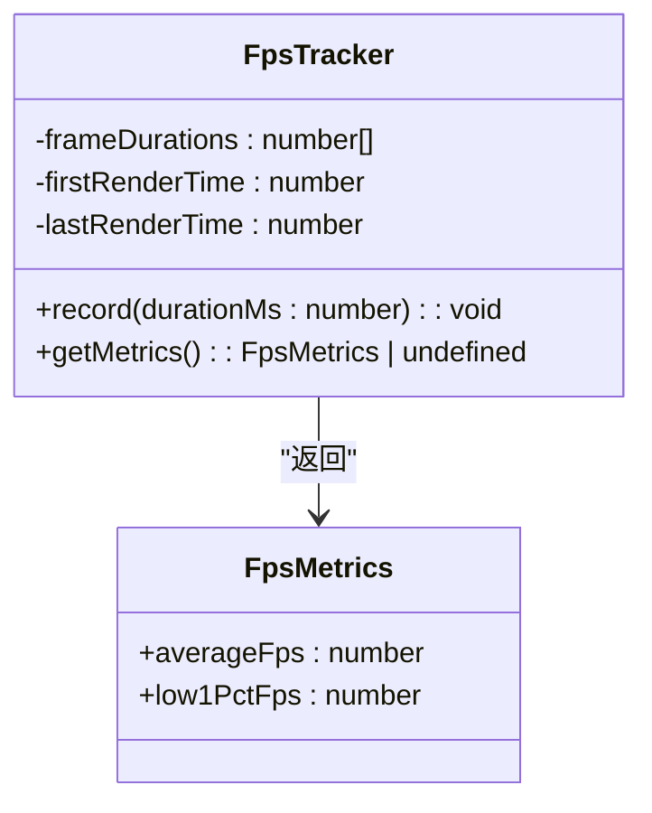
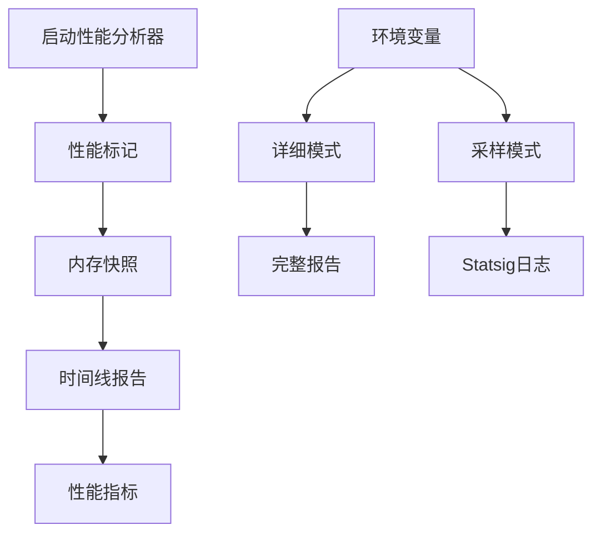
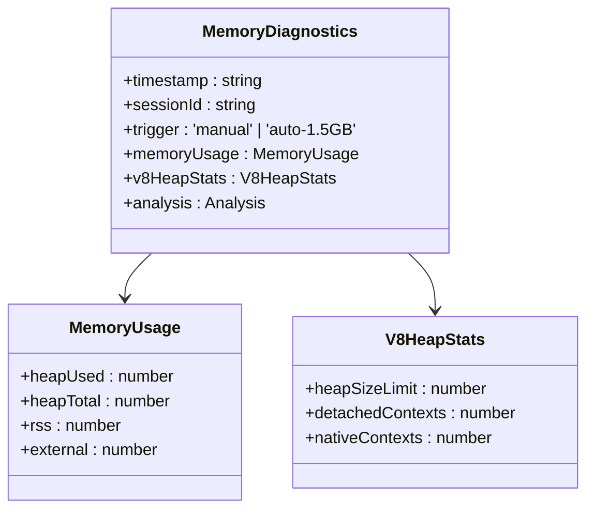
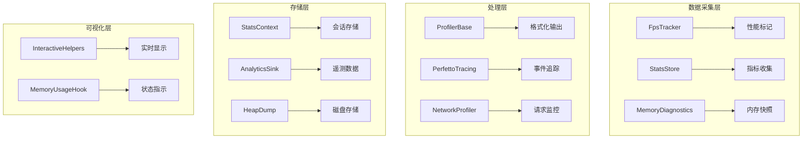
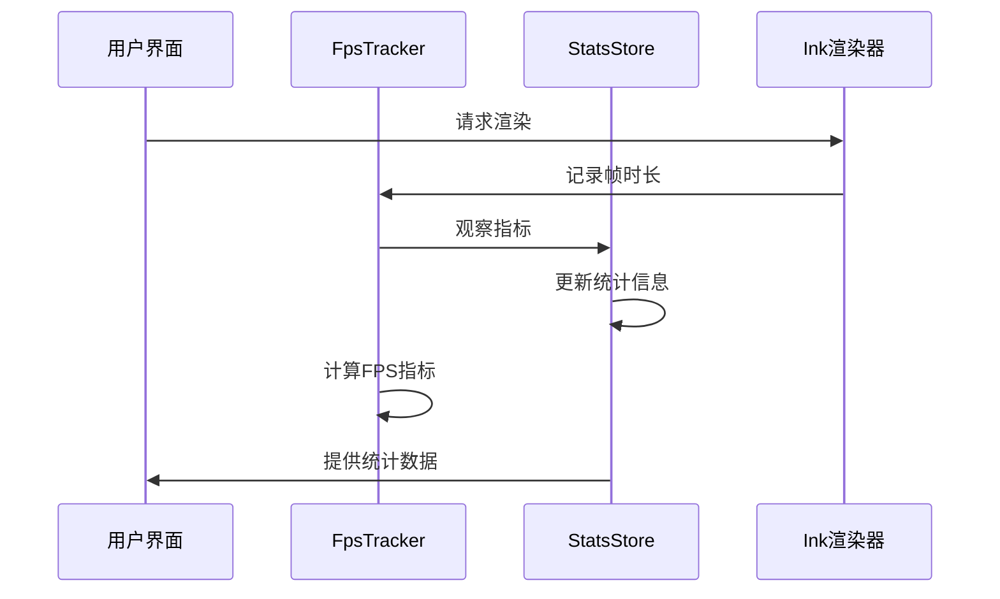
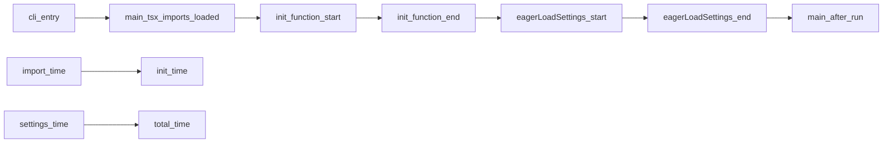
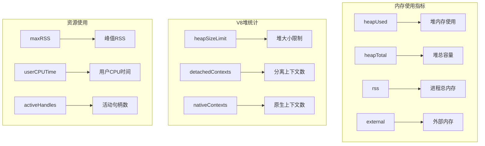
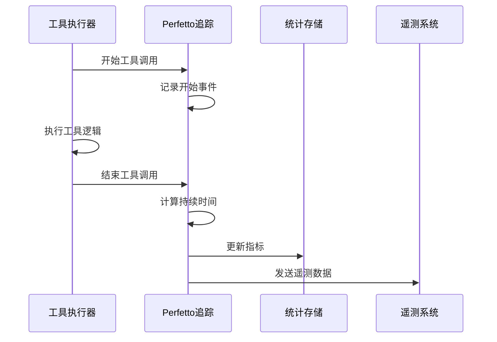
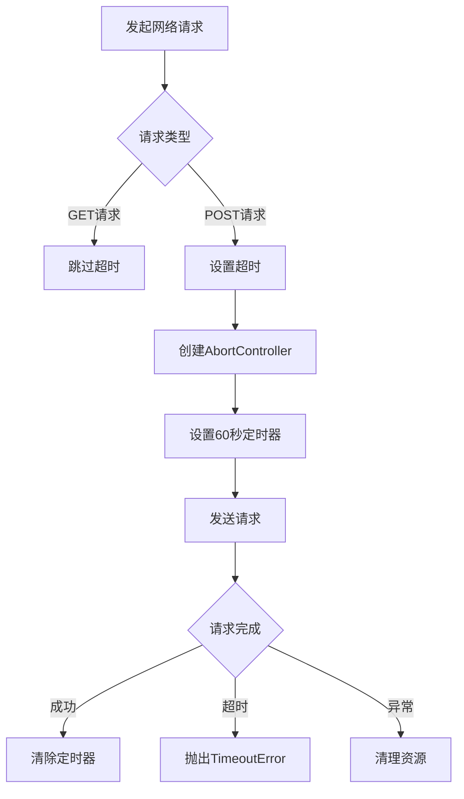
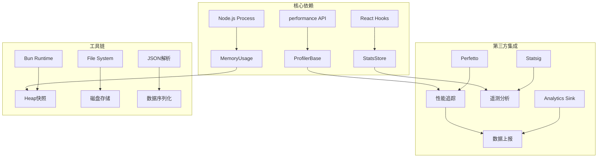

# 性能调试与优化

<cite>
**本文档引用的文件**
- [fpsTracker.ts](file://src/utils/fpsTracker.ts)
- [startupProfiler.ts](file://src/utils/startupProfiler.ts)
- [stats.tsx](file://src/context/stats.tsx)
- [heapDumpService.ts](file://src/utils/heapDumpService.ts)
- [interactiveHelpers.tsx](file://src/interactiveHelpers.tsx)
- [constants.ts](file://src/ink/constants.ts)
- [client.ts](file://src/services/mcp/client.ts)
- [perfettoTracing.ts](file://src/utils/telemetry/perfettoTracing.ts)
- [useMemoryUsage.ts](file://src/hooks/useMemoryUsage.ts)
- [sink.ts](file://src/services/analytics/sink.ts)
- [heapdump.ts](file://src/commands/heapdump/heapdump.ts)
</cite>

## 目录
1. [简介](#简介)
2. [项目结构](#项目结构)
3. [核心组件](#核心组件)
4. [架构概览](#架构概览)
5. [详细组件分析](#详细组件分析)
6. [依赖关系分析](#依赖关系分析)
7. [性能考虑](#性能考虑)
8. [故障排除指南](#故障排除指南)
9. [结论](#结论)

## 简介

本指南专注于 Claude Code 的性能调试与优化，涵盖性能监控、分析工具和最佳实践。系统提供了多维度的性能观测能力，包括启动性能分析、帧率监控、内存使用追踪、工具调用性能追踪以及网络请求性能监控。

## 项目结构

项目采用模块化架构，性能相关功能分布在多个关键目录中：

```mermaid
graph TB
subgraph "性能监控层"
A[fpsTracker.ts] --> B[帧率监控]
C[startupProfiler.ts] --> D[启动性能分析]
E[stats.tsx] --> F[通用统计]
G[heapDumpService.ts] --> H[内存快照]
end
subgraph "渲染层"
I[interactiveHelpers.tsx] --> J[TUI渲染性能]
K[constants.ts] --> L[渲染节流]
end
subgraph "网络层"
M[client.ts] --> N[MCP客户端性能]
O[perfettoTracing.ts] --> P[性能追踪]
end
subgraph "内存监控"
Q[useMemoryUsage.ts] --> R[内存使用检测]
S[heapdump.ts] --> T[/heapdump命令]
end
```

**图表来源**
- [fpsTracker.ts:1-48](file://src/utils/fpsTracker.ts#L1-L48)
- [startupProfiler.ts:1-195](file://src/utils/startupProfiler.ts#L1-L195)
- [stats.tsx:1-220](file://src/context/stats.tsx#L1-L220)

**章节来源**
- [fpsTracker.ts:1-48](file://src/utils/fpsTracker.ts#L1-L48)
- [startupProfiler.ts:1-195](file://src/utils/startupProfiler.ts#L1-L195)
- [stats.tsx:1-220](file://src/context/stats.tsx#L1-L220)

## 核心组件

### 帧率监控系统

帧率监控是用户界面性能的关键指标，通过 FpsTracker 实现：



**图表来源**
- [fpsTracker.ts:1-48](file://src/utils/fpsTracker.ts#L1-L48)

### 启动性能分析器

启动性能分析器提供详细的启动阶段时间线分析：



**图表来源**
- [startupProfiler.ts:1-195](file://src/utils/startupProfiler.ts#L1-L195)

### 内存监控系统

内存监控系统提供多维度的内存使用分析：



**图表来源**
- [heapDumpService.ts:32-212](file://src/utils/heapDumpService.ts#L32-L212)

**章节来源**
- [fpsTracker.ts:1-48](file://src/utils/fpsTracker.ts#L1-L48)
- [startupProfiler.ts:1-195](file://src/utils/startupProfiler.ts#L1-L195)
- [heapDumpService.ts:1-304](file://src/utils/heapDumpService.ts#L1-L304)

## 架构概览

系统采用分层架构设计，各组件协同工作提供全面的性能监控：



**图表来源**
- [stats.tsx:1-220](file://src/context/stats.tsx#L1-L220)
- [perfettoTracing.ts:642-1005](file://src/utils/telemetry/perfettoTracing.ts#L642-L1005)

## 详细组件分析

### 帧率性能监控

帧率监控是用户体验的核心指标，通过以下机制实现：

#### 性能数据收集流程



**图表来源**
- [interactiveHelpers.tsx:315-366](file://src/interactiveHelpers.tsx#L315-L366)
- [fpsTracker.ts:11-46](file://src/utils/fpsTracker.ts#L11-L46)

#### 性能指标计算

系统计算多种性能指标以全面评估渲染性能：

| 指标类型 | 计算方式 | 阈值参考 |
|---------|---------|---------|
| 平均FPS | 总帧数 / 总时间 | ≥60 FPS为佳 |
| 低1% FPS | 排序后第99百分位帧时长 | ≥50 FPS为可接受 |
| 帧时长分布 | 分布直方图统计 | 正态分布更优 |

**章节来源**
- [interactiveHelpers.tsx:315-366](file://src/interactiveHelpers.tsx#L315-L366)
- [fpsTracker.ts:20-46](file://src/utils/fpsTracker.ts#L20-L46)

### 启动性能分析

启动性能分析提供详细的启动阶段时间线，帮助识别启动瓶颈：

#### 启动阶段定义



**图表来源**
- [startupProfiler.ts:49-54](file://src/utils/startupProfiler.ts#L49-L54)

#### 性能报告生成

系统支持两种报告模式：

1. **采样模式**：向 Statsig 发送关键指标
2. **详细模式**：生成完整的启动时间线报告

**章节来源**
- [startupProfiler.ts:1-195](file://src/utils/startupProfiler.ts#L1-L195)

### 内存性能监控

内存监控系统提供多维度的内存使用分析，支持自动和手动内存快照：

#### 内存诊断指标



**图表来源**
- [heapDumpService.ts:42-82](file://src/utils/heapDumpService.ts#L42-L82)

#### 内存泄漏检测算法

系统使用多种指标检测潜在的内存泄漏：

| 检测指标 | 判断标准 | 告警级别 |
|---------|---------|---------|
| 分离上下文数 | > 0 | 高风险 |
| 活动句柄数 | > 100 | 中等风险 |
| 原生内存占比 | 原生内存 > 堆内存 | 高风险 |
| 内存增长速率 | > 100 MB/小时 | 需关注 |

**章节来源**
- [heapDumpService.ts:135-161](file://src/utils/heapDumpService.ts#L135-L161)
- [useMemoryUsage.ts:1-39](file://src/hooks/useMemoryUsage.ts#L1-L39)

### 工具调用性能追踪

工具调用性能追踪提供细粒度的工具执行监控：

#### 性能追踪流程



**图表来源**
- [perfettoTracing.ts:690-763](file://src/utils/telemetry/perfettoTracing.ts#L690-L763)

#### 工具性能指标

| 指标名称 | 描述 | 监控方式 |
|---------|------|---------|
| 工具执行时间 | 单个工具的完整执行时间 | Perfetto事件追踪 |
| 成功/失败率 | 工具调用的成功比例 | 统计计数 |
| 错误类型分布 | 不同错误类型的统计 | 分类计数 |
| 结果令牌数 | 工具返回的令牌数量 | 数值观察 |

**章节来源**
- [perfettoTracing.ts:690-763](file://src/utils/telemetry/perfettoTracing.ts#L690-L763)

### 网络请求性能监控

网络请求性能监控专注于 MCP 客户端的网络性能：

#### 请求超时管理



**图表来源**
- [client.ts:492-522](file://src/services/mcp/client.ts#L492-L522)

#### 超时处理机制

系统采用自定义超时机制替代标准 `AbortSignal.timeout()`，主要优势：

1. **内存效率**：请求完成后立即释放定时器资源
2. **性能优化**：避免 60 秒延迟导致的内存泄漏
3. **兼容性**：支持所有 HTTP 方法的超时控制

**章节来源**
- [client.ts:492-522](file://src/services/mcp/client.ts#L492-L522)

## 依赖关系分析

系统组件之间的依赖关系如下：



**图表来源**
- [stats.tsx:1-220](file://src/context/stats.tsx#L1-L220)
- [sink.ts:88-114](file://src/services/analytics/sink.ts#L88-L114)

**章节来源**
- [stats.tsx:1-220](file://src/context/stats.tsx#L1-L220)
- [sink.ts:88-114](file://src/services/analytics/sink.ts#L88-L114)

## 性能考虑

### 渲染性能优化

1. **帧率控制**：使用 16ms 帧间隔实现约 60fps 的渲染频率
2. **增量更新**：只更新发生变化的 UI 元素
3. **内存管理**：定期清理未使用的虚拟节点

### 内存使用优化

1. **阈值监控**：1.5GB 高内存阈值触发警告，2.5GB 触发紧急处理
2. **垃圾回收**：在内存压力下主动触发垃圾回收
3. **资源清理**：确保文件句柄、网络连接等资源及时关闭

### 网络性能优化

1. **超时策略**：针对不同请求类型采用合适的超时配置
2. **连接复用**：重用 HTTP 连接减少建立开销
3. **错误重试**：对临时性错误实施指数退避重试

## 故障排除指南

### 常见性能问题诊断

#### 启动缓慢问题

**诊断步骤**：
1. 检查启动性能报告中的关键阶段耗时
2. 对比采样模式和详细模式的差异
3. 分析内存快照中的内存分配模式

**解决方案**：
- 优化模块导入顺序
- 减少启动时的同步操作
- 实施懒加载策略

#### 帧率下降问题

**诊断步骤**：
1. 分析帧时长分布直方图
2. 检查是否存在长尾帧
3. 监控内存使用情况

**解决方案**：
- 优化渲染逻辑
- 减少不必要的重渲染
- 实施虚拟滚动

#### 内存泄漏问题

**诊断步骤**：
1. 分析内存诊断报告中的泄漏指标
2. 检查分离上下文数量
3. 监控活动句柄变化趋势

**解决方案**：
- 确保正确清理事件监听器
- 及时关闭文件句柄和网络连接
- 实施对象池模式管理临时对象

**章节来源**
- [heapDumpService.ts:135-161](file://src/utils/heapDumpService.ts#L135-L161)
- [interactiveHelpers.tsx:315-366](file://src/interactiveHelpers.tsx#L315-L366)

## 结论

Claude Code 的性能监控体系提供了从底层系统到上层应用的全方位性能观测能力。通过多维度的指标收集、智能的告警机制和详细的性能分析工具，开发者可以有效地识别和解决性能瓶颈。

关键优势包括：
- **实时监控**：提供即时的性能反馈
- **多维度分析**：涵盖 CPU、内存、网络等多个方面
- **智能告警**：自动识别异常性能模式
- **详细报告**：提供深入的性能分析洞察

建议在开发过程中充分利用这些工具进行持续的性能监控和优化，确保应用在各种使用场景下的稳定性和高效性。