# 测试策略与方法

<cite>
**本文引用的文件**
- [README.md](file://README.md)
- [package.json](file://package.json)
- [src/bootstrap/state.ts](file://src/bootstrap/state.ts)
- [src/tools/testing/TestingPermissionTool.tsx](file://src/tools/testing/TestingPermissionTool.tsx)
- [src/QueryEngine.ts](file://src/QueryEngine.ts)
- [src/utils/exampleCommands.ts](file://src/utils/exampleCommands.ts)
- [src/utils/settings/changeDetector.ts](file://src/utils/settings/changeDetector.ts)
- [src/memdir/memoryTypes.ts](file://src/memdir/memoryTypes.ts)
- [src/services/api/client.ts](file://src/services/api/client.ts)
- [src/services/api/errors.ts](file://src/services/api/errors.ts)
- [src/services/api/withRetry.ts](file://src/services/api/withRetry.ts)
- [src/commands.ts](file://src/commands.ts)
- [src/commands/mcp/xaaIdpCommand.ts](file://src/commands/mcp/xaaIdpCommand.ts)
- [src/utils/fsOperations.ts](file://src/utils/fsOperations.ts)
- [src/utils/env.ts](file://src/utils/env.ts)
- [src/utils/bash/bashParser.ts](file://src/utils/bash/bashParser.ts)
</cite>

## 目录
1. [引言](#引言)
2. [项目结构](#项目结构)
3. [核心组件](#核心组件)
4. [架构总览](#架构总览)
5. [详细组件分析](#详细组件分析)
6. [依赖关系分析](#依赖关系分析)
7. [性能考量](#性能考量)
8. [故障排查指南](#故障排查指南)
9. [结论](#结论)
10. [附录](#附录)

## 引言
本指南面向 Claude Code 的测试策略与方法，目标是帮助开发者在不直接阅读源码的前提下，理解并实施覆盖单元测试、集成测试与端到端测试的完整测试体系。文档基于仓库中已公开的源码进行分析，重点涵盖以下方面：
- 测试架构与分类设计原则（单元/集成/端到端）
- 测试环境搭建与配置要点（测试数据库、模拟服务、测试数据准备）
- 测试工具链选择与使用建议（测试框架、断言库、覆盖率工具）
- 不同层面代码的测试编写指南（命令系统、工具执行、UI 组件、服务层）
- 特殊场景测试方法（异步测试、并发测试、错误处理测试）
- 测试自动化与持续集成实践
- 性能测试与基准测试建议

为确保可追溯性，本文所有涉及具体实现的内容均标注了“章节来源”或“图表来源”，并提供了对应文件路径与行号范围。

## 项目结构
从仓库结构看，该项目采用模块化组织方式，主要模块包括：
- 入口与桥接：entrypoints、bridge
- 命令系统：commands
- 工具系统：tools
- 服务层：services
- UI 组件与终端界面：components、ink
- 工具与通用能力：utils、constants、types
- 状态与引导：bootstrap
- 查询引擎与任务：QueryEngine、tasks

下图给出一个概念性的项目结构视图，帮助理解模块间的关系与测试分层思路：

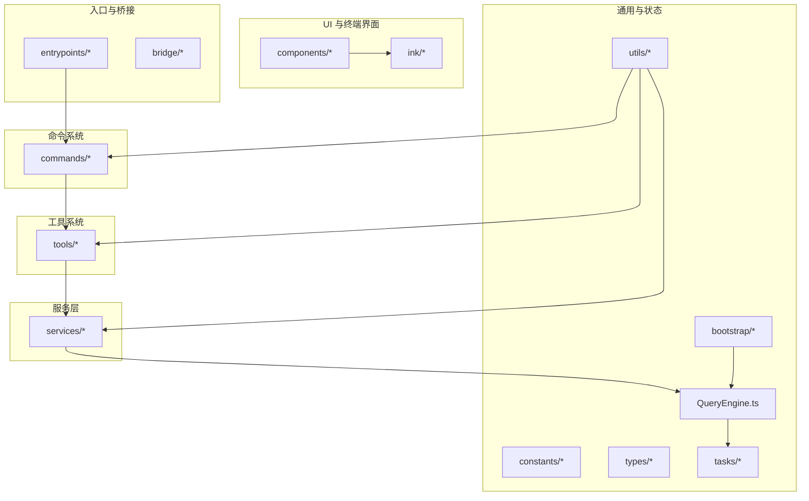

[本图为概念性结构示意，不直接映射到具体源码文件，故无图表来源]

**章节来源**
- [README.md:95-114](file://README.md#L95-L114)

## 核心组件
本节聚焦测试相关的核心组件与机制，这些是制定测试策略的关键抓手。

- 测试状态重置与隔离
  - 提供测试专用的状态重置函数，确保每次测试前后的全局状态一致，避免跨用例污染。
  - 参考：[src/bootstrap/state.ts:918-930](file://src/bootstrap/state.ts#L918-L930)

- 测试权限工具
  - 提供一个仅在测试环境下启用的“总是弹出权限对话框”的工具，用于端到端测试中的交互验证。
  - 参考：[src/tools/testing/TestingPermissionTool.tsx:1-74](file://src/tools/testing/TestingPermissionTool.tsx#L1-L74)

- 查询引擎与测试可运行性
  - 查询引擎注释明确指出其在测试环境下的可测试性与功能开关行为，便于在不同测试框架下进行条件编译与特性控制。
  - 参考：[src/QueryEngine.ts:162-163](file://src/QueryEngine.ts#L162-L163)

- 设置变更检测器的测试重置
  - 提供设置监听器的测试重置接口，支持在测试中快速关闭监听器、清理定时器与待删除队列，避免文件系统残留导致的测试失败。
  - 参考：[src/utils/settings/changeDetector.ts:452-480](file://src/utils/settings/changeDetector.ts#L452-L480)

- 数据库与集成测试策略
  - 明确要求“反馈记忆保存”等集成测试必须使用真实数据库，不得使用内存或模拟数据库，以避免生产迁移问题被掩盖。
  - 参考：[src/memdir/memoryTypes.ts:64-65](file://src/memdir/memoryTypes.ts#L64-L65)、[src/memdir/memoryTypes.ts:138-139](file://src/memdir/memoryTypes.ts#L138-L139)

- 模拟限流与速率限制测试
  - 服务层通过 mock 令牌提供者与检查模拟限流错误，支持“/mock-limits”命令的测试场景，便于在开发与内部测试中模拟限流行为。
  - 参考：[src/services/api/client.ts:197](file://src/services/api/client.ts#L197)、[src/services/api/errors.ts:50](file://src/services/api/errors.ts#L50)、[src/services/api/withRetry.ts:200-207](file://src/services/api/withRetry.ts#L200-L207)

- 命令注册与测试可用性
  - 命令注册处引入“mock-limits”命令，表明该命令用于测试与内部限流模拟。
  - 参考：[src/commands.ts:138](file://src/commands.ts#L138)、[src/commands.ts:235](file://src/commands.ts#L235)

- 文件系统抽象与测试替身
  - 定义 FsOperations 接口，提供对 Node.js fs 能力的类型安全抽象，便于在测试中替换为虚拟或内存实现。
  - 参考：[src/utils/fsOperations.ts:18-51](file://src/utils/fsOperations.ts#L18-L51)

- 环境探测与 IDE 识别
  - 提供环境探测函数（如 Windows、Conductor），用于在测试中根据环境差异调整断言或行为。
  - 参考：[src/utils/env.ts:96-132](file://src/utils/env.ts#L96-L132)

- 示例命令过滤规则
  - 定义示例命令文件的非核心过滤规则，有助于在测试中确定“应写入测试”的候选文件集合。
  - 参考：[src/utils/exampleCommands.ts:11-33](file://src/utils/exampleCommands.ts#L11-L33)

- Bash 测试语法解析
  - 包含 Bash test 语法的解析逻辑，可用于测试脚本与命令行工具的解析与断言。
  - 双引号与转义处理、一元/二元表达式、正则匹配等分支，便于构建针对 Bash 行为的测试用例。
  - 参考：[src/utils/bash/bashParser.ts:3757-3861](file://src/utils/bash/bashParser.ts#L3757-L3861)

**章节来源**
- [src/bootstrap/state.ts:918-930](file://src/bootstrap/state.ts#L918-L930)
- [src/tools/testing/TestingPermissionTool.tsx:1-74](file://src/tools/testing/TestingPermissionTool.tsx#L1-L74)
- [src/QueryEngine.ts:162-163](file://src/QueryEngine.ts#L162-L163)
- [src/utils/settings/changeDetector.ts:452-480](file://src/utils/settings/changeDetector.ts#L452-L480)
- [src/memdir/memoryTypes.ts:64-65](file://src/memdir/memoryTypes.ts#L64-L65)
- [src/memdir/memoryTypes.ts:138-139](file://src/memdir/memoryTypes.ts#L138-L139)
- [src/services/api/client.ts:197](file://src/services/api/client.ts#L197)
- [src/services/api/errors.ts:50](file://src/services/api/errors.ts#L50)
- [src/services/api/withRetry.ts:200-207](file://src/services/api/withRetry.ts#L200-L207)
- [src/commands.ts:138](file://src/commands.ts#L138)
- [src/commands.ts:235](file://src/commands.ts#L235)
- [src/utils/fsOperations.ts:18-51](file://src/utils/fsOperations.ts#L18-L51)
- [src/utils/env.ts:96-132](file://src/utils/env.ts#L96-L132)
- [src/utils/exampleCommands.ts:11-33](file://src/utils/exampleCommands.ts#L11-L33)
- [src/utils/bash/bashParser.ts:3757-3861](file://src/utils/bash/bashParser.ts#L3757-L3861)

## 架构总览
下图展示测试策略在系统中的位置与关键交互点，强调“测试状态重置”“测试权限工具”“查询引擎”“设置变更检测器”“服务层限流模拟”“命令注册”“文件系统抽象”“环境探测”“示例命令过滤”“Bash 解析器”等组件如何协同支撑测试体系。

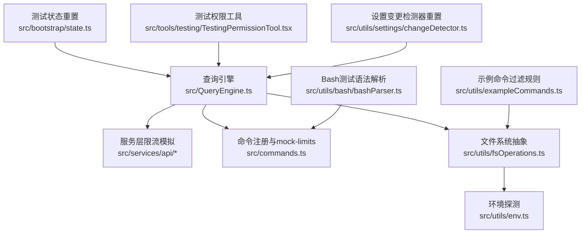

**图表来源**
- [src/bootstrap/state.ts:918-930](file://src/bootstrap/state.ts#L918-L930)
- [src/tools/testing/TestingPermissionTool.tsx:1-74](file://src/tools/testing/TestingPermissionTool.tsx#L1-L74)
- [src/QueryEngine.ts:162-163](file://src/QueryEngine.ts#L162-L163)
- [src/utils/settings/changeDetector.ts:452-480](file://src/utils/settings/changeDetector.ts#L452-L480)
- [src/services/api/client.ts:197](file://src/services/api/client.ts#L197)
- [src/services/api/errors.ts:50](file://src/services/api/errors.ts#L50)
- [src/services/api/withRetry.ts:200-207](file://src/services/api/withRetry.ts#L200-L207)
- [src/commands.ts:138](file://src/commands.ts#L138)
- [src/commands.ts:235](file://src/commands.ts#L235)
- [src/utils/fsOperations.ts:18-51](file://src/utils/fsOperations.ts#L18-L51)
- [src/utils/env.ts:96-132](file://src/utils/env.ts#L96-L132)
- [src/utils/exampleCommands.ts:11-33](file://src/utils/exampleCommands.ts#L11-L33)
- [src/utils/bash/bashParser.ts:3757-3861](file://src/utils/bash/bashParser.ts#L3757-L3861)

## 详细组件分析

### 测试状态重置与隔离
- 设计原则
  - 在测试前调用重置函数，确保全局状态回到初始态；仅允许在测试环境中调用，防止误用。
  - 对会话切换、令牌预算、当前轮次预算等关键状态进行重置，避免用例间耦合。
- 实施要点
  - 在每个测试套件的 beforeEach 中调用重置函数。
  - 对于存在防抖/定时器的模块，需配合“测试重置”接口清理定时器与回调。
- 参考路径
  - [src/bootstrap/state.ts:918-930](file://src/bootstrap/state.ts#L918-L930)

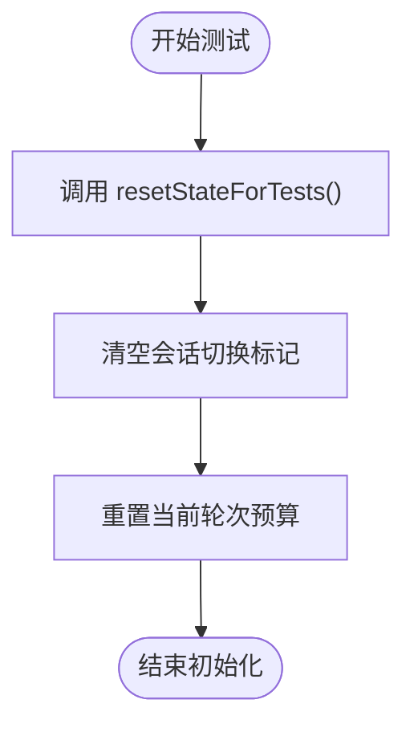

**图表来源**
- [src/bootstrap/state.ts:918-930](file://src/bootstrap/state.ts#L918-L930)

**章节来源**
- [src/bootstrap/state.ts:918-930](file://src/bootstrap/state.ts#L918-L930)

### 测试权限工具（端到端测试）
- 设计原则
  - 该工具仅在测试环境下启用，用于触发权限弹窗流程，便于端到端测试验证用户交互与权限决策链路。
- 实施要点
  - 在 E2E 场景中，通过注入该工具来模拟“需要权限”的操作，验证 UI 与权限对话框的正确性。
  - 注意工具的只读属性与并发安全，确保多线程或多实例场景下的稳定性。
- 参考路径
  - [src/tools/testing/TestingPermissionTool.tsx:1-74](file://src/tools/testing/TestingPermissionTool.tsx#L1-L74)

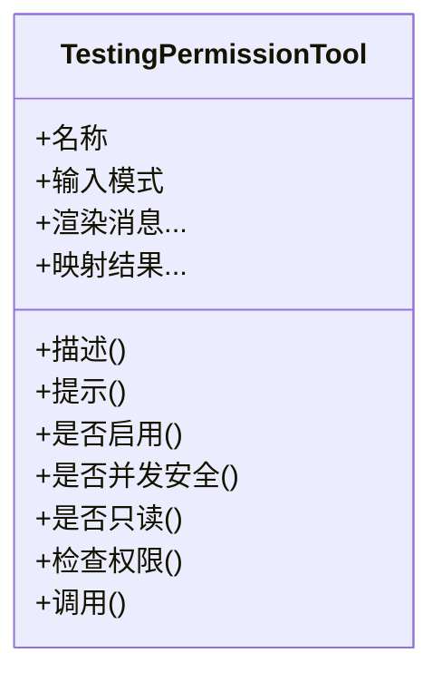

**图表来源**
- [src/tools/testing/TestingPermissionTool.tsx:1-74](file://src/tools/testing/TestingPermissionTool.tsx#L1-L74)

**章节来源**
- [src/tools/testing/TestingPermissionTool.tsx:1-74](file://src/tools/testing/TestingPermissionTool.tsx#L1-L74)

### 查询引擎与测试可运行性
- 设计原则
  - 查询引擎在测试环境下具备可测试性，并受特性开关控制，便于在不同测试框架（如 Bun Test）下进行条件编译与行为验证。
- 实施要点
  - 在测试中通过特性开关与状态重置，确保提交消息、工具使用、系统提示等流程可重复且可控。
- 参考路径
  - [src/QueryEngine.ts:162-163](file://src/QueryEngine.ts#L162-L163)

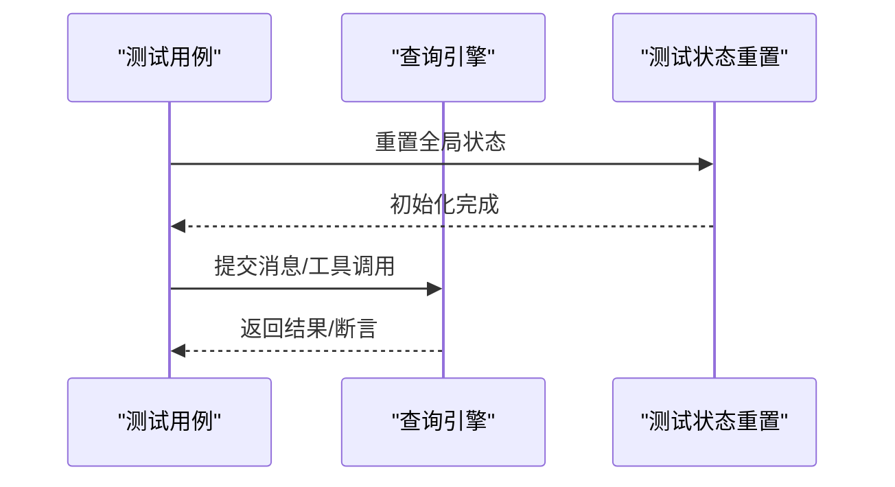

**图表来源**
- [src/QueryEngine.ts:162-163](file://src/QueryEngine.ts#L162-L163)
- [src/bootstrap/state.ts:918-930](file://src/bootstrap/state.ts#L918-L930)

**章节来源**
- [src/QueryEngine.ts:162-163](file://src/QueryEngine.ts#L162-L163)
- [src/bootstrap/state.ts:918-930](file://src/bootstrap/state.ts#L918-L930)

### 设置变更检测器的测试重置
- 设计原则
  - 在测试中关闭文件监听器、清理定时器与待删除队列，避免因目录被删除导致的异常（ENOENT）。
- 实施要点
  - 在测试结束后调用重置函数，并等待监听器关闭 Promise 完成后再清理临时目录。
- 参考路径
  - [src/utils/settings/changeDetector.ts:452-480](file://src/utils/settings/changeDetector.ts#L452-L480)

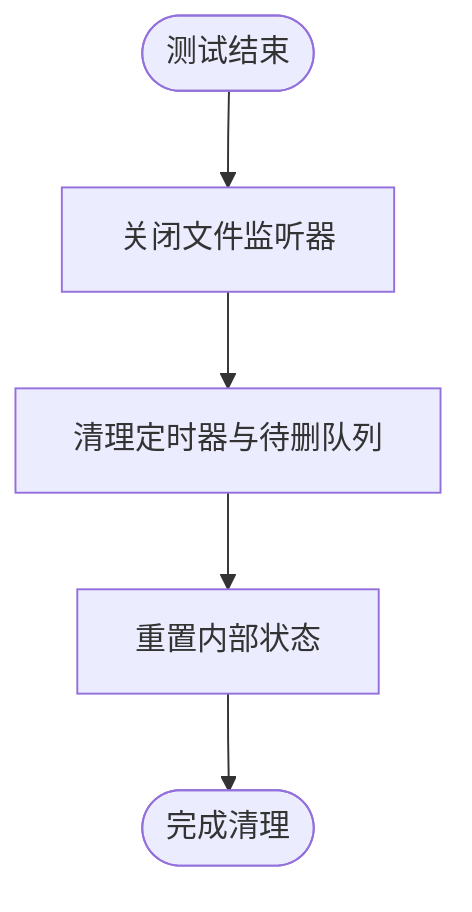

**图表来源**
- [src/utils/settings/changeDetector.ts:452-480](file://src/utils/settings/changeDetector.ts#L452-L480)

**章节来源**
- [src/utils/settings/changeDetector.ts:452-480](file://src/utils/settings/changeDetector.ts#L452-L480)

### 服务层限流与模拟（集成测试）
- 设计原则
  - 通过 mock 令牌提供者与检查模拟限流错误，支持“/mock-limits”命令的测试场景，便于在开发与内部测试中模拟限流行为。
- 实施要点
  - 在集成测试中，构造 mock 错误并断言重试策略与错误传播路径。
  - 避免对生产 API 的真实调用，确保测试稳定与可重复。
- 参考路径
  - [src/services/api/client.ts:197](file://src/services/api/client.ts#L197)
  - [src/services/api/errors.ts:50](file://src/services/api/errors.ts#L50)
  - [src/services/api/withRetry.ts:200-207](file://src/services/api/withRetry.ts#L200-L207)

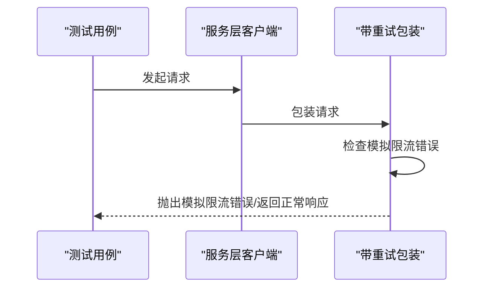

**图表来源**
- [src/services/api/client.ts:197](file://src/services/api/client.ts#L197)
- [src/services/api/errors.ts:50](file://src/services/api/errors.ts#L50)
- [src/services/api/withRetry.ts:200-207](file://src/services/api/withRetry.ts#L200-L207)

**章节来源**
- [src/services/api/client.ts:197](file://src/services/api/client.ts#L197)
- [src/services/api/errors.ts:50](file://src/services/api/errors.ts#L50)
- [src/services/api/withRetry.ts:200-207](file://src/services/api/withRetry.ts#L200-L207)

### 命令系统与测试可用性
- 设计原则
  - 命令注册处引入“mock-limits”命令，表明该命令用于测试与内部限流模拟。
- 实施要点
  - 在测试中通过该命令触发限流场景，验证服务层与 UI 的限流提示与降级逻辑。
- 参考路径
  - [src/commands.ts:138](file://src/commands.ts#L138)
  - [src/commands.ts:235](file://src/commands.ts#L235)
  - [src/commands/mcp/xaaIdpCommand.ts:59](file://src/commands/mcp/xaaIdpCommand.ts#L59)
  - [src/commands/mcp/xaaIdpCommand.ts:155](file://src/commands/mcp/xaaIdpCommand.ts#L155)

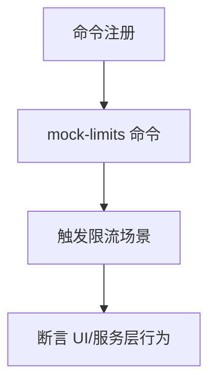

**图表来源**
- [src/commands.ts:138](file://src/commands.ts#L138)
- [src/commands.ts:235](file://src/commands.ts#L235)
- [src/commands/mcp/xaaIdpCommand.ts:59](file://src/commands/mcp/xaaIdpCommand.ts#L59)
- [src/commands/mcp/xaaIdpCommand.ts:155](file://src/commands/mcp/xaaIdpCommand.ts#L155)

**章节来源**
- [src/commands.ts:138](file://src/commands.ts#L138)
- [src/commands.ts:235](file://src/commands.ts#L235)
- [src/commands/mcp/xaaIdpCommand.ts:59](file://src/commands/mcp/xaaIdpCommand.ts#L59)
- [src/commands/mcp/xaaIdpCommand.ts:155](file://src/commands/mcp/xaaIdpCommand.ts#L155)

### 文件系统抽象与测试替身
- 设计原则
  - 通过 FsOperations 接口抽象文件系统操作，便于在测试中替换为虚拟或内存实现，提升测试速度与可控性。
- 实施要点
  - 在单元测试中使用替身实现，避免真实磁盘 IO；在集成测试中使用真实文件系统，确保与生产一致。
- 参考路径
  - [src/utils/fsOperations.ts:18-51](file://src/utils/fsOperations.ts#L18-L51)

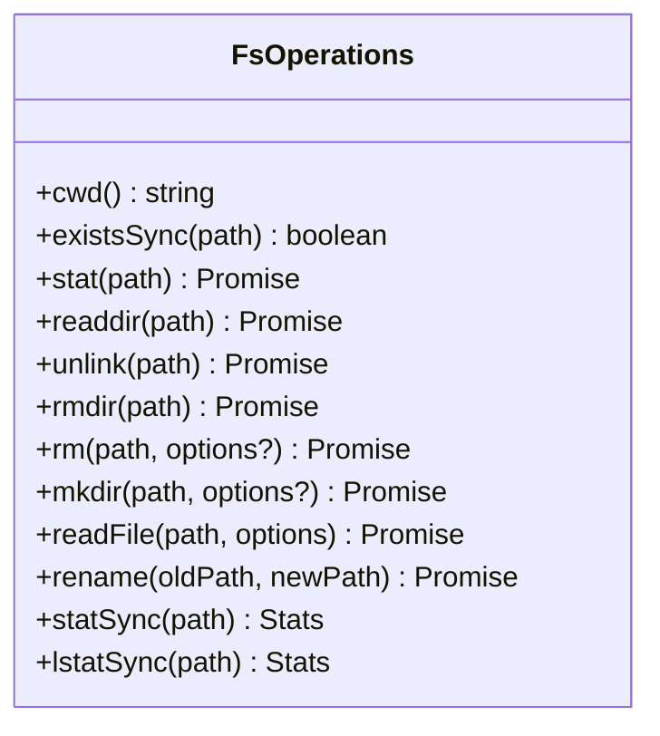

**图表来源**
- [src/utils/fsOperations.ts:18-51](file://src/utils/fsOperations.ts#L18-L51)

**章节来源**
- [src/utils/fsOperations.ts:18-51](file://src/utils/fsOperations.ts#L18-L51)

### 环境探测与 IDE 识别
- 设计原则
  - 提供环境探测函数（如 Windows、Conductor），用于在测试中根据环境差异调整断言或行为。
- 实施要点
  - 在跨平台测试中，根据探测结果选择不同的断言策略或忽略某些平台特定的行为。
- 参考路径
  - [src/utils/env.ts:96-132](file://src/utils/env.ts#L96-L132)

**章节来源**
- [src/utils/env.ts:96-132](file://src/utils/env.ts#L96-L132)

### 示例命令过滤规则
- 设计原则
  - 定义示例命令文件的非核心过滤规则，有助于在测试中确定“应写入测试”的候选文件集合。
- 实施要点
  - 在生成测试用例时，利用过滤规则筛选出适合“写测试”的文件，减少噪声并提高测试覆盖面。
- 参考路径
  - [src/utils/exampleCommands.ts:11-33](file://src/utils/exampleCommands.ts#L11-L33)

**章节来源**
- [src/utils/exampleCommands.ts:11-33](file://src/utils/exampleCommands.ts#L11-L33)

### Bash 测试语法解析
- 设计原则
  - 包含 Bash test 语法的解析逻辑，可用于测试脚本与命令行工具的解析与断言。
- 实施要点
  - 在测试中构造符合一元/二元表达式、正则匹配、转义等规则的输入，验证解析器的健壮性。
- 参考路径
  - [src/utils/bash/bashParser.ts:3757-3861](file://src/utils/bash/bashParser.ts#L3757-L3861)

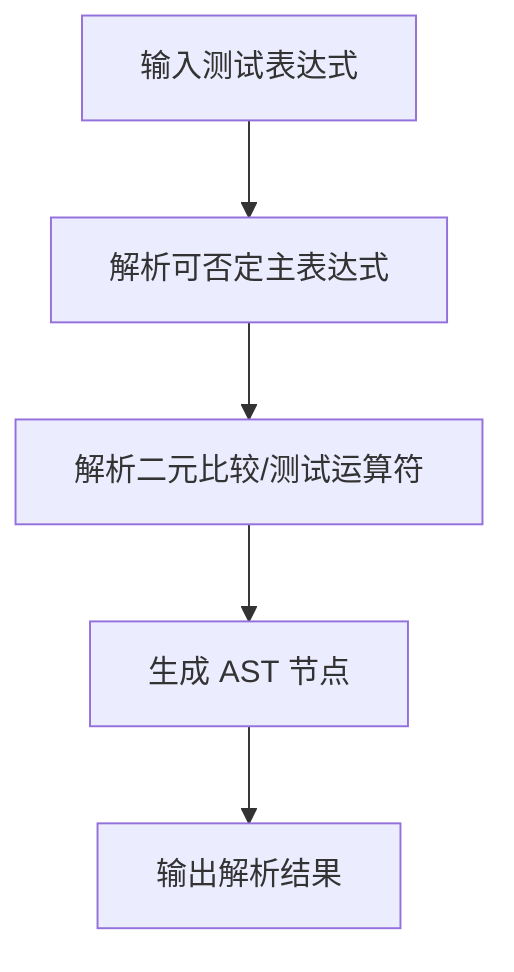

**图表来源**
- [src/utils/bash/bashParser.ts:3757-3861](file://src/utils/bash/bashParser.ts#L3757-L3861)

**章节来源**
- [src/utils/bash/bashParser.ts:3757-3861](file://src/utils/bash/bashParser.ts#L3757-L3861)

## 依赖关系分析
下图展示测试相关组件之间的依赖关系，强调“测试状态重置”“测试权限工具”“查询引擎”“设置变更检测器”“服务层限流模拟”“命令注册”“文件系统抽象”“环境探测”“示例命令过滤”“Bash 解析器”等模块间的耦合与协作。

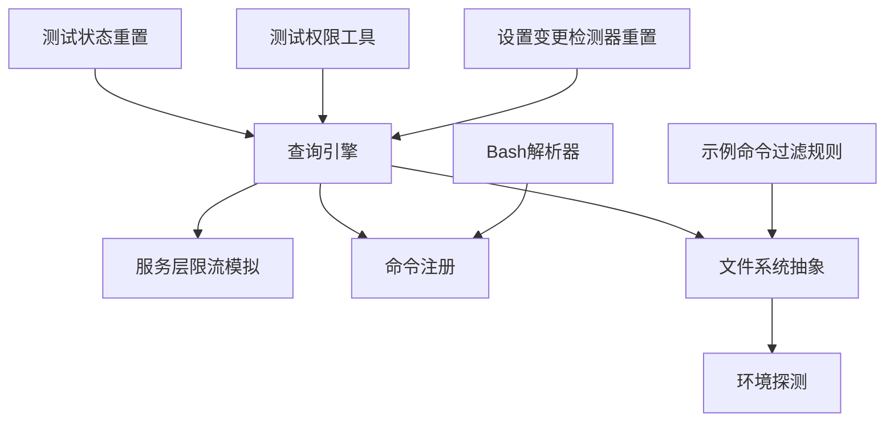

**图表来源**
- [src/bootstrap/state.ts:918-930](file://src/bootstrap/state.ts#L918-L930)
- [src/tools/testing/TestingPermissionTool.tsx:1-74](file://src/tools/testing/TestingPermissionTool.tsx#L1-L74)
- [src/QueryEngine.ts:162-163](file://src/QueryEngine.ts#L162-L163)
- [src/utils/settings/changeDetector.ts:452-480](file://src/utils/settings/changeDetector.ts#L452-L480)
- [src/services/api/client.ts:197](file://src/services/api/client.ts#L197)
- [src/services/api/errors.ts:50](file://src/services/api/errors.ts#L50)
- [src/services/api/withRetry.ts:200-207](file://src/services/api/withRetry.ts#L200-L207)
- [src/commands.ts:138](file://src/commands.ts#L138)
- [src/commands.ts:235](file://src/commands.ts#L235)
- [src/utils/fsOperations.ts:18-51](file://src/utils/fsOperations.ts#L18-L51)
- [src/utils/env.ts:96-132](file://src/utils/env.ts#L96-L132)
- [src/utils/exampleCommands.ts:11-33](file://src/utils/exampleCommands.ts#L11-L33)
- [src/utils/bash/bashParser.ts:3757-3861](file://src/utils/bash/bashParser.ts#L3757-L3861)

**章节来源**
- [src/bootstrap/state.ts:918-930](file://src/bootstrap/state.ts#L918-L930)
- [src/tools/testing/TestingPermissionTool.tsx:1-74](file://src/tools/testing/TestingPermissionTool.tsx#L1-L74)
- [src/QueryEngine.ts:162-163](file://src/QueryEngine.ts#L162-L163)
- [src/utils/settings/changeDetector.ts:452-480](file://src/utils/settings/changeDetector.ts#L452-L480)
- [src/services/api/client.ts:197](file://src/services/api/client.ts#L197)
- [src/services/api/errors.ts:50](file://src/services/api/errors.ts#L50)
- [src/services/api/withRetry.ts:200-207](file://src/services/api/withRetry.ts#L200-L207)
- [src/commands.ts:138](file://src/commands.ts#L138)
- [src/commands.ts:235](file://src/commands.ts#L235)
- [src/utils/fsOperations.ts:18-51](file://src/utils/fsOperations.ts#L18-L51)
- [src/utils/env.ts:96-132](file://src/utils/env.ts#L96-L132)
- [src/utils/exampleCommands.ts:11-33](file://src/utils/exampleCommands.ts#L11-L33)
- [src/utils/bash/bashParser.ts:3757-3861](file://src/utils/bash/bashParser.ts#L3757-L3861)

## 性能考量
- 测试隔离与状态重置
  - 使用测试状态重置函数避免全局状态累积，减少测试间的相互影响，提升整体执行效率。
- 文件系统抽象与替身
  - 在单元测试中使用内存/虚拟文件系统替身，避免真实磁盘 IO；在集成测试中使用真实文件系统，确保与生产一致。
- 设置监听器的快速重置
  - 在测试中及时关闭文件监听器并清理定时器，避免后台任务占用资源。
- 限流模拟与重试策略
  - 在服务层使用模拟限流与重试策略，减少对外部服务的依赖，提升测试稳定性与执行速度。

[本节为一般性指导，不直接分析具体文件，故无章节来源]

## 故障排查指南
- 测试状态重置错误
  - 若在非测试环境调用测试专用重置函数，会抛出错误。请确认 NODE_ENV 或测试框架配置正确。
  - 参考：[src/bootstrap/state.ts:918-922](file://src/bootstrap/state.ts#L918-L922)
- 设置监听器导致的 ENOENT
  - 在测试结束后未等待监听器关闭即清理目录，可能导致 ENOENT。请先调用重置函数并等待关闭 Promise。
  - 参考：[src/utils/settings/changeDetector.ts:452-480](file://src/utils/settings/changeDetector.ts#L452-L480)
- 集成测试数据库问题
  - “反馈记忆保存”等集成测试必须使用真实数据库，不得使用内存或模拟数据库，否则可能掩盖生产迁移问题。
  - 参考：[src/memdir/memoryTypes.ts:64-65](file://src/memdir/memoryTypes.ts#L64-L65)、[src/memdir/memoryTypes.ts:138-139](file://src/memdir/memoryTypes.ts#L138-L139)
- 限流模拟未生效
  - 确认服务层已启用模拟令牌提供者与模拟限流错误检查，并在测试中正确触发 mock-limits 命令。
  - 参考：[src/services/api/client.ts:197](file://src/services/api/client.ts#L197)、[src/services/api/errors.ts:50](file://src/services/api/errors.ts#L50)、[src/services/api/withRetry.ts:200-207](file://src/services/api/withRetry.ts#L200-L207)

**章节来源**
- [src/bootstrap/state.ts:918-922](file://src/bootstrap/state.ts#L918-L922)
- [src/utils/settings/changeDetector.ts:452-480](file://src/utils/settings/changeDetector.ts#L452-L480)
- [src/memdir/memoryTypes.ts:64-65](file://src/memdir/memoryTypes.ts#L64-L65)
- [src/memdir/memoryTypes.ts:138-139](file://src/memdir/memoryTypes.ts#L138-L139)
- [src/services/api/client.ts:197](file://src/services/api/client.ts#L197)
- [src/services/api/errors.ts:50](file://src/services/api/errors.ts#L50)
- [src/services/api/withRetry.ts:200-207](file://src/services/api/withRetry.ts#L200-L207)

## 结论
本指南基于仓库中公开的源码，总结了 Claude Code 的测试策略与方法，重点围绕测试状态重置、测试权限工具、查询引擎、设置变更检测器、服务层限流模拟、命令系统、文件系统抽象、环境探测、示例命令过滤与 Bash 解析器等关键组件，给出了测试架构、分类设计原则与实施方法。通过遵循本文的策略与最佳实践，可以在保证测试质量的同时，提升测试效率与可维护性。

[本节为总结性内容，不直接分析具体文件，故无章节来源]

## 附录
- 项目信息与脚本
  - 项目名称、版本、Node 引擎要求、二进制入口等信息可参考包配置文件。
  - 参考：[package.json:1-34](file://package.json#L1-L34)
- 项目结构概览
  - 项目模块划分与职责说明可参考自述文件中的结构说明。
  - 参考：[README.md:95-114](file://README.md#L95-L114)

**章节来源**
- [package.json:1-34](file://package.json#L1-L34)
- [README.md:95-114](file://README.md#L95-L114)