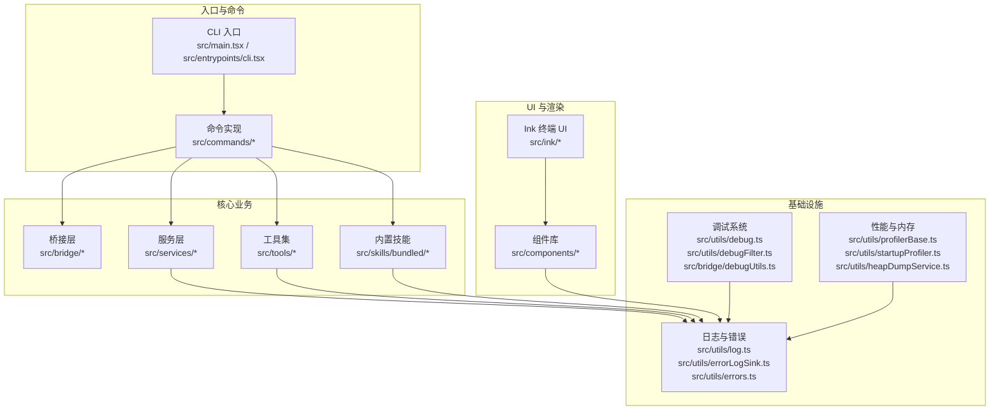
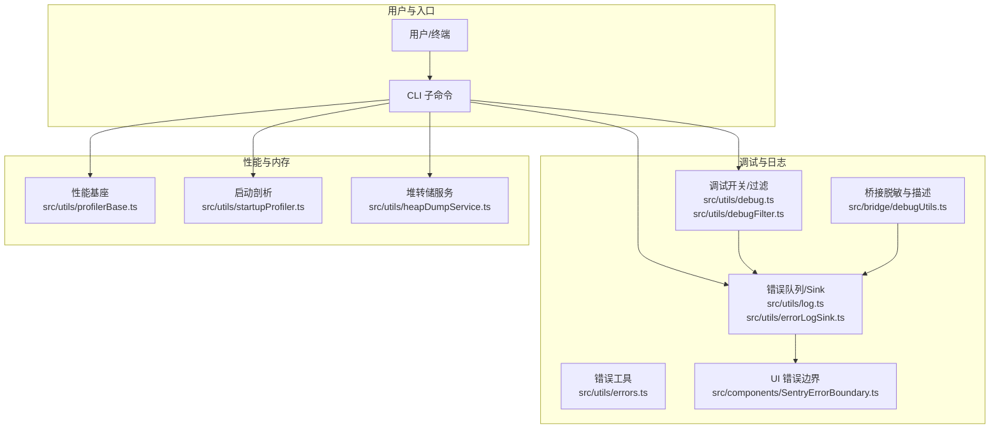
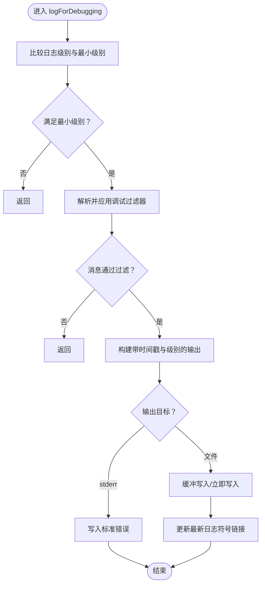
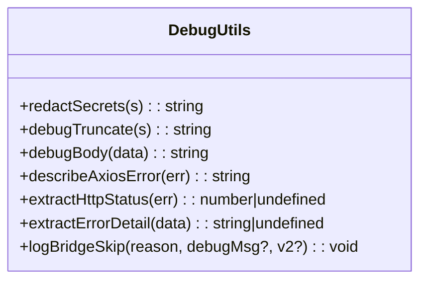
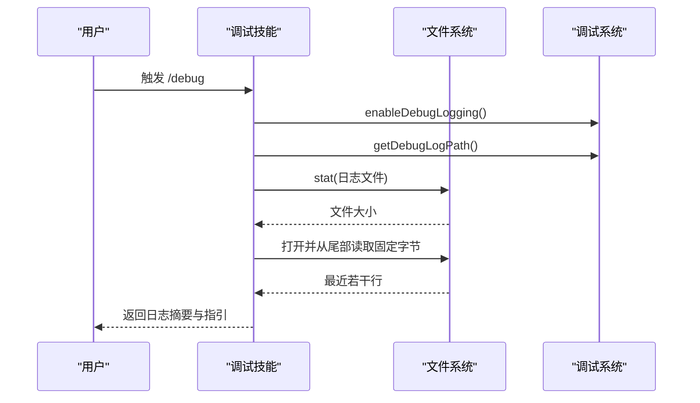
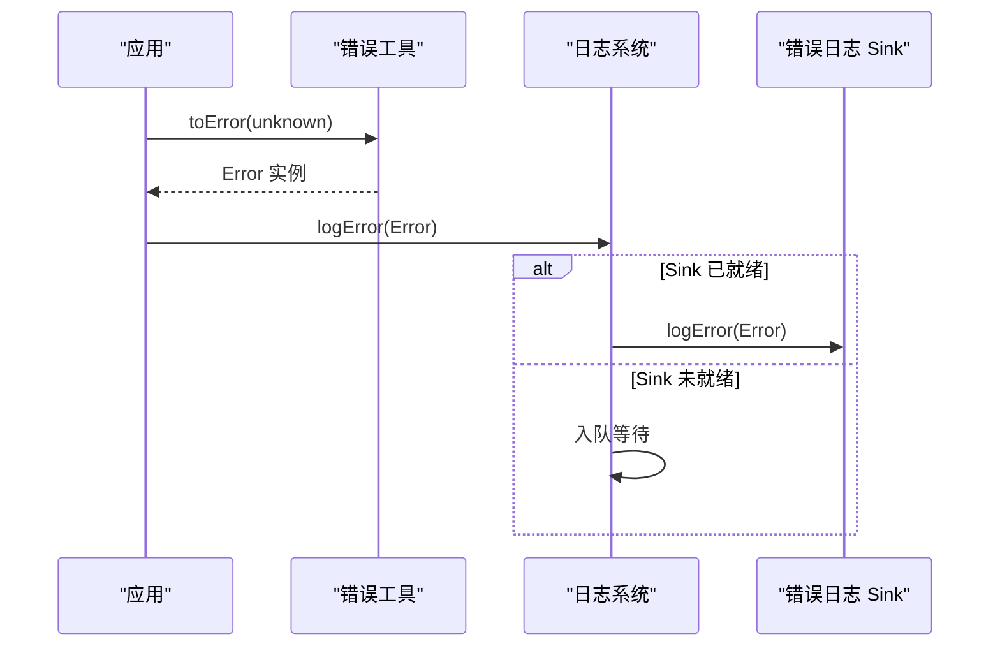
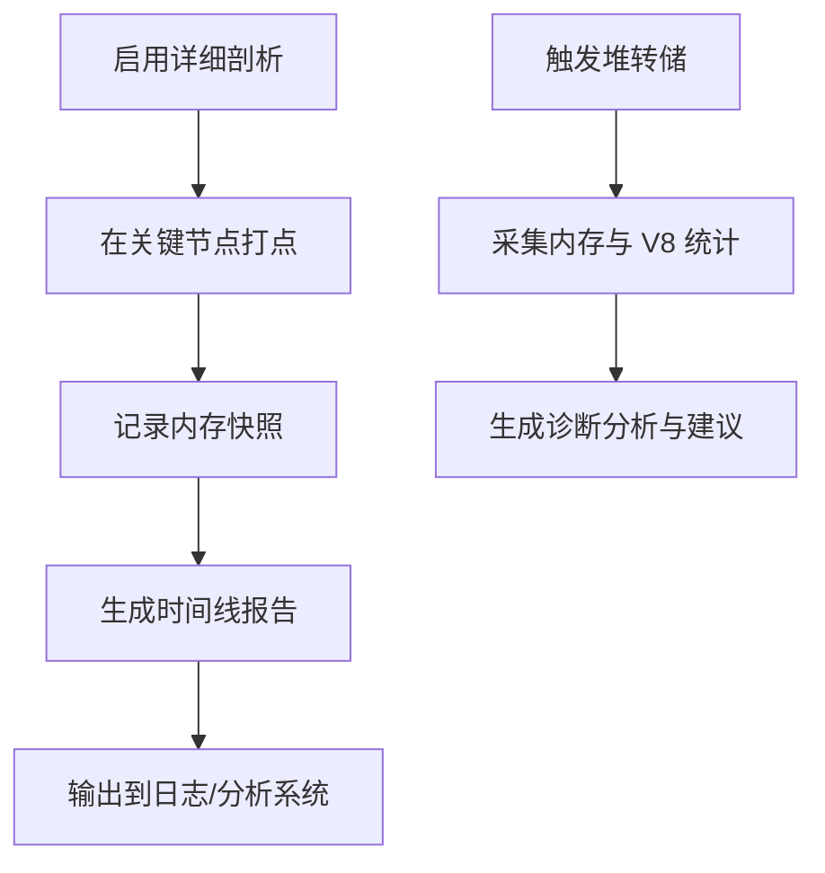
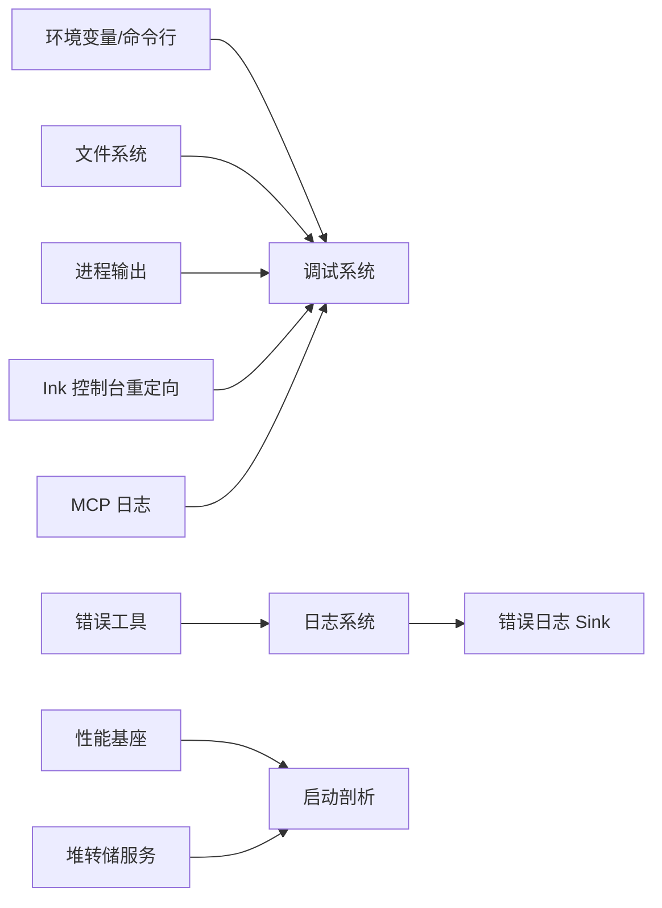

# 调试与测试

<cite>
**本文引用的文件**
- [README.md](file://README.md)
- [package.json](file://package.json)
- [src/utils/debug.ts](file://src/utils/debug.ts)
- [src/utils/debugFilter.ts](file://src/utils/debugFilter.ts)
- [src/bridge/debugUtils.ts](file://src/bridge/debugUtils.ts)
- [src/skills/bundled/debug.ts](file://src/skills/bundled/debug.ts)
- [src/utils/log.ts](file://src/utils/log.ts)
- [src/utils/errorLogSink.ts](file://src/utils/errorLogSink.ts)
- [src/utils/errors.ts](file://src/utils/errors.ts)
- [src/utils/profilerBase.ts](file://src/utils/profilerBase.ts)
- [src/utils/startupProfiler.ts](file://src/utils/startupProfiler.ts)
- [src/utils/heapDumpService.ts](file://src/utils/heapDumpService.ts)
- [src/ink/ink.tsx](file://src/ink/ink.tsx)
- [src/utils/claudeInChrome/mcpServer.ts](file://src/utils/claudeInChrome/mcpServer.ts)
- [src/components/SentryErrorBoundary.ts](file://src/components/SentryErrorBoundary.ts)
</cite>

## 目录
1. [简介](#简介)
2. [项目结构](#项目结构)
3. [核心组件](#核心组件)
4. [架构总览](#架构总览)
5. [详细组件分析](#详细组件分析)
6. [依赖关系分析](#依赖关系分析)
7. [性能考量](#性能考量)
8. [故障排除指南](#故障排除指南)
9. [结论](#结论)
10. [附录](#附录)

## 简介
本指南面向 Claude Code 的调试与测试实践，覆盖以下主题：
- 调试技术与工具：Node.js 调试器、浏览器开发者工具、终端调试技巧
- 日志系统与错误处理：调试模式开关、过滤器、输出位置、错误记录与上报
- 测试策略：单元测试、集成测试、端到端测试的编写与执行建议
- 常见问题排查：性能问题、内存泄漏、网络请求调试
- 组件/服务/工具调试：如何在 CLI、桥接层、MCP、UI 中定位问题
- 实际调试示例与故障排除案例

## 项目结构
该项目为基于终端的 CLI 工具，采用模块化组织方式：
- 入口与命令：CLI 参数解析、子命令与传输层
- 核心业务：会话、任务、工具、技能、服务（API、MCP、分析）
- UI 层：基于 Ink 的终端 UI 组件
- 工具与基础设施：日志、错误、调试、性能剖析、内存快照

图表来源
- [src/main.tsx](file://src/main.tsx)
- [src/entrypoints/cli.tsx](file://src/entrypoints/cli.tsx)
- [src/bridge/bridgeMain.ts](file://src/bridge/bridgeMain.ts)
- [src/services/api/apiClient.ts](file://src/services/api/apiClient.ts)
- [src/tools/FileEditTool/index.ts](file://src/tools/FileEditTool/index.ts)
- [src/skills/bundled/debug.ts](file://src/skills/bundled/debug.ts)
- [src/ink/ink.tsx](file://src/ink/ink.tsx)
- [src/utils/debug.ts](file://src/utils/debug.ts)
- [src/utils/log.ts](file://src/utils/log.ts)
- [src/utils/errorLogSink.ts](file://src/utils/errorLogSink.ts)
- [src/utils/profilerBase.ts](file://src/utils/profilerBase.ts)
- [src/utils/startupProfiler.ts](file://src/utils/startupProfiler.ts)
- [src/utils/heapDumpService.ts](file://src/utils/heapDumpService.ts)

章节来源
- [README.md: 95-114:95-114](file://README.md#L95-L114)
- [package.json: 1-34:1-34](file://package.json#L1-L34)

## 核心组件
- 调试系统
  - 调试开关与过滤：支持环境变量、命令行参数、运行时动态开启；支持按类别过滤
  - 输出目标：标准错误或文件；自动维护“最新日志”符号链接
  - 敏感信息脱敏与截断：避免泄露密钥与超长消息
- 错误处理与日志
  - 错误队列与 Sink：延迟初始化，保证不丢失错误事件
  - Axios 错误增强：附加 URL、状态码、服务器消息
  - UI 层错误边界：防止异常导致进程崩溃
- 性能与内存诊断
  - 启动时间线标记与报告
  - 内存快照与指标采集，辅助判断是否为 V8 堆泄漏或原生内存泄漏
- MCP 与浏览器扩展调试
  - MCP 侧日志桥接到调试系统
  - Chrome 扩展场景下的日志适配

章节来源
- [src/utils/debug.ts: 18-269:18-269](file://src/utils/debug.ts#L18-L269)
- [src/utils/debugFilter.ts: 1-158:1-158](file://src/utils/debugFilter.ts#L1-L158)
- [src/bridge/debugUtils.ts: 1-142:1-142](file://src/bridge/debugUtils.ts#L1-L142)
- [src/skills/bundled/debug.ts: 12-104:12-104](file://src/skills/bundled/debug.ts#L12-L104)
- [src/utils/log.ts: 96-223:96-223](file://src/utils/log.ts#L96-L223)
- [src/utils/errorLogSink.ts: 125-174:125-174](file://src/utils/errorLogSink.ts#L125-L174)
- [src/utils/errors.ts: 96-141:96-141](file://src/utils/errors.ts#L96-L141)
- [src/utils/profilerBase.ts: 1-46:1-46](file://src/utils/profilerBase.ts#L1-L46)
- [src/utils/startupProfiler.ts: 68-128:68-128](file://src/utils/startupProfiler.ts#L68-L128)
- [src/utils/heapDumpService.ts: 32-212:32-212](file://src/utils/heapDumpService.ts#L32-L212)
- [src/utils/claudeInChrome/mcpServer.ts: 277-293:277-293](file://src/utils/claudeInChrome/mcpServer.ts#L277-L293)
- [src/components/SentryErrorBoundary.ts: 1-28:1-28](file://src/components/SentryErrorBoundary.ts#L1-L28)

## 架构总览
调试与日志贯穿 CLI、桥接层、服务与 UI，形成统一的可观测性体系。

图表来源
- [src/utils/debug.ts](file://src/utils/debug.ts)
- [src/utils/debugFilter.ts](file://src/utils/debugFilter.ts)
- [src/bridge/debugUtils.ts](file://src/bridge/debugUtils.ts)
- [src/utils/log.ts](file://src/utils/log.ts)
- [src/utils/errorLogSink.ts](file://src/utils/errorLogSink.ts)
- [src/utils/errors.ts](file://src/utils/errors.ts)
- [src/utils/profilerBase.ts](file://src/utils/profilerBase.ts)
- [src/utils/startupProfiler.ts](file://src/utils/startupProfiler.ts)
- [src/utils/heapDumpService.ts](file://src/utils/heapDumpService.ts)
- [src/components/SentryErrorBoundary.ts](file://src/components/SentryErrorBoundary.ts)

## 详细组件分析

### 调试系统（src/utils/debug.ts 与 src/utils/debugFilter.ts）
- 调试级别与最小日志级别：支持 verbose/debug/info/warn/error，可通过环境变量控制最小级别
- 调试开关判定：支持 DEBUG、DEBUG_SDK、--debug/-d、--debug-to-stderr、--debug=pattern、--debug-file 等多种方式
- 过滤器：支持包含/排除两类模式，自动从消息中提取类别（如 MCP、1p 等），并进行大小写无关匹配
- 输出策略：默认写入文件，支持输出到标准错误；自动维护“最新日志”符号链接
- 运行时启用：支持在会话中动态开启调试，无需重启
- 敏感信息与长度控制：对敏感字段进行脱敏，对超长消息进行截断，避免泄露与格式破坏

图表来源
- [src/utils/debug.ts: 203-228:203-228](file://src/utils/debug.ts#L203-L228)
- [src/utils/debugFilter.ts: 145-157:145-157](file://src/utils/debugFilter.ts#L145-L157)

章节来源
- [src/utils/debug.ts: 18-269:18-269](file://src/utils/debug.ts#L18-L269)
- [src/utils/debugFilter.ts: 1-158:1-158](file://src/utils/debugFilter.ts#L1-L158)

### 桥接层调试工具（src/bridge/debugUtils.ts）
- 敏感信息脱敏：针对常见密钥字段进行脱敏，短值直接隐藏，长值保留前后缀
- 消息截断：将多行消息折叠为单行，限制最大长度，避免日志膨胀
- Axios 错误描述：从响应体提取人类可读错误详情，增强可诊断性
- 状态码与错误详情提取：从响应数据中抽取 message 或嵌套 error.message
- 桥接跳过事件：集中记录桥接初始化跳过原因并上报分析事件

图表来源
- [src/bridge/debugUtils.ts: 26-141:26-141](file://src/bridge/debugUtils.ts#L26-L141)

章节来源
- [src/bridge/debugUtils.ts: 1-142:1-142](file://src/bridge/debugUtils.ts#L1-L142)

### 调试技能（src/skills/bundled/debug.ts）
- 功能：在当前会话启用调试日志，读取最近若干行日志作为上下文，帮助用户定位问题
- 行为：若会话此前未启用调试，则提示后续复现步骤；否则仅展示当前会话的日志
- 输出：显示日志路径、日志大小、最近 N 行内容，并给出 grep 建议

图表来源
- [src/skills/bundled/debug.ts: 25-101:25-101](file://src/skills/bundled/debug.ts#L25-L101)
- [src/utils/debug.ts: 64-69:64-69](file://src/utils/debug.ts#L64-L69)
- [src/utils/debug.ts: 230-236:230-236](file://src/utils/debug.ts#L230-L236)

章节来源
- [src/skills/bundled/debug.ts: 12-104:12-104](file://src/skills/bundled/debug.ts#L12-L104)

### 错误处理与日志（src/utils/log.ts、src/utils/errorLogSink.ts、src/utils/errors.ts）
- 错误队列与 Sink：延迟初始化，确保错误不会丢失；支持错误、MCP 错误、MCP 调试三类事件
- 错误增强：Axios 错误时附加 URL、状态码、服务器消息，便于快速定位
- UI 错误边界：捕获渲染错误，避免中断用户会话
- 错误工具：提供 toError、errorMessage、isENOENT 等常用工具函数

图表来源
- [src/utils/errors.ts: 111-141:111-141](file://src/utils/errors.ts#L111-L141)
- [src/utils/log.ts: 158-199:158-199](file://src/utils/log.ts#L158-L199)
- [src/utils/errorLogSink.ts: 152-174:152-174](file://src/utils/errorLogSink.ts#L152-L174)

章节来源
- [src/utils/log.ts: 96-223:96-223](file://src/utils/log.ts#L96-L223)
- [src/utils/errorLogSink.ts: 125-174:125-174](file://src/utils/errorLogSink.ts#L125-L174)
- [src/utils/errors.ts: 96-141:96-141](file://src/utils/errors.ts#L96-L141)
- [src/components/SentryErrorBoundary.ts: 11-27:11-27](file://src/components/SentryErrorBoundary.ts#L11-L27)

### 性能与内存诊断（src/utils/profilerBase.ts、src/utils/startupProfiler.ts、src/utils/heapDumpService.ts）
- 性能基座：统一的时间线格式与内存信息格式化
- 启动剖析：在关键节点打点，生成带累计/增量时间与内存占用的报告
- 堆转储服务：采集 V8 堆统计、原生内存、句柄/请求数、平台信息等，辅助判断泄漏类型与风险指标

图表来源
- [src/utils/profilerBase.ts: 14-46:14-46](file://src/utils/profilerBase.ts#L14-L46)
- [src/utils/startupProfiler.ts: 81-119:81-119](file://src/utils/startupProfiler.ts#L81-L119)
- [src/utils/heapDumpService.ts: 162-212:162-212](file://src/utils/heapDumpService.ts#L162-L212)

章节来源
- [src/utils/profilerBase.ts: 1-46:1-46](file://src/utils/profilerBase.ts#L1-L46)
- [src/utils/startupProfiler.ts: 68-128:68-128](file://src/utils/startupProfiler.ts#L68-L128)
- [src/utils/heapDumpService.ts: 32-212:32-212](file://src/utils/heapDumpService.ts#L32-L212)

### MCP 与浏览器扩展调试（src/utils/claudeInChrome/mcpServer.ts）
- 将 MCP 日志桥接到调试系统，统一级别与格式
- 在浏览器扩展场景下，确保日志可被调试系统接收

章节来源
- [src/utils/claudeInChrome/mcpServer.ts: 277-293:277-293](file://src/utils/claudeInChrome/mcpServer.ts#L277-L293)

## 依赖关系分析
- 调试系统依赖：环境变量、命令行参数、会话 ID、文件系统、进程输出
- 错误系统依赖：错误工具、日志系统、Sink 初始化顺序
- 性能系统依赖：Node.js perf_hooks、内存使用 API
- UI 依赖：Ink 控制台重定向，确保 console.* 输出进入调试系统

图表来源
- [src/utils/debug.ts](file://src/utils/debug.ts)
- [src/utils/log.ts](file://src/utils/log.ts)
- [src/utils/errorLogSink.ts](file://src/utils/errorLogSink.ts)
- [src/utils/profilerBase.ts](file://src/utils/profilerBase.ts)
- [src/utils/startupProfiler.ts](file://src/utils/startupProfiler.ts)
- [src/utils/heapDumpService.ts](file://src/utils/heapDumpService.ts)
- [src/ink/ink.tsx](file://src/ink/ink.tsx)
- [src/utils/claudeInChrome/mcpServer.ts](file://src/utils/claudeInChrome/mcpServer.ts)

章节来源
- [src/utils/debug.ts: 18-269:18-269](file://src/utils/debug.ts#L18-L269)
- [src/utils/log.ts: 96-223:96-223](file://src/utils/log.ts#L96-L223)
- [src/ink/ink.tsx: 1577-1590:1577-1590](file://src/ink/ink.tsx#L1577-L1590)

## 性能考量
- 启动时间线：通过打点与内存快照生成报告，识别瓶颈阶段
- 长会话日志：避免全量读取调试日志，采用尾部截断读取，降低内存峰值
- 输出缓冲：非调试模式下采用异步缓冲写入，减少 I/O 干扰
- 崩溃保护：UI 错误边界避免异常传播至主流程

章节来源
- [src/utils/startupProfiler.ts: 81-119:81-119](file://src/utils/startupProfiler.ts#L81-L119)
- [src/skills/bundled/debug.ts: 33-57:33-57](file://src/skills/bundled/debug.ts#L33-L57)
- [src/utils/debug.ts: 155-196:155-196](file://src/utils/debug.ts#L155-L196)
- [src/components/SentryErrorBoundary.ts: 11-27:11-27](file://src/components/SentryErrorBoundary.ts#L11-L27)

## 故障排除指南
- 如何启用调试模式
  - 方式一：命令行参数
    - 启用调试：--debug 或 -d
    - 输出到标准错误：--debug-to-stderr 或 -d2e
    - 指定日志文件：--debug-file=路径 或 --debug-file 路径
    - 设置最小日志级别：设置 CLAUDE_CODE_DEBUG_LOG_LEVEL=verbose
  - 方式二：运行时技能
    - 使用 /debug 技能自动开启调试并读取最近日志
- 如何查看详细日志
  - 默认日志路径：位于用户配置目录下的 debug 子目录，文件名由会话 ID 决定
  - 最新日志符号链接：指向当前会话日志文件，便于快速定位
- 如何处理异常情况
  - 错误增强：Axios 错误会附加 URL、状态码与服务器消息
  - 错误队列：Sink 未就绪时，错误会被暂存，待初始化后立即投递
  - UI 错误边界：捕获渲染错误，避免中断
- 网络请求调试
  - 结合 Axios 错误描述与状态码提取，定位具体接口与错误详情
  - 使用调试过滤器聚焦特定类别（如 MCP、1p 等）的消息
- 性能问题排查
  - 启动剖析：检查各阶段耗时与内存变化
  - 长会话日志：避免一次性读取全部日志，优先查看最近条目
- 内存泄漏检测
  - 触发堆转储：采集 V8 堆统计与原生内存指标
  - 关注指标：detachedContexts、nativeContexts、activeHandles、activeRequests 等

章节来源
- [src/utils/debug.ts: 34-57:34-57](file://src/utils/debug.ts#L34-L57)
- [src/utils/debug.ts: 91-102:91-102](file://src/utils/debug.ts#L91-L102)
- [src/utils/debug.ts: 230-236:230-236](file://src/utils/debug.ts#L230-L236)
- [src/utils/debug.ts: 242-253:242-253](file://src/utils/debug.ts#L242-L253)
- [src/skills/bundled/debug.ts: 25-101:25-101](file://src/skills/bundled/debug.ts#L25-L101)
- [src/utils/errorLogSink.ts: 152-174:152-174](file://src/utils/errorLogSink.ts#L152-L174)
- [src/utils/log.ts: 158-199:158-199](file://src/utils/log.ts#L158-L199)
- [src/bridge/debugUtils.ts: 60-100:60-100](file://src/bridge/debugUtils.ts#L60-L100)
- [src/utils/debugFilter.ts: 16-53:16-53](file://src/utils/debugFilter.ts#L16-L53)
- [src/utils/startupProfiler.ts: 81-119:81-119](file://src/utils/startupProfiler.ts#L81-L119)
- [src/utils/heapDumpService.ts: 162-212:162-212](file://src/utils/heapDumpService.ts#L162-L212)

## 结论
本指南提供了 Claude Code 的调试与测试实践蓝图：以统一的调试系统为核心，结合错误增强、日志 Sink、性能剖析与内存诊断，覆盖从 CLI 到桥接层、服务与 UI 的全链路可观测性。配合调试技能与过滤器，可高效定位问题并指导修复。

## 附录
- 测试策略建议
  - 单元测试：围绕调试过滤器、错误工具、日志写入逻辑进行断言
  - 集成测试：模拟 CLI 子命令、桥接层交互、MCP 通信，验证日志与错误路径
  - 端到端测试：通过 /debug 技能读取日志、验证日志路径与符号链接、确认错误边界行为
- 常用命令参考
  - 启用调试并输出到 stderr：claude --debug-to-stderr
  - 指定日志文件：claude --debug-file=/tmp/cc.txt
  - 设置最小日志级别：CLAUDE_CODE_DEBUG_LOG_LEVEL=verbose claude
  - 使用调试技能：/debug

章节来源
- [src/utils/debugFilter.ts: 16-53:16-53](file://src/utils/debugFilter.ts#L16-L53)
- [src/utils/errors.ts: 111-141:111-141](file://src/utils/errors.ts#L111-L141)
- [src/utils/log.ts: 158-199:158-199](file://src/utils/log.ts#L158-L199)
- [src/skills/bundled/debug.ts: 25-101:25-101](file://src/skills/bundled/debug.ts#L25-L101)