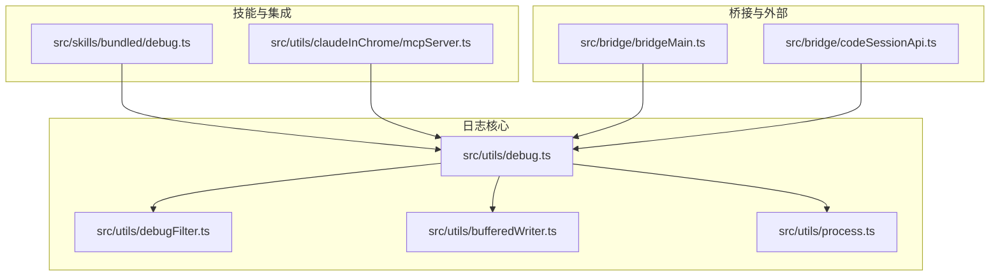
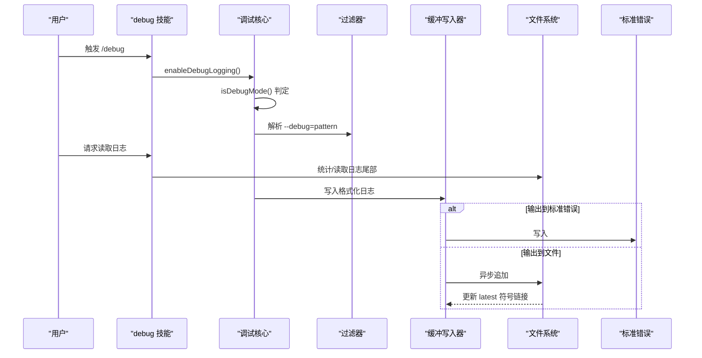
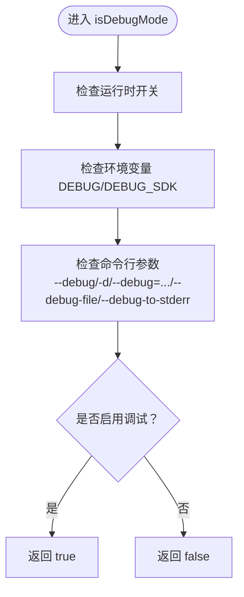
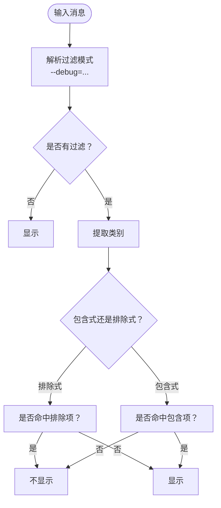
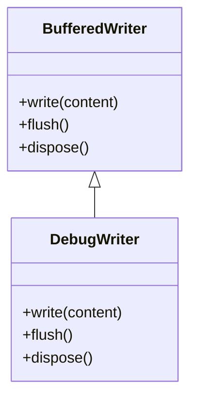
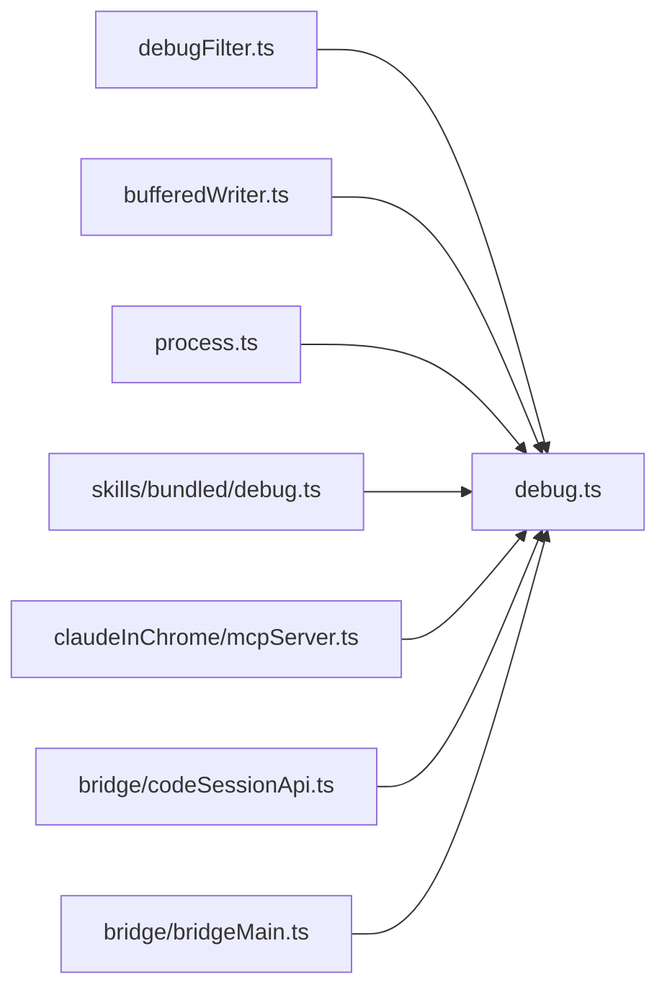

# 调试工具与技术

<cite>
**本文引用的文件**
- [src/utils/debug.ts](file://src/utils/debug.ts)
- [src/utils/debugFilter.ts](file://src/utils/debugFilter.ts)
- [src/utils/bufferedWriter.ts](file://src/utils/bufferedWriter.ts)
- [src/utils/process.ts](file://src/utils/process.ts)
- [src/skills/bundled/debug.ts](file://src/skills/bundled/debug.ts)
- [src/utils/claudeInChrome/mcpServer.ts](file://src/utils/claudeInChrome/mcpServer.ts)
- [src/bridge/bridgeMain.ts](file://src/bridge/bridgeMain.ts)
- [src/bridge/codeSessionApi.ts](file://src/bridge/codeSessionApi.ts)
- [src/utils/sessionStorage.ts](file://src/utils/sessionStorage.ts)
- [src/utils/diagLogs.ts](file://src/utils/diagLogs.ts)
</cite>

## 目录
1. [简介](#简介)
2. [项目结构](#项目结构)
3. [核心组件](#核心组件)
4. [架构总览](#架构总览)
5. [详细组件分析](#详细组件分析)
6. [依赖关系分析](#依赖关系分析)
7. [性能考量](#性能考量)
8. [故障排查指南](#故障排查指南)
9. [结论](#结论)
10. [附录](#附录)

## 简介
本文件系统性阐述 Claude Code 的调试系统架构与实现细节，覆盖调试日志级别控制（verbose/debug/info/warn/error）、调试过滤器机制、调试输出重定向到标准错误、命令行与环境变量启用方式、日志文件组织与符号链接管理、缓冲写入与性能优化策略，并提供典型调试场景与最佳实践。

## 项目结构
调试系统主要由以下模块构成：
- 日志核心：负责日志级别、过滤、输出目标选择、文件路径与符号链接维护
- 过滤器：解析命令行过滤模式，提取消息类别并进行包含/排除判定
- 缓冲写入器：在非调试模式下进行批量异步写入，避免阻塞主流程
- 输出路由：支持标准错误直出与文件落盘
- 技能集成：内置“debug”技能用于读取当前会话日志并辅助诊断
- 桥接与外部交互：桥接进程参数解析、远程会话创建过程中的调试记录

**图表来源**
- [src/utils/debug.ts:1-269](file://src/utils/debug.ts#L1-L269)
- [src/utils/debugFilter.ts:1-158](file://src/utils/debugFilter.ts#L1-L158)
- [src/utils/bufferedWriter.ts:1-101](file://src/utils/bufferedWriter.ts#L1-L101)
- [src/utils/process.ts:1-69](file://src/utils/process.ts#L1-L69)
- [src/skills/bundled/debug.ts:1-104](file://src/skills/bundled/debug.ts#L1-L104)
- [src/utils/claudeInChrome/mcpServer.ts:277-293](file://src/utils/claudeInChrome/mcpServer.ts#L277-L293)
- [src/bridge/bridgeMain.ts:1751-1785](file://src/bridge/bridgeMain.ts#L1751-L1785)
- [src/bridge/codeSessionApi.ts:26-61](file://src/bridge/codeSessionApi.ts#L26-L61)

**章节来源**
- [src/utils/debug.ts:1-269](file://src/utils/debug.ts#L1-L269)
- [src/utils/debugFilter.ts:1-158](file://src/utils/debugFilter.ts#L1-L158)
- [src/utils/bufferedWriter.ts:1-101](file://src/utils/bufferedWriter.ts#L1-L101)
- [src/utils/process.ts:1-69](file://src/utils/process.ts#L1-L69)
- [src/skills/bundled/debug.ts:1-104](file://src/skills/bundled/debug.ts#L1-L104)
- [src/utils/claudeInChrome/mcpServer.ts:277-293](file://src/utils/claudeInChrome/mcpServer.ts#L277-L293)
- [src/bridge/bridgeMain.ts:1751-1785](file://src/bridge/bridgeMain.ts#L1751-L1785)
- [src/bridge/codeSessionApi.ts:26-61](file://src/bridge/codeSessionApi.ts#L26-L61)

## 核心组件
- 调试日志核心
  - 日志级别：verbose/debug/info/warn/error，受环境变量 CLAUDE_CODE_DEBUG_LOG_LEVEL 控制最小级别
  - 启用条件：命令行 --debug/-d、--debug=pattern、--debug-file、--debug-to-stderr/-d2e、环境变量 DEBUG/DEBUG_SDK、运行时 enableDebugLogging
  - 输出目标：默认写入文件；当 --debug-to-stderr 或 -d2e 时写入标准错误
  - 文件组织：默认位于配置目录下的 debug 子目录，按会话 ID 命名；同时维护“latest”符号链接指向最新日志
- 调试过滤器
  - 支持包含式与排除式两种模式，通过逗号分隔的类别列表匹配
  - 自动从消息中抽取类别（前缀、方括号、MCP 服务器名、特定关键词等）
  - 不允许混用包含与排除模式，若检测到则视为无效
- 缓冲写入器
  - 非调试模式下每秒批量刷新，最大缓冲条数与字节限制，溢出即刻异步写出
  - 调试模式下立即同步写出，确保退出或崩溃时不会丢失关键信息
- 技能集成
  - 内置“debug”技能可启用调试并读取当前会话日志尾部内容，辅助定位问题

**章节来源**
- [src/utils/debug.ts:18-40](file://src/utils/debug.ts#L18-L40)
- [src/utils/debug.ts:44-102](file://src/utils/debug.ts#L44-L102)
- [src/utils/debug.ts:104-125](file://src/utils/debug.ts#L104-L125)
- [src/utils/debug.ts:155-196](file://src/utils/debug.ts#L155-L196)
- [src/utils/debug.ts:203-228](file://src/utils/debug.ts#L203-L228)
- [src/utils/debug.ts:230-236](file://src/utils/debug.ts#L230-L236)
- [src/utils/debug.ts:242-253](file://src/utils/debug.ts#L242-L253)
- [src/utils/debugFilter.ts:16-53](file://src/utils/debugFilter.ts#L16-L53)
- [src/utils/debugFilter.ts:65-108](file://src/utils/debugFilter.ts#L65-L108)
- [src/utils/debugFilter.ts:116-139](file://src/utils/debugFilter.ts#L116-L139)
- [src/utils/debugFilter.ts:145-157](file://src/utils/debugFilter.ts#L145-L157)
- [src/utils/bufferedWriter.ts:9-101](file://src/utils/bufferedWriter.ts#L9-L101)
- [src/skills/bundled/debug.ts:25-101](file://src/skills/bundled/debug.ts#L25-L101)

## 架构总览
调试系统围绕“日志核心”展开，通过“过滤器”决定是否输出，“缓冲写入器”在不同模式下选择同步或异步写入，“输出路由”将日志发送至文件或标准错误。“技能集成”提供用户入口以启用并读取日志。

**图表来源**
- [src/skills/bundled/debug.ts:25-101](file://src/skills/bundled/debug.ts#L25-L101)
- [src/utils/debug.ts:44-102](file://src/utils/debug.ts#L44-L102)
- [src/utils/debug.ts:155-196](file://src/utils/debug.ts#L155-L196)
- [src/utils/debugFilter.ts:16-53](file://src/utils/debugFilter.ts#L16-L53)

## 详细组件分析

### 日志核心与命令行/环境变量
- 启用方式
  - 命令行：--debug、-d、--debug=pattern、--debug-file、--debug-file=路径、--debug-to-stderr、-d2e
  - 环境变量：DEBUG、DEBUG_SDK、CLAUDE_CODE_DEBUG_LOG_LEVEL
  - 运行时：enableDebugLogging() 可在会话中动态开启
- 日志级别
  - verbose < debug < info < warn < error
  - 通过 CLAUDE_CODE_DEBUG_LOG_LEVEL 设置最小级别，低于该级别的日志被过滤
- 输出目标
  - --debug-to-stderr/-d2e：直接写入标准错误
  - 默认：写入文件，路径优先级为 --debug-file > 环境变量 > 会话 ID 命名的默认路径
- 符号链接
  - 自动维护“latest”符号链接指向当前日志文件，便于快速访问

**图表来源**
- [src/utils/debug.ts:44-102](file://src/utils/debug.ts#L44-L102)

**章节来源**
- [src/utils/debug.ts:44-102](file://src/utils/debug.ts#L44-L102)
- [src/utils/debug.ts:18-40](file://src/utils/debug.ts#L18-L40)
- [src/utils/debug.ts:203-228](file://src/utils/debug.ts#L203-L228)
- [src/utils/debug.ts:230-236](file://src/utils/debug.ts#L230-L236)
- [src/utils/debug.ts:242-253](file://src/utils/debug.ts#L242-L253)

### 调试过滤器机制
- 模式解析
  - 包含式：如 "api,hooks"，仅显示包含在列表中的类别
  - 排除式：如 "!1p,!file"，排除列表中的类别
  - 不允许混用；若混用，视为无过滤
- 类别提取
  - 支持多种消息格式自动识别类别，如前缀冒号、方括号、MCP 服务器名、特定关键词等
  - 提取后统一小写并去重
- 显示判定
  - 无过滤：全部显示
  - 有过滤：根据模式与类别集合判断

**图表来源**
- [src/utils/debugFilter.ts:16-53](file://src/utils/debugFilter.ts#L16-L53)
- [src/utils/debugFilter.ts:65-108](file://src/utils/debugFilter.ts#L65-L108)
- [src/utils/debugFilter.ts:116-139](file://src/utils/debugFilter.ts#L116-L139)
- [src/utils/debugFilter.ts:145-157](file://src/utils/debugFilter.ts#L145-L157)

**章节来源**
- [src/utils/debugFilter.ts:16-53](file://src/utils/debugFilter.ts#L16-L53)
- [src/utils/debugFilter.ts:65-108](file://src/utils/debugFilter.ts#L65-L108)
- [src/utils/debugFilter.ts:116-139](file://src/utils/debugFilter.ts#L116-L139)
- [src/utils/debugFilter.ts:145-157](file://src/utils/debugFilter.ts#L145-L157)

### 缓冲写入与性能优化
- 非调试模式（ants）：每秒批量刷新，最大缓冲条数与字节阈值，溢出即刻异步写出，避免阻塞渲染与交互
- 调试模式：立即同步写出，保证进程退出或崩溃时不会丢失关键日志
- 清理钩子：注册退出清理，确保最后一批缓冲被刷新

**图表来源**
- [src/utils/bufferedWriter.ts:9-101](file://src/utils/bufferedWriter.ts#L9-L101)
- [src/utils/debug.ts:155-196](file://src/utils/debug.ts#L155-L196)

**章节来源**
- [src/utils/bufferedWriter.ts:9-101](file://src/utils/bufferedWriter.ts#L9-L101)
- [src/utils/debug.ts:155-196](file://src/utils/debug.ts#L155-L196)

### 输出重定向到标准错误
- 当 --debug-to-stderr/-d2e 或 isDebugToStdErr() 为真时，日志直接写入标准错误
- 使用统一的 writeToStderr 封装，处理 EPIPE 等异常，避免管道断开导致的内存泄漏

**章节来源**
- [src/utils/debug.ts:85-89](file://src/utils/debug.ts#L85-L89)
- [src/utils/debug.ts:222-224](file://src/utils/debug.ts#L222-L224)
- [src/utils/process.ts:12-34](file://src/utils/process.ts#L12-L34)

### 日志文件组织与符号链接管理
- 默认路径：配置目录/debug/<会话ID>.txt
- 覆盖方式：--debug-file 显式指定路径
- 最新日志：维护“latest”符号链接，便于快速定位
- 读取策略：debug 技能采用尾部读取，避免全量读取导致内存占用过高

**章节来源**
- [src/utils/debug.ts:230-236](file://src/utils/debug.ts#L230-L236)
- [src/utils/debug.ts:242-253](file://src/utils/debug.ts#L242-L253)
- [src/skills/bundled/debug.ts:31-64](file://src/skills/bundled/debug.ts#L31-L64)

### 外部集成与桥接参数
- 桥接进程支持 --verbose/-v、--debug-file、--session-timeout、--permission-mode 等参数解析
- 远程会话创建失败时记录调试日志，便于定位网络或鉴权问题

**章节来源**
- [src/bridge/bridgeMain.ts:1751-1785](file://src/bridge/bridgeMain.ts#L1751-L1785)
- [src/bridge/codeSessionApi.ts:26-61](file://src/bridge/codeSessionApi.ts#L26-L61)

### 类别化日志记录示例
- MCP 服务器日志：通过 DebugLogger 将各类别映射为 debug/info/warn/error 并交由 logForDebugging 记录
- 会话存储加载失败：在日志中记录具体文件路径以便定位

**章节来源**
- [src/utils/claudeInChrome/mcpServer.ts:277-293](file://src/utils/claudeInChrome/mcpServer.ts#L277-L293)
- [src/utils/sessionStorage.ts:4720-4726](file://src/utils/sessionStorage.ts#L4720-L4726)

## 依赖关系分析
- debug.ts 依赖 debugFilter.ts 进行过滤，依赖 bufferedWriter.ts 进行写入，依赖 process.ts 进行标准错误输出，依赖环境与会话状态确定路径
- debugFilter.ts 为纯函数，依赖 memoize 进行缓存
- bufferedWriter.ts 为通用缓冲写入器，被 debug.ts 复用
- skills/bundled/debug.ts 依赖 debug.ts 启用与读取日志
- 其他模块（如桥接、会话 API）在异常路径调用 logForDebugging 记录上下文

**图表来源**
- [src/utils/debug.ts:1-20](file://src/utils/debug.ts#L1-L20)
- [src/utils/debugFilter.ts:1-10](file://src/utils/debugFilter.ts#L1-L10)
- [src/utils/bufferedWriter.ts:1-10](file://src/utils/bufferedWriter.ts#L1-L10)
- [src/utils/process.ts:1-15](file://src/utils/process.ts#L1-L15)
- [src/skills/bundled/debug.ts:1-10](file://src/skills/bundled/debug.ts#L1-L10)
- [src/utils/claudeInChrome/mcpServer.ts:277-293](file://src/utils/claudeInChrome/mcpServer.ts#L277-L293)
- [src/bridge/codeSessionApi.ts:26-61](file://src/bridge/codeSessionApi.ts#L26-L61)
- [src/bridge/bridgeMain.ts:1751-1785](file://src/bridge/bridgeMain.ts#L1751-L1785)

**章节来源**
- [src/utils/debug.ts:1-20](file://src/utils/debug.ts#L1-L20)
- [src/utils/debugFilter.ts:1-10](file://src/utils/debugFilter.ts#L1-L10)
- [src/utils/bufferedWriter.ts:1-10](file://src/utils/bufferedWriter.ts#L1-L10)
- [src/utils/process.ts:1-15](file://src/utils/process.ts#L1-L15)
- [src/skills/bundled/debug.ts:1-10](file://src/skills/bundled/debug.ts#L1-L10)
- [src/utils/claudeInChrome/mcpServer.ts:277-293](file://src/utils/claudeInChrome/mcpServer.ts#L277-L293)
- [src/bridge/codeSessionApi.ts:26-61](file://src/bridge/codeSessionApi.ts#L26-L61)
- [src/bridge/bridgeMain.ts:1751-1785](file://src/bridge/bridgeMain.ts#L1751-L1785)

## 性能考量
- 批量写入：非调试模式下 1 秒批量刷新，降低磁盘写放大
- 溢出即刻写出：超过缓冲上限时立即异步写出，避免事件循环被长时间任务占用
- 同步写出：调试模式下强制同步写出，确保关键信息不丢失
- 尾部读取：debug 技能仅读取日志尾部，避免长会话导致的内存峰值
- EPIPE 处理：标准输出/错误流断开时主动销毁，防止内存泄漏

**章节来源**
- [src/utils/bufferedWriter.ts:49-94](file://src/utils/bufferedWriter.ts#L49-L94)
- [src/utils/debug.ts:164-188](file://src/utils/debug.ts#L164-L188)
- [src/skills/bundled/debug.ts:31-64](file://src/skills/bundled/debug.ts#L31-L64)
- [src/utils/process.ts:12-15](file://src/utils/process.ts#L12-L15)

## 故障排查指南
- 如何启用调试
  - 命令行：claude --debug 或 claude --debug=api,hooks 或 claude --debug-to-stderr
  - 环境变量：DEBUG=1 或 DEBUG_SDK=1
  - 运行时：在会话内触发 /debug 技能
- 如何查看日志
  - 默认路径：~/.claude/debug/<会话ID>.txt
  - 最新日志：~/.claude/debug/latest
  - 技能读取：/debug 技能会读取最近若干行并提示用户复现问题
- 常见问题
  - 日志未生成：确认非 ants 用户已在启动时添加 --debug 或运行 /debug 启用
  - 过滤无效：检查是否混用包含与排除模式；建议只使用一种模式
  - 管道断开：stdout/stderr 出现 EPIPE 时会自动处理，避免内存泄漏
  - 权限问题：桥接参数 --permission-mode 可调整权限策略；远程会话创建失败时查看调试日志中的错误码与详情
- 诊断技巧
  - 使用 --debug-to-stderr 快速在终端查看实时日志
  - 使用 --debug-file 指定固定路径，便于收集与分享
  - 在日志中搜索 [ERROR]、[WARN]、MCP 服务器名等关键字定位问题

**章节来源**
- [src/utils/debug.ts:44-102](file://src/utils/debug.ts#L44-L102)
- [src/utils/debug.ts:230-236](file://src/utils/debug.ts#L230-L236)
- [src/utils/debug.ts:242-253](file://src/utils/debug.ts#L242-L253)
- [src/skills/bundled/debug.ts:25-101](file://src/skills/bundled/debug.ts#L25-L101)
- [src/utils/process.ts:12-15](file://src/utils/process.ts#L12-L15)
- [src/bridge/bridgeMain.ts:1751-1785](file://src/bridge/bridgeMain.ts#L1751-L1785)
- [src/bridge/codeSessionApi.ts:26-61](file://src/bridge/codeSessionApi.ts#L26-L61)

## 结论
该调试系统通过“级别控制 + 过滤器 + 缓冲写入 + 输出路由”的组合，在保证性能的同时提供了强大的可观测性。其设计兼顾了开发期的高粒度日志与生产期的低开销输出，配合符号链接与技能读取，使得问题定位更高效、更安全。

## 附录
- 实际调试场景示例
  - 会话问题：使用 /debug 技能启用日志，复现问题后读取尾部日志，关注 [ERROR]、[WARN] 与 MCP 服务器名
  - 工具执行问题：结合 --debug=tools 或 --debug-file 定位工具调用链路
  - 权限相关问题：通过桥接参数 --permission-mode 与远程会话创建失败日志排查