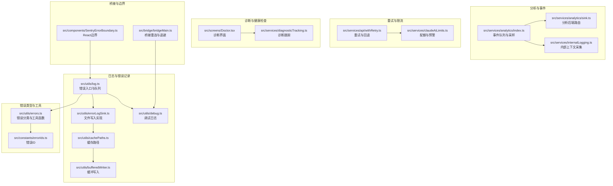
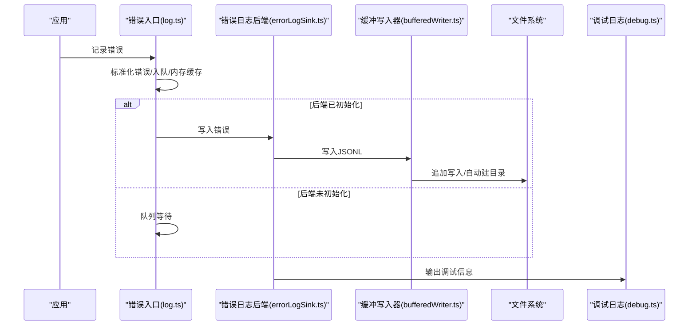
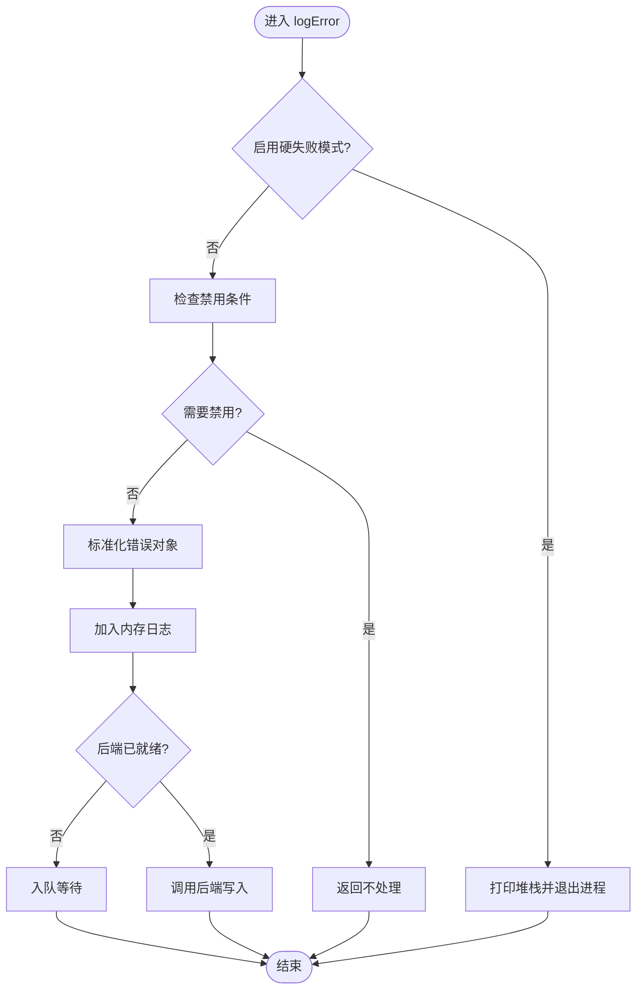
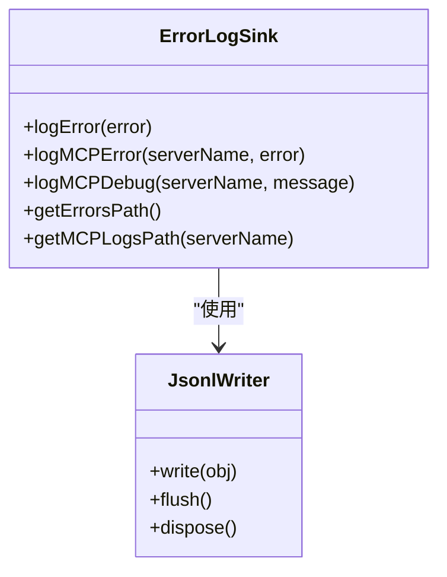
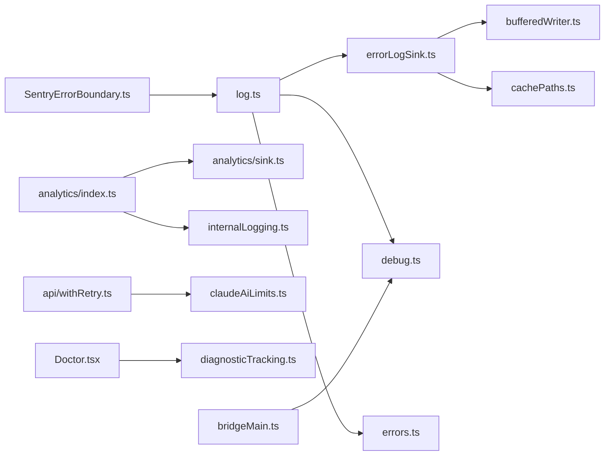
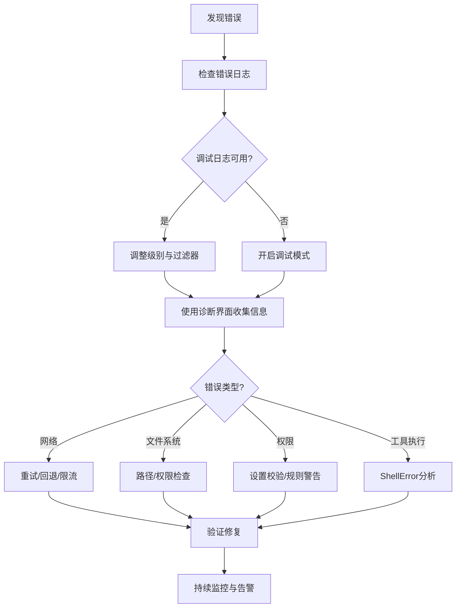

# 错误处理与诊断

<cite>
**本文档引用的文件**
- [src/utils/log.ts](file://src/utils/log.ts)
- [src/utils/errorLogSink.ts](file://src/utils/errorLogSink.ts)
- [src/utils/errors.ts](file://src/utils/errors.ts)
- [src/utils/cachePaths.ts](file://src/utils/cachePaths.ts)
- [src/utils/bufferedWriter.ts](file://src/utils/bufferedWriter.ts)
- [src/utils/debug.ts](file://src/utils/debug.ts)
- [src/services/internalLogging.ts](file://src/services/internalLogging.ts)
- [src/services/analytics/sink.ts](file://src/services/analytics/sink.ts)
- [src/services/analytics/index.ts](file://src/services/analytics/index.ts)
- [src/services/api/withRetry.ts](file://src/services/api/withRetry.ts)
- [src/services/claudeAiLimits.ts](file://src/services/claudeAiLimits.ts)
- [src/screens/Doctor.tsx](file://src/screens/Doctor.tsx)
- [src/services/diagnosticTracking.ts](file://src/services/diagnosticTracking.ts)
- [src/constants/errorIds.ts](file://src/constants/errorIds.ts)
- [src/bridge/bridgeMain.ts](file://src/bridge/bridgeMain.ts)
- [src/components/SentryErrorBoundary.ts](file://src/components/SentryErrorBoundary.ts)
</cite>

## 目录
1. [简介](#简介)
2. [项目结构](#项目结构)
3. [核心组件](#核心组件)
4. [架构总览](#架构总览)
5. [详细组件分析](#详细组件分析)
6. [依赖关系分析](#依赖关系分析)
7. [性能考量](#性能考量)
8. [故障排查指南](#故障排查指南)
9. [结论](#结论)
10. [附录](#附录)

## 简介
本文件系统性阐述 Claude Code 的错误处理与诊断体系，覆盖错误分类、传播路径、恢复策略、日志记录、诊断工具与方法、监控与告警机制，以及常见错误场景的诊断流程与解决步骤。目标是帮助开发者与运维人员快速定位问题、理解错误来源、优化错误处理策略，并建立可持续的错误监控与告警闭环。

## 项目结构
错误处理与诊断相关代码主要分布在以下模块：
- 日志与错误记录：src/utils/log.ts、src/utils/errorLogSink.ts、src/utils/cachePaths.ts、src/utils/bufferedWriter.ts、src/utils/debug.ts
- 错误类型与工具：src/utils/errors.ts、src/constants/errorIds.ts
- 分析与事件：src/services/analytics/sink.ts、src/services/analytics/index.ts、src/services/internalLogging.ts
- 重试与限流：src/services/api/withRetry.ts、src/services/claudeAiLimits.ts
- 诊断与健康检查：src/screens/Doctor.tsx、src/services/diagnosticTracking.ts
- 桥接层与边界：src/bridge/bridgeMain.ts、src/components/SentryErrorBoundary.ts

**图表来源**
- [src/utils/log.ts:96-223](file://src/utils/log.ts#L96-L223)
- [src/utils/errorLogSink.ts:24-235](file://src/utils/errorLogSink.ts#L24-L235)
- [src/utils/cachePaths.ts:25-38](file://src/utils/cachePaths.ts#L25-L38)
- [src/utils/bufferedWriter.ts:9-100](file://src/utils/bufferedWriter.ts#L9-L100)
- [src/utils/debug.ts:18-269](file://src/utils/debug.ts#L18-L269)
- [src/utils/errors.ts:1-239](file://src/utils/errors.ts#L1-L239)
- [src/constants/errorIds.ts:1-16](file://src/constants/errorIds.ts#L1-L16)
- [src/services/analytics/sink.ts:1-114](file://src/services/analytics/sink.ts#L1-L114)
- [src/services/analytics/index.ts:125-173](file://src/services/analytics/index.ts#L125-L173)
- [src/services/internalLogging.ts:1-91](file://src/services/internalLogging.ts#L1-L91)
- [src/services/api/withRetry.ts:36-48](file://src/services/api/withRetry.ts#L36-L48)
- [src/services/claudeAiLimits.ts:43-374](file://src/services/claudeAiLimits.ts#L43-L374)
- [src/screens/Doctor.tsx:100-502](file://src/screens/Doctor.tsx#L100-L502)
- [src/services/diagnosticTracking.ts:30-343](file://src/services/diagnosticTracking.ts#L30-L343)
- [src/bridge/bridgeMain.ts:1314-1339](file://src/bridge/bridgeMain.ts#L1314-L1339)
- [src/components/SentryErrorBoundary.ts:1-28](file://src/components/SentryErrorBoundary.ts#L1-L28)

**章节来源**
- [src/utils/log.ts:96-223](file://src/utils/log.ts#L96-L223)
- [src/utils/errorLogSink.ts:24-235](file://src/utils/errorLogSink.ts#L24-L235)
- [src/utils/cachePaths.ts:25-38](file://src/utils/cachePaths.ts#L25-L38)
- [src/utils/bufferedWriter.ts:9-100](file://src/utils/bufferedWriter.ts#L9-L100)
- [src/utils/debug.ts:18-269](file://src/utils/debug.ts#L18-L269)
- [src/utils/errors.ts:1-239](file://src/utils/errors.ts#L1-L239)
- [src/constants/errorIds.ts:1-16](file://src/constants/errorIds.ts#L1-L16)
- [src/services/analytics/sink.ts:1-114](file://src/services/analytics/sink.ts#L1-L114)
- [src/services/analytics/index.ts:125-173](file://src/services/analytics/index.ts#L125-L173)
- [src/services/internalLogging.ts:1-91](file://src/services/internalLogging.ts#L1-L91)
- [src/services/api/withRetry.ts:36-48](file://src/services/api/withRetry.ts#L36-L48)
- [src/services/claudeAiLimits.ts:43-374](file://src/services/claudeAiLimits.ts#L43-L374)
- [src/screens/Doctor.tsx:100-502](file://src/screens/Doctor.tsx#L100-L502)
- [src/services/diagnosticTracking.ts:30-343](file://src/services/diagnosticTracking.ts#L30-L343)
- [src/bridge/bridgeMain.ts:1314-1339](file://src/bridge/bridgeMain.ts#L1314-L1339)
- [src/components/SentryErrorBoundary.ts:1-28](file://src/components/SentryErrorBoundary.ts#L1-L28)

## 核心组件
- 错误入口与队列：统一错误入口，支持延迟初始化、队列与硬失败模式。
- 文件错误日志：基于缓冲写入的 JSONL 文件，自动目录创建与清理注册。
- 缓冲写入器：异步批量写入，溢出即刻落盘，避免阻塞主线程。
- 调试日志：可配置最小级别、过滤器、输出到标准错误或文件，并维护最新日志软链。
- 错误类型与工具：定义通用错误类、文件系统错误识别、HTTP 错误分类、短栈追踪等。
- 分析与事件：事件队列、采样与后端路由；内部上下文采集（命名空间、容器ID）。
- 重试与限流：指数退避、模型回退、配额预警与阈值检测。
- 诊断与健康检查：诊断界面聚合环境、版本、锁、插件、代理等信息；诊断跟踪服务。
- 桥接层与边界：桥接连接错误退避与心跳；React 错误边界。

**章节来源**
- [src/utils/log.ts:96-223](file://src/utils/log.ts#L96-L223)
- [src/utils/errorLogSink.ts:24-235](file://src/utils/errorLogSink.ts#L24-L235)
- [src/utils/bufferedWriter.ts:9-100](file://src/utils/bufferedWriter.ts#L9-L100)
- [src/utils/debug.ts:18-269](file://src/utils/debug.ts#L18-L269)
- [src/utils/errors.ts:1-239](file://src/utils/errors.ts#L1-L239)
- [src/services/analytics/index.ts:125-173](file://src/services/analytics/index.ts#L125-L173)
- [src/services/analytics/sink.ts:1-114](file://src/services/analytics/sink.ts#L1-L114)
- [src/services/internalLogging.ts:1-91](file://src/services/internalLogging.ts#L1-L91)
- [src/services/api/withRetry.ts:120-168](file://src/services/api/withRetry.ts#L120-L168)
- [src/services/claudeAiLimits.ts:43-374](file://src/services/claudeAiLimits.ts#L43-L374)
- [src/screens/Doctor.tsx:100-502](file://src/screens/Doctor.tsx#L100-L502)
- [src/services/diagnosticTracking.ts:30-343](file://src/services/diagnosticTracking.ts#L30-L343)
- [src/bridge/bridgeMain.ts:1314-1339](file://src/bridge/bridgeMain.ts#L1314-L1339)
- [src/components/SentryErrorBoundary.ts:1-28](file://src/components/SentryErrorBoundary.ts#L1-L28)

## 架构总览
错误处理与诊断的整体流程如下：
- 应用启动时初始化分析与错误日志后端，确保事件与错误持久化。
- 全局错误入口负责标准化错误对象、入队、内存缓存与条件上报。
- 错误日志后端将错误写入 JSONL 文件，调试日志按级别与过滤规则输出。
- 诊断界面与诊断跟踪服务提供运行时状态与诊断信息聚合。
- API 层通过重试与回退策略提升稳定性，限流与预警保障资源使用健康。
- 桥接层在连接异常时采用指数退避与心跳维持可用性。

**图表来源**
- [src/utils/log.ts:96-223](file://src/utils/log.ts#L96-L223)
- [src/utils/errorLogSink.ts:85-126](file://src/utils/errorLogSink.ts#L85-L126)
- [src/utils/bufferedWriter.ts:82-99](file://src/utils/bufferedWriter.ts#L82-L99)
- [src/utils/debug.ts:203-228](file://src/utils/debug.ts#L203-L228)

**章节来源**
- [src/utils/log.ts:96-223](file://src/utils/log.ts#L96-L223)
- [src/utils/errorLogSink.ts:85-126](file://src/utils/errorLogSink.ts#L85-L126)
- [src/utils/bufferedWriter.ts:82-99](file://src/utils/bufferedWriter.ts#L82-L99)
- [src/utils/debug.ts:203-228](file://src/utils/debug.ts#L203-L228)

## 详细组件分析

### 错误入口与队列（log.ts）
- 统一错误入口，支持硬失败模式（HARD_FAIL），在特定环境下直接退出进程。
- 条件上报：云厂商环境变量、禁用开关、流量限制等会阻止错误上报。
- 内存日志：无依赖地维护最近错误列表，便于诊断与展示。
- 队列机制：后端未就绪时将事件入队，后端初始化后立即冲刷。

**图表来源**
- [src/utils/log.ts:158-203](file://src/utils/log.ts#L158-L203)

**章节来源**
- [src/utils/log.ts:96-223](file://src/utils/log.ts#L96-L223)

### 错误日志后端（errorLogSink.ts）
- 路径管理：按日期生成 JSONL 文件，支持 MCP 服务器独立日志。
- 写入实现：带缓冲的 JSONL 写入器，自动创建目录，失败时重试。
- 上下文增强：为 axios 错误附加 URL、状态码与服务器消息，便于定位。
- 会话与版本：记录会话ID、工作目录、版本号等上下文信息。

**图表来源**
- [src/utils/errorLogSink.ts:24-235](file://src/utils/errorLogSink.ts#L24-L235)

**章节来源**
- [src/utils/errorLogSink.ts:24-235](file://src/utils/errorLogSink.ts#L24-L235)
- [src/utils/cachePaths.ts:25-38](file://src/utils/cachePaths.ts#L25-L38)

### 缓冲写入器（bufferedWriter.ts）
- 异步批量写入：定时刷新与容量触发双重机制，溢出即刻落盘。
- 即时模式：在调试模式下同步写入，保证退出前数据不丢失。
- 清理注册：进程退出时确保缓冲区清空与句柄释放。

**章节来源**
- [src/utils/bufferedWriter.ts:9-100](file://src/utils/bufferedWriter.ts#L9-L100)

### 调试日志（debug.ts）
- 级别控制：verbose/debug/info/warn/error，可通过环境变量调整最小级别。
- 过滤器：支持命令行过滤模式，仅输出匹配的消息。
- 输出目标：可输出到标准错误或文件；维护“最新”日志软链便于查看。
- 动态开启：运行时可通过命令切换调试模式。

**章节来源**
- [src/utils/debug.ts:18-269](file://src/utils/debug.ts#L18-L269)

### 错误类型与工具（errors.ts）
- 错误分类：AbortError、ConfigParseError、ShellError、TeleportOperationError、TelemetrySafeError 等。
- 工具函数：判断中止错误、提取 errno 与路径、短栈追踪、HTTP 错误分类等。
- 文件系统错误识别：统一 ENOENT/EACCES/EPERM/ENOTDIR/ELOOP 判定。

**章节来源**
- [src/utils/errors.ts:1-239](file://src/utils/errors.ts#L1-L239)

### 分析与事件（analytics）
- 事件队列：未绑定后端时事件入队，后端就绪后冲刷。
- 后端路由：Datadog 与第一方事件日志路由，支持门控与采样。
- 内部上下文：采集 Kubernetes 命名空间、容器ID与权限上下文，用于内部审计。

**章节来源**
- [src/services/analytics/index.ts:125-173](file://src/services/analytics/index.ts#L125-L173)
- [src/services/analytics/sink.ts:1-114](file://src/services/analytics/sink.ts#L1-L114)
- [src/services/internalLogging.ts:1-91](file://src/services/internalLogging.ts#L1-L91)

### 重试与回退（withRetry.ts）
- 重试上下文：模型、思考配置、快速模式等。
- 错误类型：CannotRetryError（携带原栈）、FallbackTriggeredError（模型回退）。
- 退避策略：指数退避、并发 529 计数、信号中断支持。

**章节来源**
- [src/services/api/withRetry.ts:120-168](file://src/services/api/withRetry.ts#L120-L168)

### 配额与预警（claudeAiLimits.ts）
- 早期预警：基于头部阈值与时间相对阈值两种方式检测。
- 阈值配置：五小时与七日窗口多级阈值，支持统一回退可用性标记。
- 显示名称映射：将内部类型映射为用户可读名称。

**章节来源**
- [src/services/claudeAiLimits.ts:43-374](file://src/services/claudeAiLimits.ts#L43-L374)

### 诊断界面与诊断跟踪（Doctor.tsx、diagnosticTracking.ts）
- 诊断界面：汇总安装类型、版本、包管理器、更新通道、环境变量、版本锁、代理解析警告、设置校验、插件错误等。
- 诊断跟踪：对 LSP/IDE 诊断进行基线对比、变更检测与重置。

**章节来源**
- [src/screens/Doctor.tsx:100-502](file://src/screens/Doctor.tsx#L100-L502)
- [src/services/diagnosticTracking.ts:30-343](file://src/services/diagnosticTracking.ts#L30-L343)

### 桥接层与边界（bridgeMain.ts、SentryErrorBoundary.ts）
- 桥接重连：连接错误采用指数退避，带抖动与心跳维持租约。
- React 边界：捕获渲染错误，防止崩溃扩散。

**章节来源**
- [src/bridge/bridgeMain.ts:1314-1339](file://src/bridge/bridgeMain.ts#L1314-L1339)
- [src/components/SentryErrorBoundary.ts:1-28](file://src/components/SentryErrorBoundary.ts#L1-L28)

## 依赖关系分析
- 解耦设计：log.ts 无重型依赖，通过 attach 接口注入后端，避免循环导入。
- 缓冲与文件：errorLogSink.ts 依赖 bufferedWriter.ts 与缓存路径，确保高吞吐下的可靠性。
- 分析与日志：analytics 与 errorLogSink 独立存在，但共享“后端未就绪队列”的设计思想。
- 诊断与 UI：Doctor.tsx 聚合多源信息，与诊断跟踪服务协作。

**图表来源**
- [src/utils/log.ts:96-223](file://src/utils/log.ts#L96-L223)
- [src/utils/errorLogSink.ts:24-235](file://src/utils/errorLogSink.ts#L24-L235)
- [src/utils/bufferedWriter.ts:9-100](file://src/utils/bufferedWriter.ts#L9-L100)
- [src/utils/cachePaths.ts:25-38](file://src/utils/cachePaths.ts#L25-L38)
- [src/utils/debug.ts:18-269](file://src/utils/debug.ts#L18-L269)
- [src/utils/errors.ts:1-239](file://src/utils/errors.ts#L1-L239)
- [src/services/analytics/index.ts:125-173](file://src/services/analytics/index.ts#L125-L173)
- [src/services/analytics/sink.ts:1-114](file://src/services/analytics/sink.ts#L1-L114)
- [src/services/internalLogging.ts:1-91](file://src/services/internalLogging.ts#L1-L91)
- [src/services/api/withRetry.ts:36-48](file://src/services/api/withRetry.ts#L36-L48)
- [src/services/claudeAiLimits.ts:43-374](file://src/services/claudeAiLimits.ts#L43-L374)
- [src/screens/Doctor.tsx:100-502](file://src/screens/Doctor.tsx#L100-L502)
- [src/services/diagnosticTracking.ts:30-343](file://src/services/diagnosticTracking.ts#L30-L343)
- [src/bridge/bridgeMain.ts:1314-1339](file://src/bridge/bridgeMain.ts#L1314-L1339)
- [src/components/SentryErrorBoundary.ts:1-28](file://src/components/SentryErrorBoundary.ts#L1-L28)

**章节来源**
- [src/utils/log.ts:96-223](file://src/utils/log.ts#L96-L223)
- [src/utils/errorLogSink.ts:24-235](file://src/utils/errorLogSink.ts#L24-L235)
- [src/utils/bufferedWriter.ts:9-100](file://src/utils/bufferedWriter.ts#L9-L100)
- [src/utils/cachePaths.ts:25-38](file://src/utils/cachePaths.ts#L25-L38)
- [src/utils/debug.ts:18-269](file://src/utils/debug.ts#L18-L269)
- [src/utils/errors.ts:1-239](file://src/utils/errors.ts#L1-L239)
- [src/services/analytics/index.ts:125-173](file://src/services/analytics/index.ts#L125-L173)
- [src/services/analytics/sink.ts:1-114](file://src/services/analytics/sink.ts#L1-L114)
- [src/services/internalLogging.ts:1-91](file://src/services/internalLogging.ts#L1-L91)
- [src/services/api/withRetry.ts:36-48](file://src/services/api/withRetry.ts#L36-L48)
- [src/services/claudeAiLimits.ts:43-374](file://src/services/claudeAiLimits.ts#L43-L374)
- [src/screens/Doctor.tsx:100-502](file://src/screens/Doctor.tsx#L100-L502)
- [src/services/diagnosticTracking.ts:30-343](file://src/services/diagnosticTracking.ts#L30-L343)
- [src/bridge/bridgeMain.ts:1314-1339](file://src/bridge/bridgeMain.ts#L1314-L1339)
- [src/components/SentryErrorBoundary.ts:1-28](file://src/components/SentryErrorBoundary.ts#L1-L28)

## 性能考量
- 缓冲写入：通过批量与溢出即刻落盘降低磁盘压力，避免阻塞 UI 或渲染。
- 异步与即时模式：在调试模式下同步写入，保证退出时数据完整；非调试模式异步批处理。
- 事件采样：分析事件支持动态采样，减少高基数事件对后端的压力。
- 限流与预警：客户端侧时间相对阈值与服务端头部阈值双通道预警，降低超配额风险。

[本节为通用指导，无需具体文件分析]

## 故障排查指南

### 错误日志与调试
- 查看错误日志：通过错误入口提供的加载与索引接口获取日志列表与内容。
- 调试日志：设置最小级别与过滤器，输出到标准错误或文件，维护“最新”日志软链便于定位。
- 错误上下文：axios 错误会自动附加 URL、状态与服务器消息，便于快速定位请求端点。

**章节来源**
- [src/utils/log.ts:209-223](file://src/utils/log.ts#L209-L223)
- [src/utils/debug.ts:203-269](file://src/utils/debug.ts#L203-L269)
- [src/utils/errorLogSink.ts:152-174](file://src/utils/errorLogSink.ts#L152-L174)

### 诊断界面与工具
- 使用诊断界面：检查安装类型、版本、包管理器、更新通道、环境变量、版本锁、代理解析、设置校验、插件错误等。
- 诊断跟踪：在查询开始时初始化，重置跟踪状态，比较诊断差异，定位变更。

**章节来源**
- [src/screens/Doctor.tsx:100-502](file://src/screens/Doctor.tsx#L100-L502)
- [src/services/diagnosticTracking.ts:30-343](file://src/services/diagnosticTracking.ts#L30-L343)

### 常见错误场景与处理策略
- 网络错误：通过 HTTP 错误分类区分认证、超时、网络拒绝与普通 HTTP 错误；结合重试与回退策略。
- 文件系统错误：统一 ENOENT/EACCES/EPERM/ENOTDIR/ELOOP 判定，区分预期“不存在/无访问”与意外错误。
- 权限错误：结合诊断界面中的权限规则警告与设置校验，定位权限不足或不可达路径。
- 工具执行错误：使用 ShellError 包装 stdout/stderr/code/interrupted 字段，便于回溯命令执行结果。
- 模型回退：当触发模型回退时，记录原始模型与回退模型，辅助定位模型兼容性问题。

**章节来源**
- [src/utils/errors.ts:197-239](file://src/utils/errors.ts#L197-L239)
- [src/services/api/withRetry.ts:120-168](file://src/services/api/withRetry.ts#L120-L168)
- [src/utils/errors.ts:51-61](file://src/utils/errors.ts#L51-L61)
- [src/screens/Doctor.tsx:464-479](file://src/screens/Doctor.tsx#L464-L479)

### 错误监控与告警
- 事件采样与路由：通过分析后端路由与门控，控制事件上报量与目标后端。
- 内部上下文：采集命名空间与容器ID，便于在内部审计与问题复现。
- 限流与预警：基于阈值与时间相对计算，提前预警潜在过载风险。

**章节来源**
- [src/services/analytics/sink.ts:1-114](file://src/services/analytics/sink.ts#L1-L114)
- [src/services/analytics/index.ts:125-173](file://src/services/analytics/index.ts#L125-L173)
- [src/services/internalLogging.ts:1-91](file://src/services/internalLogging.ts#L1-L91)
- [src/services/claudeAiLimits.ts:43-374](file://src/services/claudeAiLimits.ts#L43-L374)

### 诊断流程示例
- 步骤1：确认错误是否被错误入口捕获并写入日志。
- 步骤2：检查调试日志级别与过滤器，必要时开启调试模式。
- 步骤3：使用诊断界面收集环境、版本、锁、插件与代理信息。
- 步骤4：根据错误类型选择策略：网络/文件/权限/工具执行。
- 步骤5：结合重试与回退策略，观察限流与预警提示。
- 步骤6：桥接层出现连接错误时，检查退避与心跳配置。

[本图为概念流程图，无需图表来源]

## 结论
该系统通过“入口统一、后端可插拔、缓冲可靠、诊断完备”的设计，实现了从错误捕获、记录、分析到恢复与告警的全链路闭环。建议在生产环境中：
- 固化错误日志与调试日志的输出策略，确保关键信息可追溯。
- 合理配置重试与回退策略，避免雪崩效应。
- 使用诊断界面与诊断跟踪服务定期巡检，提前发现配置与权限问题。
- 建立基于阈值与趋势的监控告警，结合错误ID与会话ID快速定位根因。

[本节为总结性内容，无需具体文件分析]

## 附录

### 错误信息格式与存储位置
- 错误日志：按日期生成 JSONL 文件，位于缓存目录下的 errors 子目录。
- MCP 日志：按服务器名生成独立 JSONL 文件，位于 mcp-logs-{serverName} 目录。
- 调试日志：默认位于配置目录的 debug 子目录，维护“latest”软链指向当前会话日志。

**章节来源**
- [src/utils/cachePaths.ts:25-38](file://src/utils/cachePaths.ts#L25-L38)
- [src/utils/errorLogSink.ts:29-38](file://src/utils/errorLogSink.ts#L29-L38)
- [src/utils/debug.ts:230-253](file://src/utils/debug.ts#L230-L253)

### 错误ID与追踪
- 错误ID：用于在生产中追踪 logError() 调用来源，便于定位问题根因。
- 使用建议：为不同错误类型分配稳定ID，配合日志与会话ID进行关联分析。

**章节来源**
- [src/constants/errorIds.ts:1-16](file://src/constants/errorIds.ts#L1-L16)