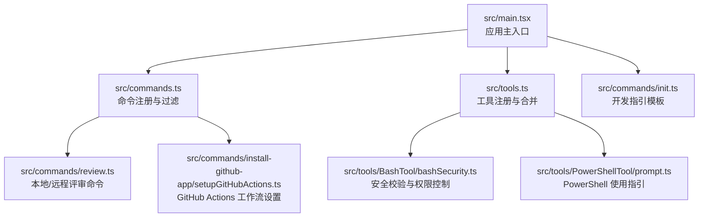
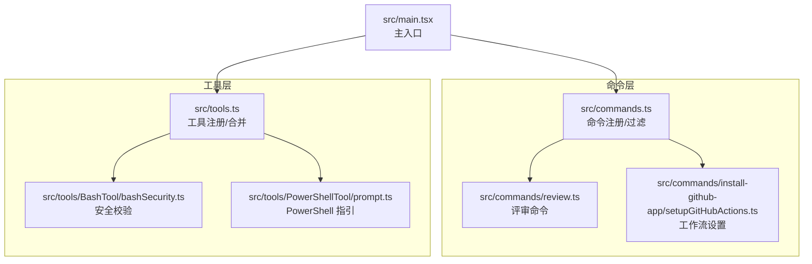
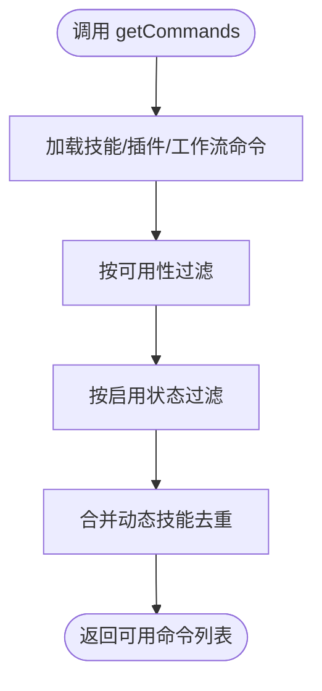
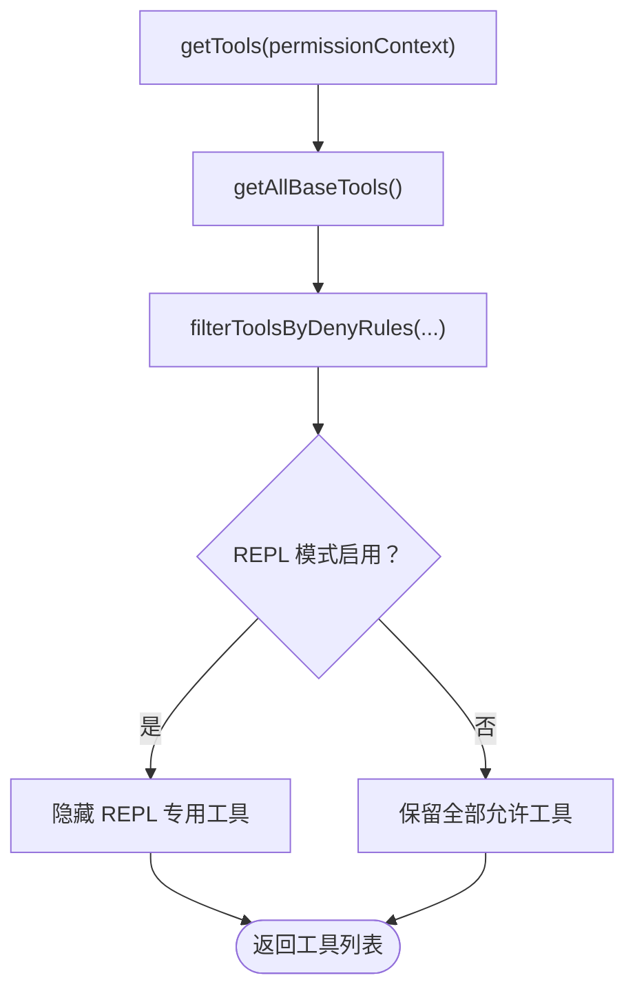
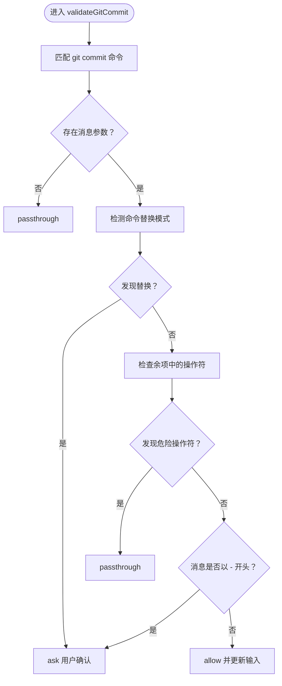
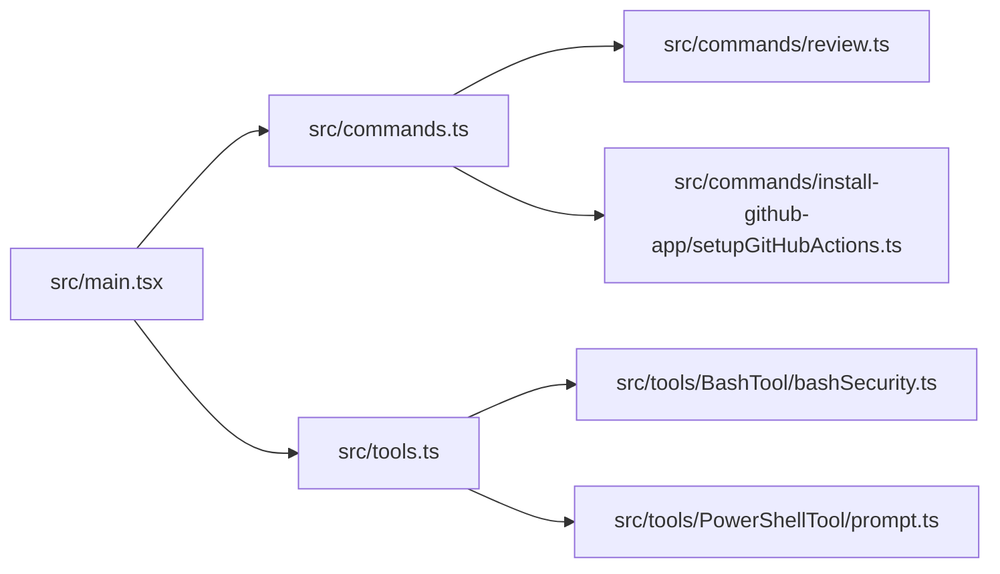

# 贡献指南

<cite>
**本文引用的文件**   
- [README.md](file://README.md)
- [package.json](file://package.json)
- [src/main.tsx](file://src/main.tsx)
- [src/commands.ts](file://src/commands.ts)
- [src/tools.ts](file://src/tools.ts)
- [src/commands/review.ts](file://src/commands/review.ts)
- [src/commands/install-github-app/setupGitHubActions.ts](file://src/commands/install-github-app/setupGitHubActions.ts)
- [src/tools/BashTool/bashSecurity.ts](file://src/tools/BashTool/bashSecurity.ts)
- [src/tools/PowerShellTool/prompt.ts](file://src/tools/PowerShellTool/prompt.ts)
- [src/commands/init.ts](file://src/commands/init.ts)
</cite>

## 目录
1. [简介](#简介)
2. [项目结构](#项目结构)
3. [核心组件](#核心组件)
4. [架构总览](#架构总览)
5. [详细组件分析](#详细组件分析)
6. [依赖分析](#依赖分析)
7. [性能考虑](#性能考虑)
8. [故障排查指南](#故障排查指南)
9. [结论](#结论)
10. [附录](#附录)

## 简介
本指南面向希望参与 Claude Code（非官方源码提取）项目的开发者，帮助你理解如何在该代码库中进行有效贡献。由于该项目为从官方 npm 包中提取的 TypeScript 源码，仓库明确标注仅供“教育与参考用途”，且所有代码为 Anthropic 的知识产权。请在遵守其许可条款的前提下使用。

本指南涵盖以下主题：
- 参与方式：代码贡献流程、问题报告、功能请求
- 编码规范与风格：TypeScript 规范、注释标准、安全校验要点
- 提交与评审：Fork 项目、创建分支、提交 PR、处理评审意见
- 新功能开发：新增工具、命令、技能与插件的建议路径
- 许可与法律：知识产权与使用限制提示

章节来源
- [README.md:116-120](file://README.md#L116-L120)

## 项目结构
该项目采用按职责分层的组织方式，主要目录与职责如下：
- src/cli：CLI 入口与参数解析
- src/commands：命令实现（如 review、install-github-app 等）
- src/components：终端 UI 组件（Ink/React）
- src/constants：常量与配置
- src/context：上下文管理
- src/hooks：React Hooks
- src/ink：终端 UI 框架封装
- src/services：核心服务（分析、OAuth、MCP、策略限制等）
- src/skills：技能定义
- src/tools：工具实现（文件编辑、搜索、终端执行等）
- src/types：类型定义
- src/utils：通用工具函数
- src/main.tsx：应用主入口

图示来源
- [src/main.tsx:585-800](file://src/main.tsx#L585-L800)
- [src/commands.ts:258-346](file://src/commands.ts#L258-L346)
- [src/tools.ts:193-390](file://src/tools.ts#L193-L390)
- [src/commands/review.ts:28-57](file://src/commands/review.ts#L28-L57)
- [src/commands/install-github-app/setupGitHubActions.ts:1-41](file://src/commands/install-github-app/setupGitHubActions.ts#L1-L41)
- [src/tools/BashTool/bashSecurity.ts:629-759](file://src/tools/BashTool/bashSecurity.ts#L629-L759)
- [src/tools/PowerShellTool/prompt.ts:137-145](file://src/tools/PowerShellTool/prompt.ts#L137-L145)
- [src/commands/init.ts:110-131](file://src/commands/init.ts#L110-L131)

章节来源
- [README.md:95-114](file://README.md#L95-L114)

## 核心组件
- 命令系统：集中注册与动态加载命令，支持按可用性与启用状态过滤；提供桥接安全命令集合与远程模式安全命令集合。
- 工具系统：内置工具清单与 MCP 工具合并，支持权限规则过滤与 REPL 模式下的工具隐藏。
- 安全与权限：Bash 工具的安全校验覆盖命令拼接、重定向、子命令替换等高危场景；PowerShell 提示强调安全实践。
- 主入口：初始化、延迟预取、入口点识别、URL 深链接处理、SSH/远程连接等。

章节来源
- [src/commands.ts:476-517](file://src/commands.ts#L476-L517)
- [src/tools.ts:271-327](file://src/tools.ts#L271-L327)
- [src/tools/BashTool/bashSecurity.ts:629-759](file://src/tools/BashTool/bashSecurity.ts#L629-L759)
- [src/tools/PowerShellTool/prompt.ts:137-145](file://src/tools/PowerShellTool/prompt.ts#L137-L145)
- [src/main.tsx:585-800](file://src/main.tsx#L585-L800)

## 架构总览
下图展示了命令与工具的装配与运行时关系，以及主入口对命令/工具加载的影响。

图示来源
- [src/commands.ts:258-346](file://src/commands.ts#L258-L346)
- [src/tools.ts:193-390](file://src/tools.ts#L193-L390)
- [src/main.tsx:585-800](file://src/main.tsx#L585-L800)

## 详细组件分析

### 命令系统（commands.ts）
- 动态加载：技能、插件、工作流命令统一由 getCommands 装配，支持可用性与启用状态过滤。
- 安全命令集：REMOTE_SAFE_COMMANDS 与 BRIDGE_SAFE_COMMANDS 明确远程/桥接安全命令范围。
- 描述格式化：formatDescriptionWithSource 用于 UI 展示来源信息。

图示来源
- [src/commands.ts:449-517](file://src/commands.ts#L449-L517)

章节来源
- [src/commands.ts:476-517](file://src/commands.ts#L476-L517)
- [src/commands.ts:619-686](file://src/commands.ts#L619-L686)
- [src/commands.ts:728-755](file://src/commands.ts#L728-L755)

### 工具系统（tools.ts）
- 工具装配：getAllBaseTools 返回基础工具集合，getTools 进一步按权限规则与 REPL 模式过滤。
- 合并与去重：assembleToolPool 将内置工具与 MCP 工具合并，保持提示缓存稳定性。
- 权限与安全：filterToolsByDenyRules 依据权限上下文屏蔽工具；Bash 安全校验覆盖重定向、子命令替换等。

图示来源
- [src/tools.ts:271-327](file://src/tools.ts#L271-L327)
- [src/tools.ts:345-367](file://src/tools.ts#L345-L367)

章节来源
- [src/tools.ts:193-390](file://src/tools.ts#L193-L390)
- [src/tools/BashTool/bashSecurity.ts:629-759](file://src/tools/BashTool/bashSecurity.ts#L629-L759)

### 安全与权限（Bash 工具）
- 关键风险点：命令拼接中的分号、管道、重定向、子命令替换（$()、反引号、${}）等。
- 防护策略：早期拦截、余项校验、引号内 <> 安全判断、禁止以短横开头的消息等。
- 审计日志：触发安全检查时记录事件，便于追踪与复盘。

图示来源
- [src/tools/BashTool/bashSecurity.ts:644-740](file://src/tools/BashTool/bashSecurity.ts#L644-L740)

章节来源
- [src/tools/BashTool/bashSecurity.ts:629-759](file://src/tools/BashTool/bashSecurity.ts#L629-L759)

### PowerShell 使用指引
- 强调不要在提示中直接使用换行分隔命令，避免误用。
- 对破坏性操作（如 reset --hard、强制推送、checkout）建议优先选择更安全替代方案。
- 不要跳过钩子或绕过签名，除非用户明确要求。

章节来源
- [src/tools/PowerShellTool/prompt.ts:137-145](file://src/tools/PowerShellTool/prompt.ts#L137-L145)

### 评审命令（review）
- review：本地评审命令，生成评审提示内容。
- ultrareview：远程模式下的高级评审入口，受特性开关控制。

章节来源
- [src/commands/review.ts:28-57](file://src/commands/review.ts#L28-L57)

### GitHub Actions 工作流设置
- 自动检测/创建工作流文件，支持密钥与文件 SHA 校验，避免重复创建。

章节来源
- [src/commands/install-github-app/setupGitHubActions.ts:17-41](file://src/commands/install-github-app/setupGitHubActions.ts#L17-L41)

### 开发指引模板（CLAUDE.md）
- init 命令生成的开发指引模板，强调避免重复信息与冗长教程，建议通过 @path/to/import 内联引用而非堆砌内容。

章节来源
- [src/commands/init.ts:110-131](file://src/commands/init.ts#L110-L131)

## 依赖分析
- 入口依赖：main.tsx 在启动阶段加载命令、工具、分析与策略限制等模块，随后进行延迟预取以优化首帧渲染。
- 命令与工具：commands.ts 与 tools.ts 作为装配中心，分别负责命令与工具的注册、过滤与合并。
- 外部集成：GitHub Actions 设置依赖 gh CLI 与 API；安全校验依赖正则与事件日志。

图示来源
- [src/main.tsx:585-800](file://src/main.tsx#L585-L800)
- [src/commands.ts:258-346](file://src/commands.ts#L258-L346)
- [src/tools.ts:193-390](file://src/tools.ts#L193-L390)

章节来源
- [src/main.tsx:585-800](file://src/main.tsx#L585-L800)
- [src/commands.ts:258-346](file://src/commands.ts#L258-L346)
- [src/tools.ts:193-390](file://src/tools.ts#L193-L390)

## 性能考虑
- 延迟预取：在首次渲染后进行非关键任务的异步预取，减少启动阻塞。
- 缓存与去重：命令与工具加载采用 memoize，避免重复 I/O；工具合并时按名称排序并去重，确保提示缓存稳定。
- 环境变量与特性开关：通过 feature 与环境变量控制死代码消除与条件导入，降低运行时开销。

章节来源
- [src/main.tsx:388-431](file://src/main.tsx#L388-L431)
- [src/commands.ts:449-469](file://src/commands.ts#L449-L469)
- [src/tools.ts:345-367](file://src/tools.ts#L345-L367)

## 故障排查指南
- 安全拦截与审计
  - Bash 安全校验会针对危险字符与模式触发 ask/passthrough/allow 行为，必要时引导用户确认或改写命令。
  - 触发安全检查时会记录事件，便于定位问题。
- PowerShell 指南
  - 避免在提示中使用换行分隔命令；对破坏性操作优先选择安全替代方案。
- 命令与工具不可用
  - 检查命令可用性与启用状态；确认权限上下文与 deny 规则未屏蔽工具；在 REPL 模式下注意工具可见性变化。

章节来源
- [src/tools/BashTool/bashSecurity.ts:629-759](file://src/tools/BashTool/bashSecurity.ts#L629-L759)
- [src/tools/PowerShellTool/prompt.ts:137-145](file://src/tools/PowerShellTool/prompt.ts#L137-L145)
- [src/commands.ts:417-443](file://src/commands.ts#L417-L443)
- [src/tools.ts:262-269](file://src/tools.ts#L262-L269)

## 结论
本指南基于现有源码梳理了命令与工具系统的装配逻辑、安全与权限控制、主入口初始化流程及常见问题排查方法。在参与贡献时，请严格遵循项目许可与使用限制，并结合本文档的流程与规范开展开发与评审。

## 附录

### 代码贡献流程（建议）
- 准备工作
  - Fork 仓库并在本地克隆。
  - 安装依赖并确保 Node 版本满足要求。
- 分支与提交
  - 基于主分支创建功能/修复分支。
  - 提交信息建议包含简要描述与变更摘要，遵循项目已有提交风格。
- 提交 PR
  - 保持 PR 单一目标，附带测试或说明。
  - 回应评审意见，必要时补充说明与修改。

章节来源
- [package.json:7-9](file://package.json#L7-L9)

### 问题报告与功能请求
- 问题报告
  - 提供最小可复现步骤、期望行为与实际行为。
  - 若涉及安全问题，请遵循安全披露流程。
- 功能请求
  - 说明背景、预期收益与可能影响。
  - 如涉及新增命令/工具/技能/插件，建议先讨论设计与边界。

章节来源
- [README.md:116-120](file://README.md#L116-L120)

### 新功能开发指导（建议）
- 新增命令
  - 在 commands 目录下创建命令实现，导出 Command 类型对象。
  - 在 commands.ts 中注册并设置可用性与启用逻辑。
- 新增工具
  - 在 tools 目录下实现工具类，确保 isEnabled 与权限规则兼容。
  - 在 tools.ts 中注册并纳入 getTools/assembleToolPool 流程。
- 新增技能/插件
  - 技能放置于 skills 目录，插件命令通过插件机制注册。
  - 注意与命令/工具的去重与来源标注。

章节来源
- [src/commands.ts:258-346](file://src/commands.ts#L258-L346)
- [src/tools.ts:193-390](file://src/tools.ts#L193-L390)

### 许可与法律
- 仓库声明：所有代码为 Anthropic 的知识产权，仅供教育与参考用途。
- 使用限制：请遵守官方 npm 包的许可条款与使用限制。

章节来源
- [README.md:116-120](file://README.md#L116-L120)
- [package.json:12](file://package.json#L12)