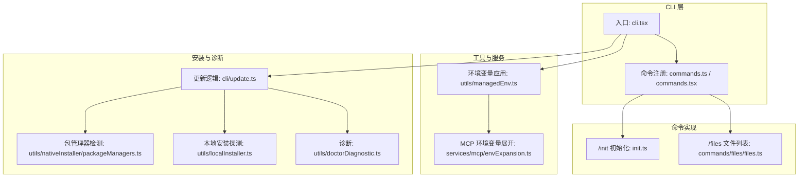
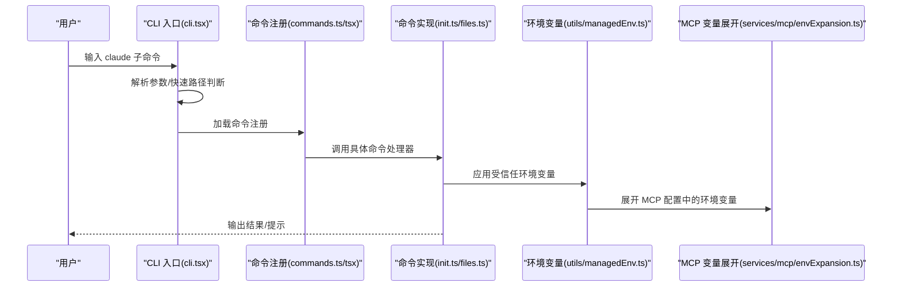
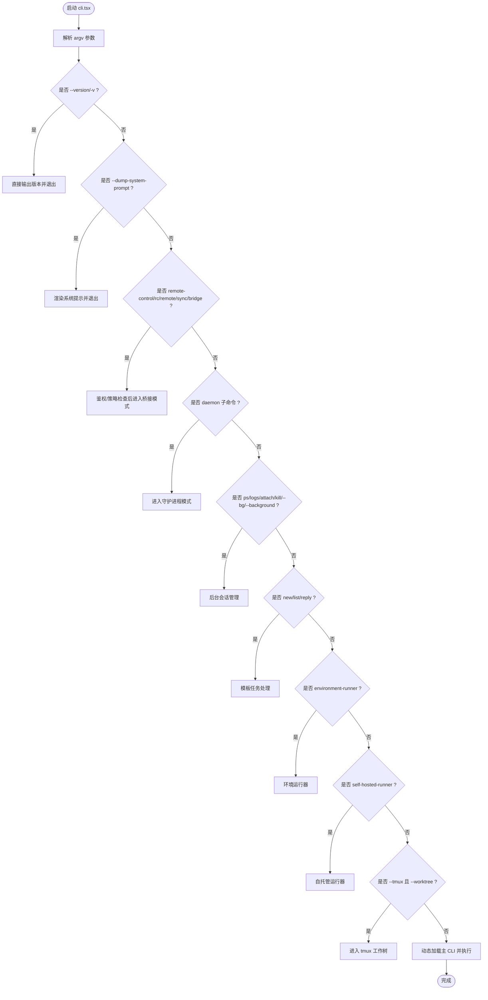
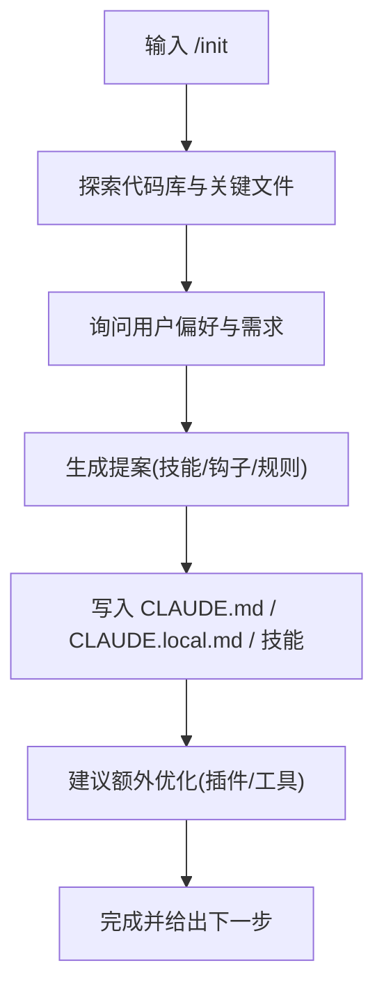
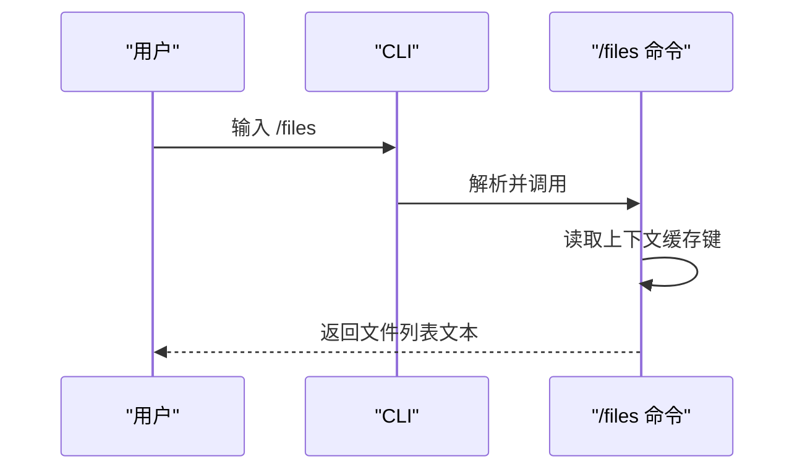
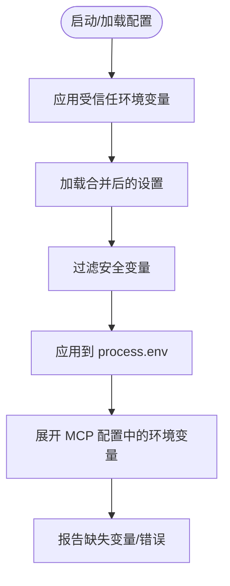
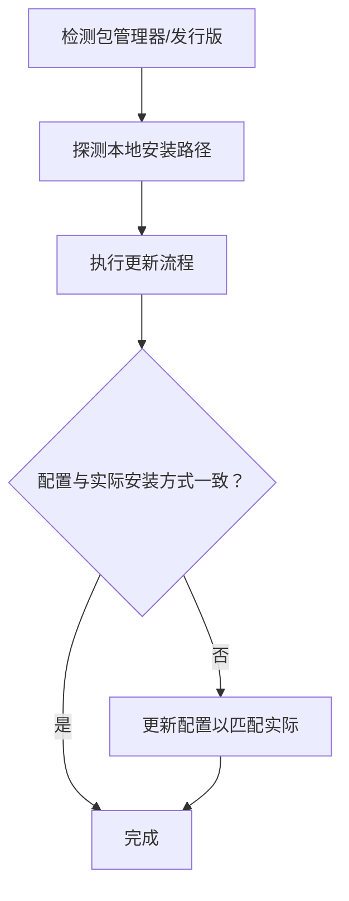
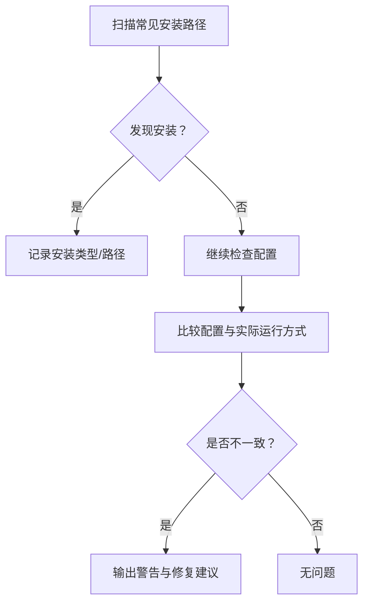
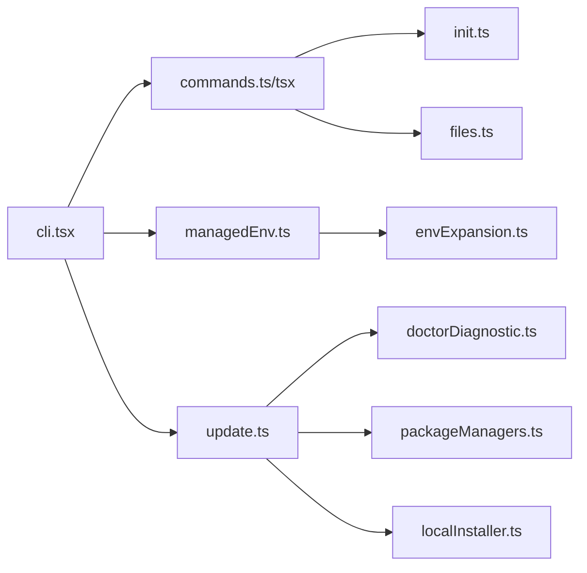

# 快速开始

<cite>
**本文引用的文件**
- [README.md](file://README.md)
- [package.json](file://package.json)
- [cli.tsx](file://src/entrypoints/cli.tsx)
- [init.ts](file://src/commands/init.ts)
- [files.ts](file://src/commands/files/files.ts)
- [managedEnv.ts](file://src/utils/managedEnv.ts)
- [envExpansion.ts](file://src/services/mcp/envExpansion.ts)
- [packageManagers.ts](file://src/utils/nativeInstaller/packageManagers.ts)
- [localInstaller.ts](file://src/utils/localInstaller.ts)
- [update.ts](file://src/cli/update.ts)
- [doctorDiagnostic.ts](file://src/utils/doctorDiagnostic.ts)
- [commands.ts](file://src/commands.ts)
- [commands.tsx](file://src/commands.tsx)
- [main.tsx](file://src/main.tsx)
- [bash/commands.ts](file://src/utils/bash/commands.ts)
</cite>

## 目录
1. [简介](#简介)
2. [项目结构](#项目结构)
3. [核心组件](#核心组件)
4. [架构总览](#架构总览)
5. [详细组件分析](#详细组件分析)
6. [依赖关系分析](#依赖关系分析)
7. [性能考虑](#性能考虑)
8. [故障排除指南](#故障排除指南)
9. [结论](#结论)
10. [附录](#附录)

## 简介
本指南面向首次接触 Claude Code 的用户，帮助你在 10 分钟内完成安装、基础配置与首次运行。你将学会：
- 通过 npm 安装官方包或从源码提取安装
- 配置必要的环境变量与认证信息
- 运行第一个命令，进行基本对话与文件上下文查看
- 使用常见 CLI 命令：初始化项目、查看文件列表、插件管理、更新与诊断
- 在 macOS、Windows、Linux 上的注意事项与常见问题排查

## 项目结构
该仓库为 Anthropic 官方发布的 Claude Code CLI 的 TypeScript 源码镜像，包含 CLI 入口、命令系统、工具集、服务层、UI 组件与实用工具。核心入口为可执行文件绑定到二进制名“claude”，支持多种子命令与工作流。

**图表来源**
- [cli.tsx](file://src/entrypoints/cli.tsx)
- [commands.ts](file://src/commands.ts)
- [commands.tsx](file://src/commands.tsx)
- [init.ts](file://src/commands/init.ts)
- [files.ts](file://src/commands/files/files.ts)
- [managedEnv.ts](file://src/utils/managedEnv.ts)
- [envExpansion.ts](file://src/services/mcp/envExpansion.ts)
- [packageManagers.ts](file://src/utils/nativeInstaller/packageManagers.ts)
- [localInstaller.ts](file://src/utils/localInstaller.ts)
- [update.ts](file://src/cli/update.ts)
- [doctorDiagnostic.ts](file://src/utils/doctorDiagnostic.ts)

**章节来源**
- [README.md](file://README.md)
- [package.json](file://package.json)

## 核心组件
- CLI 入口与启动流程：负责解析参数、按需加载模块、快速路径优化与版本输出。
- 命令系统：集中注册与分发命令，包括内置命令与插件扩展。
- 工具与服务：环境变量注入、MCP 配置变量展开、远程能力接入等。
- 安装与诊断：自动检测安装方式、包管理器、本地安装存在性；提供更新与诊断能力。

**章节来源**
- [cli.tsx](file://src/entrypoints/cli.tsx)
- [commands.ts](file://src/commands.ts)
- [commands.tsx](file://src/commands.tsx)
- [managedEnv.ts](file://src/utils/managedEnv.ts)
- [envExpansion.ts](file://src/services/mcp/envExpansion.ts)
- [packageManagers.ts](file://src/utils/nativeInstaller/packageManagers.ts)
- [localInstaller.ts](file://src/utils/localInstaller.ts)
- [update.ts](file://src/cli/update.ts)
- [doctorDiagnostic.ts](file://src/utils/doctorDiagnostic.ts)

## 架构总览
下图展示从命令行到命令执行与工具调用的整体流程，以及关键的环境与配置交互点。

**图表来源**
- [cli.tsx](file://src/entrypoints/cli.tsx)
- [commands.ts](file://src/commands.ts)
- [commands.tsx](file://src/commands.tsx)
- [init.ts](file://src/commands/init.ts)
- [files.ts](file://src/commands/files/files.ts)
- [managedEnv.ts](file://src/utils/managedEnv.ts)
- [envExpansion.ts](file://src/services/mcp/envExpansion.ts)

## 详细组件分析

### CLI 启动与参数处理
- 支持快速路径：版本查询、系统提示导出、桥接模式、守护进程、后台会话、模板任务、环境运行器、自托管运行器、tmux 工作树等。
- 动态导入：除版本查询外，其余路径均延迟加载以提升启动速度。
- 特性门控：通过特性开关控制内部/实验功能的可用性。

**图表来源**
- [cli.tsx](file://src/entrypoints/cli.tsx)

**章节来源**
- [cli.tsx](file://src/entrypoints/cli.tsx)

### 初始化命令 (/init)
- 作用：为项目生成或更新 CLAUDE.md、可选技能与钩子，引导最佳实践。
- 行为：根据项目类型与用户偏好，建议格式化、测试、提交规范、插件等。
- 适用场景：首次接入、重构或团队协作时统一上下文。

**图表来源**
- [init.ts](file://src/commands/init.ts)

**章节来源**
- [init.ts](file://src/commands/init.ts)

### 文件列表命令 (/files)
- 作用：列出当前上下文中已读取的文件路径，便于确认上下文范围。
- 适用场景：调试上下文过大、确认文件是否被正确纳入。

**图表来源**
- [files.ts](file://src/commands/files/files.ts)

**章节来源**
- [files.ts](file://src/commands/files/files.ts)

### 环境变量与 MCP 配置
- 受信任环境变量应用：在建立信任前应用来自全局配置与策略设置的安全变量。
- MCP 环境变量展开：支持 ${VAR} 与 ${VAR:-默认值} 语法，返回缺失变量清单以便诊断。

**图表来源**
- [managedEnv.ts](file://src/utils/managedEnv.ts)
- [envExpansion.ts](file://src/services/mcp/envExpansion.ts)

**章节来源**
- [managedEnv.ts](file://src/utils/managedEnv.ts)
- [envExpansion.ts](file://src/services/mcp/envExpansion.ts)

### 安装与更新
- 包管理器检测：基于 /etc/os-release 推断发行版家族，避免对不支持的包管理器执行。
- 本地安装探测：检查本地安装目录是否存在可执行文件。
- 更新逻辑：自动修复配置与实际安装方式不一致的问题，必要时更新配置以匹配当前运行方式。

**图表来源**
- [packageManagers.ts](file://src/utils/nativeInstaller/packageManagers.ts)
- [localInstaller.ts](file://src/utils/localInstaller.ts)
- [update.ts](file://src/cli/update.ts)

**章节来源**
- [packageManagers.ts](file://src/utils/nativeInstaller/packageManagers.ts)
- [localInstaller.ts](file://src/utils/localInstaller.ts)
- [update.ts](file://src/cli/update.ts)

### 诊断与故障排查
- 安装来源检测：扫描常见安装位置，识别 npm 全局/本地、原生安装等。
- 配置问题诊断：对比配置与实际运行方式，提示潜在不一致。

**图表来源**
- [doctorDiagnostic.ts](file://src/utils/doctorDiagnostic.ts)

**章节来源**
- [doctorDiagnostic.ts](file://src/utils/doctorDiagnostic.ts)

## 依赖关系分析
- CLI 入口依赖命令注册与动态模块加载，减少冷启动时间。
- 命令实现依赖工具与服务层（环境变量、MCP 展开等）。
- 安装与诊断模块相互配合，确保安装方式与配置一致。

**图表来源**
- [cli.tsx](file://src/entrypoints/cli.tsx)
- [commands.ts](file://src/commands.ts)
- [commands.tsx](file://src/commands.tsx)
- [init.ts](file://src/commands/init.ts)
- [files.ts](file://src/commands/files/files.ts)
- [managedEnv.ts](file://src/utils/managedEnv.ts)
- [envExpansion.ts](file://src/services/mcp/envExpansion.ts)
- [update.ts](file://src/cli/update.ts)
- [doctorDiagnostic.ts](file://src/utils/doctorDiagnostic.ts)
- [packageManagers.ts](file://src/utils/nativeInstaller/packageManagers.ts)
- [localInstaller.ts](file://src/utils/localInstaller.ts)

**章节来源**
- [cli.tsx](file://src/entrypoints/cli.tsx)
- [commands.ts](file://src/commands.ts)
- [commands.tsx](file://src/commands.tsx)
- [init.ts](file://src/commands/init.ts)
- [files.ts](file://src/commands/files/files.ts)
- [managedEnv.ts](file://src/utils/managedEnv.ts)
- [envExpansion.ts](file://src/services/mcp/envExpansion.ts)
- [update.ts](file://src/cli/update.ts)
- [doctorDiagnostic.ts](file://src/utils/doctorDiagnostic.ts)
- [packageManagers.ts](file://src/utils/nativeInstaller/packageManagers.ts)
- [localInstaller.ts](file://src/utils/localInstaller.ts)

## 性能考虑
- 快速路径：版本查询、系统提示导出、桥接模式、守护进程、后台会话、模板任务、环境运行器、自托管运行器、tmux 工作树等均采用快速路径，避免加载完整模块。
- 动态导入：除版本查询外，其余路径延迟加载，降低启动时间。
- 建议：首次运行时尽量使用快速路径命令，避免不必要的模块加载。

[本节为通用指导，无需引用具体文件]

## 故障排除指南
- 权限问题
  - 症状：无法写入配置或安装目录。
  - 处理：确保用户对 ~/.claude 与本地安装路径有写权限；必要时使用 sudo 或调整目录权限。
- 网络连接问题
  - 症状：更新失败、远程功能不可用。
  - 处理：检查代理设置、防火墙与 DNS；使用诊断命令确认网络可达性。
- 安装方式不一致
  - 症状：配置显示 npm 全局，实际运行的是本地安装。
  - 处理：运行更新流程，系统会自动修复配置与实际安装方式不一致的问题。
- 环境变量未生效
  - 症状：MCP 服务器或代理配置未按预期生效。
  - 处理：确认受信任环境变量已应用，检查 MCP 配置中的变量展开结果，关注缺失变量提示。

**章节来源**
- [update.ts](file://src/cli/update.ts)
- [managedEnv.ts](file://src/utils/managedEnv.ts)
- [envExpansion.ts](file://src/services/mcp/envExpansion.ts)
- [doctorDiagnostic.ts](file://src/utils/doctorDiagnostic.ts)

## 结论
通过本指南，你可以在 10 分钟内完成 Claude Code 的安装与首次运行。建议优先使用官方 npm 包，若需要从源码提取，请参考 README 中的说明。后续可使用 /init 初始化项目上下文，/files 查看当前上下文文件，/plugin 管理插件，以及 /update 保持工具更新。遇到问题时，结合诊断与环境变量应用逻辑进行排查。

[本节为总结，无需引用具体文件]

## 附录

### 安装与首次使用步骤
- 通过 npm 安装官方包
  - 在终端中执行安装命令，确保 Node.js 版本满足要求。
  - 安装完成后，使用 claude --version 验证安装。
- 从源码提取安装
  - 按 README 中的步骤下载并解压 npm 包，运行解压脚本生成源码。
  - 使用 Bun 或 Node 运行 CLI。
- 首次使用
  - 运行 /init 初始化项目上下文，生成 CLAUDE.md 与可选技能/钩子。
  - 使用 /files 查看当前上下文中的文件列表。
  - 使用 /plugin 管理插件市场与安装。

**章节来源**
- [README.md](file://README.md)
- [package.json](file://package.json)
- [init.ts](file://src/commands/init.ts)
- [files.ts](file://src/commands/files/files.ts)
- [cli.tsx](file://src/entrypoints/cli.tsx)

### 常见 CLI 命令示例
- 基本对话交互
  - 直接运行 claude，进入交互式会话。
- 文件操作命令
  - /files：列出当前上下文中的文件。
- 代码搜索命令
  - /grep：在上下文中搜索关键词（如存在）。
- 插件管理
  - /plugin：打开插件菜单，支持浏览、安装、启用、禁用与卸载插件。
- 更新与诊断
  - /update：检查并修复安装方式不一致问题。
  - /doctor：诊断安装与配置问题。

**章节来源**
- [cli.tsx](file://src/entrypoints/cli.tsx)
- [files.ts](file://src/commands/files/files.ts)
- [update.ts](file://src/cli/update.ts)
- [doctorDiagnostic.ts](file://src/utils/doctorDiagnostic.ts)
- [commands.ts](file://src/commands.ts)
- [commands.tsx](file://src/commands.tsx)

### 不同操作系统注意事项
- macOS
  - 若使用 Homebrew，注意包管理器检测逻辑可能影响安装路径选择。
  - 确保终端与 zsh/bash/fish 的 PATH 设置正确。
- Windows
  - 使用包管理器检测逻辑时，系统可能不支持某些包管理器；请参考诊断输出。
  - 注意代理与防火墙设置，确保网络可达。
- Linux
  - 基于 /etc/os-release 推断发行版家族，避免对不支持的包管理器执行。
  - 如使用容器环境，注意内存限制与 NODE_OPTIONS 设置。

**章节来源**
- [packageManagers.ts](file://src/utils/nativeInstaller/packageManagers.ts)
- [cli.tsx](file://src/entrypoints/cli.tsx)

### 帮助与系统提示导出
- 导出系统提示：用于评估与复现目的，CLI 提供专用快速路径输出系统提示内容。
- 帮助命令：对于简单 --help 命令，允许绕过前缀提取，直接执行。

**章节来源**
- [cli.tsx](file://src/entrypoints/cli.tsx)
- [bash/commands.ts](file://src/utils/bash/commands.ts)