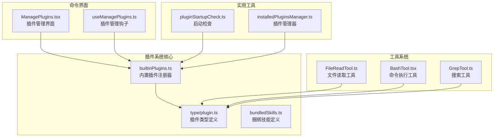
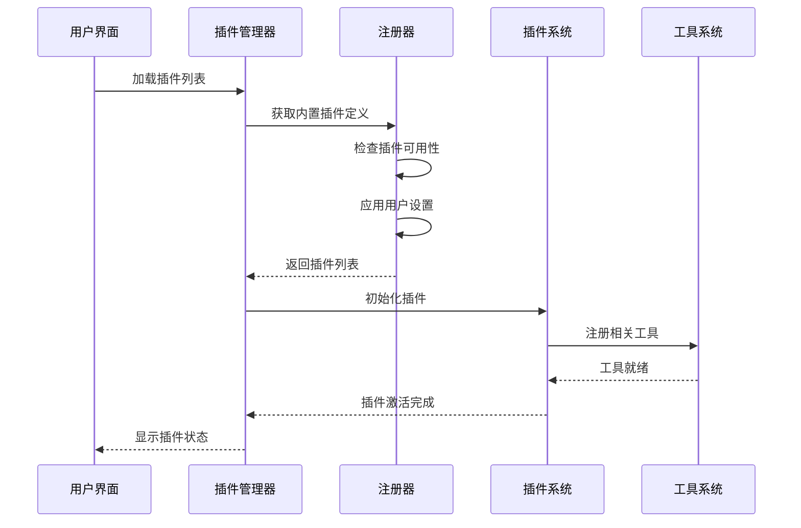
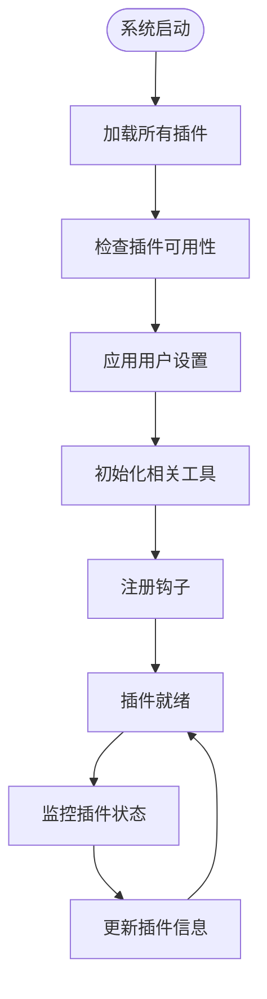
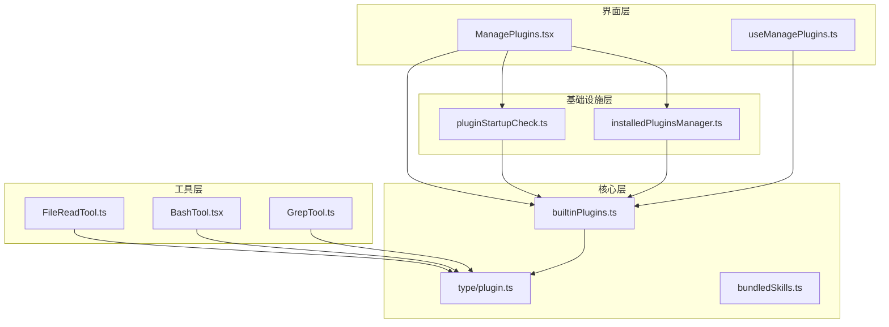

# 内置插件系统

<cite>
**本文档引用的文件**
- [builtinPlugins.ts](file://src/plugins/builtinPlugins.ts)
- [plugin.ts](file://src/types/plugin.ts)
- [bundledSkills.ts](file://src/skills/bundledSkills.ts)
- [ManagePlugins.tsx](file://src/commands/plugin/ManagePlugins.tsx)
- [useManagePlugins.ts](file://src/hooks/useManagePlugins.ts)
- [pluginStartupCheck.ts](file://src/utils/plugins/pluginStartupCheck.ts)
- [installedPluginsManager.ts](file://src/utils/plugins/installedPluginsManager.ts)
- [FileReadTool.ts](file://src/tools/FileReadTool/FileReadTool.ts)
- [BashTool.tsx](file://src/tools/BashTool/BashTool.tsx)
- [GrepTool.ts](file://src/tools/GrepTool/GrepTool.ts)
</cite>

## 目录
1. [简介](#简介)
2. [项目结构](#项目结构)
3. [核心组件](#核心组件)
4. [架构概览](#架构概览)
5. [详细组件分析](#详细组件分析)
6. [依赖关系分析](#依赖关系分析)
7. [性能考虑](#性能考虑)
8. [故障排除指南](#故障排除指南)
9. [结论](#结论)
10. [附录](#附录)

## 简介

Claude Code 的内置插件系统是一个强大的扩展框架，允许开发者创建和管理各种功能插件来增强 AI 编程助手的能力。该系统提供了多种类型的内置插件，包括文件操作插件、命令执行插件、搜索工具插件等核心功能插件。

内置插件系统的核心特点：
- **可启用/禁用的内置插件**：用户可以通过 `/plugin` 界面启用或禁用这些插件
- **多组件支持**：单个插件可以提供多个组件（技能、钩子、MCP 服务器）
- **统一标识符格式**：使用 `{name}@builtin` 格式区分内置插件和市场插件
- **用户设置持久化**：插件的启用状态会保存到用户设置中

## 项目结构

内置插件系统主要分布在以下目录结构中：

**图表来源**
- [builtinPlugins.ts:1-160](file://src/plugins/builtinPlugins.ts#L1-L160)
- [plugin.ts:1-364](file://src/types/plugin.ts#L1-L364)
- [ManagePlugins.tsx:1-200](file://src/commands/plugin/ManagePlugins.tsx#L1-L200)

**章节来源**
- [builtinPlugins.ts:1-160](file://src/plugins/builtinPlugins.ts#L1-L160)
- [plugin.ts:1-364](file://src/types/plugin.ts#L1-L364)

## 核心组件

### 内置插件注册器

内置插件注册器是整个系统的核心，负责管理所有内置插件的生命周期。

**主要功能**：
- 插件注册和存储
- 插件状态管理（启用/禁用）
- 插件定义查询
- 用户设置集成

**关键特性**：
- 使用 Map 数据结构存储插件定义
- 支持插件可用性检查
- 集成用户设置持久化
- 提供插件定义获取功能

### 插件类型系统

插件类型系统定义了内置插件的标准接口和数据结构。

**核心类型**：
- `BuiltinPluginDefinition`：内置插件定义
- `LoadedPlugin`：已加载插件对象
- `PluginError`：插件错误类型

**插件组件**：
- 技能（Skills）：预定义的 AI 功能
- 钩子（Hooks）：事件处理程序
- MCP 服务器：机器对话协议服务器

**章节来源**
- [plugin.ts:13-70](file://src/types/plugin.ts#L13-L70)
- [builtinPlugins.ts:21-32](file://src/plugins/builtinPlugins.ts#L21-L32)

## 架构概览

内置插件系统采用分层架构设计，确保模块间的松耦合和高内聚。

**图表来源**
- [ManagePlugins.tsx:51-54](file://src/commands/plugin/ManagePlugins.tsx#L51-L54)
- [builtinPlugins.ts:57-102](file://src/plugins/builtinPlugins.ts#L57-L102)

### 组件交互流程

**图表来源**
- [useManagePlugins.ts:51-54](file://src/hooks/useManagePlugins.ts#L51-L54)
- [builtinPlugins.ts:65-102](file://src/plugins/builtinPlugins.ts#L65-L102)

## 详细组件分析

### 文件操作插件

文件操作插件提供了丰富的文件系统操作能力，包括文件读取、写入、搜索等功能。

#### 文件读取工具

文件读取工具是文件操作的核心组件，提供了安全的文件访问机制。

**主要特性**：
- 安全路径验证
- 设备文件阻断
- 内容大小限制
- 图像文件特殊处理

**安全机制**：
- 设备文件检测（如 `/dev/zero`, `/dev/random`）
- 路径遍历保护
- 内存使用限制
- 编码自动检测

**章节来源**
- [FileReadTool.ts:96-128](file://src/tools/FileReadTool/FileReadTool.ts#L96-L128)

#### 文件写入工具

文件写入工具提供了受控的文件修改能力，确保操作的安全性和可追溯性。

**核心功能**：
- 权限检查
- 备份机制
- 内容验证
- 错误恢复

**章节来源**
- [FileReadTool.ts:1-200](file://src/tools/FileReadTool/FileReadTool.ts#L1-L200)

### 命令执行插件

命令执行插件通过 BashTool 提供了强大的系统命令执行能力。

#### Bash 工具

Bash 工具是命令执行的核心组件，实现了安全的命令执行环境。

**主要功能**：
- 命令解析和验证
- 权限控制
- 输出处理
- 进度跟踪

**安全特性**：
- 命令语义分析
- 路径验证
- 只读约束
- 沙箱隔离

**章节来源**
- [BashTool.tsx:83-172](file://src/tools/BashTool/BashTool.tsx#L83-L172)

#### PowerShell 工具

PowerShell 工具提供了 Windows 系统的命令执行能力。

**平台特定功能**：
- Windows 特定命令支持
- 安全策略集成
- 脚本执行控制

**章节来源**
- [BashTool.tsx:1-200](file://src/tools/BashTool/BashTool.tsx#L1-L200)

### 搜索工具插件

搜索工具插件提供了高效的文件内容搜索能力。

#### Grep 工具

Grep 工具基于 ripgrep 实现，提供了高性能的文本搜索功能。

**核心特性**：
- 正则表达式支持
- 多文件搜索
- 上下文显示
- 结果限制

**优化功能**：
- 默认结果限制（250条）
- 分页支持
- 类型过滤
- 大小写不敏感搜索

**章节来源**
- [GrepTool.ts:33-90](file://src/tools/GrepTool/GrepTool.ts#L33-L90)

#### 全局搜索工具

全局搜索工具提供了跨项目的文件搜索能力。

**主要功能**：
- 项目范围搜索
- 忽略模式配置
- 结果聚合
- 性能优化

**章节来源**
- [GrepTool.ts:104-128](file://src/tools/GrepTool/GrepTool.ts#L104-L128)

### 捆绑技能系统

捆绑技能系统提供了预定义的 AI 功能模板，可以直接使用而无需额外配置。

#### 技能定义

捆绑技能定义提供了标准化的技能接口。

**核心属性**：
- 名称和描述
- 使用场景
- 工具限制
- 钩子配置

**章节来源**
- [bundledSkills.ts:15-41](file://src/skills/bundledSkills.ts#L15-L41)

#### 技能注册

技能注册机制确保了技能的正确加载和管理。

**注册流程**：
- 技能验证
- 文件提取
- 上下文设置
- 可见性控制

**章节来源**
- [bundledSkills.ts:53-100](file://src/skills/bundledSkills.ts#L53-L100)

## 依赖关系分析

内置插件系统具有清晰的依赖层次结构，确保模块间的独立性和可维护性。

**图表来源**
- [builtinPlugins.ts:16-19](file://src/plugins/builtinPlugins.ts#L16-L19)
- [ManagePlugins.tsx:20-27](file://src/commands/plugin/ManagePlugins.tsx#L20-L27)

### 依赖注入模式

系统采用了依赖注入的设计模式，通过函数参数传递依赖关系。

**注入点**：
- 插件注册器依赖类型定义
- 管理界面依赖注册器
- 工具类依赖类型系统

**章节来源**
- [builtinPlugins.ts:16-19](file://src/plugins/builtinPlugins.ts#L16-L19)
- [ManagePlugins.tsx:20-27](file://src/commands/plugin/ManagePlugins.tsx#L20-L27)

## 性能考虑

内置插件系统在设计时充分考虑了性能优化和资源管理。

### 内存管理

**文件读取优化**：
- 内存使用限制（默认20KB工具结果阈值）
- 分页处理机制
- 缓存策略

**插件缓存**：
- 启动时预加载
- 按需加载策略
- 内存清理机制

### 并发处理

**并发安全**：
- Grep 工具的并发安全设计
- 文件操作的异步处理
- 资源锁机制

**性能指标**：
- 工具执行时间统计
- 内存使用监控
- I/O 操作优化

### 资源限制

**系统资源保护**：
- 文件大小限制
- 执行时间限制
- 内存使用上限

**安全边界**：
- 设备文件访问阻止
- 路径遍历防护
- 权限验证机制

## 故障排除指南

内置插件系统提供了完善的错误处理和诊断机制。

### 常见问题诊断

**插件加载失败**：
- 检查插件可用性
- 验证用户设置
- 查看错误日志

**权限问题**：
- 文件系统权限检查
- 命令执行权限验证
- 环境变量配置

**性能问题**：
- 内存使用监控
- 执行时间分析
- 资源使用统计

### 错误类型和处理

系统定义了多种错误类型来提供精确的问题定位：

**网络错误**：插件下载失败、连接超时
**配置错误**：插件配置无效、依赖缺失
**权限错误**：文件访问被拒绝、命令执行失败
**资源错误**：内存不足、磁盘空间不足

**章节来源**
- [plugin.ts:101-284](file://src/types/plugin.ts#L101-L284)

### 调试工具

**调试功能**：
- 详细错误消息
- 日志记录
- 状态监控

**诊断工具**：
- 插件状态检查
- 性能分析
- 依赖关系图

## 结论

Claude Code 的内置插件系统是一个设计精良、功能强大的扩展框架。它通过模块化的架构设计、完善的安全机制和高效的性能优化，为用户提供了一个强大而易用的插件生态系统。

**系统优势**：
- 清晰的架构层次
- 强大的安全保护
- 优秀的性能表现
- 易于使用的界面

**未来发展**：
- 更多插件类型支持
- 增强的错误处理
- 优化的性能表现
- 改进的用户体验

## 附录

### 使用示例

**启用内置插件**：
1. 打开 `/plugin` 界面
2. 查找目标插件
3. 点击启用按钮
4. 系统自动保存设置

**配置插件选项**：
1. 在插件详情中找到配置项
2. 修改相应的设置
3. 保存配置
4. 重启相关服务

### 最佳实践

**插件选择**：
- 根据项目需求选择合适的插件
- 考虑性能影响
- 注意安全要求

**配置优化**：
- 合理设置资源限制
- 配置适当的日志级别
- 定期清理缓存数据

**维护建议**：
- 定期更新插件版本
- 监控插件性能
- 备份重要配置