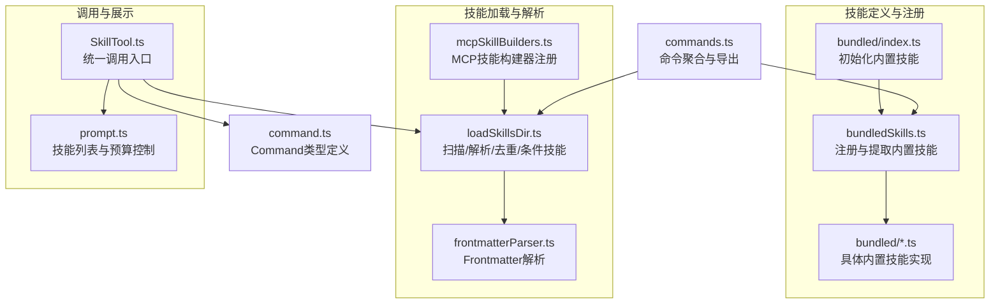
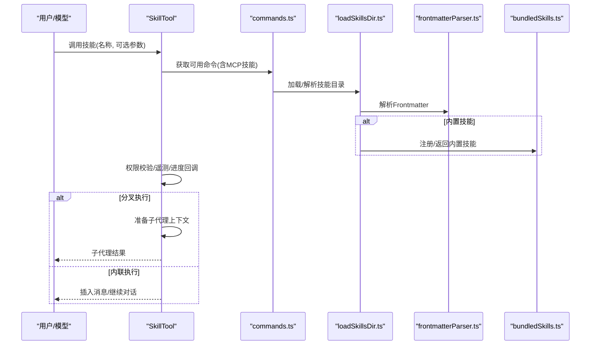
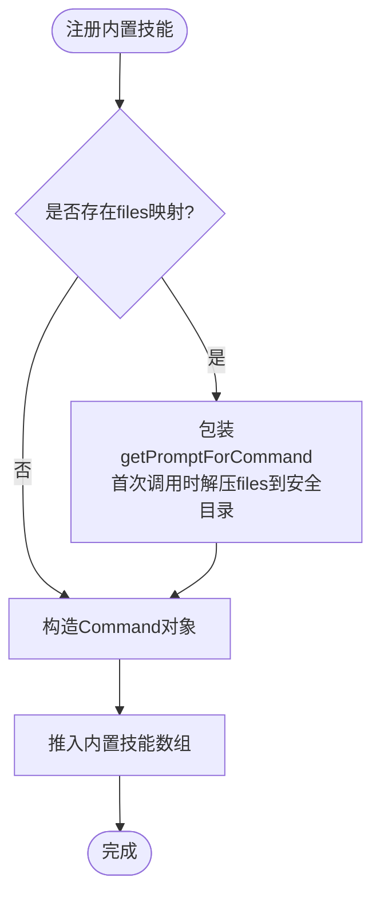
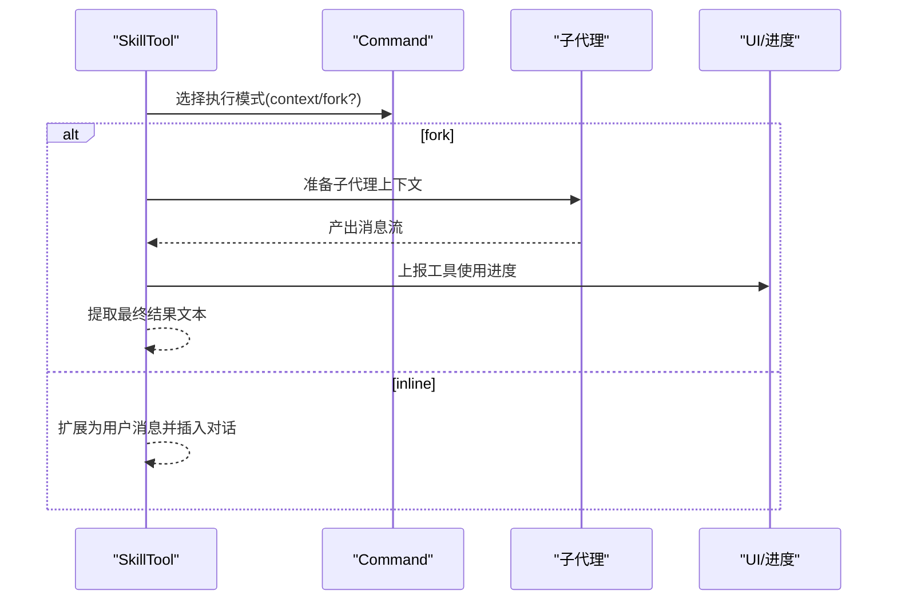
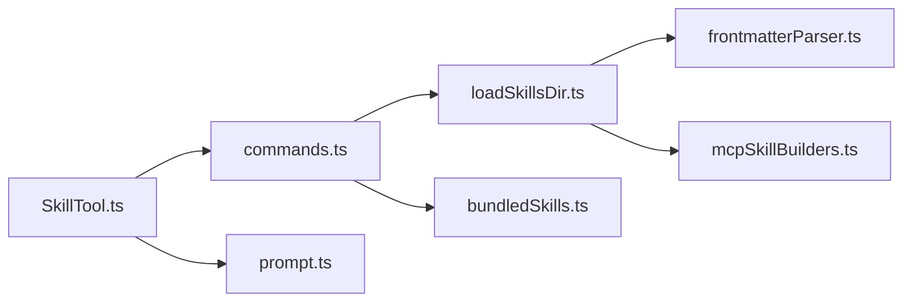

# 技能系统

<cite>
**本文引用的文件**
- [bundledSkills.ts](file://src/skills/bundledSkills.ts)
- [loadSkillsDir.ts](file://src/skills/loadSkillsDir.ts)
- [mcpSkillBuilders.ts](file://src/skills/mcpSkillBuilders.ts)
- [frontmatterParser.ts](file://src/utils/frontmatterParser.ts)
- [command.ts](file://src/types/command.ts)
- [SkillTool.ts](file://src/tools/SkillTool/SkillTool.ts)
- [prompt.ts](file://src/tools/SkillTool/prompt.ts)
- [commands.ts](file://src/commands.ts)
- [index.ts](file://src/skills/bundled/index.ts)
- [remember.ts](file://src/skills/bundled/remember.ts)
- [skillify.ts](file://src/skills/bundled/skillify.ts)
</cite>

## 目录
1. [引言](#引言)
2. [项目结构](#项目结构)
3. [核心组件](#核心组件)
4. [架构总览](#架构总览)
5. [详细组件分析](#详细组件分析)
6. [依赖关系分析](#依赖关系分析)
7. [性能考量](#性能考量)
8. [故障排查指南](#故障排查指南)
9. [结论](#结论)
10. [附录](#附录)

## 引言
本文件系统性阐述 Claude Code 技能系统的设计理念、实现机制与最佳实践，覆盖以下主题：
- 技能与插件的区别与联系：技能是“可被模型或用户调用”的命令化提示模板；插件是“能力提供者”，技能可由插件注册或由用户在本地目录编写。
- 技能的定义方式、文件格式与配置规范：以 Markdown + YAML Frontmatter 的形式组织，支持路径条件、工具权限、执行上下文、代理类型、努力级别等。
- 技能的执行流程、调用机制与参数传递：通过 SkillTool 统一入口，按需加载提示内容，支持内联执行与子代理分叉执行两种模式。
- 分类体系：内置技能（编译期打包）、用户自定义技能（用户/项目/策略目录）、插件技能、MCP 技能、远程技能（实验特性）。
- 搜索与发现：技能列表预算控制、命名空间与去重、条件技能延迟激活。
- 技能市场与远程技能：官方市场标识、远程技能发现与加载（实验功能）。
- 开发指南：从创建到发布的全流程，含复杂技能实现与优化建议。

## 项目结构
技能系统主要分布在以下模块：
- 技能定义与注册：bundledSkills.ts、bundled/index.ts、bundled/*.ts
- 技能加载与解析：loadSkillsDir.ts、mcpSkillBuilders.ts、frontmatterParser.ts
- 技能类型与命令模型：command.ts
- 技能调用入口：SkillTool.ts、prompt.ts
- 命令聚合与导出：commands.ts

图表来源
- [bundled/index.ts:1-80](file://src/skills/bundled/index.ts#L1-L80)
- [bundledSkills.ts:1-221](file://src/skills/bundledSkills.ts#L1-L221)
- [loadSkillsDir.ts:1-800](file://src/skills/loadSkillsDir.ts#L1-L800)
- [mcpSkillBuilders.ts:1-45](file://src/skills/mcpSkillBuilders.ts#L1-L45)
- [frontmatterParser.ts:1-200](file://src/utils/frontmatterParser.ts#L1-L200)
- [SkillTool.ts:1-800](file://src/tools/SkillTool/SkillTool.ts#L1-L800)
- [prompt.ts:1-242](file://src/tools/SkillTool/prompt.ts#L1-L242)
- [command.ts:1-200](file://src/types/command.ts#L1-L200)
- [commands.ts:1-200](file://src/commands.ts#L1-L200)

章节来源
- [bundled/index.ts:1-80](file://src/skills/bundled/index.ts#L1-L80)
- [bundledSkills.ts:1-221](file://src/skills/bundledSkills.ts#L1-L221)
- [loadSkillsDir.ts:1-800](file://src/skills/loadSkillsDir.ts#L1-L800)
- [mcpSkillBuilders.ts:1-45](file://src/skills/mcpSkillBuilders.ts#L1-L45)
- [frontmatterParser.ts:1-200](file://src/utils/frontmatterParser.ts#L1-L200)
- [SkillTool.ts:1-800](file://src/tools/SkillTool/SkillTool.ts#L1-L800)
- [prompt.ts:1-242](file://src/tools/SkillTool/prompt.ts#L1-L242)
- [command.ts:1-200](file://src/types/command.ts#L1-L200)
- [commands.ts:1-200](file://src/commands.ts#L1-L200)

## 核心组件
- 内置技能注册与运行时提取
  - registerBundledSkill 定义技能元数据与动态提示生成函数；首次调用时可将“参考文件”解压到安全目录，为模型提供可读写的资源根路径。
  - getBundledSkills 返回已注册的内置技能副本，避免外部修改。
  - 提取目录采用进程级随机数的受控路径，写入使用 O_EXCL/O_NOFOLLOW 等安全标志，防止符号链接攻击。
- 技能加载与解析
  - 支持多源目录：策略设置、用户设置、项目设置、附加目录；兼容旧版 /commands/ 目录。
  - Frontmatter 解析：允许 allowed-tools、arguments、argument-hint、when_to_use、model、user-invocable、hooks、context、agent、paths、shell、effort 等字段。
  - 去重：基于真实路径（realpath）识别重复文件，优先保留首个来源。
  - 条件技能：当 Frontmatter 中存在 paths 且未激活时，延迟加入待激活集合，等待匹配文件触发展开。
- 技能类型与命令模型
  - Command 类型统一承载技能信息：名称、描述、别名、工具白名单、模型、是否允许用户调用、钩子、执行上下文、代理类型、路径条件、努力级别、内容长度、来源与加载位置等。
- 调用入口与展示
  - SkillTool：统一的技能调用工具，支持内联执行与子代理分叉执行；自动处理权限、遥测、消息注入与进度反馈。
  - 技能列表预算：根据上下文窗口动态计算技能列表字符预算，对非内置技能进行描述截断，内置技能始终显示全量描述。

章节来源
- [bundledSkills.ts:11-121](file://src/skills/bundledSkills.ts#L11-L121)
- [bundledSkills.ts:124-221](file://src/skills/bundledSkills.ts#L124-L221)
- [loadSkillsDir.ts:638-800](file://src/skills/loadSkillsDir.ts#L638-L800)
- [frontmatterParser.ts:10-60](file://src/utils/frontmatterParser.ts#L10-L60)
- [command.ts:25-57](file://src/types/command.ts#L25-L57)
- [SkillTool.ts:331-800](file://src/tools/SkillTool/SkillTool.ts#L331-L800)
- [prompt.ts:31-171](file://src/tools/SkillTool/prompt.ts#L31-L171)

## 架构总览
技能系统围绕“定义—加载—解析—调用—展示”闭环展开，关键交互如下：

图表来源
- [SkillTool.ts:354-726](file://src/tools/SkillTool/SkillTool.ts#L354-L726)
- [commands.ts:157-168](file://src/commands.ts#L157-L168)
- [loadSkillsDir.ts:638-800](file://src/skills/loadSkillsDir.ts#L638-L800)
- [frontmatterParser.ts:130-175](file://src/utils/frontmatterParser.ts#L130-L175)
- [bundledSkills.ts:53-100](file://src/skills/bundledSkills.ts#L53-L100)

## 详细组件分析

### 内置技能注册与提取
- 设计要点
  - 通过 registerBundledSkill 将技能注册为 Command，并在首次调用时将 files 映射写入磁盘，同时在提示前缀中注入 Base directory，使模型可直接读取/搜索这些文件。
  - 使用进程级随机数生成的提取目录，结合 O_EXCL/O_NOFOLLOW 与 0o700/0o600 文件权限，抵御符号链接与竞态攻击。
- 关键流程

图表来源
- [bundledSkills.ts:53-100](file://src/skills/bundledSkills.ts#L53-L100)
- [bundledSkills.ts:131-145](file://src/skills/bundledSkills.ts#L131-L145)
- [bundledSkills.ts:195-206](file://src/skills/bundledSkills.ts#L195-L206)

章节来源
- [bundledSkills.ts:53-100](file://src/skills/bundledSkills.ts#L53-L100)
- [bundledSkills.ts:131-145](file://src/skills/bundledSkills.ts#L131-L145)
- [bundledSkills.ts:195-206](file://src/skills/bundledSkills.ts#L195-L206)

### 技能加载与解析（多源/去重/条件）
- 多源目录
  - 策略设置：/managed/.claude/skills
  - 用户设置：~/.claude/skills
  - 项目设置：项目根至家目录链路中的 .claude/skills
  - 附加目录：--add-dir 指定的额外路径
  - 兼容旧版 /commands/：支持目录格式（SKILL.md）与单文件格式，但默认 user-invocable 行为不同
- 去重策略
  - 对每个技能文件计算 realpath，若相同则视为重复，仅保留首个来源
- 条件技能
  - 当 Frontmatter 包含 paths 且未激活时，延迟存储，等待文件变更事件触发
- Frontmatter 字段
  - allowed-tools、arguments、argument-hint、when_to_use、model、user-invocable、hooks、context、agent、paths、shell、effort 等

章节来源
- [loadSkillsDir.ts:638-800](file://src/skills/loadSkillsDir.ts#L638-L800)
- [loadSkillsDir.ts:185-265](file://src/skills/loadSkillsDir.ts#L185-L265)
- [frontmatterParser.ts:10-60](file://src/utils/frontmatterParser.ts#L10-L60)

### 技能调用与执行（内联 vs 分叉）
- 内联执行
  - 直接扩展为用户消息并插入对话，适合需要持续交互的场景
- 分叉执行（fork）
  - 在独立子代理中运行，拥有独立上下文与预算，适合自包含任务
- 权限与遥测
  - 自动记录权限规则匹配、遥测字段（来源、是否发现、插件市场等）
  - 进度回调用于 UI 展示工具使用情况
- 参数与上下文
  - 支持 arguments 与 $CLAUDE_SESSION_ID 等变量替换
  - 对于非 MCP 技能，支持在提示中执行 shell 命令块

图表来源
- [SkillTool.ts:119-289](file://src/tools/SkillTool/SkillTool.ts#L119-L289)
- [SkillTool.ts:580-766](file://src/tools/SkillTool/SkillTool.ts#L580-L766)

章节来源
- [SkillTool.ts:119-289](file://src/tools/SkillTool/SkillTool.ts#L119-L289)
- [SkillTool.ts:580-766](file://src/tools/SkillTool/SkillTool.ts#L580-L766)

### 技能列表与预算控制
- 预算策略
  - 默认占用上下文窗口的 1%，或通过环境变量覆盖
  - 内置技能始终显示完整描述，其余技能按预算截断
- 列表格式
  - 名称 + 截断后的 whenToUse 描述，避免浪费缓存令牌

章节来源
- [prompt.ts:31-171](file://src/tools/SkillTool/prompt.ts#L31-L171)

### 实际技能案例
- remember（内置）
  - 目标：审查自动记忆并提出迁移/清理建议
  - 特点：受条件启用（仅在开启自动记忆时可见），动态拼接用户附加上下文
- skillify（内置）
  - 目标：将会话中的可复用流程捕获为技能
  - 特点：要求明确的成功标准、步骤注解、工具权限最小化、支持 inline/fork 两种执行上下文

章节来源
- [remember.ts:1-83](file://src/skills/bundled/remember.ts#L1-L83)
- [skillify.ts:1-198](file://src/skills/bundled/skillify.ts#L1-L198)

## 依赖关系分析
- 模块耦合
  - commands.ts 聚合所有命令来源（内置、插件、MCP、内置插件、技能），形成统一命令集
  - loadSkillsDir.ts 依赖 frontmatterParser.ts 解析 Frontmatter，依赖 mcpSkillBuilders.ts 为 MCP 发现提供构建器
  - SkillTool.ts 依赖 commands.ts 获取命令集，依赖 prompt.ts 生成技能列表提示
- 循环依赖规避
  - mcpSkillBuilders.ts 作为叶子模块，导出类型并在 loadSkillsDir.ts 初始化时注册，避免双向依赖

图表来源
- [commands.ts:157-168](file://src/commands.ts#L157-L168)
- [loadSkillsDir.ts:65-66](file://src/skills/loadSkillsDir.ts#L65-L66)
- [mcpSkillBuilders.ts:33-44](file://src/skills/mcpSkillBuilders.ts#L33-L44)
- [SkillTool.ts:81-94](file://src/tools/SkillTool/SkillTool.ts#L81-L94)
- [prompt.ts:173-196](file://src/tools/SkillTool/prompt.ts#L173-L196)
- [bundledSkills.ts:53-100](file://src/skills/bundledSkills.ts#L53-L100)

章节来源
- [commands.ts:157-168](file://src/commands.ts#L157-L168)
- [loadSkillsDir.ts:65-66](file://src/skills/loadSkillsDir.ts#L65-L66)
- [mcpSkillBuilders.ts:33-44](file://src/skills/mcpSkillBuilders.ts#L33-L44)
- [SkillTool.ts:81-94](file://src/tools/SkillTool/SkillTool.ts#L81-L94)
- [prompt.ts:173-196](file://src/tools/SkillTool/prompt.ts#L173-L196)
- [bundledSkills.ts:53-100](file://src/skills/bundledSkills.ts#L53-L100)

## 性能考量
- 列表预算控制：限制技能列表字符数，避免过度占用上下文窗口
- 延迟解压与一次性写入：内置技能首次调用才解压参考文件，减少冷启动成本
- 去重与缓存：基于 realpath 去重，减少重复 IO；技能列表提示使用 memoize 缓存
- 并行加载：多源目录加载采用 Promise.all 并行，提升启动速度

## 故障排查指南
- Frontmatter 解析失败
  - 现象：日志出现 YAML 解析错误
  - 处理：检查特殊字符是否需要引号包裹；系统会尝试二次解析
- 权限拒绝
  - 现象：技能被拒绝执行
  - 处理：检查 allow/deny 规则；必要时添加规则建议
- 未知技能
  - 现象：提示“未知技能”
  - 处理：确认技能名称大小写、命名空间；确保已加载对应目录
- 条件技能未激活
  - 现象：技能存在但不显示
  - 处理：确认 Frontmatter paths 是否匹配当前工作区文件

章节来源
- [frontmatterParser.ts:130-175](file://src/utils/frontmatterParser.ts#L130-L175)
- [SkillTool.ts:354-430](file://src/tools/SkillTool/SkillTool.ts#L354-L430)
- [loadSkillsDir.ts:771-796](file://src/skills/loadSkillsDir.ts#L771-L796)

## 结论
Claude Code 技能系统以“命令即提示”的思想为核心，通过统一的 Command 类型与 SkillTool 入口，实现了从多源目录加载、Frontmatter 解析、权限与遥测、到内联/分叉执行的完整闭环。内置技能提供稳定基线能力，用户自定义技能与插件生态共同扩展了系统边界。条件技能与预算控制提升了可用性与性能。建议在开发复杂技能时遵循最小权限、明确成功标准、清晰步骤注解与合适的执行上下文选择。

## 附录

### 技能文件格式与配置规范
- 文件布局
  - 目录式：skill-name/SKILL.md
  - Frontmatter 字段（节选）
    - name、description、when_to_use、version
    - allowed-tools、arguments、argument-hint
    - model、user-invocable、disable-model-invocation
    - hooks、context、agent、paths、shell、effort
- 变量替换
  - ${CLAUDE_SKILL_DIR}：技能目录（MCP 技能不适用）
  - ${CLAUDE_SESSION_ID}：会话 ID
- 执行上下文
  - inline：默认，扩展到当前对话
  - fork：子代理执行，适合自包含任务

章节来源
- [loadSkillsDir.ts:267-401](file://src/skills/loadSkillsDir.ts#L267-L401)
- [frontmatterParser.ts:10-60](file://src/utils/frontmatterParser.ts#L10-L60)
- [command.ts:25-57](file://src/types/command.ts#L25-L57)

### 技能开发与发布指南
- 创建步骤
  - 在 ~/.claude/skills 或项目 .claude/skills 下创建目录与 SKILL.md
  - 编写 Frontmatter 与正文，明确 arguments、allowed-tools、when_to_use、context/agent/effort 等
  - 使用 arguments 与 $arg_name 占位符，必要时使用 shell 块
- 发布与共享
  - 通过插件机制或官方市场（如 isOfficialMarketplaceSkill 标识）发布
  - 注意权限最小化与成功标准明确化
- 复杂技能优化
  - 将长流程拆分为多个步骤，标注 Success criteria
  - 使用 context: fork 适配自包含任务
  - 为条件技能提供 paths，降低无关触发

章节来源
- [SkillTool.ts:580-766](file://src/tools/SkillTool/SkillTool.ts#L580-L766)
- [loadSkillsDir.ts:267-401](file://src/skills/loadSkillsDir.ts#L267-L401)
- [command.ts:25-57](file://src/types/command.ts#L25-L57)