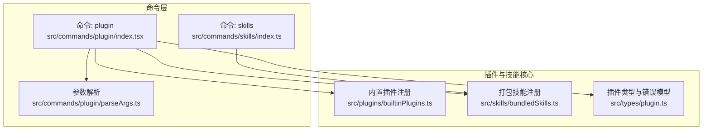
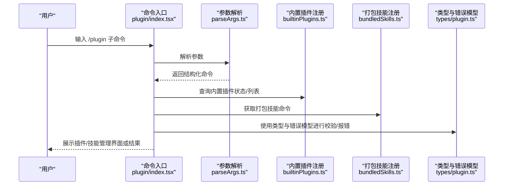
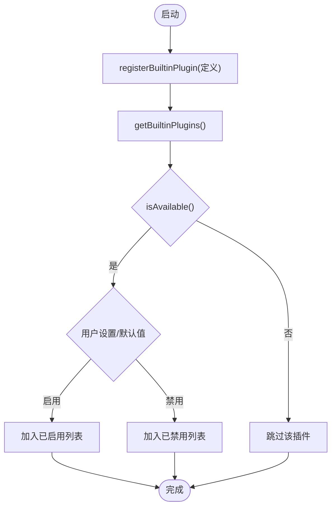
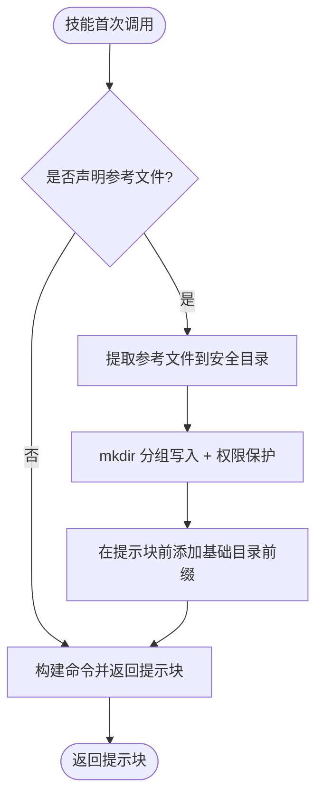
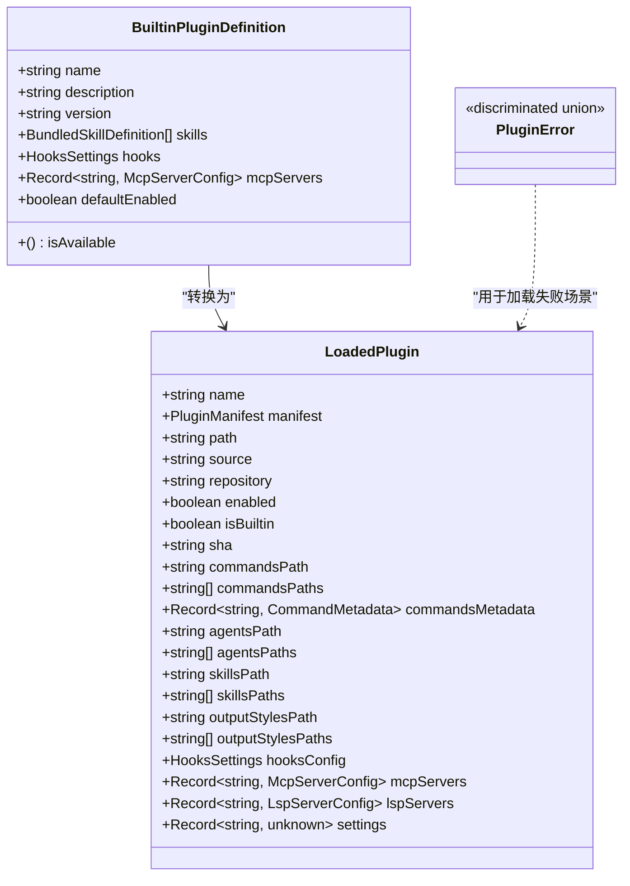
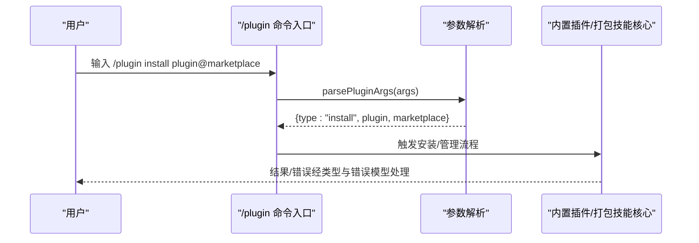
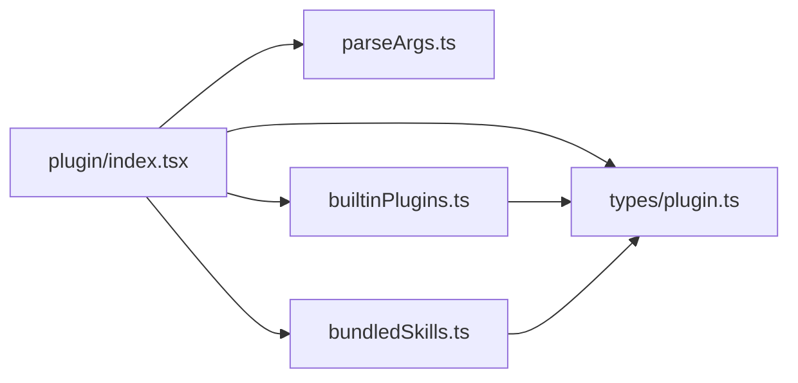

# 插件与技能系统

<cite>
**本文引用的文件**
- [builtinPlugins.ts](file://src/plugins/builtinPlugins.ts)
- [bundledSkills.ts](file://src/skills/bundledSkills.ts)
- [plugin.ts 类型定义](file://src/types/plugin.ts)
- [插件命令入口 index.tsx](file://src/commands/plugin/index.tsx)
- [插件参数解析 parseArgs.ts](file://src/commands/plugin/parseArgs.ts)
- [技能命令入口 index.ts](file://src/commands/skills/index.ts)
</cite>

## 目录
1. [引言](#引言)
2. [项目结构](#项目结构)
3. [核心组件](#核心组件)
4. [架构总览](#架构总览)
5. [详细组件分析](#详细组件分析)
6. [依赖关系分析](#依赖关系分析)
7. [性能考量](#性能考量)
8. [故障排查指南](#故障排查指南)
9. [结论](#结论)
10. [附录](#附录)

## 引言
本文件系统性阐述 Claude Code 的“插件与技能”体系：包括插件架构设计、插件加载机制、插件 API 规范；技能的概念与实现、技能与插件的关系；插件开发与发布全生命周期；内置插件与技能的使用；配置管理、权限与安全机制；以及插件生态（市场化的插件分发与安装）与实际开发示例。

## 项目结构
围绕插件与技能的关键目录与文件如下：
- 插件注册与内置插件管理：src/plugins/builtinPlugins.ts
- 技能注册与打包技能：src/skills/bundledSkills.ts
- 插件类型与错误模型：src/types/plugin.ts
- 插件命令入口与参数解析：src/commands/plugin/index.tsx、src/commands/plugin/parseArgs.ts
- 技能命令入口：src/commands/skills/index.ts

**图表来源**
- [插件命令入口 index.tsx:1-11](file://src/commands/plugin/index.tsx#L1-L11)
- [技能命令入口 index.ts:1-11](file://src/commands/skills/index.ts#L1-L11)
- [插件参数解析 parseArgs.ts:1-104](file://src/commands/plugin/parseArgs.ts#L1-L104)
- [builtinPlugins.ts:1-160](file://src/plugins/builtinPlugins.ts#L1-L160)
- [bundledSkills.ts:1-221](file://src/skills/bundledSkills.ts#L1-L221)
- [plugin.ts 类型定义:1-364](file://src/types/plugin.ts#L1-L364)

**章节来源**
- [插件命令入口 index.tsx:1-11](file://src/commands/plugin/index.tsx#L1-L11)
- [技能命令入口 index.ts:1-11](file://src/commands/skills/index.ts#L1-L11)
- [插件参数解析 parseArgs.ts:1-104](file://src/commands/plugin/parseArgs.ts#L1-L104)
- [builtinPlugins.ts:1-160](file://src/plugins/builtinPlugins.ts#L1-L160)
- [bundledSkills.ts:1-221](file://src/skills/bundledSkills.ts#L1-L221)
- [plugin.ts 类型定义:1-364](file://src/types/plugin.ts#L1-L364)

## 核心组件
- 内置插件注册器：负责注册、查询、启用/禁用内置插件，并将其技能暴露为命令。
- 打包技能注册器：负责注册编译进 CLI 的内置技能，支持首次调用时解压参考文件、注入基础目录提示等。
- 插件类型与错误模型：统一定义 LoadedPlugin、BuiltinPluginDefinition、插件错误类型及错误消息映射，支撑插件加载、校验与错误反馈。
- 插件命令入口与参数解析：提供 /plugin 命令的入口、别名与即时执行能力，并解析子命令（安装、卸载、启用、禁用、市场管理等）。
- 技能命令入口：提供列出可用技能的能力。

**章节来源**
- [builtinPlugins.ts:1-160](file://src/plugins/builtinPlugins.ts#L1-L160)
- [bundledSkills.ts:1-221](file://src/skills/bundledSkills.ts#L1-L221)
- [plugin.ts 类型定义:1-364](file://src/types/plugin.ts#L1-L364)
- [插件命令入口 index.tsx:1-11](file://src/commands/plugin/index.tsx#L1-L11)
- [插件参数解析 parseArgs.ts:1-104](file://src/commands/plugin/parseArgs.ts#L1-L104)
- [技能命令入口 index.ts:1-11](file://src/commands/skills/index.ts#L1-L11)

## 架构总览
下图展示了“命令层 → 插件/技能核心 → 类型与错误模型”的整体交互：

**图表来源**
- [插件命令入口 index.tsx:1-11](file://src/commands/plugin/index.tsx#L1-L11)
- [插件参数解析 parseArgs.ts:1-104](file://src/commands/plugin/parseArgs.ts#L1-L104)
- [builtinPlugins.ts:1-160](file://src/plugins/builtinPlugins.ts#L1-L160)
- [bundledSkills.ts:1-221](file://src/skills/bundledSkills.ts#L1-L221)
- [plugin.ts 类型定义:1-364](file://src/types/plugin.ts#L1-L364)

## 详细组件分析

### 组件一：内置插件注册与管理
- 职责
  - 注册内置插件定义（名称、描述、版本、默认启用状态、可用性检查、技能/钩子/MCP 列表等）
  - 将内置插件转换为 LoadedPlugin，按用户设置与默认值区分启用/禁用
  - 将内置插件中的技能导出为命令对象，供技能工具使用
- 关键点
  - 插件 ID 格式：name@builtin，用于与市场插件区分
  - isAvailable 可过滤不可用插件
  - 用户设置优先于默认值决定启用状态
  - 内置插件可同时提供技能、钩子与 MCP 服务器
- 错误处理
  - 通过类型化错误模型统一报错，便于 UI 显示与定位问题

**图表来源**
- [builtinPlugins.ts:25-102](file://src/plugins/builtinPlugins.ts#L25-L102)

**章节来源**
- [builtinPlugins.ts:1-160](file://src/plugins/builtinPlugins.ts#L1-L160)

### 组件二：打包技能注册与运行
- 职责
  - 注册编译进 CLI 的内置技能，形成命令对象
  - 首次调用时惰性解压参考文件至安全目录，并在提示前注入“基础目录”前缀
  - 支持文件路径合法性校验，防止路径逃逸
- 安全与性能
  - 使用只写且排他写入策略，限制权限掩码影响
  - 按父目录分组批量创建目录与写入，减少系统调用
  - 对相对路径进行规范化与逃逸检测
- 与内置插件的关系
  - 打包技能以命令形式被内置插件注册器转换为可执行命令

**图表来源**
- [bundledSkills.ts:53-100](file://src/skills/bundledSkills.ts#L53-L100)
- [bundledSkills.ts:131-145](file://src/skills/bundledSkills.ts#L131-L145)
- [bundledSkills.ts:195-206](file://src/skills/bundledSkills.ts#L195-L206)

**章节来源**
- [bundledSkills.ts:1-221](file://src/skills/bundledSkills.ts#L1-L221)

### 组件三：插件类型与错误模型
- 类型定义
  - BuiltinPluginDefinition：内置插件元数据与能力清单
  - LoadedPlugin：已加载插件的完整信息（含路径、仓库、命令/代理/技能/MCP/LSP 等路径与配置）
  - PluginComponent：插件组件枚举（commands/agents/skills/hooks/output-styles）
- 错误模型
  - 采用判别联合类型，覆盖路径不存在、Git 认证失败、网络错误、清单解析/校验失败、市场不存在/加载失败、MCP/LSP 配置无效/启动失败、策略阻断、依赖未满足、缓存缺失、通用错误等
  - 提供统一错误消息生成函数，便于日志与 UI 展示

**图表来源**
- [plugin.ts 类型定义:18-70](file://src/types/plugin.ts#L18-L70)
- [plugin.ts 类型定义:101-283](file://src/types/plugin.ts#L101-L283)

**章节来源**
- [plugin.ts 类型定义:1-364](file://src/types/plugin.ts#L1-L364)

### 组件四：插件命令入口与参数解析
- 命令入口
  - 提供 /plugin 命令，支持别名 plugins、marketplace，即时执行，动态加载 UI 模块
- 参数解析
  - 支持 help、install、manage、uninstall、enable、disable、validate、marketplace(add/remove/update/list) 等子命令
  - 自动识别目标是插件名、市场源还是 URL/路径
- 与核心模块协作
  - 解析后的命令交由内置插件注册器与打包技能注册器处理，结合类型与错误模型进行校验与反馈

**图表来源**
- [插件命令入口 index.tsx:1-11](file://src/commands/plugin/index.tsx#L1-L11)
- [插件参数解析 parseArgs.ts:17-103](file://src/commands/plugin/parseArgs.ts#L17-L103)

**章节来源**
- [插件命令入口 index.tsx:1-11](file://src/commands/plugin/index.tsx#L1-L11)
- [插件参数解析 parseArgs.ts:1-104](file://src/commands/plugin/parseArgs.ts#L1-L104)

### 组件五：技能命令入口
- 提供列出可用技能的命令入口，便于用户查看与使用打包技能。

**章节来源**
- [技能命令入口 index.ts:1-11](file://src/commands/skills/index.ts#L1-L11)

## 依赖关系分析
- 命令层依赖解析层与核心模块（内置插件/打包技能），并通过类型与错误模型进行约束与反馈
- 内置插件注册器依赖设置系统与打包技能定义
- 打包技能注册器依赖权限与文件系统工具，确保安全写入
- 类型与错误模型为所有插件相关流程提供统一契约

**图表来源**
- [插件命令入口 index.tsx:1-11](file://src/commands/plugin/index.tsx#L1-L11)
- [插件参数解析 parseArgs.ts:1-104](file://src/commands/plugin/parseArgs.ts#L1-L104)
- [builtinPlugins.ts:1-160](file://src/plugins/builtinPlugins.ts#L1-L160)
- [bundledSkills.ts:1-221](file://src/skills/bundledSkills.ts#L1-L221)
- [plugin.ts 类型定义:1-364](file://src/types/plugin.ts#L1-L364)

**章节来源**
- [plugin.ts 类型定义:1-364](file://src/types/plugin.ts#L1-L364)
- [builtinPlugins.ts:1-160](file://src/plugins/builtinPlugins.ts#L1-L160)
- [bundledSkills.ts:1-221](file://src/skills/bundledSkills.ts#L1-L221)
- [插件命令入口 index.tsx:1-11](file://src/commands/plugin/index.tsx#L1-L11)
- [插件参数解析 parseArgs.ts:1-104](file://src/commands/plugin/parseArgs.ts#L1-L104)

## 性能考量
- 惰性解压打包技能的参考文件，仅在首次调用时执行，避免启动开销
- 批量创建目录与写入，减少系统调用次数
- 文件写入采用只写与排他标志，降低竞争与重复写入成本
- 插件加载与错误处理通过类型化错误模型提前发现与隔离问题，减少运行期异常开销

[本节为通用性能建议，不直接分析具体文件]

## 故障排查指南
- 常见错误类型与定位
  - 清单解析/校验失败：检查插件清单格式与字段完整性
  - 市场不存在/加载失败：确认市场源地址与网络连通性
  - MCP/LSP 配置无效/启动失败：核对服务器配置与端口占用
  - 策略阻断：检查企业策略与允许/阻断列表
  - 依赖未满足：启用所需依赖插件或移除依赖声明
  - 缓存缺失：执行插件刷新操作
- 建议排查步骤
  - 使用 /plugin validate 校验本地插件路径
  - 查看错误消息映射，定位具体错误类型
  - 检查插件 ID 格式与市场标识
  - 核对权限与文件系统安全策略

**章节来源**
- [plugin.ts 类型定义:101-283](file://src/types/plugin.ts#L101-L283)
- [plugin.ts 类型定义:295-363](file://src/types/plugin.ts#L295-L363)

## 结论
本系统通过“内置插件注册器 + 打包技能注册器 + 类型与错误模型 + 命令入口与参数解析”的协同，实现了插件与技能的统一管理与安全运行。内置插件可灵活启停并提供多类能力，打包技能在保证安全的前提下提供即用体验。类型化错误模型与清晰的职责边界，使得系统具备良好的可维护性与可观测性。

[本节为总结性内容，不直接分析具体文件]

## 附录

### 插件开发与发布流程（概念性说明）
- 创建插件工程，编写清单与能力声明（命令、代理、技能、钩子、输出样式、MCP/LSP 配置）
- 在本地验证清单与能力（使用 /plugin validate）
- 配置市场源（私有/公有），遵循市场规范
- 发布与版本管理（建议使用带标签的版本与固定 SHA）
- 用户侧安装与启用（/plugin install / manage / enable）

[本节为概念性说明，不直接分析具体文件]

### 内置插件与技能使用说明（概念性说明）
- 内置插件可通过 /plugin UI 启用/禁用，其技能会作为命令出现在技能工具中
- 打包技能无需安装，直接可用；首次调用会自动准备参考文件

[本节为概念性说明，不直接分析具体文件]

### 配置管理、权限控制与安全机制（要点）
- 插件 ID 标识区分内置与市场插件
- 文件写入采用只写与排他标志，限制权限掩码影响
- 路径合法性校验，防止路径逃逸
- 类型化错误模型统一错误处理，便于策略与 UI 展示

**章节来源**
- [builtinPlugins.ts:37-39](file://src/plugins/builtinPlugins.ts#L37-L39)
- [bundledSkills.ts:176-193](file://src/skills/bundledSkills.ts#L176-L193)
- [bundledSkills.ts:195-206](file://src/skills/bundledSkills.ts#L195-L206)
- [plugin.ts 类型定义:101-283](file://src/types/plugin.ts#L101-L283)