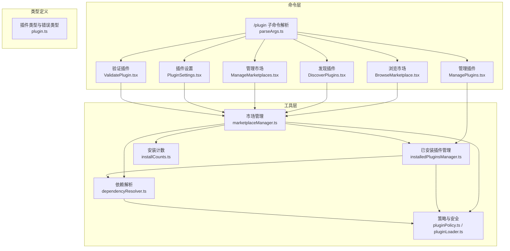
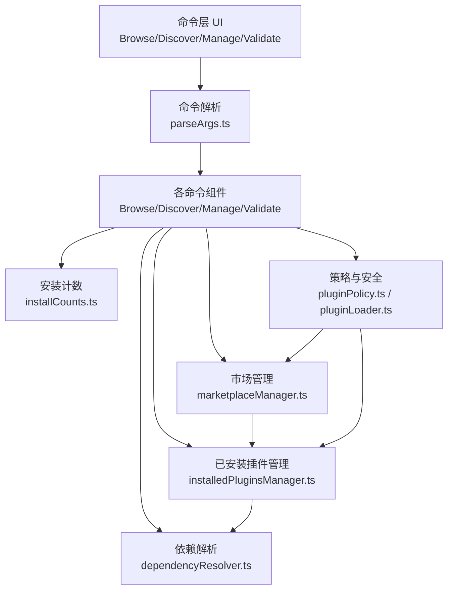
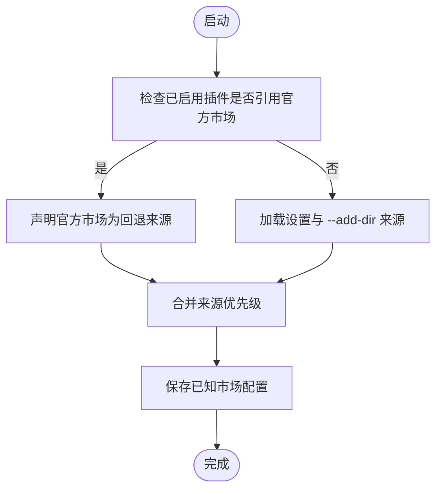
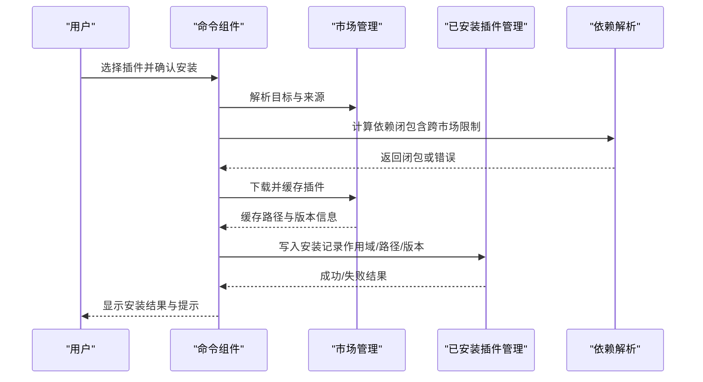
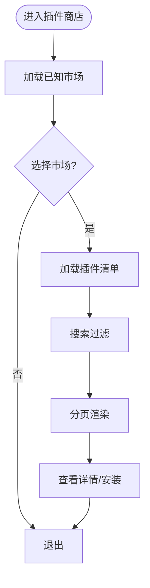
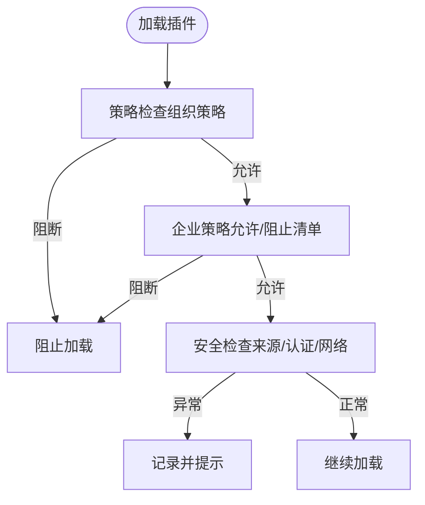
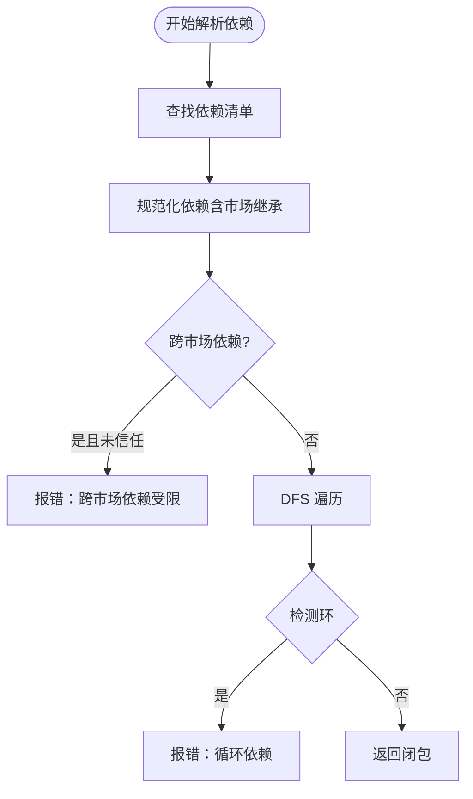
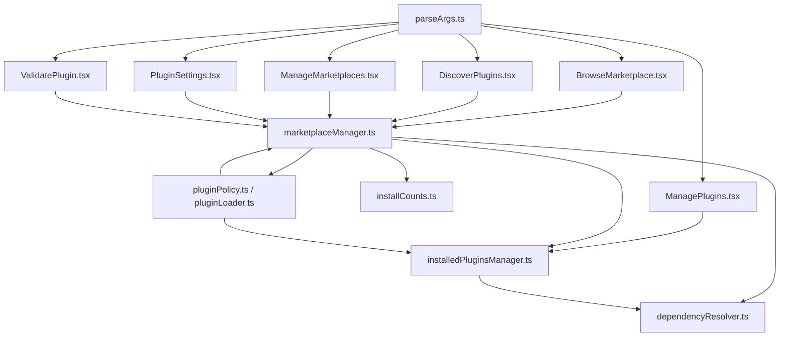

# 插件市场与生态管理

<cite>
**本文档引用的文件**
- [builtinPlugins.ts](file://src/plugins/builtinPlugins.ts)
- [parseArgs.ts](file://src/commands/plugin/parseArgs.ts)
- [usePagination.ts](file://src/commands/plugin/usePagination.ts)
- [BrowseMarketplace.tsx](file://src/commands/plugin/BrowseMarketplace.tsx)
- [DiscoverPlugins.tsx](file://src/commands/plugin/DiscoverPlugins.tsx)
- [ManageMarketplaces.tsx](file://src/commands/plugin/ManageMarketplaces.tsx)
- [ManagePlugins.tsx](file://src/commands/plugin/ManagePlugins.tsx)
- [PluginSettings.tsx](file://src/commands/plugin/PluginSettings.tsx)
- [ValidatePlugin.tsx](file://src/commands/plugin/ValidatePlugin.tsx)
- [marketplaceManager.ts](file://src/utils/plugins/marketplaceManager.ts)
- [installedPluginsManager.ts](file://src/utils/plugins/installedPluginsManager.ts)
- [dependencyResolver.ts](file://src/utils/plugins/dependencyResolver.ts)
- [installCounts.ts](file://src/utils/plugins/installCounts.ts)
- [pluginPolicy.ts](file://src/utils/plugins/pluginPolicy.ts)
- [pluginLoader.ts](file://src/utils/plugins/pluginLoader.ts)
- [plugin.ts](file://src/types/plugin.ts)
</cite>

## 目录
1. [简介](#简介)
2. [项目结构](#项目结构)
3. [核心组件](#核心组件)
4. [架构总览](#架构总览)
5. [详细组件分析](#详细组件分析)
6. [依赖关系分析](#依赖关系分析)
7. [性能考虑](#性能考虑)
8. [故障排查指南](#故障排查指南)
9. [结论](#结论)
10. [附录](#附录)

## 简介
本文件系统性阐述 Claude Code 插件生态的市场与生态管理体系，覆盖官方市场、第三方市场与私有市场的运营模式；插件的发现、安装、更新、卸载流程；插件商店的使用与搜索机制；质量控制、审核标准与安全检查；版本管理、依赖解析与冲突处理；统计分析（下载量统计与用户评价）；生态发展策略、社区建设与支持机制；以及商业化模式（付费与免费插件管理）。文档基于仓库源码进行深入分析，配合可视化图示帮助读者快速理解系统架构与运行机制。

## 项目结构
插件生态相关代码主要分布在以下模块：
- 命令层：/plugin 子命令解析与交互界面（BrowseMarketplace、DiscoverPlugins、ManagePlugins、ManageMarketplaces、PluginSettings、ValidatePlugin）
- 工具层：市场管理（marketplaceManager）、已安装插件管理（installedPluginsManager）、依赖解析（dependencyResolver）、安装计数（installCounts）、策略与安全（pluginPolicy、pluginLoader）
- 类型定义：插件类型与错误类型（plugin.ts）

**图表来源**
- [parseArgs.ts:1-104](file://src/commands/plugin/parseArgs.ts#L1-L104)
- [BrowseMarketplace.tsx:50-272](file://src/commands/plugin/BrowseMarketplace.tsx#L50-L272)
- [DiscoverPlugins.tsx:62-624](file://src/commands/plugin/DiscoverPlugins.tsx#L62-L624)
- [ManagePlugins.tsx:397-421](file://src/commands/plugin/ManagePlugins.tsx#L397-L421)
- [ManageMarketplaces.tsx:49-105](file://src/commands/plugin/ManageMarketplaces.tsx#L49-L105)
- [PluginSettings.tsx:21-61](file://src/commands/plugin/PluginSettings.tsx#L21-L61)
- [ValidatePlugin.tsx:1-98](file://src/commands/plugin/ValidatePlugin.tsx#L1-L98)
- [marketplaceManager.ts:1-800](file://src/utils/plugins/marketplaceManager.ts#L1-L800)
- [installedPluginsManager.ts:1-800](file://src/utils/plugins/installedPluginsManager.ts#L1-L800)
- [dependencyResolver.ts:1-306](file://src/utils/plugins/dependencyResolver.ts#L1-L306)
- [installCounts.ts:1-292](file://src/utils/plugins/installCounts.ts#L1-L292)
- [pluginPolicy.ts:1-20](file://src/utils/plugins/pluginPolicy.ts#L1-L20)
- [pluginLoader.ts:1922-1936](file://src/utils/plugins/pluginLoader.ts#L1922-L1936)
- [plugin.ts:1-364](file://src/types/plugin.ts#L1-L364)

**章节来源**
- [parseArgs.ts:1-104](file://src/commands/plugin/parseArgs.ts#L1-L104)
- [marketplaceManager.ts:1-800](file://src/utils/plugins/marketplaceManager.ts#L1-L800)

## 核心组件
- 插件注册与内置插件管理：内置插件通过注册表统一管理，支持启用/禁用与多组件提供（技能、钩子、MCP 服务器），并以特定标识区分于市场插件。
- 市场管理：支持多种来源（URL、GitHub、本地文件、npm 包等），缓存市场清单，跟踪配置与自动更新，提供市场添加/移除/更新/列表操作。
- 已安装插件管理：集中管理已安装插件元数据（版本、时间戳、路径），支持多作用域（用户/项目/本地/受管），提供迁移、清理、挂起更新检测等功能。
- 依赖解析：实现跨市场依赖的安全限制与循环依赖检测，支持安装时闭包解析与加载时一致性校验。
- 搜索与分页：提供连续滚动分页与搜索过滤，支持按名称、描述、市场名筛选。
- 质量与安全：策略检查（组织策略强制禁用）、企业策略（允许/阻止清单）、安全检查（来源白名单/黑名单、SSH/Git 提示）。
- 统计与评价：从官方统计仓库拉取安装计数，缓存 24 小时，提供格式化展示。

**章节来源**
- [builtinPlugins.ts:1-160](file://src/plugins/builtinPlugins.ts#L1-L160)
- [marketplaceManager.ts:1-800](file://src/utils/plugins/marketplaceManager.ts#L1-L800)
- [installedPluginsManager.ts:1-800](file://src/utils/plugins/installedPluginsManager.ts#L1-L800)
- [dependencyResolver.ts:1-306](file://src/utils/plugins/dependencyResolver.ts#L1-L306)
- [usePagination.ts:1-172](file://src/commands/plugin/usePagination.ts#L1-L172)
- [pluginPolicy.ts:1-20](file://src/utils/plugins/pluginPolicy.ts#L1-L20)
- [installCounts.ts:1-292](file://src/utils/plugins/installCounts.ts#L1-L292)

## 架构总览
下图展示了插件生态的总体架构：命令层负责用户交互与参数解析；工具层提供市场、安装、依赖、策略与统计能力；类型定义确保强类型约束与错误分类。

**图表来源**
- [parseArgs.ts:1-104](file://src/commands/plugin/parseArgs.ts#L1-L104)
- [BrowseMarketplace.tsx:50-272](file://src/commands/plugin/BrowseMarketplace.tsx#L50-L272)
- [DiscoverPlugins.tsx:62-624](file://src/commands/plugin/DiscoverPlugins.tsx#L62-L624)
- [ManagePlugins.tsx:397-421](file://src/commands/plugin/ManagePlugins.tsx#L397-L421)
- [ValidatePlugin.tsx:1-98](file://src/commands/plugin/ValidatePlugin.tsx#L1-L98)
- [marketplaceManager.ts:1-800](file://src/utils/plugins/marketplaceManager.ts#L1-L800)
- [installedPluginsManager.ts:1-800](file://src/utils/plugins/installedPluginsManager.ts#L1-L800)
- [dependencyResolver.ts:1-306](file://src/utils/plugins/dependencyResolver.ts#L1-L306)
- [installCounts.ts:1-292](file://src/utils/plugins/installCounts.ts#L1-L292)
- [pluginPolicy.ts:1-20](file://src/utils/plugins/pluginPolicy.ts#L1-L20)
- [pluginLoader.ts:1922-1936](file://src/utils/plugins/pluginLoader.ts#L1922-L1936)

## 详细组件分析

### 官方市场、第三方市场与私有市场
- 官方市场：内置声明为“回退来源”，当启用插件引用官方市场时自动声明，避免被其他来源覆盖。
- 第三方市场：通过设置或 --add-dir 注册，支持 URL/GitHub/本地文件等多种来源，自动更新可配置。
- 私有市场：通过本地文件或受控种子目录注册，管理员可控，用户无法直接修改。

**图表来源**
- [marketplaceManager.ts:161-192](file://src/utils/plugins/marketplaceManager.ts#L161-L192)

**章节来源**
- [marketplaceManager.ts:161-192](file://src/utils/plugins/marketplaceManager.ts#L161-L192)

### 插件发现、安装、更新与卸载流程
- 发现：从已知市场加载清单，过滤已安装与策略禁用项，支持搜索与分页。
- 安装：解析目标（插件名或市场 URL），执行依赖闭包解析（跨市场依赖受控），下载到版本化缓存目录，更新安装记录。
- 更新：非就地更新策略，先下载新版本至缓存，记录磁盘状态变更，等待重启生效；支持挂起更新检测与详情展示。
- 卸载：按作用域删除安装记录，清理选项与缓存目录。

**图表来源**
- [DiscoverPlugins.tsx:62-624](file://src/commands/plugin/DiscoverPlugins.tsx#L62-L624)
- [marketplaceManager.ts:1-800](file://src/utils/plugins/marketplaceManager.ts#L1-L800)
- [installedPluginsManager.ts:406-443](file://src/utils/plugins/installedPluginsManager.ts#L406-L443)
- [dependencyResolver.ts:95-159](file://src/utils/plugins/dependencyResolver.ts#L95-L159)

**章节来源**
- [DiscoverPlugins.tsx:62-624](file://src/commands/plugin/DiscoverPlugins.tsx#L62-L624)
- [marketplaceManager.ts:1-800](file://src/utils/plugins/marketplaceManager.ts#L1-L800)
- [installedPluginsManager.ts:406-443](file://src/utils/plugins/installedPluginsManager.ts#L406-L443)
- [dependencyResolver.ts:95-159](file://src/utils/plugins/dependencyResolver.ts#L95-L159)

### 插件商店使用与搜索机制
- 列表与详情：支持市场选择、插件列表、详情菜单、安装计数展示。
- 搜索：按名称/描述/市场名过滤，支持终端焦点与搜索输入框。
- 分页：连续滚动分页，保持选中项可见，显示滚动位置。

**图表来源**
- [BrowseMarketplace.tsx:161-801](file://src/commands/plugin/BrowseMarketplace.tsx#L161-L801)
- [DiscoverPlugins.tsx:88-93](file://src/commands/plugin/DiscoverPlugins.tsx#L88-L93)
- [usePagination.ts:48-172](file://src/commands/plugin/usePagination.ts#L48-L172)

**章节来源**
- [BrowseMarketplace.tsx:161-801](file://src/commands/plugin/BrowseMarketplace.tsx#L161-L801)
- [DiscoverPlugins.tsx:88-93](file://src/commands/plugin/DiscoverPlugins.tsx#L88-L93)
- [usePagination.ts:48-172](file://src/commands/plugin/usePagination.ts#L48-L172)

### 质量控制、审核标准与安全检查
- 策略检查：组织策略强制禁用插件，安装/启用/UI 过滤统一依据策略。
- 企业策略：严格允许清单与阻止清单，未知来源在存在企业策略时按“失败关闭”原则阻断。
- 安全检查：来源白名单/黑名单、SSH 主机密钥验证、认证失败增强提示、网络/超时错误分类与友好消息。

**图表来源**
- [pluginPolicy.ts:17-20](file://src/utils/plugins/pluginPolicy.ts#L17-L20)
- [pluginLoader.ts:1922-1936](file://src/utils/plugins/pluginLoader.ts#L1922-L1936)

**章节来源**
- [pluginPolicy.ts:1-20](file://src/utils/plugins/pluginPolicy.ts#L1-L20)
- [pluginLoader.ts:1922-1936](file://src/utils/plugins/pluginLoader.ts#L1922-L1936)

### 版本管理、依赖解析与冲突处理
- 版本化缓存：插件缓存采用“市场/插件/版本”结构，非就地更新，磁盘状态变更后等待重启生效。
- 依赖解析：安装时 DFS 闭包解析，跨市场依赖需显式信任；加载时固定点校验，不满足则降级（demote）。
- 冲突处理：循环依赖检测、反向依赖查找（卸载/禁用前警告）、依赖未满足错误分类。

**图表来源**
- [dependencyResolver.ts:95-159](file://src/utils/plugins/dependencyResolver.ts#L95-L159)

**章节来源**
- [installedPluginsManager.ts:537-587](file://src/utils/plugins/installedPluginsManager.ts#L537-L587)
- [dependencyResolver.ts:177-234](file://src/utils/plugins/dependencyResolver.ts#L177-L234)

### 统计分析与用户评价
- 安装计数：从官方统计仓库拉取插件安装数据，缓存 24 小时，提供格式化展示（千/百万单位）。
- 用户评价：当前实现聚焦安装计数，未见评价系统代码。

**章节来源**
- [installCounts.ts:225-292](file://src/utils/plugins/installCounts.ts#L225-L292)

### 商业化模式与生态策略
- 免费插件：默认开放安装与使用，遵循市场与策略规则。
- 付费插件：当前仓库未发现付费插件的专用实现或接口；商业化可通过市场来源与策略控制实现。
- 生态策略：通过市场来源控制（官方/第三方/私有）、企业策略（允许/阻止清单）、依赖信任（跨市场白名单）构建健康生态。

**章节来源**
- [marketplaceManager.ts:161-192](file://src/utils/plugins/marketplaceManager.ts#L161-L192)
- [pluginPolicy.ts:17-20](file://src/utils/plugins/pluginPolicy.ts#L17-L20)
- [dependencyResolver.ts:118-132](file://src/utils/plugins/dependencyResolver.ts#L118-L132)

## 依赖关系分析

**图表来源**
- [parseArgs.ts:1-104](file://src/commands/plugin/parseArgs.ts#L1-L104)
- [BrowseMarketplace.tsx:50-272](file://src/commands/plugin/BrowseMarketplace.tsx#L50-L272)
- [DiscoverPlugins.tsx:62-624](file://src/commands/plugin/DiscoverPlugins.tsx#L62-L624)
- [ManagePlugins.tsx:397-421](file://src/commands/plugin/ManagePlugins.tsx#L397-L421)
- [ManageMarketplaces.tsx:49-105](file://src/commands/plugin/ManageMarketplaces.tsx#L49-L105)
- [PluginSettings.tsx:21-61](file://src/commands/plugin/PluginSettings.tsx#L21-L61)
- [ValidatePlugin.tsx:1-98](file://src/commands/plugin/ValidatePlugin.tsx#L1-L98)
- [marketplaceManager.ts:1-800](file://src/utils/plugins/marketplaceManager.ts#L1-L800)
- [installedPluginsManager.ts:1-800](file://src/utils/plugins/installedPluginsManager.ts#L1-L800)
- [dependencyResolver.ts:1-306](file://src/utils/plugins/dependencyResolver.ts#L1-L306)
- [installCounts.ts:1-292](file://src/utils/plugins/installCounts.ts#L1-L292)
- [pluginPolicy.ts:1-20](file://src/utils/plugins/pluginPolicy.ts#L1-L20)
- [pluginLoader.ts:1922-1936](file://src/utils/plugins/pluginLoader.ts#L1922-L1936)

**章节来源**
- [plugin.ts:101-283](file://src/types/plugin.ts#L101-L283)

## 性能考虑
- 缓存策略：市场清单与安装计数缓存减少网络请求与重复解析开销。
- 非就地更新：磁盘状态与内存状态分离，避免频繁 I/O 干扰运行时性能。
- 分页与搜索：连续滚动分页降低 DOM 渲染压力，搜索过滤在客户端进行以提升响应速度。
- 依赖解析：DFS 闭包与固定点校验在安装/加载阶段执行，避免运行期额外开销。

## 故障排查指南
- 市场加载失败：检查网络连接、来源 URL/Git 认证配置；查看增强错误消息（SSH 主机密钥变化、权限不足、超时）。
- 插件安装失败：查看依赖解析错误（循环依赖、跨市场依赖受限、依赖未满足）；检查策略禁用与企业策略。
- 加载计数不可用：检查缓存文件完整性与时效（24 小时 TTL），必要时手动刷新。
- 错误类型与消息：参考类型定义中的错误分类与消息映射，便于定位问题与用户提示。

**章节来源**
- [pluginLoader.ts:649-709](file://src/utils/plugins/pluginLoader.ts#L649-L709)
- [plugin.ts:101-283](file://src/types/plugin.ts#L101-L283)

## 结论
该插件生态体系通过清晰的职责划分与强类型约束，实现了从市场管理、安装更新到依赖解析与安全策略的全链路闭环。官方/第三方/私有市场的灵活组合，配合企业策略与依赖信任机制，既保障了生态多样性，又维护了安全性与稳定性。未来可在用户评价、付费插件支持等方面进一步完善，以支撑更丰富的商业化与社区协作场景。

## 附录
- 内置插件标识：以“@builtin”后缀区分内置插件与市场插件。
- 作用域与迁移：已安装插件系统采用单文件格式（V2），支持从 V1/V2 双文件迁移与遗留缓存清理。
- 类型与错误：统一的错误类型定义为 UI 展示与日志记录提供一致语义。

**章节来源**
- [builtinPlugins.ts:23-39](file://src/plugins/builtinPlugins.ts#L23-L39)
- [installedPluginsManager.ts:115-182](file://src/utils/plugins/installedPluginsManager.ts#L115-L182)
- [plugin.ts:101-283](file://src/types/plugin.ts#L101-L283)