# 插件开发指南

<cite>
**本文档引用的文件**
- [builtinPlugins.ts](file://src/plugins/builtinPlugins.ts)
- [plugin.ts](file://src/types/plugin.ts)
- [useManagePlugins.ts](file://src/hooks/useManagePlugins.ts)
- [pluginLoader.ts](file://src/utils/plugins/pluginLoader.ts)
- [loadPluginCommands.ts](file://src/utils/plugins/loadPluginCommands.ts)
- [loadPluginAgents.ts](file://src/utils/plugins/loadPluginAgents.ts)
- [loadPluginHooks.ts](file://src/utils/plugins/loadPluginHooks.ts)
- [pluginDirectories.ts](file://src/utils/plugins/pluginDirectories.ts)
- [schemas.ts](file://src/utils/plugins/schemas.ts)
- [bundledSkills.ts](file://src/skills/bundledSkills.ts)
- [index.ts](file://src/skills/bundled/index.ts)
- [pluginIdentifier.ts](file://src/utils/plugins/pluginIdentifier.ts)
- [package.json](file://package.json)
</cite>

## 目录
1. [简介](#简介)
2. [项目结构](#项目结构)
3. [核心组件](#核心组件)
4. [架构总览](#架构总览)
5. [详细组件分析](#详细组件分析)
6. [依赖关系分析](#依赖关系分析)
7. [性能考虑](#性能考虑)
8. [故障排除指南](#故障排除指南)
9. [结论](#结论)
10. [附录](#附录)

## 简介
本指南面向希望在 Claude Code 生态中开发插件的开发者，覆盖从项目初始化、目录结构、配置与元数据定义，到插件 API 接口规范（命令注册、工具扩展、钩子系统）、最佳实践、调试与测试、发布流程，以及版本管理与依赖声明的完整开发流程。文档基于仓库中的插件系统实现进行深入解析，并提供可操作的开发步骤与可视化图示。

## 项目结构
Claude Code 的插件系统由“内置插件注册中心”、“插件加载器”、“组件加载器（命令/代理/钩子）”、“目录与缓存管理”、“模式校验与标识符解析”等多个模块协同工作构成。下图展示了插件系统的核心文件与交互关系：

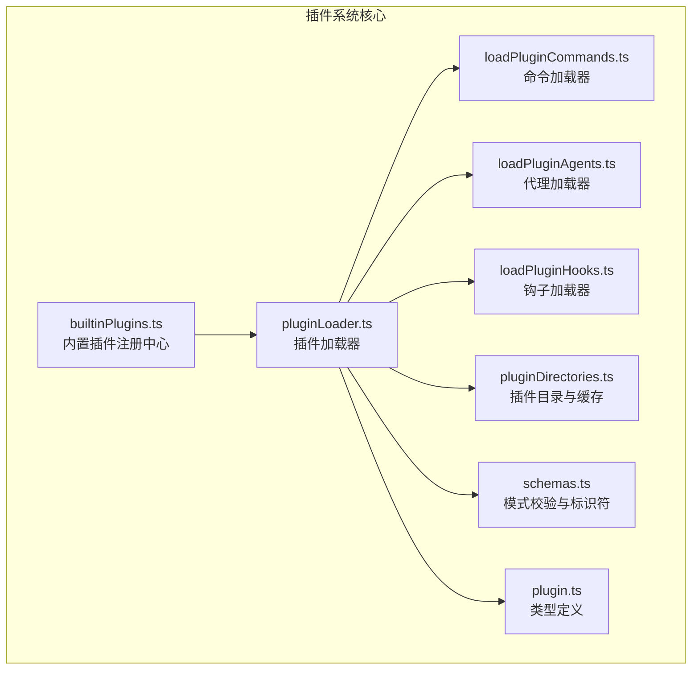

图表来源
- [builtinPlugins.ts:1-160](file://src/plugins/builtinPlugins.ts#L1-L160)
- [pluginLoader.ts:1-3303](file://src/utils/plugins/pluginLoader.ts#L1-L3303)
- [loadPluginCommands.ts:1-947](file://src/utils/plugins/loadPluginCommands.ts#L1-L947)
- [loadPluginAgents.ts:1-349](file://src/utils/plugins/loadPluginAgents.ts#L1-L349)
- [loadPluginHooks.ts:1-288](file://src/utils/plugins/loadPluginHooks.ts#L1-L288)
- [pluginDirectories.ts:1-179](file://src/utils/plugins/pluginDirectories.ts#L1-L179)
- [schemas.ts:1-1682](file://src/utils/plugins/schemas.ts#L1-L1682)
- [plugin.ts:1-364](file://src/types/plugin.ts#L1-L364)

章节来源
- [builtinPlugins.ts:1-160](file://src/plugins/builtinPlugins.ts#L1-L160)
- [pluginLoader.ts:1-3303](file://src/utils/plugins/pluginLoader.ts#L1-L3303)
- [pluginDirectories.ts:1-179](file://src/utils/plugins/pluginDirectories.ts#L1-L179)

## 核心组件
- 内置插件注册中心：负责内置插件的注册、可用性判断、启用状态持久化与聚合导出。
- 插件加载器：负责发现、安装、缓存、验证与加载插件，支持多种来源（市场、本地、内联）。
- 组件加载器：分别负责命令（含技能）、代理、钩子的加载与注册。
- 目录与缓存：统一管理插件根目录、种子目录、版本化缓存路径与数据目录。
- 模式校验与标识符：提供插件清单、钩子、MCP/LSP 配置的强类型校验，以及插件标识符解析。
- 类型定义：统一承载 LoadedPlugin、PluginError、HooksSettings 等核心类型。

章节来源
- [plugin.ts:1-364](file://src/types/plugin.ts#L1-L364)
- [builtinPlugins.ts:1-160](file://src/plugins/builtinPlugins.ts#L1-L160)
- [pluginLoader.ts:1-3303](file://src/utils/plugins/pluginLoader.ts#L1-L3303)
- [loadPluginCommands.ts:1-947](file://src/utils/plugins/loadPluginCommands.ts#L1-L947)
- [loadPluginAgents.ts:1-349](file://src/utils/plugins/loadPluginAgents.ts#L1-L349)
- [loadPluginHooks.ts:1-288](file://src/utils/plugins/loadPluginHooks.ts#L1-L288)
- [pluginDirectories.ts:1-179](file://src/utils/plugins/pluginDirectories.ts#L1-L179)
- [schemas.ts:1-1682](file://src/utils/plugins/schemas.ts#L1-L1682)

## 架构总览
下图展示插件从发现到生效的端到端流程，包括内置插件与市场插件两条路径：

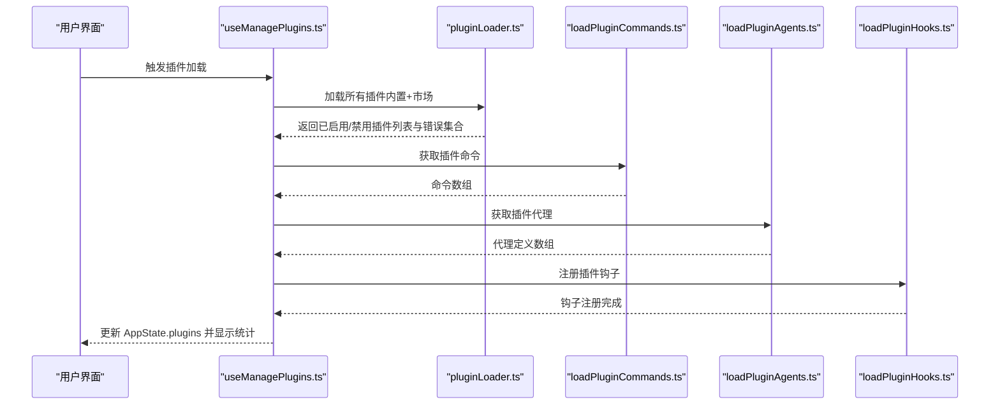

图表来源
- [useManagePlugins.ts:1-305](file://src/hooks/useManagePlugins.ts#L1-L305)
- [pluginLoader.ts:1-3303](file://src/utils/plugins/pluginLoader.ts#L1-L3303)
- [loadPluginCommands.ts:1-947](file://src/utils/plugins/loadPluginCommands.ts#L1-L947)
- [loadPluginAgents.ts:1-349](file://src/utils/plugins/loadPluginAgents.ts#L1-L349)
- [loadPluginHooks.ts:1-288](file://src/utils/plugins/loadPluginHooks.ts#L1-L288)

## 详细组件分析

### 内置插件注册中心（builtinPlugins.ts）
- 职责：注册内置插件、判断可用性、读取用户设置决定启用状态、生成 LoadedPlugin 结构。
- 关键点：
  - 插件 ID 使用 `{name}@builtin` 格式区分于市场插件。
  - 支持默认启用状态回退与用户偏好覆盖。
  - 将内置技能转换为命令对象，供命令系统使用。

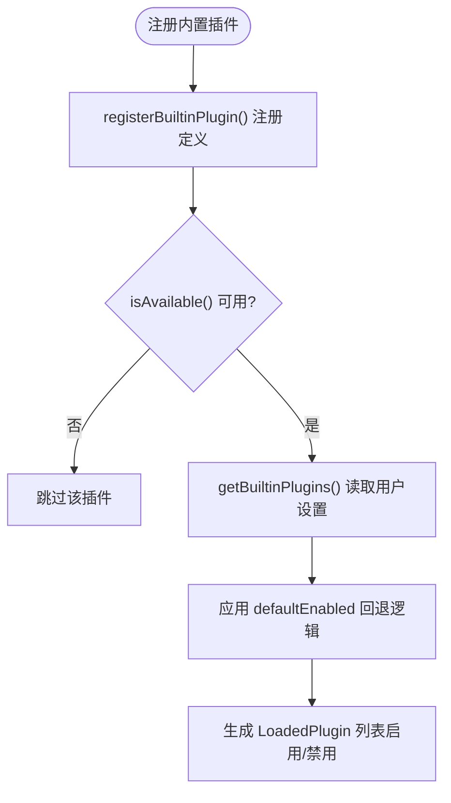

图表来源
- [builtinPlugins.ts:25-102](file://src/plugins/builtinPlugins.ts#L25-L102)

章节来源
- [builtinPlugins.ts:1-160](file://src/plugins/builtinPlugins.ts#L1-L160)

### 插件加载器（pluginLoader.ts）
- 职责：统一发现、安装、缓存、验证与加载插件；支持多来源（市场、本地、内联）；提供版本化缓存与种子目录支持；处理依赖解析与错误收集。
- 关键点：
  - 插件目录结构约定（commands/、agents/、hooks/、plugin.json 等）。
  - 版本化缓存路径计算与 ZIP 缓存模式。
  - 支持 git 子目录源、NPM 包源、本地源等多种安装方式。
  - 错误类型丰富，便于定位问题。

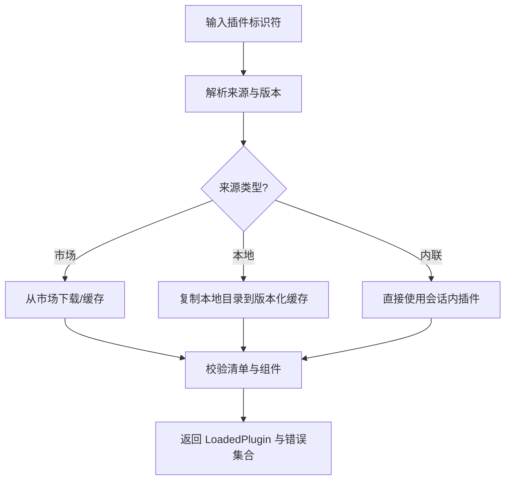

图表来源
- [pluginLoader.ts:1-3303](file://src/utils/plugins/pluginLoader.ts#L1-L3303)

章节来源
- [pluginLoader.ts:1-3303](file://src/utils/plugins/pluginLoader.ts#L1-L3303)

### 命令加载器（loadPluginCommands.ts）
- 职责：从插件的 commands/ 目录或自定义路径加载命令与技能，解析 Markdown 前言元数据，构建 Command 对象。
- 关键点：
  - 支持对象映射格式的命令元数据（含 source 或 inline content）。
  - 支持技能目录（含 SKILL.md）与普通命令文件。
  - 参数替换、变量替换、用户配置注入、shell 执行等能力。

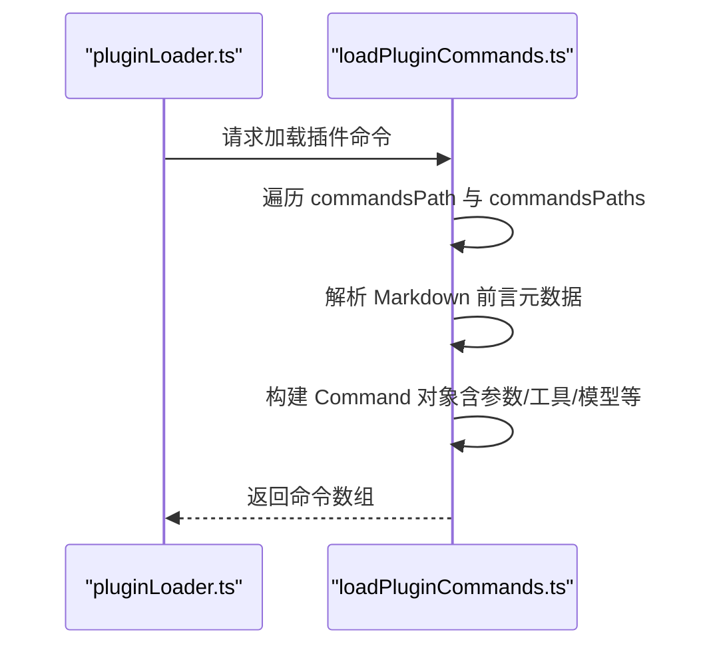

图表来源
- [loadPluginCommands.ts:1-947](file://src/utils/plugins/loadPluginCommands.ts#L1-L947)

章节来源
- [loadPluginCommands.ts:1-947](file://src/utils/plugins/loadPluginCommands.ts#L1-L947)

### 代理加载器（loadPluginAgents.ts）
- 职责：从插件的 agents/ 目录加载代理定义，解析前言元数据，构建 AgentDefinition。
- 关键点：
  - 支持工具、技能、颜色、模型、内存范围、隔离模式、最大轮次等配置。
  - 自动注入文件读写/编辑工具以支持自动记忆。

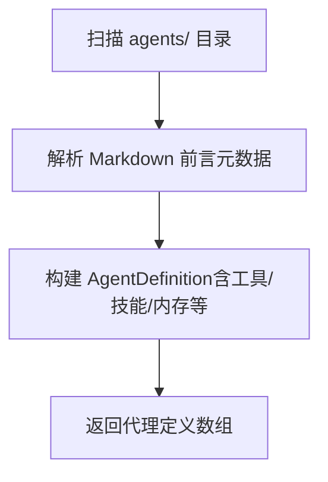

图表来源
- [loadPluginAgents.ts:1-349](file://src/utils/plugins/loadPluginAgents.ts#L1-L349)

章节来源
- [loadPluginAgents.ts:1-349](file://src/utils/plugins/loadPluginAgents.ts#L1-L349)

### 钩子加载器（loadPluginHooks.ts）
- 职责：将插件钩子配置转换为匹配器并注册到全局钩子系统，支持热重载与按插件裁剪。
- 关键点：
  - 提供 clearPluginHookCache 与 pruneRemovedPluginHooks，确保卸载/禁用插件的钩子及时移除。
  - 通过设置变更检测触发热重载。

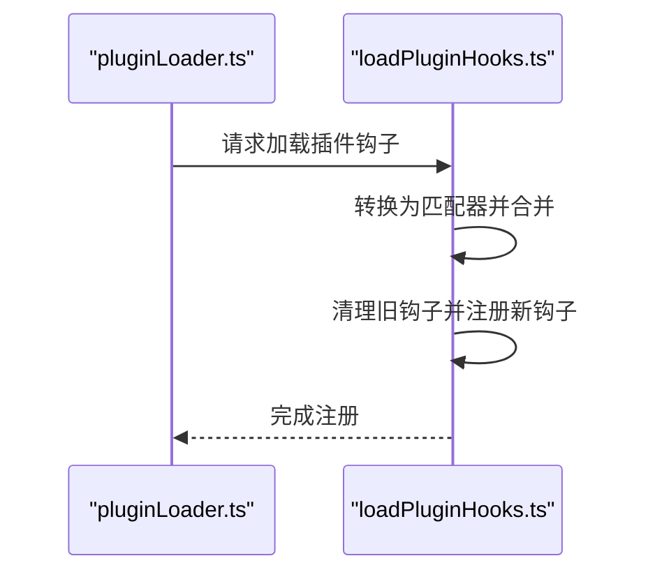

图表来源
- [loadPluginHooks.ts:1-288](file://src/utils/plugins/loadPluginHooks.ts#L1-L288)

章节来源
- [loadPluginHooks.ts:1-288](file://src/utils/plugins/loadPluginHooks.ts#L1-L288)

### 目录与缓存（pluginDirectories.ts）
- 职责：集中管理插件根目录、种子目录、版本化缓存路径、数据目录（持久化）。
- 关键点：
  - 支持通过环境变量覆盖插件根目录与种子目录。
  - 提供数据目录大小统计与清理能力。

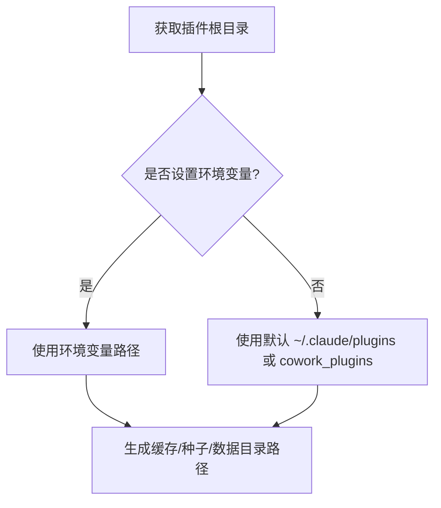

图表来源
- [pluginDirectories.ts:1-179](file://src/utils/plugins/pluginDirectories.ts#L1-L179)

章节来源
- [pluginDirectories.ts:1-179](file://src/utils/plugins/pluginDirectories.ts#L1-L179)

### 模式校验与标识符（schemas.ts、pluginIdentifier.ts）
- 职责：提供插件清单、钩子、MCP/LSP 配置的强类型校验；解析插件标识符与作用域映射。
- 关键点：
  - marketplace 名称安全校验（阻止官方名称仿冒）。
  - 插件 ID 解析与构建、作用域与设置源映射。

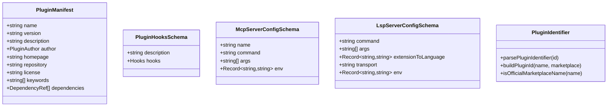

图表来源
- [schemas.ts:250-800](file://src/utils/plugins/schemas.ts#L250-L800)
- [pluginIdentifier.ts:1-124](file://src/utils/plugins/pluginIdentifier.ts#L1-L124)

章节来源
- [schemas.ts:1-1682](file://src/utils/plugins/schemas.ts#L1-L1682)
- [pluginIdentifier.ts:1-124](file://src/utils/plugins/pluginIdentifier.ts#L1-L124)

### 内置技能（bundledSkills.ts、skills/bundled/index.ts）
- 职责：内置技能注册与运行时提取参考文件，统一命令接口。
- 关键点：
  - 注册内置技能时可指定文件一次性提取到磁盘，供模型按需读取。
  - 与命令系统保持一致的 Command 接口。

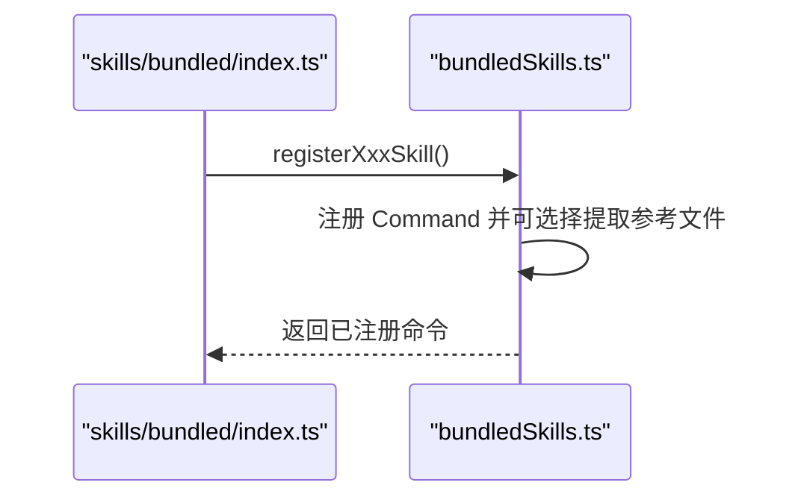

图表来源
- [bundledSkills.ts:1-221](file://src/skills/bundledSkills.ts#L1-L221)
- [index.ts:1-80](file://src/skills/bundled/index.ts#L1-L80)

章节来源
- [bundledSkills.ts:1-221](file://src/skills/bundledSkills.ts#L1-L221)
- [index.ts:1-80](file://src/skills/bundled/index.ts#L1-L80)

## 依赖关系分析
- 组件耦合：
  - useManagePlugins.ts 是插件生命周期的协调者，依赖 pluginLoader.ts 与各组件加载器。
  - pluginLoader.ts 依赖 schemas.ts 进行强类型校验，依赖 pluginDirectories.ts 管理路径。
  - 各组件加载器依赖 pluginLoader.ts 的缓存结果，避免重复 IO。
- 外部依赖：
  - git、npm 等外部工具用于安装与克隆。
  - Zod 用于模式校验。

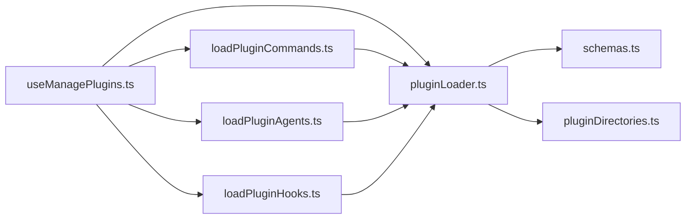

图表来源
- [useManagePlugins.ts:1-305](file://src/hooks/useManagePlugins.ts#L1-L305)
- [pluginLoader.ts:1-3303](file://src/utils/plugins/pluginLoader.ts#L1-L3303)
- [loadPluginCommands.ts:1-947](file://src/utils/plugins/loadPluginCommands.ts#L1-L947)
- [loadPluginAgents.ts:1-349](file://src/utils/plugins/loadPluginAgents.ts#L1-L349)
- [loadPluginHooks.ts:1-288](file://src/utils/plugins/loadPluginHooks.ts#L1-L288)
- [schemas.ts:1-1682](file://src/utils/plugins/schemas.ts#L1-L1682)
- [pluginDirectories.ts:1-179](file://src/utils/plugins/pluginDirectories.ts#L1-L179)

章节来源
- [useManagePlugins.ts:1-305](file://src/hooks/useManagePlugins.ts#L1-L305)
- [pluginLoader.ts:1-3303](file://src/utils/plugins/pluginLoader.ts#L1-L3303)

## 性能考虑
- 缓存与懒加载：
  - 插件命令与代理加载采用 memoize，避免重复解析。
  - 数据目录按需创建，减少不必要的 IO。
- 版本化缓存：
  - 使用版本化缓存路径与 ZIP 缓存模式，降低重复下载与解压成本。
- 并行处理：
  - 各插件组件加载采用 Promise.all 并行执行，提升整体吞吐。
- 路径与权限：
  - 严格校验路径与符号链接，防止循环与越权访问。

## 故障排除指南
- 常见错误类型（节选）：
  - 路径不存在、Git 认证失败、网络错误、清单解析/校验失败、插件未找到、市场受限、MCP/LSP 配置无效、请求超时/失败、依赖不满足、缓存缺失等。
- 定位建议：
  - 查看插件错误消息映射函数输出，结合日志与 Doctor UI 定位具体组件与原因。
  - 使用 /reload-plugins 刷新插件状态，检查钩子热重载是否生效。
  - 检查插件目录权限与种子目录配置，确认缓存命中情况。

章节来源
- [plugin.ts:101-364](file://src/types/plugin.ts#L101-L364)
- [useManagePlugins.ts:1-305](file://src/hooks/useManagePlugins.ts#L1-L305)

## 结论
本指南基于仓库现有插件系统实现，提供了从项目初始化、目录结构、配置与元数据定义，到命令/代理/钩子开发、版本与依赖管理、调试与测试、发布流程的完整开发路径。建议开发者遵循强类型校验、版本化缓存、并行加载与错误分类等最佳实践，确保插件在生产环境中的稳定性与可维护性。

## 附录

### 插件开发流程（从零到发布）
- 初始化项目
  - 创建插件根目录，准备 commands/、agents/、hooks/ 等目录。
  - 在根目录添加 plugin.json（可选），定义元数据与组件路径。
- 编写命令与技能
  - 在 commands/ 下编写 Markdown 文件，使用前言元数据声明描述、工具、模型、参数等。
  - 使用对象映射格式可在清单中声明命令元数据与来源。
- 编写代理
  - 在 agents/ 下编写 Markdown 文件，声明工具、技能、颜色、模型、内存范围等。
- 编写钩子
  - 在 hooks/ 下编写 hooks.json 或在清单中声明钩子配置。
- 配置与依赖
  - 在清单中声明 dependencies，确保前置插件已启用。
  - 如需 MCP/LSP，可在清单中声明相应服务器配置或 MCPB 文件。
- 开发与调试
  - 使用内置插件或内联模式进行快速迭代。
  - 通过 /reload-plugins 刷新插件状态，观察 Doctor UI 中的错误提示。
- 测试策略
  - 单元测试：对命令/代理/钩子的解析与构造逻辑进行断言。
  - 集成测试：模拟插件加载流程，验证缓存、依赖与错误处理。
- 发布与版本管理
  - 选择合适的 marketplace，遵循官方 marketplace 名称与来源规则。
  - 使用语义化版本或 Git SHA 进行版本标记，利用版本化缓存提升加载效率。
  - 在清单中声明依赖与用户配置项，确保用户在启用时被正确引导。

### 插件 API 接口规范（命令/代理/钩子）
- 命令注册
  - 通过 Markdown 文件与前言元数据定义命令行为，支持参数替换、工具限制、模型选择、effort 等。
  - 支持技能目录与对象映射格式的命令元数据。
- 代理扩展
  - 通过 Markdown 文件定义代理系统提示词、工具集、技能、颜色、模型、内存范围、隔离模式等。
- 钩子系统
  - 通过 hooks.json 或清单中的钩子配置，在生命周期事件中注入回调逻辑。
  - 支持热重载与按插件裁剪，确保卸载/禁用插件后钩子及时移除。

### 最佳实践与代码规范
- 目录与命名
  - 使用 kebab-case 命名插件与组件，避免空格与特殊字符。
  - 严格遵守插件目录结构约定。
- 元数据与校验
  - 使用 schemas.ts 中的模式进行清单与配置校验，确保字段完整性与类型正确。
- 错误处理
  - 利用 PluginError 类型体系，提供清晰的错误消息与上下文信息。
- 性能优化
  - 合理使用缓存与并行加载，避免重复解析与 IO。
  - 控制插件体积与依赖数量，减少启动时间。

### 版本管理、依赖声明与兼容性
- 版本管理
  - 使用语义化版本或 Git SHA 标记插件版本，配合版本化缓存路径。
- 依赖声明
  - 在清单中声明 dependencies，确保前置插件启用。
- 兼容性处理
  - 遵循 marketplace 名称安全规则，避免仿冒官方名称。
  - 通过设置源与作用域映射控制插件安装范围（用户/项目/本地/托管）。

章节来源
- [schemas.ts:1-1682](file://src/utils/plugins/schemas.ts#L1-L1682)
- [pluginIdentifier.ts:1-124](file://src/utils/plugins/pluginIdentifier.ts#L1-L124)
- [pluginLoader.ts:1-3303](file://src/utils/plugins/pluginLoader.ts#L1-L3303)