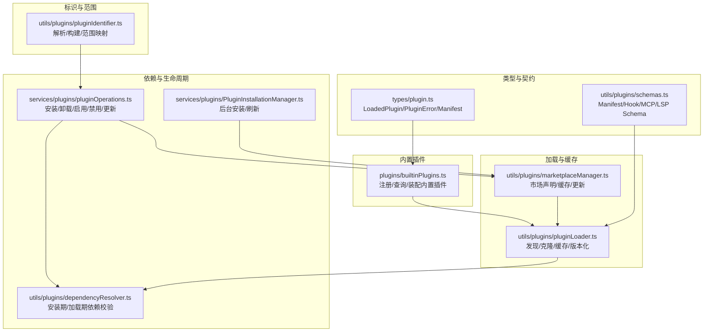
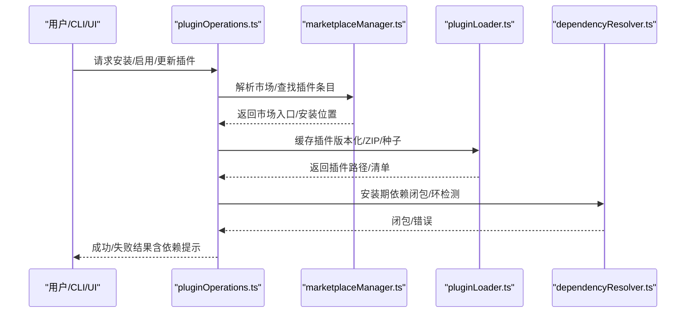
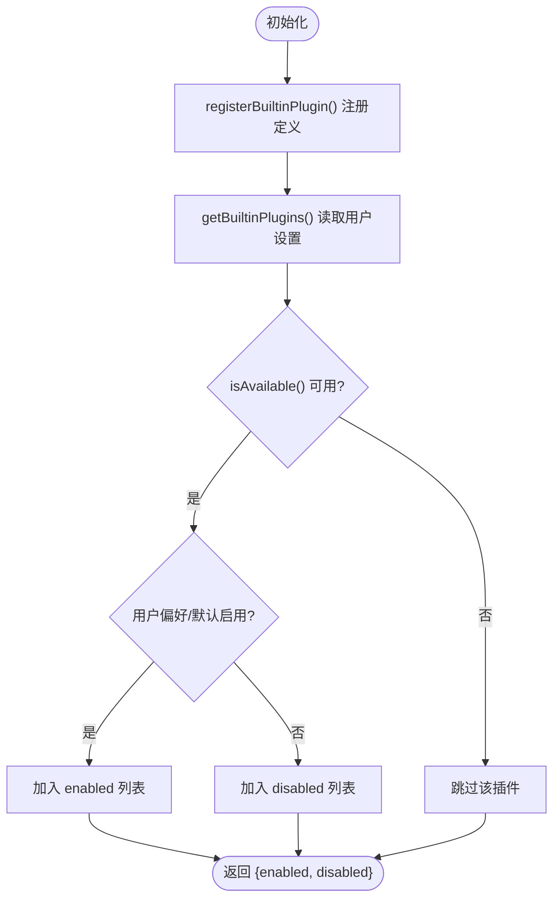
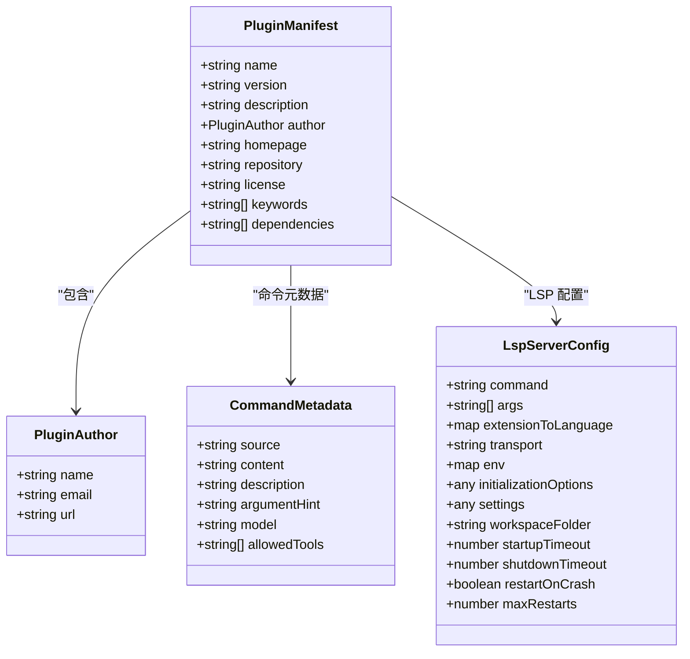
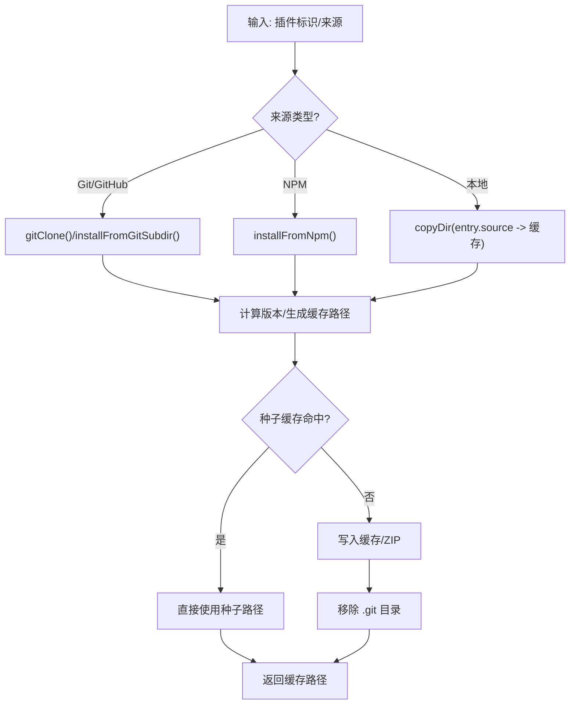
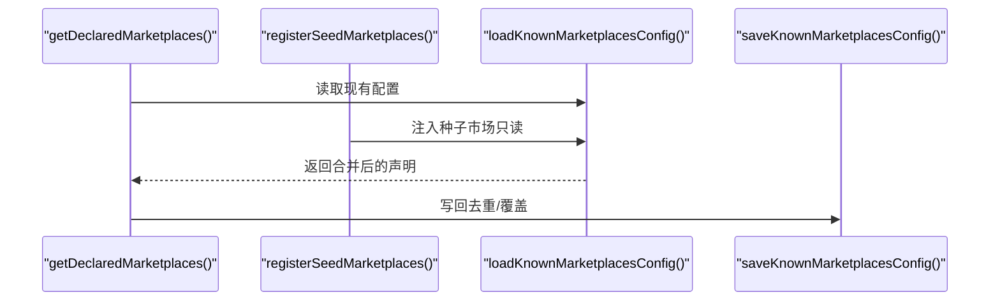
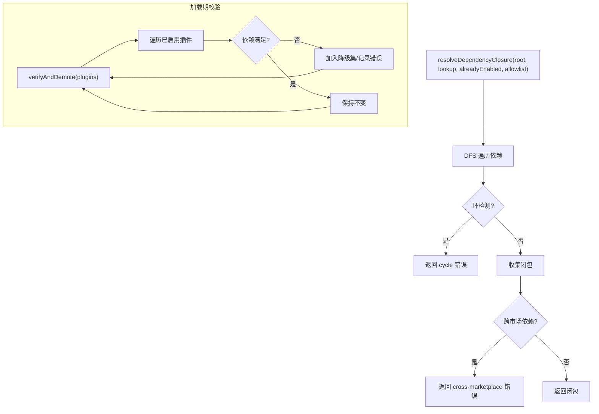
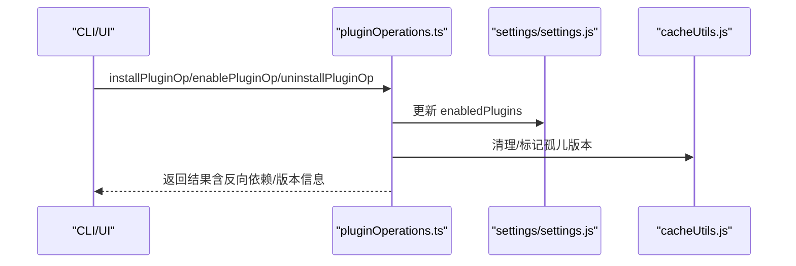
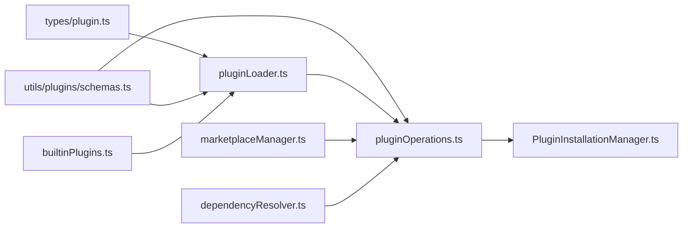

# 插件架构设计

<cite>
**本文档引用的文件**
- [builtinPlugins.ts](file://src/plugins/builtinPlugins.ts)
- [plugin.ts](file://src/types/plugin.ts)
- [PluginInstallationManager.ts](file://src/services/plugins/PluginInstallationManager.ts)
- [pluginOperations.ts](file://src/services/plugins/pluginOperations.ts)
- [pluginCliCommands.ts](file://src/services/plugins/pluginCliCommands.ts)
- [schemas.ts](file://src/utils/plugins/schemas.ts)
- [pluginLoader.ts](file://src/utils/plugins/pluginLoader.ts)
- [dependencyResolver.ts](file://src/utils/plugins/dependencyResolver.ts)
- [pluginIdentifier.ts](file://src/utils/plugins/pluginIdentifier.ts)
- [marketplaceManager.ts](file://src/utils/plugins/marketplaceManager.ts)
</cite>

## 目录
1. [简介](#简介)
2. [项目结构](#项目结构)
3. [核心组件](#核心组件)
4. [架构总览](#架构总览)
5. [详细组件分析](#详细组件分析)
6. [依赖分析](#依赖分析)
7. [性能考虑](#性能考虑)
8. [故障排除指南](#故障排除指南)
9. [结论](#结论)

## 简介
本文件系统性阐述 Claude Code 插件架构的设计理念与实现细节，覆盖插件加载机制、依赖解析系统、生命周期管理、目录规范与清单格式、与核心系统的集成方式、接口规范与 API 设计原则、安全机制与权限控制、配置管理与动态加载/卸载等。目标是帮助开发者快速理解并高效扩展插件体系。

## 项目结构
插件系统围绕以下模块协同工作：
- 类型与契约：定义插件数据模型、错误类型与组件类型
- 内置插件注册表：内置插件的声明、启用/禁用与装配
- 加载器：从市场/仓库/本地复制插件，缓存与版本化
- 市场管理：已知市场的声明、缓存、更新与同步（含种子市场）
- 依赖解析：安装期与加载期的依赖闭包与一致性校验
- 操作层：CLI 与 UI 的安装/卸载/启用/禁用/更新操作
- 安装管理器：后台自动安装与刷新插件
- 标识与范围：插件标识解析、作用域映射与策略检查

**图表来源**
- [plugin.ts:48-70](file://src/types/plugin.ts#L48-L70)
- [schemas.ts:274-320](file://src/utils/plugins/schemas.ts#L274-L320)
- [builtinPlugins.ts:18-35](file://src/plugins/builtinPlugins.ts#L18-L35)
- [pluginLoader.ts:10-33](file://src/utils/plugins/pluginLoader.ts#L10-L33)
- [marketplaceManager.ts:10-19](file://src/utils/plugins/marketplaceManager.ts#L10-L19)
- [dependencyResolver.ts:1-12](file://src/utils/plugins/dependencyResolver.ts#L1-L12)
- [pluginOperations.ts:14-13](file://src/services/plugins/pluginOperations.ts#L14-L13)
- [PluginInstallationManager.ts:1-6](file://src/services/plugins/PluginInstallationManager.ts#L1-L6)

**章节来源**
- [plugin.ts:48-70](file://src/types/plugin.ts#L48-L70)
- [schemas.ts:274-320](file://src/utils/plugins/schemas.ts#L274-L320)
- [builtinPlugins.ts:18-35](file://src/plugins/builtinPlugins.ts#L18-L35)
- [pluginLoader.ts:10-33](file://src/utils/plugins/pluginLoader.ts#L10-L33)
- [marketplaceManager.ts:10-19](file://src/utils/plugins/marketplaceManager.ts#L10-L19)
- [dependencyResolver.ts:1-12](file://src/utils/plugins/dependencyResolver.ts#L1-L12)
- [pluginOperations.ts:14-13](file://src/services/plugins/pluginOperations.ts#L14-L13)
- [PluginInstallationManager.ts:1-6](file://src/services/plugins/PluginInstallationManager.ts#L1-L6)

## 核心组件
- 插件类型与错误模型：统一的 LoadedPlugin 结构体承载清单、路径、启用状态、组件集合与配置；PluginError 提供类型安全的错误分类与消息生成。
- 内置插件注册表：集中管理内置插件的定义、可用性检测、默认启用状态与装配为 LoadedPlugin。
- 插件清单与模式：通过 Zod 模式严格约束 plugin.json、hooks.json、MCP/LSP 配置等，确保运行时可验证性。
- 市场管理：声明已知市场、缓存市场清单、支持种子市场注入、自动更新策略与网络错误增强提示。
- 依赖解析：安装期 DFS 闭包与环检测、加载期固定点校验与降级、反向依赖查找与提示。
- 操作层：CLI 与 UI 的统一操作 API，涵盖安装、卸载、启用、禁用、批量禁用、更新，并处理策略与范围约束。
- 后台安装管理：在启动后异步完成市场安装与更新，必要时触发插件刷新以修复“未找到”问题。

**章节来源**
- [plugin.ts:48-70](file://src/types/plugin.ts#L48-L70)
- [builtinPlugins.ts:18-35](file://src/plugins/builtinPlugins.ts#L18-L35)
- [schemas.ts:274-320](file://src/utils/plugins/schemas.ts#L274-L320)
- [marketplaceManager.ts:161-192](file://src/utils/plugins/marketplaceManager.ts#L161-L192)
- [dependencyResolver.ts:95-159](file://src/utils/plugins/dependencyResolver.ts#L95-L159)
- [pluginOperations.ts:321-418](file://src/services/plugins/pluginOperations.ts#L321-L418)
- [PluginInstallationManager.ts:60-184](file://src/services/plugins/PluginInstallationManager.ts#L60-L184)

## 架构总览
插件系统采用“声明意图 + 缓存材料化 + 运行时装配”的三层架构：
- 意图层（settings）：用户声明启用的插件与市场，以及插件选项与策略。
- 材料化层（缓存）：从市场或源码复制到版本化缓存，支持 ZIP 缓存与种子缓存。
- 装配层（运行时）：加载清单、解析依赖、装配命令/技能/Hook/MCP/LSP，执行并暴露给核心系统。

**图表来源**
- [pluginOperations.ts:321-418](file://src/services/plugins/pluginOperations.ts#L321-L418)
- [marketplaceManager.ts:264-298](file://src/utils/plugins/marketplaceManager.ts#L264-L298)
- [pluginLoader.ts:365-465](file://src/utils/plugins/pluginLoader.ts#L365-L465)
- [dependencyResolver.ts:95-159](file://src/utils/plugins/dependencyResolver.ts#L95-L159)

## 详细组件分析

### 内置插件注册表（builtinPlugins.ts）
- 职责：注册内置插件定义，按用户设置与默认值生成 LoadedPlugin 列表，区分启用/禁用；支持内置插件的技能转为命令对象。
- 关键点：内置插件 ID 使用 `{name}@builtin` 格式；可用性函数用于隐藏不可用插件；装配时保留钩子与 MCP 服务器配置。

**图表来源**
- [builtinPlugins.ts:28-102](file://src/plugins/builtinPlugins.ts#L28-L102)

**章节来源**
- [builtinPlugins.ts:18-102](file://src/plugins/builtinPlugins.ts#L18-L102)

### 插件清单与模式（schemas.ts）
- 职责：定义插件清单、钩子、命令元数据、MCP/LSP 配置的严格模式；提供市场名称校验、官方名称与来源验证、用户配置字段等。
- 关键点：支持对象映射命令元数据、MCPB 文件路径、LSP 配置校验、用户配置选项（敏感/非敏感）。

**图表来源**
- [schemas.ts:274-320](file://src/utils/plugins/schemas.ts#L274-L320)
- [schemas.ts:385-416](file://src/utils/plugins/schemas.ts#L385-L416)
- [schemas.ts:708-788](file://src/utils/plugins/schemas.ts#L708-L788)

**章节来源**
- [schemas.ts:274-320](file://src/utils/plugins/schemas.ts#L274-L320)
- [schemas.ts:385-416](file://src/utils/plugins/schemas.ts#L385-L416)
- [schemas.ts:708-788](file://src/utils/plugins/schemas.ts#L708-L788)

### 插件加载器（pluginLoader.ts）
- 职责：发现/克隆/缓存插件，支持本地源、Git/GitHub、NPM 包、子目录提取；版本化缓存与 ZIP 缓存；种子缓存探测；路径解析与兼容性迁移。
- 关键点：浅克隆/稀疏检出优化大仓库下载；SHA 锁定与回退策略；.git 目录清理；错误分类与遥测。

**图表来源**
- [pluginLoader.ts:365-465](file://src/utils/plugins/pluginLoader.ts#L365-L465)
- [pluginLoader.ts:534-640](file://src/utils/plugins/pluginLoader.ts#L534-L640)
- [pluginLoader.ts:718-800](file://src/utils/plugins/pluginLoader.ts#L718-L800)

**章节来源**
- [pluginLoader.ts:10-33](file://src/utils/plugins/pluginLoader.ts#L10-L33)
- [pluginLoader.ts:365-465](file://src/utils/plugins/pluginLoader.ts#L365-L465)
- [pluginLoader.ts:534-640](file://src/utils/plugins/pluginLoader.ts#L534-L640)
- [pluginLoader.ts:718-800](file://src/utils/plugins/pluginLoader.ts#L718-L800)

### 市场管理（marketplaceManager.ts）
- 职责：声明/读取/保存已知市场；缓存市场清单；种子市场注入；自动更新策略；拉取/克隆/子模块更新；错误增强与超时控制。
- 关键点：声明优先级（隐式/添加目录/设置）；种子市场只读覆盖；多种子首胜；自动更新开关与官方市场白名单。

**图表来源**
- [marketplaceManager.ts:161-192](file://src/utils/plugins/marketplaceManager.ts#L161-L192)
- [marketplaceManager.ts:380-434](file://src/utils/plugins/marketplaceManager.ts#L380-L434)
- [marketplaceManager.ts:264-298](file://src/utils/plugins/marketplaceManager.ts#L264-L298)

**章节来源**
- [marketplaceManager.ts:161-192](file://src/utils/plugins/marketplaceManager.ts#L161-L192)
- [marketplaceManager.ts:380-434](file://src/utils/plugins/marketplaceManager.ts#L380-L434)
- [marketplaceManager.ts:509-582](file://src/utils/plugins/marketplaceManager.ts#L509-L582)

### 依赖解析（dependencyResolver.ts）
- 职责：安装期 DFS 闭包与环检测；加载期固定点校验与降级；反向依赖查找；跨市场依赖限制；裸依赖名匹配。
- 关键点：根市场允许的跨市场白名单；已启用插件跳过；循环检测；错误类型化。

**图表来源**
- [dependencyResolver.ts:95-159](file://src/utils/plugins/dependencyResolver.ts#L95-L159)
- [dependencyResolver.ts:177-234](file://src/utils/plugins/dependencyResolver.ts#L177-L234)

**章节来源**
- [dependencyResolver.ts:95-159](file://src/utils/plugins/dependencyResolver.ts#L95-L159)
- [dependencyResolver.ts:177-234](file://src/utils/plugins/dependencyResolver.ts#L177-L234)

### 操作层（pluginOperations.ts）
- 职责：纯库函数，提供安装/卸载/启用/禁用/更新能力；范围校验与策略检查；反向依赖警告；缓存清理；设置更新。
- 关键点：内置插件特殊路径；跨范围覆盖提示；幂等消息；错误格式化。

**图表来源**
- [pluginOperations.ts:321-418](file://src/services/plugins/pluginOperations.ts#L321-L418)
- [pluginOperations.ts:573-747](file://src/services/plugins/pluginOperations.ts#L573-L747)

**章节来源**
- [pluginOperations.ts:321-418](file://src/services/plugins/pluginOperations.ts#L321-L418)
- [pluginOperations.ts:573-747](file://src/services/plugins/pluginOperations.ts#L573-L747)

### 后台安装管理（PluginInstallationManager.ts）
- 职责：启动后异步完成市场安装/更新；进度映射到应用状态；新装市场后自动刷新插件；更新后通知用户刷新。
- 关键点：差分计算、状态持久化、失败回退与日志记录。

**章节来源**
- [PluginInstallationManager.ts:60-184](file://src/services/plugins/PluginInstallationManager.ts#L60-L184)

### 标识与范围（pluginIdentifier.ts）
- 职责：解析/构建插件标识；范围与设置源映射；官方市场名判定；作用域校验。
- 关键点：仅首个 @ 分隔；scope 与 settingSource 双向映射；官方市场名白名单。

**章节来源**
- [pluginIdentifier.ts:51-57](file://src/utils/plugins/pluginIdentifier.ts#L51-L57)
- [pluginIdentifier.ts:104-111](file://src/utils/plugins/pluginIdentifier.ts#L104-L111)

## 依赖分析
插件系统内部耦合清晰，职责边界明确：
- 类型与模式层（types/schemas）为所有模块提供契约保障
- 加载器与市场管理器紧密协作，前者负责材料化，后者负责意图与缓存
- 依赖解析横切于安装期与加载期，贯穿操作层
- 操作层作为门面，协调设置、缓存与策略
- 后台安装管理器独立于核心流程，避免阻塞启动

**图表来源**
- [plugin.ts:48-70](file://src/types/plugin.ts#L48-L70)
- [schemas.ts:274-320](file://src/utils/plugins/schemas.ts#L274-L320)
- [pluginLoader.ts:10-33](file://src/utils/plugins/pluginLoader.ts#L10-L33)
- [pluginOperations.ts:14-13](file://src/services/plugins/pluginOperations.ts#L14-L13)
- [marketplaceManager.ts:10-19](file://src/utils/plugins/marketplaceManager.ts#L10-L19)
- [dependencyResolver.ts:1-12](file://src/utils/plugins/dependencyResolver.ts#L1-L12)
- [PluginInstallationManager.ts:1-6](file://src/services/plugins/PluginInstallationManager.ts#L1-L6)
- [builtinPlugins.ts:18-35](file://src/plugins/builtinPlugins.ts#L18-L35)

**章节来源**
- [plugin.ts:48-70](file://src/types/plugin.ts#L48-L70)
- [schemas.ts:274-320](file://src/utils/plugins/schemas.ts#L274-L320)
- [pluginLoader.ts:10-33](file://src/utils/plugins/pluginLoader.ts#L10-L33)
- [pluginOperations.ts:14-13](file://src/services/plugins/pluginOperations.ts#L14-L13)
- [marketplaceManager.ts:10-19](file://src/utils/plugins/marketplaceManager.ts#L10-L19)
- [dependencyResolver.ts:1-12](file://src/utils/plugins/dependencyResolver.ts#L1-L12)
- [PluginInstallationManager.ts:1-6](file://src/services/plugins/PluginInstallationManager.ts#L1-L6)
- [builtinPlugins.ts:18-35](file://src/plugins/builtinPlugins.ts#L18-L35)

## 性能考虑
- 浅克隆与稀疏检出：对大型仓库显著降低网络与磁盘开销，提升安装速度。
- 版本化缓存与 ZIP 缓存：减少重复解压与 I/O，加速加载。
- 种子缓存：管理员预置插件，避免网络依赖，提高首启性能。
- 固定点依赖校验：避免反复扫描，负载期仅做必要检查。
- 超时与错误增强：对网络/SSH/主机密钥等错误提供明确指引，减少重试成本。

[本节为通用指导，无需特定文件引用]

## 故障排除指南
常见错误与定位要点：
- 路径不存在/权限不足：检查插件源路径与权限，确认缓存目录存在且可写。
- Git 认证失败/超时：核对 SSH 密钥/HTTPS 凭据，调整超时环境变量；查看增强错误信息。
- 市场被策略阻止：检查企业策略与黑名单，确认来源是否在允许列表。
- 依赖未满足/循环依赖：根据错误类型与消息提示，启用缺失依赖或解除循环。
- 插件未找到：执行后台安装刷新或手动 /reload-plugins，清理缓存后重试。

**章节来源**
- [plugin.ts:101-283](file://src/types/plugin.ts#L101-L283)
- [marketplaceManager.ts:649-709](file://src/utils/plugins/marketplaceManager.ts#L649-L709)
- [dependencyResolver.ts:177-234](file://src/utils/plugins/dependencyResolver.ts#L177-L234)
- [PluginInstallationManager.ts:135-180](file://src/services/plugins/PluginInstallationManager.ts#L135-L180)

## 结论
Claude Code 插件架构以类型安全、模式驱动与严格的依赖治理为核心，结合缓存与种子机制实现高性能与可维护性。通过声明意图与材料化的分离，系统在保证安全性的同时提供了灵活的扩展能力。建议在开发新插件时遵循清单与模式规范，合理声明依赖与用户配置，并利用内置插件与市场机制实现可发现与可管理的生态。