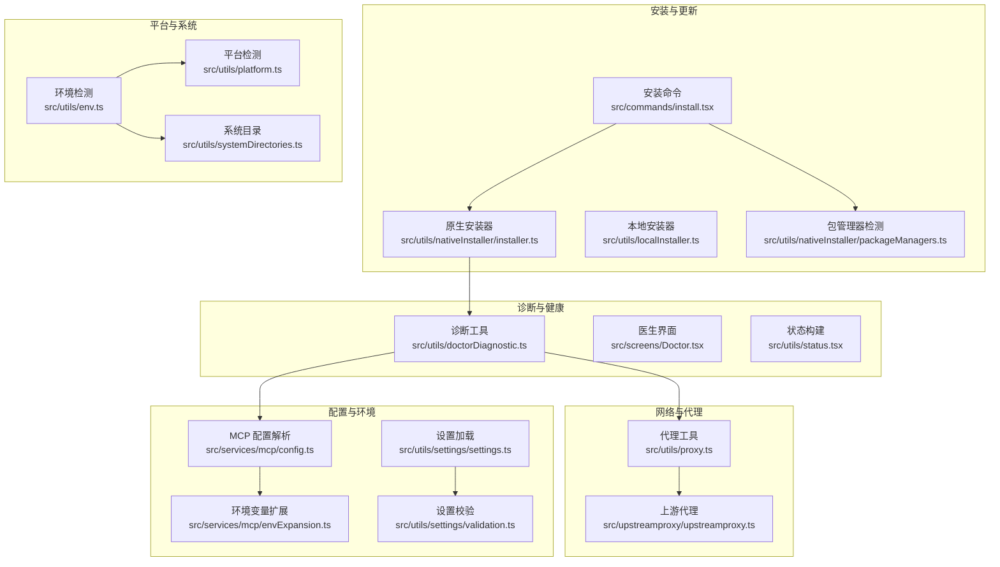
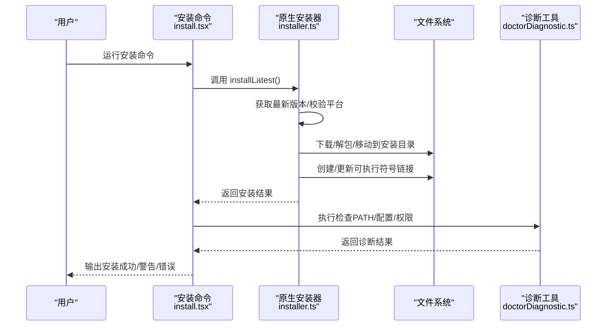
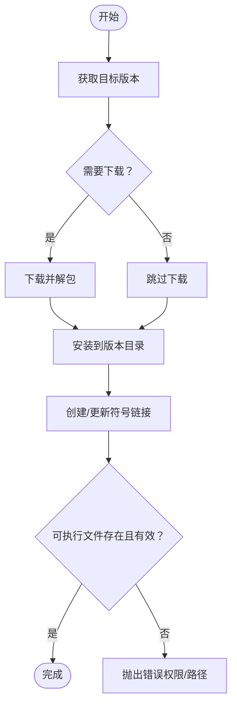
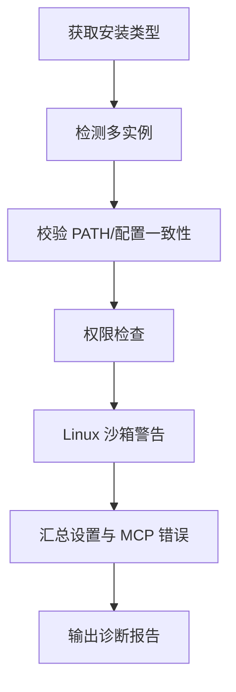
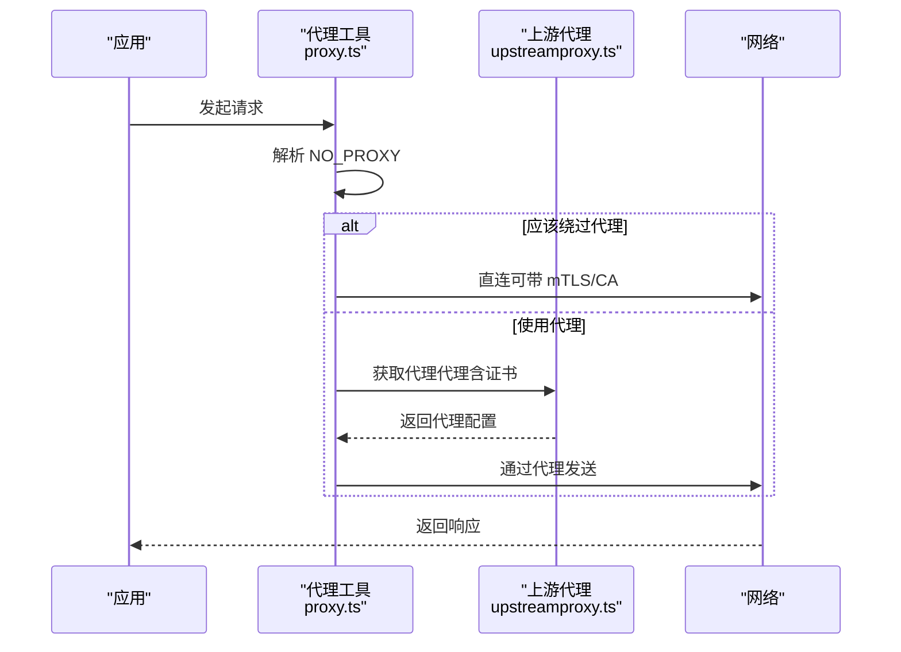
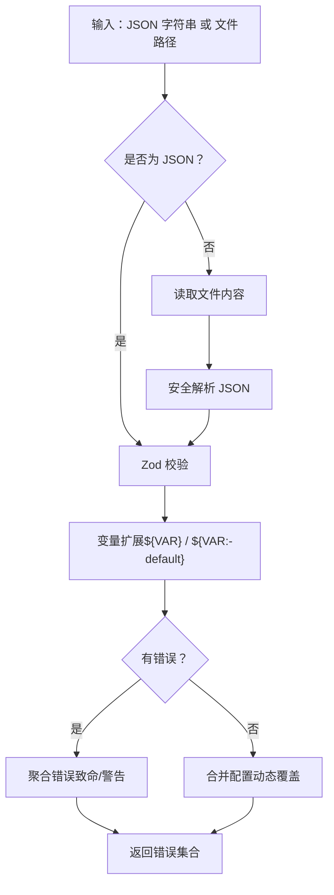
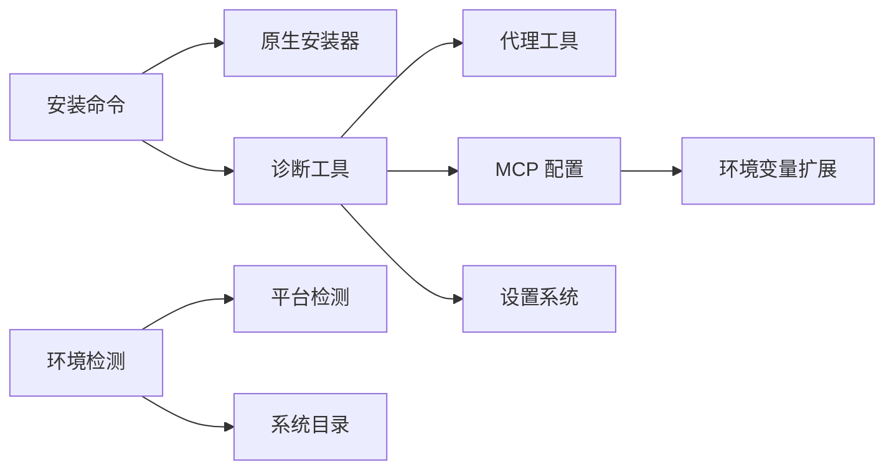

# 安装和配置问题

<cite>
**本文引用的文件**
- [package.json](file://package.json)
- [README.md](file://README.md)
- [src/utils/nativeInstaller/installer.ts](file://src/utils/nativeInstaller/installer.ts)
- [src/commands/install.tsx](file://src/commands/install.tsx)
- [src/utils/doctorDiagnostic.ts](file://src/utils/doctorDiagnostic.ts)
- [src/utils/proxy.ts](file://src/utils/proxy.ts)
- [src/upstreamproxy/upstreamproxy.ts](file://src/upstreamproxy/upstreamproxy.ts)
- [src/services/mcp/envExpansion.ts](file://src/services/mcp/envExpansion.ts)
- [src/services/mcp/config.ts](file://src/services/mcp/config.ts)
- [src/utils/env.ts](file://src/utils/env.ts)
- [src/utils/platform.ts](file://src/utils/platform.ts)
- [src/utils/nativeInstaller/packageManagers.ts](file://src/utils/nativeInstaller/packageManagers.ts)
- [src/utils/shellConfig.ts](file://src/utils/shellConfig.ts)
- [src/utils/settings/validation.ts](file://src/utils/settings/validation.ts)
- [src/utils/settings/settings.ts](file://src/utils/settings/settings.ts)
- [src/utils/systemDirectories.ts](file://src/utils/systemDirectories.ts)
- [src/cli/update.ts](file://src/cli/update.ts)
- [src/screens/Doctor.tsx](file://src/screens/Doctor.tsx)
- [src/utils/status.tsx](file://src/utils/status.tsx)
</cite>

## 目录
1. [简介](#简介)
2. [项目结构](#项目结构)
3. [核心组件](#核心组件)
4. [架构总览](#架构总览)
5. [详细组件分析](#详细组件分析)
6. [依赖关系分析](#依赖关系分析)
7. [性能考虑](#性能考虑)
8. [故障排除指南](#故障排除指南)
9. [结论](#结论)
10. [附录](#附录)

## 简介
本指南聚焦于 Claude Code 的安装与配置问题排查，覆盖以下关键场景：
- 常见安装失败：依赖缺失、Node.js 版本不兼容、权限问题
- 包管理器问题（npm、yarn、bun）：缓存清理、镜像源配置
- 环境变量检查清单：PATH、代理、证书
- 配置文件解析错误诊断：语法错误、路径问题
- 不同操作系统（macOS、Windows、Linux）特定问题与解决方案
- 提供完整的环境检查脚本与验证步骤

## 项目结构
该仓库为 Claude Code 的非官方源码提取版本，主要模块围绕 CLI 安装、诊断、代理与 MCP 配置展开：
- 安装与更新：原生安装器、本地安装器、包管理器检测
- 诊断与健康检查：安装类型识别、多实例检测、配置校验
- 网络与代理：全局代理、NO_PROXY、上游代理
- 配置与环境：MCP 配置解析、环境变量扩展、设置校验
- 平台与系统目录：跨平台路径与系统目录处理

图表来源
- [src/utils/nativeInstaller/installer.ts:1-120](file://src/utils/nativeInstaller/installer.ts#L1-L120)
- [src/commands/install.tsx:1-120](file://src/commands/install.tsx#L1-L120)
- [src/utils/doctorDiagnostic.ts:1-120](file://src/utils/doctorDiagnostic.ts#L1-L120)
- [src/utils/proxy.ts:77-130](file://src/utils/proxy.ts#L77-L130)
- [src/upstreamproxy/upstreamproxy.ts:31-63](file://src/upstreamproxy/upstreamproxy.ts#L31-L63)
- [src/services/mcp/config.ts:1289-1377](file://src/services/mcp/config.ts#L1289-L1377)
- [src/services/mcp/envExpansion.ts:1-38](file://src/services/mcp/envExpansion.ts#L1-L38)
- [src/utils/env.ts:284-333](file://src/utils/env.ts#L284-L333)
- [src/utils/platform.ts:11-49](file://src/utils/platform.ts#L11-L49)
- [src/utils/systemDirectories.ts:27-74](file://src/utils/systemDirectories.ts#L27-L74)

章节来源
- [README.md:95-114](file://README.md#L95-L114)

## 核心组件
- 原生安装器：负责下载、解包、安装二进制、创建符号链接、权限与并发控制
- 诊断工具：识别安装类型、检测多实例、校验 PATH 与配置一致性、权限检查
- 代理系统：支持全局代理、NO_PROXY 规则、mTLS 与 CA 证书注入
- MCP 配置：解析 JSON、变量扩展、错误聚合
- 环境检测：平台、架构、终端、运行时、包管理器、部署环境
- 设置系统：设置加载、JSON 语法错误处理、合并策略

章节来源
- [src/utils/nativeInstaller/installer.ts:424-620](file://src/utils/nativeInstaller/installer.ts#L424-L620)
- [src/utils/doctorDiagnostic.ts:514-625](file://src/utils/doctorDiagnostic.ts#L514-L625)
- [src/utils/proxy.ts:77-130](file://src/utils/proxy.ts#L77-L130)
- [src/services/mcp/config.ts:1289-1438](file://src/services/mcp/config.ts#L1289-L1438)
- [src/utils/env.ts:284-333](file://src/utils/env.ts#L284-L333)

## 架构总览
安装流程从 CLI 命令触发，调用原生安装器进行版本选择、下载、安装与符号链接更新；随后执行诊断检查以确保 PATH、配置与权限正确；网络请求通过代理系统统一处理；MCP 配置在启动时解析并进行变量扩展与错误收集。

图表来源
- [src/commands/install.tsx:98-209](file://src/commands/install.tsx#L98-L209)
- [src/utils/nativeInstaller/installer.ts:441-620](file://src/utils/nativeInstaller/installer.ts#L441-L620)
- [src/utils/doctorDiagnostic.ts:514-625](file://src/utils/doctorDiagnostic.ts#L514-L625)

## 详细组件分析

### 原生安装器（Native Installer）
职责与特性：
- 平台识别与二进制选择（含 musl）
- 多进程安全：PID 锁与时间戳锁
- 原子操作：临时文件 + 原子重命名
- 符号链接管理：Windows 直拷贝，类 Unix 使用原子重命名
- 权限与可执行性检查
- 与诊断工具协作进行安装后检查

图表来源
- [src/utils/nativeInstaller/installer.ts:424-488](file://src/utils/nativeInstaller/installer.ts#L424-L488)
- [src/utils/nativeInstaller/installer.ts:639-798](file://src/utils/nativeInstaller/installer.ts#L639-L798)

章节来源
- [src/utils/nativeInstaller/installer.ts:87-109](file://src/utils/nativeInstaller/installer.ts#L87-L109)
- [src/utils/nativeInstaller/installer.ts:424-620](file://src/utils/nativeInstaller/installer.ts#L424-L620)

### 诊断工具（Doctor）
功能要点：
- 识别当前安装类型（npm 全局/本地、原生、包管理器、开发模式、未知）
- 检测多实例并给出清理建议
- 校验 PATH 与配置一致性（尤其原生安装）
- 权限检查（全局安装更新权限）
- Linux 沙箱规则的 glob 模式警告
- 与设置系统集成，汇总设置与 MCP 配置错误

图表来源
- [src/utils/doctorDiagnostic.ts:514-625](file://src/utils/doctorDiagnostic.ts#L514-L625)
- [src/utils/status.tsx:175-199](file://src/utils/status.tsx#L175-L199)

章节来源
- [src/utils/doctorDiagnostic.ts:46-71](file://src/utils/doctorDiagnostic.ts#L46-L71)
- [src/utils/doctorDiagnostic.ts:317-484](file://src/utils/doctorDiagnostic.ts#L317-L484)

### 代理与网络（Proxy & Upstream Proxy）
能力：
- 全局代理：基于 HTTPS_PROXY/HTTP_PROXY，支持 NO_PROXY 列表
- mTLS 与 CA 证书：可选客户端证书与自定义 CA
- 上游代理：在受限环境中通过本地代理中继，自动注入证书与 NO_PROXY
- 请求拦截：根据 NO_PROXY 动态切换直连或代理

图表来源
- [src/utils/proxy.ts:77-130](file://src/utils/proxy.ts#L77-L130)
- [src/utils/proxy.ts:346-377](file://src/utils/proxy.ts#L346-L377)
- [src/upstreamproxy/upstreamproxy.ts:160-199](file://src/upstreamproxy/upstreamproxy.ts#L160-L199)

章节来源
- [src/utils/proxy.ts:77-130](file://src/utils/proxy.ts#L77-L130)
- [src/upstreamproxy/upstreamproxy.ts:31-63](file://src/upstreamproxy/upstreamproxy.ts#L31-L63)

### MCP 配置解析与环境变量扩展
能力：
- 支持从字符串（JSON）或文件路径解析
- 变量扩展：${VAR} 与 ${VAR:-default}
- 错误聚合：致命错误与警告分类
- 与设置系统集成，动态配置合并

图表来源
- [src/services/mcp/config.ts:1289-1377](file://src/services/mcp/config.ts#L1289-L1377)
- [src/services/mcp/config.ts:1384-1438](file://src/services/mcp/config.ts#L1384-L1438)
- [src/services/mcp/envExpansion.ts:10-38](file://src/services/mcp/envExpansion.ts#L10-L38)

章节来源
- [src/services/mcp/config.ts:1289-1438](file://src/services/mcp/config.ts#L1289-L1438)
- [src/services/mcp/envExpansion.ts:10-38](file://src/services/mcp/envExpansion.ts#L10-L38)

### 环境检测与系统目录
- 平台检测：macOS、Windows、WSL、Linux、unknown
- 终端与运行时检测：支持多种终端与运行时
- 包管理器检测：npm、yarn、pnpm
- 系统目录：跨平台桌面/文档/下载目录解析

章节来源
- [src/utils/platform.ts:11-49](file://src/utils/platform.ts#L11-L49)
- [src/utils/env.ts:284-333](file://src/utils/env.ts#L284-L333)
- [src/utils/systemDirectories.ts:27-74](file://src/utils/systemDirectories.ts#L27-L74)

## 依赖关系分析
- 安装命令依赖原生安装器与诊断工具
- 诊断工具依赖代理、MCP 配置、设置系统
- 代理系统与上游代理相互配合
- 平台与环境检测为其他模块提供基础能力

图表来源
- [src/commands/install.tsx:12-14](file://src/commands/install.tsx#L12-L14)
- [src/utils/doctorDiagnostic.ts:1-45](file://src/utils/doctorDiagnostic.ts#L1-L45)
- [src/utils/proxy.ts:1-10](file://src/utils/proxy.ts#L1-L10)
- [src/services/mcp/config.ts:1-10](file://src/services/mcp/config.ts#L1-L10)
- [src/utils/env.ts:1-10](file://src/utils/env.ts#L1-L10)
- [src/utils/platform.ts:1-10](file://src/utils/platform.ts#L1-L10)
- [src/utils/systemDirectories.ts:1-10](file://src/utils/systemDirectories.ts#L1-L10)

章节来源
- [src/commands/install.tsx:12-14](file://src/commands/install.tsx#L12-L14)
- [src/utils/doctorDiagnostic.ts:1-45](file://src/utils/doctorDiagnostic.ts#L1-L45)

## 性能考虑
- 安装器采用原子操作与最小化文件系统交互，降低竞态风险
- 诊断与环境检测使用记忆化（memoize）减少重复系统调用
- 代理工具按需创建代理代理，避免不必要的开销
- MCP 配置解析与变量扩展在启动阶段集中处理，后续复用结果

## 故障排除指南

### 通用安装失败排查
- 检查 Node.js 版本：项目要求 Node >= 18
- 清理包管理器缓存并重试
- 确认写权限：安装目录与可执行文件需要写权限
- 并发冲突：若提示“另一个进程正在安装”，等待后重试

章节来源
- [package.json:7-9](file://package.json#L7-L9)
- [src/utils/nativeInstaller/installer.ts:580-611](file://src/utils/nativeInstaller/installer.ts#L580-L611)

### 包管理器相关问题（npm/yarn/bun）
- npm
  - 清理缓存：删除缓存后重试
  - 镜像源：检查 registry 配置，必要时切换为官方源
- yarn
  - 清理缓存与锁定文件后重试
  - 检查版本兼容性与网络代理
- bun
  - 确认运行环境与包管理器版本匹配
  - 如遇权限问题，尝试以非 root 用户运行

章节来源
- [src/utils/env.ts:49-67](file://src/utils/env.ts#L49-L67)

### 环境变量配置检查清单
- PATH
  - 原生安装：确认 ~/.local/bin 在 PATH 中
  - 本地安装：确认 claude 可执行文件在 PATH 或已建立别名
- 代理
  - HTTPS_PROXY/HTTP_PROXY：设置正确的代理地址
  - NO_PROXY：添加本地与内网域名，避免代理绕行
  - 证书：NODE_EXTRA_CA_CERTS/SSL_CERT_FILE 指向有效的 CA 证书
- mTLS
  - 若企业代理需要双向认证，配置 cert/key/passphrase

章节来源
- [src/utils/doctorDiagnostic.ts:373-430](file://src/utils/doctorDiagnostic.ts#L373-L430)
- [src/utils/proxy.ts:77-130](file://src/utils/proxy.ts#L77-L130)
- [src/upstreamproxy/upstreamproxy.ts:160-199](file://src/upstreamproxy/upstreamproxy.ts#L160-L199)

### 配置文件解析错误诊断
- 设置文件（settings）
  - JSON 语法错误：解析失败时返回具体错误，修复后重试
  - 合并与覆盖：动态配置会覆盖已有设置
- MCP 配置
  - 语法错误：致命错误，需修正
  - 变量未定义：检查环境变量是否设置或提供默认值
  - 路径问题：确认文件路径存在且可读

章节来源
- [src/utils/settings/settings.ts:442-471](file://src/utils/settings/settings.ts#L442-L471)
- [src/services/mcp/config.ts:1289-1377](file://src/services/mcp/config.ts#L1289-L1377)
- [src/services/mcp/envExpansion.ts:10-38](file://src/services/mcp/envExpansion.ts#L10-L38)

### 不同操作系统特定问题
- macOS
  - Homebrew 安装：注意区分 cask 与 npm 全局安装路径
  - 权限：避免使用 sudo 安装，推荐重新安装 Node
- Windows
  - PATH：确保 ~/.local/bin 已加入用户 PATH
  - 权限：以管理员权限运行可能影响后续更新
- Linux
  - 包管理器：根据发行版选择 pacman/deb/rpm/apk
  - 沙箱：glob 模式在 Linux 上会被忽略，注意权限规则

章节来源
- [src/utils/nativeInstaller/packageManagers.ts:302-336](file://src/utils/nativeInstaller/packageManagers.ts#L302-L336)
- [src/utils/doctorDiagnostic.ts:487-512](file://src/utils/doctorDiagnostic.ts#L487-L512)

### 完整环境检查脚本与验证步骤
- 检查 Node.js 版本与架构
- 检查可用包管理器与运行时
- 检查平台与终端类型
- 运行诊断命令，查看安装类型、多实例、PATH 与权限
- 验证代理与证书配置
- 验证 MCP 配置语法与变量扩展

章节来源
- [src/utils/env.ts:284-333](file://src/utils/env.ts#L284-L333)
- [src/utils/doctorDiagnostic.ts:514-625](file://src/utils/doctorDiagnostic.ts#L514-L625)
- [src/utils/proxy.ts:77-130](file://src/utils/proxy.ts#L77-L130)
- [src/services/mcp/config.ts:1289-1438](file://src/services/mcp/config.ts#L1289-L1438)

## 结论
通过原生安装器、诊断工具与代理系统的协同，Claude Code 能够在多平台环境下稳定安装与运行。遇到安装与配置问题时，建议按“版本与权限 → 包管理器 → 环境变量 → 配置解析 → 代理与证书 → 平台差异”的顺序逐步排查，并结合诊断输出与错误信息定位根因。

## 附录
- 安装命令入口与参数：支持 --force 强制重装与目标通道（latest/stable/版本号）
- 更新逻辑：自动更新与配置不一致时的自动修复
- 医生界面：集中展示安装、设置与 MCP 的诊断信息

章节来源
- [src/commands/install.tsx:279-300](file://src/commands/install.tsx#L279-L300)
- [src/cli/update.ts:165-211](file://src/cli/update.ts#L165-L211)
- [src/screens/Doctor.tsx:329-371](file://src/screens/Doctor.tsx#L329-L371)