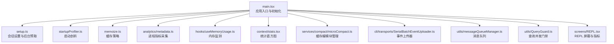
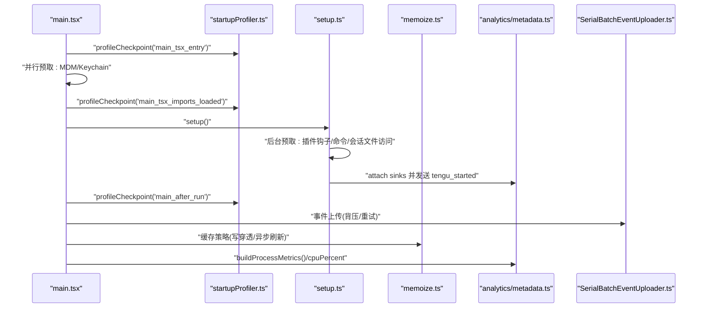
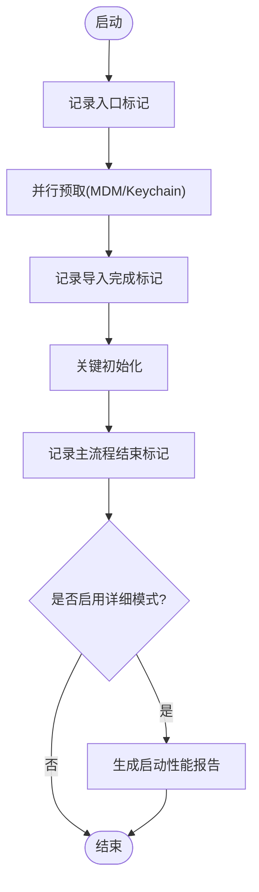
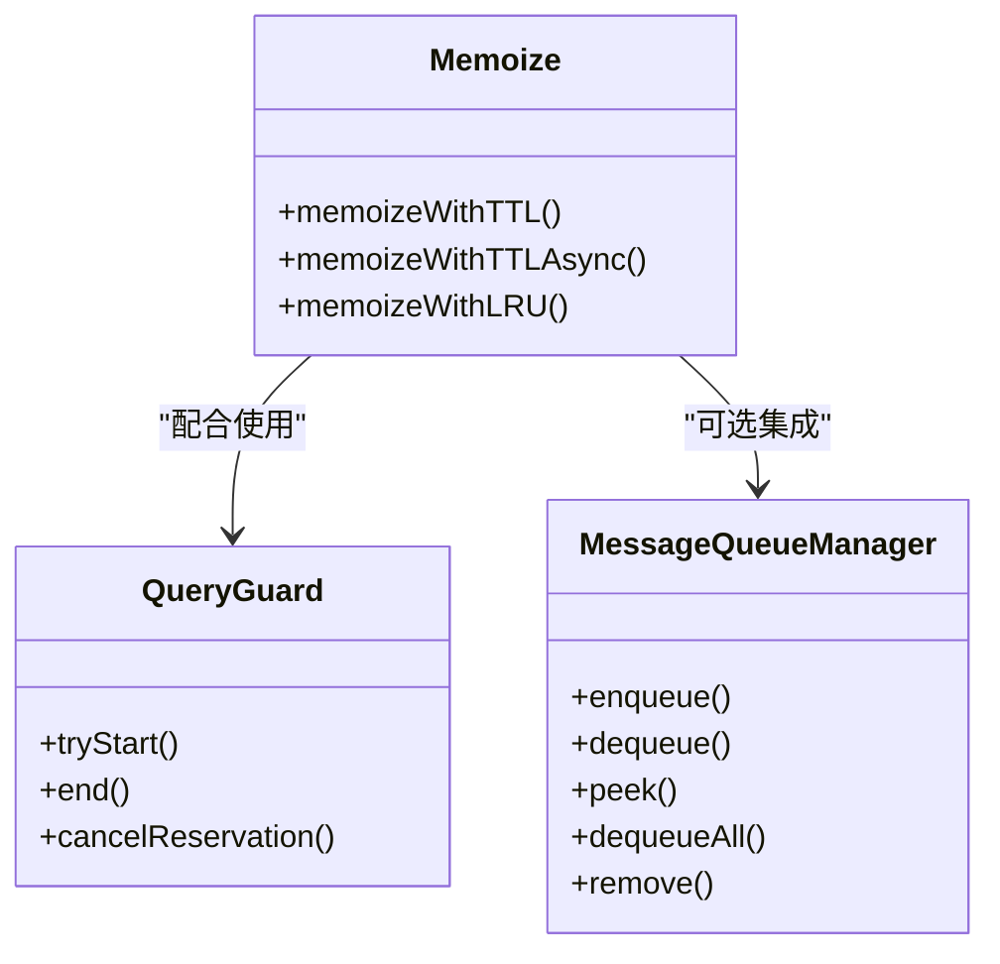
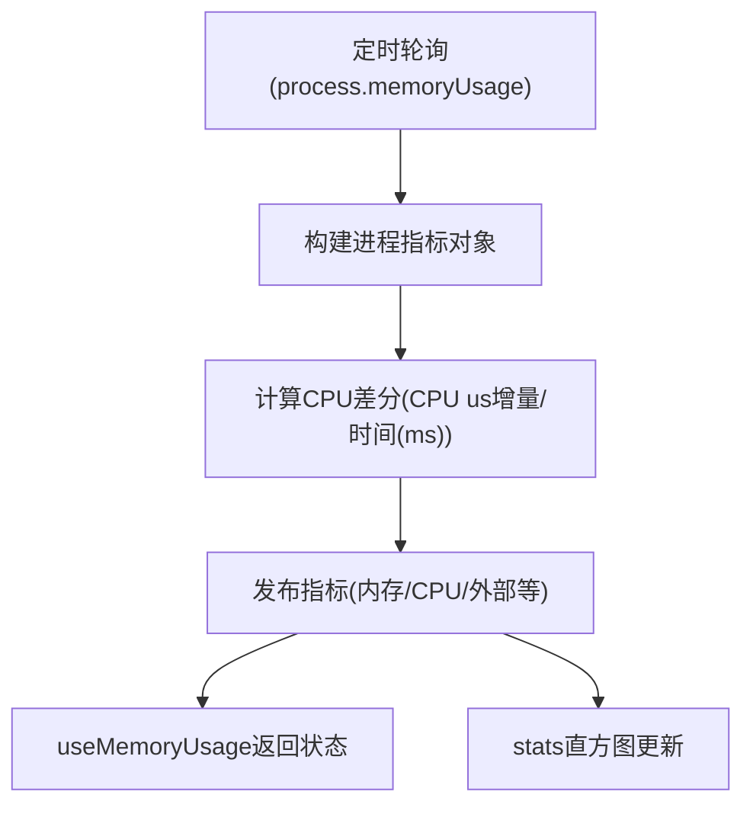
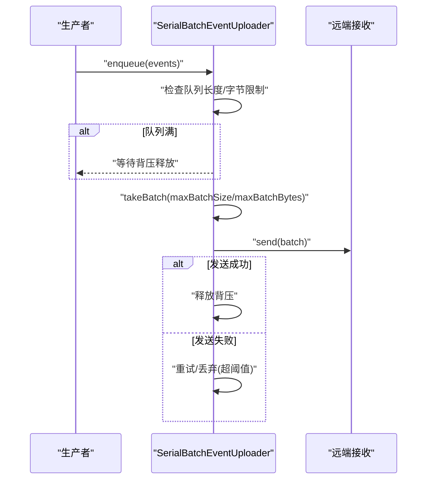
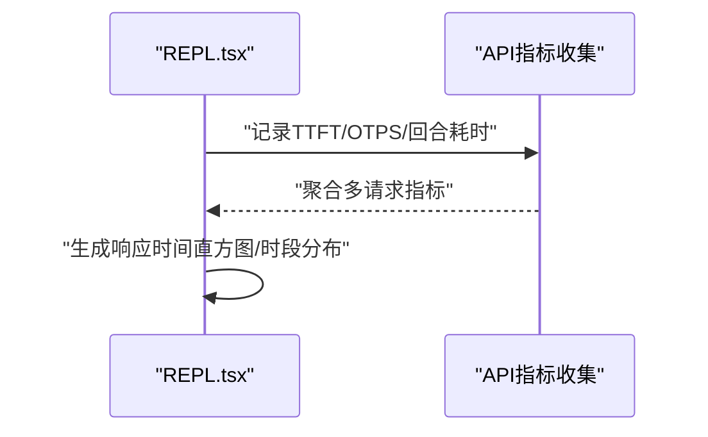
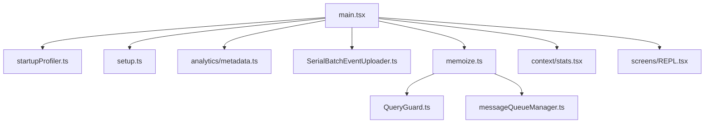

# 性能问题分析

<cite>
**本文引用的文件**
- [README.md](file://README.md)
- [main.tsx](file://src/main.tsx)
- [setup.ts](file://src/setup.ts)
- [startupProfiler.ts](file://src/utils/startupProfiler.ts)
- [memoize.ts](file://src/utils/memoize.ts)
- [metadata.ts](file://src/services/analytics/metadata.ts)
- [useMemoryUsage.ts](file://src/hooks/useMemoryUsage.ts)
- [stats.tsx](file://src/context/stats.tsx)
- [microCompact.ts](file://src/services/compact/microCompact.ts)
- [SerialBatchEventUploader.ts](file://src/cli/transports/SerialBatchEventUploader.ts)
- [messageQueueManager.ts](file://src/utils/messageQueueManager.ts)
- [QueryGuard.ts](file://src/utils/QueryGuard.ts)
- [REPL.tsx](file://src/screens/REPL.tsx)
- [profilerBase.ts](file://src/utils/profilerBase.ts)
</cite>

## 目录
1. [简介](#简介)
2. [项目结构](#项目结构)
3. [核心组件](#核心组件)
4. [架构总览](#架构总览)
5. [详细组件分析](#详细组件分析)
6. [依赖关系分析](#依赖关系分析)
7. [性能考量](#性能考量)
8. [故障排查指南](#故障排查指南)
9. [结论](#结论)
10. [附录](#附录)

## 简介
本指南聚焦 Claude Code 在实际使用中可能遇到的性能问题，围绕启动缓慢、内存占用过高、CPU 使用率高以及响应时间慢等典型问题，结合代码库中的启动剖析、缓存机制、事件上传与队列管理、内存与 CPU 指标采集等实现，给出系统化的排查方法、优化建议与最佳实践。文档同时覆盖性能监控工具的使用与关键指标解读，帮助开发者在不同使用场景下快速定位瓶颈并实施针对性优化。

## 项目结构
该项目为基于 Node.js 的 CLI 工具，采用模块化组织方式，主要目录与职责概览如下：
- src/main.tsx：应用入口，负责启动阶段的并行预取、关键模块导入与初始化、延迟任务调度等
- src/setup.ts：会话设置与后台任务预取，包含插件钩子、工作树、终端备份恢复等
- src/utils/startupProfiler.ts：启动阶段性能剖析与报告生成
- src/utils/memoize.ts：多种缓存策略（TTL、异步 TTL、LRU）以降低重复计算与 I/O
- src/services/analytics/metadata.ts：进程指标采集（内存、CPU）、环境上下文聚合
- src/hooks/useMemoryUsage.ts：前端内存使用状态监测
- src/context/stats.tsx：直方图与集合统计，用于响应时间分布等指标
- src/services/compact/microCompact.ts：缓存编辑块的挂起与固定，减少重复传输
- src/cli/transports/SerialBatchEventUploader.ts：串行批量事件上传器，含背压与重试
- src/utils/messageQueueManager.ts：命令队列管理，支持优先级与去重
- src/utils/QueryGuard.ts：查询并发控制门禁，避免竞态
- src/screens/REPL.tsx：REPL 屏幕，包含 API 指标采集（TTFT、OTPS）
- 其他：profilerBase.ts 提供性能基准能力

**图表来源**
- [main.tsx](file://src/main.tsx)
- [setup.ts](file://src/setup.ts)
- [startupProfiler.ts](file://src/utils/startupProfiler.ts)
- [memoize.ts](file://src/utils/memoize.ts)
- [metadata.ts](file://src/services/analytics/metadata.ts)
- [useMemoryUsage.ts](file://src/hooks/useMemoryUsage.ts)
- [stats.tsx](file://src/context/stats.tsx)
- [microCompact.ts](file://src/services/compact/microCompact.ts)
- [SerialBatchEventUploader.ts](file://src/cli/transports/SerialBatchEventUploader.ts)
- [messageQueueManager.ts](file://src/utils/messageQueueManager.ts)
- [QueryGuard.ts](file://src/utils/QueryGuard.ts)
- [REPL.tsx](file://src/screens/REPL.tsx)

**章节来源**
- [README.md](file://README.md)
- [main.tsx](file://src/main.tsx)
- [setup.ts](file://src/setup.ts)

## 核心组件
- 启动剖析与报告
  - 通过性能标记记录关键阶段，支持采样日志与详细报告输出，便于定位启动耗时热点
- 缓存与并发控制
  - TTL/LRU 缓存、异步缓存刷新、查询并发门禁、消息队列优先级管理
- 进程指标采集
  - 内存使用、CPU 占用、CPU 百分比等，用于运行时性能监控
- 事件上传与背压
  - 串行批量上传器，具备最大队列大小、批次大小与字节限制、失败重试与丢弃统计
- 统计与可视化
  - 响应时间直方图、时间分布图表，辅助性能趋势分析

**章节来源**
- [startupProfiler.ts](file://src/utils/startupProfiler.ts)
- [memoize.ts](file://src/utils/memoize.ts)
- [metadata.ts](file://src/services/analytics/metadata.ts)
- [SerialBatchEventUploader.ts](file://src/cli/transports/SerialBatchEventUploader.ts)
- [stats.tsx](file://src/context/stats.tsx)

## 架构总览
下图展示从启动到首次渲染的关键路径，以及与性能相关的核心模块交互：

**图表来源**
- [main.tsx](file://src/main.tsx)
- [startupProfiler.ts](file://src/utils/startupProfiler.ts)
- [setup.ts](file://src/setup.ts)
- [metadata.ts](file://src/services/analytics/metadata.ts)
- [SerialBatchEventUploader.ts](file://src/cli/transports/SerialBatchEventUploader.ts)
- [memoize.ts](file://src/utils/memoize.ts)

## 详细组件分析

### 启动剖析与优化
- 关键点
  - 通过性能标记记录“入口”“导入完成”“主流程结束”等阶段，支持采样日志与详细报告
  - 详细模式仅在启用环境变量时开启，避免对普通用户造成额外开销
- 排查步骤
  - 启用详细模式：设置环境变量后重新启动，查看生成的启动性能报告
  - 对照报告中各阶段耗时，定位耗时最长的模块或 I/O 操作
- 优化建议
  - 将非关键初始化移至首次渲染后执行，减少首屏阻塞
  - 避免在热路径上进行昂贵的同步操作；必要时改为异步并行

**图表来源**
- [startupProfiler.ts](file://src/utils/startupProfiler.ts)
- [main.tsx](file://src/main.tsx)

**章节来源**
- [startupProfiler.ts](file://src/utils/startupProfiler.ts)
- [main.tsx](file://src/main.tsx)

### 缓存机制与并发控制
- TTL 缓存
  - 写穿透策略：命中则立即返回，未命中则计算并写入；过期则返回旧值并异步刷新
  - 支持清理接口，便于失效与降级
- 异步 TTL 缓存
  - 针对异步函数，提供冷门去重与身份保护，避免并发刷新导致的重复调用
- LRU 缓存
  - 控制内存增长上限，适合消息处理等高频场景
- 查询并发门禁
  - 保证同一时刻仅有一个查询处于运行态，避免竞争与资源争用
- 队列管理
  - 命令队列按优先级出队，支持匹配过滤与批量移除，降低 UI 抖动与重复处理

**图表来源**
- [memoize.ts](file://src/utils/memoize.ts)
- [QueryGuard.ts](file://src/utils/QueryGuard.ts)
- [messageQueueManager.ts](file://src/utils/messageQueueManager.ts)

**章节来源**
- [memoize.ts](file://src/utils/memoize.ts)
- [QueryGuard.ts](file://src/utils/QueryGuard.ts)
- [messageQueueManager.ts](file://src/utils/messageQueueManager.ts)

### 进程指标采集与内存/CPU 监控
- 进程指标
  - 采集内存使用（RSS、堆总量、堆已用、外部、ArrayBuffers）、CPU 使用量与 CPU 百分比
  - 通过差分计算 CPU 百分比，避免全局状态不一致带来的误差
- 内存监测 Hook
  - 定期轮询 Node.js 进程内存使用，超过阈值时返回状态与数值，避免频繁渲染
- 统计直方图
  - 记录观测值、最小/最大/平均、百分位数，支持抽样与滚动窗口

**图表来源**
- [metadata.ts](file://src/services/analytics/metadata.ts)
- [useMemoryUsage.ts](file://src/hooks/useMemoryUsage.ts)
- [stats.tsx](file://src/context/stats.tsx)

**章节来源**
- [metadata.ts](file://src/services/analytics/metadata.ts)
- [useMemoryUsage.ts](file://src/hooks/useMemoryUsage.ts)
- [stats.tsx](file://src/context/stats.tsx)

### 事件上传与背压
- 背压与限流
  - 当队列长度达到上限时阻塞入队，释放后再继续
  - 批次大小与字节上限受控，异常时重试并支持丢弃统计
- 重试与失败处理
  - 失败次数超过阈值时丢弃批次并通知，避免队列被毒化
- 适用场景
  - 日志/遥测上报、批量事件导出等需要稳定性的场景

**图表来源**
- [SerialBatchEventUploader.ts](file://src/cli/transports/SerialBatchEventUploader.ts)

**章节来源**
- [SerialBatchEventUploader.ts](file://src/cli/transports/SerialBatchEventUploader.ts)

### REPL 屏幕与响应时间指标
- 指标采集
  - TTFT（首次令牌时间）、OTPS（每秒输出令牌数）、回合耗时、工具/分类器耗时等
  - 多请求回合场景下计算中位数与聚合指标
- 可视化
  - 响应时间直方图与时段分布，辅助识别高峰与异常

**图表来源**
- [REPL.tsx](file://src/screens/REPL.tsx)

**章节来源**
- [REPL.tsx](file://src/screens/REPL.tsx)

## 依赖关系分析
- 启动路径依赖
  - main.tsx 依赖 startupProfiler.ts 进行阶段标记，依赖 setup.ts 完成后台预取与会话设置
- 缓存与并发
  - memoize.ts 与 QueryGuard.ts、messageQueueManager.ts 协同，确保缓存命中与并发安全
- 监控与上报
  - analytics/metadata.ts 提供进程指标，SerialBatchEventUploader.ts 负责稳定上报
- 统计与可视化
  - stats.tsx 提供直方图与集合统计，REPL.tsx 输出响应时间图表

**图表来源**
- [main.tsx](file://src/main.tsx)
- [startupProfiler.ts](file://src/utils/startupProfiler.ts)
- [setup.ts](file://src/setup.ts)
- [metadata.ts](file://src/services/analytics/metadata.ts)
- [SerialBatchEventUploader.ts](file://src/cli/transports/SerialBatchEventUploader.ts)
- [memoize.ts](file://src/utils/memoize.ts)
- [stats.tsx](file://src/context/stats.tsx)
- [REPL.tsx](file://src/screens/REPL.tsx)
- [QueryGuard.ts](file://src/utils/QueryGuard.ts)
- [messageQueueManager.ts](file://src/utils/messageQueueManager.ts)

**章节来源**
- [main.tsx](file://src/main.tsx)
- [setup.ts](file://src/setup.ts)
- [memoize.ts](file://src/utils/memoize.ts)
- [metadata.ts](file://src/services/analytics/metadata.ts)
- [SerialBatchEventUploader.ts](file://src/cli/transports/SerialBatchEventUploader.ts)
- [stats.tsx](file://src/context/stats.tsx)
- [REPL.tsx](file://src/screens/REPL.tsx)
- [QueryGuard.ts](file://src/utils/QueryGuard.ts)
- [messageQueueManager.ts](file://src/utils/messageQueueManager.ts)

## 性能考量
- 启动缓慢
  - 并行预取：MDM/Keychain 等子进程并行启动，减少串行等待
  - 延迟初始化：非关键模块推迟到首次渲染后执行
  - 启动剖析：启用详细模式生成报告，定位耗时模块
- 内存占用过高
  - 使用 LRU 缓存限制内存增长；定期清理缓存与失效项
  - 监测内存状态，超过阈值时触发告警与降级
- CPU 使用率高
  - 通过进程指标与 CPU 百分比差分计算，识别热点
  - 并发门禁与队列优先级，避免过度竞争
- 响应时间慢
  - 缓存命中与异步刷新，减少重复计算
  - 事件上传器背压与限流，避免 I/O 抖动
  - REPL 屏幕指标可视化，辅助定位异常回合

[本节为通用指导，无需特定文件引用]

## 故障排查指南
- 启动缓慢
  - 步骤：启用详细启动剖析，查看报告；对比阶段耗时，定位模块
  - 工具：性能标记、报告生成
- 内存占用过高
  - 步骤：使用内存监测 Hook 观察状态变化；检查缓存大小与清理策略
  - 工具：useMemoryUsage、LRU 缓存
- CPU 使用率高
  - 步骤：采集进程指标与 CPU 百分比；检查并发门禁与队列
  - 工具：buildProcessMetrics、QueryGuard、messageQueueManager
- 响应时间慢
  - 步骤：查看 REPL 屏幕指标（TTFT/OTPS/回合耗时）；分析直方图与时段分布
  - 工具：REPL 指标、stats 直方图

**章节来源**
- [startupProfiler.ts](file://src/utils/startupProfiler.ts)
- [useMemoryUsage.ts](file://src/hooks/useMemoryUsage.ts)
- [metadata.ts](file://src/services/analytics/metadata.ts)
- [stats.tsx](file://src/context/stats.tsx)
- [REPL.tsx](file://src/screens/REPL.tsx)

## 结论
通过启动剖析、缓存策略、并发控制、进程指标采集与事件上传背压等机制，Claude Code 在启动速度、内存占用、CPU 使用与响应时间等方面形成了较为完善的性能保障体系。实践中建议：
- 启动阶段尽量并行与延迟非关键初始化
- 合理选择缓存策略（TTL/LRU），并配置合适的生命周期与容量
- 使用并发门禁与队列优先级，避免资源争用
- 依托进程指标与可视化图表持续监控，及时发现异常

[本节为总结性内容，无需特定文件引用]

## 附录
- 性能监控关键指标
  - 内存：RSS、堆总量、堆已用、外部、ArrayBuffers、受限内存
  - CPU：用户/系统使用量、CPU 百分比（差分计算）
  - 响应时间：TTFT、OTPS、回合耗时、工具/分类器耗时
- 使用建议
  - 启动剖析：在开发与回归测试中启用详细模式，生成报告定位瓶颈
  - 缓存策略：根据数据特征选择 TTL 或 LRU，并定期评估命中率与内存占用
  - 事件上传：合理设置批次大小与字节上限，配置重试与丢弃阈值
  - 监控可视化：结合直方图与时段分布，建立性能基线与告警阈值

[本节为通用指导，无需特定文件引用]