# 故障排除与常见问题

<cite>
**本文引用的文件**
- [README.md](file://README.md)
- [package.json](file://package.json)
- [errorLogSink.ts](file://src/utils/errorLogSink.ts)
- [log.ts](file://src/utils/log.ts)
- [errorIds.ts](file://src/constants/errorIds.ts)
- [debug.ts](file://src/utils/debug.ts)
- [cachePaths.ts](file://src/utils/cachePaths.ts)
- [startupProfiler.ts](file://src/utils/startupProfiler.ts)
- [profilerBase.ts](file://src/utils/profilerBase.ts)
- [Doctor.tsx](file://src/screens/Doctor.tsx)
- [useManageMCPConnections.ts](file://src/services/mcp/useManageMCPConnections.ts)
- [bridgeMain.ts](file://src/bridge/bridgeMain.ts)
- [withRetry.ts](file://src/services/api/withRetry.ts)
- [errorUtils.ts](file://src/services/api/errorUtils.ts)
- [fsOperations.ts](file://src/utils/fsOperations.ts)
- [pathValidation.ts](file://src/tools/PowerShellTool/pathValidation.ts)
- [promptShellExecution.ts](file://src/utils/promptShellExecution.ts)
- [notifications.tsx](file://src/context/notifications.tsx)
- [useStartupNotification.ts](file://src/hooks/useStartupNotification.ts)
- [heapdump.ts](file://src/commands/heapdump/heapdump.ts)
- [heapDumpService.ts](file://src/utils/heapDumpService.ts)
</cite>

## 目录
1. [简介](#简介)
2. [项目结构](#项目结构)
3. [核心组件](#核心组件)
4. [架构总览](#架构总览)
5. [详细组件分析](#详细组件分析)
6. [依赖关系分析](#依赖关系分析)
7. [性能考虑](#性能考虑)
8. [故障排除指南](#故障排除指南)
9. [结论](#结论)
10. [附录](#附录)

## 简介
本指南面向使用 Claude Code CLI 的用户，聚焦于安装与配置、运行时错误、性能问题、日志分析、通知系统与错误提示的解读，以及社区支持渠道。内容基于仓库中的实现细节进行归纳总结，帮助快速定位与解决问题。

## 项目结构
- 入口与命令：CLI 入口、命令解析与子命令实现位于 src/cli 与 src/commands。
- 核心服务：API 调用、重试机制、MCP 连接管理、通知系统、诊断工具等位于 src/services、src/bridge、src/context、src/hooks。
- 工具与能力：文件读写、搜索、终端命令执行、路径安全校验等位于 src/tools、src/utils。
- 类型与常量：类型定义、错误标识、消息常量等位于 src/types、src/constants。
- UI 层：Ink/React 组件用于终端 UI，位于 src/components、src/screens。

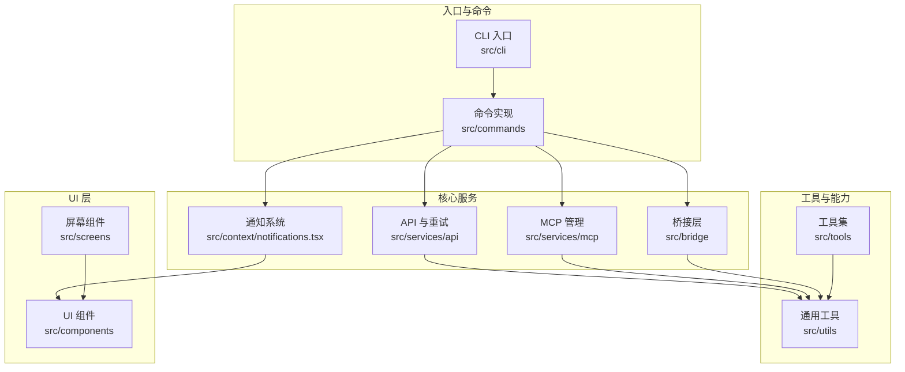

图表来源
- [README.md:95-114](file://README.md#L95-L114)
- [package.json:1-34](file://package.json#L1-L34)

章节来源
- [README.md:95-114](file://README.md#L95-L114)
- [package.json:1-34](file://package.json#L1-L34)

## 核心组件
- 错误日志与诊断
  - 错误日志写入与归档：通过错误日志 Sink 将错误事件持久化到缓存目录，支持 MCP 日志分离存储。
  - 内存中错误队列：在 Sink 未就绪前，错误事件会被暂存，待 Sink 初始化后批量投递。
  - 错误 ID 常量：为生产环境追踪错误来源提供稳定标识。
- 启动性能分析
  - 启动阶段打点与报告生成，支持采样与详细模式（含内存快照）。
- 调试日志
  - 可通过环境变量与命令行参数控制调试级别、输出位置与过滤器；自动维护最新调试日志软链接。
- 诊断界面（Doctor）
  - 集中展示安装状态、包管理器、更新权限、版本锁、插件与代理解析错误、上下文使用警告等。
- 通知系统
  - 优先级、折叠合并、超时与即时显示策略，统一承载系统提示与告警。
- 性能诊断与内存分析
  - 提供堆转储与内存诊断数据采集，辅助定位内存泄漏与性能瓶颈。

章节来源
- [errorLogSink.ts:225-235](file://src/utils/errorLogSink.ts#L225-L235)
- [log.ts:96-199](file://src/utils/log.ts#L96-L199)
- [errorIds.ts:1-16](file://src/constants/errorIds.ts#L1-L16)
- [startupProfiler.ts:123-149](file://src/utils/startupProfiler.ts#L123-L149)
- [debug.ts:203-228](file://src/utils/debug.ts#L203-L228)
- [Doctor.tsx:100-501](file://src/screens/Doctor.tsx#L100-L501)
- [notifications.tsx:38-154](file://src/context/notifications.tsx#L38-L154)
- [heapDumpService.ts:221-278](file://src/utils/heapDumpService.ts#L221-L278)

## 架构总览
下图展示了从命令执行到错误日志、调试日志、性能分析与诊断界面的整体流程。

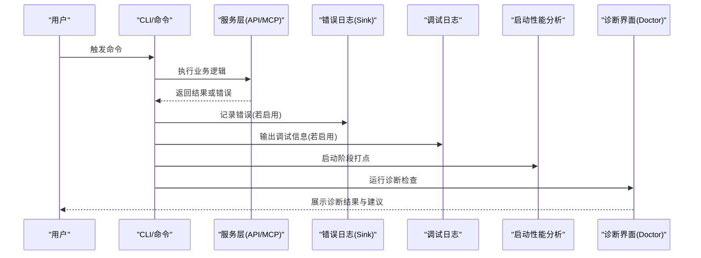

图表来源
- [withRetry.ts:212-514](file://src/services/api/withRetry.ts#L212-L514)
- [errorLogSink.ts:225-235](file://src/utils/errorLogSink.ts#L225-L235)
- [debug.ts:203-228](file://src/utils/debug.ts#L203-L228)
- [startupProfiler.ts:123-149](file://src/utils/startupProfiler.ts#L123-L149)
- [Doctor.tsx:100-501](file://src/screens/Doctor.tsx#L100-L501)

## 详细组件分析

### 错误日志与错误追踪
- 错误日志 Sink
  - 初始化后挂载到全局错误日志系统，负责将错误写入磁盘并按日期分片。
  - 支持 MCP 专用日志目录，便于区分不同服务器的错误信息。
- 错误队列与延迟投递
  - 在 Sink 未初始化前，错误事件被暂存在内存队列，初始化后立即投递，避免丢失。
- 错误 ID
  - 为错误来源提供稳定标识，便于生产环境追踪与统计。

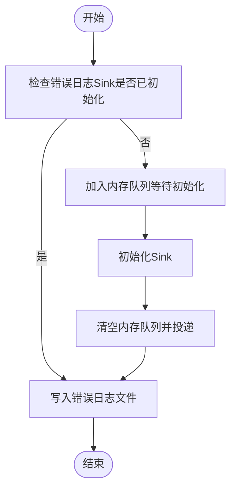

图表来源
- [log.ts:96-199](file://src/utils/log.ts#L96-L199)
- [errorLogSink.ts:225-235](file://src/utils/errorLogSink.ts#L225-L235)

章节来源
- [errorLogSink.ts:29-38](file://src/utils/errorLogSink.ts#L29-L38)
- [log.ts:96-199](file://src/utils/log.ts#L96-L199)
- [errorIds.ts:1-16](file://src/constants/errorIds.ts#L1-L16)

### 启动性能分析
- 启动阶段打点与报告
  - 通过性能钩子记录关键时间点，支持采样上报与详细报告（含内存快照）。
  - 详细报告可写入会话专属文件，便于对比与分析。
- 报告生成与输出
  - 采样模式仅上报关键指标；详细模式输出完整时间线与内存信息。

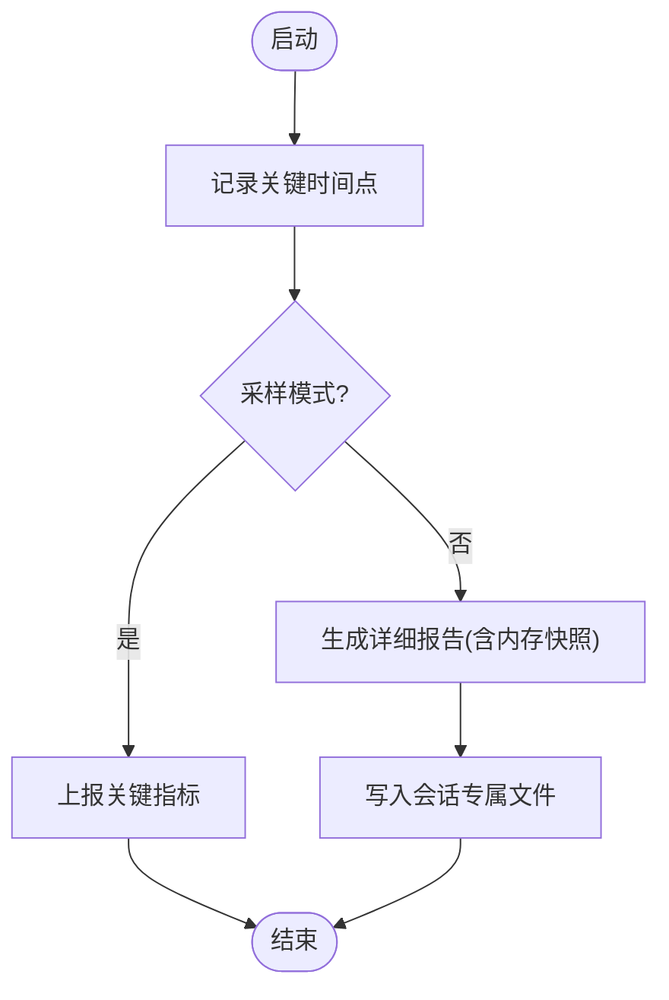

图表来源
- [startupProfiler.ts:123-149](file://src/utils/startupProfiler.ts#L123-L149)
- [profilerBase.ts:33-46](file://src/utils/profilerBase.ts#L33-L46)

章节来源
- [startupProfiler.ts:123-149](file://src/utils/startupProfiler.ts#L123-L149)
- [profilerBase.ts:14-46](file://src/utils/profilerBase.ts#L14-L46)

### 调试日志与日志路径
- 调试开关与过滤
  - 支持通过环境变量、命令行参数设置最小日志级别、过滤器与输出目标（标准错误或文件）。
- 日志路径与软链接
  - 默认日志目录位于用户配置目录下的 debug 子目录，当前会话日志文件维护“latest”软链接，便于快速定位。

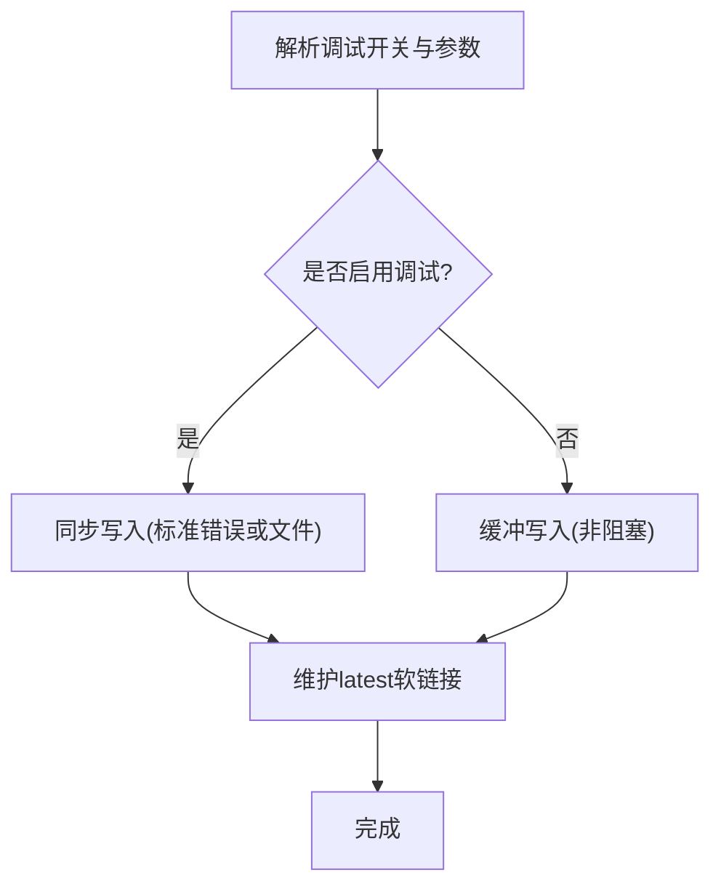

图表来源
- [debug.ts:44-102](file://src/utils/debug.ts#L44-L102)
- [debug.ts:230-253](file://src/utils/debug.ts#L230-L253)

章节来源
- [debug.ts:44-102](file://src/utils/debug.ts#L44-L102)
- [debug.ts:230-253](file://src/utils/debug.ts#L230-L253)

### 诊断界面（Doctor）
- 安装与版本信息
  - 显示当前运行类型、版本、安装路径、调用二进制、配置安装方式、搜索可用性与推荐。
- 包管理器与更新
  - 显示包管理器状态、自动更新开关、更新权限与版本标签信息。
- 环境与配置
  - 检查多实例安装、无效设置、环境变量边界值、版本锁清理与状态。
- 插件与代理
  - 展示插件错误、代理解析警告、键位冲突与上下文使用警告（不可达规则、ClaudeMd 使用、Agent 与 MCP 使用）。
- 交互与退出
  - 支持按键确认与退出，提供简洁的“继续”提示。

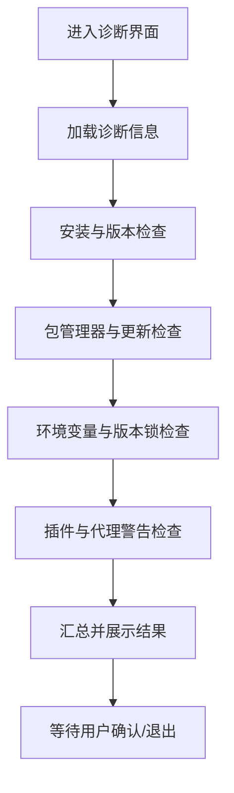

图表来源
- [Doctor.tsx:100-501](file://src/screens/Doctor.tsx#L100-L501)

章节来源
- [Doctor.tsx:100-501](file://src/screens/Doctor.tsx#L100-L501)

### 通知系统与错误提示
- 通知模型
  - 支持文本与 JSX 通知，具备优先级、超时、失效键与折叠函数。
- 队列与显示
  - 当前显示项与队列分离管理，支持折叠合并与超时清除。
- 启动一次性通知
  - 提供一次性触发的通知封装，避免重复弹出与远程模式限制。

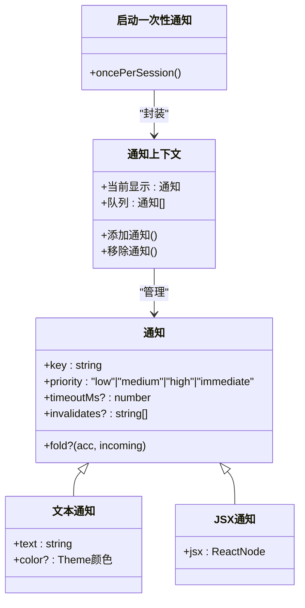

图表来源
- [notifications.tsx:38-154](file://src/context/notifications.tsx#L38-L154)
- [useStartupNotification.ts:19-41](file://src/hooks/useStartupNotification.ts#L19-L41)

章节来源
- [notifications.tsx:38-154](file://src/context/notifications.tsx#L38-L154)
- [useStartupNotification.ts:19-41](file://src/hooks/useStartupNotification.ts#L19-L41)

### API 重试与网络错误处理
- 重试策略
  - 对认证失败、连接复用导致的 ECONNRESET/EPIPE、持久重试等场景采用指数退避与心跳保活。
- 错误溯源
  - 通过遍历错误链寻找带 code 的根因，并识别 SSL 相关错误类型。
- 用户中断
  - 对用户主动取消的请求抛出特定错误类型，便于上层处理。

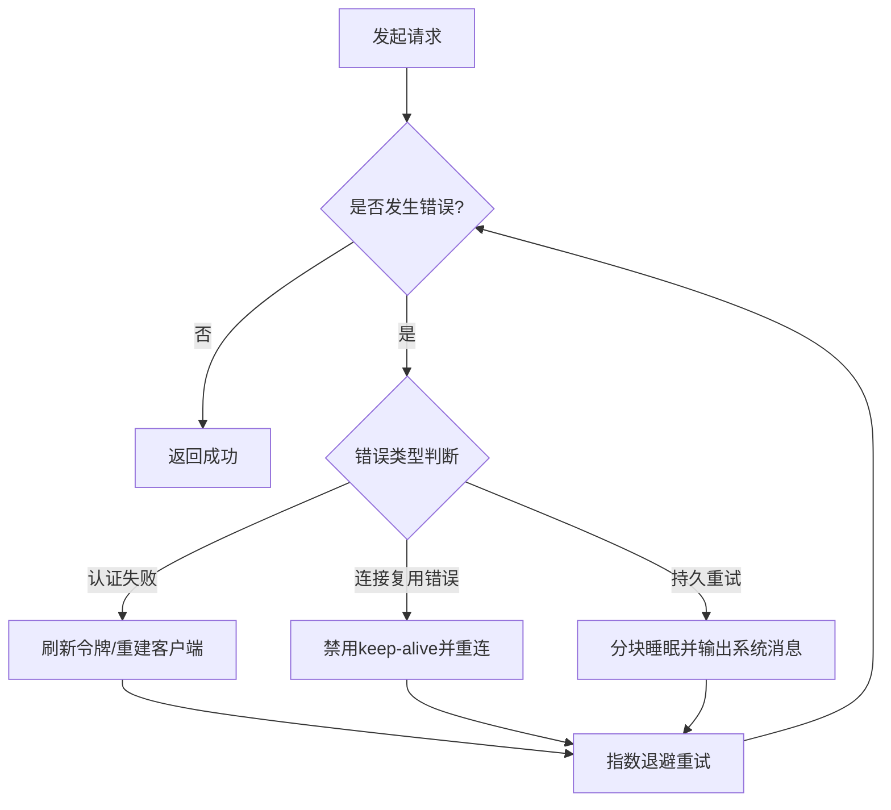

图表来源
- [withRetry.ts:212-514](file://src/services/api/withRetry.ts#L212-L514)
- [errorUtils.ts:49-83](file://src/services/api/errorUtils.ts#L49-L83)

章节来源
- [withRetry.ts:212-514](file://src/services/api/withRetry.ts#L212-L514)
- [errorUtils.ts:49-83](file://src/services/api/errorUtils.ts#L49-L83)

### 桥接层连接与重连
- 重连机制
  - 对不同传输类型采用指数退避重连，达到最大尝试次数后标记失败并清理定时器。
- 回退与节流
  - 根据错误类型调整初始/上限回退时间，加入抖动避免雪崩。

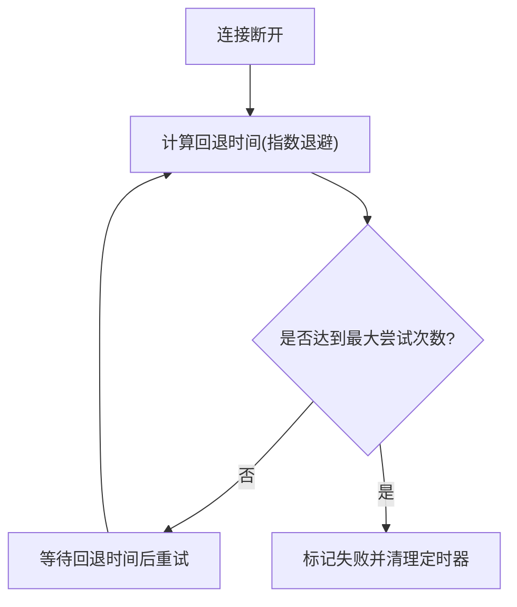

图表来源
- [useManageMCPConnections.ts:417-468](file://src/services/mcp/useManageMCPConnections.ts#L417-L468)
- [bridgeMain.ts:1314-1339](file://src/bridge/bridgeMain.ts#L1314-L1339)

章节来源
- [useManageMCPConnections.ts:417-468](file://src/services/mcp/useManageMCPConnections.ts#L417-L468)
- [bridgeMain.ts:1314-1339](file://src/bridge/bridgeMain.ts#L1314-L1339)

### 权限与路径安全
- 路径权限检查
  - 收集原始路径、符号链接链中间目标与最终解析路径，确保对真实目标的访问控制生效。
- PowerShell 工具路径校验
  - 阻止写/创建操作中的通配符；对包含路径穿越的读取操作进行全路径解析后再判定。
- UNC 路径与家目录展开
  - 防御性地阻止 UNC 路径与家目录波浪号展开，降低网络请求与越权风险。

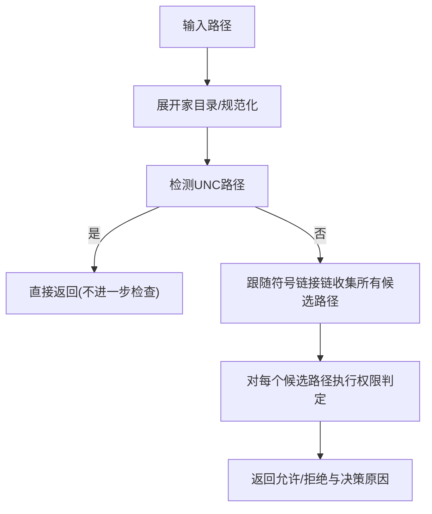

图表来源
- [fsOperations.ts:288-342](file://src/utils/fsOperations.ts#L288-L342)
- [pathValidation.ts:46-1197](file://src/tools/PowerShellTool/pathValidation.ts#L46-L1197)

章节来源
- [fsOperations.ts:288-342](file://src/utils/fsOperations.ts#L288-L342)
- [pathValidation.ts:46-1197](file://src/tools/PowerShellTool/pathValidation.ts#L46-L1197)

### 命令执行与错误格式化
- 失败命令格式化
  - 将 Shell 错误标准化为统一格式，包含标准输出与标准错误；对中断与非中断分别处理。
- 模式匹配与提示
  - 在命令失败时提供模式提示，便于用户理解失败原因。

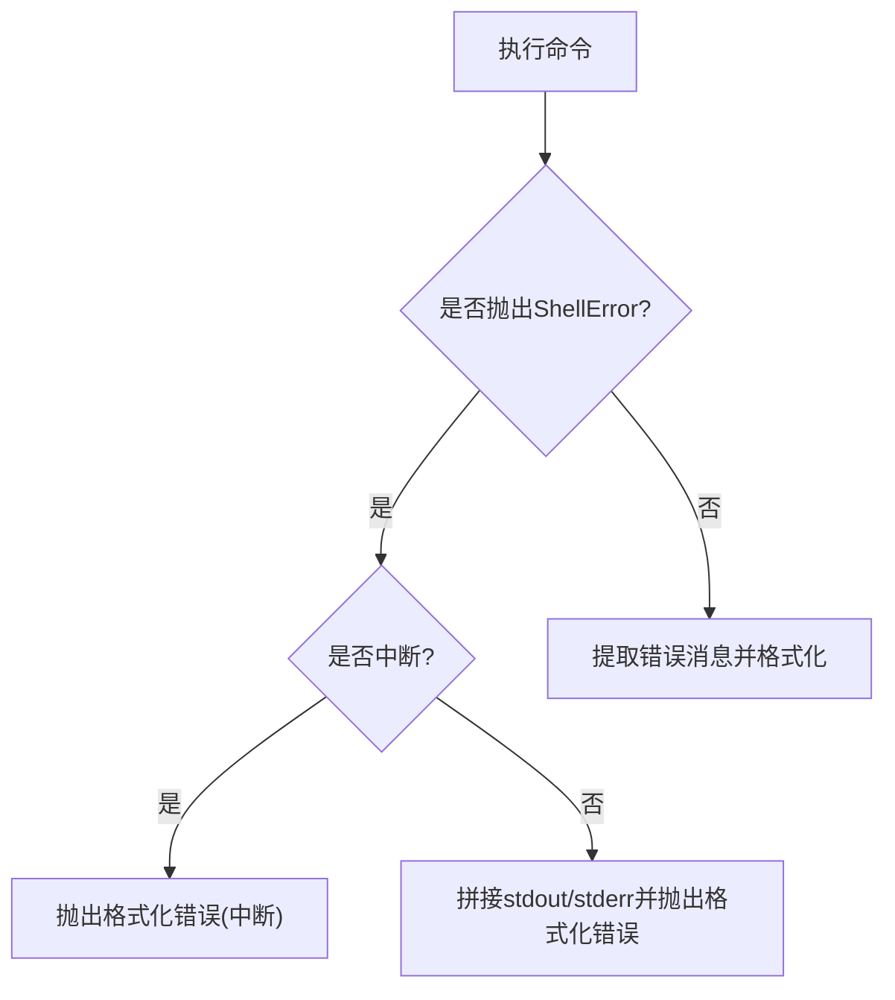

图表来源
- [promptShellExecution.ts:164-183](file://src/utils/promptShellExecution.ts#L164-L183)

章节来源
- [promptShellExecution.ts:164-183](file://src/utils/promptShellExecution.ts#L164-L183)

### 性能诊断与内存分析
- 堆转储与诊断
  - 先写入内存诊断数据，再捕获堆快照，避免大堆快照序列化过程中的崩溃。
  - 诊断数据包含 V8 堆统计、空间分布、资源使用、句柄与请求计数等。
- 自动与手动触发
  - 支持手动触发与阈值触发（例如超过 1.5GB），并记录触发来源与序号。

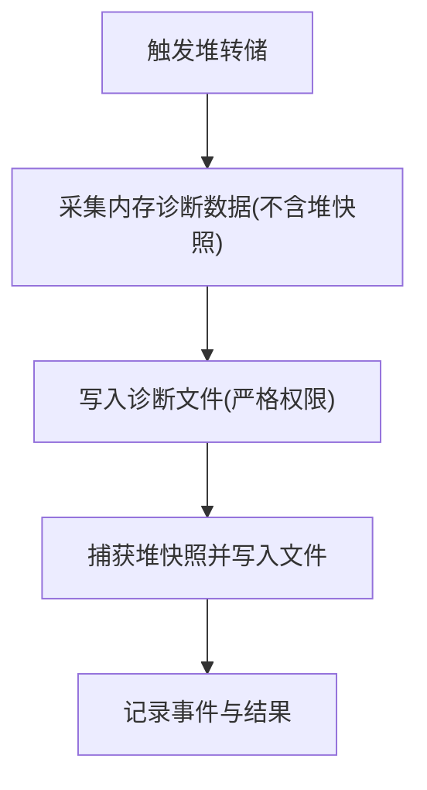

图表来源
- [heapDumpService.ts:221-278](file://src/utils/heapDumpService.ts#L221-L278)
- [heapdump.ts:1-17](file://src/commands/heapdump/heapdump.ts#L1-L17)

章节来源
- [heapDumpService.ts:221-278](file://src/utils/heapDumpService.ts#L221-L278)
- [heapdump.ts:1-17](file://src/commands/heapdump/heapdump.ts#L1-L17)

## 依赖关系分析
- 错误日志与调试日志
  - 错误日志 Sink 依赖缓存路径模块以确定日志文件位置；调试日志依赖会话 ID 与配置目录。
- 诊断界面
  - Doctor 依赖环境变量验证、版本锁清理、MCP 解析警告、键位冲突检测与设置错误列表。
- API 与桥接
  - API 重试依赖错误溯源工具；桥接层连接依赖回退配置与心跳保活。
- 工具与安全
  - 路径权限检查与 PowerShell 工具路径校验共同保障文件系统安全。

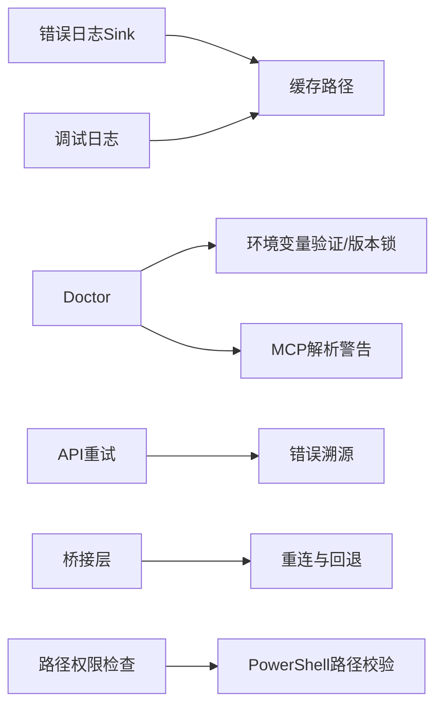

图表来源
- [errorLogSink.ts:29-38](file://src/utils/errorLogSink.ts#L29-L38)
- [cachePaths.ts:25-38](file://src/utils/cachePaths.ts#L25-L38)
- [Doctor.tsx:100-501](file://src/screens/Doctor.tsx#L100-L501)
- [withRetry.ts:212-514](file://src/services/api/withRetry.ts#L212-L514)
- [errorUtils.ts:49-83](file://src/services/api/errorUtils.ts#L49-L83)
- [fsOperations.ts:288-342](file://src/utils/fsOperations.ts#L288-L342)
- [pathValidation.ts:46-1197](file://src/tools/PowerShellTool/pathValidation.ts#L46-L1197)

章节来源
- [cachePaths.ts:25-38](file://src/utils/cachePaths.ts#L25-L38)
- [Doctor.tsx:100-501](file://src/screens/Doctor.tsx#L100-L501)
- [withRetry.ts:212-514](file://src/services/api/withRetry.ts#L212-L514)
- [errorUtils.ts:49-83](file://src/services/api/errorUtils.ts#L49-L83)
- [fsOperations.ts:288-342](file://src/utils/fsOperations.ts#L288-L342)
- [pathValidation.ts:46-1197](file://src/tools/PowerShellTool/pathValidation.ts#L46-L1197)

## 性能考虑
- 启动性能
  - 使用启动性能分析模块记录关键阶段耗时与内存变化，结合采样与详细报告定位瓶颈。
- 调试日志成本
  - 非蚂蚁用户默认缓冲写入，避免高频 I/O；开启详细调试会增加 I/O 压力。
- API 重试
  - 指数退避与心跳保活减少网络抖动影响；持久重试时分块睡眠避免长时间阻塞。
- 堆转储
  - 先写诊断后写快照，降低大堆快照序列化失败概率；合理设置触发阈值避免频繁转储。

章节来源
- [startupProfiler.ts:123-149](file://src/utils/startupProfiler.ts#L123-L149)
- [debug.ts:155-196](file://src/utils/debug.ts#L155-L196)
- [withRetry.ts:477-514](file://src/services/api/withRetry.ts#L477-L514)
- [heapDumpService.ts:221-278](file://src/utils/heapDumpService.ts#L221-L278)

## 故障排除指南

### 安装与配置问题
- 依赖缺失
  - 项目声明 Node 版本要求与可选图像库依赖，若出现运行异常，检查 Node 版本与平台兼容性。
- 权限问题
  - 使用 Doctor 检查包管理器状态、更新权限与版本锁；必要时以管理员权限执行更新。
- 环境变量配置
  - 使用 Doctor 检查环境变量边界值与无效设置；通过调试日志查看实际生效值。

章节来源
- [package.json:7-9](file://package.json#L7-L9)
- [Doctor.tsx:100-501](file://src/screens/Doctor.tsx#L100-L501)
- [debug.ts:44-102](file://src/utils/debug.ts#L44-L102)

### 运行时错误诊断与修复
- 命令执行失败
  - 查看命令执行错误格式化输出，确认 stdout/stderr；根据中断/非中断类型采取相应措施。
- 工具调用错误
  - 检查路径权限与符号链接链；对包含通配符或路径穿越的写/创建操作进行拦截。
- 网络连接问题
  - API 重试模块会自动处理认证失败与连接复用错误；持久重试时注意系统消息提示。
- 桥接层连接失败
  - 查看桥接层回退与心跳保活日志；必要时调整回退参数或检查网络稳定性。

章节来源
- [promptShellExecution.ts:164-183](file://src/utils/promptShellExecution.ts#L164-L183)
- [fsOperations.ts:288-342](file://src/utils/fsOperations.ts#L288-L342)
- [pathValidation.ts:46-1197](file://src/tools/PowerShellTool/pathValidation.ts#L46-L1197)
- [withRetry.ts:212-514](file://src/services/api/withRetry.ts#L212-L514)
- [bridgeMain.ts:1314-1339](file://src/bridge/bridgeMain.ts#L1314-L1339)

### 性能问题分析与优化
- 启动缓慢
  - 使用启动性能分析模块生成报告，关注 I/O 与内存峰值；优化依赖加载与缓存命中。
- 内存占用过高
  - 使用堆转储与内存诊断数据，结合 V8 堆统计与空间分布定位泄漏点；必要时降低日志级别与关闭详细调试。

章节来源
- [startupProfiler.ts:123-149](file://src/utils/startupProfiler.ts#L123-L149)
- [heapDumpService.ts:221-278](file://src/utils/heapDumpService.ts#L221-L278)
- [debug.ts:44-102](file://src/utils/debug.ts#L44-L102)

### 日志分析方法
- 错误日志
  - 错误日志按日期分片存放，MCP 日志单独目录；Doctor 可辅助定位安装与配置问题。
- 调试日志
  - 通过环境变量与命令行参数控制输出位置与级别；维护“latest”软链接便于快速定位。
- 启动性能报告
  - 采样模式上报关键指标，详细模式输出完整时间线与内存信息。

章节来源
- [errorLogSink.ts:29-38](file://src/utils/errorLogSink.ts#L29-L38)
- [cachePaths.ts:25-38](file://src/utils/cachePaths.ts#L25-L38)
- [debug.ts:230-253](file://src/utils/debug.ts#L230-L253)
- [startupProfiler.ts:123-149](file://src/utils/startupProfiler.ts#L123-L149)

### 通知系统与错误提示
- 通知含义
  - 通知具有优先级、超时与折叠策略；即时通知会打断低优先级提示。
- 错误提示
  - Doctor 展示安装状态、包管理器、更新权限、版本锁、插件与代理警告；结合通知系统呈现给用户。

章节来源
- [notifications.tsx:38-154](file://src/context/notifications.tsx#L38-L154)
- [Doctor.tsx:100-501](file://src/screens/Doctor.tsx#L100-L501)

### 社区支持与获取帮助
- 问题反馈
  - 通过项目主页的 Issues 页面提交问题，附带 Doctor 诊断结果与相关日志。
- 版本与发布
  - 关注包管理器通道与版本标签，及时获取更新与修复。

章节来源
- [README.md:15-17](file://README.md#L15-L17)
- [README.md:16-17](file://README.md#L16-L17)

## 结论
本指南基于代码实现总结了 Claude Code 的故障排除与常见问题处理方法，涵盖安装配置、运行时错误、性能问题、日志分析与通知系统。建议在遇到问题时先运行 Doctor 获取系统状态摘要，再结合调试日志与性能报告定位根因，并参考 API 重试与桥接层回退策略进行修复。

## 附录
- 快速定位步骤
  - 运行 Doctor 获取安装与配置概览。
  - 开启调试日志并复现问题，查看“latest”软链接指向的日志文件。
  - 如涉及网络或工具调用，检查 API 重试与路径安全策略。
  - 若怀疑内存问题，使用堆转储与内存诊断数据进行分析。