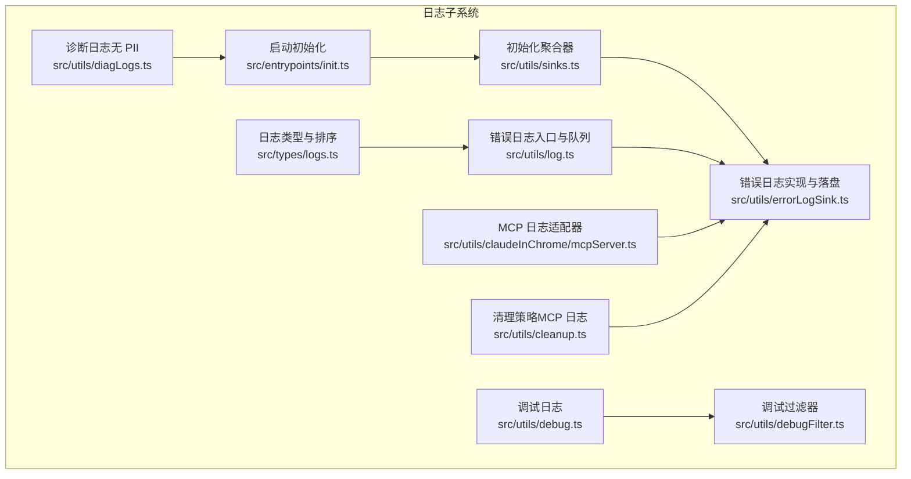
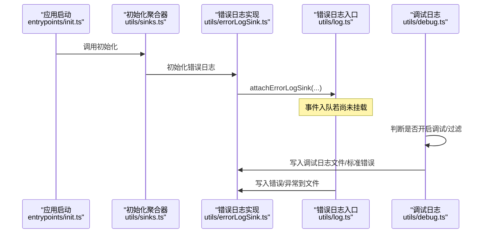
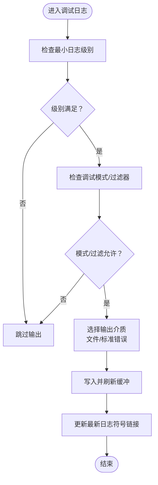
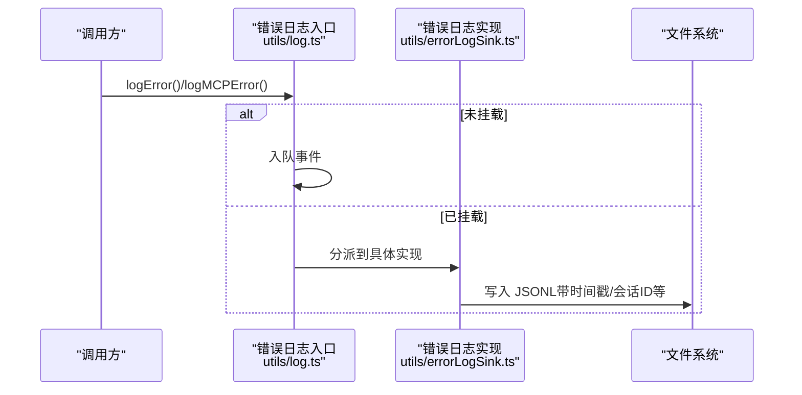
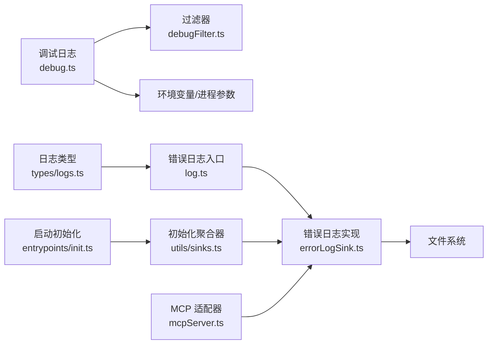

# 日志分析和调试

<cite>
**本文引用的文件**
- [src/utils/debug.ts](file://src/utils/debug.ts)
- [src/utils/debugFilter.ts](file://src/utils/debugFilter.ts)
- [src/utils/log.ts](file://src/utils/log.ts)
- [src/utils/errorLogSink.ts](file://src/utils/errorLogSink.ts)
- [src/utils/diagLogs.ts](file://src/utils/diagLogs.ts)
- [src/utils/sinks.ts](file://src/utils/sinks.ts)
- [src/types/logs.ts](file://src/types/logs.ts)
- [src/entrypoints/init.ts](file://src/entrypoints/init.ts)
- [src/skills/bundled/debug.ts](file://src/skills/bundled/debug.ts)
- [src/utils/cleanup.ts](file://src/utils/cleanup.ts)
- [src/utils/claudeInChrome/mcpServer.ts](file://src/utils/claudeInChrome/mcpServer.ts)
- [src/cli/transports/transportUtils.ts](file://src/cli/transports/transportUtils.ts)
- [src/cli/ndjsonSafeStringify.ts](file://src/cli/ndjsonSafeStringify.ts)
</cite>

## 目录
1. [简介](#简介)
2. [项目结构](#项目结构)
3. [核心组件](#核心组件)
4. [架构总览](#架构总览)
5. [详细组件分析](#详细组件分析)
6. [依赖关系分析](#依赖关系分析)
7. [性能考量](#性能考量)
8. [故障排查指南](#故障排查指南)
9. [结论](#结论)
10. [附录](#附录)

## 简介
本指南面向 Claude Code 的开发者与使用者，系统讲解日志体系的架构、日志级别、日志位置与格式、如何查看与解读日志、常见错误信号与模式识别、日志过滤与搜索技巧、调试模式启用与使用（含详细日志与堆栈跟踪）、日志分析工具与脚本示例，以及生产与开发环境的日志配置差异。目标是帮助你在复杂会话与多组件交互场景下，快速定位问题并高效复现与修复。

## 项目结构
日志系统由“调试日志”“错误日志/文件落盘”“诊断日志（无 PII）”三部分组成，并通过统一的初始化流程在应用启动时挂载。关键模块如下：
- 调试日志：控制台/文件输出、过滤器、最小日志级别、标准错误输出、符号链接指向最新日志等
- 错误日志：错误事件入队、延迟写入、文件缓冲写入、MCP 错误/调试消息落盘
- 诊断日志：无 PII 的结构化 JSONL 记录，用于容器内监控
- 日志类型定义：会话日志、消息序列化、排序与去重等

图表来源
- [src/utils/debug.ts:1-269](file://src/utils/debug.ts#L1-L269)
- [src/utils/debugFilter.ts:1-158](file://src/utils/debugFilter.ts#L1-L158)
- [src/utils/log.ts:1-363](file://src/utils/log.ts#L1-L363)
- [src/utils/errorLogSink.ts:1-236](file://src/utils/errorLogSink.ts#L1-L236)
- [src/utils/diagLogs.ts:1-95](file://src/utils/diagLogs.ts#L1-L95)
- [src/utils/sinks.ts:1-16](file://src/utils/sinks.ts#L1-L16)
- [src/entrypoints/init.ts:26-88](file://src/entrypoints/init.ts#L26-L88)
- [src/utils/claudeInChrome/mcpServer.ts:277-293](file://src/utils/claudeInChrome/mcpServer.ts#L277-L293)
- [src/utils/cleanup.ts:102-159](file://src/utils/cleanup.ts#L102-L159)

章节来源
- [src/utils/debug.ts:1-269](file://src/utils/debug.ts#L1-L269)
- [src/utils/debugFilter.ts:1-158](file://src/utils/debugFilter.ts#L1-L158)
- [src/utils/log.ts:1-363](file://src/utils/log.ts#L1-L363)
- [src/utils/errorLogSink.ts:1-236](file://src/utils/errorLogSink.ts#L1-L236)
- [src/utils/diagLogs.ts:1-95](file://src/utils/diagLogs.ts#L1-L95)
- [src/utils/sinks.ts:1-16](file://src/utils/sinks.ts#L1-L16)
- [src/entrypoints/init.ts:26-88](file://src/entrypoints/init.ts#L26-L88)
- [src/utils/claudeInChrome/mcpServer.ts:277-293](file://src/utils/claudeInChrome/mcpServer.ts#L277-L293)
- [src/utils/cleanup.ts:102-159](file://src/utils/cleanup.ts#L102-L159)

## 核心组件
- 调试日志与过滤
  - 支持最小日志级别、命令行开关、标准错误输出、文件输出、最新日志符号链接、按类别过滤
  - 关键路径：[src/utils/debug.ts:1-269](file://src/utils/debug.ts#L1-L269)，[src/utils/debugFilter.ts:1-158](file://src/utils/debugFilter.ts#L1-L158)
- 错误日志与落盘
  - 错误事件入队、延迟写入、缓冲写入、MCP 错误/调试消息落盘、Ant 用户专属增强
  - 关键路径：[src/utils/log.ts:1-363](file://src/utils/log.ts#L1-L363)，[src/utils/errorLogSink.ts:1-236](file://src/utils/errorLogSink.ts#L1-L236)
- 诊断日志（无 PII）
  - 结构化 JSONL，仅记录非个人数据，用于容器内监控与性能计时
  - 关键路径：[src/utils/diagLogs.ts:1-95](file://src/utils/diagLogs.ts#L1-L95)
- 日志类型与加载
  - 会话日志结构、消息序列化、加载与排序、去重与标题生成
  - 关键路径：[src/types/logs.ts:1-331](file://src/types/logs.ts#L1-L331)
- 启动与初始化
  - 应用启动时挂载错误日志与分析日志，保证事件不丢失
  - 关键路径：[src/entrypoints/init.ts:26-88](file://src/entrypoints/init.ts#L26-L88)，[src/utils/sinks.ts:1-16](file://src/utils/sinks.ts#L1-L16)
- MCP 日志适配
  - 将 MCP 服务器日志桥接到统一错误日志系统
  - 关键路径：[src/utils/claudeInChrome/mcpServer.ts:277-293](file://src/utils/claudeInChrome/mcpServer.ts#L277-L293)
- 清理策略
  - 定期清理过期 MCP 日志目录与文件
  - 关键路径：[src/utils/cleanup.ts:102-159](file://src/utils/cleanup.ts#L102-L159)

章节来源
- [src/utils/debug.ts:18-269](file://src/utils/debug.ts#L18-L269)
- [src/utils/debugFilter.ts:3-158](file://src/utils/debugFilter.ts#L3-L158)
- [src/utils/log.ts:64-363](file://src/utils/log.ts#L64-L363)
- [src/utils/errorLogSink.ts:13-236](file://src/utils/errorLogSink.ts#L13-L236)
- [src/utils/diagLogs.ts:5-95](file://src/utils/diagLogs.ts#L5-L95)
- [src/types/logs.ts:8-331](file://src/types/logs.ts#L8-L331)
- [src/entrypoints/init.ts:26-88](file://src/entrypoints/init.ts#L26-L88)
- [src/utils/sinks.ts:1-16](file://src/utils/sinks.ts#L1-L16)
- [src/utils/claudeInChrome/mcpServer.ts:277-293](file://src/utils/claudeInChrome/mcpServer.ts#L277-L293)
- [src/utils/cleanup.ts:102-159](file://src/utils/cleanup.ts#L102-L159)

## 架构总览
日志系统采用“事件入队 + 延迟写入 + 缓冲写入”的设计，确保在未初始化完成前不会丢失任何事件；同时支持多种输出介质与过滤策略，兼顾性能与可读性。

图表来源
- [src/entrypoints/init.ts:26-88](file://src/entrypoints/init.ts#L26-L88)
- [src/utils/sinks.ts:13-16](file://src/utils/sinks.ts#L13-L16)
- [src/utils/errorLogSink.ts:225-235](file://src/utils/errorLogSink.ts#L225-L235)
- [src/utils/log.ts:109-134](file://src/utils/log.ts#L109-L134)
- [src/utils/debug.ts:155-228](file://src/utils/debug.ts#L155-L228)

## 详细组件分析

### 调试日志系统
- 日志级别与最小阈值
  - 支持 verbose、debug、info、warn、error；可通过环境变量设置最小级别
  - 参考路径：[src/utils/debug.ts:18-40](file://src/utils/debug.ts#L18-L40)
- 调试模式判定
  - 支持命令行参数、环境变量、标准错误输出、文件输出、动态启用等
  - 参考路径：[src/utils/debug.ts:42-102](file://src/utils/debug.ts#L42-L102)
- 过滤机制
  - 基于类别（如 MCP、mcp-servername、1p 等）的包含/排除过滤，支持混合模式处理
  - 参考路径：[src/utils/debugFilter.ts:16-158](file://src/utils/debugFilter.ts#L16-L158)
- 输出介质
  - 文件输出（带最新日志符号链接）、标准错误输出、缓冲写入、即时写入
  - 参考路径：[src/utils/debug.ts:155-253](file://src/utils/debug.ts#L155-L253)
- 使用建议
  - 开发时优先使用标准错误输出以避免污染文件；生产或需要持久化时使用文件输出
  - 使用过滤器缩小噪声，例如仅关注 MCP 或特定组件

图表来源
- [src/utils/debug.ts:203-253](file://src/utils/debug.ts#L203-L253)
- [src/utils/debugFilter.ts:116-158](file://src/utils/debugFilter.ts#L116-L158)

章节来源
- [src/utils/debug.ts:18-269](file://src/utils/debug.ts#L18-L269)
- [src/utils/debugFilter.ts:1-158](file://src/utils/debugFilter.ts#L1-L158)

### 错误日志与落盘
- 入队与延迟写入
  - 在错误日志实现未就绪时，事件会被入队，待实现初始化后立即出队并写入
  - 参考路径：[src/utils/log.ts:91-134](file://src/utils/log.ts#L91-L134)
- 错误格式与上下文
  - Axios 错误自动提取 URL、状态码、服务端消息；Ant 用户显示堆栈
  - 参考路径：[src/utils/errorLogSink.ts:152-174](file://src/utils/errorLogSink.ts#L152-L174)
- 文件落盘与缓冲
  - 按日期分文件，目录不存在时自动创建；缓冲写入，定期刷新
  - 参考路径：[src/utils/errorLogSink.ts:85-126](file://src/utils/errorLogSink.ts#L85-L126)
- MCP 日志
  - MCP 错误与调试消息单独落盘，包含会话 ID、工作目录、版本等上下文
  - 参考路径：[src/utils/errorLogSink.ts:179-213](file://src/utils/errorLogSink.ts#L179-L213)，[src/utils/claudeInChrome/mcpServer.ts:277-293](file://src/utils/claudeInChrome/mcpServer.ts#L277-L293)

图表来源
- [src/utils/log.ts:158-326](file://src/utils/log.ts#L158-L326)
- [src/utils/errorLogSink.ts:152-213](file://src/utils/errorLogSink.ts#L152-L213)

章节来源
- [src/utils/log.ts:64-363](file://src/utils/log.ts#L64-L363)
- [src/utils/errorLogSink.ts:13-236](file://src/utils/errorLogSink.ts#L13-L236)
- [src/utils/claudeInChrome/mcpServer.ts:277-293](file://src/utils/claudeInChrome/mcpServer.ts#L277-L293)

### 诊断日志（无 PII）
- 设计目标
  - 记录事件、级别、时间戳、附加数据，且绝不包含 PII（路径、仓库名、提示词等）
- 计时包装
  - 提供事件开始/完成/失败的计时记录，便于性能分析
- 参考路径：[src/utils/diagLogs.ts:1-95](file://src/utils/diagLogs.ts#L1-L95)

章节来源
- [src/utils/diagLogs.ts:1-95](file://src/utils/diagLogs.ts#L1-L95)

### 日志类型与加载
- 类型定义
  - 会话消息、标签、PR 链接、任务摘要、工作树状态、内容替换等
- 加载与排序
  - 读取目录、解析 JSONL、计算创建/修改时间、排序、生成标题
- 参考路径：[src/types/logs.ts:1-331](file://src/types/logs.ts#L1-L331)，[src/utils/log.ts:231-283](file://src/utils/log.ts#L231-L283)

章节来源
- [src/types/logs.ts:8-331](file://src/types/logs.ts#L8-L331)
- [src/utils/log.ts:209-283](file://src/utils/log.ts#L209-L283)

### 启动与初始化
- 初始化顺序
  - 先挂载错误日志，再挂载分析日志；保证事件不丢失
- 参考路径：[src/utils/sinks.ts:13-16](file://src/utils/sinks.ts#L13-L16)，[src/entrypoints/init.ts:26-88](file://src/entrypoints/init.ts#L26-L88)

章节来源
- [src/utils/sinks.ts:13-16](file://src/utils/sinks.ts#L13-L16)
- [src/entrypoints/init.ts:26-88](file://src/entrypoints/init.ts#L26-L88)

### MCP 日志适配
- 将 MCP 服务器日志桥接至统一错误日志系统，便于集中分析
- 参考路径：[src/utils/claudeInChrome/mcpServer.ts:277-293](file://src/utils/claudeInChrome/mcpServer.ts#L277-L293)

章节来源
- [src/utils/claudeInChrome/mcpServer.ts:277-293](file://src/utils/claudeInChrome/mcpServer.ts#L277-L293)

### 清理策略
- 定期清理过期 MCP 日志目录与文件，避免磁盘膨胀
- 参考路径：[src/utils/cleanup.ts:102-159](file://src/utils/cleanup.ts#L102-L159)

章节来源
- [src/utils/cleanup.ts:102-159](file://src/utils/cleanup.ts#L102-L159)

## 依赖关系分析
- 组件耦合
  - 调试日志依赖过滤器与环境变量；错误日志依赖文件系统与会话状态；诊断日志独立但与启动流程耦合
- 外部依赖
  - 缓冲写入、符号链接、文件系统操作、JSON 序列化等
- 循环依赖规避
  - 错误日志实现与入口分离，避免启动循环

图表来源
- [src/utils/debug.ts:1-269](file://src/utils/debug.ts#L1-L269)
- [src/utils/debugFilter.ts:1-158](file://src/utils/debugFilter.ts#L1-L158)
- [src/utils/log.ts:1-363](file://src/utils/log.ts#L1-L363)
- [src/utils/errorLogSink.ts:1-236](file://src/utils/errorLogSink.ts#L1-L236)
- [src/utils/sinks.ts:1-16](file://src/utils/sinks.ts#L1-L16)
- [src/entrypoints/init.ts:26-88](file://src/entrypoints/init.ts#L26-L88)
- [src/utils/claudeInChrome/mcpServer.ts:277-293](file://src/utils/claudeInChrome/mcpServer.ts#L277-L293)
- [src/types/logs.ts:1-331](file://src/types/logs.ts#L1-L331)

章节来源
- [src/utils/debug.ts:1-269](file://src/utils/debug.ts#L1-L269)
- [src/utils/debugFilter.ts:1-158](file://src/utils/debugFilter.ts#L1-L158)
- [src/utils/log.ts:1-363](file://src/utils/log.ts#L1-L363)
- [src/utils/errorLogSink.ts:1-236](file://src/utils/errorLogSink.ts#L1-L236)
- [src/utils/sinks.ts:1-16](file://src/utils/sinks.ts#L1-L16)
- [src/entrypoints/init.ts:26-88](file://src/entrypoints/init.ts#L26-L88)
- [src/utils/claudeInChrome/mcpServer.ts:277-293](file://src/utils/claudeInChrome/mcpServer.ts#L277-L293)
- [src/types/logs.ts:1-331](file://src/types/logs.ts#L1-L331)

## 性能考量
- 缓冲写入
  - 调试日志与错误日志均采用缓冲写入，降低频繁 IO 对性能的影响
- 最小日志级别
  - 通过设置最小级别减少高频率 verbose 信息对磁盘与终端的占用
- 符号链接与增量读取
  - 最新日志符号链接便于快速定位；技能侧提供尾部读取，避免全量读取导致内存压力
- 过滤与分类
  - 使用过滤器仅保留相关类别，显著降低噪声与解析成本

章节来源
- [src/utils/debug.ts:155-253](file://src/utils/debug.ts#L155-L253)
- [src/utils/errorLogSink.ts:85-126](file://src/utils/errorLogSink.ts#L85-L126)
- [src/skills/bundled/debug.ts:31-64](file://src/skills/bundled/debug.ts#L31-L64)

## 故障排查指南

### 日志级别与含义
- verbose：极高频率的诊断信息（如完整状态行、shell、cwd、stdout/stderr），默认被过滤
- debug：常规调试信息
- info：一般性信息
- warn：警告
- error：错误

章节来源
- [src/utils/debug.ts:18-40](file://src/utils/debug.ts#L18-L40)

### 日志位置与格式
- 调试日志
  - 默认位于用户配置目录下的 debug 子目录，文件名为会话 ID.txt，同时维护 latest 符号链接
  - 参考路径：[src/utils/debug.ts:230-253](file://src/utils/debug.ts#L230-L253)
- 错误日志
  - 按日期命名的 JSONL 文件，包含时间戳、会话 ID、工作目录、版本等字段
  - 参考路径：[src/utils/errorLogSink.ts:29-38](file://src/utils/errorLogSink.ts#L29-L38)，[src/utils/errorLogSink.ts:111-126](file://src/utils/errorLogSink.ts#L111-L126)
- MCP 日志
  - 按服务器名称分目录，文件同样为 JSONL
  - 参考路径：[src/utils/errorLogSink.ts:36-37](file://src/utils/errorLogSink.ts#L36-L37)，[src/utils/errorLogSink.ts:179-213](file://src/utils/errorLogSink.ts#L179-L213)
- 诊断日志（无 PII）
  - 结构化 JSONL，事件名、级别、时间戳、数据
  - 参考路径：[src/utils/diagLogs.ts:27-57](file://src/utils/diagLogs.ts#L27-L57)

章节来源
- [src/utils/debug.ts:230-253](file://src/utils/debug.ts#L230-L253)
- [src/utils/errorLogSink.ts:29-38](file://src/utils/errorLogSink.ts#L29-L38)
- [src/utils/errorLogSink.ts:111-126](file://src/utils/errorLogSink.ts#L111-L126)
- [src/utils/errorLogSink.ts:179-213](file://src/utils/errorLogSink.ts#L179-L213)
- [src/utils/diagLogs.ts:27-57](file://src/utils/diagLogs.ts#L27-L57)

### 如何正确查看与解读日志
- 调试日志
  - 使用最新符号链接快速定位当前会话日志；必要时使用过滤器聚焦特定类别
  - 参考路径：[src/utils/debug.ts:242-253](file://src/utils/debug.ts#L242-L253)，[src/utils/debugFilter.ts:65-108](file://src/utils/debugFilter.ts#L65-L108)
- 错误日志
  - 查看最近日期文件；注意错误上下文（URL、状态码、服务端消息）与会话 ID
  - 参考路径：[src/utils/errorLogSink.ts:152-174](file://src/utils/errorLogSink.ts#L152-L174)
- MCP 日志
  - 按服务器名称区分目录；关注错误与调试消息的时间线
  - 参考路径：[src/utils/errorLogSink.ts:179-213](file://src/utils/errorLogSink.ts#L179-L213)

章节来源
- [src/utils/debug.ts:242-253](file://src/utils/debug.ts#L242-L253)
- [src/utils/debugFilter.ts:65-108](file://src/utils/debugFilter.ts#L65-L108)
- [src/utils/errorLogSink.ts:152-174](file://src/utils/errorLogSink.ts#L152-L174)
- [src/utils/errorLogSink.ts:179-213](file://src/utils/errorLogSink.ts#L179-L213)

### 常见日志模式与错误信号
- Axios 错误
  - 自动提取 URL、状态码、服务端消息，便于快速定位网络层问题
  - 参考路径：[src/utils/errorLogSink.ts:157-167](file://src/utils/errorLogSink.ts#L157-L167)
- MCP 错误
  - 包含服务器名称、错误文本、时间戳、会话 ID、工作目录
  - 参考路径：[src/utils/errorLogSink.ts:179-194](file://src/utils/errorLogSink.ts#L179-L194)
- Ant 用户专属
  - 在诊断日志中记录性能计时事件（开始/完成/失败），便于定位瓶颈
  - 参考路径：[src/utils/diagLogs.ts:72-94](file://src/utils/diagLogs.ts#L72-L94)

章节来源
- [src/utils/errorLogSink.ts:157-167](file://src/utils/errorLogSink.ts#L157-L167)
- [src/utils/errorLogSink.ts:179-194](file://src/utils/errorLogSink.ts#L179-L194)
- [src/utils/diagLogs.ts:72-94](file://src/utils/diagLogs.ts#L72-L94)

### 日志过滤与搜索技巧
- 过滤器语法
  - 包含式：api,hooks；排除式：!1p,!file；不可混用
  - 参考路径：[src/utils/debugFilter.ts:16-53](file://src/utils/debugFilter.ts#L16-L53)
- 类别提取
  - 支持多种消息格式的类别提取（前缀、方括号、MCP 服务器名、1p 事件等）
  - 参考路径：[src/utils/debugFilter.ts:65-108](file://src/utils/debugFilter.ts#L65-L108)
- 实战建议
  - 使用命令行参数启用调试并指定过滤器，快速缩小范围
  - 在标准错误输出模式下进行快速验证，避免污染文件

章节来源
- [src/utils/debugFilter.ts:16-108](file://src/utils/debugFilter.ts#L16-L108)

### 调试模式启用与使用
- 启用方式
  - 命令行参数（--debug/-d）、环境变量（DEBUG/DEBUG_SDK）、动态启用（/debug 技能）、标准错误输出（--debug-to-stderr/-d2e）、文件输出（--debug-file）
  - 参考路径：[src/utils/debug.ts:44-102](file://src/utils/debug.ts#L44-L102)
- 详细日志与堆栈跟踪
  - Ant 用户可在诊断日志中看到堆栈；错误日志中也包含堆栈信息
  - 参考路径：[src/utils/errorLogSink.ts:152-174](file://src/utils/errorLogSink.ts#L152-L174)，[src/utils/debug.ts:258-269](file://src/utils/debug.ts#L258-L269)

章节来源
- [src/utils/debug.ts:44-102](file://src/utils/debug.ts#L44-L102)
- [src/utils/errorLogSink.ts:152-174](file://src/utils/errorLogSink.ts#L152-L174)
- [src/utils/debug.ts:258-269](file://src/utils/debug.ts#L258-L269)

### 日志分析工具与脚本示例
- 技能侧尾部读取
  - 仅读取最后 N 行，避免全量读取导致内存压力
  - 参考路径：[src/skills/bundled/debug.ts:31-64](file://src/skills/bundled/debug.ts#L31-L64)
- NDJSON 安全序列化
  - 转义行分隔符，确保单行流传输安全
  - 参考路径：[src/cli/ndjsonSafeStringify.ts:1-32](file://src/cli/ndjsonSafeStringify.ts#L1-L32)
- 传输层适配
  - 根据协议选择 SSE/Hybrid/WebSocket 传输，影响日志与事件的读取方式
  - 参考路径：[src/cli/transports/transportUtils.ts:16-45](file://src/cli/transports/transportUtils.ts#L16-L45)

章节来源
- [src/skills/bundled/debug.ts:31-64](file://src/skills/bundled/debug.ts#L31-L64)
- [src/cli/ndjsonSafeStringify.ts:1-32](file://src/cli/ndjsonSafeStringify.ts#L1-L32)
- [src/cli/transports/transportUtils.ts:16-45](file://src/cli/transports/transportUtils.ts#L16-L45)

### 生产环境与开发环境的日志配置差异
- 开发环境
  - 更宽松的调试输出、更详细的日志级别、可使用标准错误输出快速验证
- 生产环境
  - 默认关闭 verbose，使用最小日志级别；Ant 用户默认开启调试以便收集堆栈与上下文
  - 诊断日志用于性能监控，严格禁止 PII
- 参考路径：[src/utils/debug.ts:109-113](file://src/utils/debug.ts#L109-L113)，[src/utils/diagLogs.ts:19-20](file://src/utils/diagLogs.ts#L19-L20)

章节来源
- [src/utils/debug.ts:109-113](file://src/utils/debug.ts#L109-L113)
- [src/utils/diagLogs.ts:19-20](file://src/utils/diagLogs.ts#L19-L20)

## 结论
本指南提供了 Claude Code 日志系统的完整视图：从架构设计到组件实现，从日志级别与位置到过滤与搜索技巧，再到调试模式与工具脚本。通过合理配置与使用这些能力，你可以在开发与生产环境中高效地定位问题、优化性能并提升可观测性。

## 附录

### 快速参考清单
- 启用调试：--debug 或 /debug 技能
- 设置最小日志级别：CLAUDE_CODE_DEBUG_LOG_LEVEL=verbose/debug/info/warn/error
- 过滤调试：--debug=api,hooks 或 --debug=!1p,!file
- 输出到标准错误：--debug-to-stderr
- 输出到文件：--debug-file=/path/to/debug.txt
- 查看最新日志：~/.claude/debug/latest
- 查看错误日志：~/.claude/cache/errors/*.jsonl
- 查看 MCP 日志：~/.claude/cache/mcp-logs-*/YYYY-MM-DD-HH-mm-SS-fff.jsonl

章节来源
- [src/utils/debug.ts:44-102](file://src/utils/debug.ts#L44-L102)
- [src/utils/debug.ts:230-253](file://src/utils/debug.ts#L230-L253)
- [src/utils/errorLogSink.ts:29-38](file://src/utils/errorLogSink.ts#L29-L38)