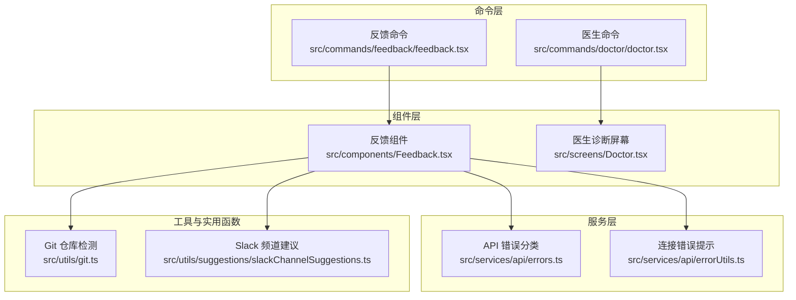
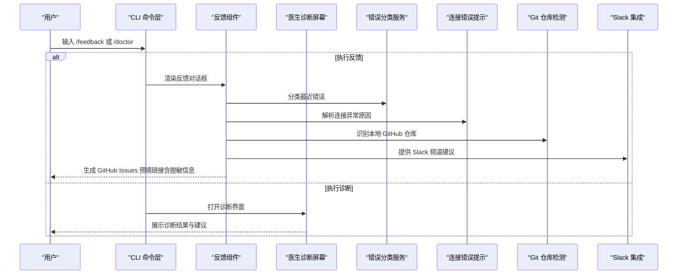
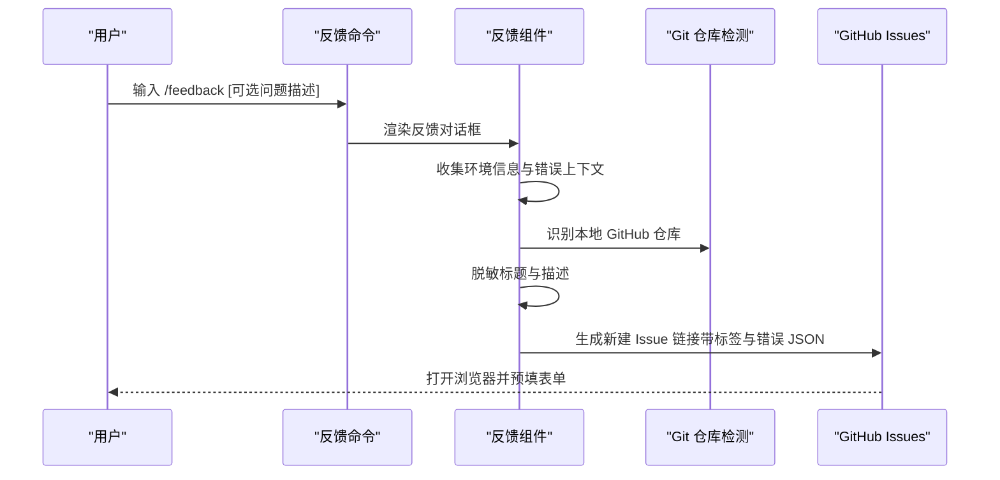
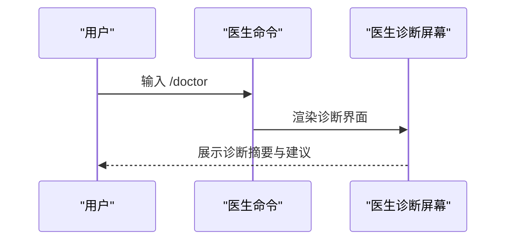
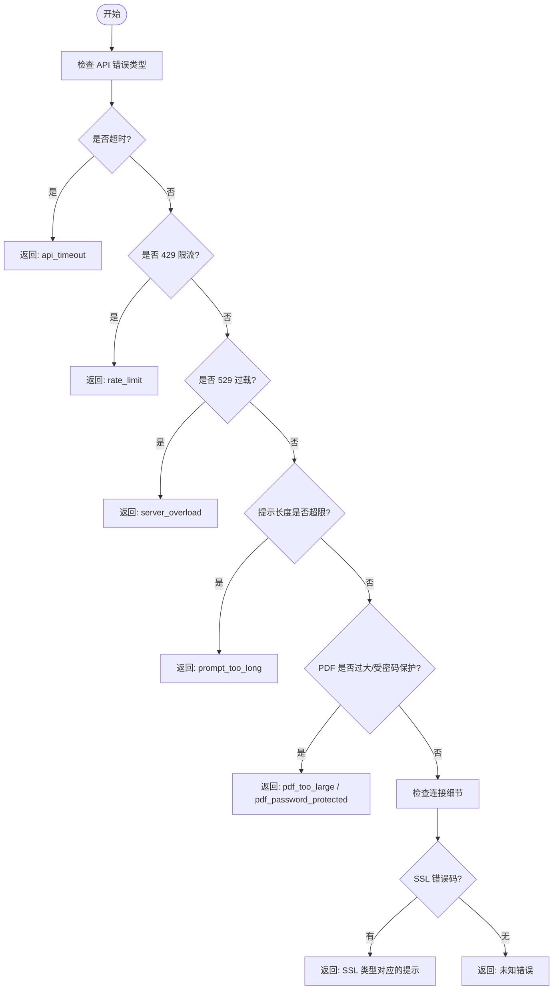
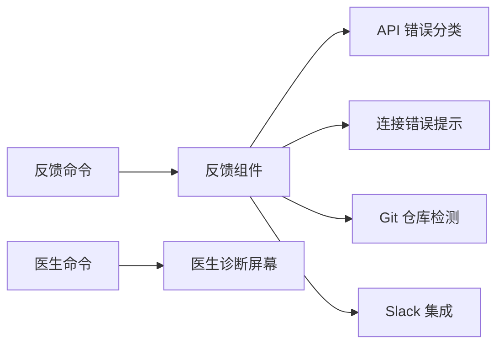

# 社区支持和获取帮助

<cite>
**本文引用的文件**   
- [README.md](file://README.md)
- [反馈命令实现](file://src/commands/feedback/feedback.tsx)
- [医生命令实现](file://src/commands/doctor/doctor.tsx)
- [反馈组件](file://src/components/Feedback.tsx)
- [GitHub Issue 链接生成与安全处理:393-407](file://src/components/Feedback.tsx#L393-L407)
- [环境信息与版本常量引用:399-400](file://src/components/Feedback.tsx#L399-L400)
- [错误分类工具（API 错误）:971-1033](file://src/services/api/errors.ts#L971-L1033)
- [错误分类工具（连接细节）:204-235](file://src/services/api/errorUtils.ts#L204-L235)
- [Git 仓库检测与日志记录:504-521](file://src/utils/git.ts#L504-L521)
- [“医生”诊断屏幕](file://src/screens/Doctor.tsx)
- [“医生”命令入口:1-7](file://src/commands/doctor/doctor.tsx#L1-L7)
- [“反馈”命令入口:1-25](file://src/commands/feedback/feedback.tsx#L1-L25)
- [Claude Code 指南代理（含问题反馈指引）:79-96](file://src/tools/AgentTool/built-in/claudeCodeGuideAgent.ts#L79-L96)
- [Slack 频道建议与集成:1-209](file://src/utils/suggestions/slackChannelSuggestions.ts#L1-L209)
</cite>

## 目录
1. 引言
2. 项目结构
3. 核心组件
4. 架构总览
5. 详细组件分析
6. 依赖关系分析
7. 性能考量
8. 故障排查指南
9. 贡献与参与
10. 联系与支持渠道
11. 结论
12. 附录

## 引言
本指南面向使用 Claude Code 的用户与贡献者，提供社区支持与自助排错的完整路径：官方文档与教程入口、在 GitHub Issues 报告问题与功能请求的方法、社区论坛与聊天群组的使用方式、常见问题与 FAQ 索引、参与开源贡献的步骤、联系维护团队的联系方式与响应预期，以及替代支持方案（如付费或企业支持）的说明。为保证信息准确，本指南中的具体流程与实现细节均来自代码库中实际存在的模块与命令。

## 项目结构
该仓库是 Claude Code 的非官方源码提取，保留了 CLI 入口、命令系统、UI 组件、服务层、工具集与类型定义等模块。与“社区支持”直接相关的关键位置包括：
- 命令层：提供 /feedback 与 /doctor 等交互式支持命令
- 组件层：提供反馈对话框与诊断界面
- 服务层：提供错误分类与网络连接错误提示
- 工具与实用函数：提供 Git 仓库检测、Slack 集成建议等

图表来源
- [反馈命令实现:1-25](file://src/commands/feedback/feedback.tsx#L1-L25)
- [医生命令实现:1-7](file://src/commands/doctor/doctor.tsx#L1-L7)
- [反馈组件](file://src/components/Feedback.tsx)
- [错误分类工具（API 错误）:971-1033](file://src/services/api/errors.ts#L971-L1033)
- [错误分类工具（连接细节）:204-235](file://src/services/api/errorUtils.ts#L204-L235)
- [Git 仓库检测与日志记录:504-521](file://src/utils/git.ts#L504-L521)
- [“医生”诊断屏幕](file://src/screens/Doctor.tsx)
- [Slack 频道建议与集成:1-209](file://src/utils/suggestions/slackChannelSuggestions.ts#L1-L209)

章节来源
- [README.md: 95-114:95-114](file://README.md#L95-L114)

## 核心组件
- 反馈命令与组件：通过 /feedback 命令打开反馈对话框，自动收集环境信息与错误上下文，并生成指向 GitHub Issues 的预填表单链接；同时对敏感信息进行脱敏处理。
- 医生命令与诊断屏幕：通过 /doctor 命令进入诊断界面，帮助用户快速定位配置、网络与权限等问题。
- 错误分类与提示：对 API 超时、限流、服务器过载、SSL 证书错误等进行分类，并给出可操作的提示。
- Git 仓库检测：自动识别本地 GitHub 仓库，便于在提交问题时提供准确的上下文。
- Slack 集成：提供 Slack 频道建议与搜索能力，便于在社区讨论中精准定位频道。

章节来源
- [反馈命令实现:1-25](file://src/commands/feedback/feedback.tsx#L1-L25)
- [医生命令实现:1-7](file://src/commands/doctor/doctor.tsx#L1-L7)
- [反馈组件](file://src/components/Feedback.tsx)
- [错误分类工具（API 错误）:971-1033](file://src/services/api/errors.ts#L971-L1033)
- [错误分类工具（连接细节）:204-235](file://src/services/api/errorUtils.ts#L204-L235)
- [Git 仓库检测与日志记录:504-521](file://src/utils/git.ts#L504-L521)
- [Slack 频道建议与集成:1-209](file://src/utils/suggestions/slackChannelSuggestions.ts#L1-L209)

## 架构总览
下图展示了“反馈”与“医生”两大自助支持流程在系统中的位置与交互关系。

图表来源
- [反馈命令实现:1-25](file://src/commands/feedback/feedback.tsx#L1-L25)
- [医生命令实现:1-7](file://src/commands/doctor/doctor.tsx#L1-L7)
- [反馈组件](file://src/components/Feedback.tsx)
- [错误分类工具（API 错误）:971-1033](file://src/services/api/errors.ts#L971-L1033)
- [错误分类工具（连接细节）:204-235](file://src/services/api/errorUtils.ts#L204-L235)
- [Git 仓库检测与日志记录:504-521](file://src/utils/git.ts#L504-L521)
- [“医生”诊断屏幕](file://src/screens/Doctor.tsx)
- [Slack 频道建议与集成:1-209](file://src/utils/suggestions/slackChannelSuggestions.ts#L1-L209)

## 详细组件分析

### 反馈命令与组件
- 功能概述
  - 通过 /feedback 命令打开反馈对话框，收集当前会话消息、最近错误、运行环境（平台、终端、版本）、以及本地 GitHub 仓库信息。
  - 自动对标题与描述进行敏感信息脱敏，生成 GitHub Issues 新建链接（带标签与预填内容），并显示反馈 ID 以便后续追踪。
  - 在使用第三方服务时，引导用户前往合适的反馈渠道（例如通过内置代理指引跳转到问题解释器）。
- 关键实现要点
  - 环境信息与版本常量从全局宏与环境变量读取，确保信息准确。
  - GitHub Issues 链接构造时，将错误 JSON 以代码块形式附加到正文末尾，并对超长内容进行截断标注。
  - 对标题与描述调用脱敏函数，避免泄露敏感信息。
- 使用建议
  - 提交前先执行 /doctor 获取诊断摘要，有助于提高问题复现效率。
  - 若已安装 Slack 集成，可在问题描述中提及相关频道，便于社区成员快速定位。

图表来源
- [反馈命令实现:1-25](file://src/commands/feedback/feedback.tsx#L1-L25)
- [反馈组件](file://src/components/Feedback.tsx)
- [GitHub Issue 链接生成与安全处理:393-407](file://src/components/Feedback.tsx#L393-L407)
- [环境信息与版本常量引用:399-400](file://src/components/Feedback.tsx#L399-L400)
- [Git 仓库检测与日志记录:504-521](file://src/utils/git.ts#L504-L521)

章节来源
- [反馈命令实现:1-25](file://src/commands/feedback/feedback.tsx#L1-L25)
- [反馈组件](file://src/components/Feedback.tsx)
- [Git 仓库检测与日志记录:504-521](file://src/utils/git.ts#L504-L521)
- [Claude Code 指南代理（含问题反馈指引）:79-96](file://src/tools/AgentTool/built-in/claudeCodeGuideAgent.ts#L79-L96)

### 医生命令与诊断屏幕
- 功能概述
  - 通过 /doctor 命令打开诊断界面，集中展示网络连通性、权限状态、配置项与最近错误等信息，辅助用户快速定位问题。
- 关键实现要点
  - 命令入口将渲染“医生”诊断屏幕组件，组件内部负责组织与呈现诊断数据。
- 使用建议
  - 在提交 GitHub Issues 前，先运行 /doctor 并复制诊断摘要，有助于维护者更快理解问题背景。

图表来源
- [医生命令实现:1-7](file://src/commands/doctor/doctor.tsx#L1-L7)
- [“医生”诊断屏幕](file://src/screens/Doctor.tsx)

章节来源
- [医生命令实现:1-7](file://src/commands/doctor/doctor.tsx#L1-L7)
- [“医生”诊断屏幕](file://src/screens/Doctor.tsx)

### 错误分类与提示
- 功能概述
  - 对 API 超时、重复 529、容量关闭、429 限流、529 过载、提示长度超限、PDF 大小/密码保护等错误进行分类。
  - 对连接错误（如 SSL 证书验证失败、主机名不匹配、证书过期/吊销等）提供明确的提示与排查方向。
- 关键实现要点
  - 通过错误对象与状态码判断错误类别，返回统一的错误标识，便于 UI 与日志使用。
  - 对连接细节（如超时、SSL 错误码）进行映射，输出可读性强的提示文本。

图表来源
- [错误分类工具（API 错误）:971-1033](file://src/services/api/errors.ts#L971-L1033)
- [错误分类工具（连接细节）:204-235](file://src/services/api/errorUtils.ts#L204-L235)

章节来源
- [错误分类工具（API 错误）:971-1033](file://src/services/api/errors.ts#L971-L1033)
- [错误分类工具（连接细节）:204-235](file://src/services/api/errorUtils.ts#L204-L235)

### Git 仓库检测与 Slack 集成
- 功能概述
  - 自动检测本地项目是否为 GitHub 仓库，若为 github.com 上的仓库则返回 owner/name，便于在问题描述中引用。
  - 提供 Slack 频道搜索与建议功能，支持公共/私有频道查询、缓存与去重、以及基于令牌的本地过滤。
- 关键实现要点
  - 仅对 github.com 的远程地址进行解析与返回，其他主机将被忽略。
  - Slack 搜索通过 MCP 客户端调用，返回的 Markdown 内容经解析后提取频道名称，支持大小写不敏感排序与数量限制。

章节来源
- [Git 仓库检测与日志记录:504-521](file://src/utils/git.ts#L504-L521)
- [Slack 频道建议与集成:1-209](file://src/utils/suggestions/slackChannelSuggestions.ts#L1-L209)

## 依赖关系分析
- 反馈组件依赖
  - 错误分类服务：用于识别最近错误类别，提升问题描述准确性。
  - 连接错误提示：用于解释网络连接失败的原因，减少用户困惑。
  - Git 仓库检测：用于自动填充仓库信息，便于问题复现。
  - Slack 集成：用于在问题描述中提供相关频道建议。
- 命令层与组件层
  - 反馈命令与医生命令分别作为入口，调用对应组件或屏幕，形成清晰的职责分离。

图表来源
- [反馈命令实现:1-25](file://src/commands/feedback/feedback.tsx#L1-L25)
- [医生命令实现:1-7](file://src/commands/doctor/doctor.tsx#L1-L7)
- [反馈组件](file://src/components/Feedback.tsx)
- [错误分类工具（API 错误）:971-1033](file://src/services/api/errors.ts#L971-L1033)
- [错误分类工具（连接细节）:204-235](file://src/services/api/errorUtils.ts#L204-L235)
- [Git 仓库检测与日志记录:504-521](file://src/utils/git.ts#L504-L521)
- [Slack 频道建议与集成:1-209](file://src/utils/suggestions/slackChannelSuggestions.ts#L1-L209)

## 性能考量
- Slack 频道建议采用内存缓存与“可复用缓存条目”策略，避免高频查询导致的延迟与 MCP 调用压力。
- 错误分类与提示逻辑在 UI 层与日志层复用，减少重复计算。
- 反馈组件对敏感信息进行脱敏与截断，降低大体积错误 JSON 对网络与浏览器的影响。

## 故障排查指南
- 快速自检清单
  - 网络与代理：确认网络连通性，检查代理设置；若出现 SSL 相关错误，请核对证书链与主机名。
  - API 限额与过载：留意 429 限流与 529 过载提示，适当降低请求频率或等待恢复。
  - 提示长度与附件：避免一次性发送过长提示或过大 PDF 文件；必要时拆分任务。
  - 权限与认证：确认凭据有效、权限已授予，必要时重新登录或刷新令牌。
- 使用 /doctor 获取诊断摘要，复制并粘贴到问题描述中，有助于维护者快速定位问题。
- 若问题涉及第三方服务，遵循内置代理的反馈指引，选择正确的反馈渠道。

章节来源
- [错误分类工具（API 错误）:971-1033](file://src/services/api/errors.ts#L971-L1033)
- [错误分类工具（连接细节）:204-235](file://src/services/api/errorUtils.ts#L204-L235)
- [医生命令实现:1-7](file://src/commands/doctor/doctor.tsx#L1-L7)
- [“医生”诊断屏幕](file://src/screens/Doctor.tsx)

## 贡献与参与
- 文档改进
  - 使用 Magic Docs 提示词更新项目文档，保持高概览、低冗余的风格，避免重复代码细节。
- 代码贡献
  - 通过命令式编辑与协作流程提交改动，遵循最小化变更原则与可验证的修复路径。
- 测试与反馈
  - 在本地运行与测试后，使用 /feedback 提交高质量的问题报告或功能请求，附上诊断摘要与复现步骤。

章节来源
- [README.md: 95-114:95-114](file://README.md#L95-L114)
- [Claude Code 指南代理（含问题反馈指引）:79-96](file://src/tools/AgentTool/built-in/claudeCodeGuideAgent.ts#L79-L96)

## 联系与支持渠道
- 官方与社区渠道
  - GitHub Issues：通过 /feedback 自动生成预填表单链接，便于快速提交问题与功能请求。
  - Slack 频道：在问题描述中提及相关频道，便于社区成员协助与讨论。
  - 讨论组与聊天群组：可通过 Slack 集成提供的频道建议快速定位讨论组。
- 维护团队联系方式与响应预期
  - 本仓库未包含维护团队的公开联系方式与明确的响应时间承诺；请优先通过 GitHub Issues 与 Slack 频道获取帮助。
- 替代支持方案
  - 本仓库未提供付费或企业支持的具体说明；如需专属支持，请关注官方公告或渠道发布的最新信息。

章节来源
- [反馈组件](file://src/components/Feedback.tsx)
- [Slack 频道建议与集成:1-209](file://src/utils/suggestions/slackChannelSuggestions.ts#L1-L209)

## 结论
通过 /feedback 与 /doctor 等内置命令，用户可以高效地完成问题报告与自助诊断；配合错误分类与提示、Git 仓库检测与 Slack 集成，能够显著提升问题定位与解决效率。对于无法自助解决的问题，建议优先使用 GitHub Issues 与 Slack 频道寻求帮助，并在提交前准备好诊断摘要与复现步骤。

## 附录
- 官方文档与教程入口
  - 项目主页与包信息：参见根目录说明文件中的项目主页与包链接。
- 常见问题与 FAQ 索引
  - 参考错误分类与提示模块，结合 /doctor 诊断摘要，快速定位常见问题类别（超时、限流、过载、SSL、提示长度、PDF 等）。

章节来源
- [README.md: 9-11:9-11](file://README.md#L9-L11)
- [错误分类工具（API 错误）:971-1033](file://src/services/api/errors.ts#L971-L1033)
- [错误分类工具（连接细节）:204-235](file://src/services/api/errorUtils.ts#L204-L235)
- [医生命令实现:1-7](file://src/commands/doctor/doctor.tsx#L1-L7)