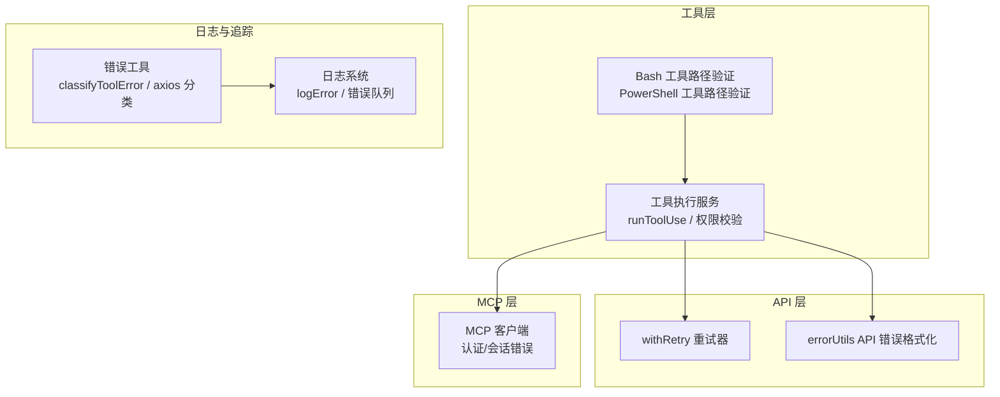
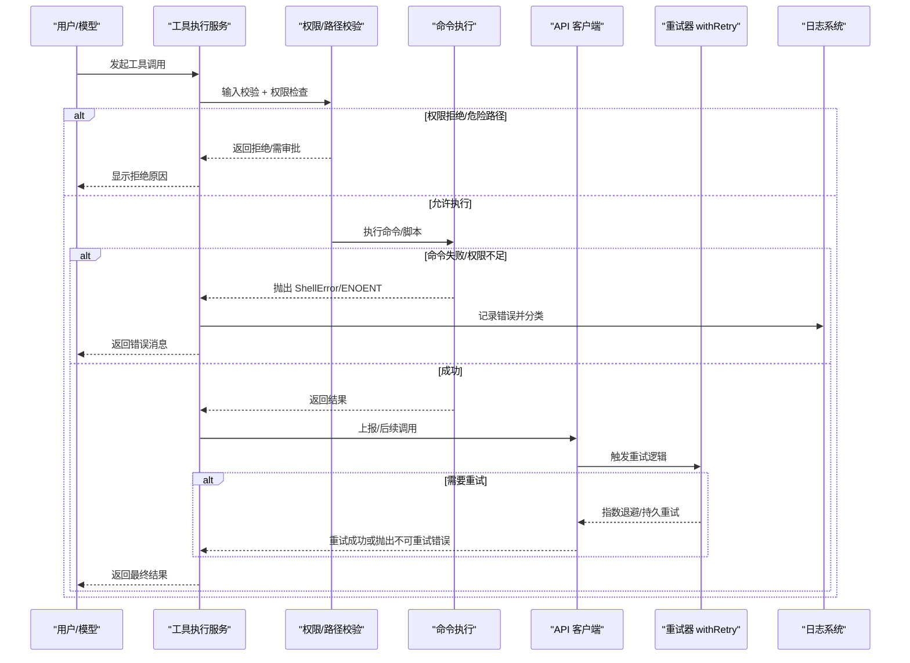
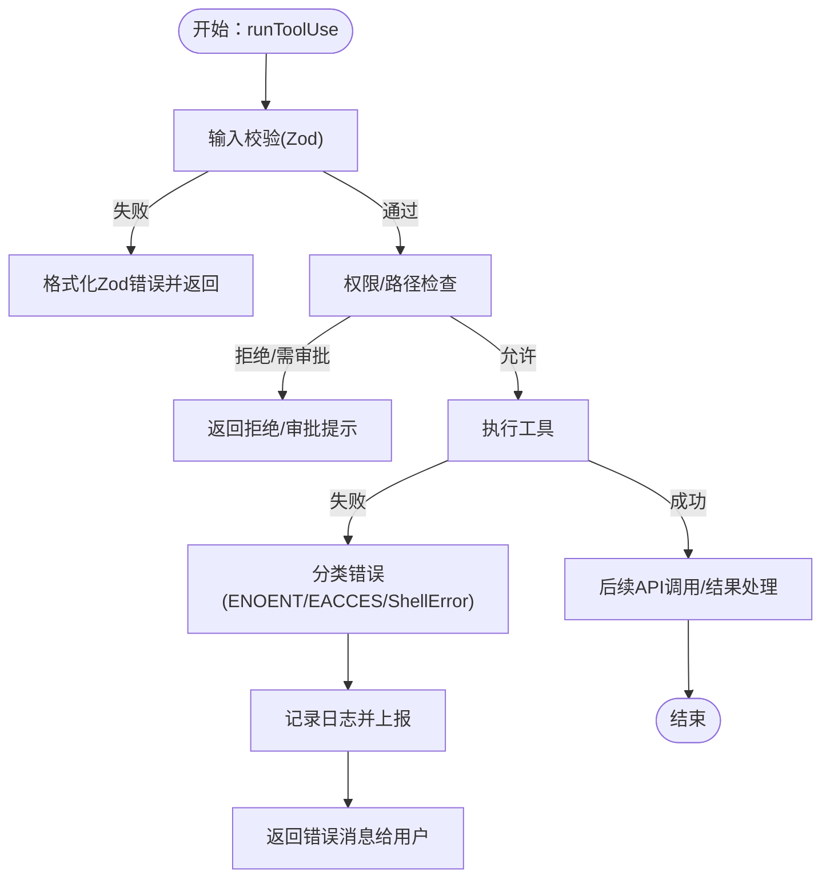
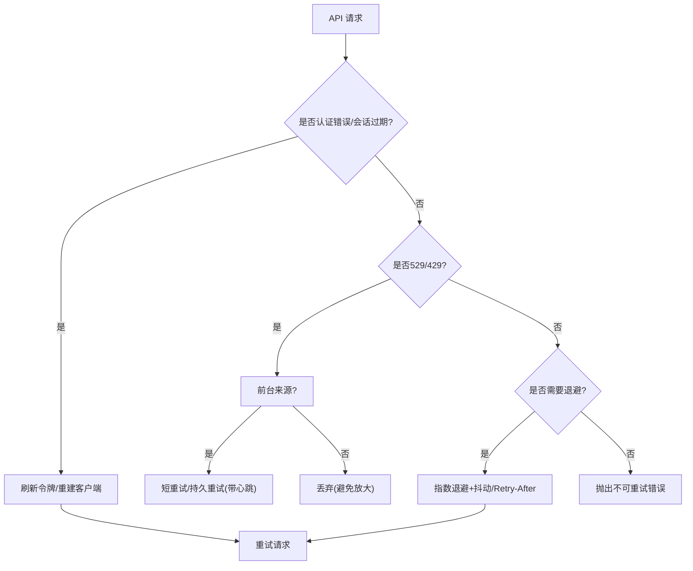
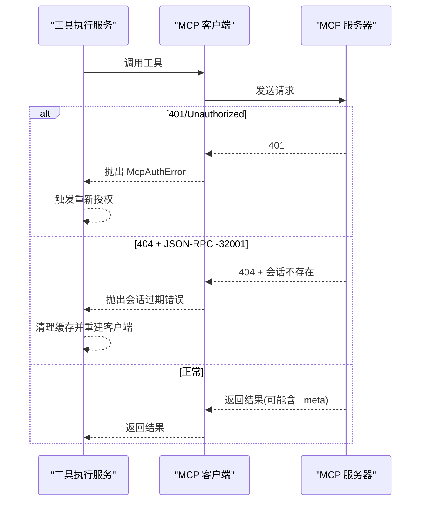
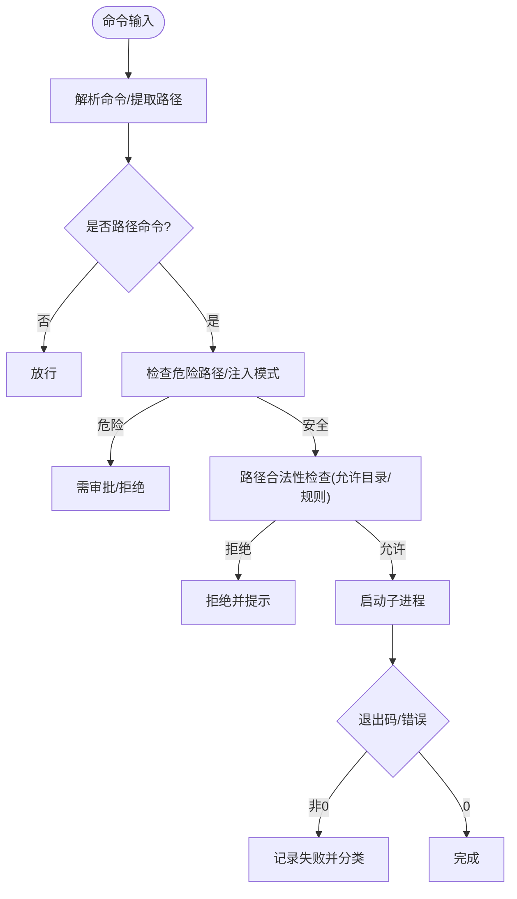
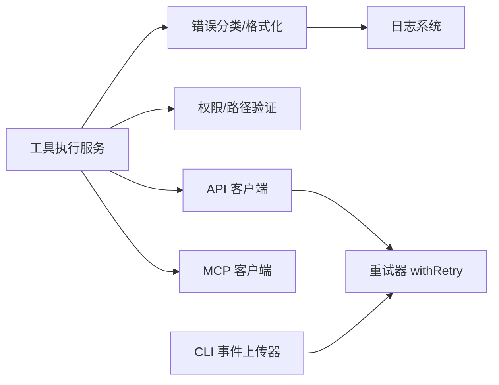

# 运行时错误诊断

<cite>
**本文引用的文件**
- [errorIds.ts](file://src/constants/errorIds.ts)
- [errors.ts](file://src/utils/errors.ts)
- [toolErrors.ts](file://src/utils/toolErrors.ts)
- [toolExecution.ts](file://src/services/tools/toolExecution.ts)
- [errorUtils.ts](file://src/services/api/errorUtils.ts)
- [withRetry.ts](file://src/services/api/withRetry.ts)
- [client.ts](file://src/services/mcp/client.ts)
- [pathValidation.ts（Bash）](file://src/tools/BashTool/pathValidation.ts)
- [pathValidation.ts（PowerShell）](file://src/tools/PowerShellTool/pathValidation.ts)
- [log.ts](file://src/utils/log.ts)
- [errorLogSink.ts](file://src/utils/errorLogSink.ts)
- [sessionRunner.ts](file://src/bridge/sessionRunner.ts)
- [SerialBatchEventUploader.ts](file://src/cli/transports/SerialBatchEventUploader.ts)
</cite>

## 目录
1. [简介](#简介)
2. [项目结构](#项目结构)
3. [核心组件](#核心组件)
4. [架构总览](#架构总览)
5. [详细组件分析](#详细组件分析)
6. [依赖关系分析](#依赖关系分析)
7. [性能考量](#性能考量)
8. [故障排查指南](#故障排查指南)
9. [结论](#结论)
10. [附录：错误代码对照与恢复策略](#附录错误代码对照与恢复策略)

## 简介
本指南面向 Claude Code 的运行时错误诊断与修复，覆盖命令执行失败、工具调用错误、API 调用错误三类场景。文档从错误分类、定位方法、处理流程到恢复策略与重试机制进行系统化梳理，并提供可操作的排障步骤与最佳实践。

## 项目结构
围绕“错误分类—错误捕获—错误上报—错误恢复”的主线，系统在以下模块中协同工作：
- 工具层：输入校验、权限检查、命令执行、结果封装
- API 层：连接错误提取、SSL 错误提示、重试与退避、速率限制处理
- MCP 层：会话过期检测、认证错误、工具调用错误
- 工具执行服务：统一错误分类、日志记录、消息回传
- 日志与追踪：安全消息、错误堆栈截断、内存队列与落盘

图示来源
- [toolExecution.ts:337-490](file://src/services/tools/toolExecution.ts#L337-L490)
- [withRetry.ts:170-517](file://src/services/api/withRetry.ts#L170-L517)
- [errorUtils.ts:200-260](file://src/services/api/errorUtils.ts#L200-L260)
- [client.ts:152-186](file://src/services/mcp/client.ts#L152-L186)
- [errors.ts:150-171](file://src/utils/errors.ts#L150-L171)
- [log.ts:158-203](file://src/utils/log.ts#L158-L203)

章节来源
- [toolExecution.ts:337-490](file://src/services/tools/toolExecution.ts#L337-L490)
- [withRetry.ts:170-517](file://src/services/api/withRetry.ts#L170-L517)
- [errorUtils.ts:200-260](file://src/services/api/errorUtils.ts#L200-L260)
- [client.ts:152-186](file://src/services/mcp/client.ts#L152-L186)
- [errors.ts:150-171](file://src/utils/errors.ts#L150-L171)
- [log.ts:158-203](file://src/utils/log.ts#L158-L203)

## 核心组件
- 错误分类与安全消息
  - 工具执行错误分类：根据错误类型、errno 代码、稳定名称进行分类，避免混淆与泄露敏感信息。
  - axios 错误分类：统一归类为认证、超时、网络、HTTP、其他，便于一致处理。
  - TelemetrySafeError：确保遥测消息不含敏感内容。
- 工具执行与权限
  - 输入校验：Zod Schema 校验失败时生成人类可读的提示。
  - 权限检查：Bash/PowerShell 路径命令白名单、危险路径阻断、AST 参数解析规避注入。
  - 进度与消息：进度事件、取消消息、停止钩子摘要。
- API 重试与退避
  - 529/429 持久重试模式、指数退避+抖动、Retry-After 头、速率限制重置时间。
  - 快速模式降级与冷却、最大令牌溢出自动调整。
- MCP 工具调用
  - 认证错误（401）转为 McpAuthError；会话过期检测；工具调用错误携带 _meta。
- 日志与上报
  - 统一日志入口、内存队列、错误队列、禁用上报环境变量控制。

章节来源
- [toolErrors.ts:66-132](file://src/utils/toolErrors.ts#L66-L132)
- [errors.ts:150-171](file://src/utils/errors.ts#L150-L171)
- [errors.ts:213-238](file://src/utils/errors.ts#L213-L238)
- [toolExecution.ts:337-490](file://src/services/tools/toolExecution.ts#L337-L490)
- [pathValidation.ts（Bash）:834-1109](file://src/tools/BashTool/pathValidation.ts#L834-L1109)
- [pathValidation.ts（PowerShell）:848-883](file://src/tools/PowerShellTool/pathValidation.ts#L848-L883)
- [withRetry.ts:170-517](file://src/services/api/withRetry.ts#L170-L517)
- [client.ts:152-186](file://src/services/mcp/client.ts#L152-L186)
- [log.ts:158-203](file://src/utils/log.ts#L158-L203)

## 架构总览
下图展示一次工具调用的典型错误路径与恢复策略：

图示来源
- [toolExecution.ts:337-490](file://src/services/tools/toolExecution.ts#L337-L490)
- [pathValidation.ts（Bash）:834-1109](file://src/tools/BashTool/pathValidation.ts#L834-L1109)
- [withRetry.ts:170-517](file://src/services/api/withRetry.ts#L170-L517)
- [errors.ts:150-171](file://src/utils/errors.ts#L150-L171)

## 详细组件分析

### 组件一：工具执行与错误分类
- 输入校验失败：使用 Zod 格式化错误，输出缺失参数、意外参数、类型不匹配等人类可读信息。
- 权限与路径检查：对 Bash/PowerShell 路径命令进行白名单、危险路径阻断、AST 参数解析，避免注入与越权。
- 错误分类：优先使用 errno 代码（如 ENOENT/EACCES），其次使用稳定错误名，最后回退为通用错误标识。
- 取消与中断：统一 Abort/SDK 中断消息，保证 UI 一致性。

图示来源
- [toolExecution.ts:337-490](file://src/services/tools/toolExecution.ts#L337-L490)
- [toolErrors.ts:66-132](file://src/utils/toolErrors.ts#L66-L132)
- [errors.ts:150-171](file://src/utils/errors.ts#L150-L171)

章节来源
- [toolExecution.ts:337-490](file://src/services/tools/toolExecution.ts#L337-L490)
- [toolErrors.ts:66-132](file://src/utils/toolErrors.ts#L66-L132)
- [errors.ts:150-171](file://src/utils/errors.ts#L150-L171)

### 组件二：API 调用错误与重试机制
- 连接错误提取：遍历 cause 链，提取根因代码（含 SSL 错误码集合）。
- SSL 错误提示：针对证书链、过期、吊销、主机名不匹配等给出明确建议。
- 重试策略：
  - 529/429：前台来源可重试，后台来源直接放弃；持久重试模式无限等待并周期性心跳。
  - Retry-After 头与速率限制重置时间；指数退避+抖动；最大上限与重置上限。
  - 快速模式降级与冷却；最大令牌溢出自动调整。
- 云平台认证错误：AWS/GCP 凭据错误清理缓存后重试。

图示来源
- [withRetry.ts:170-517](file://src/services/api/withRetry.ts#L170-L517)
- [errorUtils.ts:200-260](file://src/services/api/errorUtils.ts#L200-L260)

章节来源
- [withRetry.ts:170-517](file://src/services/api/withRetry.ts#L170-L517)
- [errorUtils.ts:200-260](file://src/services/api/errorUtils.ts#L200-L260)

### 组件三：MCP 工具调用错误
- 认证错误：401 Unauthorized 或 SDK UnauthorizedError 转为 McpAuthError，触发重新授权。
- 会话过期：HTTP 404 + JSON-RPC -32001 判定为会话过期，要求重建客户端。
- 工具调用错误：携带 _meta 的 McpToolCallError，保留元数据用于消费。

图示来源
- [client.ts:152-186](file://src/services/mcp/client.ts#L152-L186)
- [client.ts:3194-3208](file://src/services/mcp/client.ts#L3194-L3208)

章节来源
- [client.ts:152-186](file://src/services/mcp/client.ts#L152-L186)
- [client.ts:3194-3208](file://src/services/mcp/client.ts#L3194-L3208)

### 组件四：命令执行失败与路径/权限问题
- Bash/PowerShell 路径命令白名单与危险路径阻断，避免 rm -rf / 等灾难性删除。
- AST 参数解析绕过 shell-quote 单引号反斜杠缺陷，确保路径验证不被跳过。
- 进程启动失败：通过子进程错误事件与退出码判断失败原因，结合日志定位。

图示来源
- [pathValidation.ts（Bash）:834-1109](file://src/tools/BashTool/pathValidation.ts#L834-L1109)
- [pathValidation.ts（PowerShell）:848-883](file://src/tools/PowerShellTool/pathValidation.ts#L848-L883)
- [sessionRunner.ts:456-480](file://src/bridge/sessionRunner.ts#L456-L480)

章节来源
- [pathValidation.ts（Bash）:834-1109](file://src/tools/BashTool/pathValidation.ts#L834-L1109)
- [pathValidation.ts（PowerShell）:848-883](file://src/tools/PowerShellTool/pathValidation.ts#L848-L883)
- [sessionRunner.ts:456-480](file://src/bridge/sessionRunner.ts#L456-L480)

## 依赖关系分析
- 工具执行服务依赖：
  - 错误分类与工具错误格式化（避免泄露敏感信息）
  - 权限与路径验证（Bash/PowerShell）
  - API 重试器（对外部服务调用）
  - MCP 客户端（MCP 工具）
- 日志系统：
  - 统一入口 logError，支持内存队列与落盘，支持禁用上报环境变量。
- 传输层：
  - CLI 事件上传器采用指数退避+抖动，遵循 Retry-After。

图示来源
- [toolExecution.ts:337-490](file://src/services/tools/toolExecution.ts#L337-L490)
- [errors.ts:150-171](file://src/utils/errors.ts#L150-L171)
- [toolErrors.ts:66-132](file://src/utils/toolErrors.ts#L66-L132)
- [withRetry.ts:170-517](file://src/services/api/withRetry.ts#L170-L517)
- [SerialBatchEventUploader.ts:235-275](file://src/cli/transports/SerialBatchEventUploader.ts#L235-L275)

章节来源
- [toolExecution.ts:337-490](file://src/services/tools/toolExecution.ts#L337-L490)
- [errors.ts:150-171](file://src/utils/errors.ts#L150-L171)
- [toolErrors.ts:66-132](file://src/utils/toolErrors.ts#L66-L132)
- [withRetry.ts:170-517](file://src/services/api/withRetry.ts#L170-L517)
- [SerialBatchEventUploader.ts:235-275](file://src/cli/transports/SerialBatchEventUploader.ts#L235-L275)

## 性能考量
- 重试退避：指数退避+抖动，避免风暴；持久重试模式分片睡眠并周期性心跳，防止会话空闲。
- 最大令牌溢出自动调整：在上下文窗口超限时动态降低输出预算，减少无效重试。
- 日志截断：错误堆栈仅保留前 N 帧，避免上下文浪费。

## 故障排查指南
- 命令执行失败
  - 检查权限：ENOENT/EACCES/EPERM/ENOTDIR/ELOOP 表示路径/权限问题，优先修正路径或提权。
  - 检查危险路径：rm -rf / 等会被阻断，改为受控路径或交互审批。
  - 检查注入风险：AST 解析失败或路径为空时，确认命令字符串与引号处理。
- 工具调用错误
  - 输入校验失败：根据 Zod 提示补齐缺失字段、修正类型或移除意外参数。
  - 权限拒绝：查看 deny/ask 规则，必要时创建读取/编辑规则或临时批准。
  - Shell 执行失败：关注 stdout/stderr 与退出码，结合日志定位具体命令。
- API 调用错误
  - 认证失败：401/403，刷新令牌或检查凭据；企业环境注意代理/证书问题。
  - 超时/网络中断：检查代理、防火墙、DNS；关注 SSL 证书链与主机名不匹配。
  - 速率限制：529/429，前台来源可等待/持久重试；后台来源直接放弃以避免放大。
- MCP 工具错误
  - 401：触发重新授权；检查 OAuth 流程与令牌有效期。
  - 会话过期：404 + JSON-RPC -32001，重建客户端并重试。
  - 工具错误：保留 _meta 的 McpToolCallError，用于调试与回溯。

章节来源
- [errors.ts:173-195](file://src/utils/errors.ts#L173-L195)
- [toolErrors.ts:66-132](file://src/utils/toolErrors.ts#L66-L132)
- [pathValidation.ts（Bash）:834-1109](file://src/tools/BashTool/pathValidation.ts#L834-L1109)
- [errorUtils.ts:200-260](file://src/services/api/errorUtils.ts#L200-L260)
- [withRetry.ts:170-517](file://src/services/api/withRetry.ts#L170-L517)
- [client.ts:152-186](file://src/services/mcp/client.ts#L152-L186)

## 结论
本指南提供了从工具执行、API 调用到 MCP 工具的全链路错误诊断与恢复方案。通过统一的错误分类、严格的权限与路径验证、稳健的重试与退避策略，以及完善的日志与上报机制，能够有效提升系统的稳定性与可观测性。建议在生产环境中启用持久重试模式与 SSL 错误提示，并配合规则与审批流程降低风险。

## 附录：错误代码对照与恢复策略

- 文件系统错误（常见 errno）
  - ENOENT：路径不存在。恢复：确认路径拼接、符号链接、工作目录。
  - EACCES/EPERM：权限不足。恢复：提权、修改 ACL、检查只读挂载。
  - ENOTDIR：路径组件不是目录。恢复：修正路径层级或文件夹名。
  - ELOOP：符号链接过多。恢复：检查循环链接并清理。
- API 错误
  - 401/403：认证失败。恢复：刷新令牌、检查密钥、代理/证书。
  - 408：请求超时。恢复：增加超时、检查网络、重试。
  - 409：锁冲突。恢复：重试或等待资源释放。
  - 429/529：速率限制/过载。恢复：指数退避、持久重试、前台来源等待。
  - 5xx：服务器内部错误。恢复：重试（尊重 x-should-retry）。
- SSL/TLS 错误
  - UNABLE_TO_VERIFY_LEAF_SIGNATURE/CERT_*：证书问题。恢复：配置 CA 证书、允许域名、检查中间证书。
  - HOSTNAME_MISMATCH：主机名不匹配。恢复：检查 SAN 与证书域名。
- MCP 错误
  - 401：重新授权。恢复：触发 McpAuthTool。
  - 404 + JSON-RPC -32001：会话过期。恢复：重建客户端并重试。
  - 工具错误：保留 _meta，用于调试与回溯。

- 错误 ID（示例）
  - E_TOOL_USE_SUMMARY_GENERATION_FAILED：工具使用摘要生成失败。恢复：检查工具实现与上下文。

章节来源
- [errors.ts:173-195](file://src/utils/errors.ts#L173-L195)
- [errorUtils.ts:200-260](file://src/services/api/errorUtils.ts#L200-L260)
- [withRetry.ts:170-517](file://src/services/api/withRetry.ts#L170-L517)
- [client.ts:152-186](file://src/services/mcp/client.ts#L152-L186)
- [errorIds.ts:1-16](file://src/constants/errorIds.ts#L1-L16)