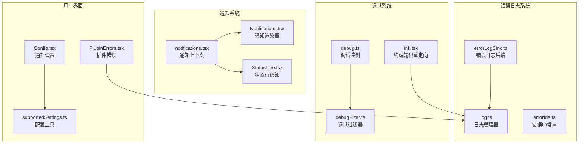
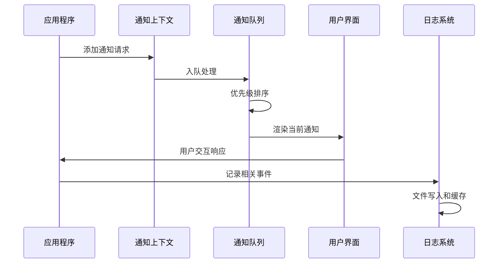
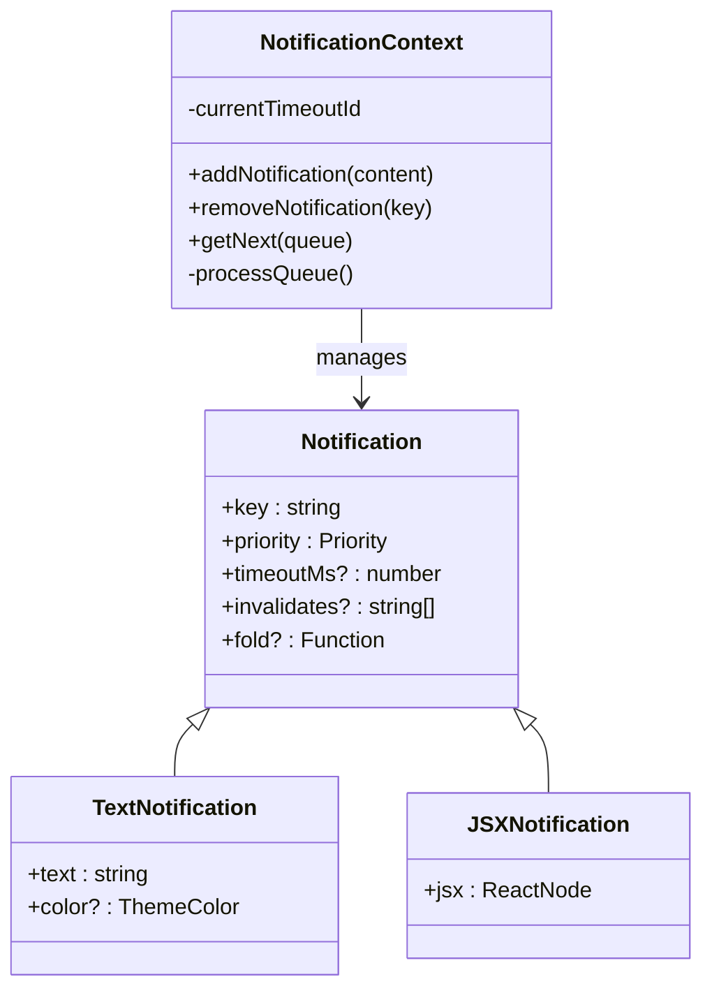
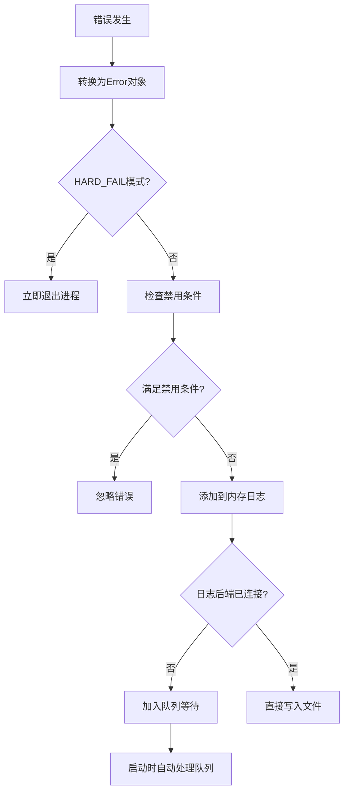
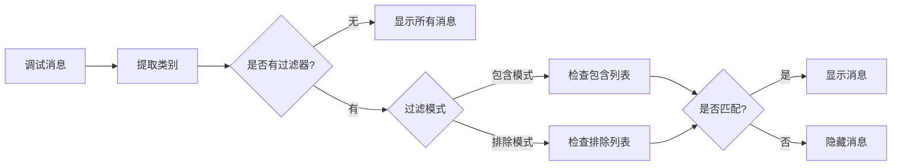
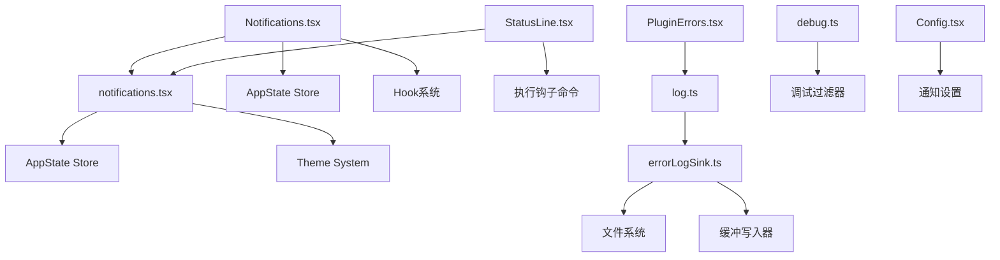

# 通知和错误提示

<cite>
**本文档引用的文件**
- [src/context/notifications.tsx](file://src/context/notifications.tsx)
- [src/components/PromptInput/Notifications.tsx](file://src/components/PromptInput/Notifications.tsx)
- [src/components/StatusLine.tsx](file://src/components/StatusLine.tsx)
- [src/utils/errorLogSink.ts](file://src/utils/errorLogSink.ts)
- [src/utils/log.ts](file://src/utils/log.ts)
- [src/constants/errorIds.ts](file://src/constants/errorIds.ts)
- [src/ink/ink.tsx](file://src/ink/ink.tsx)
- [src/utils/debugFilter.ts](file://src/utils/debugFilter.ts)
- [src/utils/debug.ts](file://src/utils/debug.ts)
- [src/components/Settings/Config.tsx](file://src/components/Settings/Config.tsx)
- [src/tools/ConfigTool/supportedSettings.ts](file://src/tools/ConfigTool/supportedSettings.ts)
- [src/commands/plugin/PluginErrors.tsx](file://src/commands/plugin/PluginErrors.tsx)
- [src/commands/plugin/ManagePlugins.tsx](file://src/commands/plugin/ManagePlugins.tsx)
</cite>

## 目录
1. [简介](#简介)
2. [项目结构](#项目结构)
3. [核心组件](#核心组件)
4. [架构概览](#架构概览)
5. [详细组件分析](#详细组件分析)
6. [依赖关系分析](#依赖关系分析)
7. [性能考虑](#性能考虑)
8. [故障排除指南](#故障排除指南)
9. [结论](#结论)

## 简介

Claude Code 的通知系统是一个完整的错误处理和用户反馈机制，涵盖了从底层错误日志到用户界面提示的全栈解决方案。该系统支持多种通知类型、优先级管理、错误 ID 跟踪以及灵活的通知配置选项。

系统主要包含三个核心层面：
- **错误日志系统**：负责捕获和记录应用程序中的错误信息
- **通知队列系统**：管理不同类型的通知显示和优先级
- **用户界面集成**：在终端界面中展示各种状态信息和错误提示

## 项目结构

通知和错误处理系统分布在以下关键模块中：

**图表来源**
- [src/context/notifications.tsx:1-240](file://src/context/notifications.tsx#L1-L240)
- [src/utils/errorLogSink.ts:1-236](file://src/utils/errorLogSink.ts#L1-L236)
- [src/utils/log.ts:1-363](file://src/utils/log.ts#L1-L363)

## 核心组件

### 通知上下文系统

通知系统的核心是基于 React Context 的通知管理器，提供了统一的通知添加、移除和队列管理功能。

**通知类型定义**：
- **文本通知**：简单的字符串消息，可指定颜色主题
- **JSX通知**：复杂的 React 组件，支持自定义布局和交互
- **优先级系统**：支持 'low'、'medium'、'high'、'immediate' 四个优先级

**关键特性**：
- 自动折叠重复通知
- 支持通知失效机制
- 智能超时管理
- 嵌套通知处理

### 错误日志系统

错误日志系统采用分层设计，确保错误信息能够被正确捕获、记录和分析。

**日志后端**：
- 文件系统持久化存储
- JSONL 格式标准化
- 缓冲写入优化性能
- 自动目录创建和清理

**错误追踪**：
- 错误 ID 系统用于生产环境追踪
- 支持 MCP 服务器特定错误记录
- 内存中最近错误缓存
- 异步错误队列处理

### 调试过滤系统

提供灵活的调试消息过滤机制，支持多种过滤模式：

**过滤模式**：
- 包含模式（默认）：仅显示匹配类别的消息
- 排除模式：隐藏匹配类别的消息
- 混合模式：自动降级为无过滤

**类别提取规则**：
- MCP 服务器名称识别
- 前缀标签匹配
- 方括号标签解析
- 多级类别提取

**章节来源**
- [src/context/notifications.tsx:1-240](file://src/context/notifications.tsx#L1-L240)
- [src/utils/errorLogSink.ts:1-236](file://src/utils/errorLogSink.ts#L1-L236)
- [src/utils/log.ts:1-363](file://src/utils/log.ts#L1-L363)
- [src/utils/debugFilter.ts:1-157](file://src/utils/debugFilter.ts#L1-L157)

## 架构概览

通知系统的整体架构采用分层设计，确保各组件职责清晰且松耦合：

**图表来源**
- [src/context/notifications.tsx:46-192](file://src/context/notifications.tsx#L46-L192)
- [src/utils/log.ts:158-199](file://src/utils/log.ts#L158-L199)

系统的关键流程包括：

1. **通知创建**：通过 `useNotifications()` Hook 创建和管理通知
2. **队列处理**：智能排序和去重处理
3. **超时管理**：自动定时器和手动清除
4. **错误记录**：同步记录相关调试信息
5. **界面更新**：实时反映通知状态变化

## 详细组件分析

### 通知上下文组件

通知上下文组件是整个通知系统的核心，提供了完整的通知生命周期管理。

**图表来源**
- [src/context/notifications.tsx:5-34](file://src/context/notifications.tsx#L5-L34)

**关键实现细节**：
- **优先级处理**：使用数字映射确保优先级正确排序
- **折叠机制**：支持相同键名的通知合并
- **失效处理**：自动移除被标记失效的通知
- **超时管理**：智能定时器管理和清理

### 错误日志后端

错误日志后端提供了强大的错误捕获和持久化能力：

**图表来源**
- [src/utils/log.ts:158-199](file://src/utils/log.ts#L158-L199)
- [src/utils/errorLogSink.ts:225-235](file://src/utils/errorLogSink.ts#L225-L235)

**错误处理流程**：
- **环境检测**：检查云提供商和隐私设置
- **内存缓存**：维护最近100条错误记录
- **异步处理**：队列机制避免阻塞主线程
- **文件持久化**：JSONL格式确保数据完整性

### 调试过滤系统

调试过滤系统提供了灵活的消息分类和过滤能力：

**图表来源**
- [src/utils/debugFilter.ts:116-139](file://src/utils/debugFilter.ts#L116-L139)

**类别提取算法**：
- **MCP服务器识别**：优先匹配 MCP 服务器模式
- **前缀标签处理**：支持冒号分隔的简单前缀
- **方括号标签解析**：处理带方括号的标签格式
- **多级类别扩展**：从消息内容提取额外类别

**章节来源**
- [src/context/notifications.tsx:1-240](file://src/context/notifications.tsx#L1-L240)
- [src/utils/errorLogSink.ts:1-236](file://src/utils/errorLogSink.ts#L1-L236)
- [src/utils/log.ts:1-363](file://src/utils/log.ts#L1-L363)
- [src/utils/debugFilter.ts:1-157](file://src/utils/debugFilter.ts#L1-L157)

## 依赖关系分析

通知系统各组件之间的依赖关系如下：

**图表来源**
- [src/context/notifications.tsx:1-240](file://src/context/notifications.tsx#L1-L240)
- [src/utils/errorLogSink.ts:1-236](file://src/utils/errorLogSink.ts#L1-L236)
- [src/utils/log.ts:1-363](file://src/utils/log.ts#L1-L363)

**依赖特点**：
- **低耦合设计**：各组件通过接口通信，减少直接依赖
- **单向数据流**：状态变更通过 AppState Store 单向传播
- **延迟初始化**：日志后端支持运行时初始化
- **功能门控**：通过 feature() 控制条件编译

**章节来源**
- [src/context/notifications.tsx:1-240](file://src/context/notifications.tsx#L1-L240)
- [src/utils/errorLogSink.ts:1-236](file://src/utils/errorLogSink.ts#L1-L236)
- [src/utils/log.ts:1-363](file://src/utils/log.ts#L1-L363)

## 性能考虑

通知系统在设计时充分考虑了性能影响：

### 内存管理
- **通知队列限制**：避免无限增长的通知队列
- **超时清理**：自动清理过期通知，释放内存
- **引用比较**：使用键值比较而非深度比较

### I/O 优化
- **批量写入**：缓冲写入减少磁盘 I/O 次数
- **异步处理**：非阻塞的日志写入操作
- **文件复用**：同一会话内复用日志文件句柄

### 渲染优化
- **记忆化函数**：使用 memoize 减少不必要的重新计算
- **稳定引用**：保持回调函数引用稳定性
- **条件渲染**：只在必要时更新界面

## 故障排除指南

### 常见问题诊断

**通知不显示问题**：
1. 检查通知优先级设置
2. 验证通知键值唯一性
3. 确认超时时间配置
4. 查看控制台是否有错误日志

**错误日志缺失问题**：
1. 确认日志后端已正确初始化
2. 检查环境变量配置
3. 验证文件权限设置
4. 查看队列是否已满

**调试信息过滤问题**：
1. 检查调试过滤器语法
2. 验证类别名称大小写
3. 确认包含/排除模式设置
4. 测试基本过滤规则

### 错误 ID 系统使用

错误 ID 系统为生产环境提供了精确的问题追踪能力：

**错误 ID 类型**：
- **工具使用错误**：工具执行失败的具体原因
- **网络连接错误**：API 请求或连接问题
- **配置验证错误**：用户配置无效的情况
- **系统资源错误**：内存不足或磁盘空间问题

**使用方法**：
1. 在错误发生时记录对应的错误 ID
2. 通过错误 ID 快速定位问题代码位置
3. 结合日志文件进行深入分析
4. 在问题报告中包含错误 ID

### 用户界面通知配置

用户可以通过多种方式配置通知行为：

**通知级别设置**：
- **静默模式**：仅显示严重错误
- **标准模式**：显示重要信息和警告
- **详细模式**：显示所有通知和调试信息

**通知渠道配置**：
- **终端显示**：在命令行界面显示通知
- **桌面推送**：通过操作系统发送桌面通知
- **邮件通知**：通过邮件发送重要提醒
- **移动推送**：通过移动应用推送通知

**章节来源**
- [src/commands/plugin/PluginErrors.tsx:23-123](file://src/commands/plugin/PluginErrors.tsx#L23-L123)
- [src/commands/plugin/ManagePlugins.tsx:1818-1846](file://src/commands/plugin/ManagePlugins.tsx#L1818-L1846)
- [src/components/Settings/Config.tsx:666-1697](file://src/components/Settings/Config.tsx#L666-L1697)
- [src/tools/ConfigTool/supportedSettings.ts:161-211](file://src/tools/ConfigTool/supportedSettings.ts#L161-L211)

## 结论

Claude Code 的通知和错误提示系统展现了现代应用程序在用户体验和开发者工具方面的最佳实践。系统通过分层架构实现了功能的模块化和可扩展性，同时通过智能的错误处理和通知管理确保了良好的用户体验。

**主要优势**：
- **完整的错误追踪**：从用户界面到后台日志的全链路错误记录
- **灵活的通知管理**：支持多种通知类型和优先级处理
- **强大的调试能力**：提供细粒度的调试信息过滤和分析
- **用户友好的配置**：允许用户根据需求调整通知级别和显示方式

**未来改进方向**：
- 扩展通知渠道支持更多平台
- 增强错误预测和预防机制
- 优化性能监控和告警系统
- 提供更丰富的通知模板和样式

这个系统为开发者提供了一个可靠的错误处理框架，同时也为最终用户提供了透明和及时的反馈机制，是构建高质量开发工具的重要基础设施。