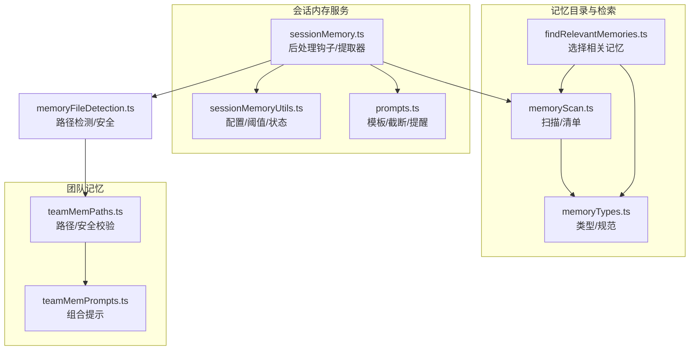
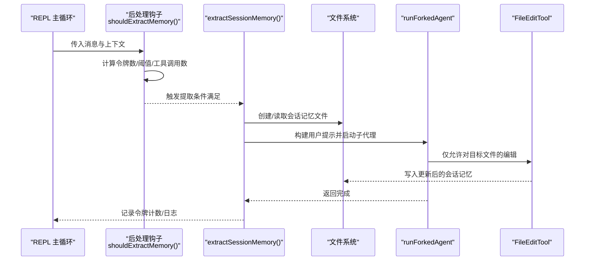
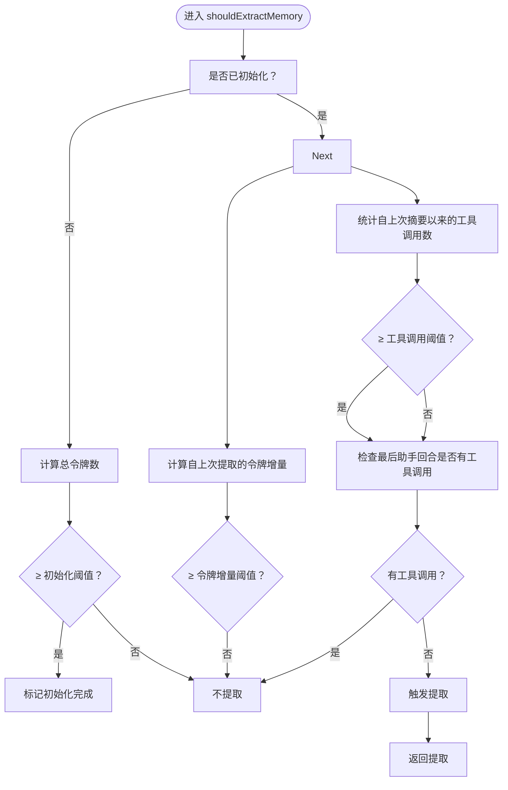
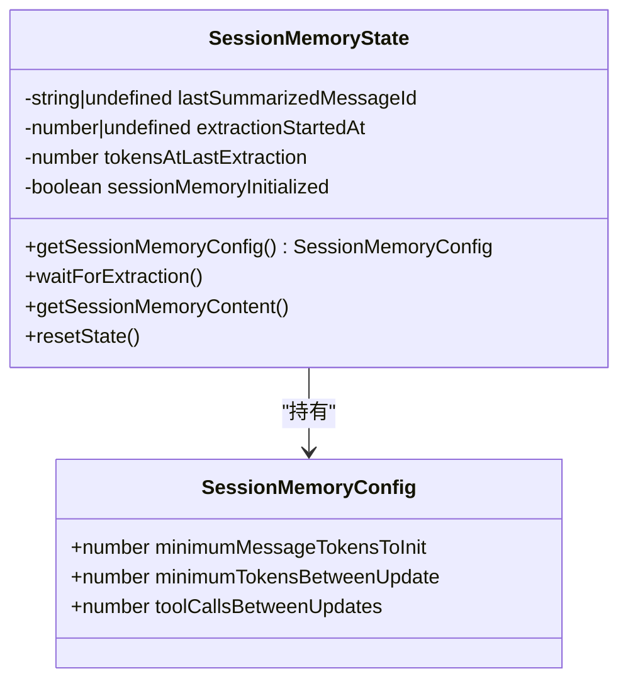
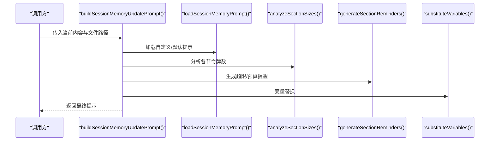
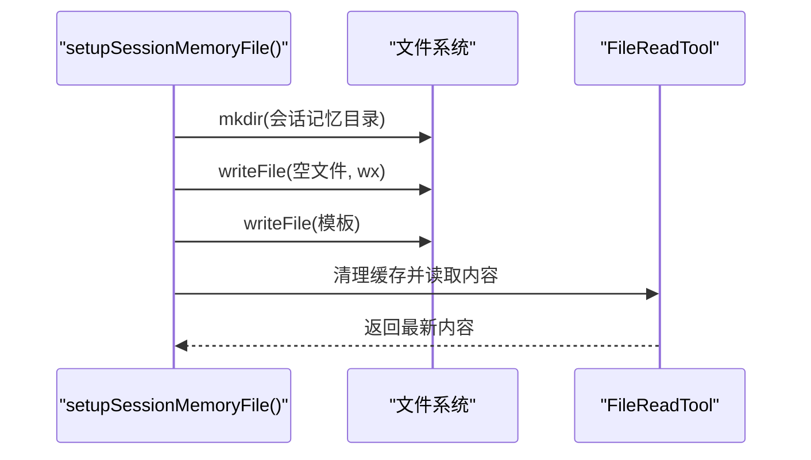
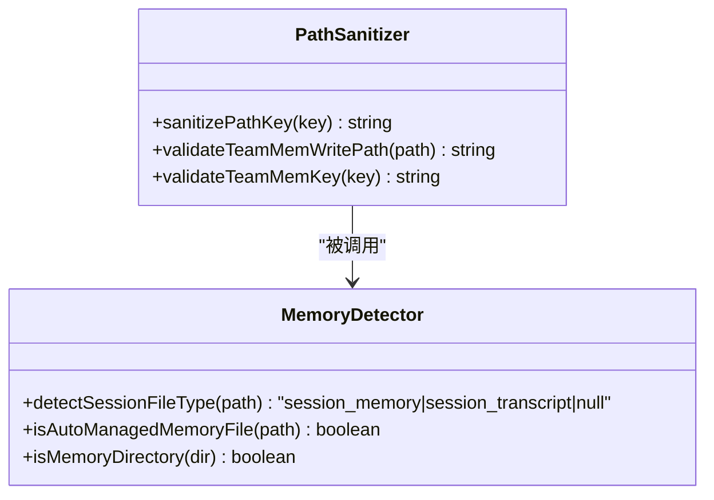
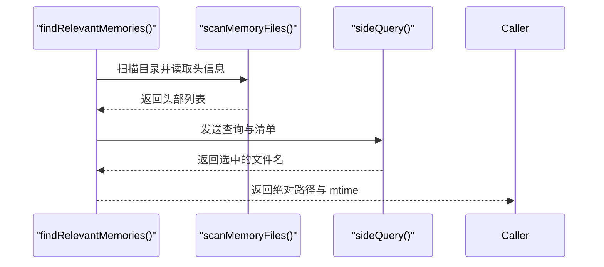
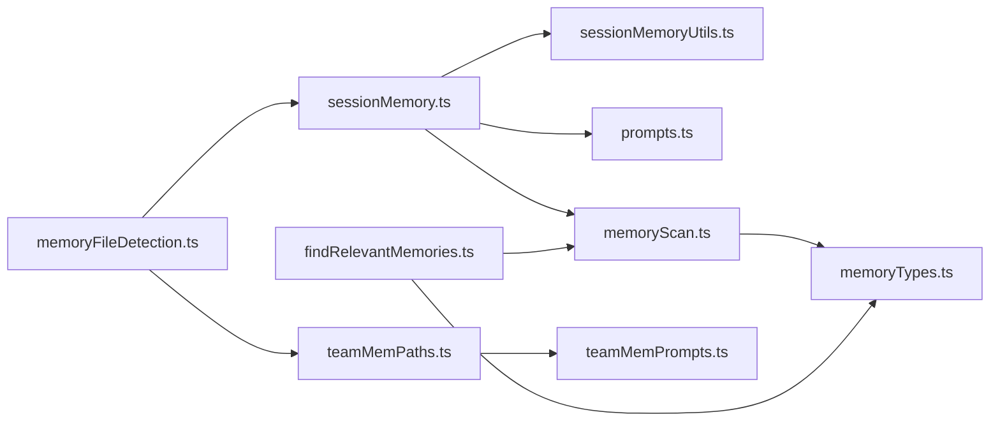

# 会话内存

<cite>
**本文引用的文件**
- [src/services/SessionMemory/sessionMemory.ts](file://src/services/SessionMemory/sessionMemory.ts)
- [src/services/SessionMemory/sessionMemoryUtils.ts](file://src/services/SessionMemory/sessionMemoryUtils.ts)
- [src/services/SessionMemory/prompts.ts](file://src/services/SessionMemory/prompts.ts)
- [src/memdir/memoryTypes.ts](file://src/memdir/memoryTypes.ts)
- [src/memdir/memoryScan.ts](file://src/memdir/memoryScan.ts)
- [src/memdir/findRelevantMemories.ts](file://src/memdir/findRelevantMemories.ts)
- [src/memdir/teamMemPaths.ts](file://src/memdir/teamMemPaths.ts)
- [src/memdir/teamMemPrompts.ts](file://src/memdir/teamMemPrompts.ts)
- [src/utils/memoryFileDetection.ts](file://src/utils/memoryFileDetection.ts)
</cite>

## 目录
1. [简介](#简介)
2. [项目结构](#项目结构)
3. [核心组件](#核心组件)
4. [架构总览](#架构总览)
5. [详细组件分析](#详细组件分析)
6. [依赖关系分析](#依赖关系分析)
7. [性能考量](#性能考量)
8. [故障排查指南](#故障排查指南)
9. [结论](#结论)
10. [附录：提示工程与最佳实践](#附录提示工程与最佳实践)

## 简介
本文件系统性阐述“会话内存”子系统的设计与实现，包括其核心数据结构、存储机制、访问模式、生命周期管理、缓存策略、持久化流程、工具函数、提示工程策略、性能优化、容量管理与故障恢复，并提供可操作的最佳实践与排障建议。会话内存通过在对话过程中自动抽取关键信息到一个结构化的 Markdown 文件中，为后续对话提供上下文增强与压缩配合（autocompact）提供基础。

## 项目结构
会话内存相关代码主要位于以下模块：
- 会话内存主流程与钩子注册：src/services/SessionMemory/sessionMemory.ts
- 配置、阈值与状态管理：src/services/SessionMemory/sessionMemoryUtils.ts
- 提示模板与内容截断：src/services/SessionMemory/prompts.ts
- 记忆类型与检索扫描：src/memdir/memoryTypes.ts、src/memdir/memoryScan.ts、src/memdir/findRelevantMemories.ts
- 团队记忆路径与提示：src/memdir/teamMemPaths.ts、src/memdir/teamMemPrompts.ts
- 路径检测与安全校验：src/utils/memoryFileDetection.ts

图表来源
- [src/services/SessionMemory/sessionMemory.ts:1-496](file://src/services/SessionMemory/sessionMemory.ts#L1-L496)
- [src/services/SessionMemory/sessionMemoryUtils.ts:1-208](file://src/services/SessionMemory/sessionMemoryUtils.ts#L1-L208)
- [src/services/SessionMemory/prompts.ts:1-325](file://src/services/SessionMemory/prompts.ts#L1-L325)
- [src/memdir/memoryTypes.ts:1-272](file://src/memdir/memoryTypes.ts#L1-L272)
- [src/memdir/memoryScan.ts:1-95](file://src/memdir/memoryScan.ts#L1-L95)
- [src/memdir/findRelevantMemories.ts:1-142](file://src/memdir/findRelevantMemories.ts#L1-L142)
- [src/memdir/teamMemPaths.ts:1-293](file://src/memdir/teamMemPaths.ts#L1-L293)
- [src/memdir/teamMemPrompts.ts:1-101](file://src/memdir/teamMemPrompts.ts#L1-L101)
- [src/utils/memoryFileDetection.ts:1-290](file://src/utils/memoryFileDetection.ts#L1-L290)

章节来源
- [src/services/SessionMemory/sessionMemory.ts:1-496](file://src/services/SessionMemory/sessionMemory.ts#L1-L496)
- [src/services/SessionMemory/sessionMemoryUtils.ts:1-208](file://src/services/SessionMemory/sessionMemoryUtils.ts#L1-L208)
- [src/services/SessionMemory/prompts.ts:1-325](file://src/services/SessionMemory/prompts.ts#L1-L325)
- [src/memdir/memoryTypes.ts:1-272](file://src/memdir/memoryTypes.ts#L1-L272)
- [src/memdir/memoryScan.ts:1-95](file://src/memdir/memoryScan.ts#L1-L95)
- [src/memdir/findRelevantMemories.ts:1-142](file://src/memdir/findRelevantMemories.ts#L1-L142)
- [src/memdir/teamMemPaths.ts:1-293](file://src/memdir/teamMemPaths.ts#L1-L293)
- [src/memdir/teamMemPrompts.ts:1-101](file://src/memdir/teamMemPrompts.ts#L1-L101)
- [src/utils/memoryFileDetection.ts:1-290](file://src/utils/memoryFileDetection.ts#L1-L290)

## 核心组件
- 后处理钩子与提取器：在每次采样后根据阈值触发会话记忆更新，使用子代理隔离执行，避免污染主状态。
- 配置与阈值：最小初始化令牌数、两次更新最小令牌增量、工具调用间隔等，均采用非阻塞缓存配置加载。
- 模板与提示：支持自定义模板与更新提示，内置节大小分析与超限提醒，以及针对压缩注入场景的截断逻辑。
- 存储与持久化：会话记忆文件按需创建与初始化，仅允许对特定文件进行编辑；读取时绕过缓存以确保一致性。
- 安全与路径检测：严格的路径规范化与白名单式检测，防止路径穿越与越权写入；支持团队记忆目录的安全校验。
- 记忆检索：扫描目录头信息，结合模型选择最相关记忆，用于查询时的上下文注入。

章节来源
- [src/services/SessionMemory/sessionMemory.ts:134-181](file://src/services/SessionMemory/sessionMemory.ts#L134-L181)
- [src/services/SessionMemory/sessionMemoryUtils.ts:18-36](file://src/services/SessionMemory/sessionMemoryUtils.ts#L18-L36)
- [src/services/SessionMemory/prompts.ts:11-129](file://src/services/SessionMemory/prompts.ts#L11-L129)
- [src/utils/memoryFileDetection.ts:40-94](file://src/utils/memoryFileDetection.ts#L40-L94)

## 架构总览
会话内存以“钩子驱动 + 子代理执行 + 文件系统写入”的方式工作，同时与自动压缩（autocompact）共享令牌计数口径，保证行为一致。

图表来源
- [src/services/SessionMemory/sessionMemory.ts:134-181](file://src/services/SessionMemory/sessionMemory.ts#L134-L181)
- [src/services/SessionMemory/sessionMemory.ts:272-350](file://src/services/SessionMemory/sessionMemory.ts#L272-L350)
- [src/services/SessionMemory/sessionMemory.ts:183-233](file://src/services/SessionMemory/sessionMemory.ts#L183-L233)

## 详细组件分析

### 组件A：会话记忆主流程与钩子
- 功能要点
  - 在 REPL 的后处理钩子中运行，仅在主线程触发，避免子代理/队友干扰。
  - 使用非阻塞缓存门控与动态配置，首次运行时惰性初始化配置。
  - 基于三重阈值判定是否提取：初始化阈值（总上下文窗口）、令牌增量阈值（自上次提取以来的增长）、工具调用次数阈值；且最后助手回合无工具调用时可安全提取。
  - 通过子代理隔离执行，避免父状态污染；仅允许对会话记忆文件的编辑。
  - 成功提取后记录令牌计数，更新最后摘要消息 ID，避免孤儿 tool_results。

- 关键流程图（阈值判定）

图表来源
- [src/services/SessionMemory/sessionMemory.ts:134-181](file://src/services/SessionMemory/sessionMemory.ts#L134-L181)

章节来源
- [src/services/SessionMemory/sessionMemory.ts:272-350](file://src/services/SessionMemory/sessionMemory.ts#L272-L350)
- [src/services/SessionMemory/sessionMemory.ts:108-132](file://src/services/SessionMemory/sessionMemory.ts#L108-L132)
- [src/services/SessionMemory/sessionMemory.ts:488-495](file://src/services/SessionMemory/sessionMemory.ts#L488-L495)

### 组件B：配置、阈值与状态管理
- 数据结构
  - SessionMemoryConfig：最小初始化令牌数、最小令牌增量、工具调用间隔。
  - 全局状态：上次摘要消息 ID、提取开始时间戳、上次提取时的令牌数、是否已初始化。
- 关键能力
  - 惰性初始化远程配置（非阻塞），仅当远程值为正数时覆盖默认值。
  - 提供等待提取完成的阻塞等待（带超时与陈旧阈值保护）。
  - 提供手动提取接口，绕过阈值限制，用于 /summary 等命令。

- 类图（配置与状态）

图表来源
- [src/services/SessionMemory/sessionMemoryUtils.ts:18-36](file://src/services/SessionMemory/sessionMemoryUtils.ts#L18-L36)
- [src/services/SessionMemory/sessionMemoryUtils.ts:38-53](file://src/services/SessionMemory/sessionMemoryUtils.ts#L38-L53)
- [src/services/SessionMemory/sessionMemoryUtils.ts:89-105](file://src/services/SessionMemory/sessionMemoryUtils.ts#L89-L105)

章节来源
- [src/services/SessionMemory/sessionMemoryUtils.ts:18-36](file://src/services/SessionMemory/sessionMemoryUtils.ts#L18-L36)
- [src/services/SessionMemory/sessionMemoryUtils.ts:140-207](file://src/services/SessionMemory/sessionMemoryUtils.ts#L140-L207)

### 组件C：提示工程与内容截断
- 模板与变量替换
  - 支持自定义模板与更新提示，变量替换采用单次正则替换，避免回溯与重复替换问题。
  - 分析各节长度，生成超限提醒；若整体超过预算，给出强制压缩指令。
- 截断策略
  - 按节进行近似令牌截断，保留关键行并在边界处插入截断提示，避免破坏结构。
- 与压缩注入的协同
  - 提供针对压缩注入场景的截断工具，确保不会占用过多预算。

- 序列图（构建更新提示）

图表来源
- [src/services/SessionMemory/prompts.ts:226-247](file://src/services/SessionMemory/prompts.ts#L226-L247)
- [src/services/SessionMemory/prompts.ts:134-196](file://src/services/SessionMemory/prompts.ts#L134-L196)

章节来源
- [src/services/SessionMemory/prompts.ts:11-129](file://src/services/SessionMemory/prompts.ts#L11-L129)
- [src/services/SessionMemory/prompts.ts:226-247](file://src/services/SessionMemory/prompts.ts#L226-L247)
- [src/services/SessionMemory/prompts.ts:256-296](file://src/services/SessionMemory/prompts.ts#L256-L296)

### 组件D：存储与持久化（文件系统）
- 初始化与读取
  - 按需创建目录与文件，首次写入模板；读取时清理缓存条目，确保返回最新内容。
- 编辑权限控制
  - 仅允许对目标文件执行编辑工具，拒绝其他路径或工具调用。
- 日志与事件
  - 记录文件读取、加载、手动提取、提取频率等事件，便于观测与诊断。

- 序列图（设置与读取）

图表来源
- [src/services/SessionMemory/sessionMemory.ts:183-233](file://src/services/SessionMemory/sessionMemory.ts#L183-L233)

章节来源
- [src/services/SessionMemory/sessionMemory.ts:183-233](file://src/services/SessionMemory/sessionMemory.ts#L183-L233)
- [src/services/SessionMemory/sessionMemory.ts:460-482](file://src/services/SessionMemory/sessionMemory.ts#L460-L482)

### 组件E：安全与路径检测
- 路径检测
  - 识别会话记忆与会话转录两类文件类型；支持通配符模式检测。
  - 判断路径是否属于自动记忆、团队记忆或代理记忆范围。
- 路径安全
  - 严格规范化与白名单校验，拒绝空字节、URL 编码遍历、Unicode 正规化攻击、反斜杠、绝对路径等。
  - 写入前解析符号链接最近存在的祖先，验证真实路径仍在目标目录内，防止 symlink 逃逸。

- 类图（路径与安全）

图表来源
- [src/utils/memoryFileDetection.ts:40-94](file://src/utils/memoryFileDetection.ts#L40-L94)
- [src/utils/memoryFileDetection.ts:152-207](file://src/utils/memoryFileDetection.ts#L152-L207)
- [src/memdir/teamMemPaths.ts:22-64](file://src/memdir/teamMemPaths.ts#L22-L64)
- [src/memdir/teamMemPaths.ts:228-256](file://src/memdir/teamMemPaths.ts#L228-L256)

章节来源
- [src/utils/memoryFileDetection.ts:40-94](file://src/utils/memoryFileDetection.ts#L40-L94)
- [src/utils/memoryFileDetection.ts:152-207](file://src/utils/memoryFileDetection.ts#L152-L207)
- [src/memdir/teamMemPaths.ts:22-64](file://src/memdir/teamMemPaths.ts#L22-L64)
- [src/memdir/teamMemPaths.ts:228-256](file://src/memdir/teamMemPaths.ts#L228-L256)

### 组件F：记忆检索与相关性选择
- 扫描与清单
  - 递归扫描记忆目录，读取前若干行解析 frontmatter，排序并限制数量。
- 相关性选择
  - 将清单交给模型，基于查询与描述选择最相关的记忆文件，避免噪声。
- 与会话记忆的衔接
  - 会话记忆文件本身不参与检索（排除 MEMORY.md），但其结构与模板可作为注入上下文的一部分。

- 序列图（相关记忆选择）

图表来源
- [src/memdir/findRelevantMemories.ts:39-75](file://src/memdir/findRelevantMemories.ts#L39-L75)
- [src/memdir/memoryScan.ts:35-77](file://src/memdir/memoryScan.ts#L35-L77)

章节来源
- [src/memdir/findRelevantMemories.ts:39-75](file://src/memdir/findRelevantMemories.ts#L39-L75)
- [src/memdir/memoryScan.ts:35-77](file://src/memdir/memoryScan.ts#L35-L77)

## 依赖关系分析
- 组件耦合
  - sessionMemory.ts 依赖 sessionMemoryUtils.ts（阈值/配置/状态）、prompts.ts（模板/截断）、文件系统与工具链。
  - prompts.ts 依赖 token 估算与环境配置，输出给 sessionMemory.ts。
  - findRelevantMemories.ts 依赖 memoryScan.ts 与 memoryTypes.ts，形成检索闭环。
  - teamMemPaths.ts 与 teamMemPrompts.ts 与 memdir 能力解耦，通过特性开关启用。
  - memoryFileDetection.ts 为上层工具与 UI 提供统一的路径判定与安全检测。

图表来源
- [src/services/SessionMemory/sessionMemory.ts:1-62](file://src/services/SessionMemory/sessionMemory.ts#L1-L62)
- [src/services/SessionMemory/prompts.ts:1-10](file://src/services/SessionMemory/prompts.ts#L1-L10)
- [src/memdir/memoryScan.ts:1-11](file://src/memdir/memoryScan.ts#L1-L11)
- [src/memdir/findRelevantMemories.ts:1-11](file://src/memdir/findRelevantMemories.ts#L1-L11)
- [src/memdir/teamMemPaths.ts:1-5](file://src/memdir/teamMemPaths.ts#L1-L5)
- [src/memdir/teamMemPrompts.ts:1-15](file://src/memdir/teamMemPrompts.ts#L1-L15)
- [src/utils/memoryFileDetection.ts:1-20](file://src/utils/memoryFileDetection.ts#L1-L20)

章节来源
- [src/services/SessionMemory/sessionMemory.ts:1-62](file://src/services/SessionMemory/sessionMemory.ts#L1-L62)
- [src/services/SessionMemory/prompts.ts:1-10](file://src/services/SessionMemory/prompts.ts#L1-L10)
- [src/memdir/memoryScan.ts:1-11](file://src/memdir/memoryScan.ts#L1-L11)
- [src/memdir/findRelevantMemories.ts:1-11](file://src/memdir/findRelevantMemories.ts#L1-L11)
- [src/memdir/teamMemPaths.ts:1-5](file://src/memdir/teamMemPaths.ts#L1-L5)
- [src/memdir/teamMemPrompts.ts:1-15](file://src/memdir/teamMemPrompts.ts#L1-L15)
- [src/utils/memoryFileDetection.ts:1-20](file://src/utils/memoryFileDetection.ts#L1-L20)

## 性能考量
- 非阻塞配置加载：门控与动态配置通过缓存读取，避免阻塞主循环。
- 钩子级惰性初始化：配置仅在钩子首次运行时加载一次，减少开销。
- 子代理隔离：提取在独立上下文中执行，避免主状态抖动与缓存污染。
- 令牌计数一致性：与自动压缩共享同一计数口径，降低误触发与过度提取。
- I/O 优化：读取时清理缓存条目，确保最新内容；批量写入模板与内容，减少多次系统调用。
- 检索效率：扫描阶段只读取前若干行解析 frontmatter，排序后限制数量，避免全量解析。

[本节为通用性能讨论，无需列出具体文件来源]

## 故障排查指南
- 提取未发生
  - 检查是否满足初始化阈值与令牌增量阈值；确认最后助手回合无工具调用。
  - 使用等待函数在必要时阻塞等待提取完成。
- 权限错误或无法写入
  - 校验路径是否在允许范围内；检查符号链接与目录权限。
  - 使用路径检测工具定位问题文件。
- 内容为空或模板占位
  - 使用空内容检测判断是否尚未提取；必要时手动触发提取。
- 令牌计数异常
  - 确认与自动压缩一致的计数口径；检查是否正确记录提取时的令牌数。

章节来源
- [src/services/SessionMemory/sessionMemory.ts:134-181](file://src/services/SessionMemory/sessionMemory.ts#L134-L181)
- [src/services/SessionMemory/sessionMemoryUtils.ts:89-105](file://src/services/SessionMemory/sessionMemoryUtils.ts#L89-L105)
- [src/utils/memoryFileDetection.ts:228-256](file://src/utils/memoryFileDetection.ts#L228-L256)
- [src/services/SessionMemory/prompts.ts:220-224](file://src/services/SessionMemory/prompts.ts#L220-L224)

## 结论
会话内存通过“钩子驱动 + 子代理 + 文件系统”的轻量设计，在不中断主对话流的前提下持续维护高质量的会话笔记。其非阻塞配置、严格的路径安全与清晰的阈值体系，使其在复杂项目中具备良好的稳定性与可扩展性。配合压缩与检索能力，会话记忆成为长期协作与知识沉淀的重要基础设施。

[本节为总结性内容，无需列出具体文件来源]

## 附录：提示工程与最佳实践
- 提示工程要点
  - 明确结构约束：禁止修改标题与描述行，仅更新内容区；强调“Current State”必须反映最新进展。
  - 强制压缩：当整体或部分节超限时，要求主动精简，优先保留“Current State”与“Errors & Corrections”。
  - 信息密度：鼓励详细、具体的描述，避免填充性内容。
- 最佳实践
  - 自定义模板与提示：放置于用户配置目录对应位置，避免硬编码变更。
  - 手动触发：在需要立即同步上下文时使用 /summary 等命令触发手动提取。
  - 定期审视：利用检索功能发现过时或冗余的记忆，及时更新或删除。
  - 安全第一：严格遵循路径检测与写入校验，避免越权与路径穿越。

章节来源
- [src/services/SessionMemory/prompts.ts:43-81](file://src/services/SessionMemory/prompts.ts#L43-L81)
- [src/services/SessionMemory/prompts.ts:226-247](file://src/services/SessionMemory/prompts.ts#L226-L247)
- [src/services/SessionMemory/sessionMemory.ts:387-453](file://src/services/SessionMemory/sessionMemory.ts#L387-L453)
- [src/memdir/teamMemPrompts.ts:22-100](file://src/memdir/teamMemPrompts.ts#L22-L100)