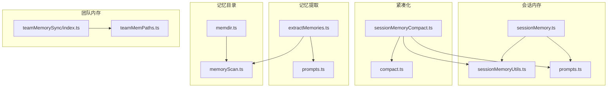
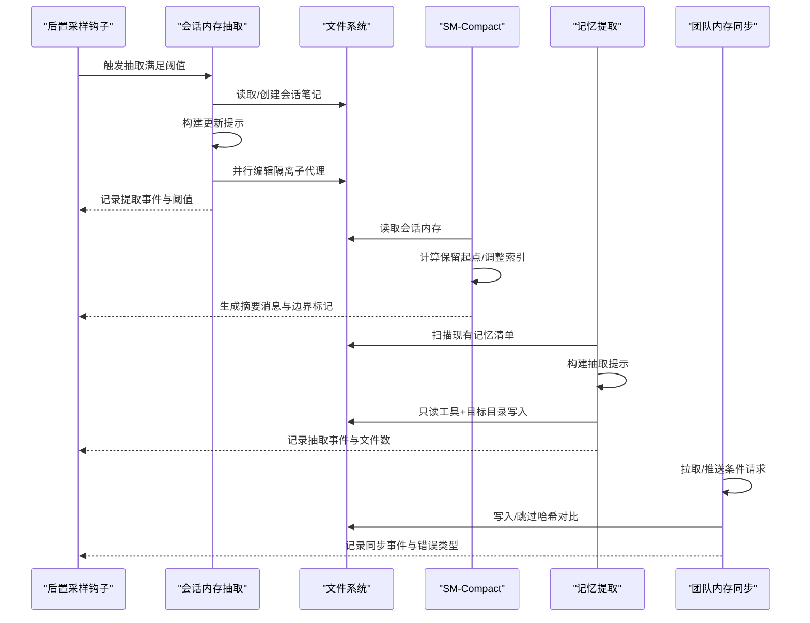
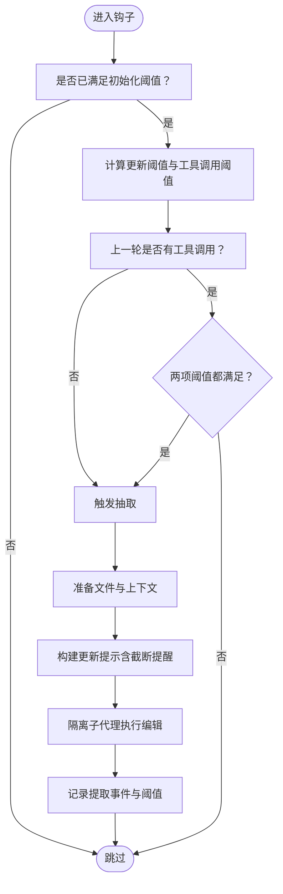
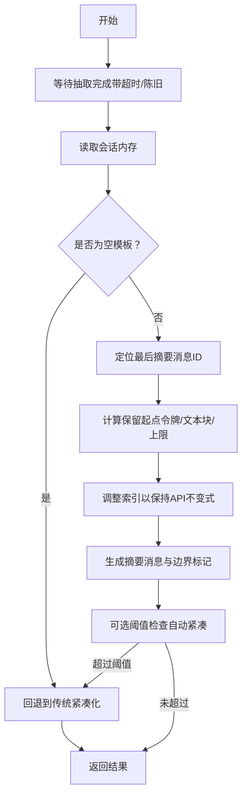
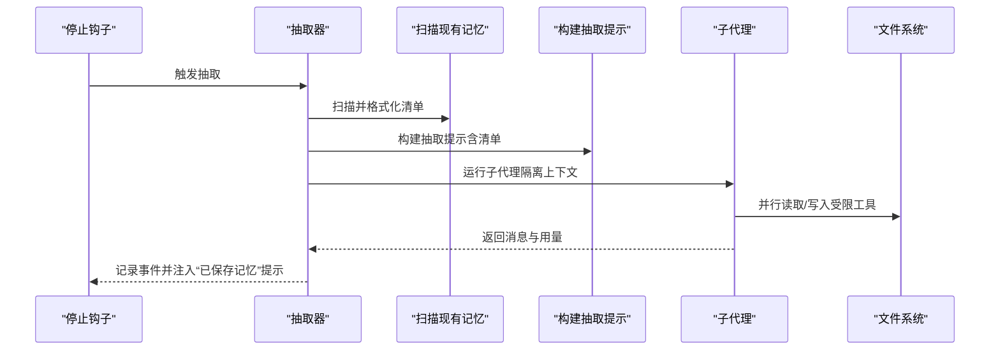
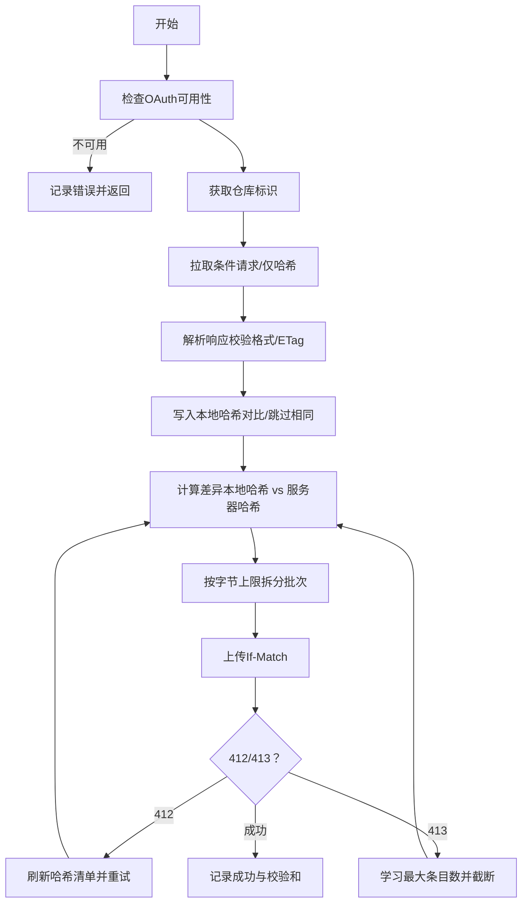
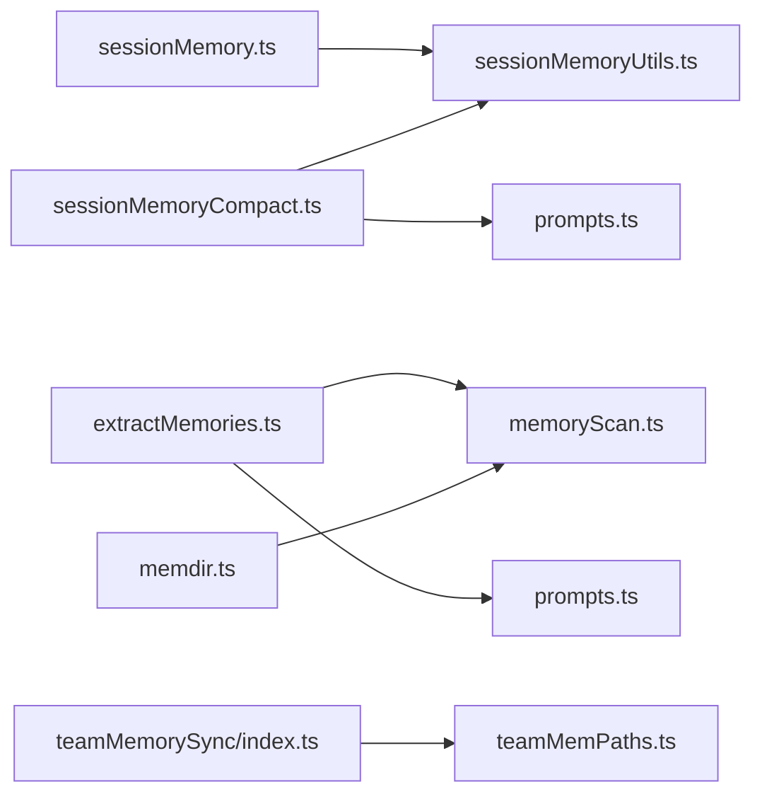

# 内存管理

<cite>
**本文引用的文件**
- [src/services/SessionMemory/sessionMemory.ts](file://src/services/SessionMemory/sessionMemory.ts)
- [src/services/SessionMemory/sessionMemoryUtils.ts](file://src/services/SessionMemory/sessionMemoryUtils.ts)
- [src/services/SessionMemory/prompts.ts](file://src/services/SessionMemory/prompts.ts)
- [src/services/compact/sessionMemoryCompact.ts](file://src/services/compact/sessionMemoryCompact.ts)
- [src/services/extractMemories/extractMemories.ts](file://src/services/extractMemories/extractMemories.ts)
- [src/services/extractMemories/prompts.ts](file://src/services/extractMemories/prompts.ts)
- [src/memdir/memdir.ts](file://src/memdir/memdir.ts)
- [src/memdir/memoryScan.ts](file://src/memdir/memoryScan.ts)
- [src/memdir/teamMemPaths.ts](file://src/memdir/teamMemPaths.ts)
- [src/services/teamMemorySync/index.ts](file://src/services/teamMemorySync/index.ts)
- [src/services/compact/compact.ts](file://src/services/compact/compact.ts)
</cite>

## 目录
1. [简介](#简介)
2. [项目结构](#项目结构)
3. [核心组件](#核心组件)
4. [架构总览](#架构总览)
5. [详细组件分析](#详细组件分析)
6. [依赖关系分析](#依赖关系分析)
7. [性能考量](#性能考量)
8. [故障排查指南](#故障排查指南)
9. [结论](#结论)
10. [附录](#附录)

## 简介
本文件系统性阐述本仓库中的“内存管理”体系，覆盖以下能力：
- 会话内存：自动维护会话级笔记文件，后台周期抽取关键信息，避免打断主线程。
- 紧凑化：基于会话内存的智能压缩路径，替代传统全文摘要，降低上下文开销。
- 记忆提取：在查询循环结束时，从对话中抽取持久化记忆到本地或共享目录。
- 团队内存同步：在受控条件下拉取/推送团队共享记忆，保障安全与一致性。

文档重点解释数据结构、存储机制、访问模式、阈值策略、提示工程与上下文生成流程，并给出优化与容量规划建议。

## 项目结构
围绕内存管理的关键模块分布如下：
- 会话内存（Session Memory）
  - 提取与更新：src/services/SessionMemory/sessionMemory.ts
  - 工具函数与阈值状态：src/services/SessionMemory/sessionMemoryUtils.ts
  - 模板与提示构建：src/services/SessionMemory/prompts.ts
- 紧凑化（Compact）
  - 基于会话内存的压缩路径：src/services/compact/sessionMemoryCompact.ts
  - 通用紧凑化流程与附件重建：src/services/compact/compact.ts
- 记忆提取（Extract Memories）
  - 后台抽取器与权限控制：src/services/extractMemories/extractMemories.ts
  - 提示模板（含类型与范围指导）：src/services/extractMemories/prompts.ts
- 记忆目录与索引
  - 统一提示与索引截断：src/memdir/memdir.ts
  - 扫描与清单格式化：src/memdir/memoryScan.ts
- 团队内存
  - 路径与安全校验：src/memdir/teamMemPaths.ts
  - 同步服务（拉取/推送/冲突处理/大小限制）：src/services/teamMemorySync/index.ts

图表来源
- [src/services/SessionMemory/sessionMemory.ts:1-496](file://src/services/SessionMemory/sessionMemory.ts#L1-L496)
- [src/services/SessionMemory/sessionMemoryUtils.ts:1-208](file://src/services/SessionMemory/sessionMemoryUtils.ts#L1-L208)
- [src/services/SessionMemory/prompts.ts:1-325](file://src/services/SessionMemory/prompts.ts#L1-L325)
- [src/services/compact/sessionMemoryCompact.ts:1-631](file://src/services/compact/sessionMemoryCompact.ts#L1-L631)
- [src/services/compact/compact.ts:1-800](file://src/services/compact/compact.ts#L1-L800)
- [src/services/extractMemories/extractMemories.ts:1-616](file://src/services/extractMemories/extractMemories.ts#L1-L616)
- [src/services/extractMemories/prompts.ts:1-155](file://src/services/extractMemories/prompts.ts#L1-L155)
- [src/memdir/memdir.ts:1-508](file://src/memdir/memdir.ts#L1-L508)
- [src/memdir/memoryScan.ts:1-95](file://src/memdir/memoryScan.ts#L1-L95)
- [src/memdir/teamMemPaths.ts:1-293](file://src/memdir/teamMemPaths.ts#L1-L293)
- [src/services/teamMemorySync/index.ts:1-800](file://src/services/teamMemorySync/index.ts#L1-L800)

章节来源
- [src/services/SessionMemory/sessionMemory.ts:1-496](file://src/services/SessionMemory/sessionMemory.ts#L1-L496)
- [src/services/SessionMemory/sessionMemoryUtils.ts:1-208](file://src/services/SessionMemory/sessionMemoryUtils.ts#L1-L208)
- [src/services/SessionMemory/prompts.ts:1-325](file://src/services/SessionMemory/prompts.ts#L1-L325)
- [src/services/compact/sessionMemoryCompact.ts:1-631](file://src/services/compact/sessionMemoryCompact.ts#L1-L631)
- [src/services/compact/compact.ts:1-800](file://src/services/compact/compact.ts#L1-L800)
- [src/services/extractMemories/extractMemories.ts:1-616](file://src/services/extractMemories/extractMemories.ts#L1-L616)
- [src/services/extractMemories/prompts.ts:1-155](file://src/services/extractMemories/prompts.ts#L1-L155)
- [src/memdir/memdir.ts:1-508](file://src/memdir/memdir.ts#L1-L508)
- [src/memdir/memoryScan.ts:1-95](file://src/memdir/memoryScan.ts#L1-L95)
- [src/memdir/teamMemPaths.ts:1-293](file://src/memdir/teamMemPaths.ts#L1-L293)
- [src/services/teamMemorySync/index.ts:1-800](file://src/services/teamMemorySync/index.ts#L1-L800)

## 核心组件
- 会话内存（Session Memory）
  - 自动抽取：在后置采样钩子中按阈值触发，使用隔离子代理执行，避免主线程阻塞。
  - 阈值策略：初始化阈值、两次更新间最小增长阈值、工具调用间隔阈值三者共同决定抽取时机。
  - 存储与模板：私有会话笔记文件，支持自定义模板与提示。
- 紧凑化（SM-Compact）
  - 基于会话内存的压缩路径：当满足开关与阈值时，将会话内存作为摘要注入，保留近期消息，避免传统全文摘要的高成本。
  - 分组与边界：计算保留起点，确保不破坏工具调用/结果配对与思考块合并不变式。
- 记忆提取（Extract Memories）
  - 后台抽取：在查询循环结束时，基于最近若干轮消息进行抽取；若主对话已写入则跳过冗余。
  - 权限与安全：严格限制工具使用范围，仅允许只读工具与目标目录内的写操作。
  - 上下文生成：预注入现有记忆清单，减少模型首轮扫描成本。
- 团队内存同步（Team Memory Sync）
  - 拉取/推送：条件请求（ETag）、差异上传（基于内容哈希），支持入口清单与内容分离拉取。
  - 安全与合规：路径白名单、符号链接解析与前缀校验、敏感信息扫描、条目数量上限学习与截断。
  - 冲突处理：412 条件失败重试、批量拆分、网关/应用层 413 区分与恢复。

章节来源
- [src/services/SessionMemory/sessionMemory.ts:134-181](file://src/services/SessionMemory/sessionMemory.ts#L134-L181)
- [src/services/SessionMemory/sessionMemoryUtils.ts:18-36](file://src/services/SessionMemory/sessionMemoryUtils.ts#L18-L36)
- [src/services/compact/sessionMemoryCompact.ts:324-397](file://src/services/compact/sessionMemoryCompact.ts#L324-L397)
- [src/services/extractMemories/extractMemories.ts:329-523](file://src/services/extractMemories/extractMemories.ts#L329-L523)
- [src/services/teamMemorySync/index.ts:100-127](file://src/services/teamMemorySync/index.ts#L100-L127)

## 架构总览
整体流程分为“会话内抽取—紧凑化—记忆提取—团队同步”四个阶段，彼此通过阈值与状态协同，形成闭环。

图表来源
- [src/services/SessionMemory/sessionMemory.ts:272-350](file://src/services/SessionMemory/sessionMemory.ts#L272-L350)
- [src/services/compact/sessionMemoryCompact.ts:514-630](file://src/services/compact/sessionMemoryCompact.ts#L514-L630)
- [src/services/extractMemories/extractMemories.ts:329-523](file://src/services/extractMemories/extractMemories.ts#L329-L523)
- [src/services/teamMemorySync/index.ts:387-410](file://src/services/teamMemorySync/index.ts#L387-L410)

## 详细组件分析

### 会话内存（Session Memory）
- 数据结构与存储
  - 私有会话笔记文件位于专用目录，首次使用时创建并注入模板；后续每次抽取均基于当前内容增量更新。
  - 支持自定义模板与提示，内置节长与总量上限检查，必要时进行截断提醒。
- 访问模式
  - 仅允许对指定文件路径使用编辑工具，其他路径一律拒绝，防止越权写入。
  - 抽取过程在隔离上下文中运行，避免污染父线程缓存。
- 阈值与触发
  - 初始化阈值：累计上下文窗口令牌数达到阈值后启用抽取。
  - 更新阈值：自上次抽取以来的实际上下文增长需达到阈值。
  - 工具调用阈值：自上次抽取以来的工具调用次数达到阈值。
  - 最终触发条件：上述两项阈值至少一项满足，且上一轮助手回复无工具调用（或满足最小增长）。
- 提示工程与上下文
  - 使用模板变量替换，动态注入当前内容与路径；根据节长与总量生成截断提醒，引导模型聚焦关键信息。

图表来源
- [src/services/SessionMemory/sessionMemory.ts:134-181](file://src/services/SessionMemory/sessionMemory.ts#L134-L181)
- [src/services/SessionMemory/sessionMemoryUtils.ts:184-189](file://src/services/SessionMemory/sessionMemoryUtils.ts#L184-L189)
- [src/services/SessionMemory/prompts.ts:226-247](file://src/services/SessionMemory/prompts.ts#L226-L247)

章节来源
- [src/services/SessionMemory/sessionMemory.ts:1-496](file://src/services/SessionMemory/sessionMemory.ts#L1-L496)
- [src/services/SessionMemory/sessionMemoryUtils.ts:1-208](file://src/services/SessionMemory/sessionMemoryUtils.ts#L1-L208)
- [src/services/SessionMemory/prompts.ts:1-325](file://src/services/SessionMemory/prompts.ts#L1-L325)

### 紧凑化（SM-Compact）
- 设计要点
  - 当会话内存存在且非模板内容时，优先采用其作为摘要，而非传统全文摘要。
  - 通过“最后摘要消息ID”定位保留起点，向后扩展至满足最小令牌数与最少文本块消息数，同时不超过硬上限。
  - 对工具调用/结果配对与思考块合并不变式进行索引调整，确保 API 兼容。
- 关键流程
  - 等待抽取完成（带超时与陈旧检测）。
  - 读取会话内存，判断是否为空模板。
  - 计算保留起点，过滤旧边界消息，生成摘要消息与边界标记。
  - 可选阈值检查（自动紧凑场景），超过阈值则回退到传统紧凑化。

图表来源
- [src/services/compact/sessionMemoryCompact.ts:514-630](file://src/services/compact/sessionMemoryCompact.ts#L514-L630)
- [src/services/compact/sessionMemoryCompact.ts:324-397](file://src/services/compact/sessionMemoryCompact.ts#L324-L397)
- [src/services/SessionMemory/sessionMemoryUtils.ts:89-105](file://src/services/SessionMemory/sessionMemoryUtils.ts#L89-L105)

章节来源
- [src/services/compact/sessionMemoryCompact.ts:1-631](file://src/services/compact/sessionMemoryCompact.ts#L1-L631)
- [src/services/compact/compact.ts:299-338](file://src/services/compact/compact.ts#L299-L338)

### 记忆提取（Extract Memories）
- 角色与职责
  - 在查询循环结束时，基于最近若干轮消息进行抽取；若主对话已写入则跳过冗余。
  - 严格限制工具使用：只读文件/搜索工具、只读 Shell 命令、目标目录内的写入。
- 上下文生成
  - 预先扫描现有记忆清单并格式化为清单字符串，注入到抽取提示中，避免模型首轮扫描。
  - 支持“跳过索引”模式，直接生成类型与保存指引，减少索引负担。
- 输出与反馈
  - 记录写入文件数、回合数、缓存命中率等指标；成功时向系统消息区注入“已保存记忆”提示。

图表来源
- [src/services/extractMemories/extractMemories.ts:329-523](file://src/services/extractMemories/extractMemories.ts#L329-L523)
- [src/services/extractMemories/prompts.ts:101-154](file://src/services/extractMemories/prompts.ts#L101-L154)
- [src/memdir/memoryScan.ts:35-95](file://src/memdir/memoryScan.ts#L35-L95)

章节来源
- [src/services/extractMemories/extractMemories.ts:1-616](file://src/services/extractMemories/extractMemories.ts#L1-L616)
- [src/services/extractMemories/prompts.ts:1-155](file://src/services/extractMemories/prompts.ts#L1-L155)
- [src/memdir/memoryScan.ts:1-95](file://src/memdir/memoryScan.ts#L1-L95)

### 团队内存同步（Team Memory Sync）
- 数据与目录
  - 团队内存位于自动记忆目录的子目录，按项目维度隔离；入口文件为各自目录下的索引文件。
- 同步协议
  - 拉取：支持仅获取哈希清单（view=hashes）以低成本刷新差异；条件请求（If-None-Match）。
  - 推送：仅上传内容哈希不同的条目；批量按字节上限拆分，避免网关拒绝。
  - 冲突：412 条件失败时，刷新哈希清单并重试；413 结构化错误携带最大条目数，客户端据此截断。
- 安全与合规
  - 路径白名单与多层校验：字符串前缀检查、符号链接解析、真实路径前缀匹配，防路径穿越与符号链接逃逸。
  - 敏感信息扫描：上传前扫描并跳过包含凭证的文件，记录首条匹配规则。
  - OAuth 与端点：要求第一方 OAuth 令牌与推理/资料范围，统一用户代理标识。

图表来源
- [src/services/teamMemorySync/index.ts:163-184](file://src/services/teamMemorySync/index.ts#L163-L184)
- [src/services/teamMemorySync/index.ts:188-306](file://src/services/teamMemorySync/index.ts#L188-L306)
- [src/services/teamMemorySync/index.ts:462-553](file://src/services/teamMemorySync/index.ts#L462-L553)
- [src/memdir/teamMemPaths.ts:22-64](file://src/memdir/teamMemPaths.ts#L22-L64)

章节来源
- [src/services/teamMemorySync/index.ts:1-800](file://src/services/teamMemorySync/index.ts#L1-L800)
- [src/memdir/teamMemPaths.ts:1-293](file://src/memdir/teamMemPaths.ts#L1-L293)

## 依赖关系分析
- 组件耦合
  - 会话内存抽取与紧凑化：通过共享的“最后摘要消息ID”与“会话内存内容”衔接，避免重复计算。
  - 记忆提取与目录扫描：抽取器依赖扫描模块生成清单，减少首轮 IO。
  - 团队同步与路径校验：同步模块依赖路径校验模块进行安全写入与键校验。
- 外部依赖
  - 文件系统抽象与权限：统一通过文件系统实现与权限路径工具访问。
  - OAuth 与网络：同步模块依赖 OAuth 令牌与 HTTP 客户端，具备重试与错误分类。
- 循环依赖规避
  - 会话内存工具函数独立模块，避免与主抽取器产生循环导入。

图表来源
- [src/services/SessionMemory/sessionMemory.ts:1-496](file://src/services/SessionMemory/sessionMemory.ts#L1-L496)
- [src/services/SessionMemory/sessionMemoryUtils.ts:1-208](file://src/services/SessionMemory/sessionMemoryUtils.ts#L1-L208)
- [src/services/SessionMemory/prompts.ts:1-325](file://src/services/SessionMemory/prompts.ts#L1-L325)
- [src/services/compact/sessionMemoryCompact.ts:1-631](file://src/services/compact/sessionMemoryCompact.ts#L1-L631)
- [src/services/extractMemories/extractMemories.ts:1-616](file://src/services/extractMemories/extractMemories.ts#L1-L616)
- [src/services/extractMemories/prompts.ts:1-155](file://src/services/extractMemories/prompts.ts#L1-L155)
- [src/memdir/memoryScan.ts:1-95](file://src/memdir/memoryScan.ts#L1-L95)
- [src/memdir/memdir.ts:1-508](file://src/memdir/memdir.ts#L1-L508)
- [src/memdir/teamMemPaths.ts:1-293](file://src/memdir/teamMemPaths.ts#L1-L293)
- [src/services/teamMemorySync/index.ts:1-800](file://src/services/teamMemorySync/index.ts#L1-L800)

章节来源
- [src/services/SessionMemory/sessionMemory.ts:1-496](file://src/services/SessionMemory/sessionMemory.ts#L1-L496)
- [src/services/SessionMemory/sessionMemoryUtils.ts:1-208](file://src/services/SessionMemory/sessionMemoryUtils.ts#L1-L208)
- [src/services/compact/sessionMemoryCompact.ts:1-631](file://src/services/compact/sessionMemoryCompact.ts#L1-L631)
- [src/services/extractMemories/extractMemories.ts:1-616](file://src/services/extractMemories/extractMemories.ts#L1-L616)
- [src/services/teamMemorySync/index.ts:1-800](file://src/services/teamMemorySync/index.ts#L1-L800)

## 性能考量
- 会话内存抽取
  - 隔离子代理复用提示缓存，减少重复计算；阈值设计避免频繁抽取。
  - 截断提醒与模板约束控制单节与总量，降低后续紧凑化成本。
- 紧凑化
  - SM-Compact 将摘要成本从“全文摘要”转移到“会话内存”，显著降低输入令牌与 API 成本。
  - 保留近期消息，避免传统摘要带来的历史信息丢失。
- 记忆提取
  - 预注入清单减少首轮扫描；只读工具链与受限写入降低 IO 与错误概率。
  - 节流门控（turnsSinceLastExtraction）避免过度触发。
- 团队同步
  - 仅哈希拉取与差异上传，大幅减少带宽与服务器压力。
  - 批量拆分与上限学习，提升大体量场景的稳定性。

## 故障排查指南
- 会话内存
  - 抽取未触发：检查初始化与更新阈值是否满足；确认上一轮助手回复是否包含工具调用。
  - 文件读写异常：关注文件系统不可访问错误；检查权限路径与磁盘空间。
  - 模板未生效：确认自定义模板路径与文件是否存在。
- 紧凑化
  - 会话内存为空：可能为模板内容，回退到传统紧凑化。
  - 边界索引异常：检查工具调用/结果配对与思考块合并逻辑是否被破坏。
- 记忆提取
  - 工具被拒：确认路径是否在目标目录内；检查只读命令与工具白名单。
  - 抽取未发生：若主对话已写入，抽取器会跳过冗余。
- 团队同步
  - 412 冲突：刷新哈希清单后重试；检查本地与服务器内容哈希是否一致。
  - 413 条目过多：学习服务器最大条目数并截断；考虑合并或删除部分文件。
  - 路径校验失败：检查路径穿越、符号链接与真实路径前缀。

章节来源
- [src/services/SessionMemory/sessionMemory.ts:272-350](file://src/services/SessionMemory/sessionMemory.ts#L272-L350)
- [src/services/compact/sessionMemoryCompact.ts:514-630](file://src/services/compact/sessionMemoryCompact.ts#L514-L630)
- [src/services/extractMemories/extractMemories.ts:154-222](file://src/services/extractMemories/extractMemories.ts#L154-L222)
- [src/services/teamMemorySync/index.ts:462-553](file://src/services/teamMemorySync/index.ts#L462-L553)

## 结论
本内存管理体系通过“会话内抽取—紧凑化—记忆提取—团队同步”的闭环，实现了：
- 低侵入的会话知识沉淀与压缩；
- 高效的记忆抽取与安全写入；
- 可靠的团队共享与合规同步。

建议在生产环境中结合业务规模与模型能力，合理设置阈值与批处理参数，并持续监控事件指标以优化体验与成本。

## 附录
- 最佳实践
  - 阈值调优：根据对话长度与工具使用频率，逐步调整初始化与更新阈值。
  - 索引维护：定期清理重复/过期记忆，保持索引简洁以避免截断。
  - 团队同步：开启仅哈希拉取与差异上传，配合批量拆分与上限学习。
  - 安全加固：启用敏感信息扫描与路径校验，定期审计团队目录权限。
- 容量规划
  - 估算会话内存总量与紧凑化预算，预留一定缓冲以应对峰值。
  - 团队同步条目上限以服务器返回为准，客户端侧做好截断与告警。
  - 记忆提取轮次与工具使用成本纳入总体令牌预算。