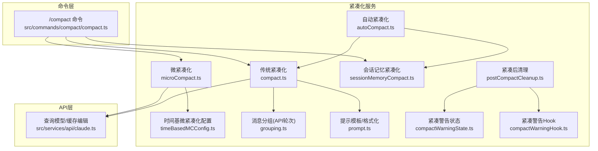
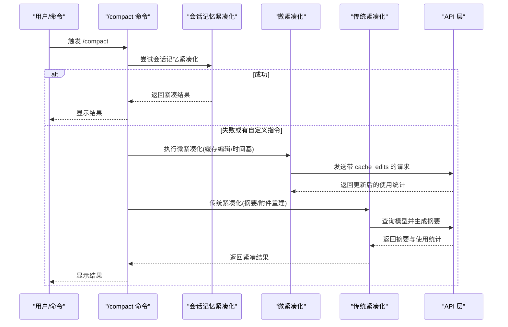
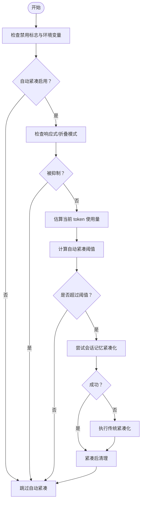
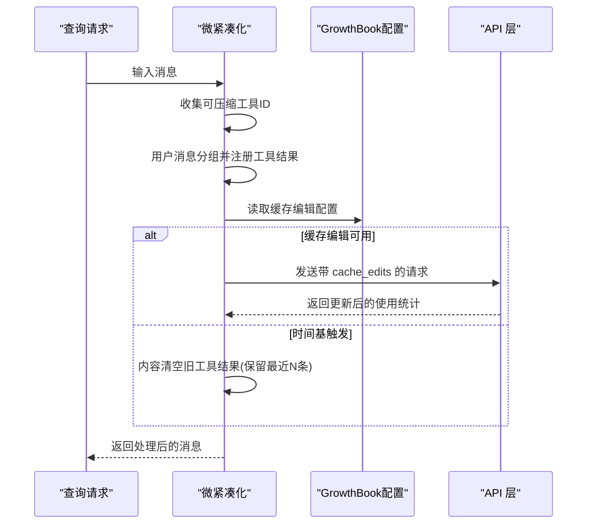
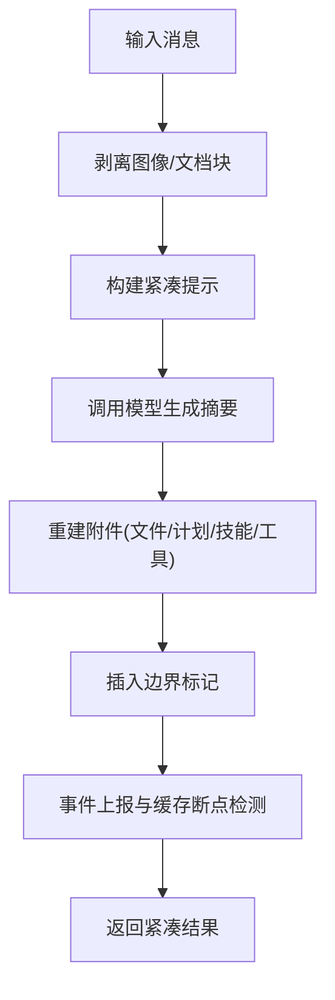
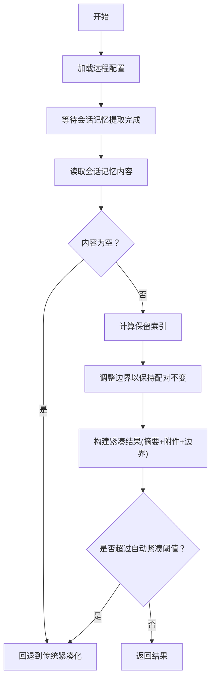
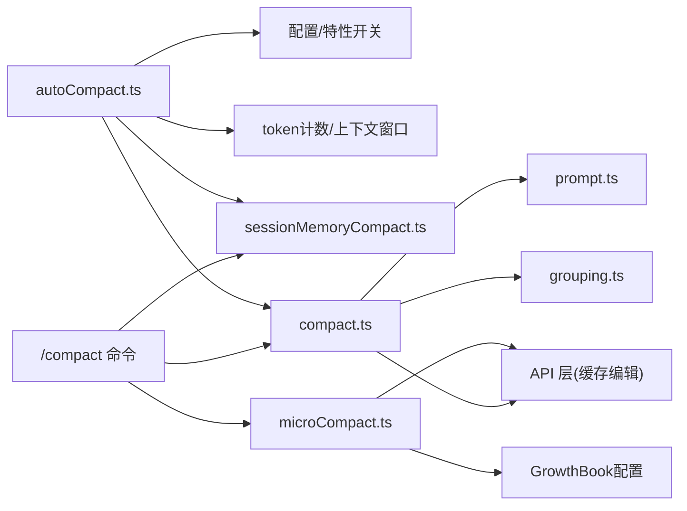

# 内存紧凑化

<cite>
**本文引用的文件**
- [autoCompact.ts](file://src/services/compact/autoCompact.ts)
- [microCompact.ts](file://src/services/compact/microCompact.ts)
- [timeBasedMCConfig.ts](file://src/services/compact/timeBasedMCConfig.ts)
- [grouping.ts](file://src/services/compact/grouping.ts)
- [compact.ts](file://src/services/compact/compact.ts)
- [postCompactCleanup.ts](file://src/services/compact/postCompactCleanup.ts)
- [sessionMemoryCompact.ts](file://src/services/compact/sessionMemoryCompact.ts)
- [prompt.ts](file://src/services/compact/prompt.ts)
- [compact.ts（命令）](file://src/commands/compact/compact.ts)
- [compactWarningState.ts](file://src/services/compact/compactWarningState.ts)
- [compactWarningHook.ts](file://src/services/compact/compactWarningHook.ts)
- [claude.ts（API）](file://src/services/api/claude.ts)
</cite>

## 目录
1. [简介](#简介)
2. [项目结构](#项目结构)
3. [核心组件](#核心组件)
4. [架构总览](#架构总览)
5. [详细组件分析](#详细组件分析)
6. [依赖关系分析](#依赖关系分析)
7. [性能考量](#性能考量)
8. [故障排查指南](#故障排查指南)
9. [结论](#结论)
10. [附录：配置与监控](#附录配置与监控)

## 简介
本文件系统性阐述内存紧凑化服务的设计与实现，覆盖自动紧凑化算法、分组策略、时间基微紧凑化、清理机制、提示生成策略与优化、配置项与阈值、以及性能影响与容量规划建议。目标是帮助开发者与运维人员理解紧凑化如何在不同场景下触发、如何执行、以及如何通过配置与监控保障稳定性与性能。

## 项目结构
紧凑化相关代码主要位于 src/services/compact 及其子模块，并通过命令层与 API 层协同工作：
- 自动紧凑化与阈值计算：autoCompact.ts
- 微紧凑化（含缓存编辑路径与时间基路径）：microCompact.ts
- 时间基微紧凑化配置：timeBasedMCConfig.ts
- 消息分组（按 API 轮次）：grouping.ts
- 传统紧凑化（摘要生成、附件重建等）：compact.ts
- 会话记忆紧凑化（实验性）：sessionMemoryCompact.ts
- 紧凑化提示模板与格式化：prompt.ts
- 命令入口（/compact）：src/commands/compact/compact.ts
- 紧凑后清理与状态管理：postCompactCleanup.ts、compactWarningState.ts、compactWarningHook.ts
- 缓存编辑能力接入（API 层）：src/services/api/claude.ts

**图表来源**
- [compact.ts（命令）:40-137](file://src/commands/compact/compact.ts#L40-L137)
- [autoCompact.ts:241-351](file://src/services/compact/autoCompact.ts#L241-L351)
- [microCompact.ts:253-293](file://src/services/compact/microCompact.ts#L253-L293)
- [timeBasedMCConfig.ts:36-43](file://src/services/compact/timeBasedMCConfig.ts#L36-L43)
- [grouping.ts:22-63](file://src/services/compact/grouping.ts#L22-L63)
- [compact.ts:387-763](file://src/services/compact/compact.ts#L387-L763)
- [sessionMemoryCompact.ts:514-630](file://src/services/compact/sessionMemoryCompact.ts#L514-L630)
- [prompt.ts:293-375](file://src/services/compact/prompt.ts#L293-L375)
- [compactWarningState.ts:1-18](file://src/services/compact/compactWarningState.ts#L1-L18)
- [compactWarningHook.ts:11-16](file://src/services/compact/compactWarningHook.ts#L11-L16)
- [postCompactCleanup.ts:31-77](file://src/services/compact/postCompactCleanup.ts#L31-L77)
- [claude.ts（API）:1184-1205](file://src/services/api/claude.ts#L1184-L1205)

**章节来源**
- [compact.ts（命令）:40-137](file://src/commands/compact/compact.ts#L40-L137)
- [autoCompact.ts:32-91](file://src/services/compact/autoCompact.ts#L32-L91)
- [microCompact.ts:253-293](file://src/services/compact/microCompact.ts#L253-L293)
- [timeBasedMCConfig.ts:36-43](file://src/services/compact/timeBasedMCConfig.ts#L36-L43)
- [grouping.ts:22-63](file://src/services/compact/grouping.ts#L22-L63)
- [compact.ts:387-763](file://src/services/compact/compact.ts#L387-L763)
- [sessionMemoryCompact.ts:514-630](file://src/services/compact/sessionMemoryCompact.ts#L514-L630)
- [prompt.ts:293-375](file://src/services/compact/prompt.ts#L293-L375)
- [compactWarningState.ts:1-18](file://src/services/compact/compactWarningState.ts#L1-L18)
- [compactWarningHook.ts:11-16](file://src/services/compact/compactWarningHook.ts#L11-L16)
- [postCompactCleanup.ts:31-77](file://src/services/compact/postCompactCleanup.ts#L31-L77)
- [claude.ts（API）:1184-1205](file://src/services/api/claude.ts#L1184-L1205)

## 核心组件
- 自动紧凑化引擎：基于有效上下文窗口与缓冲区阈值判断是否需要主动紧凑；支持“仅响应式模式”抑制与上下文折叠冲突。
- 微紧凑化：优先尝试缓存编辑（不破坏前缀），否则回退到时间基内容清空；严格区分主进程与子代理来源。
- 传统紧凑化：生成摘要、重建附件、写入边界标记，支持部分紧凑与完整紧凑两种方向。
- 会话记忆紧凑化：从持久化会话记忆中提取摘要，避免重复总结大体量历史。
- 分组策略：按 API 轮次分组，确保工具调用与结果配对正确，便于安全地进行紧凑。
- 提示模板：为紧凑化任务提供明确指令与输出结构，保证摘要质量。
- 清理与状态：紧凑后清理缓存与跟踪状态，抑制紧凑警告，避免误报。

**章节来源**
- [autoCompact.ts:147-158](file://src/services/compact/autoCompact.ts#L147-L158)
- [microCompact.ts:253-293](file://src/services/compact/microCompact.ts#L253-L293)
- [compact.ts:387-763](file://src/services/compact/compact.ts#L387-L763)
- [sessionMemoryCompact.ts:514-630](file://src/services/compact/sessionMemoryCompact.ts#L514-L630)
- [grouping.ts:22-63](file://src/services/compact/grouping.ts#L22-L63)
- [prompt.ts:293-375](file://src/services/compact/prompt.ts#L293-L375)
- [postCompactCleanup.ts:31-77](file://src/services/compact/postCompactCleanup.ts#L31-L77)

## 架构总览
紧凑化在不同阶段由多条路径协作完成：
- 命令入口 /compact：优先尝试会话记忆紧凑化；若失败或存在自定义指令，则走传统紧凑化；可选经由响应式路径。
- 自动紧凑化：在每次查询前评估当前 token 使用量与阈值，必要时先尝试会话记忆紧凑化，再进行传统紧凑化。
- 微紧凑化：在请求前快速清理旧工具结果，减少发送给模型的内容，提升缓存命中率。
- API 层：支持缓存编辑（cache editing）以无损方式删除工具结果；同时负责紧凑化事件上报与缓存断点检测。

**图表来源**
- [compact.ts（命令）:55-108](file://src/commands/compact/compact.ts#L55-L108)
- [sessionMemoryCompact.ts:514-630](file://src/services/compact/sessionMemoryCompact.ts#L514-L630)
- [microCompact.ts:253-293](file://src/services/compact/microCompact.ts#L253-L293)
- [compact.ts:387-763](file://src/services/compact/compact.ts#L387-L763)
- [claude.ts（API）:1184-1205](file://src/services/api/claude.ts#L1184-L1205)

## 详细组件分析

### 自动紧凑化算法与触发条件
- 阈值计算：有效上下文窗口减去摘要预留与缓冲区阈值，得到自动紧凑阈值；支持环境变量覆盖百分比与阻断上限。
- 触发判定：在查询前估算 token 数，若超过阈值且未被禁用，则进入自动紧凑流程。
- 抑制策略：当处于“仅响应式模式”或“上下文折叠模式”时，自动紧凑会被抑制，避免与这些机制冲突。
- 失败熔断：连续失败次数达到阈值后，自动停止重试，防止无效 API 调用。

**图表来源**
- [autoCompact.ts:147-158](file://src/services/compact/autoCompact.ts#L147-L158)
- [autoCompact.ts:241-351](file://src/services/compact/autoCompact.ts#L241-L351)
- [sessionMemoryCompact.ts:514-630](file://src/services/compact/sessionMemoryCompact.ts#L514-L630)
- [postCompactCleanup.ts:31-77](file://src/services/compact/postCompactCleanup.ts#L31-L77)

**章节来源**
- [autoCompact.ts:72-145](file://src/services/compact/autoCompact.ts#L72-L145)
- [autoCompact.ts:160-239](file://src/services/compact/autoCompact.ts#L160-L239)
- [autoCompact.ts:241-351](file://src/services/compact/autoCompact.ts#L241-L351)
- [postCompactCleanup.ts:31-77](file://src/services/compact/postCompactCleanup.ts#L31-L77)

### 微紧凑化：分组逻辑与清理机制
- 工具识别：遍历助手消息中的工具调用块，筛选可压缩工具集合。
- 分组策略：按用户消息聚合工具结果，记录工具结果与消息的对应关系。
- 缓存编辑路径：在支持的模型上，通过 cache_edits 在不破坏前缀的前提下删除工具结果，减少网络传输与 API 调用成本。
- 时间基路径：若距离上次助手消息的时间超过阈值，则直接内容清空旧工具结果，保留最近若干条，以应对缓存过期导致的全量重写。
- 状态同步：成功后抑制紧凑警告，通知缓存断点检测，重置微紧凑状态，避免后续回合误删已不存在的结果。

**图表来源**
- [microCompact.ts:226-241](file://src/services/compact/microCompact.ts#L226-L241)
- [microCompact.ts:305-399](file://src/services/compact/microCompact.ts#L305-L399)
- [microCompact.ts:422-530](file://src/services/compact/microCompact.ts#L422-L530)
- [timeBasedMCConfig.ts:36-43](file://src/services/compact/timeBasedMCConfig.ts#L36-L43)
- [claude.ts（API）:1184-1205](file://src/services/api/claude.ts#L1184-L1205)

**章节来源**
- [microCompact.ts:226-241](file://src/services/compact/microCompact.ts#L226-L241)
- [microCompact.ts:305-399](file://src/services/compact/microCompact.ts#L305-L399)
- [microCompact.ts:422-530](file://src/services/compact/microCompact.ts#L422-L530)
- [timeBasedMCConfig.ts:18-43](file://src/services/compact/timeBasedMCConfig.ts#L18-L43)

### 传统紧凑化：摘要生成与附件重建
- 指令构建：采用“无工具”前置指令与结构化摘要模板，确保模型聚焦于关键信息。
- 图像剥离：移除用户消息中的图片/文档块，以避免摘要阶段触发“提示过长”。
- 附件重建：在紧凑后重建文件附件、计划、技能、工具清单等，维持上下文完整性。
- 边界标记：插入系统边界消息，标注紧凑前后的关系，便于后续加载器恢复链路。
- 事件上报：记录紧凑前后 token 统计、缓存读取/创建、是否会再次触发等指标。

**图表来源**
- [compact.ts:145-200](file://src/services/compact/compact.ts#L145-L200)
- [prompt.ts:293-375](file://src/services/compact/prompt.ts#L293-L375)
- [compact.ts:531-586](file://src/services/compact/compact.ts#L531-L586)
- [compact.ts:598-748](file://src/services/compact/compact.ts#L598-L748)

**章节来源**
- [compact.ts:145-200](file://src/services/compact/compact.ts#L145-L200)
- [prompt.ts:293-375](file://src/services/compact/prompt.ts#L293-L375)
- [compact.ts:531-586](file://src/services/compact/compact.ts#L531-L586)
- [compact.ts:598-748](file://src/services/compact/compact.ts#L598-L748)

### 会话记忆紧凑化：实验性路径
- 配置加载：从远程配置加载最小保留 token、最少文本消息数与最大保留 token。
- 索引计算：从最后摘要消息 ID 开始向后扩展，满足最小保留条件且不超过最大上限。
- 边界调整：确保不拆分工具调用与结果配对，以及合并思考块所需的助手消息。
- 结果生成：使用会话记忆作为摘要内容，保留近期消息，插入边界标记并重建附件。

**图表来源**
- [sessionMemoryCompact.ts:102-130](file://src/services/compact/sessionMemoryCompact.ts#L102-L130)
- [sessionMemoryCompact.ts:324-397](file://src/services/compact/sessionMemoryCompact.ts#L324-L397)
- [sessionMemoryCompact.ts:514-630](file://src/services/compact/sessionMemoryCompact.ts#L514-L630)

**章节来源**
- [sessionMemoryCompact.ts:47-88](file://src/services/compact/sessionMemoryCompact.ts#L47-L88)
- [sessionMemoryCompact.ts:324-397](file://src/services/compact/sessionMemoryCompact.ts#L324-L397)
- [sessionMemoryCompact.ts:514-630](file://src/services/compact/sessionMemoryCompact.ts#L514-L630)

### 提示生成策略与优化
- 指令结构：明确“无工具”前置与“分析-摘要”两段式结构，减少模型误用工具的风险。
- 输出格式：统一摘要标签与标题，便于解析与展示。
- 自定义指令：允许用户与钩子注入额外指令，合并后传递给模型。
- 响应式模式：在仅响应式模式下，/compact 走响应式路径，避免主动干预。

**章节来源**
- [prompt.ts:19-26](file://src/services/compact/prompt.ts#L19-L26)
- [prompt.ts:293-303](file://src/services/compact/prompt.ts#L293-L303)
- [prompt.ts:311-335](file://src/services/compact/prompt.ts#L311-L335)
- [compact.ts（命令）:87-94](file://src/commands/compact/compact.ts#L87-L94)

## 依赖关系分析
- 模块耦合
  - autoCompact.ts 依赖 token 计数、模型上下文窗口、特性开关与配置，耦合度适中。
  - microCompact.ts 依赖 GrowthBook 配置与 API 层缓存编辑能力，且通过延迟导入避免循环依赖。
  - compact.ts 依赖分组、提示模板、附件重建与 API 层，是核心协调者。
  - sessionMemoryCompact.ts 依赖远程配置与会话存储，耦合外部持久化。
- 外部依赖
  - API 层提供缓存编辑与紧凑事件上报，是微紧凑与传统紧凑的关键支撑。
  - 特性开关（feature）控制功能启用范围，避免在非目标环境引入开销。

**图表来源**
- [autoCompact.ts:1-26](file://src/services/compact/autoCompact.ts#L1-L26)
- [microCompact.ts:1-31](file://src/services/compact/microCompact.ts#L1-L31)
- [compact.ts:1-82](file://src/services/compact/compact.ts#L1-L82)
- [compact.ts（命令）:1-28](file://src/commands/compact/compact.ts#L1-L28)
- [claude.ts（API）:1184-1205](file://src/services/api/claude.ts#L1184-L1205)

**章节来源**
- [autoCompact.ts:1-26](file://src/services/compact/autoCompact.ts#L1-L26)
- [microCompact.ts:1-31](file://src/services/compact/microCompact.ts#L1-L31)
- [compact.ts:1-82](file://src/services/compact/compact.ts#L1-L82)
- [compact.ts（命令）:1-28](file://src/commands/compact/compact.ts#L1-L28)
- [claude.ts（API）:1184-1205](file://src/services/api/claude.ts#L1184-L1205)

## 性能考量
- 缓存编辑优势：在支持的模型上，通过 cache_edits 删除工具结果，避免重传与 API 调用，显著降低网络与成本。
- 时间基清理：在缓存过期风险高时提前清空旧工具结果，减少一次完整请求的 payload。
- 图像剥离：减少大体积媒体对摘要生成的影响，降低“提示过长”概率。
- 分组策略：按 API 轮次分组，确保工具调用与结果配对正确，避免错误切分带来的二次处理。
- 熔断与抑制：自动紧凑失败熔断与模式抑制，避免无效重试与资源浪费。

[本节为通用指导，无需特定文件引用]

## 故障排查指南
- 自动紧凑未触发
  - 检查禁用标志与环境变量覆盖、响应式/折叠模式抑制。
  - 查看 token 估算与阈值计算日志。
- 微紧凑未生效
  - 确认缓存编辑功能开启、模型受支持、查询来源为主进程。
  - 检查时间基触发条件与工具结果收集。
- 传统紧凑失败
  - 关注“提示过长”重试与头部截断逻辑，确认分组与配对是否正确。
  - 检查附件重建与边界标记是否完整。
- 紧凑后异常
  - 运行紧凑后清理，重置微紧凑状态与缓存断点检测基线。
  - 检查紧凑警告抑制状态，避免 UI 误导。

**章节来源**
- [autoCompact.ts:147-158](file://src/services/compact/autoCompact.ts#L147-L158)
- [microCompact.ts:276-286](file://src/services/compact/microCompact.ts#L276-L286)
- [compact.ts:243-291](file://src/services/compact/compact.ts#L243-L291)
- [postCompactCleanup.ts:31-77](file://src/services/compact/postCompactCleanup.ts#L31-L77)
- [compactWarningState.ts:1-18](file://src/services/compact/compactWarningState.ts#L1-L18)

## 结论
该紧凑化体系通过“自动紧凑 + 微紧凑 + 传统紧凑”的分层设计，在保证上下文完整性的同时，最大化利用缓存与分组策略，降低 API 成本与响应时间。配合会话记忆紧凑化与严格的清理/抑制机制，可在复杂会话中稳定运行。建议结合配置与监控持续优化阈值与策略，以适应不同模型与业务场景。

[本节为总结，无需特定文件引用]

## 附录：配置与监控

### 配置项与阈值
- 自动紧凑阈值
  - 有效上下文窗口 = 模型上下文窗口 - 摘要预留
  - 自动紧凑阈值 = 有效上下文窗口 - 缓冲区阈值
  - 环境变量覆盖百分比与阻断上限
- 微紧凑阈值（缓存编辑）
  - 由 GrowthBook 配置决定，包含触发阈值与保留数量
- 时间基微紧凑
  - enabled：是否启用
  - gapThresholdMinutes：触发时间间隔阈值（分钟）
  - keepRecent：保留最近工具结果数量
- 会话记忆紧凑
  - minTokens：保留最小 token 数
  - minTextBlockMessages：最少文本块消息数
  - maxTokens：保留最大 token 数

**章节来源**
- [autoCompact.ts:32-91](file://src/services/compact/autoCompact.ts#L32-L91)
- [timeBasedMCConfig.ts:18-43](file://src/services/compact/timeBasedMCConfig.ts#L18-L43)
- [sessionMemoryCompact.ts:47-61](file://src/services/compact/sessionMemoryCompact.ts#L47-L61)

### 监控指标与事件
- 自动紧凑事件
  - preCompactTokenCount、postCompactTokenCount、truePostCompactTokenCount
  - autoCompactThreshold、willRetriggerNextTurn、querySource、queryChainId、queryDepth
  - 缓存读取/创建/输入/输出 token
- 微紧凑事件
  - tengu_cached_microcompact：删除工具数量、保留数量、触发类型
  - tengu_time_based_microcompact：时间间隔、清除/保留数量、节省 token
- 会话记忆紧凑事件
  - tengu_sm_compact_*：空模板、阈值超限、错误、恢复会话等

**章节来源**
- [compact.ts:650-695](file://src/services/compact/compact.ts#L650-L695)
- [microCompact.ts:346-356](file://src/services/compact/microCompact.ts#L346-L356)
- [microCompact.ts:498-505](file://src/services/compact/microCompact.ts#L498-L505)
- [sessionMemoryCompact.ts:534-629](file://src/services/compact/sessionMemoryCompact.ts#L534-L629)

### 实用指南
- 效果评估
  - 对比 pre/post token 使用量与 willRetriggerNextTurn，评估是否达到预期。
  - 关注缓存读取/创建比例，衡量微紧凑收益。
- 性能调优
  - 调整自动紧凑阈值与缓冲区，平衡触发频率与上下文长度。
  - 启用/调整时间基微紧凑参数，针对长时间无交互场景优化。
  - 优先启用缓存编辑，减少重复传输。
- 容量规划
  - 基于模型上下文窗口与摘要预留，估算有效窗口与阈值。
  - 通过会话记忆紧凑减少历史摘要成本，合理设置保留上限。

[本节为通用指导，无需特定文件引用]