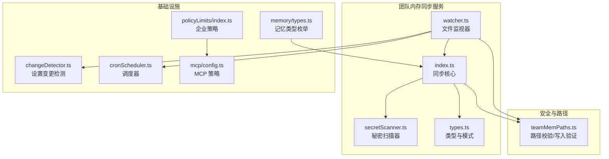
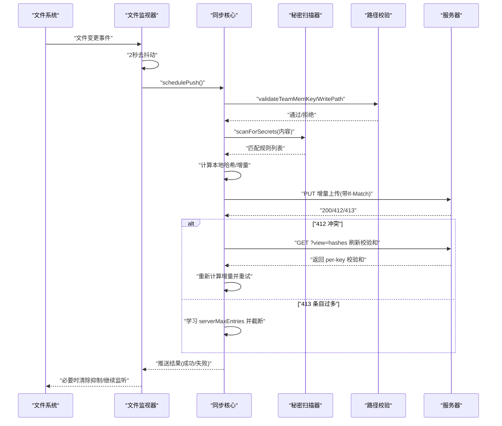
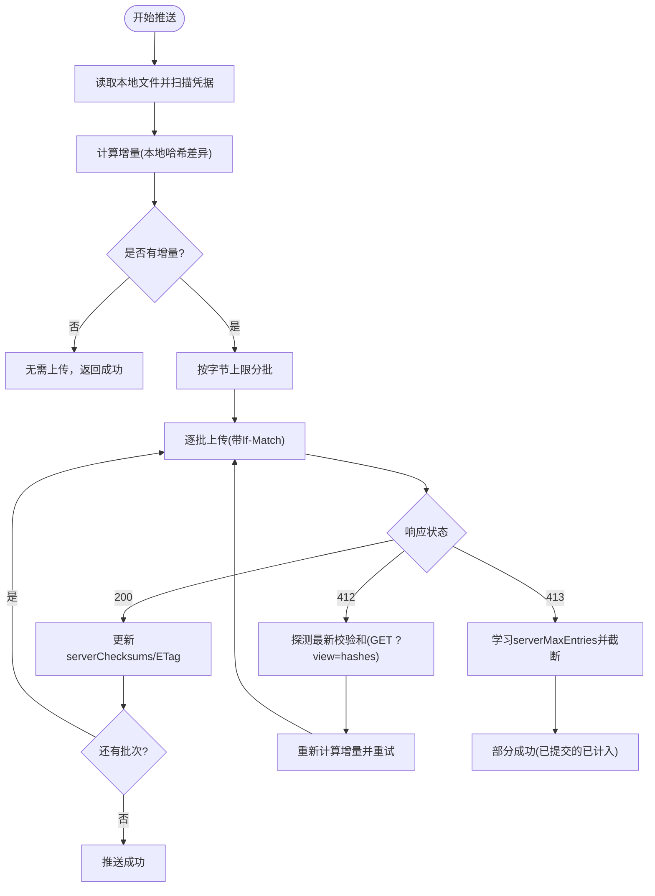
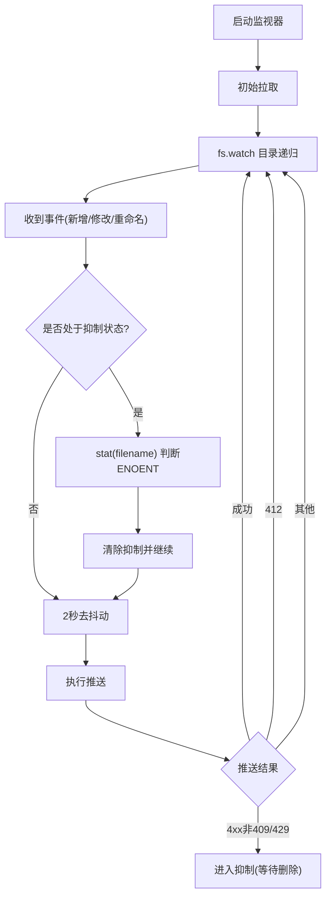
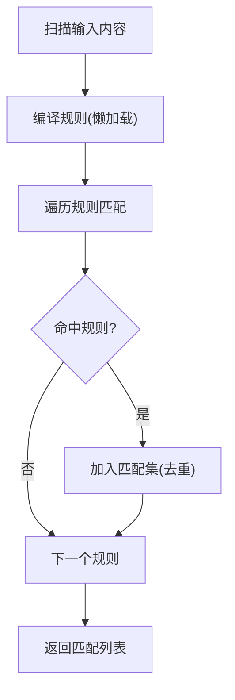
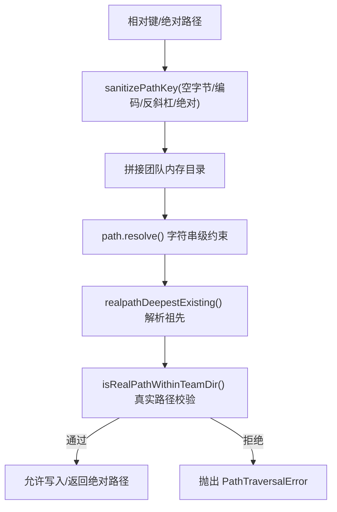
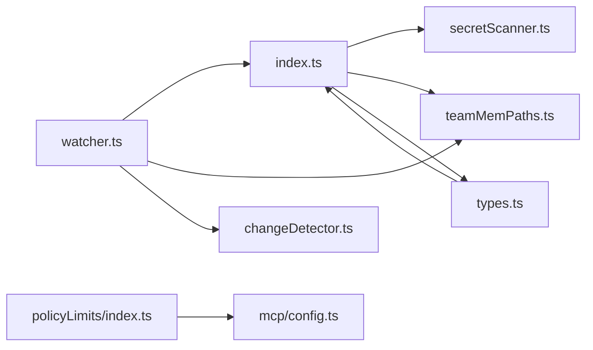

# 团队内存同步

<cite>
**本文引用的文件**
- [src/services/teamMemorySync/index.ts](file://src/services/teamMemorySync/index.ts)
- [src/services/teamMemorySync/watcher.ts](file://src/services/teamMemorySync/watcher.ts)
- [src/services/teamMemorySync/secretScanner.ts](file://src/services/teamMemorySync/secretScanner.ts)
- [src/services/teamMemorySync/types.ts](file://src/services/teamMemorySync/types.ts)
- [src/memdir/teamMemPaths.ts](file://src/memdir/teamMemPaths.ts)
- [src/utils/settings/changeDetector.ts](file://src/utils/settings/changeDetector.ts)
- [src/utils/cronScheduler.ts](file://src/utils/cronScheduler.ts)
- [src/services/policyLimits/index.ts](file://src/services/policyLimits/index.ts)
- [src/services/mcp/config.ts](file://src/services/mcp/config.ts)
- [src/utils/memory/types.ts](file://src/utils/memory/types.ts)
- [README.md](file://README.md)
</cite>

## 目录
1. [简介](#简介)
2. [项目结构](#项目结构)
3. [核心组件](#核心组件)
4. [架构总览](#架构总览)
5. [详细组件分析](#详细组件分析)
6. [依赖关系分析](#依赖关系分析)
7. [性能考量](#性能考量)
8. [故障排查指南](#故障排查指南)
9. [结论](#结论)
10. [附录](#附录)

## 简介
本文件系统性阐述“团队内存同步”服务的设计与实现，覆盖以下关键主题：
- 同步机制：拉取（Pull）与推送（Push）的语义、乐观锁与冲突解决、增量上传与批次控制
- 监控策略：遥测事件、错误分类与重试、可观测性指标
- 安全保护：路径校验（防路径穿越）、凭据扫描（PSR M22174）、OAuth 授权约束
- 秘密扫描器：规则来源、匹配与脱敏、合规与审计
- 守护进程（文件监视器）：事件驱动、去抖动、性能优化与抑制策略
- 配置管理：功能开关、企业策略、设置变更检测
- 故障恢复：412 冲突探测、413 条目上限学习、重启与清理流程
- 安全合规：访问控制、审计日志、最小权限原则

## 项目结构
团队内存同步相关代码主要位于以下模块：
- 同步核心：src/services/teamMemorySync/index.ts
- 文件监视器：src/services/teamMemorySync/watcher.ts
- 凭据扫描器：src/services/teamMemorySync/secretScanner.ts
- 路径与安全：src/memdir/teamMemPaths.ts
- 类型定义：src/services/teamMemorySync/types.ts
- 设置变更检测：src/utils/settings/changeDetector.ts
- 企业策略与 MCP 配置：src/services/policyLimits/index.ts、src/services/mcp/config.ts
- 记忆类型枚举：src/utils/memory/types.ts

图表来源
- [src/services/teamMemorySync/index.ts:1-1257](file://src/services/teamMemorySync/index.ts#L1-L1257)
- [src/services/teamMemorySync/watcher.ts:1-388](file://src/services/teamMemorySync/watcher.ts#L1-L388)
- [src/services/teamMemorySync/secretScanner.ts:1-325](file://src/services/teamMemorySync/secretScanner.ts#L1-L325)
- [src/memdir/teamMemPaths.ts:1-293](file://src/memdir/teamMemPaths.ts#L1-L293)
- [src/services/teamMemorySync/types.ts:1-157](file://src/services/teamMemorySync/types.ts#L1-L157)
- [src/utils/settings/changeDetector.ts:268-488](file://src/utils/settings/changeDetector.ts#L268-L488)
- [src/utils/cronScheduler.ts:380-404](file://src/utils/cronScheduler.ts#L380-L404)
- [src/services/policyLimits/index.ts:1-13](file://src/services/policyLimits/index.ts#L1-L13)
- [src/services/mcp/config.ts:336-378](file://src/services/mcp/config.ts#L336-L378)
- [src/utils/memory/types.ts:1-12](file://src/utils/memory/types.ts#L1-L12)

章节来源
- [README.md:95-114](file://README.md#L95-L114)

## 核心组件
- 同步核心（index.ts）
  - 提供拉取（pullTeamMemory）、推送（pushTeamMemory）、双向同步（syncTeamMemory）等接口
  - 使用 ETag/Checksum 实现条件请求与乐观锁；支持 412 冲突探测与重试
  - 增量上传：仅对内容哈希变化的键进行上传，并按最大请求体大小分批
  - 学习服务器条目上限（413 结构化错误），动态截断本地集合
- 文件监视器（watcher.ts）
  - 基于原生 fs.watch 的目录级递归监听，2 秒去抖动后触发推送
  - 对永久失败（如 4xx 非 409/429）进行抑制，删除文件可清除抑制状态
  - 启动时先拉取，再启动监视器，避免首次写入“引导死区”
- 秘密扫描器（secretScanner.ts）
  - 基于 gitleaks 的高置信度规则子集，扫描内容中的凭据
  - 扫描在本地完成，不上传含凭据的文件；记录规则 ID 用于审计
- 路径与安全（teamMemPaths.ts）
  - 多层路径校验：字符串规范化、URL 解码检查、Unicode 归一化、反斜杠拒绝、绝对路径拒绝
  - 写入前使用 realpath 深度解析，防止符号链接逃逸（PSR M22186）
  - 提供 isTeamMemPath/validateTeamMemKey/validateTeamMemWritePath 等工具函数
- 类型与模式（types.ts）
  - 定义团队内存数据结构、错误模式（413 too many entries）、结果类型与遥测字段

章节来源
- [src/services/teamMemorySync/index.ts:1-1257](file://src/services/teamMemorySync/index.ts#L1-L1257)
- [src/services/teamMemorySync/watcher.ts:1-388](file://src/services/teamMemorySync/watcher.ts#L1-L388)
- [src/services/teamMemorySync/secretScanner.ts:1-325](file://src/services/teamMemorySync/secretScanner.ts#L1-L325)
- [src/memdir/teamMemPaths.ts:1-293](file://src/memdir/teamMemPaths.ts#L1-L293)
- [src/services/teamMemorySync/types.ts:1-157](file://src/services/teamMemorySync/types.ts#L1-L157)

## 架构总览
下图展示从文件变更到云端同步的端到端流程，包括安全与监控要点。

图表来源
- [src/services/teamMemorySync/watcher.ts:132-145](file://src/services/teamMemorySync/watcher.ts#L132-L145)
- [src/services/teamMemorySync/index.ts:889-1146](file://src/services/teamMemorySync/index.ts#L889-L1146)
- [src/services/teamMemorySync/secretScanner.ts:277-295](file://src/services/teamMemorySync/secretScanner.ts#L277-L295)
- [src/memdir/teamMemPaths.ts:228-284](file://src/memdir/teamMemPaths.ts#L228-L284)

## 详细组件分析

### 同步核心（增量上传与冲突解决）
- 拉取（Pull）
  - 支持条件请求（If-None-Match），304 表示未修改；404 表示无远端数据
  - 成功时刷新 serverChecksums，以便后续推送计算增量
- 推送（Push）
  - 乐观锁：If-Match 校验；412 时通过 GET ?view=hashes 获取最新 per-key 校验和，重新计算增量并重试
  - 分批上传：按请求体大小上限拆分为多个 PUT，确保网关阈值安全
  - 413 结构化错误：解析 error_code 与 max_entries，缓存限制并在下次推送时截断
- 双向同步（syncTeamMemory）
  - 先拉取（强制忽略缓存），再推送（冲突解决）

图表来源
- [src/services/teamMemorySync/index.ts:889-1146](file://src/services/teamMemorySync/index.ts#L889-L1146)
- [src/services/teamMemorySync/index.ts:426-460](file://src/services/teamMemorySync/index.ts#L426-L460)

章节来源
- [src/services/teamMemorySync/index.ts:188-306](file://src/services/teamMemorySync/index.ts#L188-L306)
- [src/services/teamMemorySync/index.ts:315-385](file://src/services/teamMemorySync/index.ts#L315-L385)
- [src/services/teamMemorySync/index.ts:462-553](file://src/services/teamMemorySync/index.ts#L462-L553)
- [src/services/teamMemorySync/index.ts:889-1146](file://src/services/teamMemorySync/index.ts#L889-L1146)

### 文件监视器（事件驱动与性能优化）
- 事件源：原生 fs.watch 递归监听团队内存目录
- 去抖动：2 秒内连续变更合并为一次推送，避免频繁网络请求
- 抑制策略：遇到永久失败（如 4xx 非 409/429）进入抑制，直到文件删除事件清除
- 启动策略：先执行一次拉取，再启动监视器，保证首次写入也能被捕捉
- 关闭流程：优雅关闭，等待当前推送完成，必要时尽力推送待定变更

图表来源
- [src/services/teamMemorySync/watcher.ts:147-229](file://src/services/teamMemorySync/watcher.ts#L147-L229)
- [src/services/teamMemorySync/watcher.ts:252-305](file://src/services/teamMemorySync/watcher.ts#L252-L305)
- [src/services/teamMemorySync/watcher.ts:327-352](file://src/services/teamMemorySync/watcher.ts#L327-L352)

章节来源
- [src/services/teamMemorySync/watcher.ts:1-388](file://src/services/teamMemorySync/watcher.ts#L1-L388)

### 秘密扫描器（凭据检测与合规）
- 规则来源：基于 gitleaks 的高置信度规则子集，仅包含具有低误报率的特征前缀
- 匹配策略：扫描字符串，返回规则 ID 与人类可读标签；不记录或显示具体凭据值
- 脱敏策略：提供内容级脱敏（保留边界字符，替换捕获组），便于安全地保存或输出
- 合规与审计：扫描在本地完成，含凭据文件直接跳过上传；记录规则 ID 用于审计事件

图表来源
- [src/services/teamMemorySync/secretScanner.ts:229-237](file://src/services/teamMemorySync/secretScanner.ts#L229-L237)
- [src/services/teamMemorySync/secretScanner.ts:277-295](file://src/services/teamMemorySync/secretScanner.ts#L277-L295)
- [src/services/teamMemorySync/secretScanner.ts:312-324](file://src/services/teamMemorySync/secretScanner.ts#L312-L324)

章节来源
- [src/services/teamMemorySync/secretScanner.ts:1-325](file://src/services/teamMemorySync/secretScanner.ts#L1-L325)

### 路径与安全（防路径穿越与符号链接逃逸）
- 字符串级校验：拒绝空字节、URL 编码的 ../ 或 /、反斜杠、绝对路径
- Unicode 归一化：防御 NFKC 正常化攻击（如全角字符序列）
- 写入前校验：resolve() 快速拒绝明显越界；realpathDeepestExisting() 深度解析祖先，识别符号链接与环
- 最终判定：isRealPathWithinTeamDir() 使用真实路径比较，确保不越界

图表来源
- [src/memdir/teamMemPaths.ts:22-64](file://src/memdir/teamMemPaths.ts#L22-L64)
- [src/memdir/teamMemPaths.ts:109-171](file://src/memdir/teamMemPaths.ts#L109-L171)
- [src/memdir/teamMemPaths.ts:183-206](file://src/memdir/teamMemPaths.ts#L183-L206)
- [src/memdir/teamMemPaths.ts:228-284](file://src/memdir/teamMemPaths.ts#L228-L284)

章节来源
- [src/memdir/teamMemPaths.ts:1-293](file://src/memdir/teamMemPaths.ts#L1-L293)

### 配置管理与企业策略
- 功能开关：TEAMMEM 构建标志控制启用范围
- OAuth 依赖：仅在使用第一方 OAuth 且具备必要作用域时可用
- 企业策略：policyLimits 与 MCP denylist/allowlist 策略，结合 allowManagedMcpServersOnly 控制策略来源
- 设置变更检测：对设置文件的增删改事件进行去抖与钩子拦截，吸收 delete-and-recreate 模式

章节来源
- [src/services/teamMemorySync/watcher.ts:252-305](file://src/services/teamMemorySync/watcher.ts#L252-L305)
- [src/services/teamMemorySync/index.ts:148-184](file://src/services/teamMemorySync/index.ts#L148-L184)
- [src/services/policyLimits/index.ts:1-13](file://src/services/policyLimits/index.ts#L1-L13)
- [src/services/mcp/config.ts:336-378](file://src/services/mcp/config.ts#L336-L378)
- [src/utils/settings/changeDetector.ts:268-488](file://src/utils/settings/changeDetector.ts#L268-L488)

## 依赖关系分析
- 组件耦合
  - 同步核心依赖路径校验与秘密扫描器，确保上传前的数据安全与合法性
  - 文件监视器依赖同步核心，负责事件驱动与去抖动
  - 企业策略与 MCP 配置影响允许/拒绝列表，间接影响同步可用性
- 外部依赖
  - axios 用于 HTTP 请求与错误分类
  - crypto/sha256 用于内容哈希
  - Bun fs.watch 用于文件系统事件监听
- 循环依赖
  - 未发现直接循环；各模块职责清晰，通过导出类型与函数解耦

图表来源
- [src/services/teamMemorySync/watcher.ts:1-34](file://src/services/teamMemorySync/watcher.ts#L1-L34)
- [src/services/teamMemorySync/index.ts:27-69](file://src/services/teamMemorySync/index.ts#L27-L69)
- [src/services/teamMemorySync/secretScanner.ts:21-30](file://src/services/teamMemorySync/secretScanner.ts#L21-L30)
- [src/memdir/teamMemPaths.ts:1-6](file://src/memdir/teamMemPaths.ts#L1-L6)
- [src/services/teamMemorySync/types.ts:8-10](file://src/services/teamMemorySync/types.ts#L8-L10)
- [src/utils/settings/changeDetector.ts:10-21](file://src/utils/settings/changeDetector.ts#L10-L21)
- [src/services/policyLimits/index.ts:1-7](file://src/services/policyLimits/index.ts#L1-L7)
- [src/services/mcp/config.ts:336-346](file://src/services/mcp/config.ts#L336-L346)

## 性能考量
- 文件系统监听
  - 使用原生 fs.watch 递归监听，避免 chokidar 在大量文件时的 FD 泄漏问题
  - macOS 使用 FSEvents，Linux 使用 inotify，目录级监听开销可控
- 去抖动与批处理
  - 2 秒去抖减少频繁网络请求；按字节上限分批上传，避免网关 413
- 并发与幂等
  - 拉取阶段并行写入；推送阶段按批次提交，已提交的键不再重复上传
- 缓存与 ETag
  - 使用 ETag/Checksum 实现条件请求，减少无效传输

章节来源
- [src/services/teamMemorySync/watcher.ts:147-166](file://src/services/teamMemorySync/watcher.ts#L147-L166)
- [src/services/teamMemorySync/index.ts:426-460](file://src/services/teamMemorySync/index.ts#L426-L460)
- [src/services/teamMemorySync/index.ts:851-855](file://src/services/teamMemorySync/index.ts#L851-L855)

## 故障排查指南
- 常见错误类型与处理
  - 认证失败（auth）：检查 OAuth 令牌与作用域；需重新登录或授权
  - 网络超时（timeout）：检查网络连通性与代理设置
  - 网络错误（network）：检查 DNS、防火墙与证书
  - 解析错误（parse）：确认响应格式与版本兼容
  - 412 冲突：自动探测并刷新 serverChecksums，重试增量上传
  - 413 条目过多：学习 serverMaxEntries 并截断本地集合
- 抑制与恢复
  - 永久失败（4xx 非 409/429）会进入抑制，删除文件可清除抑制状态
  - 重启会话可重置抑制状态
- 日志与遥测
  - 同步核心记录拉取/推送事件，包含成功、失败、冲突次数、批次数、耗时等
  - 秘密扫描事件记录被跳过的文件数量与规则 ID

章节来源
- [src/services/teamMemorySync/index.ts:266-305](file://src/services/teamMemorySync/index.ts#L266-L305)
- [src/services/teamMemorySync/index.ts:516-552](file://src/services/teamMemorySync/index.ts#L516-L552)
- [src/services/teamMemorySync/watcher.ts:61-73](file://src/services/teamMemorySync/watcher.ts#L61-L73)
- [src/services/teamMemorySync/watcher.ts:187-204](file://src/services/teamMemorySync/watcher.ts#L187-L204)
- [src/services/teamMemorySync/index.ts:1195-1256](file://src/services/teamMemorySync/index.ts#L1195-L1256)

## 结论
团队内存同步服务通过“增量上传 + 乐观锁 + 冲突探测”的设计，在保证数据一致性的同时兼顾性能与可靠性；配合严格的路径校验与本地秘密扫描，有效降低安全风险；文件监视器采用去抖动与抑制策略，平衡了实时性与资源消耗。企业策略与设置变更检测进一步增强了可治理性与可运维性。

## 附录
- 最佳实践与安全建议
  - 将敏感凭据放入受控环境变量或密钥管理，不在团队内存中存储明文
  - 使用符号链接时保持团队目录结构稳定，避免路径解析异常
  - 在大规模文件场景下，合理组织子目录，减少单次推送体量
  - 定期清理不再使用的文件，避免超过服务器条目上限
  - 开启并关注遥测事件，及时发现异常（如持续冲突、频繁抑制）
- 安全合规要点
  - 严格遵循 PSR M22174（凭据扫描）与 PSR M22186（符号链接逃逸）防护
  - 仅在具备 OAuth 与必要作用域时启用同步
  - 企业用户应结合 policyLimits 与 MCP 策略，统一管控同步行为