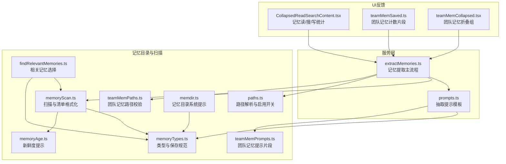
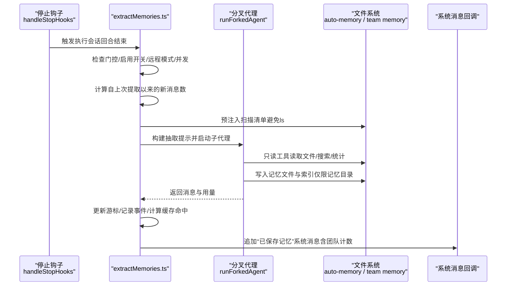
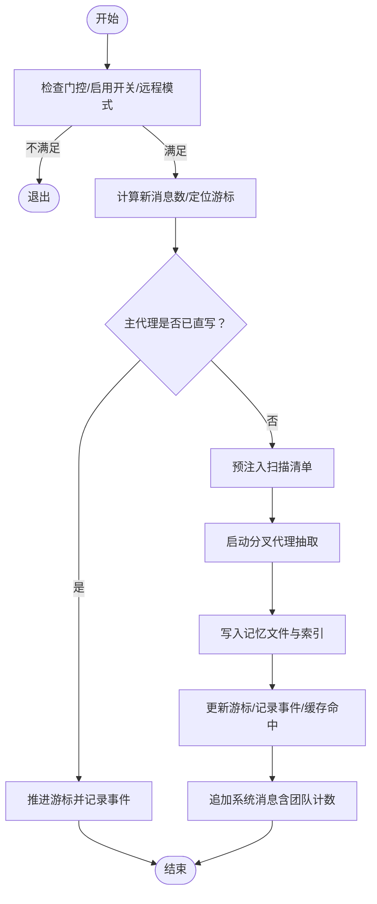
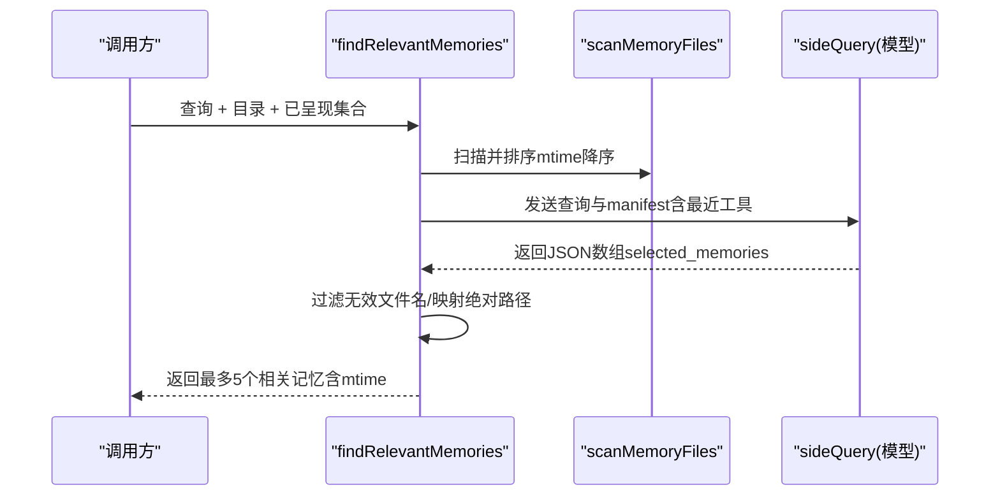
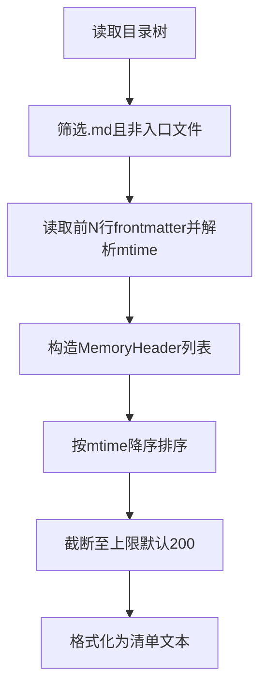
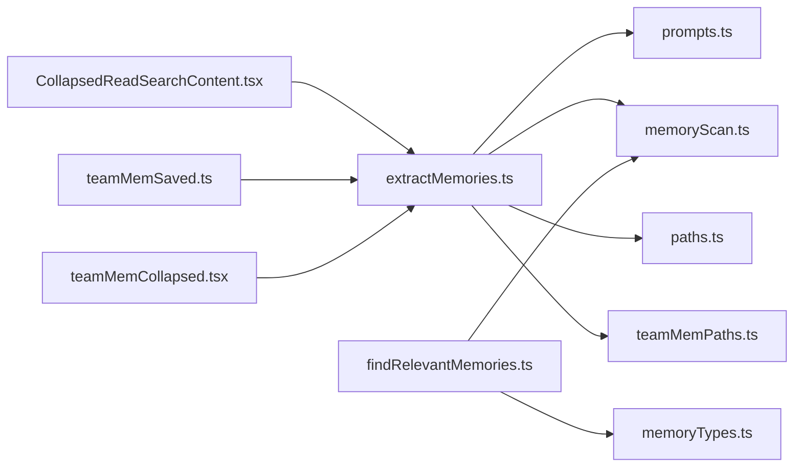

# 记忆提取

<cite>
**本文引用的文件**
- [extractMemories.ts](file://src/services/extractMemories/extractMemories.ts)
- [prompts.ts](file://src/services/extractMemories/prompts.ts)
- [findRelevantMemories.ts](file://src/memdir/findRelevantMemories.ts)
- [memoryScan.ts](file://src/memdir/memoryScan.ts)
- [memoryTypes.ts](file://src/memdir/memoryTypes.ts)
- [memoryAge.ts](file://src/memdir/memoryAge.ts)
- [paths.ts](file://src/memdir/paths.ts)
- [teamMemPaths.ts](file://src/memdir/teamMemPaths.ts)
- [teamMemPrompts.ts](file://src/memdir/teamMemPrompts.ts)
- [memdir.ts](file://src/memdir/memdir.ts)
- [CollapsedReadSearchContent.tsx](file://src/components/messages/CollapsedReadSearchContent.tsx)
- [teamMemSaved.ts](file://src/components/messages/teamMemSaved.ts)
- [teamMemCollapsed.tsx](file://src/components/messages/teamMemCollapsed.tsx)
</cite>

## 目录
1. [简介](#简介)
2. [项目结构](#项目结构)
3. [核心组件](#核心组件)
4. [架构总览](#架构总览)
5. [详细组件分析](#详细组件分析)
6. [依赖关系分析](#依赖关系分析)
7. [性能考量](#性能考量)
8. [故障排查指南](#故障排查指南)
9. [结论](#结论)
10. [附录](#附录)

## 简介
本文件系统性阐述“记忆提取服务”的设计与实现，覆盖以下方面：
- 提取算法：基于会话转录的后台子代理提取、工具权限约束与并发合并策略
- 上下文生成与提示工程：如何构建抽取提示、如何利用现有索引避免重复扫描
- 过滤条件与排序机制：按时间戳排序、去重、选择性回溯
- 触发时机、执行流程与输出格式：何时触发、如何串行化与尾随运行、如何记录结果
- 提示模板优化策略与效果评估：通过指标与遥测评估质量
- 质量控制、性能监控与错误处理：门控、节流、缓存命中率、日志与事件
- 实际应用场景与配置示例：私有/团队记忆、自动日志与索引更新

## 项目结构
记忆提取服务位于服务层，围绕“自动记忆目录”（auto-memory）与“团队记忆目录”（team memory）组织，结合检索与扫描模块共同完成“写入—索引—回显”的闭环。

**图表来源**
- [extractMemories.ts:1-616](file://src/services/extractMemories/extractMemories.ts#L1-L616)
- [prompts.ts:1-155](file://src/services/extractMemories/prompts.ts#L1-L155)
- [memoryScan.ts:1-94](file://src/memdir/memoryScan.ts#L1-L94)
- [findRelevantMemories.ts:1-142](file://src/memdir/findRelevantMemories.ts#L1-L142)
- [memoryTypes.ts:1-272](file://src/memdir/memoryTypes.ts#L1-L272)
- [memoryAge.ts:1-54](file://src/memdir/memoryAge.ts#L1-L54)
- [paths.ts:1-279](file://src/memdir/paths.ts#L1-L279)
- [teamMemPaths.ts:1-293](file://src/memdir/teamMemPaths.ts#L1-L293)
- [teamMemPrompts.ts:52-100](file://src/memdir/teamMemPrompts.ts#L52-L100)
- [memdir.ts:236-255](file://src/memdir/memdir.ts#L236-L255)
- [CollapsedReadSearchContent.tsx:415-444](file://src/components/messages/CollapsedReadSearchContent.tsx#L415-L444)
- [teamMemSaved.ts:1-19](file://src/components/messages/teamMemSaved.ts#L1-L19)
- [teamMemCollapsed.tsx:1-13](file://src/components/messages/teamMemCollapsed.tsx#L1-L13)

**章节来源**
- [extractMemories.ts:1-616](file://src/services/extractMemories/extractMemories.ts#L1-L616)
- [prompts.ts:1-155](file://src/services/extractMemories/prompts.ts#L1-L155)
- [memoryScan.ts:1-94](file://src/memdir/memoryScan.ts#L1-L94)
- [findRelevantMemories.ts:1-142](file://src/memdir/findRelevantMemories.ts#L1-L142)
- [memoryTypes.ts:1-272](file://src/memdir/memoryTypes.ts#L1-L272)
- [memoryAge.ts:1-54](file://src/memdir/memoryAge.ts#L1-L54)
- [paths.ts:1-279](file://src/memdir/paths.ts#L1-L279)
- [teamMemPaths.ts:1-293](file://src/memdir/teamMemPaths.ts#L1-L293)
- [teamMemPrompts.ts:52-100](file://src/memdir/teamMemPrompts.ts#L52-L100)
- [memdir.ts:236-255](file://src/memdir/memdir.ts#L236-L255)
- [CollapsedReadSearchContent.tsx:415-444](file://src/components/messages/CollapsedReadSearchContent.tsx#L415-L444)
- [teamMemSaved.ts:1-19](file://src/components/messages/teamMemSaved.ts#L1-L19)
- [teamMemCollapsed.tsx:1-13](file://src/components/messages/teamMemCollapsed.tsx#L1-L13)

## 核心组件
- 记忆提取主流程（extractMemories.ts）
  - 基于“完美分叉代理”在每次完整对话回合结束时触发，共享父会话的提示缓存
  - 通过游标(lastMemoryMessageUuid)仅处理自上次提取以来新增的消息
  - 若主代理已直接写入记忆文件，则跳过分叉代理以避免冗余
  - 工具权限严格限制为只读读取与对记忆目录的写入
  - 支持节流（turnsSinceLastExtraction）与尾随运行（pendingContext）防止并发冲突
  - 输出：记录事件指标、在系统消息中追加“已保存记忆”提示（含团队记忆计数）

- 抽取提示模板（prompts.ts）
  - 自动记忆模式：四类记忆类型、不区分作用域
  - 团队记忆模式：在类型定义中内嵌scope指引，保存时自动路由到私有或团队目录
  - 统一强调：不要保存可从当前项目状态推导的内容；避免敏感信息进入团队记忆

- 相关记忆选择（findRelevantMemories.ts）
  - 扫描记忆头信息（文件名、最近修改时间、描述、类型），最多200条
  - 使用模型对查询进行选择，返回最相关的若干文件（最多5个）
  - 通过manifest预注入避免额外的ls调用，减少token与延迟

- 扫描与清单（memoryScan.ts）
  - 单次遍历读取前若干行frontmatter，解析mtime与类型，按mtime降序截断至上限
  - 将内存清单格式化为“一行一条”的索引文本，供抽取与检索使用

- 类型与保存规范（memoryTypes.ts）
  - 定义四类记忆：user、feedback、project、reference
  - 明确“不可保存”的内容边界（可从代码/历史推导的信息）
  - 提供“何时访问记忆”“信任回忆前的验证”等指导

- 新鲜度提示（memoryAge.ts）
  - 对超过1天的记忆附加系统提醒，提示其快照性质，建议以当前代码为准

- 路径与启用开关（paths.ts、teamMemPaths.ts）
  - 解析自动记忆根目录与入口文件（MEMORY.md），支持环境变量与设置覆盖
  - 团队记忆路径校验：多层安全检查（字符串级包含、符号链接解析、真实路径比较），拒绝路径穿越与逃逸

- UI反馈（CollapsedReadSearchContent.tsx、teamMemSaved.ts、teamMemCollapsed.tsx）
  - 在消息组中展示“召回/搜索/写入记忆”的统计与动词变化
  - 团队记忆计数片段用于UI段落拼接

**章节来源**
- [extractMemories.ts:1-616](file://src/services/extractMemories/extractMemories.ts#L1-L616)
- [prompts.ts:1-155](file://src/services/extractMemories/prompts.ts#L1-L155)
- [findRelevantMemories.ts:1-142](file://src/memdir/findRelevantMemories.ts#L1-L142)
- [memoryScan.ts:1-94](file://src/memdir/memoryScan.ts#L1-L94)
- [memoryTypes.ts:1-272](file://src/memdir/memoryTypes.ts#L1-L272)
- [memoryAge.ts:1-54](file://src/memdir/memoryAge.ts#L1-L54)
- [paths.ts:1-279](file://src/memdir/paths.ts#L1-L279)
- [teamMemPaths.ts:1-293](file://src/memdir/teamMemPaths.ts#L1-L293)
- [CollapsedReadSearchContent.tsx:415-444](file://src/components/messages/CollapsedReadSearchContent.tsx#L415-L444)
- [teamMemSaved.ts:1-19](file://src/components/messages/teamMemSaved.ts#L1-L19)
- [teamMemCollapsed.tsx:1-13](file://src/components/messages/teamMemCollapsed.tsx#L1-L13)

## 架构总览
记忆提取服务采用“后台子代理 + 权限约束 + 预注入清单”的架构，确保在不干扰主对话的前提下高效、安全地沉淀知识。

**图表来源**
- [extractMemories.ts:527-567](file://src/services/extractMemories/extractMemories.ts#L527-L567)
- [extractMemories.ts:329-523](file://src/services/extractMemories/extractMemories.ts#L329-L523)
- [prompts.ts:29-44](file://src/services/extractMemories/prompts.ts#L29-L44)

**章节来源**
- [extractMemories.ts:527-567](file://src/services/extractMemories/extractMemories.ts#L527-L567)
- [extractMemories.ts:329-523](file://src/services/extractMemories/extractMemories.ts#L329-L523)
- [prompts.ts:29-44](file://src/services/extractMemories/prompts.ts#L29-L44)

## 详细组件分析

### 组件A：记忆提取主流程（extractMemories.ts）
- 触发时机
  - 会话回合结束（无工具调用的最终响应）由停止钩子触发
  - 仅在主代理（非子代理）上下文中运行
- 执行流程
  - 游标推进：仅处理新增消息
  - 主代理直写检测：若主代理已写入记忆文件则跳过分叉代理
  - 预注入清单：扫描记忆目录生成manifest，避免额外ls
  - 分叉代理抽取：构建抽取提示，限制工具权限，最多5轮
  - 结果处理：更新游标、记录事件、在系统消息中追加“已保存记忆”
- 并发与节流
  - inProgress互斥、pendingContext尾随运行、turnsSinceLastExtraction节流
- 输出格式
  - 写入记忆文件与各自目录的索引（MEMORY.md），不在索引中直接写入正文
  - UI消息包含已保存的记忆数量（含团队记忆计数）

**图表来源**
- [extractMemories.ts:527-567](file://src/services/extractMemories/extractMemories.ts#L527-L567)
- [extractMemories.ts:329-523](file://src/services/extractMemories/extractMemories.ts#L329-L523)

**章节来源**
- [extractMemories.ts:296-587](file://src/services/extractMemories/extractMemories.ts#L296-L587)

### 组件B：相关记忆选择（findRelevantMemories.ts）
- 输入：查询语句、记忆目录、最近使用的工具列表、已呈现文件集合
- 处理：
  - 扫描并过滤已呈现文件
  - 构造manifest并传给模型，要求返回明确有用的文件名列表
  - 通过JSON Schema约束输出，过滤无效文件名
- 输出：按mtime透传的绝对路径列表（最多5个）

**图表来源**
- [findRelevantMemories.ts:39-75](file://src/memdir/findRelevantMemories.ts#L39-L75)
- [findRelevantMemories.ts:77-141](file://src/memdir/findRelevantMemories.ts#L77-L141)
- [memoryScan.ts:35-77](file://src/memdir/memoryScan.ts#L35-L77)

**章节来源**
- [findRelevantMemories.ts:1-142](file://src/memdir/findRelevantMemories.ts#L1-L142)
- [memoryScan.ts:1-94](file://src/memdir/memoryScan.ts#L1-L94)

### 组件C：扫描与清单（memoryScan.ts）
- 扫描策略
  - 递归遍历目录，过滤.md且排除入口文件
  - 仅读取前若干行以解析frontmatter，同时获取mtime
  - 按mtime降序排序，截断至上限（默认200）
- 清单格式
  - 每行一个条目，包含类型标签、文件名、时间戳与描述（若有）

**图表来源**
- [memoryScan.ts:35-94](file://src/memdir/memoryScan.ts#L35-L94)

**章节来源**
- [memoryScan.ts:1-94](file://src/memdir/memoryScan.ts#L1-L94)

### 组件D：类型与保存规范（memoryTypes.ts）
- 类型体系
  - user、feedback、project、reference，分别给出when_to_save、how_to_use、body_structure示例
- 不可保存内容
  - 可从当前项目状态推导的信息（代码模式、架构、文件结构、git历史）
  - 调试方案、修复配方、CLAUDE.md已有文档、临时任务细节
- 提示要点
  - 严禁在团队记忆中保存敏感数据
  - 避免重复记忆，优先更新既有条目

**章节来源**
- [memoryTypes.ts:14-272](file://src/memdir/memoryTypes.ts#L14-L272)

### 组件E：路径与启用开关（paths.ts、teamMemPaths.ts）
- 自动记忆路径解析
  - 优先级：环境变量覆盖 > 设置覆盖 > 默认配置目录
  - 项目键：以git根或稳定工作区为基准，统一跨worktree
- 团队记忆路径校验
  - 字符串级包含（resolve后）+ 符号链接解析（realpathDeepestExisting）+ 真实路径前缀匹配
  - 拒绝空字节、URL编码穿越、Unicode归一化攻击、反斜杠、绝对路径、环形链接、越界路径

**章节来源**
- [paths.ts:30-55](file://src/memdir/paths.ts#L30-L55)
- [paths.ts:223-235](file://src/memdir/paths.ts#L223-L235)
- [teamMemPaths.ts:22-64](file://src/memdir/teamMemPaths.ts#L22-L64)
- [teamMemPaths.ts:109-206](file://src/memdir/teamMemPaths.ts#L109-L206)

### 组件F：UI反馈（CollapsedReadSearchContent.tsx、teamMemSaved.ts、teamMemCollapsed.tsx）
- UI统计
  - 展示“召回/搜索/写入记忆”的数量与动词变化
- 团队记忆计数
  - 作为系统消息的一部分，UI侧拼接“X个团队记忆”

**章节来源**
- [CollapsedReadSearchContent.tsx:415-444](file://src/components/messages/CollapsedReadSearchContent.tsx#L415-L444)
- [teamMemSaved.ts:10-19](file://src/components/messages/teamMemSaved.ts#L10-L19)
- [teamMemCollapsed.tsx:11-13](file://src/components/messages/teamMemCollapsed.tsx#L11-L13)

## 依赖关系分析
- 组件耦合
  - extractMemories.ts 依赖 prompts.ts（提示模板）、memoryScan.ts（清单）、paths.ts（目录解析）、teamMemPaths.ts（团队路径校验）
  - findRelevantMemories.ts 依赖 memoryScan.ts（扫描）、memoryTypes.ts（类型约束）
  - UI组件依赖系统消息结构与团队计数字段
- 外部依赖
  - 分叉代理运行框架、模型侧查询接口、文件系统写入权限
- 潜在循环
  - 通过拆分扫描与检索，避免了从memdir.ts到extractMemories.ts的循环导入

**图表来源**
- [extractMemories.ts:1-60](file://src/services/extractMemories/extractMemories.ts#L1-L60)
- [findRelevantMemories.ts:1-12](file://src/memdir/findRelevantMemories.ts#L1-L12)
- [memoryScan.ts:1-12](file://src/memdir/memoryScan.ts#L1-L12)
- [memoryTypes.ts:1-12](file://src/memdir/memoryTypes.ts#L1-L12)
- [paths.ts:1-20](file://src/memdir/paths.ts#L1-L20)
- [teamMemPaths.ts:1-68](file://src/memdir/teamMemPaths.ts#L1-L68)

**章节来源**
- [extractMemories.ts:1-60](file://src/services/extractMemories/extractMemories.ts#L1-L60)
- [findRelevantMemories.ts:1-12](file://src/memdir/findRelevantMemories.ts#L1-L12)
- [memoryScan.ts:1-12](file://src/memdir/memoryScan.ts#L1-L12)
- [memoryTypes.ts:1-12](file://src/memdir/memoryTypes.ts#L1-L12)
- [paths.ts:1-20](file://src/memdir/paths.ts#L1-L20)
- [teamMemPaths.ts:1-68](file://src/memdir/teamMemPaths.ts#L1-L68)

## 性能考量
- 扫描成本控制
  - memoryScan.ts 单次遍历读取前若干行frontmatter，避免双轮stat，大幅降低系统调用
  - 截断上限（默认200）限制后续处理规模
- 抽取效率
  - 预注入清单避免ls调用，减少token与延迟
  - 工具使用限制为只读读取与对记忆目录的写入，降低I/O与安全检查开销
- 缓存与命中
  - 分叉代理共享父会话提示缓存，提高命中率
  - 记录cache_read_input_tokens与输入总量，便于评估命中率
- 并发与尾随运行
  - inProgress互斥 + pendingContext尾随运行，避免重复与丢失
  - turnsSinceLastExtraction节流，降低频繁抽取带来的负载

**章节来源**
- [memoryScan.ts:21-34](file://src/memdir/memoryScan.ts#L21-L34)
- [memoryScan.ts:72-77](file://src/memdir/memoryScan.ts#L72-L77)
- [extractMemories.ts:374-386](file://src/services/extractMemories/extractMemories.ts#L374-L386)
- [extractMemories.ts:440-453](file://src/services/extractMemories/extractMemories.ts#L440-L453)

## 故障排查指南
- 门控与启用开关
  - 若未开启特性门控或禁用自动记忆，提取将直接退出
  - 远程模式下跳过提取
- 并发问题
  - 正在运行时的调用会被暂存为pendingContext，待当前运行结束后以尾随运行处理
  - 若出现长时间阻塞，检查drainPendingExtraction的超时设置
- 工具权限
  - 非只读shell、非记忆目录写入、其他工具均被拒绝；检查canUseTool逻辑与路径归属
- 路径安全
  - 团队记忆路径校验失败会抛出路径穿越错误；检查相对键、符号链接与真实路径
- 错误处理
  - 抽取过程中的异常为尽力而为，记录日志与事件但不中断主线程
- UI反馈
  - 若未看到“已保存记忆”提示，确认系统消息回调是否正确注入，并检查团队计数字段

**章节来源**
- [extractMemories.ts:527-567](file://src/services/extractMemories/extractMemories.ts#L527-L567)
- [extractMemories.ts:497-503](file://src/services/extractMemories/extractMemories.ts#L497-L503)
- [teamMemPaths.ts:22-64](file://src/memdir/teamMemPaths.ts#L22-L64)
- [teamMemPaths.ts:228-256](file://src/memdir/teamMemPaths.ts#L228-L256)

## 结论
记忆提取服务通过“后台分叉代理 + 权限约束 + 预注入清单”的组合，在保证安全性与性能的同时，实现了对会话知识的自动化沉淀。其提示工程与类型规范确保了记忆的高质量与一致性，而遥测与UI反馈提供了可观测性与可追溯性。团队记忆能力在安全校验与路径隔离的基础上，进一步扩展了知识管理的边界。

## 附录
- 实际应用场景
  - 个人偏好与工作风格：user类型记忆帮助模型适配用户视角
  - 项目进展与决策背景：project类型记忆提供上下文与动机
  - 反馈与经验总结：feedback类型记忆沉淀有效做法与规避风险
  - 外部资源索引：reference类型记忆指向外部系统与仪表盘
- 配置示例（路径与开关）
  - 自动记忆根目录：可通过环境变量或设置覆盖
  - 团队记忆启用：需同时满足自动记忆启用与特性开关
  - 索引文件：每个目录（私有/团队）维护独立的MEMORY.md索引
- 提示模板优化策略
  - 通过事件指标（输入/输出token、缓存命中、文件/记忆数量、耗时）评估抽取质量
  - 在系统提示中强调“不要保存可推导内容”，减少噪声与冗余
  - 对超过1天的记忆附加新鲜度提醒，引导以当前代码为准

**章节来源**
- [paths.ts:85-90](file://src/memdir/paths.ts#L85-L90)
- [paths.ts:30-55](file://src/memdir/paths.ts#L30-L55)
- [teamMemPaths.ts:73-78](file://src/memdir/teamMemPaths.ts#L73-L78)
- [teamMemPrompts.ts:52-92](file://src/memdir/teamMemPrompts.ts#L52-L92)
- [memoryAge.ts:33-53](file://src/memdir/memoryAge.ts#L33-L53)
- [memdir.ts:236-255](file://src/memdir/memdir.ts#L236-L255)