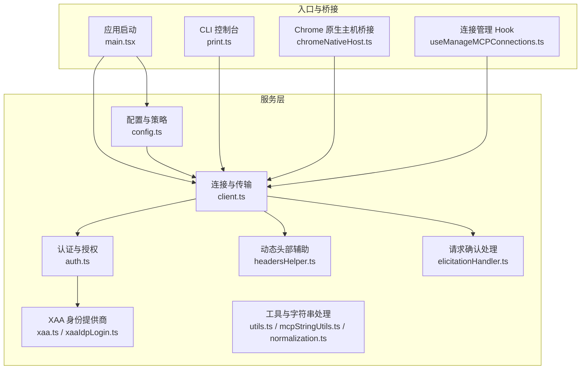
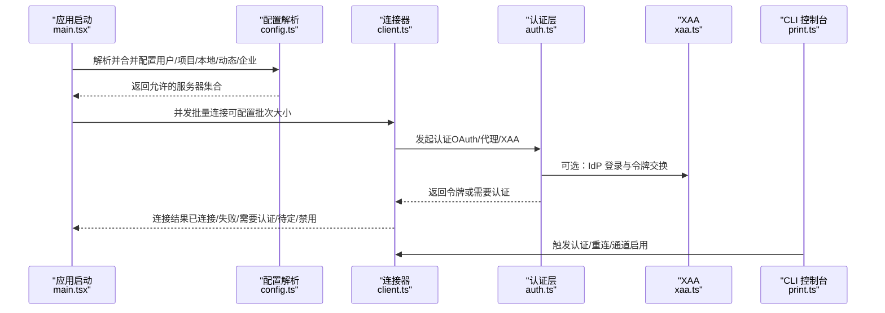
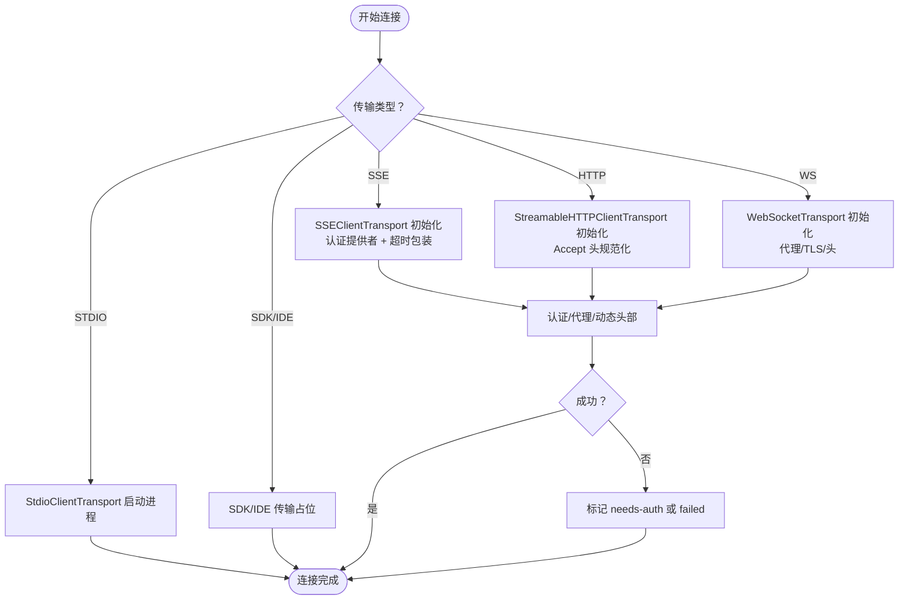
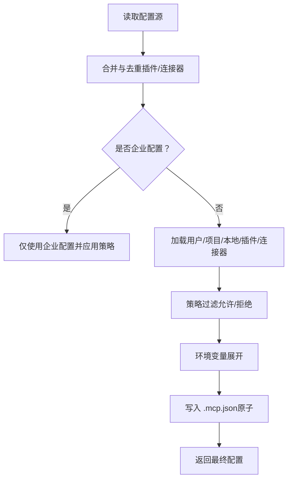
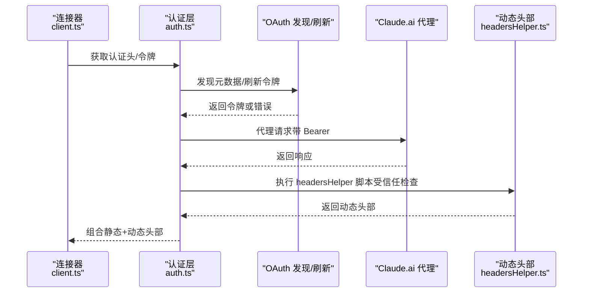
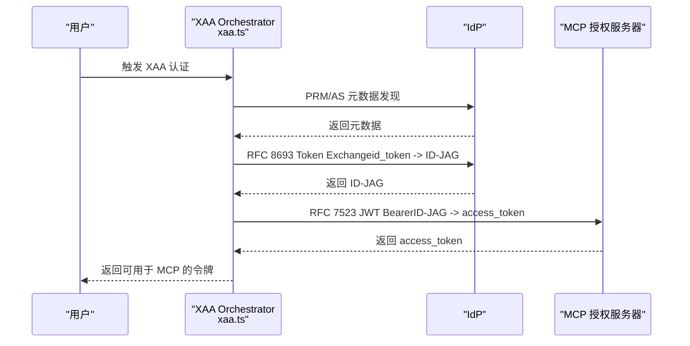
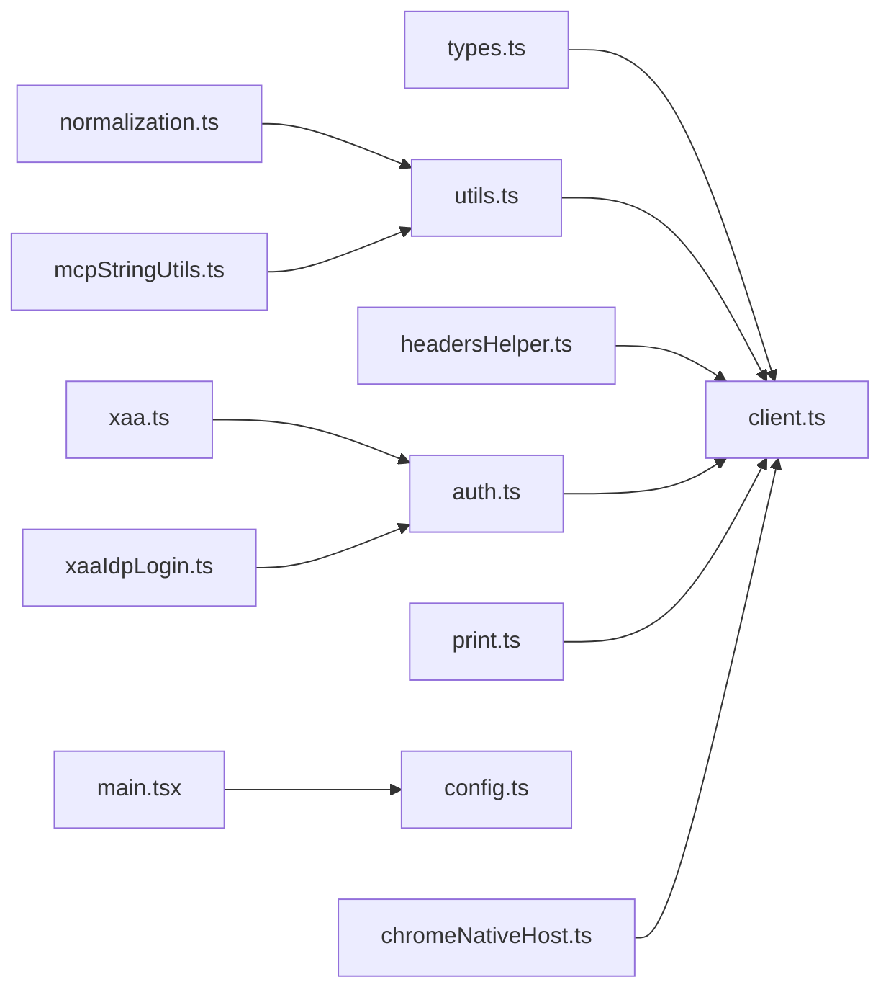

# MCP 协议集成

<cite>
**本文引用的文件**
- [client.ts](file://src/services/mcp/client.ts)
- [config.ts](file://src/services/mcp/config.ts)
- [auth.ts](file://src/services/mcp/auth.ts)
- [types.ts](file://src/services/mcp/types.ts)
- [utils.ts](file://src/services/mcp/utils.ts)
- [headersHelper.ts](file://src/services/mcp/headersHelper.ts)
- [normalization.ts](file://src/services/mcp/normalization.ts)
- [mcpStringUtils.ts](file://src/services/mcp/mcpStringUtils.ts)
- [elicitationHandler.ts](file://src/services/mcp/elicitationHandler.ts)
- [xaa.ts](file://src/services/mcp/xaa.ts)
- [xaaIdpLogin.ts](file://src/services/mcp/xaaIdpLogin.ts)
- [print.ts](file://src/cli/print.ts)
- [main.tsx](file://src/main.tsx)
- [chromeNativeHost.ts](file://src/utils/claudeInChrome/chromeNativeHost.ts)
- [useManageMCPConnections.ts](file://src/services/mcp/useManageMCPConnections.ts)
</cite>

## 目录
1. [简介](#简介)
2. [项目结构](#项目结构)
3. [核心组件](#核心组件)
4. [架构总览](#架构总览)
5. [详细组件分析](#详细组件分析)
6. [依赖关系分析](#依赖关系分析)
7. [性能考量](#性能考量)
8. [故障排查指南](#故障排查指南)
9. [结论](#结论)
10. [附录](#附录)

## 简介
本文件系统性阐述 Claude Code 中 MCP（多方计算协议）集成的设计与实现，覆盖连接管理器架构、服务器发现与连接生命周期、客户端实现、消息协议与数据传输格式、认证与授权、通道权限与资源访问、安全边界、官方注册表与服务器列表、配置管理、实用工具与字符串处理、XAA 身份提供商登录、跨域认证与单点登录支持、连接状态监控、重连机制与故障诊断等。

## 项目结构
MCP 集成主要位于 src/services/mcp 目录下，围绕“配置解析与策略”、“连接与传输”、“认证与授权”、“工具与资源管理”、“实用工具与字符串处理”、“XAA 身份提供商”等模块协同工作；CLI 与主进程负责启动与配置合并，Chrome 扩展桥接负责本地 MCP 客户端与浏览器的消息转发。

图示来源
- [config.ts](file://src/services/mcp/config.ts)
- [client.ts](file://src/services/mcp/client.ts)
- [auth.ts](file://src/services/mcp/auth.ts)
- [xaa.ts](file://src/services/mcp/xaa.ts)
- [xaaIdpLogin.ts](file://src/services/mcp/xaaIdpLogin.ts)
- [utils.ts](file://src/services/mcp/utils.ts)
- [mcpStringUtils.ts](file://src/services/mcp/mcpStringUtils.ts)
- [normalization.ts](file://src/services/mcp/normalization.ts)
- [headersHelper.ts](file://src/services/mcp/headersHelper.ts)
- [elicitationHandler.ts](file://src/services/mcp/elicitationHandler.ts)
- [main.tsx](file://src/main.tsx)
- [print.ts](file://src/cli/print.ts)
- [chromeNativeHost.ts](file://src/utils/claudeInChrome/chromeNativeHost.ts)
- [useManageMCPConnections.ts](file://src/services/mcp/useManageMCPConnections.ts)

章节来源
- [config.ts](file://src/services/mcp/config.ts)
- [client.ts](file://src/services/mcp/client.ts)
- [auth.ts](file://src/services/mcp/auth.ts)
- [main.tsx](file://src/main.tsx)

## 核心组件
- 配置与策略：解析与合并多源配置（用户、项目、本地、动态、企业、claude.ai），执行允许/拒绝策略，去重插件与连接器服务器，环境变量展开，写入 .mcp.json。
- 连接与传输：统一的 connectToServer，封装 SSE/HTTP/WS/stdio/SDK/IDE 传输，超时与 Accept 头规范化，代理与 mTLS 支持，会话缓存与清理。
- 认证与授权：OAuth 发现与刷新、401 自动处理、Claude.ai 代理令牌注入、动态头部辅助、安全存储与密钥链交互。
- 工具与资源：工具/命令/资源按服务器过滤与去重，规范化名称，能力检测与持久化。
- 实用工具与字符串处理：名称归一化、前缀生成、显示名提取、路径描述。
- XAA 身份提供商：PRM/AS 元数据发现、ID-JAG 交换、JWT Bearer 授权、IdP 登录与缓存、跨应用访问。
- 请求确认（Elicitation）：URL/Form 模式、等待态、完成通知、钩子扩展。
- CLI 与桥接：启动时合并配置、动态配置注入、Chrome 消息转发与长度前缀帧。

章节来源
- [config.ts](file://src/services/mcp/config.ts)
- [client.ts](file://src/services/mcp/client.ts)
- [auth.ts](file://src/services/mcp/auth.ts)
- [utils.ts](file://src/services/mcp/utils.ts)
- [mcpStringUtils.ts](file://src/services/mcp/mcpStringUtils.ts)
- [normalization.ts](file://src/services/mcp/normalization.ts)
- [headersHelper.ts](file://src/services/mcp/headersHelper.ts)
- [elicitationHandler.ts](file://src/services/mcp/elicitationHandler.ts)
- [xaa.ts](file://src/services/mcp/xaa.ts)
- [xaaIdpLogin.ts](file://src/services/mcp/xaaIdpLogin.ts)
- [print.ts](file://src/cli/print.ts)
- [main.tsx](file://src/main.tsx)
- [chromeNativeHost.ts](file://src/utils/claudeInChrome/chromeNativeHost.ts)
- [useManageMCPConnections.ts](file://src/services/mcp/useManageMCPConnections.ts)

## 架构总览
MCP 集成采用“配置驱动 + 统一连接器 + 分层认证”的架构。配置层负责来源合并与策略过滤；连接层抽象多种传输；认证层提供 OAuth/XAA/代理令牌；工具层负责资源与能力管理；实用层提供字符串与路径工具；CLI/桥接负责启动与消息转发。

图示来源
- [main.tsx](file://src/main.tsx)
- [config.ts](file://src/services/mcp/config.ts)
- [client.ts](file://src/services/mcp/client.ts)
- [auth.ts](file://src/services/mcp/auth.ts)
- [xaa.ts](file://src/services/mcp/xaa.ts)
- [print.ts](file://src/cli/print.ts)

## 详细组件分析

### 连接管理器与生命周期
- 连接入口 connectToServer：对每个服务器配置进行 memoized 缓存，按类型选择 SSEClientTransport/StreamableHTTP/WS/Stdio/SDK/SSE-IDE/WS-IDE 传输，设置 User-Agent、代理、TLS、会话令牌等。
- 超时与 Accept 头：wrapFetchWithTimeout 为非 GET 请求附加 60 秒超时与 MCP Streamable HTTP Accept 头，避免单次信号超时导致后续请求失败。
- 代理与 mTLS：通过 getWebSocketProxyUrl/getProxyFetchOptions/getWebSocketTLSOptions 注入代理与 TLS 选项。
- 会话与缓存：getSessionIngressAuthToken 支持通过会话入口直连；getServerCacheKey 用于连接缓存键；clearMcpAuthCache 清理认证缓存。
- 连接状态：MCPServerConnection 包含 connected/failed/needs-auth/pending/disabled 五种状态，配合 reconnectMcpServerImpl 实现重连与定时器管理。

图示来源
- [client.ts](file://src/services/mcp/client.ts)

章节来源
- [client.ts](file://src/services/mcp/client.ts)
- [useManageMCPConnections.ts](file://src/services/mcp/useManageMCPConnections.ts)

### 服务器发现与配置管理
- 配置来源：用户级、项目级、本地级、动态参数、企业级、claude.ai 连接器；支持 CLI --mcp-config 覆盖文件配置。
- 策略过滤：allowlist/denylist 支持基于名称、命令数组、URL 模式；企业配置具有独占控制权；插件与连接器去重。
- 环境变量展开：expandEnvVarsInString 支持在命令、URL、头中使用 $VAR。
- 写入 .mcp.json：原子写入、权限保留、错误回滚。
- 项目信任检查：headersHelper 在项目/本地设置下需先获得信任才执行外部脚本。

图示来源
- [config.ts](file://src/services/mcp/config.ts)

章节来源
- [config.ts](file://src/services/mcp/config.ts)
- [headersHelper.ts](file://src/services/mcp/headersHelper.ts)
- [main.tsx](file://src/main.tsx)

### 认证机制与访问控制
- OAuth 发现与刷新：discoverOAuthServerInfo、normalizeOAuthErrorBody、createAuthFetch（30s 超时）；handleOAuth401Error 支持强制刷新与重试。
- Claude.ai 代理：createClaudeAiProxyFetch 注入 Authorization，支持 401 自动刷新与重试。
- 动态头部：getMcpServerHeaders 合并静态与动态头部，动态头部通过 headersHelper 脚本获取，受信任检查保护。
- 安全存储：getServerKey 生成服务器凭据键，revokeServerTokens 支持撤销刷新/访问令牌；clearServerTokensFromLocalStorage 清除本地存储。
- 访问控制：hasMcpDiscoveryButNoToken 判断是否仅有发现而无令牌；isMcpServerAllowedByPolicy/isMcpServerDenied 基于策略判断。

图示来源
- [auth.ts](file://src/services/mcp/auth.ts)
- [headersHelper.ts](file://src/services/mcp/headersHelper.ts)
- [client.ts](file://src/services/mcp/client.ts)

章节来源
- [auth.ts](file://src/services/mcp/auth.ts)
- [headersHelper.ts](file://src/services/mcp/headersHelper.ts)
- [client.ts](file://src/services/mcp/client.ts)

### XAA 身份提供商与跨域认证
- PRM/AS 元数据发现：discoverProtectedResource、discoverAuthorizationServer，校验资源与发行者一致性，要求 HTTPS。
- Token Exchange：requestJwtAuthorizationGrant 使用 IdP 的 token endpoint 将 id_token 换取 ID-JAG。
- JWT Bearer：exchangeJwtAuthGrant 使用 MCP AS 的 token endpoint 将 ID-JAG 换取 access_token。
- IdP 登录：acquireIdpIdToken 支持 PKCE 流程，缓存 id_token；getIdpClientSecret/saveIdpClientSecret 管理 IdP 客户端密钥。
- 错误语义：XaaTokenExchangeError 携带 shouldClearIdToken，区分 4xx/5xx 对 id_token 缓存的影响。

图示来源
- [xaa.ts](file://src/services/mcp/xaa.ts)
- [xaaIdpLogin.ts](file://src/services/mcp/xaaIdpLogin.ts)

章节来源
- [xaa.ts](file://src/services/mcp/xaa.ts)
- [xaaIdpLogin.ts](file://src/services/mcp/xaaIdpLogin.ts)

### 消息协议与数据传输格式
- 传输类型：SSE、HTTP（Streamable-HTTP）、WebSocket、Stdio、SDK、IDE（SSE-IDE/WS-IDE）。
- 超时与 Accept 头：wrapFetchWithTimeout 为 POST 请求附加 Accept: application/json, text/event-stream，GET 保持长连接。
- 长度前缀帧（Chrome 桥接）：chromeNativeHost.ts 使用 4 字节小端长度前缀 + JSON 数据帧，限制最大消息大小，确保可靠收发。

章节来源
- [client.ts](file://src/services/mcp/client.ts)
- [chromeNativeHost.ts](file://src/utils/claudeInChrome/chromeNativeHost.ts)

### 工具与资源管理
- 工具/命令/资源按服务器过滤：filterToolsByServer/filterCommandsByServer/filterResourcesByServer/exclude*ByServer。
- 名称规范化：normalizeNameForMCP、getMcpPrefix/buildMcpToolName、getMcpDisplayName、extractMcpToolDisplayName。
- 能力与指令：ConnectedMCPServer 持有 capabilities/serverInfo/instructions，用于 UI 展示与权限提示。

章节来源
- [utils.ts](file://src/services/mcp/utils.ts)
- [mcpStringUtils.ts](file://src/services/mcp/mcpStringUtils.ts)
- [normalization.ts](file://src/services/mcp/normalization.ts)
- [types.ts](file://src/services/mcp/types.ts)

### 请求确认（Elicitation）流程
- 支持 URL 与表单两种模式；收到 ElicitRequest 时触发 UI 等待态，支持取消/重试；收到 ElicitationCompleteNotification 后标记完成。
- Hooks：runElicitationHooks/runElicitationResultHooks 提供程序化响应与结果钩子扩展。

章节来源
- [elicitationHandler.ts](file://src/services/mcp/elicitationHandler.ts)

### CLI 与桥接
- CLI 控制台：print.ts 处理 channel_enable/mcp_authenticate 等控制消息，触发重连与认证后更新状态。
- 应用启动：main.tsx 合并 --mcp-config 与文件配置，分离 SDK 与常规配置，预加载配置。
- Chrome 桥接：chromeNativeHost.ts 将工具响应/通知以长度前缀帧转发给 MCP 客户端，处理无效长度与异常断开。

章节来源
- [print.ts](file://src/cli/print.ts)
- [main.tsx](file://src/main.tsx)
- [chromeNativeHost.ts](file://src/utils/claudeInChrome/chromeNativeHost.ts)

## 依赖关系分析
- 类型与模式：types.ts 定义配置与连接状态类型；Zod Schema 保障配置校验。
- 连接器依赖：client.ts 依赖 @modelcontextprotocol/sdk 的传输层与类型定义；依赖 utils/* 提供的 HTTP/代理/mTLS/日志/安全存储等。
- 认证依赖：auth.ts 依赖 SDK 的 auth 模块与 OAuth 错误处理；依赖 xaa.ts/xaaIdpLogin.ts 实现 XAA。
- 工具依赖：utils.ts 依赖 normalization.ts/mcpStringUtils.ts 提供名称与显示名处理。
- CLI/桥接：print.ts/main.tsx 依赖 config.ts/client.ts；chromeNativeHost.ts 依赖 client.ts 的传输层。

图示来源
- [types.ts](file://src/services/mcp/types.ts)
- [client.ts](file://src/services/mcp/client.ts)
- [auth.ts](file://src/services/mcp/auth.ts)
- [xaa.ts](file://src/services/mcp/xaa.ts)
- [xaaIdpLogin.ts](file://src/services/mcp/xaaIdpLogin.ts)
- [utils.ts](file://src/services/mcp/utils.ts)
- [normalization.ts](file://src/services/mcp/normalization.ts)
- [mcpStringUtils.ts](file://src/services/mcp/mcpStringUtils.ts)
- [headersHelper.ts](file://src/services/mcp/headersHelper.ts)
- [print.ts](file://src/cli/print.ts)
- [main.tsx](file://src/main.tsx)
- [chromeNativeHost.ts](file://src/utils/claudeInChrome/chromeNativeHost.ts)

章节来源
- [types.ts](file://src/services/mcp/types.ts)
- [client.ts](file://src/services/mcp/client.ts)
- [auth.ts](file://src/services/mcp/auth.ts)
- [xaa.ts](file://src/services/mcp/xaa.ts)
- [xaaIdpLogin.ts](file://src/services/mcp/xaaIdpLogin.ts)
- [utils.ts](file://src/services/mcp/utils.ts)
- [normalization.ts](file://src/services/mcp/normalization.ts)
- [mcpStringUtils.ts](file://src/services/mcp/mcpStringUtils.ts)
- [headersHelper.ts](file://src/services/mcp/headersHelper.ts)
- [print.ts](file://src/cli/print.ts)
- [main.tsx](file://src/main.tsx)
- [chromeNativeHost.ts](file://src/utils/claudeInChrome/chromeNativeHost.ts)

## 性能考量
- 连接批处理：getMcpServerConnectionBatchSize/getRemoteMcpServerConnectionBatchSize 控制并发连接数量，降低资源争用。
- 超时与内存：wrapFetchWithTimeout 使用 setTimeout + 显式清理，避免 AbortSignal.timeout 导致的延迟释放与内存占用。
- 缓存与去重：memoize 缓存连接结果；dedupPluginMcpServers/dedupClaudeAiMcpServers 减少重复连接。
- 日志与可观测：mcpBaseUrlAnalytics/getLoggingSafeMcpBaseUrl 输出安全日志，避免泄露敏感查询参数。

## 故障排查指南
- 连接失败（failed）：检查服务器 URL/代理/TLS/超时；查看连接统计与日志；确认 isMcpSessionExpiredError 判定（404 JSON-RPC -32001）。
- 需要认证（needs-auth）：检查 OAuth 元数据发现、回调端口占用、headersHelper 权限；使用 clearMcpAuthCache 清理缓存后重试。
- 401/403：createClaudeAiProxyFetch 与 handleOAuth401Error 支持自动刷新；XAA 场景检查 IdP 缓存与密钥链。
- 重连问题：reconnectMcpServerImpl 与 reconnectTimersRef 管理定时器；确保未被手动取消；观察 onConnectionAttempt 回调。
- Chrome 桥接：长度前缀帧校验（0 或超过阈值即销毁 socket）；确认 MCP 客户端数量与写入异常日志。

章节来源
- [client.ts](file://src/services/mcp/client.ts)
- [auth.ts](file://src/services/mcp/auth.ts)
- [useManageMCPConnections.ts](file://src/services/mcp/useManageMCPConnections.ts)
- [chromeNativeHost.ts](file://src/utils/claudeInChrome/chromeNativeHost.ts)

## 结论
该 MCP 集成以“配置驱动 + 统一连接 + 分层认证”为核心，覆盖从服务器发现、连接生命周期、认证与授权、工具与资源管理到实用工具与桥接的完整链路。通过策略过滤、动态头部、XAA 跨域认证、请求确认与可观测性，实现了高可用、可扩展且安全的多方计算协议接入方案。

## 附录
- 官方注册表与服务器列表：由企业配置与 claude.ai 连接器提供；策略层保证允许/拒绝规则生效。
- 配置管理：支持多源合并、环境变量展开、原子写入 .mcp.json、项目信任检查。
- 字符串与工具：名称归一化、前缀生成、显示名提取、路径描述与作用域标签。