# OAuth 认证集成

<cite>
**本文档引用的文件**
- [src/services/oauth/auth-code-listener.ts](file://src/services/oauth/auth-code-listener.ts)
- [src/services/oauth/client.ts](file://src/services/oauth/client.ts)
- [src/services/oauth/crypto.ts](file://src/services/oauth/crypto.ts)
- [src/services/oauth/getOauthProfile.ts](file://src/services/oauth/getOauthProfile.ts)
- [src/services/oauth/index.ts](file://src/services/oauth/index.ts)
- [src/constants/oauth.ts](file://src/constants/oauth.ts)
- [src/commands/login/login.tsx](file://src/commands/login/login.tsx)
- [src/commands/logout/logout.tsx](file://src/commands/logout/logout.tsx)
- [src/services/mcp/auth.ts](file://src/services/mcp/auth.ts)
- [src/bridge/jwtUtils.ts](file://src/bridge/jwtUtils.ts)
- [src/bridge/trustedDevice.ts](file://src/bridge/trustedDevice.ts)
</cite>

## 目录
1. [简介](#简介)
2. [项目结构](#项目结构)
3. [核心组件](#核心组件)
4. [架构概览](#架构概览)
5. [详细组件分析](#详细组件分析)
6. [依赖关系分析](#依赖关系分析)
7. [性能考虑](#性能考虑)
8. [故障排除指南](#故障排除指南)
9. [结论](#结论)
10. [附录](#附录)

## 简介

本文件提供了 Claude Code 项目中 OAuth 认证集成的综合技术文档。该实现遵循 OAuth 2.0 授权码流程（PKCE 扩展），支持自动浏览器重定向和手动粘贴两种授权方式。系统包含完整的令牌管理、用户资料获取、账户信息同步、会话维护以及安全验证机制。

## 项目结构

OAuth 认证功能主要分布在以下模块中：

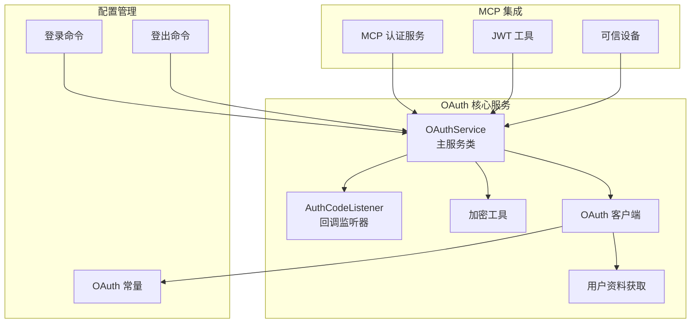

**图表来源**
- [src/services/oauth/index.ts:21-30](file://src/services/oauth/index.ts#L21-L30)
- [src/services/oauth/auth-code-listener.ts:18-30](file://src/services/oauth/auth-code-listener.ts#L18-L30)
- [src/services/oauth/client.ts:1-33](file://src/services/oauth/client.ts#L1-L33)

**章节来源**
- [src/services/oauth/index.ts:1-199](file://src/services/oauth/index.ts#L1-L199)
- [src/services/oauth/auth-code-listener.ts:1-212](file://src/services/oauth/auth-code-listener.ts#L1-L212)
- [src/services/oauth/client.ts:1-567](file://src/services/oauth/client.ts#L1-L567)

## 核心组件

### OAuthService 主服务类

OAuthService 是整个认证流程的核心协调者，负责管理完整的 OAuth 2.0 授权码流程：

- **PKCE 参数生成**：自动生成 code_verifier 和 state
- **多流支持**：同时支持自动浏览器重定向和手动粘贴输入
- **令牌格式化**：将响应转换为统一的 OAuthTokens 结构
- **资源清理**：确保服务器和相关资源正确释放

### AuthCodeListener 回调监听器

实现本地 HTTP 服务器来捕获 OAuth 提供商的重定向回调：

- **CSRF 保护**：通过 state 参数验证防止跨站请求伪造
- **状态验证**：确保回调参数的完整性和正确性
- **自动重定向**：根据授予的作用域选择合适的成功页面
- **错误处理**：优雅处理各种异常情况并提供反馈

### 加密工具模块

提供 OAuth 2.0 PKCE 所需的安全加密功能：

- **随机数生成**：使用 crypto 模块生成安全的随机字节
- **编码转换**：实现 RFC 7636 要求的 URL 安全 Base64 编码
- **哈希计算**：使用 SHA-256 生成 code_challenge

**章节来源**
- [src/services/oauth/index.ts:21-199](file://src/services/oauth/index.ts#L21-L199)
- [src/services/oauth/auth-code-listener.ts:18-212](file://src/services/oauth/auth-code-listener.ts#L18-L212)
- [src/services/oauth/crypto.ts:1-24](file://src/services/oauth/crypto.ts#L1-L24)

## 架构概览

OAuth 认证系统采用分层架构设计，确保安全性、可扩展性和用户体验：

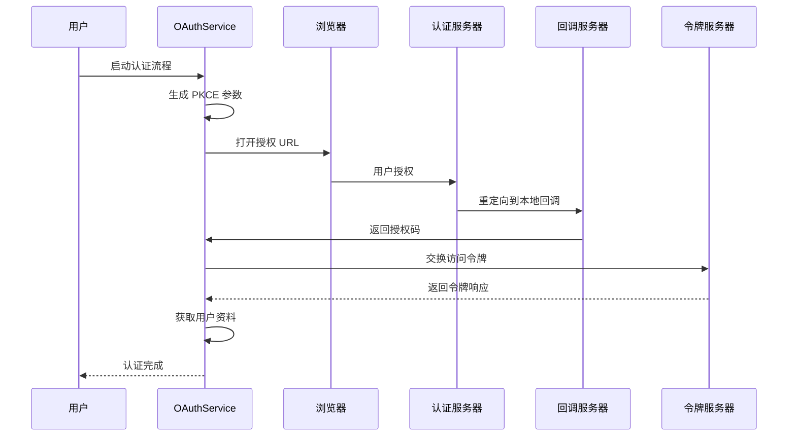

**图表来源**
- [src/services/oauth/index.ts:32-132](file://src/services/oauth/index.ts#L32-L132)
- [src/services/oauth/auth-code-listener.ts:125-175](file://src/services/oauth/auth-code-listener.ts#L125-L175)

## 详细组件分析

### OAuth 客户端配置

OAuth 客户端配置支持多种环境和部署场景：

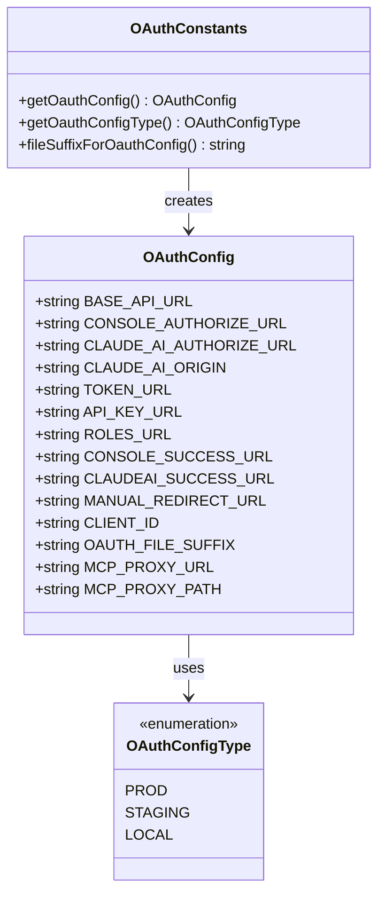

**图表来源**
- [src/constants/oauth.ts:60-81](file://src/constants/oauth.ts#L60-L81)
- [src/constants/oauth.ts:186-235](file://src/constants/oauth.ts#L186-L235)

系统支持三种配置类型：
- **生产环境**：使用官方 Anthropic 服务端点
- **预发布环境**：用于测试和开发验证
- **本地开发环境**：支持自定义本地服务端点

### 授权流程实现

完整的 OAuth 2.0 授权码流程包含以下关键步骤：

#### 自动授权流程

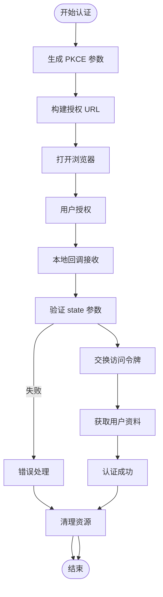

**图表来源**
- [src/services/oauth/index.ts:32-132](file://src/services/oauth/index.ts#L32-L132)
- [src/services/oauth/auth-code-listener.ts:152-175](file://src/services/oauth/auth-code-listener.ts#L152-L175)

#### 手动授权流程

手动流程提供备用方案，适用于无头环境或浏览器限制场景：

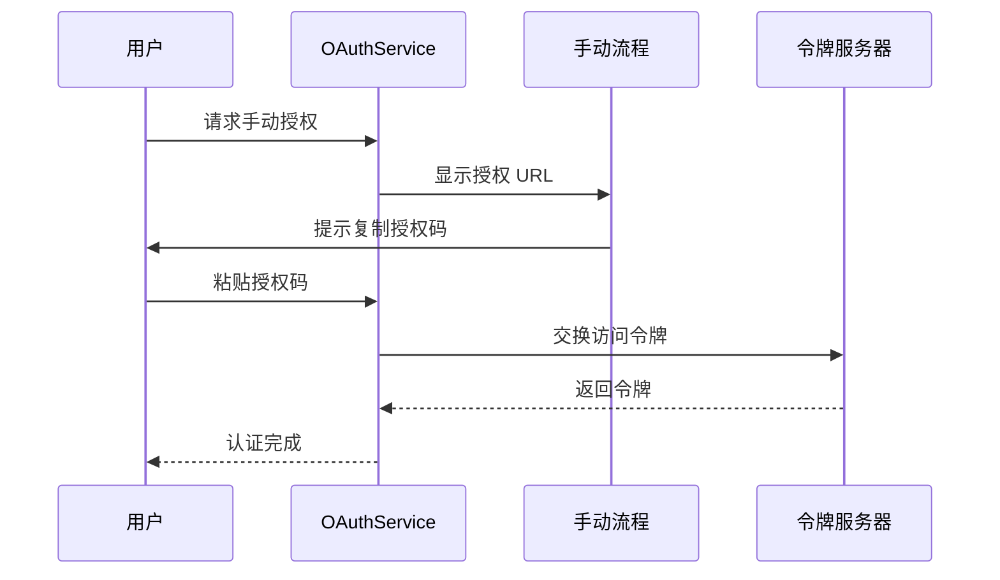

**图表来源**
- [src/services/oauth/index.ts:134-167](file://src/services/oauth/index.ts#L134-L167)

### 令牌管理机制

系统实现了完整的令牌生命周期管理：

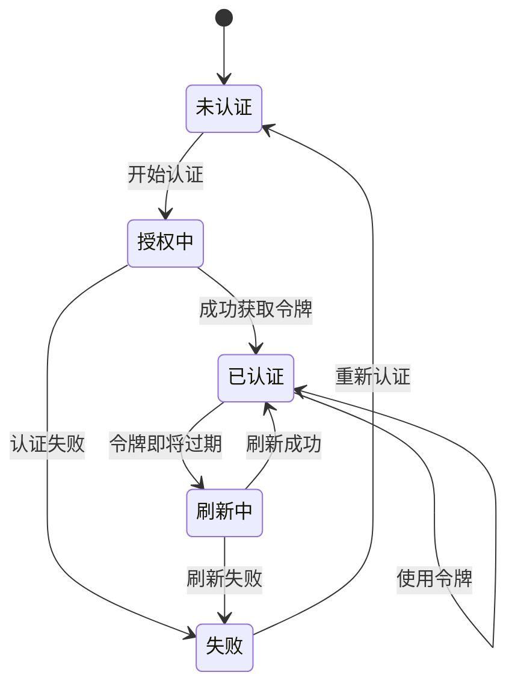

**图表来源**
- [src/services/oauth/client.ts:146-274](file://src/services/oauth/client.ts#L146-L274)

令牌管理特性包括：
- **自动刷新**：在令牌过期前自动刷新
- **错误恢复**：处理刷新失败并回退到重新认证
- **状态持久化**：安全存储令牌和相关状态
- **作用域管理**：动态管理所需的作用域权限

### 用户资料获取

用户资料获取支持多种数据源和缓存策略：

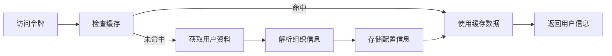

**图表来源**
- [src/services/oauth/client.ts:355-420](file://src/services/oauth/client.ts#L355-L420)

用户资料包含：
- **订阅类型**：基于组织类型的订阅级别
- **速率限制**：当前的 API 使用限制
- **计费信息**：账单类型和相关元数据
- **显示名称**：用户的公开显示名称

### 安全验证机制

系统实施多层次的安全验证措施：

#### CSRF 防护

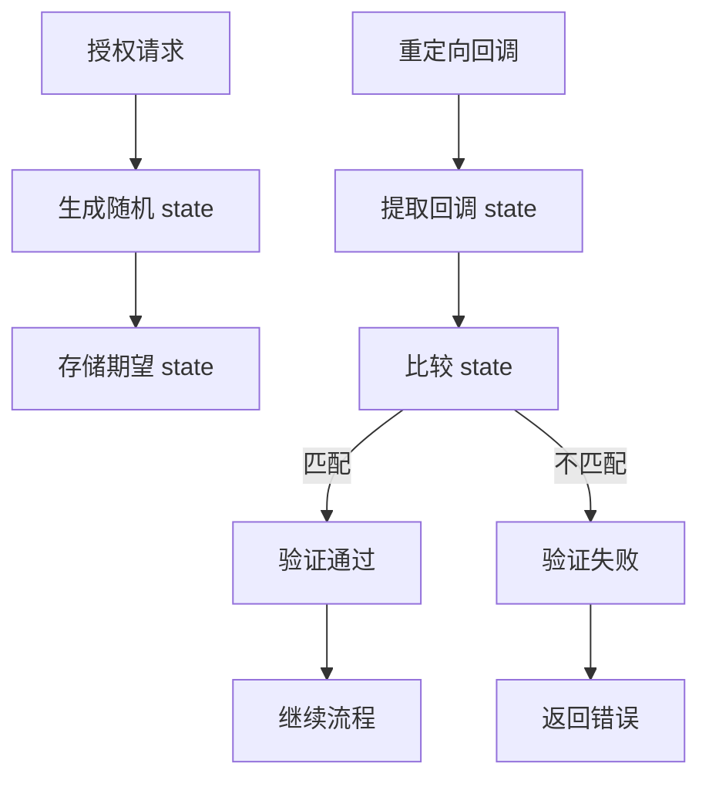

**图表来源**
- [src/services/oauth/auth-code-listener.ts:152-175](file://src/services/oauth/auth-code-listener.ts#L152-L175)

#### 令牌安全存储

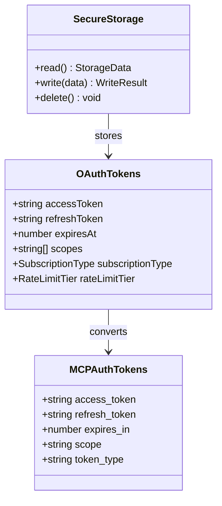

**图表来源**
- [src/services/mcp/auth.ts:1704-1702](file://src/services/mcp/auth.ts#L1704-L1702)

**章节来源**
- [src/services/oauth/auth-code-listener.ts:152-175](file://src/services/oauth/auth-code-listener.ts#L152-L175)
- [src/services/oauth/client.ts:355-420](file://src/services/oauth/client.ts#L355-L420)
- [src/services/mcp/auth.ts:1704-1702](file://src/services/mcp/auth.ts#L1704-L1702)

## 依赖关系分析

OAuth 认证系统的依赖关系呈现清晰的层次结构：

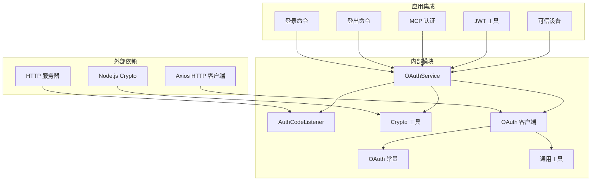

**图表来源**
- [src/services/oauth/index.ts:1-13](file://src/services/oauth/index.ts#L1-L13)
- [src/services/oauth/client.ts:1-23](file://src/services/oauth/client.ts#L1-L23)

**章节来源**
- [src/services/oauth/index.ts:1-13](file://src/services/oauth/index.ts#L1-L13)
- [src/services/oauth/client.ts:1-23](file://src/services/oauth/client.ts#L1-L23)

## 性能考虑

### 缓存策略

系统实现了多级缓存机制以优化性能：

1. **令牌缓存**：避免频繁的令牌刷新请求
2. **用户资料缓存**：减少重复的 API 调用
3. **配置缓存**：加速启动时的配置加载
4. **网络请求缓存**：利用 HTTP 缓存头优化响应时间

### 连接池管理

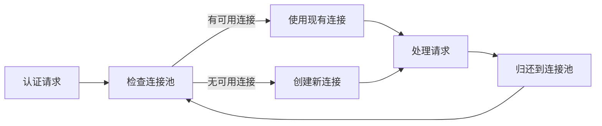

### 超时和重试机制

系统采用指数退避算法处理网络超时：

- **初始延迟**：1 秒
- **最大延迟**：30 秒  
- **最大重试次数**：3 次
- **超时配置**：15 秒（令牌交换）

## 故障排除指南

### 常见问题诊断

#### 回调服务器启动失败

**症状**：无法启动本地回调服务器
**可能原因**：
- 端口被占用
- 权限不足
- 网络配置问题

**解决方案**：
1. 检查端口可用性
2. 以管理员权限运行
3. 验证防火墙设置

#### CSRF 验证失败

**症状**：收到 "Invalid state parameter" 错误
**可能原因**：
- 浏览器安全策略阻止
- 网络代理干扰
- 时间不同步

**解决方案**：
1. 清除浏览器缓存
2. 检查代理设置
3. 同步系统时间

#### 令牌刷新失败

**症状**：访问令牌过期但刷新失败
**可能原因**：
- 刷新令牌无效
- 作用域变更
- 服务器端问题

**解决方案**：
1. 触发重新认证
2. 检查网络连接
3. 验证服务器状态

### 日志和监控

系统提供详细的日志记录用于故障诊断：

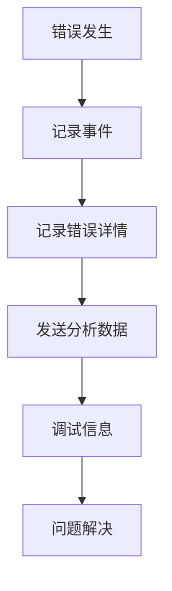

**章节来源**
- [src/services/oauth/auth-code-listener.ts:177-181](file://src/services/oauth/auth-code-listener.ts#L177-L181)
- [src/services/oauth/client.ts:259-273](file://src/services/oauth/client.ts#L259-L273)

## 结论

Claude Code 的 OAuth 认证集成实现了企业级的安全标准和用户体验。系统通过以下关键特性确保了可靠性：

- **安全性**：完整的 PKCE 实现、CSRF 防护、安全存储
- **可靠性**：多层错误处理、自动重试、优雅降级
- **可扩展性**：模块化设计、环境配置、MCP 集成
- **用户体验**：双流支持、自动重定向、无缝切换

该实现为类似项目提供了优秀的参考模板，展示了如何在实际生产环境中平衡安全性、性能和可用性。

## 附录

### 配置选项

| 配置项 | 类型 | 默认值 | 描述 |
|--------|------|--------|------|
| CLAUDE_CODE_CUSTOM_OAUTH_URL | string | undefined | 自定义 OAuth 服务器地址 |
| CLAUDE_CODE_OAUTH_CLIENT_ID | string | undefined | 自定义客户端 ID |
| USER_TYPE | string | undefined | 用户类型（ant） |
| USE_LOCAL_OAUTH | boolean | false | 启用本地 OAuth |
| USE_STAGING_OAUTH | boolean | false | 启用预发布 OAuth |

### 环境变量

- **CLAUDE_CODE_CUSTOM_OAUTH_URL**：允许的自定义 OAuth 基础 URL 列表
- **CLAUDE_CODE_OAUTH_CLIENT_ID**：覆盖默认客户端 ID
- **CLAUDE_CODE_ACCOUNT_UUID**：SDK 环境变量覆盖
- **CLAUDE_CODE_USER_EMAIL**：用户邮箱环境变量
- **CLAUDE_CODE_ORGANIZATION_UUID**：组织 UUID 环境变量

### 支持的作用域

- **user:profile**：获取用户个人资料
- **user:inference**：访问推理 API
- **user:sessions:claude_code**：访问 Claude Code 会话
- **user:mcp_servers**：管理 MCP 服务器
- **user:file_upload**：文件上传权限