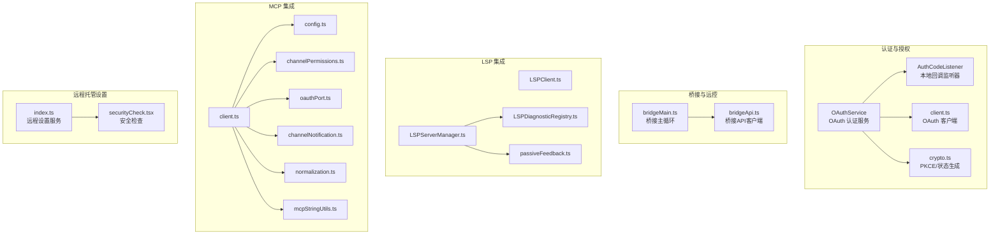
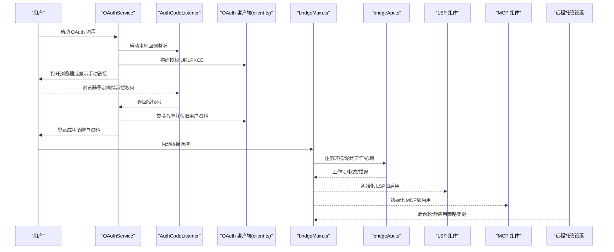
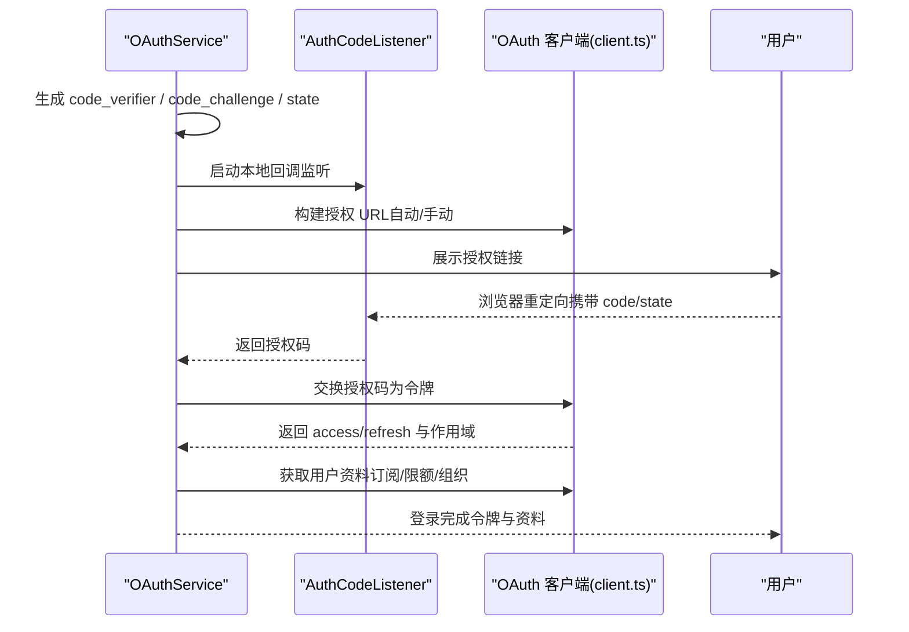
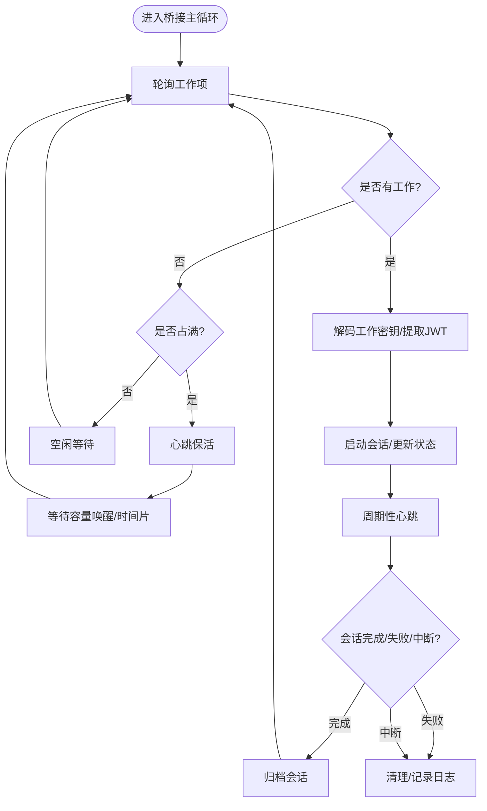
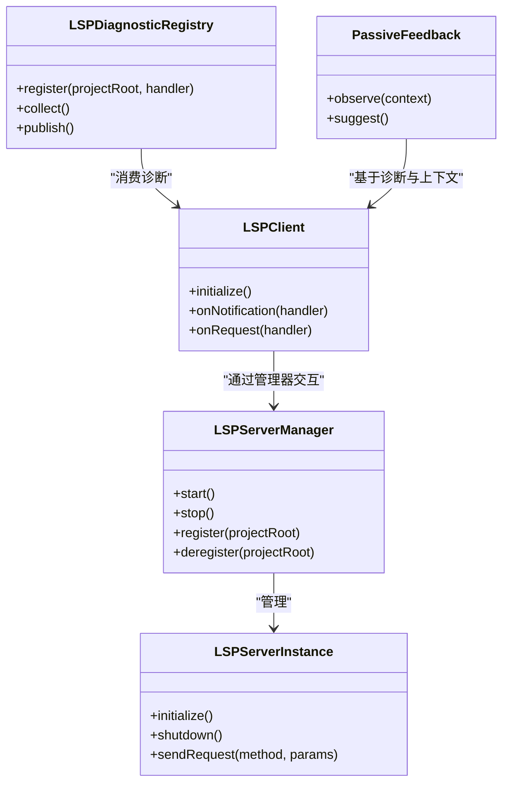
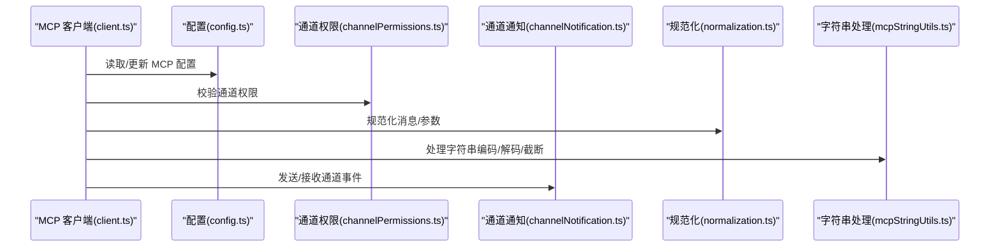
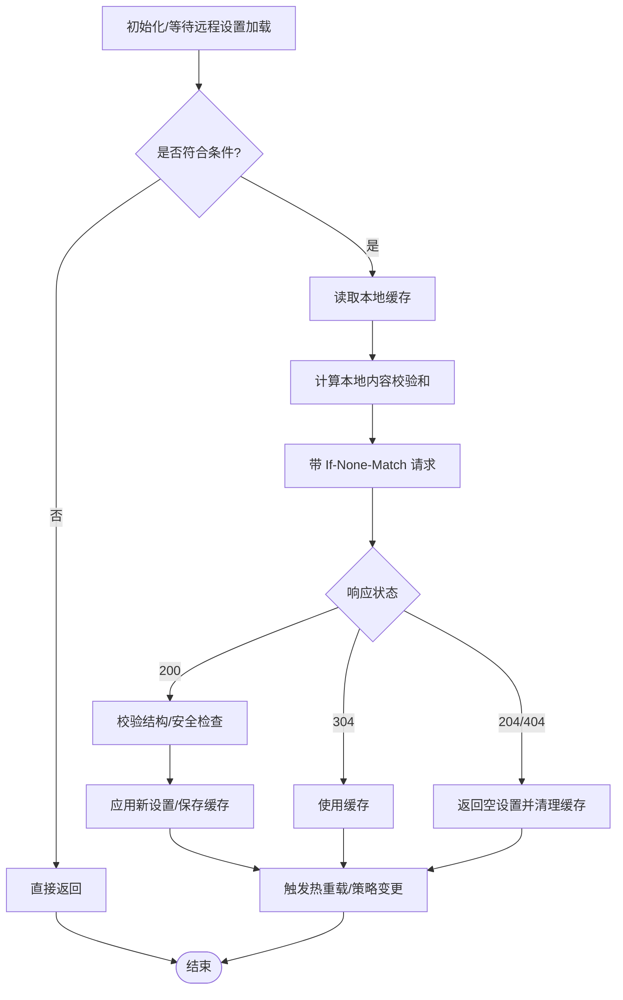
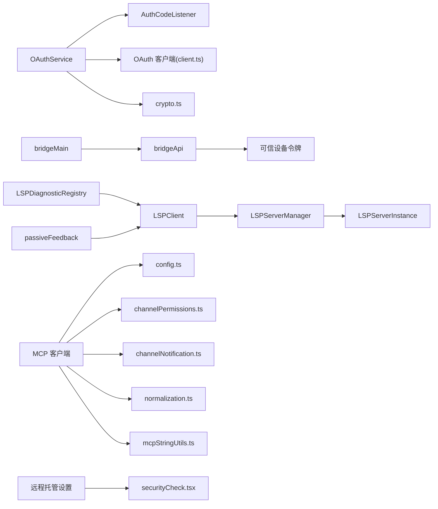

# 外部集成

<cite>
**本文引用的文件**
- [OAuth服务：OAuthService](file://src/services/oauth/index.ts)
- [OAuth认证码监听器：AuthCodeListener](file://src/services/oauth/auth-code-listener.ts)
- [OAuth客户端：client.ts](file://src/services/oauth/client.ts)
- [OAuth加密工具：crypto.ts](file://src/services/oauth/crypto.ts)
- [远程托管设置服务：index.ts](file://src/services/remoteManagedSettings/index.ts)
- [远程托管设置安全检查：securityCheck.tsx](file://src/services/remoteManagedSettings/securityCheck.tsx)
- [桥接主循环：bridgeMain.ts](file://src/bridge/bridgeMain.ts)
- [桥接API客户端：bridgeApi.ts](file://src/bridge/bridgeApi.ts)
- [LSP 客户端：LSPClient.ts](file://src/services/lsp/LSPClient.ts)
- [LSP 诊断注册：LSPDiagnosticRegistry.ts](file://src/services/lsp/LSPDiagnosticRegistry.ts)
- [LSP 服务器实例：LSPServerInstance.ts](file://src/services/lsp/LSPServerInstance.ts)
- [LSP 服务器管理器：LSPServerManager.ts](file://src/services/lsp/LSPServerManager.ts)
- [LSP 管理器：manager.ts](file://src/services/lsp/manager.ts)
- [LSP 被动反馈：passiveFeedback.ts](file://src/services/lsp/passiveFeedback.ts)
- [MCP 客户端：client.ts](file://src/services/mcp/client.ts)
- [MCP 配置：config.ts](file://src/services/mcp/config.ts)
- [MCP 通道权限：channelPermissions.ts](file://src/services/mcp/channelPermissions.ts)
- [MCP OAuth端口：oauthPort.ts](file://src/services/mcp/oauthPort.ts)
- [MCP 通道通知：channelNotification.ts](file://src/services/mcp/channelNotification.ts)
- [MCP 规范化：normalization.ts](file://src/services/mcp/normalization.ts)
- [MCP 字符串处理：mcpStringUtils.ts](file://src/services/mcp/mcpStringUtils.ts)
</cite>

## 目录
1. [简介](#简介)
2. [项目结构](#项目结构)
3. [核心组件](#核心组件)
4. [架构总览](#架构总览)
5. [详细组件分析](#详细组件分析)
6. [依赖关系分析](#依赖关系分析)
7. [性能考量](#性能考量)
8. [故障排除指南](#故障排除指南)
9. [结论](#结论)
10. [附录](#附录)

## 简介
本文件面向“外部集成服务”的综合技术文档，聚焦以下能力与流程：
- 语言服务器协议（LSP）集成：包括服务器管理、诊断注册、被动反馈机制。
- OAuth 认证：授权码流程、本地回调监听、用户资料获取与令牌刷新。
- MCP 协议：连接管理、通道权限与身份验证、通道通知与规范化。
- 远程设置管理：同步、安全检查、缓存与降级策略。

文档在保证技术深度的同时，尽量以渐进方式呈现，便于不同背景读者理解。

## 项目结构
围绕外部集成的关键模块分布如下：
- 认证与授权：OAuth 服务、加密工具、认证码监听器、OAuth 客户端。
- 桥接与远控：桥接主循环、桥接 API 客户端、会话与心跳管理。
- LSP 集成：LSP 客户端、服务器管理器、诊断注册、被动反馈。
- MCP 集成：MCP 客户端、通道权限、通知、规范化与字符串处理。
- 远程托管设置：设置同步、安全检查、缓存与轮询。

**图表来源**
- [OAuth服务：OAuthService:21-199](file://src/services/oauth/index.ts#L21-L199)
- [OAuth认证码监听器：AuthCodeListener:18-212](file://src/services/oauth/auth-code-listener.ts#L18-L212)
- [OAuth客户端：client.ts:1-567](file://src/services/oauth/client.ts#L1-L567)
- [OAuth加密工具：crypto.ts:1-24](file://src/services/oauth/crypto.ts#L1-L24)
- [桥接主循环：bridgeMain.ts:141-800](file://src/bridge/bridgeMain.ts#L141-L800)
- [桥接API客户端：bridgeApi.ts:68-540](file://src/bridge/bridgeApi.ts#L68-L540)
- [LSP 客户端：LSPClient.ts](file://src/services/lsp/LSPClient.ts)
- [LSP 诊断注册：LSPDiagnosticRegistry.ts](file://src/services/lsp/LSPDiagnosticRegistry.ts)
- [LSP 服务器管理器：LSPServerManager.ts](file://src/services/lsp/LSPServerManager.ts)
- [LSP 被动反馈：passiveFeedback.ts](file://src/services/lsp/passiveFeedback.ts)
- [MCP 客户端：client.ts](file://src/services/mcp/client.ts)
- [MCP 配置：config.ts](file://src/services/mcp/config.ts)
- [MCP 通道权限：channelPermissions.ts](file://src/services/mcp/channelPermissions.ts)
- [MCP OAuth端口：oauthPort.ts](file://src/services/mcp/oauthPort.ts)
- [MCP 通道通知：channelNotification.ts](file://src/services/mcp/channelNotification.ts)
- [MCP 规范化：normalization.ts](file://src/services/mcp/normalization.ts)
- [MCP 字符串处理：mcpStringUtils.ts](file://src/services/mcp/mcpStringUtils.ts)
- [远程托管设置服务：index.ts:1-639](file://src/services/remoteManagedSettings/index.ts#L1-L639)
- [远程托管设置安全检查：securityCheck.tsx:1-74](file://src/services/remoteManagedSettings/securityCheck.tsx#L1-L74)

**章节来源**
- [OAuth服务：OAuthService:21-199](file://src/services/oauth/index.ts#L21-L199)
- [桥接主循环：bridgeMain.ts:141-800](file://src/bridge/bridgeMain.ts#L141-L800)

## 核心组件
- OAuthService：封装 PKCE 授权码流程，支持自动与手动两种授权码获取路径；负责令牌交换、用户资料获取与格式化返回。
- AuthCodeListener：本地 HTTP 服务器，用于捕获浏览器重定向中的授权码，完成 CSRF 校验与响应。
- bridgeMain：桥接主循环，负责工作轮询、会话生命周期、心跳、容量唤醒与错误回退。
- bridgeApi：桥接 API 客户端，统一处理鉴权头、重试、错误分类与致命错误抛出。
- LSP 组件族：LSPClient、LSPServerManager、LSPDiagnosticRegistry、passiveFeedback，覆盖服务器生命周期、诊断注册与被动反馈。
- MCP 组件族：client、config、channelPermissions、oauthPort、channelNotification、normalization、mcpStringUtils，覆盖连接、权限、通知与数据规范化。
- 远程托管设置：index.ts 提供设置拉取、校验、缓存、安全检查与后台轮询；securityCheck.tsx 提供交互式安全确认。

**章节来源**
- [OAuth服务：OAuthService:21-199](file://src/services/oauth/index.ts#L21-L199)
- [OAuth认证码监听器：AuthCodeListener:18-212](file://src/services/oauth/auth-code-listener.ts#L18-L212)
- [桥接主循环：bridgeMain.ts:141-800](file://src/bridge/bridgeMain.ts#L141-L800)
- [桥接API客户端：bridgeApi.ts:68-540](file://src/bridge/bridgeApi.ts#L68-L540)
- [远程托管设置服务：index.ts:1-639](file://src/services/remoteManagedSettings/index.ts#L1-L639)
- [远程托管设置安全检查：securityCheck.tsx:1-74](file://src/services/remoteManagedSettings/securityCheck.tsx#L1-L74)

## 架构总览
下图展示了外部集成的关键交互：OAuth 登录驱动 MCP/LSP/桥接初始化；桥接主循环与 API 客户端协调远控；LSP/MCP 在各自通道内进行数据与权限管理；远程托管设置提供策略与安全控制。

**图表来源**
- [OAuth服务：OAuthService:32-132](file://src/services/oauth/index.ts#L32-L132)
- [OAuth认证码监听器：AuthCodeListener:37-175](file://src/services/oauth/auth-code-listener.ts#L37-L175)
- [OAuth客户端：client.ts:107-144](file://src/services/oauth/client.ts#L107-L144)
- [桥接主循环：bridgeMain.ts:600-784](file://src/bridge/bridgeMain.ts#L600-L784)
- [桥接API客户端：bridgeApi.ts:141-451](file://src/bridge/bridgeApi.ts#L141-L451)
- [远程托管设置服务：index.ts:514-555](file://src/services/remoteManagedSettings/index.ts#L514-L555)

## 详细组件分析

### OAuth 认证与授权
- 授权码流程
  - 生成 code_verifier 与 code_challenge（PKCE），生成 state 用于 CSRF。
  - 自动模式：打开浏览器访问授权 URL，本地 HTTP 服务器监听回调；手动模式：向用户展示授权 URL，用户复制授权码。
  - 收到授权码后，调用令牌交换接口，解析作用域与账户信息，获取订阅类型与限额等级等用户资料。
  - 成功后根据是否为自动模式决定是否发送成功跳转页面；失败时发送错误跳转并清理资源。
- 加密与状态
  - 使用 SHA-256 与 Base64URL 编码生成 code_challenge 与 state，确保安全。
- 用户资料与令牌刷新
  - 通过访问令牌获取组织与账户信息，推导订阅类型与限额等级；支持刷新令牌并按需写入全局配置。

**图表来源**
- [OAuth服务：OAuthService:32-132](file://src/services/oauth/index.ts#L32-L132)
- [OAuth认证码监听器：AuthCodeListener:37-175](file://src/services/oauth/auth-code-listener.ts#L37-L175)
- [OAuth客户端：client.ts:107-144](file://src/services/oauth/client.ts#L107-L144)
- [OAuth加密工具：crypto.ts:11-23](file://src/services/oauth/crypto.ts#L11-L23)

**章节来源**
- [OAuth服务：OAuthService:21-199](file://src/services/oauth/index.ts#L21-L199)
- [OAuth认证码监听器：AuthCodeListener:18-212](file://src/services/oauth/auth-code-listener.ts#L18-L212)
- [OAuth客户端：client.ts:1-567](file://src/services/oauth/client.ts#L1-L567)
- [OAuth加密工具：crypto.ts:1-24](file://src/services/oauth/crypto.ts#L1-L24)

### 桥接主循环与远控
- 主循环职责
  - 周期性轮询工作项，处理空闲与占满两种模式下的不同节流策略；在占满时仅心跳而不轮询，避免过度请求。
  - 会话生命周期管理：启动、完成、中断、归档；超时检测与清理；容量唤醒以提升吞吐。
  - 心跳与令牌刷新：对会话进行心跳保活；针对不同版本会话采用不同令牌刷新策略（OAuth 或服务端重新派发）。
- API 客户端
  - 统一注入鉴权头、运行器版本与可信设备令牌；对 401 场景尝试刷新并重试一次；对 403/404/410 等错误进行致命错误分类与抛出。
  - 提供注册环境、轮询工作、确认工作、停止工作、注销环境、归档会话、重新连接会话、心跳等接口。

**图表来源**
- [桥接主循环：bridgeMain.ts:600-784](file://src/bridge/bridgeMain.ts#L600-L784)
- [桥接API客户端：bridgeApi.ts:199-451](file://src/bridge/bridgeApi.ts#L199-L451)

**章节来源**
- [桥接主循环：bridgeMain.ts:141-800](file://src/bridge/bridgeMain.ts#L141-L800)
- [桥接API客户端：bridgeApi.ts:68-540](file://src/bridge/bridgeApi.ts#L68-L540)

### LSP 集成
- 服务器管理
  - LSPServerManager 负责服务器生命周期与实例管理；LSPServerInstance 封装单个 LSP 实例；LSPClient 提供客户端能力。
- 诊断注册
  - LSPDiagnosticRegistry 负责收集与注册诊断信息，支持跨文件与多源诊断聚合。
- 被动反馈
  - passiveFeedback 提供基于上下文的被动建议与反馈机制，改善用户体验。

**图表来源**
- [LSP 服务器管理器：LSPServerManager.ts](file://src/services/lsp/LSPServerManager.ts)
- [LSP 服务器实例：LSPServerInstance.ts](file://src/services/lsp/LSPServerInstance.ts)
- [LSP 客户端：LSPClient.ts](file://src/services/lsp/LSPClient.ts)
- [LSP 诊断注册：LSPDiagnosticRegistry.ts](file://src/services/lsp/LSPDiagnosticRegistry.ts)
- [LSP 被动反馈：passiveFeedback.ts](file://src/services/lsp/passiveFeedback.ts)

**章节来源**
- [LSP 客户端：LSPClient.ts](file://src/services/lsp/LSPClient.ts)
- [LSP 诊断注册：LSPDiagnosticRegistry.ts](file://src/services/lsp/LSPDiagnosticRegistry.ts)
- [LSP 服务器实例：LSPServerInstance.ts](file://src/services/lsp/LSPServerInstance.ts)
- [LSP 服务器管理器：LSPServerManager.ts](file://src/services/lsp/LSPServerManager.ts)
- [LSP 管理器：manager.ts](file://src/services/lsp/manager.ts)
- [LSP 被动反馈：passiveFeedback.ts](file://src/services/lsp/passiveFeedback.ts)

### MCP 协议与通道管理
- 连接与配置
  - client.ts 提供 MCP 客户端能力；config.ts 管理 MCP 配置；oauthPort.ts 提供 OAuth 端口相关能力。
- 权限与通知
  - channelPermissions.ts 管理通道权限；channelNotification.ts 提供通道事件通知；normalization.ts 对消息进行规范化；mcpStringUtils.ts 提供字符串处理工具。
- 身份验证
  - 通过 OAuth 端口与令牌进行身份验证，结合通道权限控制访问范围。

**图表来源**
- [MCP 客户端：client.ts](file://src/services/mcp/client.ts)
- [MCP 配置：config.ts](file://src/services/mcp/config.ts)
- [MCP 通道权限：channelPermissions.ts](file://src/services/mcp/channelPermissions.ts)
- [MCP OAuth端口：oauthPort.ts](file://src/services/mcp/oauthPort.ts)
- [MCP 通道通知：channelNotification.ts](file://src/services/mcp/channelNotification.ts)
- [MCP 规范化：normalization.ts](file://src/services/mcp/normalization.ts)
- [MCP 字符串处理：mcpStringUtils.ts](file://src/services/mcp/mcpStringUtils.ts)

**章节来源**
- [MCP 客户端：client.ts](file://src/services/mcp/client.ts)
- [MCP 配置：config.ts](file://src/services/mcp/config.ts)
- [MCP 通道权限：channelPermissions.ts](file://src/services/mcp/channelPermissions.ts)
- [MCP OAuth端口：oauthPort.ts](file://src/services/mcp/oauthPort.ts)
- [MCP 通道通知：channelNotification.ts](file://src/services/mcp/channelNotification.ts)
- [MCP 规范化：normalization.ts](file://src/services/mcp/normalization.ts)
- [MCP 字符串处理：mcpStringUtils.ts](file://src/services/mcp/mcpStringUtils.ts)

### 远程托管设置管理
- 同步与缓存
  - index.ts 提供加载、刷新、后台轮询与缓存一致性保障；使用 ETag（checksum）进行缓存命中判断；失败时优雅降级使用旧缓存。
- 安全检查
  - securityCheck.tsx 在检测到危险设置变更时弹出交互式确认对话框，用户拒绝则终止进程，确保企业策略安全落地。
- 认证与合规
  - 支持 API Key 与 OAuth 双认证路径；对无权限场景跳过重试；对超时/网络错误进行分类处理。

**图表来源**
- [远程托管设置服务：index.ts:514-639](file://src/services/remoteManagedSettings/index.ts#L514-L639)
- [远程托管设置安全检查：securityCheck.tsx:22-74](file://src/services/remoteManagedSettings/securityCheck.tsx#L22-L74)

**章节来源**
- [远程托管设置服务：index.ts:1-639](file://src/services/remoteManagedSettings/index.ts#L1-L639)
- [远程托管设置安全检查：securityCheck.tsx:1-74](file://src/services/remoteManagedSettings/securityCheck.tsx#L1-L74)

## 依赖关系分析
- OAuthService 依赖 AuthCodeListener、OAuth 客户端与加密工具；OAuth 客户端依赖常量配置与用户资料获取。
- bridgeMain 依赖 bridgeApi 与会话/工作树管理；bridgeApi 依赖可信设备令牌与 OAuth 刷新回调。
- LSP 组件之间存在清晰的分层依赖：管理器管理实例，客户端通过管理器交互；诊断注册与被动反馈依赖客户端。
- MCP 组件围绕 client.ts 展开，配置、权限、通知、规范化与字符串处理作为支撑模块。
- 远程托管设置服务依赖安全检查组件与设置变更检测器，形成“拉取-校验-应用-通知”的闭环。

**图表来源**
- [OAuth服务：OAuthService:21-199](file://src/services/oauth/index.ts#L21-L199)
- [OAuth认证码监听器：AuthCodeListener:18-212](file://src/services/oauth/auth-code-listener.ts#L18-L212)
- [OAuth客户端：client.ts:1-567](file://src/services/oauth/client.ts#L1-L567)
- [OAuth加密工具：crypto.ts:1-24](file://src/services/oauth/crypto.ts#L1-L24)
- [桥接主循环：bridgeMain.ts:141-800](file://src/bridge/bridgeMain.ts#L141-L800)
- [桥接API客户端：bridgeApi.ts:68-540](file://src/bridge/bridgeApi.ts#L68-L540)
- [LSP 服务器管理器：LSPServerManager.ts](file://src/services/lsp/LSPServerManager.ts)
- [LSP 服务器实例：LSPServerInstance.ts](file://src/services/lsp/LSPServerInstance.ts)
- [LSP 客户端：LSPClient.ts](file://src/services/lsp/LSPClient.ts)
- [LSP 诊断注册：LSPDiagnosticRegistry.ts](file://src/services/lsp/LSPDiagnosticRegistry.ts)
- [LSP 被动反馈：passiveFeedback.ts](file://src/services/lsp/passiveFeedback.ts)
- [MCP 客户端：client.ts](file://src/services/mcp/client.ts)
- [MCP 配置：config.ts](file://src/services/mcp/config.ts)
- [MCP 通道权限：channelPermissions.ts](file://src/services/mcp/channelPermissions.ts)
- [MCP 通道通知：channelNotification.ts](file://src/services/mcp/channelNotification.ts)
- [MCP 规范化：normalization.ts](file://src/services/mcp/normalization.ts)
- [MCP 字符串处理：mcpStringUtils.ts](file://src/services/mcp/mcpStringUtils.ts)
- [远程托管设置服务：index.ts:1-639](file://src/services/remoteManagedSettings/index.ts#L1-L639)
- [远程托管设置安全检查：securityCheck.tsx:1-74](file://src/services/remoteManagedSettings/securityCheck.tsx#L1-L74)

**章节来源**
- [桥接主循环：bridgeMain.ts:141-800](file://src/bridge/bridgeMain.ts#L141-L800)
- [桥接API客户端：bridgeApi.ts:68-540](file://src/bridge/bridgeApi.ts#L68-L540)

## 性能考量
- 桥接轮询与节流
  - 占满时仅心跳，避免频繁轮询；空闲与部分占满采用不同间隔，降低服务器压力。
  - 对于长时间无工作项，使用指数退避与最大上限，防止抖动。
- LSP 与 MCP
  - 服务器管理器与客户端分离，减少耦合；诊断注册与被动反馈异步化，避免阻塞主线程。
  - MCP 的规范化与字符串处理在边界处进行，减少重复计算。
- 远程托管设置
  - 使用 ETag 与本地缓存减少网络流量；失败降级使用旧缓存，保证可用性；后台轮询间隔较长，避免频繁请求。

[本节为通用指导，无需特定文件来源]

## 故障排除指南
- OAuth 登录失败
  - 检查本地回调监听端口是否被占用；确认 state 参数匹配；查看授权 URL 是否正确拼接。
  - 若为 401/403，确认令牌是否过期或作用域不足；必要时触发刷新。
- 桥接远控异常
  - 关注 401/403/404/410 错误类型，区分是否为会话过期或权限不足；检查可信设备令牌是否正确注入。
  - 占满时仅心跳导致无工作项属预期行为；确认节流配置与容量唤醒逻辑。
- LSP 诊断不更新
  - 确认诊断注册已正确绑定；检查被动反馈上下文是否有效；核对服务器实例是否正常初始化。
- MCP 权限问题
  - 核对通道权限配置；检查通知与规范化处理是否正确；确认字符串处理未引入异常字符。
- 远程托管设置
  - 若出现“无设置”或“404”，确认认证凭据与作用域；检查安全检查对话框是否被非交互模式忽略；必要时清理缓存并重试。

**章节来源**
- [OAuth认证码监听器：AuthCodeListener:134-175](file://src/services/oauth/auth-code-listener.ts#L134-L175)
- [OAuth客户端：client.ts:107-144](file://src/services/oauth/client.ts#L107-L144)
- [桥接API客户端：bridgeApi.ts:454-508](file://src/bridge/bridgeApi.ts#L454-L508)
- [远程托管设置服务：index.ts:209-361](file://src/services/remoteManagedSettings/index.ts#L209-L361)

## 结论
该外部集成体系以 OAuth 为基础，串联桥接远控、LSP 与 MCP，并通过远程托管设置实现企业级策略与安全控制。各组件职责清晰、边界明确，具备良好的可扩展性与健壮性。通过合理的缓存与降级策略、严格的权限与安全检查，系统在复杂外部环境中仍能保持稳定与高效。

[本节为总结，无需特定文件来源]

## 附录
- 集成配置要点
  - OAuth：确保 CLIENT_ID、授权与令牌端点配置正确；PKCE 参数与 state 校验必须严格。
  - 桥接：合理设置轮询间隔、占满节流与心跳周期；启用可信设备令牌以增强安全性。
  - LSP：按项目根目录注册服务器；确保诊断注册与被动反馈链路畅通。
  - MCP：通道权限最小化原则；规范化与字符串处理遵循协议约束。
  - 远程托管设置：优先使用 API Key；在 OAuth 模式下确保 profile 作用域；开启安全检查对话框。

[本节为通用指导，无需特定文件来源]