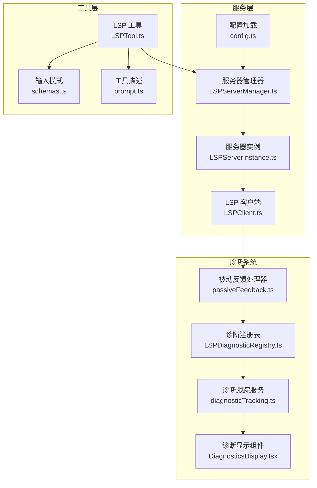
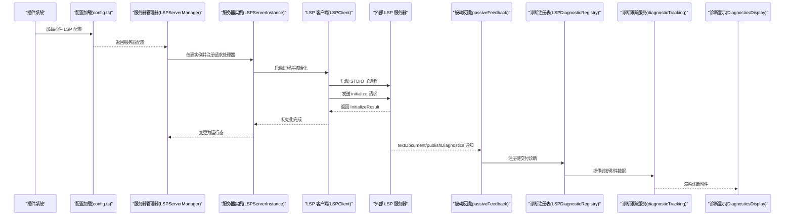
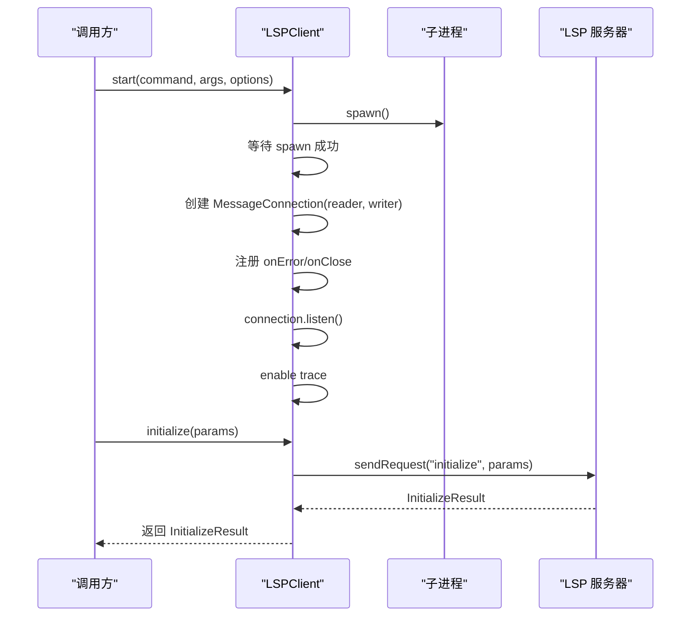
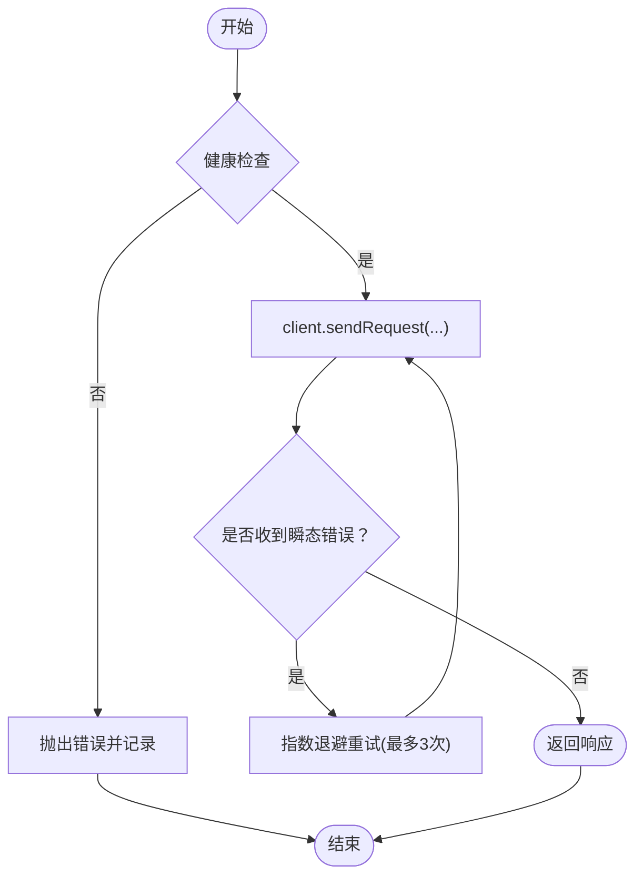
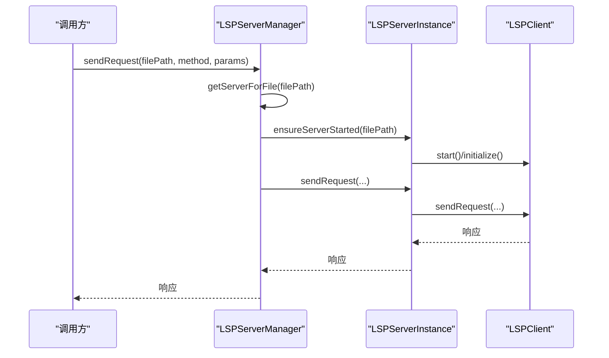
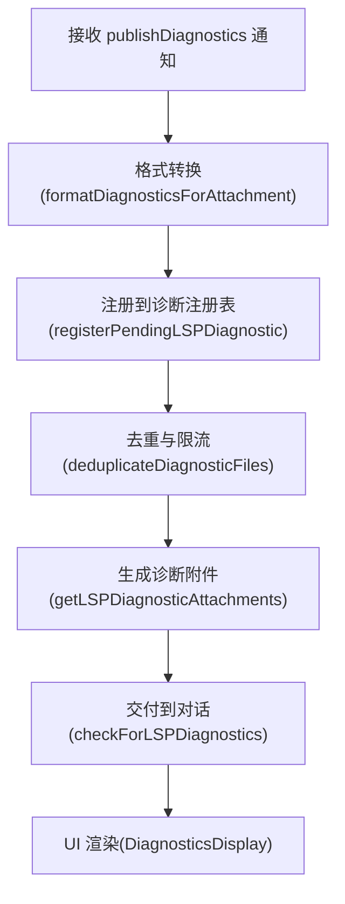
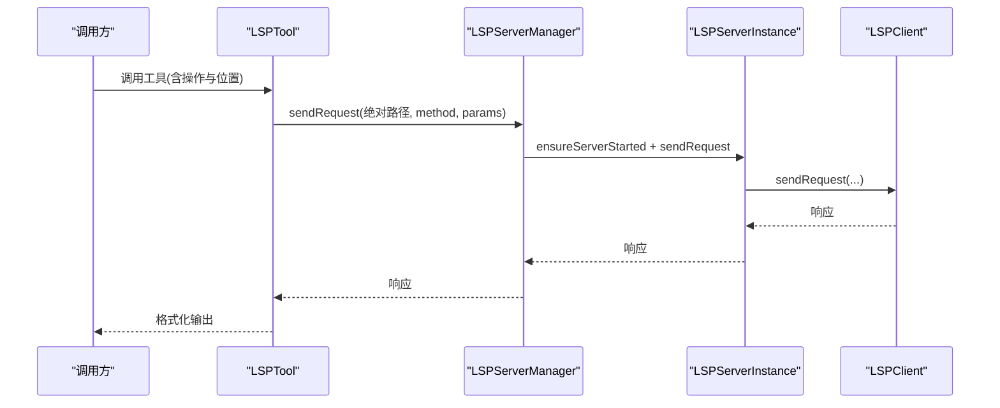
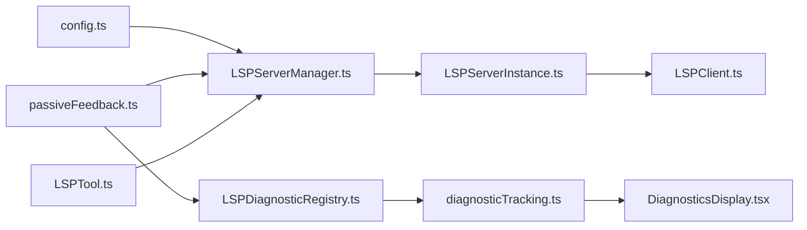

# 语言服务器协议集成

<cite>
**本文档引用的文件**
- [LSPClient.ts](file://src/services/lsp/LSPClient.ts)
- [LSPServerInstance.ts](file://src/services/lsp/LSPServerInstance.ts)
- [LSPServerManager.ts](file://src/services/lsp/LSPServerManager.ts)
- [LSPDiagnosticRegistry.ts](file://src/services/lsp/LSPDiagnosticRegistry.ts)
- [passiveFeedback.ts](file://src/services/lsp/passiveFeedback.ts)
- [config.ts](file://src/services/lsp/config.ts)
- [LSPTool.ts](file://src/tools/LSPTool/LSPTool.ts)
- [schemas.ts](file://src/tools/LSPTool/schemas.ts)
- [prompt.ts](file://src/tools/LSPTool/prompt.ts)
- [diagnosticTracking.ts](file://src/services/diagnosticTracking.ts)
- [DiagnosticsDisplay.tsx](file://src/components/DiagnosticsDisplay.tsx)
</cite>

## 目录
1. [简介](#简介)
2. [项目结构](#项目结构)
3. [核心组件](#核心组件)
4. [架构总览](#架构总览)
5. [详细组件分析](#详细组件分析)
6. [依赖关系分析](#依赖关系分析)
7. [性能考虑](#性能考虑)
8. [故障排查指南](#故障排查指南)
9. [结论](#结论)
10. [附录](#附录)

## 简介
本文件面向需要在应用中集成语言服务器协议（LSP）的开发者，系统性阐述客户端实现、服务器管理、诊断注册与被动反馈机制、请求/通知处理、以及与工具链（如 LSPTool）的协作方式。内容覆盖从进程启动、JSON-RPC 连接、初始化握手、文件同步、到诊断收集与 UI 展示的完整流程，并提供性能优化、重试与故障恢复策略。

## 项目结构
围绕 LSP 的核心模块位于 `src/services/lsp/`，工具层位于 `src/tools/LSPTool/`，诊断系统与 UI 组件位于 `src/services/diagnosticTracking.ts` 和 `src/components/DiagnosticsDisplay.tsx`。

图表来源
- [config.ts:15-79](file://src/services/lsp/config.ts#L15-L79)
- [LSPServerManager.ts:59-420](file://src/services/lsp/LSPServerManager.ts#L59-L420)
- [LSPServerInstance.ts:90-493](file://src/services/lsp/LSPServerInstance.ts#L90-L493)
- [LSPClient.ts:51-447](file://src/services/lsp/LSPClient.ts#L51-L447)
- [passiveFeedback.ts:125-328](file://src/services/lsp/passiveFeedback.ts#L125-L328)
- [LSPDiagnosticRegistry.ts:65-386](file://src/services/lsp/LSPDiagnosticRegistry.ts#L65-L386)
- [diagnosticTracking.ts:330-343](file://src/services/diagnosticTracking.ts#L330-L343)
- [DiagnosticsDisplay.tsx:1-55](file://src/components/DiagnosticsDisplay.tsx#L1-L55)
- [LSPTool.ts:35-334](file://src/tools/LSPTool/LSPTool.ts#L35-L334)
- [schemas.ts:1-215](file://src/tools/LSPTool/schemas.ts#L1-L215)
- [prompt.ts:1-21](file://src/tools/LSPTool/prompt.ts#L1-L21)

章节来源
- [LSPServerManager.ts:59-148](file://src/services/lsp/LSPServerManager.ts#L59-L148)
- [LSPServerInstance.ts:90-149](file://src/services/lsp/LSPServerInstance.ts#L90-L149)
- [LSPClient.ts:51-104](file://src/services/lsp/LSPClient.ts#L51-L104)
- [config.ts:15-79](file://src/services/lsp/config.ts#L15-L79)

## 核心组件
- LSP 客户端（LSPClient）
  - 基于 vscode-jsonrpc 的消息连接封装，负责进程启动、STDIO 读写、协议追踪、请求/通知收发、错误处理与资源清理。
- LSP 服务器实例（LSPServerInstance）
  - 单个 LSP 服务器生命周期管理：状态机（stopped/starting/running/stopping/error）、健康检查、自动重启限制、请求重试（针对“内容已修改”等瞬态错误）。
- LSP 服务器管理器（LSPServerManager）
  - 多服务器路由与调度：按文件扩展名映射到服务器、确保服务器启动、文件同步（didOpen/didChange/didSave/didClose）、统一请求转发。
- 诊断注册表与被动反馈（LSPDiagnosticRegistry + passiveFeedback）
  - 接收 LSP 服务器的 textDocument/publishDiagnostics 通知，进行格式转换、去重、限流、跨轮次去重、异步挂载交付。
- LSP 工具（LSPTool）
  - 将 LSP 操作（定义跳转、引用查找、悬停信息、符号浏览等）暴露为可被调用的工具接口，支持输入校验与结果格式化。

章节来源
- [LSPClient.ts:21-41](file://src/services/lsp/LSPClient.ts#L21-L41)
- [LSPServerInstance.ts:33-65](file://src/services/lsp/LSPServerInstance.ts#L33-L65)
- [LSPServerManager.ts:16-43](file://src/services/lsp/LSPServerManager.ts#L16-L43)
- [LSPDiagnosticRegistry.ts:9-21](file://src/services/lsp/LSPDiagnosticRegistry.ts#L9-L21)
- [passiveFeedback.ts:117-124](file://src/services/lsp/passiveFeedback.ts#L117-L124)
- [LSPTool.ts:55-124](file://src/tools/LSPTool/LSPTool.ts#L55-L124)

## 架构总览
下图展示了从插件配置加载、服务器实例化、连接建立、请求/通知处理，到诊断被动反馈与 UI 展示的全链路。

图表来源
- [config.ts:15-79](file://src/services/lsp/config.ts#L15-L79)
- [LSPServerManager.ts:71-148](file://src/services/lsp/LSPServerManager.ts#L71-L148)
- [LSPServerInstance.ts:135-264](file://src/services/lsp/LSPServerInstance.ts#L135-L264)
- [LSPClient.ts:88-254](file://src/services/lsp/LSPClient.ts#L88-L254)
- [passiveFeedback.ts:125-328](file://src/services/lsp/passiveFeedback.ts#L125-L328)
- [LSPDiagnosticRegistry.ts:65-338](file://src/services/lsp/LSPDiagnosticRegistry.ts#L65-L338)
- [diagnosticTracking.ts:330-343](file://src/services/diagnosticTracking.ts#L330-L343)
- [DiagnosticsDisplay.tsx:1-55](file://src/components/DiagnosticsDisplay.tsx#L1-L55)

## 详细组件分析

### LSP 客户端（LSPClient）
- 职责
  - 进程启动与 STDIO 管理、JSON-RPC 连接建立、协议追踪、请求/通知发送、错误与关闭事件处理、优雅停止。
- 关键特性
  - 懒初始化：连接就绪前的 handler 会排队，连接建立后批量应用。
  - 错误隔离：连接错误与进程错误分别处理；退出码非零时标记启动失败并触发上层崩溃回调。
  - 日志与调试：对 STDERR 输出与协议追踪进行统一记录。
- 典型调用序列

图表来源
- [LSPClient.ts:88-254](file://src/services/lsp/LSPClient.ts#L88-L254)
- [LSPClient.ts:256-287](file://src/services/lsp/LSPClient.ts#L256-L287)

章节来源
- [LSPClient.ts:51-447](file://src/services/lsp/LSPClient.ts#L51-L447)

### LSP 服务器实例（LSPServerInstance）
- 职责
  - 生命周期管理：stopped/starting/running/stopping/error 状态机；手动重启次数限制；崩溃恢复计数。
  - 健康检查：基于状态与初始化标志位判断是否可发送请求。
  - 请求重试：对特定瞬态错误（如“内容已修改”）进行指数退避重试。
- 关键流程

图表来源
- [LSPServerInstance.ts:355-410](file://src/services/lsp/LSPServerInstance.ts#L355-L410)

章节来源
- [LSPServerInstance.ts:90-493](file://src/services/lsp/LSPServerInstance.ts#L90-L493)

### LSP 服务器管理器（LSPServerManager）
- 职责
  - 从插件配置加载多服务器配置，构建扩展名到服务器映射，按需启动对应服务器，统一分发请求。
  - 文件同步：didOpen/didChange/didSave/didClose，确保先 didOpen 再 didChange。
- 关键流程

图表来源
- [LSPServerManager.ts:214-263](file://src/services/lsp/LSPServerManager.ts#L214-L263)
- [LSPServerManager.ts:270-400](file://src/services/lsp/LSPServerManager.ts#L270-L400)

章节来源
- [LSPServerManager.ts:59-420](file://src/services/lsp/LSPServerManager.ts#L59-L420)
- [config.ts:15-79](file://src/services/lsp/config.ts#L15-L79)

### 诊断注册与被动反馈（passiveFeedback + LSPDiagnosticRegistry）
- 工作原理
  - 服务器通过 textDocument/publishDiagnostics 主动推送诊断。
  - 被动反馈处理器将 LSP 格式转换为内部诊断格式，注册到诊断注册表。
  - 注册表执行跨批与跨轮次去重、限流（每文件与总量上限），并标记已投递。
  - 诊断跟踪服务在查询开始时拉取待交付诊断，最终由 UI 组件渲染。
- 关键流程

图表来源
- [passiveFeedback.ts:161-214](file://src/services/lsp/passiveFeedback.ts#L161-L214)
- [LSPDiagnosticRegistry.ts:136-184](file://src/services/lsp/LSPDiagnosticRegistry.ts#L136-L184)
- [LSPDiagnosticRegistry.ts:193-338](file://src/services/lsp/LSPDiagnosticRegistry.ts#L193-L338)
- [diagnosticTracking.ts:330-343](file://src/services/diagnosticTracking.ts#L330-L343)
- [DiagnosticsDisplay.tsx:1-55](file://src/components/DiagnosticsDisplay.tsx#L1-L55)

章节来源
- [passiveFeedback.ts:117-328](file://src/services/lsp/passiveFeedback.ts#L117-L328)
- [LSPDiagnosticRegistry.ts:41-386](file://src/services/lsp/LSPDiagnosticRegistry.ts#L41-L386)
- [diagnosticTracking.ts:309-343](file://src/services/diagnosticTracking.ts#L309-L343)
- [DiagnosticsDisplay.tsx:1-55](file://src/components/DiagnosticsDisplay.tsx#L1-L55)

### LSP 工具（LSPTool）
- 功能
  - 将 LSP 操作（定义跳转、引用查找、悬停信息、符号浏览、调用层级等）封装为工具，支持输入校验、结果格式化与 UI 展示。
- 输入输出
  - 输入模式使用 Zod 校验，支持多种操作类型与位置参数。
  - 输出包含操作名称、格式化结果、文件路径及统计信息。
- 关键流程

图表来源
- [LSPTool.ts:289-334](file://src/tools/LSPTool/LSPTool.ts#L289-L334)
- [schemas.ts:8-191](file://src/tools/LSPTool/schemas.ts#L8-L191)
- [prompt.ts:1-21](file://src/tools/LSPTool/prompt.ts#L1-L21)

章节来源
- [LSPTool.ts:35-124](file://src/tools/LSPTool/LSPTool.ts#L35-L124)
- [LSPTool.ts:289-334](file://src/tools/LSPTool/LSPTool.ts#L289-L334)
- [schemas.ts:1-215](file://src/tools/LSPTool/schemas.ts#L1-L215)
- [prompt.ts:1-21](file://src/tools/LSPTool/prompt.ts#L1-L21)

## 依赖关系分析
- 配置来源
  - LSP 服务器配置仅来自插件，通过并行加载各插件的 LSP 服务器定义，合并为全局映射。
- 组件耦合
  - LSPServerManager 依赖 LSPServerInstance；LSPServerInstance 依赖 LSPClient；被动反馈依赖 LSPServerManager 获取所有实例。
- 外部依赖
  - 使用 vscode-jsonrpc 进行 JSON-RPC 通信；使用 LRU 缓存进行跨轮次去重；使用插件系统加载配置。

图表来源
- [config.ts:15-79](file://src/services/lsp/config.ts#L15-L79)
- [LSPServerManager.ts:59-420](file://src/services/lsp/LSPServerManager.ts#L59-L420)
- [LSPServerInstance.ts:90-493](file://src/services/lsp/LSPServerInstance.ts#L90-L493)
- [LSPClient.ts:51-447](file://src/services/lsp/LSPClient.ts#L51-L447)
- [passiveFeedback.ts:125-328](file://src/services/lsp/passiveFeedback.ts#L125-L328)
- [LSPDiagnosticRegistry.ts:65-386](file://src/services/lsp/LSPDiagnosticRegistry.ts#L65-L386)
- [diagnosticTracking.ts:330-343](file://src/services/diagnosticTracking.ts#L330-L343)
- [DiagnosticsDisplay.tsx:1-55](file://src/components/DiagnosticsDisplay.tsx#L1-L55)
- [LSPTool.ts:35-334](file://src/tools/LSPTool/LSPTool.ts#L35-L334)

章节来源
- [LSPServerManager.ts:59-148](file://src/services/lsp/LSPServerManager.ts#L59-L148)
- [LSPServerInstance.ts:90-149](file://src/services/lsp/LSPServerInstance.ts#L90-L149)
- [LSPClient.ts:51-104](file://src/services/lsp/LSPClient.ts#L51-L104)
- [config.ts:15-79](file://src/services/lsp/config.ts#L15-L79)

## 性能考虑
- 进程与连接
  - 懒加载 LSPClient，避免未使用时引入大体积依赖。
  - 连接建立后立即启用协议追踪，便于问题定位但注意日志开销。
- 请求重试
  - 对瞬态错误采用指数退避（基础延迟与最大重试次数）以降低服务器压力。
- 诊断处理
  - 去重与限流：每文件与总量上限控制，LRU 跨轮次去重缓存防止内存膨胀。
  - 异步挂载交付：不阻塞主流程，减少 UI 抖动。
- 文件同步
  - 严格顺序：先 didOpen 再 didChange；保存时 didSave 触发诊断刷新。

章节来源
- [LSPServerInstance.ts:24-28](file://src/services/lsp/LSPServerInstance.ts#L24-L28)
- [LSPDiagnosticRegistry.ts:41-46](file://src/services/lsp/LSPDiagnosticRegistry.ts#L41-L46)
- [LSPServerManager.ts:270-400](file://src/services/lsp/LSPServerManager.ts#L270-L400)

## 故障排查指南
- 启动失败
  - 检查命令是否存在、工作目录权限、环境变量；查看 STDERR 输出与启动错误日志。
- 初始化失败
  - 确认初始化参数（工作区、能力声明）与服务器兼容；关注超时配置。
- 连接异常
  - 查看连接错误与关闭事件日志；确认进程是否意外退出。
- 诊断无显示
  - 检查被动反馈处理器注册是否成功；确认诊断注册表去重与限流逻辑未过滤全部诊断。
- 查询开始时未收到诊断
  - 确认诊断跟踪服务在查询开始时正确拉取待交付诊断；检查 UI 组件渲染条件。

章节来源
- [LSPClient.ts:144-167](file://src/services/lsp/LSPClient.ts#L144-L167)
- [LSPServerInstance.ts:140-150](file://src/services/lsp/LSPServerInstance.ts#L140-L150)
- [passiveFeedback.ts:298-319](file://src/services/lsp/passiveFeedback.ts#L298-L319)
- [LSPDiagnosticRegistry.ts:193-227](file://src/services/lsp/LSPDiagnosticRegistry.ts#L193-L227)
- [diagnosticTracking.ts:330-343](file://src/services/diagnosticTracking.ts#L330-L343)

## 结论
该 LSP 集成方案通过清晰的分层设计实现了从配置加载、服务器实例化、连接管理、请求处理到诊断被动反馈与 UI 展示的完整闭环。其特性包括：健壮的错误处理与重试、严格的文件同步顺序、高效的去重与限流、以及可扩展的工具接口。建议在生产环境中结合日志与监控指标持续优化启动与初始化超时、重试策略与诊断交付延迟。

## 附录
- 配置选项与服务器发现
  - 服务器配置来源于插件，管理器按扩展名映射到服务器实例；支持自定义初始化选项与工作区设置。
- 连接池与并发
  - 当前实现按文件类型路由至单一服务器实例；如需更高并发可扩展为多实例或连接复用策略。
- 自动完成与代码建议
  - 本仓库未直接提供 LSP 自动完成的专用实现；可通过 LSPTool 的通用 LSP 操作接口间接使用相关能力。

章节来源
- [config.ts:15-79](file://src/services/lsp/config.ts#L15-L79)
- [LSPServerManager.ts:88-148](file://src/services/lsp/LSPServerManager.ts#L88-L148)
- [LSPTool.ts:35-124](file://src/tools/LSPTool/LSPTool.ts#L35-L124)