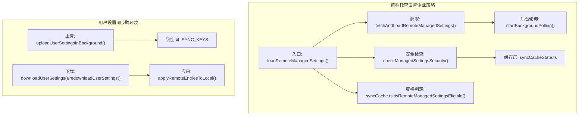
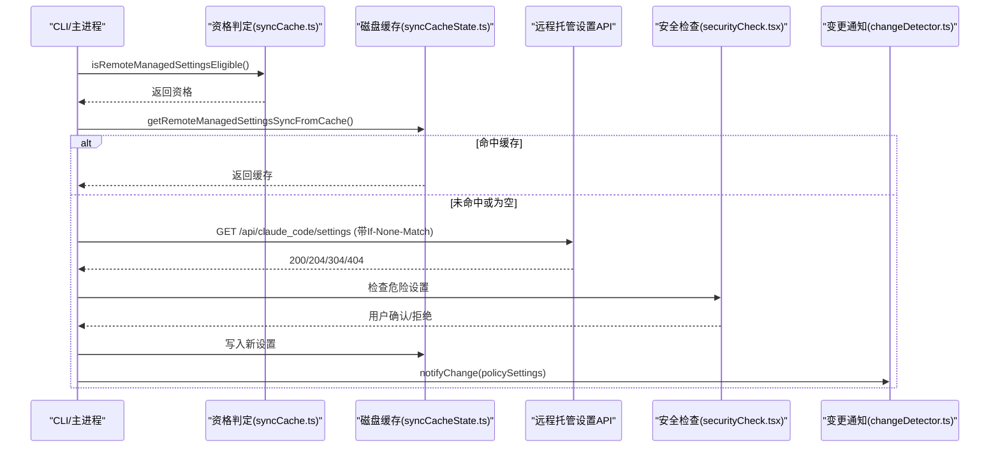
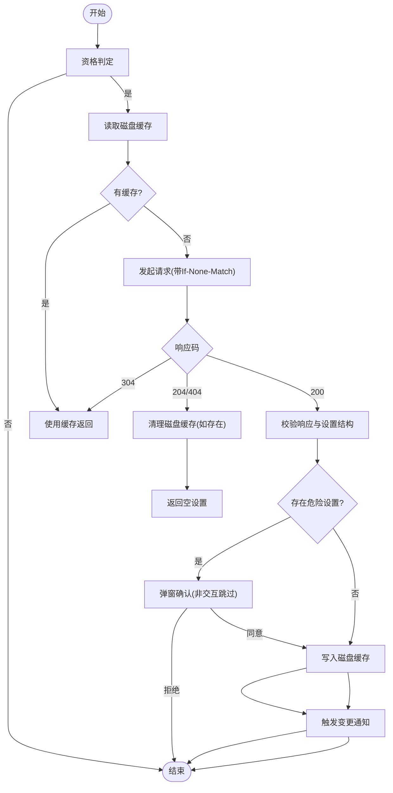
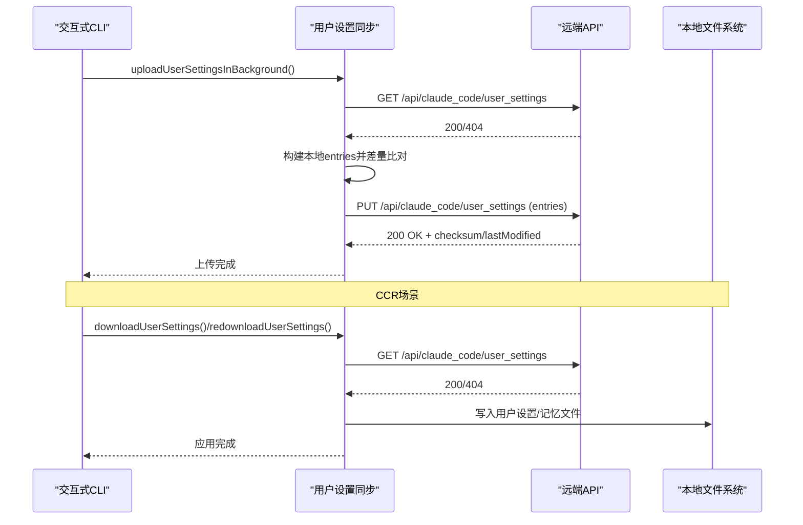
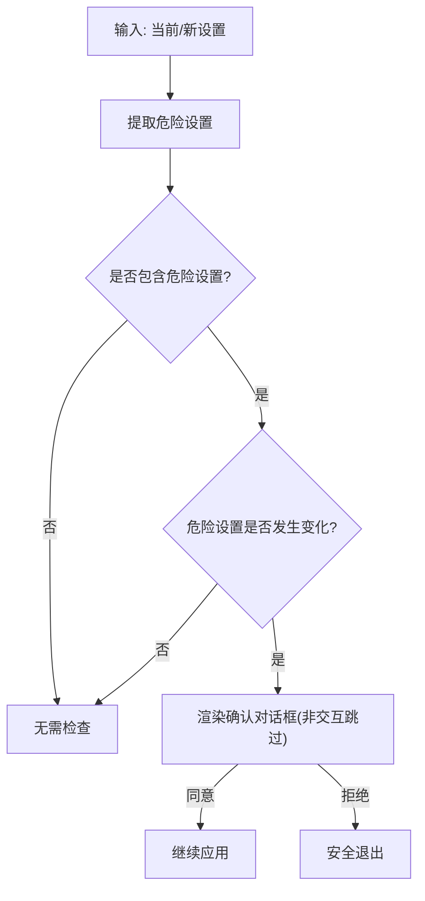
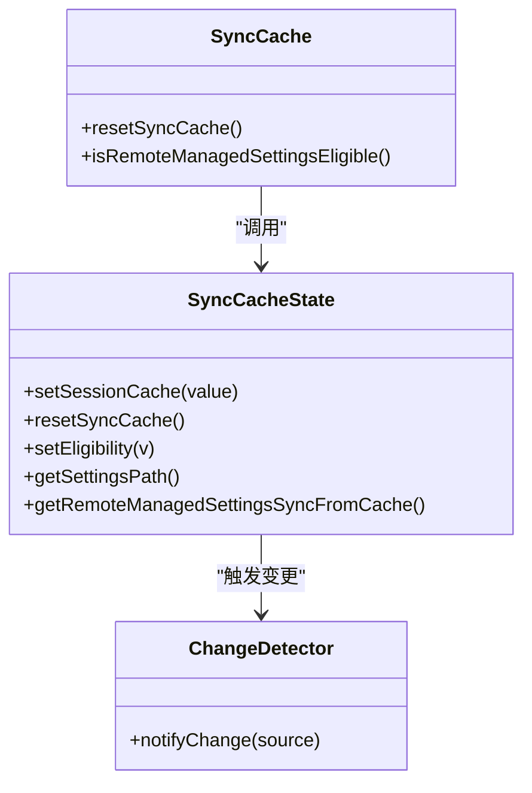
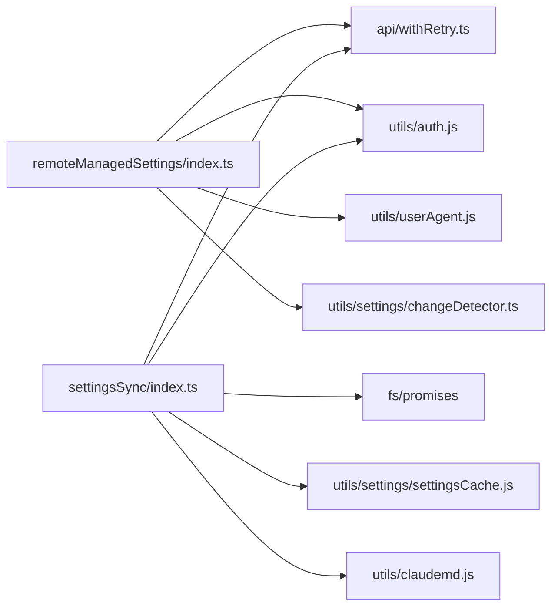

# 远程设置同步

<cite>
**本文引用的文件**
- [src/services/remoteManagedSettings/index.ts](file://src/services/remoteManagedSettings/index.ts)
- [src/services/remoteManagedSettings/types.ts](file://src/services/remoteManagedSettings/types.ts)
- [src/services/remoteManagedSettings/securityCheck.tsx](file://src/services/remoteManagedSettings/securityCheck.tsx)
- [src/services/remoteManagedSettings/syncCacheState.ts](file://src/services/remoteManagedSettings/syncCacheState.ts)
- [src/services/remoteManagedSettings/syncCache.ts](file://src/services/remoteManagedSettings/syncCache.ts)
- [src/services/settingsSync/index.ts](file://src/services/settingsSync/index.ts)
- [src/services/settingsSync/types.ts](file://src/services/settingsSync/types.ts)
- [src/utils/settings/changeDetector.ts](file://src/utils/settings/changeDetector.ts)
- [src/utils/settings/types.ts](file://src/utils/settings/types.ts)
- [src/components/ManagedSettingsSecurityDialog/utils.ts](file://src/components/ManagedSettingsSecurityDialog/utils.ts)
- [src/services/api/withRetry.ts](file://src/services/api/withRetry.ts)
</cite>

## 目录
1. [简介](#简介)
2. [项目结构](#项目结构)
3. [核心组件](#核心组件)
4. [架构总览](#架构总览)
5. [详细组件分析](#详细组件分析)
6. [依赖关系分析](#依赖关系分析)
7. [性能考量](#性能考量)
8. [故障排除指南](#故障排除指南)
9. [结论](#结论)
10. [附录](#附录)

## 简介
本文件系统性阐述“远程设置同步”子系统的架构与实现，覆盖以下主题：
- 远程托管设置的架构设计、同步机制与缓存策略
- 安全检查、权限验证与访问控制
- 同步缓存工作原理、数据一致性与冲突解决
- 同步缓存状态管理、增量更新与版本控制
- 类型定义、接口规范与数据模型
- 设置同步流程、网络通信与错误处理
- 性能优化、批量更新与离线处理策略
- 调试工具、监控指标与故障排除指南

## 项目结构
远程设置同步由两大子系统构成：
- 远程托管设置（企业策略设置）：从服务端拉取并应用受控设置，具备安全审批与失败开路能力。
- 用户设置同步（跨环境同步）：在交互式 CLI 中上传本地设置，在 CCR 模式下下载远端设置到本地。

图表来源
- [src/services/remoteManagedSettings/index.ts:514-555](file://src/services/remoteManagedSettings/index.ts#L514-L555)
- [src/services/remoteManagedSettings/syncCache.ts:49-112](file://src/services/remoteManagedSettings/syncCache.ts#L49-L112)
- [src/services/remoteManagedSettings/syncCacheState.ts:70-96](file://src/services/remoteManagedSettings/syncCacheState.ts#L70-L96)
- [src/services/settingsSync/index.ts:60-202](file://src/services/settingsSync/index.ts#L60-L202)
- [src/services/settingsSync/types.ts:61-67](file://src/services/settingsSync/types.ts#L61-L67)

章节来源
- [src/services/remoteManagedSettings/index.ts:1-120](file://src/services/remoteManagedSettings/index.ts#L1-L120)
- [src/services/settingsSync/index.ts:1-60](file://src/services/settingsSync/index.ts#L1-L60)

## 核心组件
- 远程托管设置服务
  - 入口与初始化：加载与等待远程设置、启动后台轮询、失败开路降级。
  - 安全检查：对危险设置进行拦截与用户确认。
  - 缓存与持久化：会话缓存与磁盘缓存，支持资格判定与失效处理。
- 用户设置同步服务
  - 上传：交互式 CLI 增量上传本地设置。
  - 下载：CCR 模式下拉取远端设置并应用到本地。
  - 键空间与版本：统一的键命名与内容校验。

章节来源
- [src/services/remoteManagedSettings/index.ts:144-159](file://src/services/remoteManagedSettings/index.ts#L144-L159)
- [src/services/remoteManagedSettings/securityCheck.tsx:22-73](file://src/services/remoteManagedSettings/securityCheck.tsx#L22-L73)
- [src/services/remoteManagedSettings/syncCacheState.ts:34-96](file://src/services/remoteManagedSettings/syncCacheState.ts#L34-L96)
- [src/services/settingsSync/index.ts:60-202](file://src/services/settingsSync/index.ts#L60-L202)
- [src/services/settingsSync/types.ts:61-67](file://src/services/settingsSync/types.ts#L61-L67)

## 架构总览
远程托管设置采用“资格判定 + 缓存优先 + 失败开路 + 后台轮询”的稳健架构；用户设置同步采用“OAuth 鉴权 + 增量比对 + 内容校验 + 失败开路”的跨环境协同模式。

图表来源
- [src/services/remoteManagedSettings/syncCache.ts:49-112](file://src/services/remoteManagedSettings/syncCache.ts#L49-L112)
- [src/services/remoteManagedSettings/syncCacheState.ts:70-96](file://src/services/remoteManagedSettings/syncCacheState.ts#L70-L96)
- [src/services/remoteManagedSettings/index.ts:248-361](file://src/services/remoteManagedSettings/index.ts#L248-L361)
- [src/services/remoteManagedSettings/securityCheck.tsx:22-73](file://src/services/remoteManagedSettings/securityCheck.tsx#L22-L73)
- [src/utils/settings/changeDetector.ts:447-450](file://src/utils/settings/changeDetector.ts#L447-L450)

## 详细组件分析

### 组件A：远程托管设置（企业策略）
- 资格判定
  - 仅在第一方 Anthropic 基础地址、非 Cowork 场景、且具备有效 OAuth 或 API Key 时启用。
  - 结果缓存为布尔值，避免重复计算。
- 加载与降级
  - 优先使用磁盘缓存；若无缓存则发起请求，支持 304/204/404 的优雅处理。
  - 失败时使用陈旧缓存（失败开路），确保系统可用。
- 安全检查
  - 提取危险设置（危险 Shell 设置、非白名单环境变量、钩子等），若新增或变更则弹出确认对话框。
  - 非交互模式跳过确认。
- 后台轮询
  - 每小时轮询一次，检测变更后触发变更通知。
- 缓存与持久化
  - 会话缓存与磁盘 JSON 文件双层缓存；删除/清空时清理文件与轮询。

图表来源
- [src/services/remoteManagedSettings/syncCache.ts:49-112](file://src/services/remoteManagedSettings/syncCache.ts#L49-L112)
- [src/services/remoteManagedSettings/syncCacheState.ts:70-96](file://src/services/remoteManagedSettings/syncCacheState.ts#L70-L96)
- [src/services/remoteManagedSettings/index.ts:248-361](file://src/services/remoteManagedSettings/index.ts#L248-L361)
- [src/services/remoteManagedSettings/securityCheck.tsx:22-73](file://src/services/remoteManagedSettings/securityCheck.tsx#L22-L73)

章节来源
- [src/services/remoteManagedSettings/index.ts:144-159](file://src/services/remoteManagedSettings/index.ts#L144-L159)
- [src/services/remoteManagedSettings/index.ts:415-503](file://src/services/remoteManagedSettings/index.ts#L415-L503)
- [src/services/remoteManagedSettings/index.ts:584-606](file://src/services/remoteManagedSettings/index.ts#L584-L606)
- [src/services/remoteManagedSettings/securityCheck.tsx:22-73](file://src/services/remoteManagedSettings/securityCheck.tsx#L22-L73)
- [src/services/remoteManagedSettings/syncCacheState.ts:34-96](file://src/services/remoteManagedSettings/syncCacheState.ts#L34-L96)
- [src/services/remoteManagedSettings/syncCache.ts:27-30](file://src/services/remoteManagedSettings/syncCache.ts#L27-L30)

### 组件B：用户设置同步（跨环境）
- 上传（交互式 CLI）
  - 条件：特性开关开启、功能标志允许、交互模式、使用 OAuth。
  - 构建本地条目集合，与远端差异比对，仅上传变化项。
  - 支持重试与失败开路。
- 下载（CCR）
  - 条件：特性开关开启、功能标志允许、使用 OAuth。
  - 拉取远端数据，按键空间应用到本地文件，标记内部写入以抑制误报。
  - 支持强制重下（mid-session）与缓存复用。
- 键空间与版本
  - 使用固定键名映射用户设置与项目设置/记忆文件。
  - 远端返回内容包含校验和与最后修改时间，便于增量与一致性判断。

图表来源
- [src/services/settingsSync/index.ts:60-111](file://src/services/settingsSync/index.ts#L60-L111)
- [src/services/settingsSync/index.ts:129-202](file://src/services/settingsSync/index.ts#L129-L202)
- [src/services/settingsSync/index.ts:247-392](file://src/services/settingsSync/index.ts#L247-L392)
- [src/services/settingsSync/types.ts:61-67](file://src/services/settingsSync/types.ts#L61-L67)

章节来源
- [src/services/settingsSync/index.ts:60-111](file://src/services/settingsSync/index.ts#L60-L111)
- [src/services/settingsSync/index.ts:129-202](file://src/services/settingsSync/index.ts#L129-L202)
- [src/services/settingsSync/index.ts:247-392](file://src/services/settingsSync/index.ts#L247-L392)
- [src/services/settingsSync/types.ts:1-68](file://src/services/settingsSync/types.ts#L1-L68)

### 组件C：安全检查与权限控制
- 危险设置提取
  - 危险 Shell 设置、非白名单环境变量、钩子对象等。
- 变更检测
  - 对比前后两版危险设置 JSON，若有新增或变更则提示确认。
- 交互与退出
  - 非交互模式跳过确认；用户拒绝时执行安全退出。

图表来源
- [src/components/ManagedSettingsSecurityDialog/utils.ts:24-117](file://src/components/ManagedSettingsSecurityDialog/utils.ts#L24-L117)
- [src/services/remoteManagedSettings/securityCheck.tsx:22-73](file://src/services/remoteManagedSettings/securityCheck.tsx#L22-L73)

章节来源
- [src/components/ManagedSettingsSecurityDialog/utils.ts:1-145](file://src/components/ManagedSettingsSecurityDialog/utils.ts#L1-L145)
- [src/services/remoteManagedSettings/securityCheck.tsx:1-74](file://src/services/remoteManagedSettings/securityCheck.tsx#L1-L74)

### 组件D：缓存与状态管理
- 会话缓存
  - 进程内缓存，避免重复解析磁盘。
- 磁盘缓存
  - JSON 文件存储，路径位于配置目录；读取时去除 BOM 并解析。
- 资格镜像
  - 在资格判定模块中镜像资格结果，供其他模块快速查询。
- 变更通知
  - 通过集中式变更通知器触发缓存重置与监听者刷新。

图表来源
- [src/services/remoteManagedSettings/syncCacheState.ts:34-96](file://src/services/remoteManagedSettings/syncCacheState.ts#L34-L96)
- [src/services/remoteManagedSettings/syncCache.ts:27-30](file://src/services/remoteManagedSettings/syncCache.ts#L27-L30)
- [src/utils/settings/changeDetector.ts:447-450](file://src/utils/settings/changeDetector.ts#L447-L450)

章节来源
- [src/services/remoteManagedSettings/syncCacheState.ts:1-97](file://src/services/remoteManagedSettings/syncCacheState.ts#L1-L97)
- [src/services/remoteManagedSettings/syncCache.ts:1-113](file://src/services/remoteManagedSettings/syncCache.ts#L1-L113)
- [src/utils/settings/changeDetector.ts:416-450](file://src/utils/settings/changeDetector.ts#L416-L450)

## 依赖关系分析
- 远程托管设置
  - 依赖鉴权与 OAuth 工具、HTTP 重试与退避、用户代理、诊断日志与错误分类。
  - 与设置变更通知器耦合，确保应用新策略后热更新。
- 用户设置同步
  - 依赖 OAuth 鉴权、HTTP 请求、文件系统操作、缓存与内部写入标记。
  - 与设置缓存与内存缓存联动，确保读取一致性。

图表来源
- [src/services/remoteManagedSettings/index.ts:15-35](file://src/services/remoteManagedSettings/index.ts#L15-L35)
- [src/services/api/withRetry.ts:353-514](file://src/services/api/withRetry.ts#L353-L514)
- [src/services/settingsSync/index.ts:12-49](file://src/services/settingsSync/index.ts#L12-L49)

章节来源
- [src/services/remoteManagedSettings/index.ts:15-35](file://src/services/remoteManagedSettings/index.ts#L15-L35)
- [src/services/settingsSync/index.ts:12-49](file://src/services/settingsSync/index.ts#L12-L49)
- [src/services/api/withRetry.ts:353-514](file://src/services/api/withRetry.ts#L353-L514)

## 性能考量
- 传输与缓存
  - 使用 ETag（If-None-Match）与 304 响应减少带宽与延迟。
  - 会话缓存与磁盘缓存双层结构，启动阶段优先命中磁盘缓存。
- 重试与退避
  - 统一的指数退避与可中断睡眠，避免拥塞与资源浪费。
- 增量与大小限制
  - 用户设置同步仅上传变化条目；单文件大小上限与空内容过滤降低无效负载。
- 失败开路与降级
  - 远程托管设置与用户设置同步均支持失败开路，保障系统稳定性。

章节来源
- [src/services/remoteManagedSettings/index.ts:273-285](file://src/services/remoteManagedSettings/index.ts#L273-L285)
- [src/services/remoteManagedSettings/index.ts:432-443](file://src/services/remoteManagedSettings/index.ts#L432-L443)
- [src/services/settingsSync/index.ts:398-416](file://src/services/settingsSync/index.ts#L398-L416)
- [src/services/settingsSync/index.ts:51-53](file://src/services/settingsSync/index.ts#L51-L53)

## 故障排除指南
- 常见错误与处理
  - 认证失败：返回“需要认证/未授权”，不重试。
  - 超时/网络异常：记录超时/连接失败，按重试策略退避。
  - 404：无远端设置，返回空设置，清理磁盘缓存。
- 安全检查被拒
  - 用户拒绝危险设置变更，执行安全退出；可通过清除缓存与重新登录恢复。
- 缓存问题
  - 清理磁盘缓存与会话缓存，重启后重新拉取。
- 监控与日志
  - 使用诊断日志与事件埋点定位上传/下载/应用阶段的失败原因。

章节来源
- [src/services/remoteManagedSettings/index.ts:345-360](file://src/services/remoteManagedSettings/index.ts#L345-L360)
- [src/services/remoteManagedSettings/index.ts:297-306](file://src/services/remoteManagedSettings/index.ts#L297-L306)
- [src/services/remoteManagedSettings/securityCheck.tsx:67-73](file://src/services/remoteManagedSettings/securityCheck.tsx#L67-L73)
- [src/services/settingsSync/index.ts:76-111](file://src/services/settingsSync/index.ts#L76-L111)

## 结论
该远程设置同步系统通过“资格判定 + 缓存优先 + 失败开路 + 安全检查 + 后台轮询”的组合，实现了企业策略设置的稳健分发与用户设置的跨环境协同。其设计兼顾可用性、安全性与可观测性，适合在复杂的企业与多环境场景中部署与演进。

## 附录

### 类型定义与接口规范
- 远程托管设置响应与结果
  - 响应体包含 UUID、校验和与设置对象；结果类型包含成功/失败、错误信息与跳过重试标志。
- 用户设置同步数据与结果
  - 数据体包含用户 ID、版本、最后修改时间、校验和与条目字典；结果类型包含成功/失败与错误信息。
- 键空间
  - 用户设置、用户记忆、项目设置、项目记忆的键命名规则。

章节来源
- [src/services/remoteManagedSettings/types.ts:10-31](file://src/services/remoteManagedSettings/types.ts#L10-L31)
- [src/services/settingsSync/types.ts:16-67](file://src/services/settingsSync/types.ts#L16-L67)

### 数据模型与字段说明
- SettingsJson
  - 通用设置对象，涵盖环境变量、权限、模型、MCP 服务器、钩子、工作树、插件、市场等企业与个人定制化字段。
- 危险设置
  - 危险 Shell 设置、非白名单环境变量、钩子对象等，用于安全检查。

章节来源
- [src/utils/settings/types.ts:255-800](file://src/utils/settings/types.ts#L255-L800)
- [src/components/ManagedSettingsSecurityDialog/utils.ts:24-70](file://src/components/ManagedSettingsSecurityDialog/utils.ts#L24-L70)