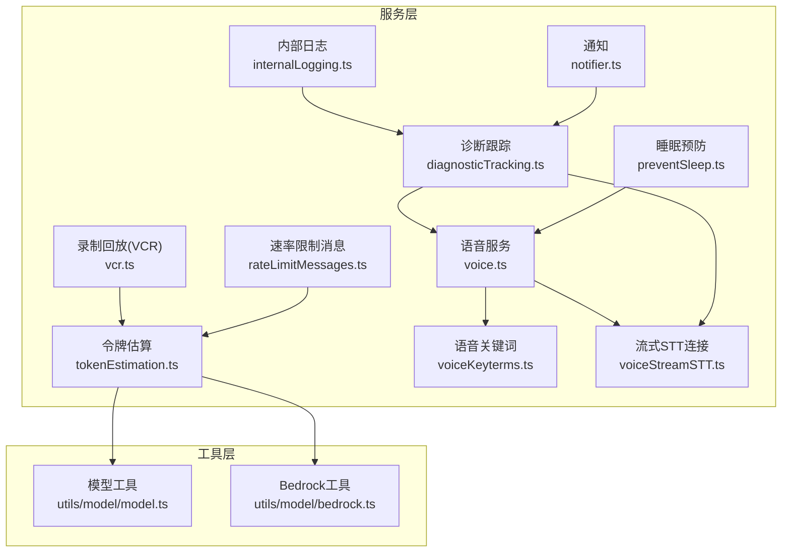
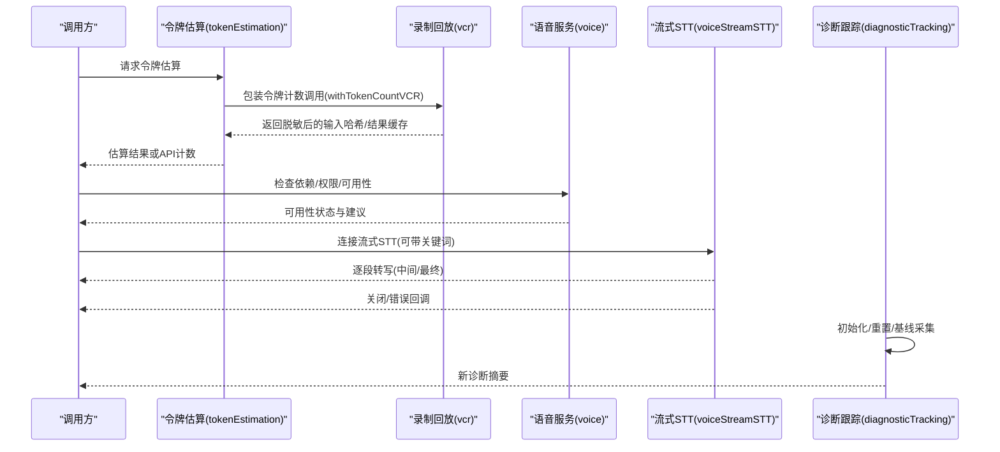
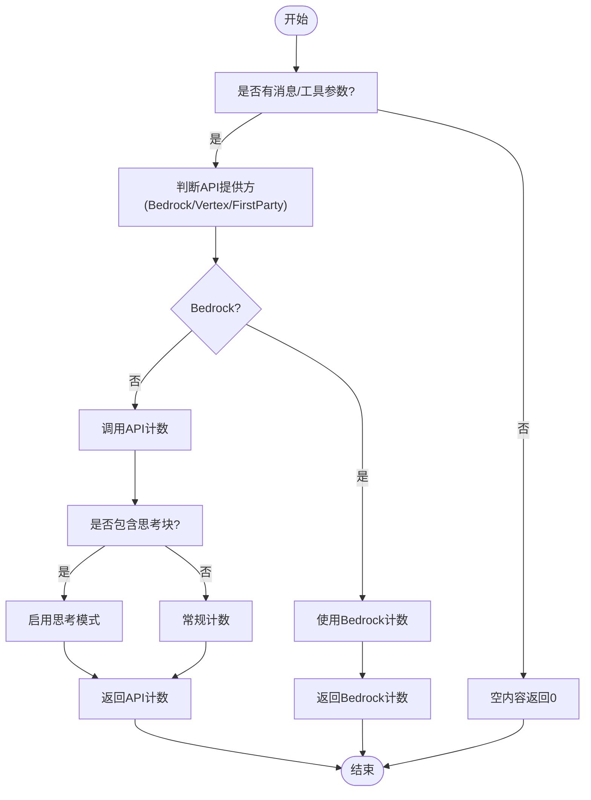
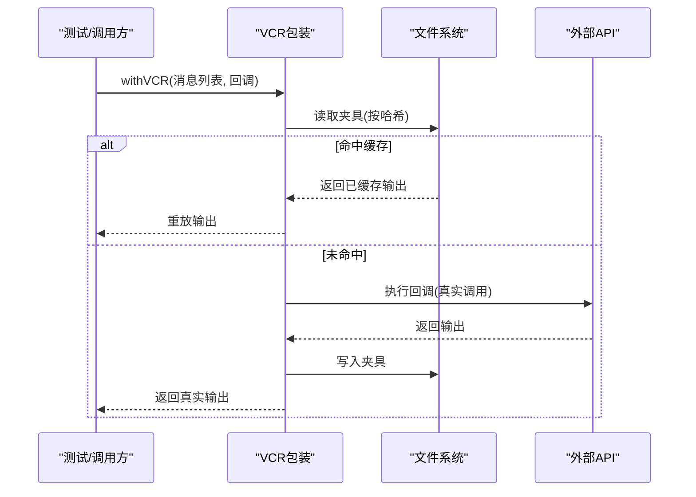
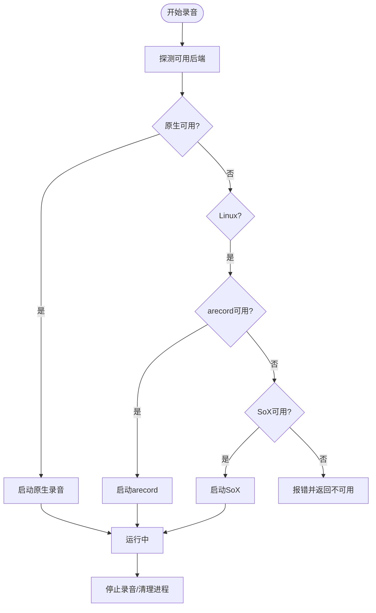
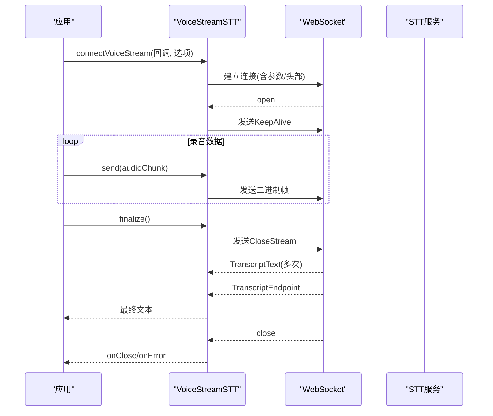
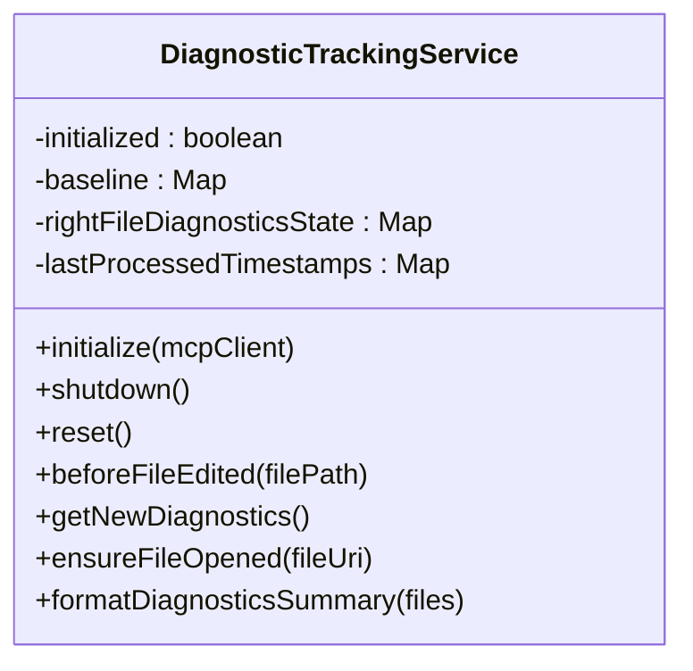
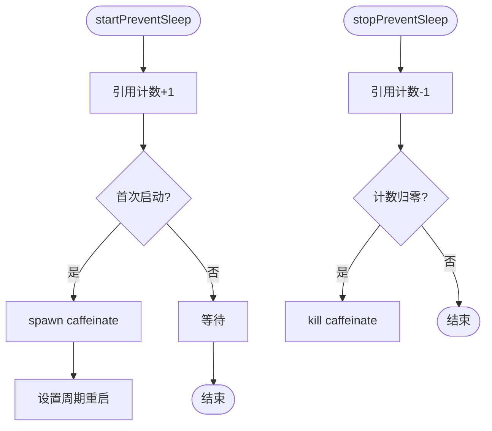
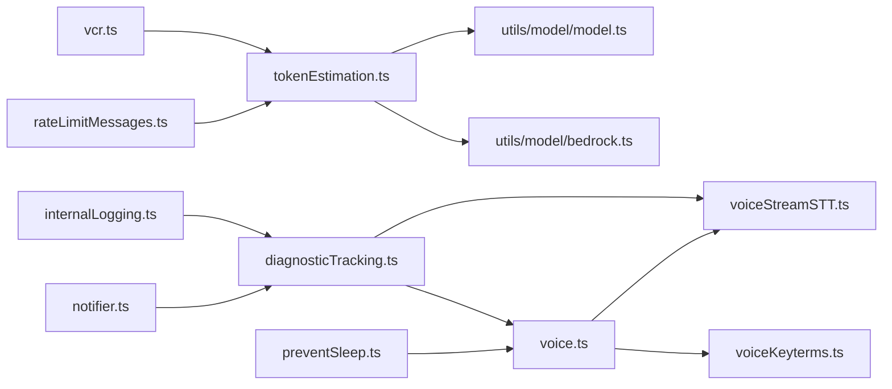

# 实用服务

<cite>
**本文引用的文件**
- [tokenEstimation.ts](file://src/services/tokenEstimation.ts)
- [vcr.ts](file://src/services/vcr.ts)
- [voice.ts](file://src/services/voice.ts)
- [voiceKeyterms.ts](file://src/services/voiceKeyterms.ts)
- [voiceStreamSTT.ts](file://src/services/voiceStreamSTT.ts)
- [diagnosticTracking.ts](file://src/services/diagnosticTracking.ts)
- [preventSleep.ts](file://src/services/preventSleep.ts)
- [internalLogging.ts](file://src/services/internalLogging.ts)
- [notifier.ts](file://src/services/notifier.ts)
- [rateLimitMessages.ts](file://src/services/rateLimitMessages.ts)
- [model.ts](file://src/utils/model/model.ts)
- [bedrock.ts](file://src/utils/model/bedrock.ts)
</cite>

## 目录
1. [简介](#简介)
2. [项目结构](#项目结构)
3. [核心组件](#核心组件)
4. [架构总览](#架构总览)
5. [详细组件分析](#详细组件分析)
6. [依赖关系分析](#依赖关系分析)
7. [性能考量](#性能考量)
8. [故障排查指南](#故障排查指南)
9. [结论](#结论)
10. [附录](#附录)

## 简介
本文件聚焦于“实用服务模块”，涵盖以下关键能力：
- 令牌估算：基于 API 的精确计数、回退估算、针对不同内容类型的估算策略，以及在不同模型与平台（如 Bedrock、Vertex）下的适配。
- 录制回放（VCR）：用于测试与调试的请求/响应缓存与重放，支持消息级与令牌计数级的脱敏与跨平台一致性。
- 语音处理：本地麦克风录音、跨平台后端选择（原生/SoX/arecord）、流式 STT 连接与关键词增强。
- 诊断跟踪：从 IDE 获取诊断信息、对比基线、生成摘要，辅助问题定位与回归检测。
- 睡眠预防：在 macOS 上通过系统进程防止休眠，配合引用计数与自愈重启机制。

此外，文档还包含内部日志、通知、速率限制提示等辅助服务的简要说明，帮助读者全面理解这些服务如何协同支撑主流程。

## 项目结构
实用服务模块主要位于 src/services 下，围绕“估算、录制回放、语音、诊断、睡眠”五大主题展开，并与工具层（模型解析、Bedrock 客户端、成本计算等）紧密耦合。

图表来源
- [tokenEstimation.ts:1-496](file://src/services/tokenEstimation.ts#L1-L496)
- [vcr.ts:1-407](file://src/services/vcr.ts#L1-L407)
- [voice.ts:1-526](file://src/services/voice.ts#L1-L526)
- [voiceKeyterms.ts:1-107](file://src/services/voiceKeyterms.ts#L1-L107)
- [voiceStreamSTT.ts:1-545](file://src/services/voiceStreamSTT.ts#L1-L545)
- [diagnosticTracking.ts:1-398](file://src/services/diagnosticTracking.ts#L1-L398)
- [preventSleep.ts:1-166](file://src/services/preventSleep.ts#L1-L166)
- [internalLogging.ts:1-91](file://src/services/internalLogging.ts#L1-L91)
- [notifier.ts:1-157](file://src/services/notifier.ts#L1-L157)
- [rateLimitMessages.ts:1-345](file://src/services/rateLimitMessages.ts#L1-L345)
- [model.ts:1-200](file://src/utils/model/model.ts#L1-L200)
- [bedrock.ts:1-200](file://src/utils/model/bedrock.ts#L1-L200)

章节来源
- [tokenEstimation.ts:1-496](file://src/services/tokenEstimation.ts#L1-L496)
- [vcr.ts:1-407](file://src/services/vcr.ts#L1-L407)
- [voice.ts:1-526](file://src/services/voice.ts#L1-L526)
- [voiceKeyterms.ts:1-107](file://src/services/voiceKeyterms.ts#L1-L107)
- [voiceStreamSTT.ts:1-545](file://src/services/voiceStreamSTT.ts#L1-L545)
- [diagnosticTracking.ts:1-398](file://src/services/diagnosticTracking.ts#L1-L398)
- [preventSleep.ts:1-166](file://src/services/preventSleep.ts#L1-L166)
- [internalLogging.ts:1-91](file://src/services/internalLogging.ts#L1-L91)
- [notifier.ts:1-157](file://src/services/notifier.ts#L1-L157)
- [rateLimitMessages.ts:1-345](file://src/services/rateLimitMessages.ts#L1-L345)
- [model.ts:1-200](file://src/utils/model/model.ts#L1-L200)
- [bedrock.ts:1-200](file://src/utils/model/bedrock.ts#L1-L200)

## 核心组件
- 令牌估算：提供 API 计数、回退估算、消息级估算、文件类型感知估算、Bedrock/Vertex 适配、思考块处理等能力。
- 录制回放：通用夹具管理、消息级 VCR、流式 VCR、令牌计数 VCR，支持跨平台路径脱敏与缓存命中。
- 语音服务：依赖探测、权限请求、可用性检查、多后端录音（原生/SoX/arecord）、停止录音与错误处理。
- 流式 STT：WebSocket 连接、心跳保活、超时与收尾策略、关键词注入、错误与关闭处理。
- 诊断跟踪：初始化与重置、打开文件确保语言服务就绪、基线采集、新诊断对比、摘要格式化。
- 睡眠预防：macOS caffeinate 引擎，引用计数与周期重启，异常退出自清理。

章节来源
- [tokenEstimation.ts:124-325](file://src/services/tokenEstimation.ts#L124-L325)
- [vcr.ts:38-161](file://src/services/vcr.ts#L38-L161)
- [voice.ts:190-328](file://src/services/voice.ts#L190-L328)
- [voiceStreamSTT.ts:111-545](file://src/services/voiceStreamSTT.ts#L111-L545)
- [diagnosticTracking.ts:30-398](file://src/services/diagnosticTracking.ts#L30-L398)
- [preventSleep.ts:36-166](file://src/services/preventSleep.ts#L36-L166)

## 架构总览
下图展示各实用服务之间的交互关系与数据流向，重点体现令牌估算与 VCR 的协作、语音服务与 STT 的联动、诊断跟踪与通知/内部日志的集成。

图表来源
- [tokenEstimation.ts:140-201](file://src/services/tokenEstimation.ts#L140-L201)
- [vcr.ts:382-406](file://src/services/vcr.ts#L382-L406)
- [voice.ts:241-328](file://src/services/voice.ts#L241-L328)
- [voiceStreamSTT.ts:111-545](file://src/services/voiceStreamSTT.ts#L111-L545)
- [diagnosticTracking.ts:51-398](file://src/services/diagnosticTracking.ts#L51-L398)

## 详细组件分析

### 令牌估算（Token Estimation）
- 设计要点
  - 支持直接 API 计数（含思考块启用），在不支持的平台（如 Bedrock）使用回退估算。
  - 针对不同内容类型（文本、图像、工具结果、思考块等）采用差异化估算策略。
  - 对工具搜索相关字段进行剥离，避免非 beta 场景导致的 API 错误。
  - 在 Vertex/Bedrock 等平台上过滤不被允许的 beta 参数，保证兼容性。
- 成本与预算控制
  - 通过估算输入 tokens 与缓存读写 tokens 的总和，结合模型与用量结构，为会话成本追踪提供基础。
  - 与 VCR 结合，确保测试中令牌计数的一致性与可复现性。
- 复杂度与性能
  - API 计数为 O(1)，回退估算为 O(n)（n 为内容长度或块数量）。
  - 对大对象（如工具结果）采用字符串化估算，避免深度遍历带来的开销。

图表来源
- [tokenEstimation.ts:140-201](file://src/services/tokenEstimation.ts#L140-L201)
- [tokenEstimation.ts:437-495](file://src/services/tokenEstimation.ts#L437-L495)
- [tokenEstimation.ts:251-325](file://src/services/tokenEstimation.ts#L251-L325)

章节来源
- [tokenEstimation.ts:38-56](file://src/services/tokenEstimation.ts#L38-L56)
- [tokenEstimation.ts:66-122](file://src/services/tokenEstimation.ts#L66-L122)
- [tokenEstimation.ts:140-201](file://src/services/tokenEstimation.ts#L140-L201)
- [tokenEstimation.ts:251-325](file://src/services/tokenEstimation.ts#L251-L325)
- [tokenEstimation.ts:371-435](file://src/services/tokenEstimation.ts#L371-L435)
- [tokenEstimation.ts:437-495](file://src/services/tokenEstimation.ts#L437-L495)
- [model.ts:36-138](file://src/utils/model/model.ts#L36-L138)
- [bedrock.ts:96-139](file://src/utils/model/bedrock.ts#L96-L139)

### 录制回放（VCR）
- 设计要点
  - 通用夹具管理：根据输入内容生成稳定哈希，缓存/读取/写入夹具文件；支持 CI/测试环境开关。
  - 消息级 VCR：对用户消息内容进行脱敏（路径、时间戳、UUID 等），保证跨平台一致性。
  - 流式 VCR：在异步生成器场景中缓冲并重放消息序列，便于测试与调试。
  - 令牌计数 VCR：对令牌估算输入进行脱敏与哈希，确保测试中计数结果稳定。
- 调试与测试辅助
  - 在 CI 中缺失夹具时抛出明确指引，要求开启记录并提交结果。
  - 通过随机 UUID 与确定性索引组合，确保会话去重与稳定性。

图表来源
- [vcr.ts:39-86](file://src/services/vcr.ts#L39-L86)
- [vcr.ts:88-161](file://src/services/vcr.ts#L88-L161)
- [vcr.ts:349-380](file://src/services/vcr.ts#L349-L380)
- [vcr.ts:382-406](file://src/services/vcr.ts#L382-L406)

章节来源
- [vcr.ts:23-33](file://src/services/vcr.ts#L23-L33)
- [vcr.ts:39-86](file://src/services/vcr.ts#L39-L86)
- [vcr.ts:88-161](file://src/services/vcr.ts#L88-L161)
- [vcr.ts:349-380](file://src/services/vcr.ts#L349-L380)
- [vcr.ts:382-406](file://src/services/vcr.ts#L382-L406)

### 语音服务（Audio Recording）
- 设计要点
  - 依赖探测：原生模块（cpal）优先，Windows 无回退；Linux 优先 arecord，其次 SoX；macOS 仅原生。
  - 权限与可用性：首次探测触发 TCC 对话；WSL/无设备场景给出明确原因与安装建议。
  - 多后端：原生（macOS/Linux/Windows）、arecord（Linux）、SoX（macOS/Linux）。
  - 错误处理：stderr 消费、进程错误捕获、停止录音的安全清理。
- 性能与体验
  - 原生模块延迟高但稳定；SoX/arecord 提供即时回退。
  - 推送式录音（push-to-talk）与静音检测（silence detection）可选配置。

图表来源
- [voice.ts:241-328](file://src/services/voice.ts#L241-L328)
- [voice.ts:335-396](file://src/services/voice.ts#L335-L396)
- [voice.ts:398-513](file://src/services/voice.ts#L398-L513)
- [voice.ts:515-526](file://src/services/voice.ts#L515-L526)

章节来源
- [voice.ts:190-227](file://src/services/voice.ts#L190-L227)
- [voice.ts:241-328](file://src/services/voice.ts#L241-L328)
- [voice.ts:335-396](file://src/services/voice.ts#L335-L396)
- [voice.ts:398-513](file://src/services/voice.ts#L398-L513)
- [voice.ts:515-526](file://src/services/voice.ts#L515-L526)

### 流式 STT（Voice Stream STT）
- 设计要点
  - 连接建立：OAuth 凭据、WebSocket 代理与 TLS、URL 查询参数（编码、采样率、通道、端点、语言、关键词）。
  - 心跳保活：定期发送 KeepAlive，避免空闲断连。
  - 收尾策略：CloseStream 后等待 TranscriptEndpoint 或超时，确保最终文本提交。
  - 错误处理：升级拒绝、网络错误、连接关闭、无数据超时等分支。
- 关键词增强
  - 通过查询参数注入关键词，提升代码术语识别准确率。

图表来源
- [voiceStreamSTT.ts:111-545](file://src/services/voiceStreamSTT.ts#L111-L545)
- [voiceKeyterms.ts:63-106](file://src/services/voiceKeyterms.ts#L63-L106)

章节来源
- [voiceStreamSTT.ts:98-107](file://src/services/voiceStreamSTT.ts#L98-L107)
- [voiceStreamSTT.ts:111-175](file://src/services/voiceStreamSTT.ts#L111-L175)
- [voiceStreamSTT.ts:215-320](file://src/services/voiceStreamSTT.ts#L215-L320)
- [voiceStreamSTT.ts:357-461](file://src/services/voiceStreamSTT.ts#L357-L461)
- [voiceStreamSTT.ts:463-541](file://src/services/voiceStreamSTT.ts#L463-L541)
- [voiceKeyterms.ts:63-106](file://src/services/voiceKeyterms.ts#L63-L106)

### 诊断跟踪（Diagnostic Tracking）
- 设计要点
  - 单例服务：初始化/重置/关机清理，避免重复实例。
  - 文件规范化：统一协议前缀与大小写/分隔符差异，确保跨平台一致性。
  - 基线采集：编辑前获取诊断快照，后续增量对比。
  - 新诊断提取：仅保留不在基线中的诊断项，生成摘要。
- 集成点
  - 与 MCP/IDE RPC 通信，确保文件打开与诊断可用。
  - 与通知/内部日志联动，便于问题上报与审计。

图表来源
- [diagnosticTracking.ts:30-66](file://src/services/diagnosticTracking.ts#L30-L66)
- [diagnosticTracking.ts:135-182](file://src/services/diagnosticTracking.ts#L135-L182)
- [diagnosticTracking.ts:188-283](file://src/services/diagnosticTracking.ts#L188-L283)
- [diagnosticTracking.ts:352-394](file://src/services/diagnosticTracking.ts#L352-L394)

章节来源
- [diagnosticTracking.ts:30-66](file://src/services/diagnosticTracking.ts#L30-L66)
- [diagnosticTracking.ts:78-97](file://src/services/diagnosticTracking.ts#L78-L97)
- [diagnosticTracking.ts:135-182](file://src/services/diagnosticTracking.ts#L135-L182)
- [diagnosticTracking.ts:188-283](file://src/services/diagnosticTracking.ts#L188-L283)
- [diagnosticTracking.ts:352-394](file://src/services/diagnosticTracking.ts#L352-L394)

### 睡眠预防（Prevent Sleep）
- 设计要点
  - macOS caffeinate：以引用计数方式管理，周期重启保持断言有效，异常退出自动清理。
  - 平台隔离：仅在 darwin 生效，其他平台为空操作。
  - 自愈机制：超时后自动退出，避免僵尸进程。
- 使用场景
  - 长时间 API 请求、工具执行期间防止系统休眠。

图表来源
- [preventSleep.ts:36-58](file://src/services/preventSleep.ts#L36-L58)
- [preventSleep.ts:70-92](file://src/services/preventSleep.ts#L70-L92)
- [preventSleep.ts:101-151](file://src/services/preventSleep.ts#L101-L151)
- [preventSleep.ts:153-165](file://src/services/preventSleep.ts#L153-L165)

章节来源
- [preventSleep.ts:1-166](file://src/services/preventSleep.ts#L1-L166)

### 辅助服务概览
- 内部日志：在特定用户类型下记录命名空间、容器 ID、权限上下文等元数据，便于审计与问题定位。
- 通知：根据终端类型与配置自动选择通知渠道（iTerm2/Kitty/Ghostty/铃声），并记录方法使用情况。
- 速率限制消息：集中生成速率限制相关的错误/警告文案，区分订阅类型与限额类型，提供友好的恢复建议。

章节来源
- [internalLogging.ts:17-66](file://src/services/internalLogging.ts#L17-L66)
- [internalLogging.ts:71-90](file://src/services/internalLogging.ts#L71-L90)
- [notifier.ts:18-36](file://src/services/notifier.ts#L18-L36)
- [notifier.ts:40-104](file://src/services/notifier.ts#L40-L104)
- [rateLimitMessages.ts:45-104](file://src/services/rateLimitMessages.ts#L45-L104)
- [rateLimitMessages.ts:110-141](file://src/services/rateLimitMessages.ts#L110-L141)
- [rateLimitMessages.ts:199-254](file://src/services/rateLimitMessages.ts#L199-L254)

## 依赖关系分析
- 令牌估算依赖模型工具与 Bedrock 工具，以适配不同平台与模型族。
- VCR 与令牌估算耦合，确保测试中计数一致性。
- 语音服务与流式 STT 协作，前者负责本地录音，后者负责远端转写。
- 诊断跟踪与通知/内部日志形成闭环，便于问题上报与审计。

图表来源
- [tokenEstimation.ts:1-496](file://src/services/tokenEstimation.ts#L1-L496)
- [vcr.ts:1-407](file://src/services/vcr.ts#L1-L407)
- [voice.ts:1-526](file://src/services/voice.ts#L1-L526)
- [voiceStreamSTT.ts:1-545](file://src/services/voiceStreamSTT.ts#L1-L545)
- [voiceKeyterms.ts:1-107](file://src/services/voiceKeyterms.ts#L1-L107)
- [diagnosticTracking.ts:1-398](file://src/services/diagnosticTracking.ts#L1-L398)
- [preventSleep.ts:1-166](file://src/services/preventSleep.ts#L1-L166)
- [internalLogging.ts:1-91](file://src/services/internalLogging.ts#L1-L91)
- [notifier.ts:1-157](file://src/services/notifier.ts#L1-L157)
- [rateLimitMessages.ts:1-345](file://src/services/rateLimitMessages.ts#L1-L345)
- [model.ts:1-200](file://src/utils/model/model.ts#L1-L200)
- [bedrock.ts:1-200](file://src/utils/model/bedrock.ts#L1-L200)

章节来源
- [tokenEstimation.ts:1-496](file://src/services/tokenEstimation.ts#L1-L496)
- [vcr.ts:1-407](file://src/services/vcr.ts#L1-L407)
- [voice.ts:1-526](file://src/services/voice.ts#L1-L526)
- [voiceStreamSTT.ts:1-545](file://src/services/voiceStreamSTT.ts#L1-L545)
- [voiceKeyterms.ts:1-107](file://src/services/voiceKeyterms.ts#L1-L107)
- [diagnosticTracking.ts:1-398](file://src/services/diagnosticTracking.ts#L1-L398)
- [preventSleep.ts:1-166](file://src/services/preventSleep.ts#L1-L166)
- [internalLogging.ts:1-91](file://src/services/internalLogging.ts#L1-L91)
- [notifier.ts:1-157](file://src/services/notifier.ts#L1-L157)
- [rateLimitMessages.ts:1-345](file://src/services/rateLimitMessages.ts#L1-L345)
- [model.ts:1-200](file://src/utils/model/model.ts#L1-L200)
- [bedrock.ts:1-200](file://src/utils/model/bedrock.ts#L1-L200)

## 性能考量
- 令牌估算
  - API 计数为同步调用，建议在批量估算时合并消息以减少往返次数。
  - 回退估算对大文本/工具结果采用字符串化，注意内存占用与序列化成本。
- VCR
  - 夹具文件 I/O 与 JSON 序列化可能成为瓶颈，建议在 CI 中开启记录并缓存夹具。
  - 脱敏与哈希计算为常量开销，通常可忽略。
- 语音服务
  - 原生模块加载阻塞事件循环，建议在首次按键时惰性加载。
  - SoX/arecord 的缓冲策略影响实时性，需权衡延迟与稳定性。
- 诊断跟踪
  - 基线比较为 O(n) 操作，建议限制文件数量与诊断条目规模。
- 睡眠预防
  - caffeinate 进程与周期重启为轻量开销，但在大量并发场景下仍需关注资源占用。

## 故障排查指南
- 令牌估算
  - API 计数失败：检查模型/beta 参数与平台兼容性；回退到粗略估算。
  - Bedrock 不支持计数：使用回退估算或 Haiku 模型计数。
- VCR
  - 夹具缺失：在 CI 中开启记录并提交；确认测试夹具根目录配置。
  - 跨平台路径不一致：确认脱敏逻辑覆盖所有路径变体。
- 语音服务
  - 无法录音：检查依赖安装（SoX/arecord）、WSL 音频支持、权限对话。
  - 静音检测无效：确认选项与后端支持（arecord 不支持内置静音检测）。
- 流式 STT
  - 连接被拒：检查 OAuth 凭据、代理/TLS 设置、Cloudflare 挑战。
  - 文本丢失：确认 CloseStream 后 TranscriptEndpoint 是否到达，必要时缩短超时。
- 诊断跟踪
  - 诊断为空：确认 IDE 客户端连接、文件打开、URI 规范化。
- 睡眠预防
  - caffeinate 未生效：确认 macOS 平台、引用计数与重启间隔。

章节来源
- [tokenEstimation.ts:140-201](file://src/services/tokenEstimation.ts#L140-L201)
- [vcr.ts:71-75](file://src/services/vcr.ts#L71-L75)
- [vcr.ts:133-137](file://src/services/vcr.ts#L133-L137)
- [voice.ts:284-327](file://src/services/voice.ts#L284-L327)
- [voiceStreamSTT.ts:511-533](file://src/services/voiceStreamSTT.ts#L511-L533)
- [diagnosticTracking.ts:155-167](file://src/services/diagnosticTracking.ts#L155-L167)
- [preventSleep.ts:101-151](file://src/services/preventSleep.ts#L101-L151)

## 结论
实用服务模块围绕“估算、录制回放、语音、诊断、睡眠”构建了完整的辅助能力体系。它们通过清晰的职责划分与稳健的错误处理，提升了系统的可测试性、可维护性与用户体验。在实际使用中，应结合平台特性与业务需求，合理选择估算策略、录音后端与通知渠道，并利用 VCR 与诊断跟踪保障质量与稳定性。

## 附录
- 令牌估算的文件类型感知比率：JSON 类文件采用更保守的估算系数，以降低工具结果溢出风险。
- 语音关键词：包含常见编程术语与项目/分支名称拆分，提升 STT 准确性。
- 速率限制消息：根据订阅类型与限额类型动态生成文案，兼顾用户友好与可操作性。

章节来源
- [tokenEstimation.ts:215-242](file://src/services/tokenEstimation.ts#L215-L242)
- [voiceKeyterms.ts:13-31](file://src/services/voiceKeyterms.ts#L13-L31)
- [rateLimitMessages.ts:199-254](file://src/services/rateLimitMessages.ts#L199-L254)