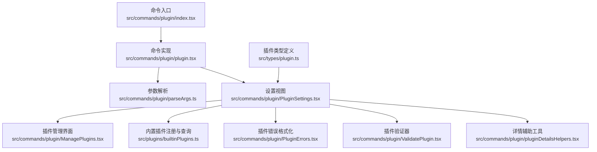
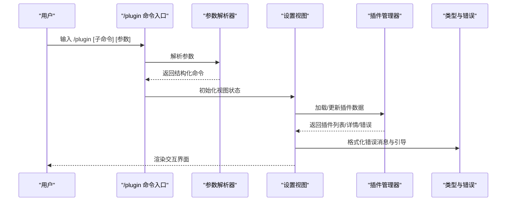
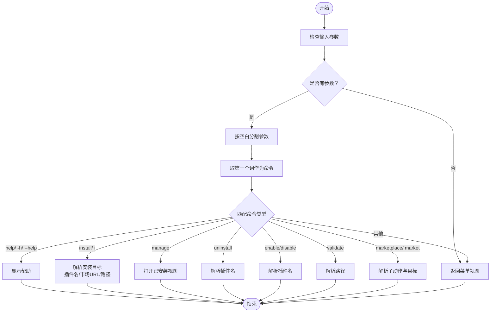
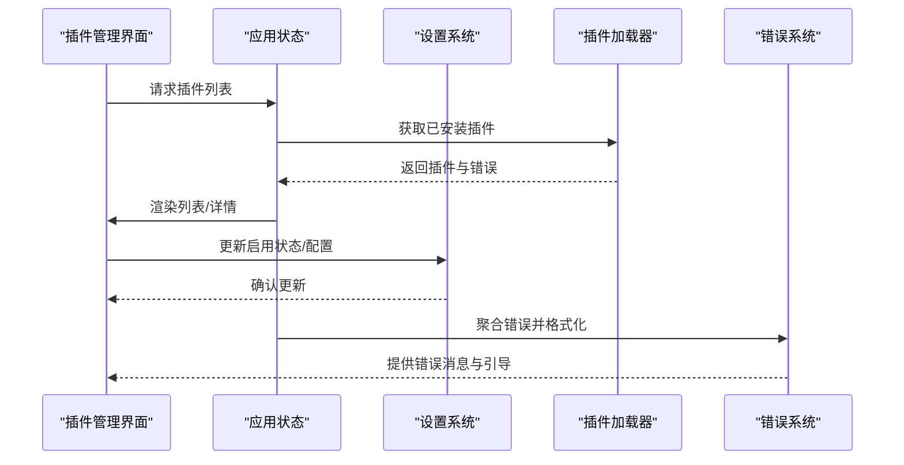
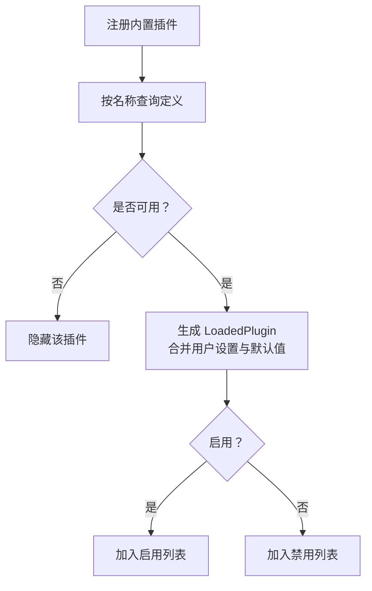
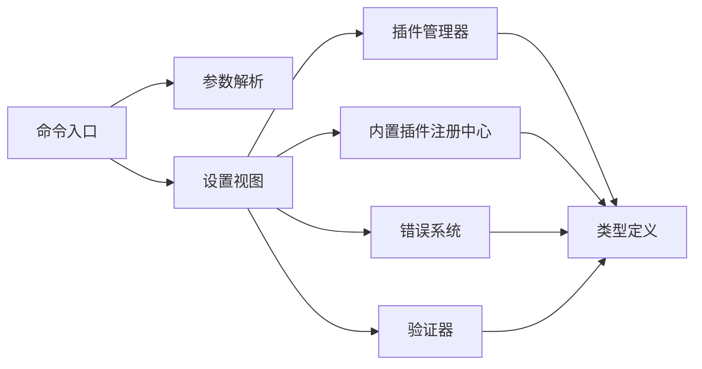

# 插件CLI命令

<cite>
**本文档引用的文件**
- [index.tsx](file://src/commands/plugin/index.tsx)
- [plugin.tsx](file://src/commands/plugin/plugin.tsx)
- [parseArgs.ts](file://src/commands/plugin/parseArgs.ts)
- [PluginSettings.tsx](file://src/commands/plugin/PluginSettings.tsx)
- [ManagePlugins.tsx](file://src/commands/plugin/ManagePlugins.tsx)
- [builtinPlugins.ts](file://src/plugins/builtinPlugins.ts)
- [plugin.ts](file://src/types/plugin.ts)
- [PluginErrors.tsx](file://src/commands/plugin/PluginErrors.tsx)
- [ValidatePlugin.tsx](file://src/commands/plugin/ValidatePlugin.tsx)
- [pluginDetailsHelpers.tsx](file://src/commands/plugin/pluginDetailsHelpers.tsx)
</cite>

## 目录
1. [简介](#简介)
2. [项目结构](#项目结构)
3. [核心组件](#核心组件)
4. [架构总览](#架构总览)
5. [详细组件分析](#详细组件分析)
6. [依赖关系分析](#依赖关系分析)
7. [性能考虑](#性能考虑)
8. [故障排除指南](#故障排除指南)
9. [结论](#结论)
10. [附录](#附录)

## 简介
本文件系统性阐述插件CLI命令的设计与实现，覆盖以下关键主题：
- 命令行接口设计：/plugin 子命令及其子动作（安装、卸载、启用、禁用、验证、市场管理）的参数解析与执行流程
- 插件生命周期：安装、启用/禁用、卸载、重载的控制流与状态管理
- 内置插件机制：注册、发现、加载顺序与优先级策略
- 市场集成与安全：官方市场验证、第三方插件安全检查与错误引导
- 使用示例、错误处理与调试技巧

## 项目结构
插件CLI位于命令系统中，通过本地JSX命令入口挂载到全局命令表，并在运行时渲染插件管理UI。

图表来源
- [index.tsx:1-11](file://src/commands/plugin/index.tsx#L1-L11)
- [plugin.tsx:1-7](file://src/commands/plugin/plugin.tsx#L1-L7)
- [parseArgs.ts:1-104](file://src/commands/plugin/parseArgs.ts#L1-L104)
- [PluginSettings.tsx:1-800](file://src/commands/plugin/PluginSettings.tsx#L1-L800)
- [ManagePlugins.tsx:1-800](file://src/commands/plugin/ManagePlugins.tsx#L1-L800)
- [builtinPlugins.ts:1-160](file://src/plugins/builtinPlugins.ts#L1-L160)
- [plugin.ts:1-364](file://src/types/plugin.ts#L1-L364)
- [PluginErrors.tsx:1-124](file://src/commands/plugin/PluginErrors.tsx#L1-L124)
- [ValidatePlugin.tsx:1-98](file://src/commands/plugin/ValidatePlugin.tsx#L1-L98)
- [pluginDetailsHelpers.tsx:1-117](file://src/commands/plugin/pluginDetailsHelpers.tsx#L1-L117)

章节来源
- [index.tsx:1-11](file://src/commands/plugin/index.tsx#L1-L11)
- [plugin.tsx:1-7](file://src/commands/plugin/plugin.tsx#L1-L7)

## 核心组件
- 命令入口与路由
  - 入口命令定义：名称为 plugin，别名为 plugins、marketplace，立即执行并动态加载 JSX 实现
  - 路由职责：根据传入参数解析出具体动作（菜单、帮助、安装、管理、卸载、启用、禁用、验证、市场管理）
- 参数解析器
  - 将字符串参数映射为结构化命令对象，支持短命令与长命令、目标识别（插件名、市场源、路径）
- 设置视图与状态机
  - 根据解析结果初始化视图状态（发现、已安装、市场、错误），并驱动子组件渲染
- 插件管理器
  - 列表、详情、配置、选项流程；支持搜索、分页、批量操作；与设置系统交互以持久化状态
- 内置插件注册中心
  - 提供注册、可用性过滤、默认启用策略、按用户偏好拆分启用/禁用列表
- 错误系统
  - 结构化错误类型、消息格式化、引导建议、瞬时错误与持久错误区分
- 验证器
  - 对单个插件或目录进行清单校验，输出错误/警告/成功信息并设置进程退出码

章节来源
- [parseArgs.ts:1-104](file://src/commands/plugin/parseArgs.ts#L1-L104)
- [PluginSettings.tsx:636-722](file://src/commands/plugin/PluginSettings.tsx#L636-L722)
- [ManagePlugins.tsx:397-800](file://src/commands/plugin/ManagePlugins.tsx#L397-L800)
- [builtinPlugins.ts:21-128](file://src/plugins/builtinPlugins.ts#L21-L128)
- [plugin.ts:101-289](file://src/types/plugin.ts#L101-L289)
- [PluginErrors.tsx:1-124](file://src/commands/plugin/PluginErrors.tsx#L1-L124)
- [ValidatePlugin.tsx:1-98](file://src/commands/plugin/ValidatePlugin.tsx#L1-L98)

## 架构总览
插件CLI采用“命令入口 + 视图状态机 + 组件化界面”的分层设计。命令入口负责参数解析与初始视图选择，视图状态机协调各子界面切换，组件化界面承载具体业务逻辑（安装、管理、验证、错误展示）。

图表来源
- [index.tsx:1-11](file://src/commands/plugin/index.tsx#L1-L11)
- [parseArgs.ts:17-103](file://src/commands/plugin/parseArgs.ts#L17-L103)
- [PluginSettings.tsx:728-800](file://src/commands/plugin/PluginSettings.tsx#L728-L800)
- [ManagePlugins.tsx:397-800](file://src/commands/plugin/ManagePlugins.tsx#L397-L800)
- [plugin.ts:101-289](file://src/types/plugin.ts#L101-L289)

## 详细组件分析

### 命令入口与参数解析
- 命令入口
  - 类型为本地JSX命令，立即执行，动态导入实现模块
  - 支持别名：plugins、marketplace
- 参数解析
  - 支持 help/-h/--help 显示帮助
  - install/i 支持三种目标识别：插件名、市场URL/路径、仅市场源
  - manage 打开已安装插件管理
  - uninstall 后跟插件名
  - enable/disable 后跟插件名
  - validate 后跟路径（可选）
  - marketplace/market 支持 add/remove/update/list 动作

图表来源
- [parseArgs.ts:17-103](file://src/commands/plugin/parseArgs.ts#L17-L103)

章节来源
- [index.tsx:1-11](file://src/commands/plugin/index.tsx#L1-L11)
- [parseArgs.ts:1-104](file://src/commands/plugin/parseArgs.ts#L1-L104)

### 设置视图与初始状态
- 解析命令后，根据类型选择初始视图状态：
  - help：显示帮助
  - validate：进入验证视图
  - install：若指定市场源或插件名，进入浏览/发现视图；否则进入发现视图
  - manage：进入已安装管理视图
  - enable/disable/uninstall：进入已安装管理视图并定位目标插件
  - marketplace：根据子动作进入相应市场管理视图
- 默认视图：未匹配到明确动作时，进入发现视图

章节来源
- [PluginSettings.tsx:636-722](file://src/commands/plugin/PluginSettings.tsx#L636-L722)

### 插件管理器（已安装视图）
- 功能概览
  - 插件列表与详情：支持搜索、分页、错误计数展示
  - 操作：启用/禁用、卸载、更新、配置、MCP服务器管理
  - 状态：内置、用户、项目、本地、企业、托管、动态等作用域排序
  - 失败插件与被标记插件的特殊展示与处理
- 关键流程
  - 数据加载：从设置系统与插件注册中心获取插件状态与错误
  - 视图切换：根据用户交互在列表、详情、配置、MCP详情间跳转
  - 持久化：通过设置更新接口保存启用状态、配置等变更
  - 错误处理：对瞬时错误与策略限制进行区分与提示

图表来源
- [ManagePlugins.tsx:397-800](file://src/commands/plugin/ManagePlugins.tsx#L397-L800)
- [plugin.ts:101-289](file://src/types/plugin.ts#L101-L289)

章节来源
- [ManagePlugins.tsx:1-800](file://src/commands/plugin/ManagePlugins.tsx#L1-L800)

### 内置插件机制
- 注册与发现
  - 运行时通过注册函数将内置插件加入注册表
  - 可通过名称查询定义，用于UI直接展示组件列表
- 加载与启用策略
  - 按用户设置与默认值决定启用/禁用
  - 可用性检查：定义 isAvailable 时，不可用则隐藏
  - 输出 LoadedPlugin 结构，包含清单、来源、钩子、MCP服务器等
- 与市场插件的区别
  - 内置插件标识为 @builtin，不对应真实市场源
  - 组件展示直接来自注册定义，无需远程市场查询

图表来源
- [builtinPlugins.ts:21-128](file://src/plugins/builtinPlugins.ts#L21-L128)

章节来源
- [builtinPlugins.ts:1-160](file://src/plugins/builtinPlugins.ts#L1-L160)

### 插件验证器
- 功能
  - 接收路径参数，自动识别文件类型（插件清单或市场清单）
  - 对目录：优先检测市场清单，其次插件清单
  - 输出错误/警告/成功信息，并设置进程退出码（0/1/2）
- 交互
  - 无参数时打印使用说明
  - 异常捕获并记录日志，返回统一错误消息

章节来源
- [ValidatePlugin.tsx:1-98](file://src/commands/plugin/ValidatePlugin.tsx#L1-L98)

### 插件详情辅助工具
- GitHub仓库提取：从插件条目中提取源仓库信息
- 详情菜单构建：根据插件是否具备主页/仓库，生成安装与导航选项
- 快捷键提示：为插件选择界面提供键盘快捷键提示

章节来源
- [pluginDetailsHelpers.tsx:1-117](file://src/commands/plugin/pluginDetailsHelpers.tsx#L1-L117)

## 依赖关系分析
- 命令入口依赖参数解析器与设置视图
- 设置视图依赖插件管理器、内置插件注册中心、错误系统、验证器
- 插件管理器依赖设置系统、插件加载器、MCP工具、错误系统
- 类型系统为所有组件提供统一的插件与错误定义

图表来源
- [index.tsx:1-11](file://src/commands/plugin/index.tsx#L1-L11)
- [parseArgs.ts:1-104](file://src/commands/plugin/parseArgs.ts#L1-L104)
- [PluginSettings.tsx:1-800](file://src/commands/plugin/PluginSettings.tsx#L1-L800)
- [ManagePlugins.tsx:1-800](file://src/commands/plugin/ManagePlugins.tsx#L1-L800)
- [builtinPlugins.ts:1-160](file://src/plugins/builtinPlugins.ts#L1-L160)
- [plugin.ts:1-364](file://src/types/plugin.ts#L1-L364)
- [PluginErrors.tsx:1-124](file://src/commands/plugin/PluginErrors.tsx#L1-L124)
- [ValidatePlugin.tsx:1-98](file://src/commands/plugin/ValidatePlugin.tsx#L1-L98)

章节来源
- [plugin.ts:1-364](file://src/types/plugin.ts#L1-L364)

## 性能考虑
- 列表渲染优化：使用分页与搜索减少一次性渲染压力
- 缓存与降级：在读取插件组件或技能目录失败时优雅降级，避免阻塞UI
- 错误聚合：集中处理与格式化错误，减少重复计算
- 瞬时错误快速反馈：对网络/超时等瞬时错误提供重启重试提示，避免频繁重试造成资源浪费

## 故障排除指南
- 常见错误类型与引导
  - 路径不存在、清单解析/校验失败、插件未找到、市场不可用、MCP/LSP配置无效、依赖未满足、缓存缺失等
  - 引导建议：检查路径/URL、网络连接、清单语法、依赖状态、组织策略限制
- 错误分类与处理
  - 瞬时错误（如网络/超时）：提示重启重试
  - 策略限制（如市场被阻止）：提示联系管理员或调整允许源
  - 依赖问题：提示启用/安装依赖或卸载当前插件
- 调试技巧
  - 使用验证器对清单进行离线校验
  - 查看错误标签页汇总，按来源定位问题
  - 使用重载命令刷新插件状态
  - 开启调试模式查看底层日志

章节来源
- [PluginErrors.tsx:61-123](file://src/commands/plugin/PluginErrors.tsx#L61-L123)
- [plugin.ts:101-289](file://src/types/plugin.ts#L101-L289)

## 结论
该插件CLI命令系统通过清晰的命令入口、结构化的参数解析、可组合的视图状态机与组件化界面，实现了从安装、启用、管理到验证与错误处理的全链路能力。内置插件机制与市场插件并行，既保证了基础能力的可用性，又保留了扩展空间。错误系统与验证器进一步提升了可靠性与可维护性。

## 附录

### 使用示例
- 显示帮助
  - /plugin help
- 安装插件
  - /plugin install <插件名>
  - /plugin install <插件名>@<市场源>
  - /plugin install <市场URL或路径>
- 管理插件
  - /plugin manage
  - /plugin enable <插件名>
  - /plugin disable <插件名>
  - /plugin uninstall <插件名>
- 验证清单
  - /plugin validate <路径>
- 市场管理
  - /plugin marketplace add <源地址>
  - /plugin marketplace remove <源地址>
  - /plugin marketplace update <源地址>
  - /plugin marketplace list

### 错误处理与调试
- 进程退出码
  - 0：验证通过
  - 1：验证失败
  - 2：验证过程中发生异常
- 建议操作
  - 重新加载插件：/reload-plugins
  - 检查网络与权限
  - 对照错误引导采取针对性修复